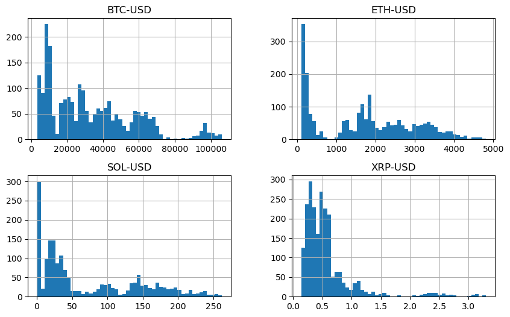
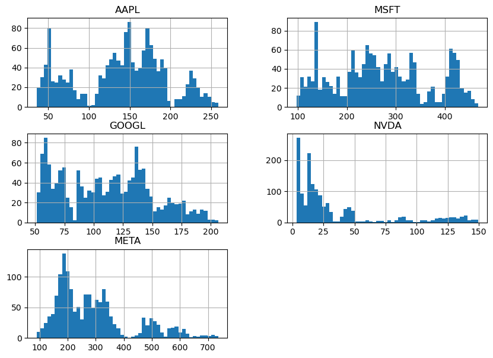
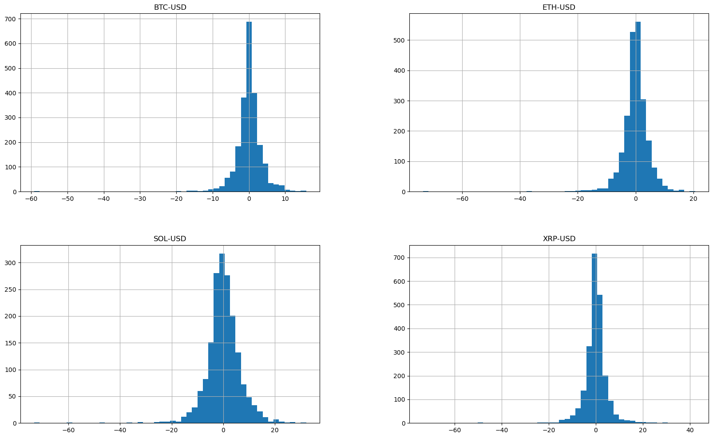
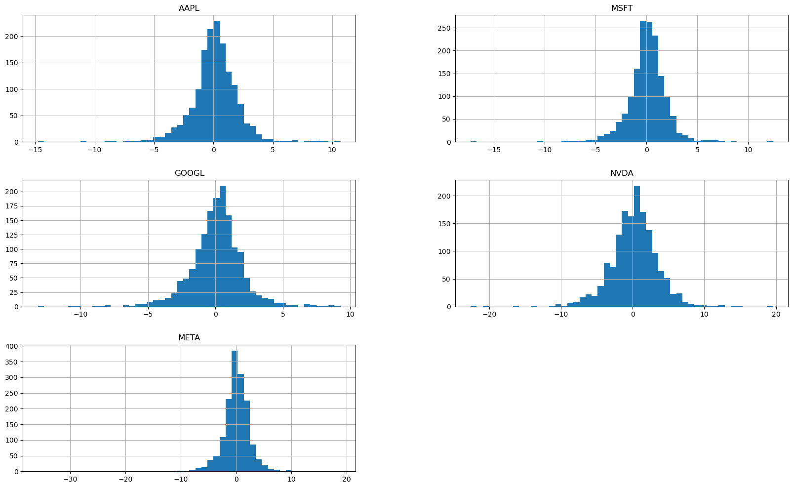

# Домашняя работа № 1

1. *Создать git-репозиторий, где будет храниться исходный код вашего проекта. Если вы используете приватный репозиторий – дайте преподавателям курса доступ к нему, для возможности проверки ДЗ.*
2. *Добавить файл лицензии, который отражает ваш взгляд на конфиденциальность информации, которую вы подготовите в рамках данного курса.*
3. *Создать код на Python, который загрузит на ваш локальный компьютер данные о котировках ценных бумаг из списка SnP500 и котировки криптовалют (BTC, ETH, SOL, XRP).*
4. *Поскольку вам предстоит много работать с ними в дальнейшем, подготовьте автоматическое отображение графиков текущей ситуации.*
5. *Проверьте нет ли в данных пропусков или ошибок. Проанализируйте выбросы. Оцените, на самом ли деле это выбросы или реальные данные, с которыми предстоит работать.*


```python
#Подключаем библиотеки

import pandas as pd
import numpy as np
import yfinance as yf
import plotly.graph_objects as go
from scipy import stats
import plotly.express as px

from finrl.config_tickers import SP_500_TICKER
from datetime import date, datetime, timedelta
from plotly.subplots import make_subplots
```

### Загружаем данные с yfinance


```python
TRAIN_START_DATE = '2019-01-01'
TRAIN_END_DATE = '2022-01-01'
TEST_START_DATE = '2022-01-01'
TEST_END_DATE = date.today()

n=5
stock_list = ['AAPL', 'MSFT', 'GOOGL','NVDA','META']#SP_500_TICKER[:n]#DOW_30_TICKER 
crypt_list = ['BTC-USD','ETH-USD','SOL-USD','XRP-USD']
tickers = stock_list + crypt_list
end_date = TEST_END_DATE
start_date = TRAIN_START_DATE

data_df = pd.DataFrame()
num_failures = 0
for tic in tickers:
    temp_df = yf.download(
        tic,
        start=start_date,
        end=end_date,
        proxy=None,
        auto_adjust=False,
    )
    if temp_df.columns.nlevels != 1:
        temp_df.columns = temp_df.columns.droplevel(1)
    temp_df["tic"] = tic
    if tic in stock_list:
        temp_df["type"] = 'stock'
    else:
        temp_df["type"] = 'crypt'
    if len(temp_df) > 0:
        # data_df = data_df.append(temp_df)
        data_df = pd.concat([data_df, temp_df], axis=0)
    else:
        num_failures += 1
        
if num_failures == len(tickers):
    raise ValueError("no data is fetched.")
# reset the index, we want to use numbers as index instead of dates
data_df = data_df.reset_index()
data_df["Date"] = data_df.Date.apply(lambda x: x.strftime("%Y-%m-%d"))

print("Shape of DataFrame: ", data_df.shape)
# print("Display DataFrame: ", data_df.head())

df = data_df.sort_values(by=["tic","Date"]).reset_index(drop=True)

#При необходимости размещаем данные на локальный компьютер
#df.to_csv('Investing_data.csv', index=False)
```

    [*********************100%***********************]  1 of 1 completed
    [*********************100%***********************]  1 of 1 completed
    [*********************100%***********************]  1 of 1 completed
    [*********************100%***********************]  1 of 1 completed
    [*********************100%***********************]  1 of 1 completed
    [*********************100%***********************]  1 of 1 completed
    [*********************100%***********************]  1 of 1 completed
    [*********************100%***********************]  1 of 1 completed
    [*********************100%***********************]  1 of 1 completed

    Shape of DataFrame:  (16275, 9)
    

    
    


```python
#По умолчанию показываю графики за последние 6 мес

def draw_prices_timeline(func_list, title):
    
    # Добавление линий для каждой акции/крипты
    for ticker in func_list:
        fig.add_trace(go.Scatter(x=df[df['tic']==ticker]['Date'], y=df[df['tic']==ticker]['Close'], name=ticker, visible=True))
    
    # Создание кнопок для переключения графиков
    buttons = []
    
    # Добавление кнопки для отображения всех графиков
    buttons.append(dict(
        label="Все",
        method="update",
        args=[{"visible": [True] * len(tickers)}]
    ))
    
    # Добавление кнопок для отображения отдельных графиков
    for i, ticker in enumerate(func_list):
        visibility = [False] * len(func_list)
        visibility[i] = True
        buttons.append(dict(
            label=ticker,
            method="update",
            args=[{"visible": visibility}]
        ))
    
    # Добавление кнопок на график
    fig.update_layout(
        updatemenus=[
            dict(
                type="dropdown",
                direction="down",
                x=1.2,
                y=1.4,
                showactive=True,
                buttons=buttons
            )
        ],
        title=title,
        xaxis_title="Дата",
        yaxis_title="Цена",
    )
#Отдельно сделала функцию для отображения текущего периода, у меня он 6 месяцев    
def six_month():    
    fig.update_yaxes(autorange=True)
    # Вычисление даты 6 месяцев назад
    six_months_ago = datetime.today() - timedelta(days=180)
    # Настройка оси X для отображения последних 6 месяцев по умолчанию
    fig.update_xaxes(
        range=[six_months_ago, datetime.today()],  # Диапазон по умолчанию
    #    rangeslider_visible=True,  # Добавление ползунка
        rangeselector=dict(
            buttons=list([
                dict(count=1, label="1 мес.", step="month", stepmode="backward"),
                dict(count=6, label="6 мес.", step="month", stepmode="backward"),
                dict(count=1, label="1 год", step="year", stepmode="backward"),
                dict(count=2, label="2 года", step="year", stepmode="backward"),
                dict(step="all", label="Всё")
            ])
        )
    )


# Создание графиков акций
fig = go.Figure()
draw_prices_timeline(stock_list, 'Графики акций')
six_month()
fig.show()
# Создание графиков криптовалют
fig = go.Figure()
draw_prices_timeline(crypt_list, 'Графики криптовалют')
six_month()
fig.show()
```


<div>                            <div id="2bbb8d7d-b97a-433a-829c-01ce52c2ccfb" class="plotly-graph-div" style="height:525px; width:100%;"></div>            <script type="text/javascript">                require(["plotly"], function(Plotly) {                    window.PLOTLYENV=window.PLOTLYENV || {};                                    if (document.getElementById("2bbb8d7d-b97a-433a-829c-01ce52c2ccfb")) {                    Plotly.newPlot(                        "2bbb8d7d-b97a-433a-829c-01ce52c2ccfb",                        [{"name":"AAPL","visible":true,"x":["2019-01-02","2019-01-03","2019-01-04","2019-01-07","2019-01-08","2019-01-09","2019-01-10","2019-01-11","2019-01-14","2019-01-15","2019-01-16","2019-01-17","2019-01-18","2019-01-22","2019-01-23","2019-01-24","2019-01-25","2019-01-28","2019-01-29","2019-01-30","2019-01-31","2019-02-01","2019-02-04","2019-02-05","2019-02-06","2019-02-07","2019-02-08","2019-02-11","2019-02-12","2019-02-13","2019-02-14","2019-02-15","2019-02-19","2019-02-20","2019-02-21","2019-02-22","2019-02-25","2019-02-26","2019-02-27","2019-02-28","2019-03-01","2019-03-04","2019-03-05","2019-03-06","2019-03-07","2019-03-08","2019-03-11","2019-03-12","2019-03-13","2019-03-14","2019-03-15","2019-03-18","2019-03-19","2019-03-20","2019-03-21","2019-03-22","2019-03-25","2019-03-26","2019-03-27","2019-03-28","2019-03-29","2019-04-01","2019-04-02","2019-04-03","2019-04-04","2019-04-05","2019-04-08","2019-04-09","2019-04-10","2019-04-11","2019-04-12","2019-04-15","2019-04-16","2019-04-17","2019-04-18","2019-04-22","2019-04-23","2019-04-24","2019-04-25","2019-04-26","2019-04-29","2019-04-30","2019-05-01","2019-05-02","2019-05-03","2019-05-06","2019-05-07","2019-05-08","2019-05-09","2019-05-10","2019-05-13","2019-05-14","2019-05-15","2019-05-16","2019-05-17","2019-05-20","2019-05-21","2019-05-22","2019-05-23","2019-05-24","2019-05-28","2019-05-29","2019-05-30","2019-05-31","2019-06-03","2019-06-04","2019-06-05","2019-06-06","2019-06-07","2019-06-10","2019-06-11","2019-06-12","2019-06-13","2019-06-14","2019-06-17","2019-06-18","2019-06-19","2019-06-20","2019-06-21","2019-06-24","2019-06-25","2019-06-26","2019-06-27","2019-06-28","2019-07-01","2019-07-02","2019-07-03","2019-07-05","2019-07-08","2019-07-09","2019-07-10","2019-07-11","2019-07-12","2019-07-15","2019-07-16","2019-07-17","2019-07-18","2019-07-19","2019-07-22","2019-07-23","2019-07-24","2019-07-25","2019-07-26","2019-07-29","2019-07-30","2019-07-31","2019-08-01","2019-08-02","2019-08-05","2019-08-06","2019-08-07","2019-08-08","2019-08-09","2019-08-12","2019-08-13","2019-08-14","2019-08-15","2019-08-16","2019-08-19","2019-08-20","2019-08-21","2019-08-22","2019-08-23","2019-08-26","2019-08-27","2019-08-28","2019-08-29","2019-08-30","2019-09-03","2019-09-04","2019-09-05","2019-09-06","2019-09-09","2019-09-10","2019-09-11","2019-09-12","2019-09-13","2019-09-16","2019-09-17","2019-09-18","2019-09-19","2019-09-20","2019-09-23","2019-09-24","2019-09-25","2019-09-26","2019-09-27","2019-09-30","2019-10-01","2019-10-02","2019-10-03","2019-10-04","2019-10-07","2019-10-08","2019-10-09","2019-10-10","2019-10-11","2019-10-14","2019-10-15","2019-10-16","2019-10-17","2019-10-18","2019-10-21","2019-10-22","2019-10-23","2019-10-24","2019-10-25","2019-10-28","2019-10-29","2019-10-30","2019-10-31","2019-11-01","2019-11-04","2019-11-05","2019-11-06","2019-11-07","2019-11-08","2019-11-11","2019-11-12","2019-11-13","2019-11-14","2019-11-15","2019-11-18","2019-11-19","2019-11-20","2019-11-21","2019-11-22","2019-11-25","2019-11-26","2019-11-27","2019-11-29","2019-12-02","2019-12-03","2019-12-04","2019-12-05","2019-12-06","2019-12-09","2019-12-10","2019-12-11","2019-12-12","2019-12-13","2019-12-16","2019-12-17","2019-12-18","2019-12-19","2019-12-20","2019-12-23","2019-12-24","2019-12-26","2019-12-27","2019-12-30","2019-12-31","2020-01-02","2020-01-03","2020-01-06","2020-01-07","2020-01-08","2020-01-09","2020-01-10","2020-01-13","2020-01-14","2020-01-15","2020-01-16","2020-01-17","2020-01-21","2020-01-22","2020-01-23","2020-01-24","2020-01-27","2020-01-28","2020-01-29","2020-01-30","2020-01-31","2020-02-03","2020-02-04","2020-02-05","2020-02-06","2020-02-07","2020-02-10","2020-02-11","2020-02-12","2020-02-13","2020-02-14","2020-02-18","2020-02-19","2020-02-20","2020-02-21","2020-02-24","2020-02-25","2020-02-26","2020-02-27","2020-02-28","2020-03-02","2020-03-03","2020-03-04","2020-03-05","2020-03-06","2020-03-09","2020-03-10","2020-03-11","2020-03-12","2020-03-13","2020-03-16","2020-03-17","2020-03-18","2020-03-19","2020-03-20","2020-03-23","2020-03-24","2020-03-25","2020-03-26","2020-03-27","2020-03-30","2020-03-31","2020-04-01","2020-04-02","2020-04-03","2020-04-06","2020-04-07","2020-04-08","2020-04-09","2020-04-13","2020-04-14","2020-04-15","2020-04-16","2020-04-17","2020-04-20","2020-04-21","2020-04-22","2020-04-23","2020-04-24","2020-04-27","2020-04-28","2020-04-29","2020-04-30","2020-05-01","2020-05-04","2020-05-05","2020-05-06","2020-05-07","2020-05-08","2020-05-11","2020-05-12","2020-05-13","2020-05-14","2020-05-15","2020-05-18","2020-05-19","2020-05-20","2020-05-21","2020-05-22","2020-05-26","2020-05-27","2020-05-28","2020-05-29","2020-06-01","2020-06-02","2020-06-03","2020-06-04","2020-06-05","2020-06-08","2020-06-09","2020-06-10","2020-06-11","2020-06-12","2020-06-15","2020-06-16","2020-06-17","2020-06-18","2020-06-19","2020-06-22","2020-06-23","2020-06-24","2020-06-25","2020-06-26","2020-06-29","2020-06-30","2020-07-01","2020-07-02","2020-07-06","2020-07-07","2020-07-08","2020-07-09","2020-07-10","2020-07-13","2020-07-14","2020-07-15","2020-07-16","2020-07-17","2020-07-20","2020-07-21","2020-07-22","2020-07-23","2020-07-24","2020-07-27","2020-07-28","2020-07-29","2020-07-30","2020-07-31","2020-08-03","2020-08-04","2020-08-05","2020-08-06","2020-08-07","2020-08-10","2020-08-11","2020-08-12","2020-08-13","2020-08-14","2020-08-17","2020-08-18","2020-08-19","2020-08-20","2020-08-21","2020-08-24","2020-08-25","2020-08-26","2020-08-27","2020-08-28","2020-08-31","2020-09-01","2020-09-02","2020-09-03","2020-09-04","2020-09-08","2020-09-09","2020-09-10","2020-09-11","2020-09-14","2020-09-15","2020-09-16","2020-09-17","2020-09-18","2020-09-21","2020-09-22","2020-09-23","2020-09-24","2020-09-25","2020-09-28","2020-09-29","2020-09-30","2020-10-01","2020-10-02","2020-10-05","2020-10-06","2020-10-07","2020-10-08","2020-10-09","2020-10-12","2020-10-13","2020-10-14","2020-10-15","2020-10-16","2020-10-19","2020-10-20","2020-10-21","2020-10-22","2020-10-23","2020-10-26","2020-10-27","2020-10-28","2020-10-29","2020-10-30","2020-11-02","2020-11-03","2020-11-04","2020-11-05","2020-11-06","2020-11-09","2020-11-10","2020-11-11","2020-11-12","2020-11-13","2020-11-16","2020-11-17","2020-11-18","2020-11-19","2020-11-20","2020-11-23","2020-11-24","2020-11-25","2020-11-27","2020-11-30","2020-12-01","2020-12-02","2020-12-03","2020-12-04","2020-12-07","2020-12-08","2020-12-09","2020-12-10","2020-12-11","2020-12-14","2020-12-15","2020-12-16","2020-12-17","2020-12-18","2020-12-21","2020-12-22","2020-12-23","2020-12-24","2020-12-28","2020-12-29","2020-12-30","2020-12-31","2021-01-04","2021-01-05","2021-01-06","2021-01-07","2021-01-08","2021-01-11","2021-01-12","2021-01-13","2021-01-14","2021-01-15","2021-01-19","2021-01-20","2021-01-21","2021-01-22","2021-01-25","2021-01-26","2021-01-27","2021-01-28","2021-01-29","2021-02-01","2021-02-02","2021-02-03","2021-02-04","2021-02-05","2021-02-08","2021-02-09","2021-02-10","2021-02-11","2021-02-12","2021-02-16","2021-02-17","2021-02-18","2021-02-19","2021-02-22","2021-02-23","2021-02-24","2021-02-25","2021-02-26","2021-03-01","2021-03-02","2021-03-03","2021-03-04","2021-03-05","2021-03-08","2021-03-09","2021-03-10","2021-03-11","2021-03-12","2021-03-15","2021-03-16","2021-03-17","2021-03-18","2021-03-19","2021-03-22","2021-03-23","2021-03-24","2021-03-25","2021-03-26","2021-03-29","2021-03-30","2021-03-31","2021-04-01","2021-04-05","2021-04-06","2021-04-07","2021-04-08","2021-04-09","2021-04-12","2021-04-13","2021-04-14","2021-04-15","2021-04-16","2021-04-19","2021-04-20","2021-04-21","2021-04-22","2021-04-23","2021-04-26","2021-04-27","2021-04-28","2021-04-29","2021-04-30","2021-05-03","2021-05-04","2021-05-05","2021-05-06","2021-05-07","2021-05-10","2021-05-11","2021-05-12","2021-05-13","2021-05-14","2021-05-17","2021-05-18","2021-05-19","2021-05-20","2021-05-21","2021-05-24","2021-05-25","2021-05-26","2021-05-27","2021-05-28","2021-06-01","2021-06-02","2021-06-03","2021-06-04","2021-06-07","2021-06-08","2021-06-09","2021-06-10","2021-06-11","2021-06-14","2021-06-15","2021-06-16","2021-06-17","2021-06-18","2021-06-21","2021-06-22","2021-06-23","2021-06-24","2021-06-25","2021-06-28","2021-06-29","2021-06-30","2021-07-01","2021-07-02","2021-07-06","2021-07-07","2021-07-08","2021-07-09","2021-07-12","2021-07-13","2021-07-14","2021-07-15","2021-07-16","2021-07-19","2021-07-20","2021-07-21","2021-07-22","2021-07-23","2021-07-26","2021-07-27","2021-07-28","2021-07-29","2021-07-30","2021-08-02","2021-08-03","2021-08-04","2021-08-05","2021-08-06","2021-08-09","2021-08-10","2021-08-11","2021-08-12","2021-08-13","2021-08-16","2021-08-17","2021-08-18","2021-08-19","2021-08-20","2021-08-23","2021-08-24","2021-08-25","2021-08-26","2021-08-27","2021-08-30","2021-08-31","2021-09-01","2021-09-02","2021-09-03","2021-09-07","2021-09-08","2021-09-09","2021-09-10","2021-09-13","2021-09-14","2021-09-15","2021-09-16","2021-09-17","2021-09-20","2021-09-21","2021-09-22","2021-09-23","2021-09-24","2021-09-27","2021-09-28","2021-09-29","2021-09-30","2021-10-01","2021-10-04","2021-10-05","2021-10-06","2021-10-07","2021-10-08","2021-10-11","2021-10-12","2021-10-13","2021-10-14","2021-10-15","2021-10-18","2021-10-19","2021-10-20","2021-10-21","2021-10-22","2021-10-25","2021-10-26","2021-10-27","2021-10-28","2021-10-29","2021-11-01","2021-11-02","2021-11-03","2021-11-04","2021-11-05","2021-11-08","2021-11-09","2021-11-10","2021-11-11","2021-11-12","2021-11-15","2021-11-16","2021-11-17","2021-11-18","2021-11-19","2021-11-22","2021-11-23","2021-11-24","2021-11-26","2021-11-29","2021-11-30","2021-12-01","2021-12-02","2021-12-03","2021-12-06","2021-12-07","2021-12-08","2021-12-09","2021-12-10","2021-12-13","2021-12-14","2021-12-15","2021-12-16","2021-12-17","2021-12-20","2021-12-21","2021-12-22","2021-12-23","2021-12-27","2021-12-28","2021-12-29","2021-12-30","2021-12-31","2022-01-03","2022-01-04","2022-01-05","2022-01-06","2022-01-07","2022-01-10","2022-01-11","2022-01-12","2022-01-13","2022-01-14","2022-01-18","2022-01-19","2022-01-20","2022-01-21","2022-01-24","2022-01-25","2022-01-26","2022-01-27","2022-01-28","2022-01-31","2022-02-01","2022-02-02","2022-02-03","2022-02-04","2022-02-07","2022-02-08","2022-02-09","2022-02-10","2022-02-11","2022-02-14","2022-02-15","2022-02-16","2022-02-17","2022-02-18","2022-02-22","2022-02-23","2022-02-24","2022-02-25","2022-02-28","2022-03-01","2022-03-02","2022-03-03","2022-03-04","2022-03-07","2022-03-08","2022-03-09","2022-03-10","2022-03-11","2022-03-14","2022-03-15","2022-03-16","2022-03-17","2022-03-18","2022-03-21","2022-03-22","2022-03-23","2022-03-24","2022-03-25","2022-03-28","2022-03-29","2022-03-30","2022-03-31","2022-04-01","2022-04-04","2022-04-05","2022-04-06","2022-04-07","2022-04-08","2022-04-11","2022-04-12","2022-04-13","2022-04-14","2022-04-18","2022-04-19","2022-04-20","2022-04-21","2022-04-22","2022-04-25","2022-04-26","2022-04-27","2022-04-28","2022-04-29","2022-05-02","2022-05-03","2022-05-04","2022-05-05","2022-05-06","2022-05-09","2022-05-10","2022-05-11","2022-05-12","2022-05-13","2022-05-16","2022-05-17","2022-05-18","2022-05-19","2022-05-20","2022-05-23","2022-05-24","2022-05-25","2022-05-26","2022-05-27","2022-05-31","2022-06-01","2022-06-02","2022-06-03","2022-06-06","2022-06-07","2022-06-08","2022-06-09","2022-06-10","2022-06-13","2022-06-14","2022-06-15","2022-06-16","2022-06-17","2022-06-21","2022-06-22","2022-06-23","2022-06-24","2022-06-27","2022-06-28","2022-06-29","2022-06-30","2022-07-01","2022-07-05","2022-07-06","2022-07-07","2022-07-08","2022-07-11","2022-07-12","2022-07-13","2022-07-14","2022-07-15","2022-07-18","2022-07-19","2022-07-20","2022-07-21","2022-07-22","2022-07-25","2022-07-26","2022-07-27","2022-07-28","2022-07-29","2022-08-01","2022-08-02","2022-08-03","2022-08-04","2022-08-05","2022-08-08","2022-08-09","2022-08-10","2022-08-11","2022-08-12","2022-08-15","2022-08-16","2022-08-17","2022-08-18","2022-08-19","2022-08-22","2022-08-23","2022-08-24","2022-08-25","2022-08-26","2022-08-29","2022-08-30","2022-08-31","2022-09-01","2022-09-02","2022-09-06","2022-09-07","2022-09-08","2022-09-09","2022-09-12","2022-09-13","2022-09-14","2022-09-15","2022-09-16","2022-09-19","2022-09-20","2022-09-21","2022-09-22","2022-09-23","2022-09-26","2022-09-27","2022-09-28","2022-09-29","2022-09-30","2022-10-03","2022-10-04","2022-10-05","2022-10-06","2022-10-07","2022-10-10","2022-10-11","2022-10-12","2022-10-13","2022-10-14","2022-10-17","2022-10-18","2022-10-19","2022-10-20","2022-10-21","2022-10-24","2022-10-25","2022-10-26","2022-10-27","2022-10-28","2022-10-31","2022-11-01","2022-11-02","2022-11-03","2022-11-04","2022-11-07","2022-11-08","2022-11-09","2022-11-10","2022-11-11","2022-11-14","2022-11-15","2022-11-16","2022-11-17","2022-11-18","2022-11-21","2022-11-22","2022-11-23","2022-11-25","2022-11-28","2022-11-29","2022-11-30","2022-12-01","2022-12-02","2022-12-05","2022-12-06","2022-12-07","2022-12-08","2022-12-09","2022-12-12","2022-12-13","2022-12-14","2022-12-15","2022-12-16","2022-12-19","2022-12-20","2022-12-21","2022-12-22","2022-12-23","2022-12-27","2022-12-28","2022-12-29","2022-12-30","2023-01-03","2023-01-04","2023-01-05","2023-01-06","2023-01-09","2023-01-10","2023-01-11","2023-01-12","2023-01-13","2023-01-17","2023-01-18","2023-01-19","2023-01-20","2023-01-23","2023-01-24","2023-01-25","2023-01-26","2023-01-27","2023-01-30","2023-01-31","2023-02-01","2023-02-02","2023-02-03","2023-02-06","2023-02-07","2023-02-08","2023-02-09","2023-02-10","2023-02-13","2023-02-14","2023-02-15","2023-02-16","2023-02-17","2023-02-21","2023-02-22","2023-02-23","2023-02-24","2023-02-27","2023-02-28","2023-03-01","2023-03-02","2023-03-03","2023-03-06","2023-03-07","2023-03-08","2023-03-09","2023-03-10","2023-03-13","2023-03-14","2023-03-15","2023-03-16","2023-03-17","2023-03-20","2023-03-21","2023-03-22","2023-03-23","2023-03-24","2023-03-27","2023-03-28","2023-03-29","2023-03-30","2023-03-31","2023-04-03","2023-04-04","2023-04-05","2023-04-06","2023-04-10","2023-04-11","2023-04-12","2023-04-13","2023-04-14","2023-04-17","2023-04-18","2023-04-19","2023-04-20","2023-04-21","2023-04-24","2023-04-25","2023-04-26","2023-04-27","2023-04-28","2023-05-01","2023-05-02","2023-05-03","2023-05-04","2023-05-05","2023-05-08","2023-05-09","2023-05-10","2023-05-11","2023-05-12","2023-05-15","2023-05-16","2023-05-17","2023-05-18","2023-05-19","2023-05-22","2023-05-23","2023-05-24","2023-05-25","2023-05-26","2023-05-30","2023-05-31","2023-06-01","2023-06-02","2023-06-05","2023-06-06","2023-06-07","2023-06-08","2023-06-09","2023-06-12","2023-06-13","2023-06-14","2023-06-15","2023-06-16","2023-06-20","2023-06-21","2023-06-22","2023-06-23","2023-06-26","2023-06-27","2023-06-28","2023-06-29","2023-06-30","2023-07-03","2023-07-05","2023-07-06","2023-07-07","2023-07-10","2023-07-11","2023-07-12","2023-07-13","2023-07-14","2023-07-17","2023-07-18","2023-07-19","2023-07-20","2023-07-21","2023-07-24","2023-07-25","2023-07-26","2023-07-27","2023-07-28","2023-07-31","2023-08-01","2023-08-02","2023-08-03","2023-08-04","2023-08-07","2023-08-08","2023-08-09","2023-08-10","2023-08-11","2023-08-14","2023-08-15","2023-08-16","2023-08-17","2023-08-18","2023-08-21","2023-08-22","2023-08-23","2023-08-24","2023-08-25","2023-08-28","2023-08-29","2023-08-30","2023-08-31","2023-09-01","2023-09-05","2023-09-06","2023-09-07","2023-09-08","2023-09-11","2023-09-12","2023-09-13","2023-09-14","2023-09-15","2023-09-18","2023-09-19","2023-09-20","2023-09-21","2023-09-22","2023-09-25","2023-09-26","2023-09-27","2023-09-28","2023-09-29","2023-10-02","2023-10-03","2023-10-04","2023-10-05","2023-10-06","2023-10-09","2023-10-10","2023-10-11","2023-10-12","2023-10-13","2023-10-16","2023-10-17","2023-10-18","2023-10-19","2023-10-20","2023-10-23","2023-10-24","2023-10-25","2023-10-26","2023-10-27","2023-10-30","2023-10-31","2023-11-01","2023-11-02","2023-11-03","2023-11-06","2023-11-07","2023-11-08","2023-11-09","2023-11-10","2023-11-13","2023-11-14","2023-11-15","2023-11-16","2023-11-17","2023-11-20","2023-11-21","2023-11-22","2023-11-24","2023-11-27","2023-11-28","2023-11-29","2023-11-30","2023-12-01","2023-12-04","2023-12-05","2023-12-06","2023-12-07","2023-12-08","2023-12-11","2023-12-12","2023-12-13","2023-12-14","2023-12-15","2023-12-18","2023-12-19","2023-12-20","2023-12-21","2023-12-22","2023-12-26","2023-12-27","2023-12-28","2023-12-29","2024-01-02","2024-01-03","2024-01-04","2024-01-05","2024-01-08","2024-01-09","2024-01-10","2024-01-11","2024-01-12","2024-01-16","2024-01-17","2024-01-18","2024-01-19","2024-01-22","2024-01-23","2024-01-24","2024-01-25","2024-01-26","2024-01-29","2024-01-30","2024-01-31","2024-02-01","2024-02-02","2024-02-05","2024-02-06","2024-02-07","2024-02-08","2024-02-09","2024-02-12","2024-02-13","2024-02-14","2024-02-15","2024-02-16","2024-02-20","2024-02-21","2024-02-22","2024-02-23","2024-02-26","2024-02-27","2024-02-28","2024-02-29","2024-03-01","2024-03-04","2024-03-05","2024-03-06","2024-03-07","2024-03-08","2024-03-11","2024-03-12","2024-03-13","2024-03-14","2024-03-15","2024-03-18","2024-03-19","2024-03-20","2024-03-21","2024-03-22","2024-03-25","2024-03-26","2024-03-27","2024-03-28","2024-04-01","2024-04-02","2024-04-03","2024-04-04","2024-04-05","2024-04-08","2024-04-09","2024-04-10","2024-04-11","2024-04-12","2024-04-15","2024-04-16","2024-04-17","2024-04-18","2024-04-19","2024-04-22","2024-04-23","2024-04-24","2024-04-25","2024-04-26","2024-04-29","2024-04-30","2024-05-01","2024-05-02","2024-05-03","2024-05-06","2024-05-07","2024-05-08","2024-05-09","2024-05-10","2024-05-13","2024-05-14","2024-05-15","2024-05-16","2024-05-17","2024-05-20","2024-05-21","2024-05-22","2024-05-23","2024-05-24","2024-05-28","2024-05-29","2024-05-30","2024-05-31","2024-06-03","2024-06-04","2024-06-05","2024-06-06","2024-06-07","2024-06-10","2024-06-11","2024-06-12","2024-06-13","2024-06-14","2024-06-17","2024-06-18","2024-06-20","2024-06-21","2024-06-24","2024-06-25","2024-06-26","2024-06-27","2024-06-28","2024-07-01","2024-07-02","2024-07-03","2024-07-05","2024-07-08","2024-07-09","2024-07-10","2024-07-11","2024-07-12","2024-07-15","2024-07-16","2024-07-17","2024-07-18","2024-07-19","2024-07-22","2024-07-23","2024-07-24","2024-07-25","2024-07-26","2024-07-29","2024-07-30","2024-07-31","2024-08-01","2024-08-02","2024-08-05","2024-08-06","2024-08-07","2024-08-08","2024-08-09","2024-08-12","2024-08-13","2024-08-14","2024-08-15","2024-08-16","2024-08-19","2024-08-20","2024-08-21","2024-08-22","2024-08-23","2024-08-26","2024-08-27","2024-08-28","2024-08-29","2024-08-30","2024-09-03","2024-09-04","2024-09-05","2024-09-06","2024-09-09","2024-09-10","2024-09-11","2024-09-12","2024-09-13","2024-09-16","2024-09-17","2024-09-18","2024-09-19","2024-09-20","2024-09-23","2024-09-24","2024-09-25","2024-09-26","2024-09-27","2024-09-30","2024-10-01","2024-10-02","2024-10-03","2024-10-04","2024-10-07","2024-10-08","2024-10-09","2024-10-10","2024-10-11","2024-10-14","2024-10-15","2024-10-16","2024-10-17","2024-10-18","2024-10-21","2024-10-22","2024-10-23","2024-10-24","2024-10-25","2024-10-28","2024-10-29","2024-10-30","2024-10-31","2024-11-01","2024-11-04","2024-11-05","2024-11-06","2024-11-07","2024-11-08","2024-11-11","2024-11-12","2024-11-13","2024-11-14","2024-11-15","2024-11-18","2024-11-19","2024-11-20","2024-11-21","2024-11-22","2024-11-25","2024-11-26","2024-11-27","2024-11-29","2024-12-02","2024-12-03","2024-12-04","2024-12-05","2024-12-06","2024-12-09","2024-12-10","2024-12-11","2024-12-12","2024-12-13","2024-12-16","2024-12-17","2024-12-18","2024-12-19","2024-12-20","2024-12-23","2024-12-24","2024-12-26","2024-12-27","2024-12-30","2024-12-31","2025-01-02","2025-01-03","2025-01-06","2025-01-07","2025-01-08","2025-01-10","2025-01-13","2025-01-14","2025-01-15","2025-01-16","2025-01-17","2025-01-21","2025-01-22","2025-01-23","2025-01-24","2025-01-27","2025-01-28","2025-01-29","2025-01-30","2025-01-31","2025-02-03","2025-02-04","2025-02-05","2025-02-06","2025-02-07","2025-02-10","2025-02-11","2025-02-12","2025-02-13","2025-02-14","2025-02-18","2025-02-19","2025-02-20","2025-02-21","2025-02-24","2025-02-25","2025-02-26","2025-02-27"],"y":[39.47999954223633,35.54750061035156,37.064998626708984,36.98249816894531,37.6875,38.32749938964844,38.45000076293945,38.0724983215332,37.5,38.26750183105469,38.73500061035156,38.96500015258789,39.20500183105469,38.32500076293945,38.47999954223633,38.17499923706055,39.439998626708984,39.07500076293945,38.66999816894531,41.3125,41.61000061035156,41.630001068115234,42.8125,43.54499816894531,43.560001373291016,42.73500061035156,42.602500915527344,42.35749816894531,42.72249984741211,42.54499816894531,42.70000076293945,42.60499954223633,42.73249816894531,43.00749969482422,42.76499938964844,43.24250030517578,43.557498931884766,43.58250045776367,43.717498779296875,43.287498474121094,43.74250030517578,43.962501525878906,43.88249969482422,43.630001068115234,43.125,43.227500915527344,44.724998474121094,45.227500915527344,45.4275016784668,45.932498931884766,46.529998779296875,47.005001068115234,46.63249969482422,47.040000915527344,48.772499084472656,47.76250076293945,47.185001373291016,46.6974983215332,47.11750030517578,47.18000030517578,47.48749923706055,47.810001373291016,48.505001068115234,48.837501525878906,48.92250061035156,49.25,50.025001525878906,49.875,50.154998779296875,49.73749923706055,49.717498779296875,49.807498931884766,49.8125,50.782501220703125,50.96500015258789,51.13249969482422,51.869998931884766,51.790000915527344,51.31999969482422,51.07500076293945,51.15250015258789,50.16749954223633,52.630001068115234,52.287498474121094,52.9375,52.119998931884766,50.71500015258789,50.724998474121094,50.18000030517578,49.29499816894531,46.43000030517578,47.165000915527344,47.72999954223633,47.52000045776367,47.25,45.772499084472656,46.650001525878906,45.69499969482422,44.915000915527344,44.74250030517578,44.557498931884766,44.345001220703125,44.57500076293945,43.76750183105469,43.32500076293945,44.90999984741211,45.6349983215332,46.30500030517578,47.537498474121094,48.14500045776367,48.70249938964844,48.54750061035156,48.537498474121094,48.185001373291016,48.47249984741211,49.61249923706055,49.467498779296875,49.8650016784668,49.69499969482422,49.64500045776367,48.89250183105469,49.95000076293945,49.935001373291016,49.47999954223633,50.38750076293945,50.682498931884766,51.102500915527344,51.057498931884766,50.005001068115234,50.310001373291016,50.807498931884766,50.4375,50.82500076293945,51.3025016784668,51.125,50.837501525878906,51.415000915527344,50.647499084472656,51.80500030517578,52.209999084472656,52.16749954223633,51.755001068115234,51.935001373291016,52.41999816894531,52.19499969482422,53.2599983215332,52.10749816894531,51.005001068115234,48.334999084472656,49.25,49.7599983215332,50.85749816894531,50.247501373291016,50.119998931884766,52.24250030517578,50.6875,50.435001373291016,51.625,52.587501525878906,52.59000015258789,53.15999984741211,53.1150016784668,50.65999984741211,51.622501373291016,51.040000915527344,51.38249969482422,52.252498626708984,52.185001373291016,51.42499923706055,52.29750061035156,53.31999969482422,53.314998626708984,53.54249954223633,54.17499923706055,55.897499084472656,55.772499084472656,54.6875,54.974998474121094,55.17499923706055,55.692501068115234,55.2400016784668,54.432498931884766,54.68000030517578,54.41999816894531,55.25749969482422,54.97249984741211,54.70500183105469,55.99250030517578,56.147499084472656,54.7400016784668,55.20500183105469,56.752498626708984,56.76499938964844,56.099998474121094,56.75749969482422,57.522499084472656,59.0525016784668,58.967498779296875,58.83000183105469,58.592498779296875,58.81999969482422,59.102500915527344,60.127498626708984,59.9900016784668,60.79499816894531,60.89500045776367,61.64500045776367,62.26250076293945,60.8224983215332,60.814998626708984,62.189998626708984,63.95500183105469,64.375,64.28250122070312,64.30999755859375,64.85749816894531,65.03500366210938,65.55000305175781,65.48999786376953,66.11750030517578,65.66000366210938,66.44000244140625,66.7750015258789,66.57250213623047,65.79750061035156,65.50250244140625,65.44499969482422,66.59249877929688,66.07250213623047,66.95999908447266,66.8125,66.04000091552734,64.86250305175781,65.43499755859375,66.3949966430664,67.67749786376953,66.7300033569336,67.12000274658203,67.69249725341797,67.86499786376953,68.7874984741211,69.96499633789062,70.10250091552734,69.93499755859375,70.00499725341797,69.86000061035156,71.0,71.06749725341797,72.47750091552734,72.44999694824219,72.87999725341797,73.4124984741211,75.0875015258789,74.35749816894531,74.94999694824219,74.59750366210938,75.79750061035156,77.40750122070312,77.5824966430664,79.23999786376953,78.16999816894531,77.83499908447266,78.80999755859375,79.68250274658203,79.14250183105469,79.42500305175781,79.80750274658203,79.57749938964844,77.23750305175781,79.42250061035156,81.08499908447266,80.96749877929688,77.37750244140625,77.16500091552734,79.7125015258789,80.36250305175781,81.30249786376953,80.00749969482422,80.38749694824219,79.90249633789062,81.80000305175781,81.21749877929688,81.23750305175781,79.75,80.90499877929688,80.07499694824219,78.26249694824219,74.54499816894531,72.0199966430664,73.1624984741211,68.37999725341797,68.33999633789062,74.70249938964844,72.33000183105469,75.68499755859375,73.2300033569336,72.25749969482422,66.5425033569336,71.33499908447266,68.85749816894531,62.057498931884766,69.49250030517578,60.5525016784668,63.21500015258789,61.66749954223633,61.19499969482422,57.310001373291016,56.092498779296875,61.720001220703125,61.380001068115234,64.61000061035156,61.935001373291016,63.70249938964844,63.5724983215332,60.227500915527344,61.23249816894531,60.352500915527344,65.61750030517578,64.85749816894531,66.51750183105469,66.99749755859375,68.3125,71.76249694824219,71.10749816894531,71.67250061035156,70.69999694824219,69.23249816894531,67.09249877929688,69.0250015258789,68.75749969482422,70.74250030517578,70.7925033569336,69.6449966430664,71.93250274658203,73.44999694824219,72.26750183105469,73.29000091552734,74.38999938964844,75.15750122070312,75.93499755859375,77.53250122070312,78.75250244140625,77.85250091552734,76.9124984741211,77.38500213623047,76.92749786376953,78.73999786376953,78.28500366210938,79.80750274658203,79.2125015258789,79.72250366210938,79.18250274658203,79.52749633789062,79.5625,79.48500061035156,80.4625015258789,80.83499908447266,81.27999877929688,80.58000183105469,82.875,83.36499786376953,85.99749755859375,88.20999908447266,83.9749984741211,84.69999694824219,85.74749755859375,88.0199966430664,87.89749908447266,87.93250274658203,87.43000030517578,89.71749877929688,91.63249969482422,90.01499938964844,91.20999908447266,88.40750122070312,90.44499969482422,91.19999694824219,91.02749633789062,91.02749633789062,93.4625015258789,93.17250061035156,95.34249877929688,95.75250244140625,95.91999816894531,95.47750091552734,97.05750274658203,97.7249984741211,96.52249908447266,96.32749938964844,98.35749816894531,97.0,97.27249908447266,92.84500122070312,92.61499786376953,94.80999755859375,93.25250244140625,95.04000091552734,96.19000244140625,106.26000213623047,108.9375,109.66500091552734,110.0625,113.90249633789062,111.11250305175781,112.72750091552734,109.375,113.01000213623047,115.01000213623047,114.90750122070312,114.60749816894531,115.5625,115.7074966430664,118.2750015258789,124.37000274658203,125.85749816894531,124.82499694824219,126.52249908447266,125.01000213623047,124.80750274658203,129.0399932861328,134.17999267578125,131.39999389648438,120.87999725341797,120.95999908447266,112.81999969482422,117.31999969482422,113.48999786376953,112.0,115.36000061035156,115.54000091552734,112.12999725341797,110.33999633789062,106.83999633789062,110.08000183105469,111.80999755859375,107.12000274658203,108.22000122070312,112.27999877929688,114.95999908447266,114.08999633789062,115.80999755859375,116.79000091552734,113.0199966430664,116.5,113.16000366210938,115.08000183105469,114.97000122070312,116.97000122070312,124.4000015258789,121.0999984741211,121.19000244140625,120.70999908447266,119.0199966430664,115.9800033569336,117.51000213623047,116.87000274658203,115.75,115.04000091552734,115.05000305175781,116.5999984741211,111.19999694824219,115.31999969482422,108.86000061035156,108.7699966430664,110.44000244140625,114.94999694824219,119.02999877929688,118.69000244140625,116.31999969482422,115.97000122070312,119.48999786376953,119.20999908447266,119.26000213623047,120.30000305175781,119.38999938964844,118.02999877929688,118.63999938964844,117.33999633789062,113.8499984741211,115.16999816894531,116.02999877929688,116.58999633789062,119.05000305175781,122.72000122070312,123.08000183105469,122.94000244140625,122.25,123.75,124.37999725341797,121.77999877929688,123.23999786376953,122.41000366210938,121.77999877929688,127.87999725341797,127.80999755859375,128.6999969482422,126.66000366210938,128.22999572753906,131.8800048828125,130.9600067138672,131.97000122070312,136.69000244140625,134.8699951171875,133.72000122070312,132.69000244140625,129.41000366210938,131.00999450683594,126.5999984741211,130.9199981689453,132.0500030517578,128.97999572753906,128.8000030517578,130.88999938964844,128.91000366210938,127.13999938964844,127.83000183105469,132.02999877929688,136.8699951171875,139.07000732421875,142.9199981689453,143.16000366210938,142.05999755859375,137.08999633789062,131.9600067138672,134.13999938964844,134.99000549316406,133.94000244140625,137.38999938964844,136.75999450683594,136.91000366210938,136.00999450683594,135.38999938964844,135.1300048828125,135.3699951171875,133.19000244140625,130.83999633789062,129.7100067138672,129.8699951171875,126.0,125.86000061035156,125.3499984741211,120.98999786376953,121.26000213623047,127.79000091552734,125.12000274658203,122.05999755859375,120.12999725341797,121.41999816894531,116.36000061035156,121.08999633789062,119.9800033569336,121.95999908447266,121.02999877929688,123.98999786376953,125.56999969482422,124.76000213623047,120.52999877929688,119.98999786376953,123.38999938964844,122.54000091552734,120.08999633789062,120.58999633789062,121.20999908447266,121.38999938964844,119.9000015258789,122.1500015258789,123.0,125.9000015258789,126.20999908447266,127.9000015258789,130.36000061035156,133.0,131.24000549316406,134.42999267578125,132.02999877929688,134.5,134.16000366210938,134.83999633789062,133.11000061035156,133.5,131.94000244140625,134.32000732421875,134.72000122070312,134.38999938964844,133.5800018310547,133.47999572753906,131.4600067138672,132.5399932861328,127.8499984741211,128.10000610351562,129.74000549316406,130.2100067138672,126.8499984741211,125.91000366210938,122.7699966430664,124.97000122070312,127.44999694824219,126.2699966430664,124.8499984741211,124.69000244140625,127.30999755859375,125.43000030517578,127.0999984741211,126.9000015258789,126.8499984741211,125.27999877929688,124.61000061035156,124.27999877929688,125.05999755859375,123.54000091552734,125.88999938964844,125.9000015258789,126.73999786376953,127.12999725341797,126.11000061035156,127.3499984741211,130.47999572753906,129.63999938964844,130.14999389648438,131.7899932861328,130.4600067138672,132.3000030517578,133.97999572753906,133.6999969482422,133.41000366210938,133.11000061035156,134.77999877929688,136.3300018310547,136.9600067138672,137.27000427246094,139.9600067138672,142.02000427246094,144.57000732421875,143.24000549316406,145.11000061035156,144.5,145.63999938964844,149.14999389648438,148.47999572753906,146.38999938964844,142.4499969482422,146.14999389648438,145.39999389648438,146.8000030517578,148.55999755859375,148.99000549316406,146.77000427246094,144.97999572753906,145.63999938964844,145.86000061035156,145.52000427246094,147.36000061035156,146.9499969482422,147.05999755859375,146.13999938964844,146.08999633789062,145.60000610351562,145.86000061035156,148.88999938964844,149.10000610351562,151.1199951171875,150.19000244140625,146.36000061035156,146.6999969482422,148.19000244140625,149.7100067138672,149.6199951171875,148.36000061035156,147.5399932861328,148.60000610351562,153.1199951171875,151.8300018310547,152.50999450683594,153.64999389648438,154.3000030517578,156.69000244140625,155.11000061035156,154.07000732421875,148.97000122070312,149.5500030517578,148.1199951171875,149.02999877929688,148.7899932861328,146.05999755859375,142.94000244140625,143.42999267578125,145.85000610351562,146.8300018310547,146.9199981689453,145.3699951171875,141.91000366210938,142.8300018310547,141.5,142.64999389648438,139.13999938964844,141.11000061035156,142.0,143.2899932861328,142.89999389648438,142.80999755859375,141.50999450683594,140.91000366210938,143.75999450683594,144.83999633789062,146.5500030517578,148.75999450683594,149.25999450683594,149.47999572753906,148.69000244140625,148.63999938964844,149.32000732421875,148.85000610351562,152.57000732421875,149.8000030517578,148.9600067138672,150.02000427246094,151.49000549316406,150.9600067138672,151.27999877929688,150.44000244140625,150.80999755859375,147.9199981689453,147.8699951171875,149.99000549316406,150.0,151.0,153.49000549316406,157.8699951171875,160.5500030517578,161.02000427246094,161.41000366210938,161.94000244140625,156.80999755859375,160.24000549316406,165.3000030517578,164.77000427246094,163.75999450683594,161.83999633789062,165.32000732421875,171.17999267578125,175.0800018310547,174.55999755859375,179.4499969482422,175.74000549316406,174.3300018310547,179.3000030517578,172.25999450683594,171.13999938964844,169.75,172.99000549316406,175.63999938964844,176.27999877929688,180.3300018310547,179.2899932861328,179.3800048828125,178.1999969482422,177.57000732421875,182.00999450683594,179.6999969482422,174.9199981689453,172.0,172.1699981689453,172.19000244140625,175.0800018310547,175.52999877929688,172.19000244140625,173.07000732421875,169.8000030517578,166.22999572753906,164.50999450683594,162.41000366210938,161.6199951171875,159.77999877929688,159.69000244140625,159.22000122070312,170.3300018310547,174.77999877929688,174.61000061035156,175.83999633789062,172.89999389648438,172.38999938964844,171.66000366210938,174.8300018310547,176.27999877929688,172.1199951171875,168.63999938964844,168.8800048828125,172.7899932861328,172.5500030517578,168.8800048828125,167.3000030517578,164.32000732421875,160.07000732421875,162.74000549316406,164.85000610351562,165.1199951171875,163.1999969482422,166.55999755859375,166.22999572753906,163.1699981689453,159.3000030517578,157.44000244140625,162.9499969482422,158.52000427246094,154.72999572753906,150.6199951171875,155.08999633789062,159.58999633789062,160.6199951171875,163.97999572753906,165.3800048828125,168.82000732421875,170.2100067138672,174.07000732421875,174.72000122070312,175.60000610351562,178.9600067138672,177.77000427246094,174.61000061035156,174.30999755859375,178.44000244140625,175.05999755859375,171.8300018310547,172.13999938964844,170.08999633789062,165.75,167.66000366210938,170.39999389648438,165.2899932861328,165.07000732421875,167.39999389648438,167.22999572753906,166.4199981689453,161.7899932861328,162.8800048828125,156.8000030517578,156.57000732421875,163.63999938964844,157.64999389648438,157.9600067138672,159.47999572753906,166.02000427246094,156.77000427246094,157.27999877929688,152.05999755859375,154.50999450683594,146.5,142.55999755859375,147.11000061035156,145.5399932861328,149.24000549316406,140.82000732421875,137.35000610351562,137.58999633789062,143.11000061035156,140.36000061035156,140.52000427246094,143.77999877929688,149.63999938964844,148.83999633789062,148.7100067138672,151.2100067138672,145.3800048828125,146.13999938964844,148.7100067138672,147.9600067138672,142.63999938964844,137.1300048828125,131.8800048828125,132.75999450683594,135.42999267578125,130.05999755859375,131.55999755859375,135.8699951171875,135.35000610351562,138.27000427246094,141.66000366210938,141.66000366210938,137.44000244140625,139.22999572753906,136.72000122070312,138.92999267578125,141.55999755859375,142.9199981689453,146.35000610351562,147.0399932861328,144.8699951171875,145.86000061035156,145.49000549316406,148.47000122070312,150.1699981689453,147.07000732421875,151.0,153.0399932861328,155.35000610351562,154.08999633789062,152.9499969482422,151.60000610351562,156.7899932861328,157.35000610351562,162.50999450683594,161.50999450683594,160.00999450683594,166.1300048828125,165.80999755859375,165.35000610351562,164.8699951171875,164.9199981689453,169.24000549316406,168.49000549316406,172.10000610351562,173.19000244140625,173.02999877929688,174.5500030517578,174.14999389648438,171.52000427246094,167.57000732421875,167.22999572753906,167.52999877929688,170.02999877929688,163.6199951171875,161.3800048828125,158.91000366210938,157.22000122070312,157.9600067138672,155.80999755859375,154.52999877929688,155.9600067138672,154.4600067138672,157.3699951171875,163.42999267578125,153.83999633789062,155.30999755859375,152.3699951171875,150.6999969482422,154.47999572753906,156.89999389648438,153.72000122070312,152.74000549316406,150.42999267578125,150.77000427246094,151.75999450683594,149.83999633789062,142.47999572753906,138.1999969482422,142.4499969482422,146.10000610351562,146.39999389648438,145.42999267578125,140.08999633789062,140.4199981689453,138.97999572753906,138.33999633789062,142.99000549316406,138.3800048828125,142.41000366210938,143.75,143.86000061035156,143.38999938964844,147.27000427246094,149.4499969482422,152.33999633789062,149.35000610351562,144.8000030517578,155.74000549316406,153.33999633789062,150.64999389648438,145.02999877929688,138.8800048828125,138.3800048828125,138.9199981689453,139.5,134.8699951171875,146.8699951171875,149.6999969482422,148.27999877929688,150.0399932861328,148.7899932861328,150.72000122070312,151.2899932861328,148.00999450683594,150.17999267578125,151.07000732421875,148.11000061035156,144.22000122070312,141.1699981689453,148.02999877929688,148.30999755859375,147.80999755859375,146.6300048828125,142.91000366210938,140.94000244140625,142.64999389648438,142.16000366210938,144.49000549316406,145.47000122070312,143.2100067138672,136.5,134.50999450683594,132.3699951171875,132.3000030517578,135.4499969482422,132.22999572753906,131.86000061035156,130.02999877929688,126.04000091552734,129.61000061035156,129.92999267578125,125.06999969482422,126.36000061035156,125.0199966430664,129.6199951171875,130.14999389648438,130.72999572753906,133.49000549316406,133.41000366210938,134.75999450683594,135.94000244140625,135.2100067138672,135.27000427246094,137.8699951171875,141.11000061035156,142.52999877929688,141.86000061035156,143.9600067138672,145.92999267578125,143.0,144.2899932861328,145.42999267578125,150.82000732421875,154.5,151.72999572753906,154.64999389648438,151.9199981689453,150.8699951171875,151.00999450683594,153.85000610351562,153.1999969482422,155.3300018310547,153.7100067138672,152.5500030517578,148.47999572753906,148.91000366210938,149.39999389648438,146.7100067138672,147.9199981689453,147.41000366210938,145.30999755859375,145.91000366210938,151.02999877929688,153.8300018310547,151.60000610351562,152.8699951171875,150.58999633789062,148.5,150.47000122070312,152.58999633789062,152.99000549316406,155.85000610351562,155.0,157.39999389648438,159.27999877929688,157.8300018310547,158.92999267578125,160.25,158.27999877929688,157.64999389648438,160.77000427246094,162.36000061035156,164.89999389648438,166.1699981689453,165.6300048828125,163.75999450683594,164.66000366210938,162.02999877929688,160.8000030517578,160.10000610351562,165.55999755859375,165.2100067138672,165.22999572753906,166.47000122070312,167.6300048828125,166.64999389648438,165.02000427246094,165.3300018310547,163.77000427246094,163.75999450683594,168.41000366210938,169.67999267578125,169.58999633789062,168.5399932861328,167.4499969482422,165.7899932861328,173.57000732421875,173.5,171.77000427246094,173.55999755859375,173.75,172.57000732421875,172.07000732421875,172.07000732421875,172.69000244140625,175.0500030517578,175.16000366210938,174.1999969482422,171.55999755859375,171.83999633789062,172.99000549316406,175.42999267578125,177.3000030517578,177.25,180.08999633789062,180.9499969482422,179.5800018310547,179.2100067138672,177.82000732421875,180.57000732421875,180.9600067138672,183.7899932861328,183.30999755859375,183.9499969482422,186.00999450683594,184.9199981689453,185.00999450683594,183.9600067138672,187.0,186.67999267578125,185.27000427246094,188.05999755859375,189.25,189.58999633789062,193.97000122070312,192.4600067138672,191.3300018310547,191.80999755859375,190.67999267578125,188.61000061035156,188.0800018310547,189.77000427246094,190.5399932861328,190.69000244140625,193.99000549316406,193.72999572753906,195.10000610351562,193.1300048828125,191.94000244140625,192.75,193.6199951171875,194.5,193.22000122070312,195.8300018310547,196.4499969482422,195.61000061035156,192.5800018310547,191.1699981689453,181.99000549316406,178.85000610351562,179.8000030517578,178.19000244140625,177.97000122070312,177.7899932861328,179.4600067138672,177.4499969482422,176.57000732421875,174.0,174.49000549316406,175.83999633789062,177.22999572753906,181.1199951171875,176.3800048828125,178.61000061035156,180.19000244140625,184.1199951171875,187.64999389648438,187.8699951171875,189.4600067138672,189.6999969482422,182.91000366210938,177.55999755859375,178.17999267578125,179.36000061035156,176.3000030517578,174.2100067138672,175.74000549316406,175.00999450683594,177.97000122070312,179.07000732421875,175.49000549316406,173.92999267578125,174.7899932861328,176.0800018310547,171.9600067138672,170.42999267578125,170.69000244140625,171.2100067138672,173.75,172.39999389648438,173.66000366210938,174.91000366210938,177.49000549316406,178.99000549316406,178.38999938964844,179.8000030517578,180.7100067138672,178.85000610351562,178.72000122070312,177.14999389648438,175.83999633789062,175.4600067138672,172.8800048828125,173.0,173.44000244140625,171.10000610351562,166.88999938964844,168.22000122070312,170.2899932861328,170.77000427246094,173.97000122070312,177.57000732421875,176.64999389648438,179.22999572753906,181.82000732421875,182.88999938964844,182.41000366210938,186.39999389648438,184.8000030517578,187.44000244140625,188.00999450683594,189.7100067138672,189.69000244140625,191.4499969482422,190.63999938964844,191.30999755859375,189.97000122070312,189.7899932861328,190.39999389648438,189.3699951171875,189.9499969482422,191.24000549316406,189.42999267578125,193.4199981689453,192.32000732421875,194.27000427246094,195.7100067138672,193.17999267578125,194.7100067138672,197.9600067138672,198.11000061035156,197.57000732421875,195.88999938964844,196.94000244140625,194.8300018310547,194.67999267578125,193.60000610351562,193.0500030517578,193.14999389648438,193.5800018310547,192.52999877929688,185.63999938964844,184.25,181.91000366210938,181.17999267578125,185.55999755859375,185.13999938964844,186.19000244140625,185.58999633789062,185.9199981689453,183.6300048828125,182.67999267578125,188.6300048828125,191.55999755859375,193.88999938964844,195.17999267578125,194.5,194.1699981689453,192.4199981689453,191.72999572753906,188.0399932861328,184.39999389648438,186.86000061035156,185.85000610351562,187.67999267578125,189.3000030517578,189.41000366210938,188.32000732421875,188.85000610351562,187.14999389648438,185.0399932861328,184.14999389648438,183.86000061035156,182.30999755859375,181.55999755859375,182.32000732421875,184.3699951171875,182.52000427246094,181.16000366210938,182.6300048828125,181.4199981689453,180.75,179.66000366210938,175.10000610351562,170.1199951171875,169.1199951171875,169.0,170.72999572753906,172.75,173.22999572753906,171.1300048828125,173.0,172.6199951171875,173.72000122070312,176.0800018310547,178.6699981689453,171.3699951171875,172.27999877929688,170.85000610351562,169.7100067138672,173.30999755859375,171.47999572753906,170.02999877929688,168.83999633789062,169.64999389648438,168.82000732421875,169.5800018310547,168.4499969482422,169.6699981689453,167.77999877929688,175.0399932861328,176.5500030517578,172.69000244140625,169.3800048828125,168.0,167.0399932861328,165.0,165.83999633789062,166.89999389648438,169.02000427246094,169.88999938964844,169.3000030517578,173.5,170.3300018310547,169.3000030517578,173.02999877929688,183.3800048828125,181.7100067138672,182.39999389648438,182.74000549316406,184.57000732421875,183.0500030517578,186.27999877929688,187.42999267578125,189.72000122070312,189.83999633789062,189.8699951171875,191.0399932861328,192.35000610351562,190.89999389648438,186.8800048828125,189.97999572753906,189.99000549316406,190.2899932861328,191.2899932861328,192.25,194.02999877929688,194.35000610351562,195.8699951171875,194.47999572753906,196.88999938964844,193.1199951171875,207.14999389648438,213.07000732421875,214.24000549316406,212.49000549316406,216.6699981689453,214.2899932861328,209.67999267578125,207.49000549316406,208.13999938964844,209.07000732421875,213.25,214.10000610351562,210.6199951171875,216.75,220.27000427246094,221.5500030517578,226.33999633789062,227.82000732421875,228.67999267578125,232.97999572753906,227.57000732421875,230.5399932861328,234.39999389648438,234.82000732421875,228.8800048828125,224.17999267578125,224.30999755859375,223.9600067138672,225.00999450683594,218.5399932861328,217.49000549316406,217.9600067138672,218.24000549316406,218.8000030517578,222.0800018310547,218.36000061035156,219.86000061035156,209.27000427246094,207.22999572753906,209.82000732421875,213.30999755859375,216.24000549316406,217.52999877929688,221.27000427246094,221.72000122070312,224.72000122070312,226.0500030517578,225.88999938964844,226.50999450683594,226.39999389648438,224.52999877929688,226.83999633789062,227.17999267578125,228.02999877929688,226.49000549316406,229.7899932861328,229.0,222.77000427246094,220.85000610351562,222.3800048828125,220.82000732421875,220.91000366210938,220.11000061035156,222.66000366210938,222.77000427246094,222.5,216.32000732421875,216.7899932861328,220.69000244140625,228.8699951171875,228.1999969482422,226.47000122070312,227.3699951171875,226.3699951171875,227.52000427246094,227.7899932861328,233.0,226.2100067138672,226.77999877929688,225.6699981689453,226.8000030517578,221.69000244140625,225.77000427246094,229.5399932861328,229.0399932861328,227.5500030517578,231.3000030517578,233.85000610351562,231.77999877929688,232.14999389648438,235.0,236.47999572753906,235.86000061035156,230.75999450683594,230.57000732421875,231.41000366210938,233.39999389648438,233.6699981689453,230.10000610351562,225.91000366210938,222.91000366210938,222.00999450683594,223.4499969482422,222.72000122070312,227.47999572753906,226.9600067138672,224.22999572753906,224.22999572753906,225.1199951171875,228.22000122070312,225.0,228.02000427246094,228.27999877929688,229.0,228.52000427246094,229.8699951171875,232.8699951171875,235.05999755859375,234.92999267578125,237.3300018310547,239.58999633789062,242.64999389648438,243.00999450683594,243.0399932861328,242.83999633789062,246.75,247.77000427246094,246.49000549316406,247.9600067138672,248.1300048828125,251.0399932861328,253.47999572753906,248.0500030517578,249.7899932861328,254.49000549316406,255.27000427246094,258.20001220703125,259.0199890136719,255.58999633789062,252.1999969482422,250.4199981689453,243.85000610351562,243.36000061035156,245.0,242.2100067138672,242.6999969482422,236.85000610351562,234.39999389648438,233.27999877929688,237.8699951171875,228.25999450683594,229.97999572753906,222.63999938964844,223.8300018310547,223.66000366210938,222.77999877929688,229.86000061035156,238.25999450683594,239.36000061035156,237.58999633789062,236.0,228.00999450683594,232.8000030517578,232.47000122070312,233.22000122070312,227.6300048828125,227.64999389648438,232.6199951171875,236.8699951171875,241.52999877929688,244.60000610351562,244.47000122070312,244.8699951171875,245.8300018310547,245.5500030517578,247.10000610351562,247.0399932861328,240.36000061035156,237.3000030517578],"type":"scatter"},{"name":"MSFT","visible":true,"x":["2019-01-02","2019-01-03","2019-01-04","2019-01-07","2019-01-08","2019-01-09","2019-01-10","2019-01-11","2019-01-14","2019-01-15","2019-01-16","2019-01-17","2019-01-18","2019-01-22","2019-01-23","2019-01-24","2019-01-25","2019-01-28","2019-01-29","2019-01-30","2019-01-31","2019-02-01","2019-02-04","2019-02-05","2019-02-06","2019-02-07","2019-02-08","2019-02-11","2019-02-12","2019-02-13","2019-02-14","2019-02-15","2019-02-19","2019-02-20","2019-02-21","2019-02-22","2019-02-25","2019-02-26","2019-02-27","2019-02-28","2019-03-01","2019-03-04","2019-03-05","2019-03-06","2019-03-07","2019-03-08","2019-03-11","2019-03-12","2019-03-13","2019-03-14","2019-03-15","2019-03-18","2019-03-19","2019-03-20","2019-03-21","2019-03-22","2019-03-25","2019-03-26","2019-03-27","2019-03-28","2019-03-29","2019-04-01","2019-04-02","2019-04-03","2019-04-04","2019-04-05","2019-04-08","2019-04-09","2019-04-10","2019-04-11","2019-04-12","2019-04-15","2019-04-16","2019-04-17","2019-04-18","2019-04-22","2019-04-23","2019-04-24","2019-04-25","2019-04-26","2019-04-29","2019-04-30","2019-05-01","2019-05-02","2019-05-03","2019-05-06","2019-05-07","2019-05-08","2019-05-09","2019-05-10","2019-05-13","2019-05-14","2019-05-15","2019-05-16","2019-05-17","2019-05-20","2019-05-21","2019-05-22","2019-05-23","2019-05-24","2019-05-28","2019-05-29","2019-05-30","2019-05-31","2019-06-03","2019-06-04","2019-06-05","2019-06-06","2019-06-07","2019-06-10","2019-06-11","2019-06-12","2019-06-13","2019-06-14","2019-06-17","2019-06-18","2019-06-19","2019-06-20","2019-06-21","2019-06-24","2019-06-25","2019-06-26","2019-06-27","2019-06-28","2019-07-01","2019-07-02","2019-07-03","2019-07-05","2019-07-08","2019-07-09","2019-07-10","2019-07-11","2019-07-12","2019-07-15","2019-07-16","2019-07-17","2019-07-18","2019-07-19","2019-07-22","2019-07-23","2019-07-24","2019-07-25","2019-07-26","2019-07-29","2019-07-30","2019-07-31","2019-08-01","2019-08-02","2019-08-05","2019-08-06","2019-08-07","2019-08-08","2019-08-09","2019-08-12","2019-08-13","2019-08-14","2019-08-15","2019-08-16","2019-08-19","2019-08-20","2019-08-21","2019-08-22","2019-08-23","2019-08-26","2019-08-27","2019-08-28","2019-08-29","2019-08-30","2019-09-03","2019-09-04","2019-09-05","2019-09-06","2019-09-09","2019-09-10","2019-09-11","2019-09-12","2019-09-13","2019-09-16","2019-09-17","2019-09-18","2019-09-19","2019-09-20","2019-09-23","2019-09-24","2019-09-25","2019-09-26","2019-09-27","2019-09-30","2019-10-01","2019-10-02","2019-10-03","2019-10-04","2019-10-07","2019-10-08","2019-10-09","2019-10-10","2019-10-11","2019-10-14","2019-10-15","2019-10-16","2019-10-17","2019-10-18","2019-10-21","2019-10-22","2019-10-23","2019-10-24","2019-10-25","2019-10-28","2019-10-29","2019-10-30","2019-10-31","2019-11-01","2019-11-04","2019-11-05","2019-11-06","2019-11-07","2019-11-08","2019-11-11","2019-11-12","2019-11-13","2019-11-14","2019-11-15","2019-11-18","2019-11-19","2019-11-20","2019-11-21","2019-11-22","2019-11-25","2019-11-26","2019-11-27","2019-11-29","2019-12-02","2019-12-03","2019-12-04","2019-12-05","2019-12-06","2019-12-09","2019-12-10","2019-12-11","2019-12-12","2019-12-13","2019-12-16","2019-12-17","2019-12-18","2019-12-19","2019-12-20","2019-12-23","2019-12-24","2019-12-26","2019-12-27","2019-12-30","2019-12-31","2020-01-02","2020-01-03","2020-01-06","2020-01-07","2020-01-08","2020-01-09","2020-01-10","2020-01-13","2020-01-14","2020-01-15","2020-01-16","2020-01-17","2020-01-21","2020-01-22","2020-01-23","2020-01-24","2020-01-27","2020-01-28","2020-01-29","2020-01-30","2020-01-31","2020-02-03","2020-02-04","2020-02-05","2020-02-06","2020-02-07","2020-02-10","2020-02-11","2020-02-12","2020-02-13","2020-02-14","2020-02-18","2020-02-19","2020-02-20","2020-02-21","2020-02-24","2020-02-25","2020-02-26","2020-02-27","2020-02-28","2020-03-02","2020-03-03","2020-03-04","2020-03-05","2020-03-06","2020-03-09","2020-03-10","2020-03-11","2020-03-12","2020-03-13","2020-03-16","2020-03-17","2020-03-18","2020-03-19","2020-03-20","2020-03-23","2020-03-24","2020-03-25","2020-03-26","2020-03-27","2020-03-30","2020-03-31","2020-04-01","2020-04-02","2020-04-03","2020-04-06","2020-04-07","2020-04-08","2020-04-09","2020-04-13","2020-04-14","2020-04-15","2020-04-16","2020-04-17","2020-04-20","2020-04-21","2020-04-22","2020-04-23","2020-04-24","2020-04-27","2020-04-28","2020-04-29","2020-04-30","2020-05-01","2020-05-04","2020-05-05","2020-05-06","2020-05-07","2020-05-08","2020-05-11","2020-05-12","2020-05-13","2020-05-14","2020-05-15","2020-05-18","2020-05-19","2020-05-20","2020-05-21","2020-05-22","2020-05-26","2020-05-27","2020-05-28","2020-05-29","2020-06-01","2020-06-02","2020-06-03","2020-06-04","2020-06-05","2020-06-08","2020-06-09","2020-06-10","2020-06-11","2020-06-12","2020-06-15","2020-06-16","2020-06-17","2020-06-18","2020-06-19","2020-06-22","2020-06-23","2020-06-24","2020-06-25","2020-06-26","2020-06-29","2020-06-30","2020-07-01","2020-07-02","2020-07-06","2020-07-07","2020-07-08","2020-07-09","2020-07-10","2020-07-13","2020-07-14","2020-07-15","2020-07-16","2020-07-17","2020-07-20","2020-07-21","2020-07-22","2020-07-23","2020-07-24","2020-07-27","2020-07-28","2020-07-29","2020-07-30","2020-07-31","2020-08-03","2020-08-04","2020-08-05","2020-08-06","2020-08-07","2020-08-10","2020-08-11","2020-08-12","2020-08-13","2020-08-14","2020-08-17","2020-08-18","2020-08-19","2020-08-20","2020-08-21","2020-08-24","2020-08-25","2020-08-26","2020-08-27","2020-08-28","2020-08-31","2020-09-01","2020-09-02","2020-09-03","2020-09-04","2020-09-08","2020-09-09","2020-09-10","2020-09-11","2020-09-14","2020-09-15","2020-09-16","2020-09-17","2020-09-18","2020-09-21","2020-09-22","2020-09-23","2020-09-24","2020-09-25","2020-09-28","2020-09-29","2020-09-30","2020-10-01","2020-10-02","2020-10-05","2020-10-06","2020-10-07","2020-10-08","2020-10-09","2020-10-12","2020-10-13","2020-10-14","2020-10-15","2020-10-16","2020-10-19","2020-10-20","2020-10-21","2020-10-22","2020-10-23","2020-10-26","2020-10-27","2020-10-28","2020-10-29","2020-10-30","2020-11-02","2020-11-03","2020-11-04","2020-11-05","2020-11-06","2020-11-09","2020-11-10","2020-11-11","2020-11-12","2020-11-13","2020-11-16","2020-11-17","2020-11-18","2020-11-19","2020-11-20","2020-11-23","2020-11-24","2020-11-25","2020-11-27","2020-11-30","2020-12-01","2020-12-02","2020-12-03","2020-12-04","2020-12-07","2020-12-08","2020-12-09","2020-12-10","2020-12-11","2020-12-14","2020-12-15","2020-12-16","2020-12-17","2020-12-18","2020-12-21","2020-12-22","2020-12-23","2020-12-24","2020-12-28","2020-12-29","2020-12-30","2020-12-31","2021-01-04","2021-01-05","2021-01-06","2021-01-07","2021-01-08","2021-01-11","2021-01-12","2021-01-13","2021-01-14","2021-01-15","2021-01-19","2021-01-20","2021-01-21","2021-01-22","2021-01-25","2021-01-26","2021-01-27","2021-01-28","2021-01-29","2021-02-01","2021-02-02","2021-02-03","2021-02-04","2021-02-05","2021-02-08","2021-02-09","2021-02-10","2021-02-11","2021-02-12","2021-02-16","2021-02-17","2021-02-18","2021-02-19","2021-02-22","2021-02-23","2021-02-24","2021-02-25","2021-02-26","2021-03-01","2021-03-02","2021-03-03","2021-03-04","2021-03-05","2021-03-08","2021-03-09","2021-03-10","2021-03-11","2021-03-12","2021-03-15","2021-03-16","2021-03-17","2021-03-18","2021-03-19","2021-03-22","2021-03-23","2021-03-24","2021-03-25","2021-03-26","2021-03-29","2021-03-30","2021-03-31","2021-04-01","2021-04-05","2021-04-06","2021-04-07","2021-04-08","2021-04-09","2021-04-12","2021-04-13","2021-04-14","2021-04-15","2021-04-16","2021-04-19","2021-04-20","2021-04-21","2021-04-22","2021-04-23","2021-04-26","2021-04-27","2021-04-28","2021-04-29","2021-04-30","2021-05-03","2021-05-04","2021-05-05","2021-05-06","2021-05-07","2021-05-10","2021-05-11","2021-05-12","2021-05-13","2021-05-14","2021-05-17","2021-05-18","2021-05-19","2021-05-20","2021-05-21","2021-05-24","2021-05-25","2021-05-26","2021-05-27","2021-05-28","2021-06-01","2021-06-02","2021-06-03","2021-06-04","2021-06-07","2021-06-08","2021-06-09","2021-06-10","2021-06-11","2021-06-14","2021-06-15","2021-06-16","2021-06-17","2021-06-18","2021-06-21","2021-06-22","2021-06-23","2021-06-24","2021-06-25","2021-06-28","2021-06-29","2021-06-30","2021-07-01","2021-07-02","2021-07-06","2021-07-07","2021-07-08","2021-07-09","2021-07-12","2021-07-13","2021-07-14","2021-07-15","2021-07-16","2021-07-19","2021-07-20","2021-07-21","2021-07-22","2021-07-23","2021-07-26","2021-07-27","2021-07-28","2021-07-29","2021-07-30","2021-08-02","2021-08-03","2021-08-04","2021-08-05","2021-08-06","2021-08-09","2021-08-10","2021-08-11","2021-08-12","2021-08-13","2021-08-16","2021-08-17","2021-08-18","2021-08-19","2021-08-20","2021-08-23","2021-08-24","2021-08-25","2021-08-26","2021-08-27","2021-08-30","2021-08-31","2021-09-01","2021-09-02","2021-09-03","2021-09-07","2021-09-08","2021-09-09","2021-09-10","2021-09-13","2021-09-14","2021-09-15","2021-09-16","2021-09-17","2021-09-20","2021-09-21","2021-09-22","2021-09-23","2021-09-24","2021-09-27","2021-09-28","2021-09-29","2021-09-30","2021-10-01","2021-10-04","2021-10-05","2021-10-06","2021-10-07","2021-10-08","2021-10-11","2021-10-12","2021-10-13","2021-10-14","2021-10-15","2021-10-18","2021-10-19","2021-10-20","2021-10-21","2021-10-22","2021-10-25","2021-10-26","2021-10-27","2021-10-28","2021-10-29","2021-11-01","2021-11-02","2021-11-03","2021-11-04","2021-11-05","2021-11-08","2021-11-09","2021-11-10","2021-11-11","2021-11-12","2021-11-15","2021-11-16","2021-11-17","2021-11-18","2021-11-19","2021-11-22","2021-11-23","2021-11-24","2021-11-26","2021-11-29","2021-11-30","2021-12-01","2021-12-02","2021-12-03","2021-12-06","2021-12-07","2021-12-08","2021-12-09","2021-12-10","2021-12-13","2021-12-14","2021-12-15","2021-12-16","2021-12-17","2021-12-20","2021-12-21","2021-12-22","2021-12-23","2021-12-27","2021-12-28","2021-12-29","2021-12-30","2021-12-31","2022-01-03","2022-01-04","2022-01-05","2022-01-06","2022-01-07","2022-01-10","2022-01-11","2022-01-12","2022-01-13","2022-01-14","2022-01-18","2022-01-19","2022-01-20","2022-01-21","2022-01-24","2022-01-25","2022-01-26","2022-01-27","2022-01-28","2022-01-31","2022-02-01","2022-02-02","2022-02-03","2022-02-04","2022-02-07","2022-02-08","2022-02-09","2022-02-10","2022-02-11","2022-02-14","2022-02-15","2022-02-16","2022-02-17","2022-02-18","2022-02-22","2022-02-23","2022-02-24","2022-02-25","2022-02-28","2022-03-01","2022-03-02","2022-03-03","2022-03-04","2022-03-07","2022-03-08","2022-03-09","2022-03-10","2022-03-11","2022-03-14","2022-03-15","2022-03-16","2022-03-17","2022-03-18","2022-03-21","2022-03-22","2022-03-23","2022-03-24","2022-03-25","2022-03-28","2022-03-29","2022-03-30","2022-03-31","2022-04-01","2022-04-04","2022-04-05","2022-04-06","2022-04-07","2022-04-08","2022-04-11","2022-04-12","2022-04-13","2022-04-14","2022-04-18","2022-04-19","2022-04-20","2022-04-21","2022-04-22","2022-04-25","2022-04-26","2022-04-27","2022-04-28","2022-04-29","2022-05-02","2022-05-03","2022-05-04","2022-05-05","2022-05-06","2022-05-09","2022-05-10","2022-05-11","2022-05-12","2022-05-13","2022-05-16","2022-05-17","2022-05-18","2022-05-19","2022-05-20","2022-05-23","2022-05-24","2022-05-25","2022-05-26","2022-05-27","2022-05-31","2022-06-01","2022-06-02","2022-06-03","2022-06-06","2022-06-07","2022-06-08","2022-06-09","2022-06-10","2022-06-13","2022-06-14","2022-06-15","2022-06-16","2022-06-17","2022-06-21","2022-06-22","2022-06-23","2022-06-24","2022-06-27","2022-06-28","2022-06-29","2022-06-30","2022-07-01","2022-07-05","2022-07-06","2022-07-07","2022-07-08","2022-07-11","2022-07-12","2022-07-13","2022-07-14","2022-07-15","2022-07-18","2022-07-19","2022-07-20","2022-07-21","2022-07-22","2022-07-25","2022-07-26","2022-07-27","2022-07-28","2022-07-29","2022-08-01","2022-08-02","2022-08-03","2022-08-04","2022-08-05","2022-08-08","2022-08-09","2022-08-10","2022-08-11","2022-08-12","2022-08-15","2022-08-16","2022-08-17","2022-08-18","2022-08-19","2022-08-22","2022-08-23","2022-08-24","2022-08-25","2022-08-26","2022-08-29","2022-08-30","2022-08-31","2022-09-01","2022-09-02","2022-09-06","2022-09-07","2022-09-08","2022-09-09","2022-09-12","2022-09-13","2022-09-14","2022-09-15","2022-09-16","2022-09-19","2022-09-20","2022-09-21","2022-09-22","2022-09-23","2022-09-26","2022-09-27","2022-09-28","2022-09-29","2022-09-30","2022-10-03","2022-10-04","2022-10-05","2022-10-06","2022-10-07","2022-10-10","2022-10-11","2022-10-12","2022-10-13","2022-10-14","2022-10-17","2022-10-18","2022-10-19","2022-10-20","2022-10-21","2022-10-24","2022-10-25","2022-10-26","2022-10-27","2022-10-28","2022-10-31","2022-11-01","2022-11-02","2022-11-03","2022-11-04","2022-11-07","2022-11-08","2022-11-09","2022-11-10","2022-11-11","2022-11-14","2022-11-15","2022-11-16","2022-11-17","2022-11-18","2022-11-21","2022-11-22","2022-11-23","2022-11-25","2022-11-28","2022-11-29","2022-11-30","2022-12-01","2022-12-02","2022-12-05","2022-12-06","2022-12-07","2022-12-08","2022-12-09","2022-12-12","2022-12-13","2022-12-14","2022-12-15","2022-12-16","2022-12-19","2022-12-20","2022-12-21","2022-12-22","2022-12-23","2022-12-27","2022-12-28","2022-12-29","2022-12-30","2023-01-03","2023-01-04","2023-01-05","2023-01-06","2023-01-09","2023-01-10","2023-01-11","2023-01-12","2023-01-13","2023-01-17","2023-01-18","2023-01-19","2023-01-20","2023-01-23","2023-01-24","2023-01-25","2023-01-26","2023-01-27","2023-01-30","2023-01-31","2023-02-01","2023-02-02","2023-02-03","2023-02-06","2023-02-07","2023-02-08","2023-02-09","2023-02-10","2023-02-13","2023-02-14","2023-02-15","2023-02-16","2023-02-17","2023-02-21","2023-02-22","2023-02-23","2023-02-24","2023-02-27","2023-02-28","2023-03-01","2023-03-02","2023-03-03","2023-03-06","2023-03-07","2023-03-08","2023-03-09","2023-03-10","2023-03-13","2023-03-14","2023-03-15","2023-03-16","2023-03-17","2023-03-20","2023-03-21","2023-03-22","2023-03-23","2023-03-24","2023-03-27","2023-03-28","2023-03-29","2023-03-30","2023-03-31","2023-04-03","2023-04-04","2023-04-05","2023-04-06","2023-04-10","2023-04-11","2023-04-12","2023-04-13","2023-04-14","2023-04-17","2023-04-18","2023-04-19","2023-04-20","2023-04-21","2023-04-24","2023-04-25","2023-04-26","2023-04-27","2023-04-28","2023-05-01","2023-05-02","2023-05-03","2023-05-04","2023-05-05","2023-05-08","2023-05-09","2023-05-10","2023-05-11","2023-05-12","2023-05-15","2023-05-16","2023-05-17","2023-05-18","2023-05-19","2023-05-22","2023-05-23","2023-05-24","2023-05-25","2023-05-26","2023-05-30","2023-05-31","2023-06-01","2023-06-02","2023-06-05","2023-06-06","2023-06-07","2023-06-08","2023-06-09","2023-06-12","2023-06-13","2023-06-14","2023-06-15","2023-06-16","2023-06-20","2023-06-21","2023-06-22","2023-06-23","2023-06-26","2023-06-27","2023-06-28","2023-06-29","2023-06-30","2023-07-03","2023-07-05","2023-07-06","2023-07-07","2023-07-10","2023-07-11","2023-07-12","2023-07-13","2023-07-14","2023-07-17","2023-07-18","2023-07-19","2023-07-20","2023-07-21","2023-07-24","2023-07-25","2023-07-26","2023-07-27","2023-07-28","2023-07-31","2023-08-01","2023-08-02","2023-08-03","2023-08-04","2023-08-07","2023-08-08","2023-08-09","2023-08-10","2023-08-11","2023-08-14","2023-08-15","2023-08-16","2023-08-17","2023-08-18","2023-08-21","2023-08-22","2023-08-23","2023-08-24","2023-08-25","2023-08-28","2023-08-29","2023-08-30","2023-08-31","2023-09-01","2023-09-05","2023-09-06","2023-09-07","2023-09-08","2023-09-11","2023-09-12","2023-09-13","2023-09-14","2023-09-15","2023-09-18","2023-09-19","2023-09-20","2023-09-21","2023-09-22","2023-09-25","2023-09-26","2023-09-27","2023-09-28","2023-09-29","2023-10-02","2023-10-03","2023-10-04","2023-10-05","2023-10-06","2023-10-09","2023-10-10","2023-10-11","2023-10-12","2023-10-13","2023-10-16","2023-10-17","2023-10-18","2023-10-19","2023-10-20","2023-10-23","2023-10-24","2023-10-25","2023-10-26","2023-10-27","2023-10-30","2023-10-31","2023-11-01","2023-11-02","2023-11-03","2023-11-06","2023-11-07","2023-11-08","2023-11-09","2023-11-10","2023-11-13","2023-11-14","2023-11-15","2023-11-16","2023-11-17","2023-11-20","2023-11-21","2023-11-22","2023-11-24","2023-11-27","2023-11-28","2023-11-29","2023-11-30","2023-12-01","2023-12-04","2023-12-05","2023-12-06","2023-12-07","2023-12-08","2023-12-11","2023-12-12","2023-12-13","2023-12-14","2023-12-15","2023-12-18","2023-12-19","2023-12-20","2023-12-21","2023-12-22","2023-12-26","2023-12-27","2023-12-28","2023-12-29","2024-01-02","2024-01-03","2024-01-04","2024-01-05","2024-01-08","2024-01-09","2024-01-10","2024-01-11","2024-01-12","2024-01-16","2024-01-17","2024-01-18","2024-01-19","2024-01-22","2024-01-23","2024-01-24","2024-01-25","2024-01-26","2024-01-29","2024-01-30","2024-01-31","2024-02-01","2024-02-02","2024-02-05","2024-02-06","2024-02-07","2024-02-08","2024-02-09","2024-02-12","2024-02-13","2024-02-14","2024-02-15","2024-02-16","2024-02-20","2024-02-21","2024-02-22","2024-02-23","2024-02-26","2024-02-27","2024-02-28","2024-02-29","2024-03-01","2024-03-04","2024-03-05","2024-03-06","2024-03-07","2024-03-08","2024-03-11","2024-03-12","2024-03-13","2024-03-14","2024-03-15","2024-03-18","2024-03-19","2024-03-20","2024-03-21","2024-03-22","2024-03-25","2024-03-26","2024-03-27","2024-03-28","2024-04-01","2024-04-02","2024-04-03","2024-04-04","2024-04-05","2024-04-08","2024-04-09","2024-04-10","2024-04-11","2024-04-12","2024-04-15","2024-04-16","2024-04-17","2024-04-18","2024-04-19","2024-04-22","2024-04-23","2024-04-24","2024-04-25","2024-04-26","2024-04-29","2024-04-30","2024-05-01","2024-05-02","2024-05-03","2024-05-06","2024-05-07","2024-05-08","2024-05-09","2024-05-10","2024-05-13","2024-05-14","2024-05-15","2024-05-16","2024-05-17","2024-05-20","2024-05-21","2024-05-22","2024-05-23","2024-05-24","2024-05-28","2024-05-29","2024-05-30","2024-05-31","2024-06-03","2024-06-04","2024-06-05","2024-06-06","2024-06-07","2024-06-10","2024-06-11","2024-06-12","2024-06-13","2024-06-14","2024-06-17","2024-06-18","2024-06-20","2024-06-21","2024-06-24","2024-06-25","2024-06-26","2024-06-27","2024-06-28","2024-07-01","2024-07-02","2024-07-03","2024-07-05","2024-07-08","2024-07-09","2024-07-10","2024-07-11","2024-07-12","2024-07-15","2024-07-16","2024-07-17","2024-07-18","2024-07-19","2024-07-22","2024-07-23","2024-07-24","2024-07-25","2024-07-26","2024-07-29","2024-07-30","2024-07-31","2024-08-01","2024-08-02","2024-08-05","2024-08-06","2024-08-07","2024-08-08","2024-08-09","2024-08-12","2024-08-13","2024-08-14","2024-08-15","2024-08-16","2024-08-19","2024-08-20","2024-08-21","2024-08-22","2024-08-23","2024-08-26","2024-08-27","2024-08-28","2024-08-29","2024-08-30","2024-09-03","2024-09-04","2024-09-05","2024-09-06","2024-09-09","2024-09-10","2024-09-11","2024-09-12","2024-09-13","2024-09-16","2024-09-17","2024-09-18","2024-09-19","2024-09-20","2024-09-23","2024-09-24","2024-09-25","2024-09-26","2024-09-27","2024-09-30","2024-10-01","2024-10-02","2024-10-03","2024-10-04","2024-10-07","2024-10-08","2024-10-09","2024-10-10","2024-10-11","2024-10-14","2024-10-15","2024-10-16","2024-10-17","2024-10-18","2024-10-21","2024-10-22","2024-10-23","2024-10-24","2024-10-25","2024-10-28","2024-10-29","2024-10-30","2024-10-31","2024-11-01","2024-11-04","2024-11-05","2024-11-06","2024-11-07","2024-11-08","2024-11-11","2024-11-12","2024-11-13","2024-11-14","2024-11-15","2024-11-18","2024-11-19","2024-11-20","2024-11-21","2024-11-22","2024-11-25","2024-11-26","2024-11-27","2024-11-29","2024-12-02","2024-12-03","2024-12-04","2024-12-05","2024-12-06","2024-12-09","2024-12-10","2024-12-11","2024-12-12","2024-12-13","2024-12-16","2024-12-17","2024-12-18","2024-12-19","2024-12-20","2024-12-23","2024-12-24","2024-12-26","2024-12-27","2024-12-30","2024-12-31","2025-01-02","2025-01-03","2025-01-06","2025-01-07","2025-01-08","2025-01-10","2025-01-13","2025-01-14","2025-01-15","2025-01-16","2025-01-17","2025-01-21","2025-01-22","2025-01-23","2025-01-24","2025-01-27","2025-01-28","2025-01-29","2025-01-30","2025-01-31","2025-02-03","2025-02-04","2025-02-05","2025-02-06","2025-02-07","2025-02-10","2025-02-11","2025-02-12","2025-02-13","2025-02-14","2025-02-18","2025-02-19","2025-02-20","2025-02-21","2025-02-24","2025-02-25","2025-02-26","2025-02-27"],"y":[101.12000274658203,97.4000015258789,101.93000030517578,102.05999755859375,102.80000305175781,104.2699966430664,103.5999984741211,102.80000305175781,102.05000305175781,105.01000213623047,105.37999725341797,106.12000274658203,107.70999908447266,105.68000030517578,106.70999908447266,106.19999694824219,107.16999816894531,105.08000183105469,102.94000244140625,106.37999725341797,104.43000030517578,102.77999877929688,105.73999786376953,107.22000122070312,106.02999877929688,105.2699966430664,105.66999816894531,105.25,106.88999938964844,106.80999755859375,106.9000015258789,108.22000122070312,108.16999816894531,107.1500015258789,109.41000366210938,110.97000122070312,111.58999633789062,112.36000061035156,112.16999816894531,112.02999877929688,112.52999877929688,112.26000213623047,111.69999694824219,111.75,110.38999938964844,110.51000213623047,112.83000183105469,113.62000274658203,114.5,114.58999633789062,115.91000366210938,117.56999969482422,117.6500015258789,117.5199966430664,120.22000122070312,117.05000305175781,117.66000366210938,117.91000366210938,116.7699966430664,116.93000030517578,117.94000244140625,119.0199966430664,119.19000244140625,119.97000122070312,119.36000061035156,119.88999938964844,119.93000030517578,119.27999877929688,120.19000244140625,120.33000183105469,120.94999694824219,121.05000305175781,120.7699966430664,121.7699966430664,123.37000274658203,123.76000213623047,125.44000244140625,125.01000213623047,129.14999389648438,129.88999938964844,129.77000427246094,130.60000610351562,127.87999725341797,126.20999908447266,128.89999389648438,128.14999389648438,125.5199966430664,125.51000213623047,125.5,127.12999725341797,123.3499984741211,124.7300033569336,126.0199966430664,128.92999267578125,128.07000732421875,126.22000122070312,126.9000015258789,127.66999816894531,126.18000030517578,126.23999786376953,126.16000366210938,124.94000244140625,125.7300033569336,123.68000030517578,119.83999633789062,123.16000366210938,125.83000183105469,127.81999969482422,131.39999389648438,132.60000610351562,132.10000610351562,131.49000549316406,132.32000732421875,132.4499969482422,132.85000610351562,135.16000366210938,135.69000244140625,136.9499969482422,136.97000122070312,137.77999877929688,133.42999267578125,133.92999267578125,134.14999389648438,133.9600067138672,135.67999267578125,136.5800018310547,137.4600067138672,137.05999755859375,136.9600067138672,136.4600067138672,137.85000610351562,138.39999389648438,138.89999389648438,138.89999389648438,137.0800018310547,136.27000427246094,136.4199981689453,136.6199951171875,138.42999267578125,139.2899932861328,140.72000122070312,140.19000244140625,141.33999633789062,141.02999877929688,140.35000610351562,136.27000427246094,138.05999755859375,136.89999389648438,132.2100067138672,134.69000244140625,135.27999877929688,138.88999938964844,137.7100067138672,135.7899932861328,138.60000610351562,133.97999572753906,133.67999267578125,136.1300048828125,138.41000366210938,137.25999450683594,138.7899932861328,137.77999877929688,133.38999938964844,135.4499969482422,135.74000549316406,135.55999755859375,138.1199951171875,137.86000061035156,136.0399932861328,137.6300048828125,140.0500030517578,139.10000610351562,137.52000427246094,136.0800018310547,136.1199951171875,137.52000427246094,137.32000732421875,136.3300018310547,137.38999938964844,138.52000427246094,141.07000732421875,139.44000244140625,139.13999938964844,137.3800048828125,139.36000061035156,139.5399932861328,137.72999572753906,139.02999877929688,137.07000732421875,134.64999389648438,136.27999877929688,138.1199951171875,137.1199951171875,135.6699981689453,138.24000549316406,139.10000610351562,139.67999267578125,139.5500030517578,141.57000732421875,140.41000366210938,139.69000244140625,137.41000366210938,138.42999267578125,136.3699951171875,137.24000549316406,139.94000244140625,140.72999572753906,144.19000244140625,142.8300018310547,144.61000061035156,143.3699951171875,143.72000122070312,144.5500030517578,144.4600067138672,144.05999755859375,144.25999450683594,145.9600067138672,146.11000061035156,147.07000732421875,147.30999755859375,148.05999755859375,149.97000122070312,150.33999633789062,150.38999938964844,149.6199951171875,149.47999572753906,149.58999633789062,151.22999572753906,152.02999877929688,152.32000732421875,151.3800048828125,149.5500030517578,149.30999755859375,149.85000610351562,149.92999267578125,151.75,151.36000061035156,151.1300048828125,151.6999969482422,153.24000549316406,154.52999877929688,155.52999877929688,154.69000244140625,154.3699951171875,155.7100067138672,157.41000366210938,157.41000366210938,157.3800048828125,158.6699981689453,158.9600067138672,157.58999633789062,157.6999969482422,160.6199951171875,158.6199951171875,159.02999877929688,157.5800018310547,160.08999633789062,162.08999633789062,161.33999633789062,163.27999877929688,162.1300048828125,163.17999267578125,166.1699981689453,167.10000610351562,166.5,165.6999969482422,166.72000122070312,165.0399932861328,162.27999877929688,165.4600067138672,168.0399932861328,172.77999877929688,170.22999572753906,174.3800048828125,180.1199951171875,179.89999389648438,183.6300048828125,183.88999938964844,188.6999969482422,184.44000244140625,184.7100067138672,183.7100067138672,185.35000610351562,187.22999572753906,187.27999877929688,184.4199981689453,178.58999633789062,170.88999938964844,168.07000732421875,170.1699981689453,158.17999267578125,162.00999450683594,172.7899932861328,164.50999450683594,170.5500030517578,166.27000427246094,161.57000732421875,150.6199951171875,160.9199981689453,153.6300048828125,139.05999755859375,158.8300018310547,135.4199981689453,146.57000732421875,140.39999389648438,142.7100067138672,137.35000610351562,135.97999572753906,148.33999633789062,146.9199981689453,156.11000061035156,149.6999969482422,160.22999572753906,157.7100067138672,152.11000061035156,155.25999450683594,153.8300018310547,165.27000427246094,163.49000549316406,165.1300048828125,165.13999938964844,165.50999450683594,173.6999969482422,171.8800048828125,177.0399932861328,178.60000610351562,175.05999755859375,167.82000732421875,173.52000427246094,171.4199981689453,174.5500030517578,174.0500030517578,169.80999755859375,177.42999267578125,179.2100067138672,174.57000732421875,178.83999633789062,180.75999450683594,182.5399932861328,183.60000610351562,184.67999267578125,186.74000549316406,182.50999450683594,179.75,180.52999877929688,183.16000366210938,184.91000366210938,183.6300048828125,185.66000366210938,183.42999267578125,183.50999450683594,181.57000732421875,181.80999755859375,181.39999389648438,183.25,182.8300018310547,184.91000366210938,185.36000061035156,182.9199981689453,187.1999969482422,188.36000061035156,189.8000030517578,196.83999633789062,186.27000427246094,187.74000549316406,188.94000244140625,193.57000732421875,194.24000549316406,196.32000732421875,195.14999389648438,200.57000732421875,201.91000366210938,197.83999633789062,200.33999633789062,196.3300018310547,198.44000244140625,203.50999450683594,204.6999969482422,206.25999450683594,210.6999969482422,208.25,212.8300018310547,214.32000732421875,213.6699981689453,207.07000732421875,208.35000610351562,208.0399932861328,203.9199981689453,202.8800048828125,211.60000610351562,208.75,211.75,202.5399932861328,201.3000030517578,203.85000610351562,202.02000427246094,204.05999755859375,203.89999389648438,205.00999450683594,216.5399932861328,213.2899932861328,212.94000244140625,216.35000610351562,212.47999572753906,208.25,203.3800048828125,209.19000244140625,208.6999969482422,208.89999389648438,210.27999877929688,211.49000549316406,209.6999969482422,214.5800018310547,213.02000427246094,213.69000244140625,216.47000122070312,221.14999389648438,226.5800018310547,228.91000366210938,225.52999877929688,227.27000427246094,231.64999389648438,217.3000030517578,214.25,202.66000366210938,211.2899932861328,205.3699951171875,204.02999877929688,205.41000366210938,208.77999877929688,205.0500030517578,202.91000366210938,200.38999938964844,202.5399932861328,207.4199981689453,200.58999633789062,203.19000244140625,207.82000732421875,209.44000244140625,207.25999450683594,210.3300018310547,212.4600067138672,206.19000244140625,210.3800048828125,205.91000366210938,209.8300018310547,210.5800018310547,215.80999755859375,221.39999389648438,222.86000061035156,220.86000061035156,219.66000366210938,219.66000366210938,214.22000122070312,214.64999389648438,214.8000030517578,214.88999938964844,216.22999572753906,210.0800018310547,213.25,202.67999267578125,204.72000122070312,202.47000122070312,202.3300018310547,206.42999267578125,216.38999938964844,223.2899932861328,223.72000122070312,218.38999938964844,211.00999450683594,216.5500030517578,215.44000244140625,216.50999450683594,217.22999572753906,214.4600067138672,211.0800018310547,212.4199981689453,210.38999938964844,210.11000061035156,213.86000061035156,213.8699951171875,215.22999572753906,214.07000732421875,216.2100067138672,215.3699951171875,214.24000549316406,214.36000061035156,214.2899932861328,216.00999450683594,211.8000030517578,210.52000427246094,213.25999450683594,214.1999969482422,214.1300048828125,219.27999877929688,219.4199981689453,218.58999633789062,222.58999633789062,223.94000244140625,221.02000427246094,222.75,224.9600067138672,224.14999389648438,221.67999267578125,222.4199981689453,217.69000244140625,217.89999389648438,212.25,218.2899932861328,219.6199951171875,217.49000549316406,214.92999267578125,216.33999633789062,213.02000427246094,212.64999389648438,216.44000244140625,224.33999633789062,224.97000122070312,225.9499969482422,229.52999877929688,232.3300018310547,232.89999389648438,238.92999267578125,231.9600067138672,239.64999389648438,239.50999450683594,243.0,242.00999450683594,242.1999969482422,242.47000122070312,243.77000427246094,242.82000732421875,244.49000549316406,244.99000549316406,243.6999969482422,244.1999969482422,243.7899932861328,240.97000122070312,234.50999450683594,233.27000427246094,234.5500030517578,228.99000549316406,232.3800048828125,236.94000244140625,233.8699951171875,227.55999755859375,226.72999572753906,231.60000610351562,227.38999938964844,233.77999877929688,232.4199981689453,237.1300048828125,235.75,234.80999755859375,237.7100067138672,237.0399932861328,230.72000122070312,230.35000610351562,235.99000549316406,237.5800018310547,235.4600067138672,232.33999633789062,236.47999572753906,235.24000549316406,231.85000610351562,235.77000427246094,242.35000610351562,249.07000732421875,247.86000061035156,249.89999389648438,253.25,255.85000610351562,255.91000366210938,258.489990234375,255.58999633789062,259.5,260.739990234375,258.739990234375,258.260009765625,260.5799865722656,257.1700134277344,261.1499938964844,261.54998779296875,261.9700012207031,254.55999755859375,252.50999450683594,252.17999267578125,251.86000061035156,247.7899932861328,246.47000122070312,249.72999572753906,252.4600067138672,247.17999267578125,246.22999572753906,239.0,243.02999877929688,248.14999389648438,245.17999267578125,243.0800018310547,243.1199951171875,246.47999572753906,245.1699981689453,250.77999877929688,251.72000122070312,251.49000549316406,249.30999755859375,249.67999267578125,247.39999389648438,247.3000030517578,245.7100067138672,250.7899932861328,253.80999755859375,252.57000732421875,253.58999633789062,257.239990234375,257.8900146484375,259.8900146484375,258.3599853515625,257.3800048828125,260.8999938964844,259.42999267578125,262.6300048828125,265.510009765625,265.2699890136719,266.69000244140625,265.0199890136719,268.7200012207031,271.3999938964844,270.8999938964844,271.6000061035156,277.6499938964844,277.6600036621094,279.92999267578125,277.4200134277344,277.94000244140625,277.32000732421875,280.9800109863281,282.510009765625,281.0299987792969,280.75,277.010009765625,279.32000732421875,281.3999938964844,286.1400146484375,289.6700134277344,289.04998779296875,286.5400085449219,286.2200012207031,286.5,284.9100036621094,284.82000732421875,287.1199951171875,286.510009765625,289.5199890136719,289.4599914550781,288.3299865722656,286.44000244140625,286.95001220703125,289.80999755859375,292.8500061035156,294.6000061035156,293.0799865722656,290.7300109863281,296.7699890136719,304.3599853515625,304.6499938964844,302.6199951171875,302.010009765625,299.0899963378906,299.7200012207031,303.5899963378906,301.8800048828125,301.8299865722656,301.1499938964844,301.1400146484375,300.17999267578125,300.2099914550781,297.25,295.7099914550781,296.989990234375,299.7900085449219,304.82000732421875,305.2200012207031,299.8699951171875,294.29998779296875,294.79998779296875,298.5799865722656,299.55999755859375,299.3500061035156,294.1700134277344,283.5199890136719,284.0,281.9200134277344,289.1000061035156,283.1099853515625,288.760009765625,293.1099853515625,294.8500061035156,294.8500061035156,294.2300109863281,292.8800048828125,296.30999755859375,302.75,304.2099914550781,307.2900085449219,308.2300109863281,307.4100036621094,310.760009765625,309.1600036621094,308.1300048828125,310.1099853515625,323.1700134277344,324.3500061035156,331.6199951171875,329.3699951171875,333.1300048828125,334.0,336.44000244140625,336.05999755859375,336.989990234375,335.95001220703125,330.79998779296875,332.42999267578125,336.7200012207031,336.07000732421875,339.510009765625,339.1199951171875,341.2699890136719,343.1099853515625,339.8299865722656,337.67999267578125,337.9100036621094,329.67999267578125,336.6300048828125,330.5899963378906,330.0799865722656,329.489990234375,323.010009765625,326.19000244140625,334.9200134277344,334.9700012207031,333.1000061035156,342.5400085449219,339.3999938964844,328.3399963378906,334.6499938964844,324.8999938964844,323.79998779296875,319.9100036621094,327.2900085449219,333.20001220703125,334.69000244140625,342.45001220703125,341.25,341.95001220703125,339.32000732421875,336.32000732421875,334.75,329.010009765625,316.3800048828125,313.8800048828125,314.0400085449219,314.2699890136719,314.9800109863281,318.2699890136719,304.79998779296875,310.20001220703125,302.6499938964844,303.3299865722656,301.6000061035156,296.0299987792969,296.3699951171875,288.489990234375,296.7099914550781,299.8399963378906,308.260009765625,310.9800109863281,308.760009765625,313.4599914550781,301.25,305.94000244140625,300.95001220703125,304.55999755859375,311.2099914550781,302.3800048828125,295.0400085449219,295.0,300.4700012207031,299.5,290.7300109863281,287.92999267578125,287.7200012207031,280.2699890136719,294.5899963378906,297.30999755859375,298.7900085449219,294.95001220703125,300.19000244140625,295.9200134277344,289.8599853515625,278.9100036621094,275.8500061035156,288.5,285.5899963378906,280.07000732421875,276.44000244140625,287.1499938964844,294.3900146484375,295.2200012207031,300.42999267578125,299.1600036621094,304.05999755859375,299.489990234375,304.1000061035156,303.67999267578125,310.70001220703125,315.4100036621094,313.8599853515625,308.30999755859375,309.4200134277344,314.9700012207031,310.8800048828125,299.5,301.3699951171875,296.9700012207031,285.260009765625,282.05999755859375,287.6199951171875,279.8299865722656,280.5199890136719,285.29998779296875,286.3599853515625,280.80999755859375,274.0299987792969,280.7200012207031,270.2200012207031,283.2200012207031,289.6300048828125,277.5199890136719,284.4700012207031,281.7799987792969,289.9800109863281,277.3500061035156,274.7300109863281,264.5799865722656,269.5,260.54998779296875,255.35000610351562,261.1199951171875,261.5,266.82000732421875,254.0800018310547,253.13999938964844,252.55999755859375,260.6499938964844,259.6199951171875,262.5199890136719,265.8999938964844,273.239990234375,271.8699951171875,272.4200134277344,274.5799865722656,270.0199890136719,268.75,272.5,270.4100036621094,264.7900085449219,252.99000549316406,242.25999450683594,244.49000549316406,251.75999450683594,244.97000122070312,247.64999389648438,253.74000549316406,253.1300048828125,258.8599853515625,267.70001220703125,264.8900146484375,256.4800109863281,260.260009765625,256.8299865722656,259.5799865722656,262.8500061035156,266.2099914550781,268.3999938964844,267.6600036621094,264.510009765625,253.6699981689453,252.72000122070312,254.0800018310547,256.7200012207031,254.25,259.5299987792969,262.2699890136719,264.8399963378906,260.3599853515625,258.8299865722656,251.89999389648438,268.739990234375,276.4100036621094,280.739990234375,278.010009765625,274.82000732421875,282.4700012207031,283.6499938964844,282.9100036621094,280.32000732421875,282.29998779296875,289.1600036621094,287.0199890136719,291.9100036621094,293.4700012207031,292.7099914550781,291.32000732421875,290.1700134277344,286.1499938964844,277.75,276.44000244140625,275.7900085449219,278.8500061035156,268.0899963378906,265.2300109863281,262.9700012207031,261.4700012207031,260.3999938964844,256.05999755859375,253.25,258.0899963378906,258.5199890136719,264.4599914550781,266.6499938964844,251.99000549316406,252.22000122070312,245.3800048828125,244.74000549316406,244.52000427246094,242.4499969482422,238.9499969482422,240.97999572753906,237.9199981689453,237.4499969482422,236.41000366210938,241.07000732421875,237.5,232.89999389648438,240.74000549316406,248.8800048828125,249.1999969482422,246.7899932861328,234.24000549316406,229.25,225.41000366210938,225.75,234.24000549316406,228.55999755859375,237.52999877929688,238.5,236.47999572753906,236.14999389648438,242.1199951171875,247.25,250.66000366210938,231.32000732421875,226.75,235.8699951171875,232.1300048828125,228.1699981689453,220.10000610351562,214.25,221.38999938964844,227.8699951171875,228.8699951171875,224.50999450683594,242.97999572753906,247.11000061035156,241.5500030517578,241.97000122070312,241.72999572753906,241.67999267578125,241.22000122070312,242.0500030517578,245.02999877929688,247.5800018310547,247.49000549316406,241.75999450683594,240.3300018310547,255.13999938964844,254.69000244140625,255.02000427246094,250.1999969482422,245.1199951171875,244.3699951171875,247.39999389648438,245.4199981689453,252.50999450683594,256.9200134277344,257.2200012207031,249.00999450683594,244.69000244140625,240.4499969482422,241.8000030517578,244.42999267578125,238.19000244140625,238.72999572753906,236.9600067138672,234.52999877929688,241.00999450683594,239.82000732421875,239.5800018310547,229.10000610351562,222.30999755859375,224.92999267578125,227.1199951171875,228.85000610351562,235.77000427246094,238.50999450683594,239.22999572753906,240.35000610351562,235.80999755859375,231.92999267578125,240.22000122070312,242.5800018310547,242.0399932861328,240.61000061035156,248.0,248.16000366210938,242.7100067138672,247.80999755859375,252.75,264.6000061035156,258.3500061035156,256.7699890136719,267.55999755859375,266.7300109863281,263.6199951171875,263.1000061035156,271.32000732421875,272.1700134277344,269.32000732421875,262.1499938964844,258.05999755859375,252.6699981689453,251.50999450683594,254.77000427246094,249.22000122070312,250.16000366210938,249.4199981689453,246.27000427246094,251.11000061035156,255.2899932861328,256.8699951171875,254.14999389648438,253.6999969482422,252.32000732421875,248.58999633789062,253.9199981689453,260.7900085449219,265.44000244140625,276.20001220703125,279.42999267578125,272.2300109863281,273.7799987792969,272.2900085449219,277.6600036621094,280.57000732421875,276.3800048828125,275.2300109863281,280.510009765625,284.04998779296875,288.29998779296875,287.2300109863281,287.17999267578125,284.3399963378906,291.6000061035156,289.3900146484375,282.8299865722656,283.489990234375,289.8399963378906,286.1400146484375,288.79998779296875,288.3699951171875,288.45001220703125,286.1099853515625,285.760009765625,281.7699890136719,275.4200134277344,295.3699951171875,304.8299865722656,307.260009765625,305.55999755859375,305.4100036621094,304.3999938964844,305.4100036621094,310.6499938964844,308.6499938964844,307.0,312.30999755859375,310.1099853515625,308.9700012207031,309.4599914550781,311.739990234375,314.0,318.5199890136719,318.3399963378906,321.17999267578125,315.260009765625,313.8500061035156,325.9200134277344,332.8900146484375,331.2099914550781,328.3900146484375,332.5799865722656,335.3999938964844,335.94000244140625,333.67999267578125,323.3800048828125,325.260009765625,326.7900085449219,331.8500061035156,334.2900085449219,337.3399963378906,348.1000061035156,342.3299865722656,338.04998779296875,333.55999755859375,339.7099914550781,335.0199890136719,328.6000061035156,334.57000732421875,335.8500061035156,335.04998779296875,340.5400085449219,337.989990234375,338.1499938964844,341.2699890136719,337.2200012207031,331.8299865722656,332.4700012207031,337.20001220703125,342.6600036621094,345.239990234375,345.7300109863281,359.489990234375,355.0799865722656,346.8699951171875,343.7699890136719,345.1099853515625,350.9800109863281,337.7699890136719,330.7200012207031,338.3699951171875,335.9200134277344,336.3399963378906,327.5,326.6600036621094,327.7799987792969,330.1099853515625,326.04998779296875,322.2300109863281,322.92999267578125,321.010009765625,324.0400085449219,321.8599853515625,320.3999938964844,316.8800048828125,316.4800109863281,321.8800048828125,322.4599914550781,327.0,319.9700012207031,322.9800109863281,323.70001220703125,328.4100036621094,328.7900085449219,327.760009765625,328.6600036621094,333.54998779296875,332.8800048828125,329.9100036621094,334.2699890136719,337.94000244140625,331.7699890136719,336.05999755859375,338.70001220703125,330.2200012207031,329.05999755859375,328.6499938964844,320.7699890136719,319.5299987792969,317.010009765625,317.5400085449219,312.1400146484375,312.7900085449219,313.6400146484375,315.75,321.79998779296875,313.3900146484375,318.9599914550781,319.3599853515625,327.260009765625,329.82000732421875,328.3900146484375,332.4200134277344,331.1600036621094,327.7300109863281,332.6400146484375,332.05999755859375,330.1099853515625,331.32000732421875,326.6700134277344,329.32000732421875,330.5299987792969,340.6700134277344,327.8900146484375,329.80999755859375,337.30999755859375,338.1099853515625,346.07000732421875,348.32000732421875,352.79998779296875,356.5299987792969,360.5299987792969,363.20001220703125,360.69000244140625,369.6700134277344,366.67999267578125,370.2699890136719,369.6700134277344,376.1700134277344,369.8500061035156,377.44000244140625,373.07000732421875,377.8500061035156,377.42999267578125,378.6099853515625,382.70001220703125,378.8500061035156,378.9100036621094,374.510009765625,369.1400146484375,372.5199890136719,368.79998779296875,370.95001220703125,374.2300109863281,371.29998779296875,374.3800048828125,374.3699951171875,365.92999267578125,370.7300109863281,372.6499938964844,373.260009765625,370.6199951171875,373.5400085449219,374.5799865722656,374.6600036621094,374.07000732421875,375.2799987792969,376.0400085449219,370.8699951171875,370.6000061035156,367.94000244140625,367.75,374.69000244140625,375.7900085449219,382.7699890136719,384.6300048828125,388.4700012207031,390.2699890136719,389.4700012207031,393.8699951171875,398.6700134277344,396.510009765625,398.8999938964844,402.55999755859375,404.8699951171875,403.92999267578125,409.7200012207031,408.5899963378906,397.5799865722656,403.7799987792969,411.2200012207031,405.6499938964844,405.489990234375,414.04998779296875,414.1099853515625,420.54998779296875,415.260009765625,406.32000732421875,409.489990234375,406.55999755859375,404.05999755859375,402.7900085449219,402.17999267578125,411.6499938964844,410.3399963378906,407.5400085449219,407.4800109863281,407.7200012207031,413.6400146484375,415.5,414.9200134277344,402.6499938964844,402.0899963378906,409.1400146484375,406.2200012207031,404.5199890136719,415.2799987792969,415.1000061035156,425.2200012207031,416.4200134277344,417.32000732421875,421.4100036621094,425.2300109863281,429.3699951171875,428.739990234375,422.8599853515625,421.6499938964844,421.42999267578125,420.7200012207031,424.57000732421875,421.44000244140625,420.45001220703125,417.8800048828125,425.5199890136719,424.5899963378906,426.2799987792969,423.260009765625,427.92999267578125,421.8999938964844,413.6400146484375,414.5799865722656,411.8399963378906,404.2699890136719,399.1199951171875,400.9599914550781,407.57000732421875,409.05999755859375,399.0400085449219,406.32000732421875,402.25,389.3299865722656,394.94000244140625,397.8399963378906,406.6600036621094,413.5400085449219,409.3399963378906,410.5400085449219,412.32000732421875,414.739990234375,413.7200012207031,416.55999755859375,423.0799865722656,420.989990234375,420.2099914550781,425.3399963378906,429.0400085449219,430.5199890136719,427.0,430.1600036621094,430.32000732421875,429.1700134277344,414.6700134277344,415.1300048828125,413.5199890136719,416.07000732421875,424.010009765625,424.5199890136719,423.8500061035156,427.8699951171875,432.67999267578125,441.05999755859375,441.5799865722656,442.57000732421875,448.3699951171875,446.3399963378906,445.70001220703125,449.7799987792969,447.6700134277344,450.95001220703125,452.1600036621094,452.8500061035156,446.95001220703125,456.7300109863281,459.2799987792969,460.7699890136719,467.55999755859375,466.239990234375,459.5400085449219,466.25,454.70001220703125,453.54998779296875,453.9599914550781,449.5199890136719,443.5199890136719,440.3699951171875,437.1099853515625,442.94000244140625,444.8500061035156,428.8999938964844,418.3999938964844,425.2699890136719,426.7300109863281,422.9200134277344,418.3500061035156,417.1099853515625,408.489990234375,395.1499938964844,399.6099853515625,398.42999267578125,402.69000244140625,406.0199890136719,406.80999755859375,414.010009765625,416.8599853515625,421.0299987792969,418.4700012207031,421.5299987792969,424.79998779296875,424.1400146484375,415.54998779296875,416.7900085449219,413.489990234375,413.8399963378906,410.6000061035156,413.1199951171875,417.1400146484375,409.44000244140625,408.8999938964844,408.3900146484375,401.70001220703125,405.7200012207031,414.20001220703125,423.0400085449219,427.0,430.5899963378906,431.3399963378906,435.1499938964844,430.80999755859375,438.69000244140625,435.2699890136719,433.510009765625,429.1700134277344,432.1099853515625,431.30999755859375,428.0199890136719,430.29998779296875,420.69000244140625,417.1300048828125,416.5400085449219,416.05999755859375,409.5400085449219,414.7099914550781,417.4599914550781,415.8399963378906,416.32000732421875,419.1400146484375,418.739990234375,416.1199951171875,416.7200012207031,418.1600036621094,418.7799987792969,427.510009765625,424.6000061035156,424.7300109863281,428.1499938964844,426.5899963378906,431.95001220703125,432.5299987792969,406.3500061035156,410.3699951171875,408.4599914550781,411.4599914550781,420.17999267578125,425.42999267578125,422.5400085449219,418.010009765625,423.0299987792969,425.20001220703125,426.8900146484375,415.0,415.760009765625,417.7900085449219,415.489990234375,412.8699951171875,417.0,418.7900085449219,427.989990234375,422.989990234375,423.4599914550781,430.9800109863281,431.20001220703125,437.4200134277344,442.6199951171875,443.57000732421875,446.0199890136719,443.3299865722656,448.989990234375,449.55999755859375,447.2699890136719,451.5899963378906,454.4599914550781,437.3900146484375,437.0299987792969,436.6000061035156,435.25,439.3299865722656,438.1099853515625,430.5299987792969,424.8299865722656,421.5,418.5799865722656,423.3500061035156,427.8500061035156,422.3699951171875,424.55999755859375,418.95001220703125,417.19000244140625,415.6700134277344,426.30999755859375,424.5799865722656,429.0299987792969,428.5,446.20001220703125,446.7099914550781,444.05999755859375,434.55999755859375,447.20001220703125,442.3299865722656,414.989990234375,415.05999755859375,410.9200134277344,412.3699951171875,413.2900085449219,415.82000732421875,409.75,412.2200012207031,411.44000244140625,409.0400085449219,410.5400085449219,408.42999267578125,409.6400146484375,414.7699890136719,416.1300048828125,408.2099914550781,404.0,397.8999938964844,399.7300109863281,392.5299987792969],"type":"scatter"},{"name":"GOOGL","visible":true,"x":["2019-01-02","2019-01-03","2019-01-04","2019-01-07","2019-01-08","2019-01-09","2019-01-10","2019-01-11","2019-01-14","2019-01-15","2019-01-16","2019-01-17","2019-01-18","2019-01-22","2019-01-23","2019-01-24","2019-01-25","2019-01-28","2019-01-29","2019-01-30","2019-01-31","2019-02-01","2019-02-04","2019-02-05","2019-02-06","2019-02-07","2019-02-08","2019-02-11","2019-02-12","2019-02-13","2019-02-14","2019-02-15","2019-02-19","2019-02-20","2019-02-21","2019-02-22","2019-02-25","2019-02-26","2019-02-27","2019-02-28","2019-03-01","2019-03-04","2019-03-05","2019-03-06","2019-03-07","2019-03-08","2019-03-11","2019-03-12","2019-03-13","2019-03-14","2019-03-15","2019-03-18","2019-03-19","2019-03-20","2019-03-21","2019-03-22","2019-03-25","2019-03-26","2019-03-27","2019-03-28","2019-03-29","2019-04-01","2019-04-02","2019-04-03","2019-04-04","2019-04-05","2019-04-08","2019-04-09","2019-04-10","2019-04-11","2019-04-12","2019-04-15","2019-04-16","2019-04-17","2019-04-18","2019-04-22","2019-04-23","2019-04-24","2019-04-25","2019-04-26","2019-04-29","2019-04-30","2019-05-01","2019-05-02","2019-05-03","2019-05-06","2019-05-07","2019-05-08","2019-05-09","2019-05-10","2019-05-13","2019-05-14","2019-05-15","2019-05-16","2019-05-17","2019-05-20","2019-05-21","2019-05-22","2019-05-23","2019-05-24","2019-05-28","2019-05-29","2019-05-30","2019-05-31","2019-06-03","2019-06-04","2019-06-05","2019-06-06","2019-06-07","2019-06-10","2019-06-11","2019-06-12","2019-06-13","2019-06-14","2019-06-17","2019-06-18","2019-06-19","2019-06-20","2019-06-21","2019-06-24","2019-06-25","2019-06-26","2019-06-27","2019-06-28","2019-07-01","2019-07-02","2019-07-03","2019-07-05","2019-07-08","2019-07-09","2019-07-10","2019-07-11","2019-07-12","2019-07-15","2019-07-16","2019-07-17","2019-07-18","2019-07-19","2019-07-22","2019-07-23","2019-07-24","2019-07-25","2019-07-26","2019-07-29","2019-07-30","2019-07-31","2019-08-01","2019-08-02","2019-08-05","2019-08-06","2019-08-07","2019-08-08","2019-08-09","2019-08-12","2019-08-13","2019-08-14","2019-08-15","2019-08-16","2019-08-19","2019-08-20","2019-08-21","2019-08-22","2019-08-23","2019-08-26","2019-08-27","2019-08-28","2019-08-29","2019-08-30","2019-09-03","2019-09-04","2019-09-05","2019-09-06","2019-09-09","2019-09-10","2019-09-11","2019-09-12","2019-09-13","2019-09-16","2019-09-17","2019-09-18","2019-09-19","2019-09-20","2019-09-23","2019-09-24","2019-09-25","2019-09-26","2019-09-27","2019-09-30","2019-10-01","2019-10-02","2019-10-03","2019-10-04","2019-10-07","2019-10-08","2019-10-09","2019-10-10","2019-10-11","2019-10-14","2019-10-15","2019-10-16","2019-10-17","2019-10-18","2019-10-21","2019-10-22","2019-10-23","2019-10-24","2019-10-25","2019-10-28","2019-10-29","2019-10-30","2019-10-31","2019-11-01","2019-11-04","2019-11-05","2019-11-06","2019-11-07","2019-11-08","2019-11-11","2019-11-12","2019-11-13","2019-11-14","2019-11-15","2019-11-18","2019-11-19","2019-11-20","2019-11-21","2019-11-22","2019-11-25","2019-11-26","2019-11-27","2019-11-29","2019-12-02","2019-12-03","2019-12-04","2019-12-05","2019-12-06","2019-12-09","2019-12-10","2019-12-11","2019-12-12","2019-12-13","2019-12-16","2019-12-17","2019-12-18","2019-12-19","2019-12-20","2019-12-23","2019-12-24","2019-12-26","2019-12-27","2019-12-30","2019-12-31","2020-01-02","2020-01-03","2020-01-06","2020-01-07","2020-01-08","2020-01-09","2020-01-10","2020-01-13","2020-01-14","2020-01-15","2020-01-16","2020-01-17","2020-01-21","2020-01-22","2020-01-23","2020-01-24","2020-01-27","2020-01-28","2020-01-29","2020-01-30","2020-01-31","2020-02-03","2020-02-04","2020-02-05","2020-02-06","2020-02-07","2020-02-10","2020-02-11","2020-02-12","2020-02-13","2020-02-14","2020-02-18","2020-02-19","2020-02-20","2020-02-21","2020-02-24","2020-02-25","2020-02-26","2020-02-27","2020-02-28","2020-03-02","2020-03-03","2020-03-04","2020-03-05","2020-03-06","2020-03-09","2020-03-10","2020-03-11","2020-03-12","2020-03-13","2020-03-16","2020-03-17","2020-03-18","2020-03-19","2020-03-20","2020-03-23","2020-03-24","2020-03-25","2020-03-26","2020-03-27","2020-03-30","2020-03-31","2020-04-01","2020-04-02","2020-04-03","2020-04-06","2020-04-07","2020-04-08","2020-04-09","2020-04-13","2020-04-14","2020-04-15","2020-04-16","2020-04-17","2020-04-20","2020-04-21","2020-04-22","2020-04-23","2020-04-24","2020-04-27","2020-04-28","2020-04-29","2020-04-30","2020-05-01","2020-05-04","2020-05-05","2020-05-06","2020-05-07","2020-05-08","2020-05-11","2020-05-12","2020-05-13","2020-05-14","2020-05-15","2020-05-18","2020-05-19","2020-05-20","2020-05-21","2020-05-22","2020-05-26","2020-05-27","2020-05-28","2020-05-29","2020-06-01","2020-06-02","2020-06-03","2020-06-04","2020-06-05","2020-06-08","2020-06-09","2020-06-10","2020-06-11","2020-06-12","2020-06-15","2020-06-16","2020-06-17","2020-06-18","2020-06-19","2020-06-22","2020-06-23","2020-06-24","2020-06-25","2020-06-26","2020-06-29","2020-06-30","2020-07-01","2020-07-02","2020-07-06","2020-07-07","2020-07-08","2020-07-09","2020-07-10","2020-07-13","2020-07-14","2020-07-15","2020-07-16","2020-07-17","2020-07-20","2020-07-21","2020-07-22","2020-07-23","2020-07-24","2020-07-27","2020-07-28","2020-07-29","2020-07-30","2020-07-31","2020-08-03","2020-08-04","2020-08-05","2020-08-06","2020-08-07","2020-08-10","2020-08-11","2020-08-12","2020-08-13","2020-08-14","2020-08-17","2020-08-18","2020-08-19","2020-08-20","2020-08-21","2020-08-24","2020-08-25","2020-08-26","2020-08-27","2020-08-28","2020-08-31","2020-09-01","2020-09-02","2020-09-03","2020-09-04","2020-09-08","2020-09-09","2020-09-10","2020-09-11","2020-09-14","2020-09-15","2020-09-16","2020-09-17","2020-09-18","2020-09-21","2020-09-22","2020-09-23","2020-09-24","2020-09-25","2020-09-28","2020-09-29","2020-09-30","2020-10-01","2020-10-02","2020-10-05","2020-10-06","2020-10-07","2020-10-08","2020-10-09","2020-10-12","2020-10-13","2020-10-14","2020-10-15","2020-10-16","2020-10-19","2020-10-20","2020-10-21","2020-10-22","2020-10-23","2020-10-26","2020-10-27","2020-10-28","2020-10-29","2020-10-30","2020-11-02","2020-11-03","2020-11-04","2020-11-05","2020-11-06","2020-11-09","2020-11-10","2020-11-11","2020-11-12","2020-11-13","2020-11-16","2020-11-17","2020-11-18","2020-11-19","2020-11-20","2020-11-23","2020-11-24","2020-11-25","2020-11-27","2020-11-30","2020-12-01","2020-12-02","2020-12-03","2020-12-04","2020-12-07","2020-12-08","2020-12-09","2020-12-10","2020-12-11","2020-12-14","2020-12-15","2020-12-16","2020-12-17","2020-12-18","2020-12-21","2020-12-22","2020-12-23","2020-12-24","2020-12-28","2020-12-29","2020-12-30","2020-12-31","2021-01-04","2021-01-05","2021-01-06","2021-01-07","2021-01-08","2021-01-11","2021-01-12","2021-01-13","2021-01-14","2021-01-15","2021-01-19","2021-01-20","2021-01-21","2021-01-22","2021-01-25","2021-01-26","2021-01-27","2021-01-28","2021-01-29","2021-02-01","2021-02-02","2021-02-03","2021-02-04","2021-02-05","2021-02-08","2021-02-09","2021-02-10","2021-02-11","2021-02-12","2021-02-16","2021-02-17","2021-02-18","2021-02-19","2021-02-22","2021-02-23","2021-02-24","2021-02-25","2021-02-26","2021-03-01","2021-03-02","2021-03-03","2021-03-04","2021-03-05","2021-03-08","2021-03-09","2021-03-10","2021-03-11","2021-03-12","2021-03-15","2021-03-16","2021-03-17","2021-03-18","2021-03-19","2021-03-22","2021-03-23","2021-03-24","2021-03-25","2021-03-26","2021-03-29","2021-03-30","2021-03-31","2021-04-01","2021-04-05","2021-04-06","2021-04-07","2021-04-08","2021-04-09","2021-04-12","2021-04-13","2021-04-14","2021-04-15","2021-04-16","2021-04-19","2021-04-20","2021-04-21","2021-04-22","2021-04-23","2021-04-26","2021-04-27","2021-04-28","2021-04-29","2021-04-30","2021-05-03","2021-05-04","2021-05-05","2021-05-06","2021-05-07","2021-05-10","2021-05-11","2021-05-12","2021-05-13","2021-05-14","2021-05-17","2021-05-18","2021-05-19","2021-05-20","2021-05-21","2021-05-24","2021-05-25","2021-05-26","2021-05-27","2021-05-28","2021-06-01","2021-06-02","2021-06-03","2021-06-04","2021-06-07","2021-06-08","2021-06-09","2021-06-10","2021-06-11","2021-06-14","2021-06-15","2021-06-16","2021-06-17","2021-06-18","2021-06-21","2021-06-22","2021-06-23","2021-06-24","2021-06-25","2021-06-28","2021-06-29","2021-06-30","2021-07-01","2021-07-02","2021-07-06","2021-07-07","2021-07-08","2021-07-09","2021-07-12","2021-07-13","2021-07-14","2021-07-15","2021-07-16","2021-07-19","2021-07-20","2021-07-21","2021-07-22","2021-07-23","2021-07-26","2021-07-27","2021-07-28","2021-07-29","2021-07-30","2021-08-02","2021-08-03","2021-08-04","2021-08-05","2021-08-06","2021-08-09","2021-08-10","2021-08-11","2021-08-12","2021-08-13","2021-08-16","2021-08-17","2021-08-18","2021-08-19","2021-08-20","2021-08-23","2021-08-24","2021-08-25","2021-08-26","2021-08-27","2021-08-30","2021-08-31","2021-09-01","2021-09-02","2021-09-03","2021-09-07","2021-09-08","2021-09-09","2021-09-10","2021-09-13","2021-09-14","2021-09-15","2021-09-16","2021-09-17","2021-09-20","2021-09-21","2021-09-22","2021-09-23","2021-09-24","2021-09-27","2021-09-28","2021-09-29","2021-09-30","2021-10-01","2021-10-04","2021-10-05","2021-10-06","2021-10-07","2021-10-08","2021-10-11","2021-10-12","2021-10-13","2021-10-14","2021-10-15","2021-10-18","2021-10-19","2021-10-20","2021-10-21","2021-10-22","2021-10-25","2021-10-26","2021-10-27","2021-10-28","2021-10-29","2021-11-01","2021-11-02","2021-11-03","2021-11-04","2021-11-05","2021-11-08","2021-11-09","2021-11-10","2021-11-11","2021-11-12","2021-11-15","2021-11-16","2021-11-17","2021-11-18","2021-11-19","2021-11-22","2021-11-23","2021-11-24","2021-11-26","2021-11-29","2021-11-30","2021-12-01","2021-12-02","2021-12-03","2021-12-06","2021-12-07","2021-12-08","2021-12-09","2021-12-10","2021-12-13","2021-12-14","2021-12-15","2021-12-16","2021-12-17","2021-12-20","2021-12-21","2021-12-22","2021-12-23","2021-12-27","2021-12-28","2021-12-29","2021-12-30","2021-12-31","2022-01-03","2022-01-04","2022-01-05","2022-01-06","2022-01-07","2022-01-10","2022-01-11","2022-01-12","2022-01-13","2022-01-14","2022-01-18","2022-01-19","2022-01-20","2022-01-21","2022-01-24","2022-01-25","2022-01-26","2022-01-27","2022-01-28","2022-01-31","2022-02-01","2022-02-02","2022-02-03","2022-02-04","2022-02-07","2022-02-08","2022-02-09","2022-02-10","2022-02-11","2022-02-14","2022-02-15","2022-02-16","2022-02-17","2022-02-18","2022-02-22","2022-02-23","2022-02-24","2022-02-25","2022-02-28","2022-03-01","2022-03-02","2022-03-03","2022-03-04","2022-03-07","2022-03-08","2022-03-09","2022-03-10","2022-03-11","2022-03-14","2022-03-15","2022-03-16","2022-03-17","2022-03-18","2022-03-21","2022-03-22","2022-03-23","2022-03-24","2022-03-25","2022-03-28","2022-03-29","2022-03-30","2022-03-31","2022-04-01","2022-04-04","2022-04-05","2022-04-06","2022-04-07","2022-04-08","2022-04-11","2022-04-12","2022-04-13","2022-04-14","2022-04-18","2022-04-19","2022-04-20","2022-04-21","2022-04-22","2022-04-25","2022-04-26","2022-04-27","2022-04-28","2022-04-29","2022-05-02","2022-05-03","2022-05-04","2022-05-05","2022-05-06","2022-05-09","2022-05-10","2022-05-11","2022-05-12","2022-05-13","2022-05-16","2022-05-17","2022-05-18","2022-05-19","2022-05-20","2022-05-23","2022-05-24","2022-05-25","2022-05-26","2022-05-27","2022-05-31","2022-06-01","2022-06-02","2022-06-03","2022-06-06","2022-06-07","2022-06-08","2022-06-09","2022-06-10","2022-06-13","2022-06-14","2022-06-15","2022-06-16","2022-06-17","2022-06-21","2022-06-22","2022-06-23","2022-06-24","2022-06-27","2022-06-28","2022-06-29","2022-06-30","2022-07-01","2022-07-05","2022-07-06","2022-07-07","2022-07-08","2022-07-11","2022-07-12","2022-07-13","2022-07-14","2022-07-15","2022-07-18","2022-07-19","2022-07-20","2022-07-21","2022-07-22","2022-07-25","2022-07-26","2022-07-27","2022-07-28","2022-07-29","2022-08-01","2022-08-02","2022-08-03","2022-08-04","2022-08-05","2022-08-08","2022-08-09","2022-08-10","2022-08-11","2022-08-12","2022-08-15","2022-08-16","2022-08-17","2022-08-18","2022-08-19","2022-08-22","2022-08-23","2022-08-24","2022-08-25","2022-08-26","2022-08-29","2022-08-30","2022-08-31","2022-09-01","2022-09-02","2022-09-06","2022-09-07","2022-09-08","2022-09-09","2022-09-12","2022-09-13","2022-09-14","2022-09-15","2022-09-16","2022-09-19","2022-09-20","2022-09-21","2022-09-22","2022-09-23","2022-09-26","2022-09-27","2022-09-28","2022-09-29","2022-09-30","2022-10-03","2022-10-04","2022-10-05","2022-10-06","2022-10-07","2022-10-10","2022-10-11","2022-10-12","2022-10-13","2022-10-14","2022-10-17","2022-10-18","2022-10-19","2022-10-20","2022-10-21","2022-10-24","2022-10-25","2022-10-26","2022-10-27","2022-10-28","2022-10-31","2022-11-01","2022-11-02","2022-11-03","2022-11-04","2022-11-07","2022-11-08","2022-11-09","2022-11-10","2022-11-11","2022-11-14","2022-11-15","2022-11-16","2022-11-17","2022-11-18","2022-11-21","2022-11-22","2022-11-23","2022-11-25","2022-11-28","2022-11-29","2022-11-30","2022-12-01","2022-12-02","2022-12-05","2022-12-06","2022-12-07","2022-12-08","2022-12-09","2022-12-12","2022-12-13","2022-12-14","2022-12-15","2022-12-16","2022-12-19","2022-12-20","2022-12-21","2022-12-22","2022-12-23","2022-12-27","2022-12-28","2022-12-29","2022-12-30","2023-01-03","2023-01-04","2023-01-05","2023-01-06","2023-01-09","2023-01-10","2023-01-11","2023-01-12","2023-01-13","2023-01-17","2023-01-18","2023-01-19","2023-01-20","2023-01-23","2023-01-24","2023-01-25","2023-01-26","2023-01-27","2023-01-30","2023-01-31","2023-02-01","2023-02-02","2023-02-03","2023-02-06","2023-02-07","2023-02-08","2023-02-09","2023-02-10","2023-02-13","2023-02-14","2023-02-15","2023-02-16","2023-02-17","2023-02-21","2023-02-22","2023-02-23","2023-02-24","2023-02-27","2023-02-28","2023-03-01","2023-03-02","2023-03-03","2023-03-06","2023-03-07","2023-03-08","2023-03-09","2023-03-10","2023-03-13","2023-03-14","2023-03-15","2023-03-16","2023-03-17","2023-03-20","2023-03-21","2023-03-22","2023-03-23","2023-03-24","2023-03-27","2023-03-28","2023-03-29","2023-03-30","2023-03-31","2023-04-03","2023-04-04","2023-04-05","2023-04-06","2023-04-10","2023-04-11","2023-04-12","2023-04-13","2023-04-14","2023-04-17","2023-04-18","2023-04-19","2023-04-20","2023-04-21","2023-04-24","2023-04-25","2023-04-26","2023-04-27","2023-04-28","2023-05-01","2023-05-02","2023-05-03","2023-05-04","2023-05-05","2023-05-08","2023-05-09","2023-05-10","2023-05-11","2023-05-12","2023-05-15","2023-05-16","2023-05-17","2023-05-18","2023-05-19","2023-05-22","2023-05-23","2023-05-24","2023-05-25","2023-05-26","2023-05-30","2023-05-31","2023-06-01","2023-06-02","2023-06-05","2023-06-06","2023-06-07","2023-06-08","2023-06-09","2023-06-12","2023-06-13","2023-06-14","2023-06-15","2023-06-16","2023-06-20","2023-06-21","2023-06-22","2023-06-23","2023-06-26","2023-06-27","2023-06-28","2023-06-29","2023-06-30","2023-07-03","2023-07-05","2023-07-06","2023-07-07","2023-07-10","2023-07-11","2023-07-12","2023-07-13","2023-07-14","2023-07-17","2023-07-18","2023-07-19","2023-07-20","2023-07-21","2023-07-24","2023-07-25","2023-07-26","2023-07-27","2023-07-28","2023-07-31","2023-08-01","2023-08-02","2023-08-03","2023-08-04","2023-08-07","2023-08-08","2023-08-09","2023-08-10","2023-08-11","2023-08-14","2023-08-15","2023-08-16","2023-08-17","2023-08-18","2023-08-21","2023-08-22","2023-08-23","2023-08-24","2023-08-25","2023-08-28","2023-08-29","2023-08-30","2023-08-31","2023-09-01","2023-09-05","2023-09-06","2023-09-07","2023-09-08","2023-09-11","2023-09-12","2023-09-13","2023-09-14","2023-09-15","2023-09-18","2023-09-19","2023-09-20","2023-09-21","2023-09-22","2023-09-25","2023-09-26","2023-09-27","2023-09-28","2023-09-29","2023-10-02","2023-10-03","2023-10-04","2023-10-05","2023-10-06","2023-10-09","2023-10-10","2023-10-11","2023-10-12","2023-10-13","2023-10-16","2023-10-17","2023-10-18","2023-10-19","2023-10-20","2023-10-23","2023-10-24","2023-10-25","2023-10-26","2023-10-27","2023-10-30","2023-10-31","2023-11-01","2023-11-02","2023-11-03","2023-11-06","2023-11-07","2023-11-08","2023-11-09","2023-11-10","2023-11-13","2023-11-14","2023-11-15","2023-11-16","2023-11-17","2023-11-20","2023-11-21","2023-11-22","2023-11-24","2023-11-27","2023-11-28","2023-11-29","2023-11-30","2023-12-01","2023-12-04","2023-12-05","2023-12-06","2023-12-07","2023-12-08","2023-12-11","2023-12-12","2023-12-13","2023-12-14","2023-12-15","2023-12-18","2023-12-19","2023-12-20","2023-12-21","2023-12-22","2023-12-26","2023-12-27","2023-12-28","2023-12-29","2024-01-02","2024-01-03","2024-01-04","2024-01-05","2024-01-08","2024-01-09","2024-01-10","2024-01-11","2024-01-12","2024-01-16","2024-01-17","2024-01-18","2024-01-19","2024-01-22","2024-01-23","2024-01-24","2024-01-25","2024-01-26","2024-01-29","2024-01-30","2024-01-31","2024-02-01","2024-02-02","2024-02-05","2024-02-06","2024-02-07","2024-02-08","2024-02-09","2024-02-12","2024-02-13","2024-02-14","2024-02-15","2024-02-16","2024-02-20","2024-02-21","2024-02-22","2024-02-23","2024-02-26","2024-02-27","2024-02-28","2024-02-29","2024-03-01","2024-03-04","2024-03-05","2024-03-06","2024-03-07","2024-03-08","2024-03-11","2024-03-12","2024-03-13","2024-03-14","2024-03-15","2024-03-18","2024-03-19","2024-03-20","2024-03-21","2024-03-22","2024-03-25","2024-03-26","2024-03-27","2024-03-28","2024-04-01","2024-04-02","2024-04-03","2024-04-04","2024-04-05","2024-04-08","2024-04-09","2024-04-10","2024-04-11","2024-04-12","2024-04-15","2024-04-16","2024-04-17","2024-04-18","2024-04-19","2024-04-22","2024-04-23","2024-04-24","2024-04-25","2024-04-26","2024-04-29","2024-04-30","2024-05-01","2024-05-02","2024-05-03","2024-05-06","2024-05-07","2024-05-08","2024-05-09","2024-05-10","2024-05-13","2024-05-14","2024-05-15","2024-05-16","2024-05-17","2024-05-20","2024-05-21","2024-05-22","2024-05-23","2024-05-24","2024-05-28","2024-05-29","2024-05-30","2024-05-31","2024-06-03","2024-06-04","2024-06-05","2024-06-06","2024-06-07","2024-06-10","2024-06-11","2024-06-12","2024-06-13","2024-06-14","2024-06-17","2024-06-18","2024-06-20","2024-06-21","2024-06-24","2024-06-25","2024-06-26","2024-06-27","2024-06-28","2024-07-01","2024-07-02","2024-07-03","2024-07-05","2024-07-08","2024-07-09","2024-07-10","2024-07-11","2024-07-12","2024-07-15","2024-07-16","2024-07-17","2024-07-18","2024-07-19","2024-07-22","2024-07-23","2024-07-24","2024-07-25","2024-07-26","2024-07-29","2024-07-30","2024-07-31","2024-08-01","2024-08-02","2024-08-05","2024-08-06","2024-08-07","2024-08-08","2024-08-09","2024-08-12","2024-08-13","2024-08-14","2024-08-15","2024-08-16","2024-08-19","2024-08-20","2024-08-21","2024-08-22","2024-08-23","2024-08-26","2024-08-27","2024-08-28","2024-08-29","2024-08-30","2024-09-03","2024-09-04","2024-09-05","2024-09-06","2024-09-09","2024-09-10","2024-09-11","2024-09-12","2024-09-13","2024-09-16","2024-09-17","2024-09-18","2024-09-19","2024-09-20","2024-09-23","2024-09-24","2024-09-25","2024-09-26","2024-09-27","2024-09-30","2024-10-01","2024-10-02","2024-10-03","2024-10-04","2024-10-07","2024-10-08","2024-10-09","2024-10-10","2024-10-11","2024-10-14","2024-10-15","2024-10-16","2024-10-17","2024-10-18","2024-10-21","2024-10-22","2024-10-23","2024-10-24","2024-10-25","2024-10-28","2024-10-29","2024-10-30","2024-10-31","2024-11-01","2024-11-04","2024-11-05","2024-11-06","2024-11-07","2024-11-08","2024-11-11","2024-11-12","2024-11-13","2024-11-14","2024-11-15","2024-11-18","2024-11-19","2024-11-20","2024-11-21","2024-11-22","2024-11-25","2024-11-26","2024-11-27","2024-11-29","2024-12-02","2024-12-03","2024-12-04","2024-12-05","2024-12-06","2024-12-09","2024-12-10","2024-12-11","2024-12-12","2024-12-13","2024-12-16","2024-12-17","2024-12-18","2024-12-19","2024-12-20","2024-12-23","2024-12-24","2024-12-26","2024-12-27","2024-12-30","2024-12-31","2025-01-02","2025-01-03","2025-01-06","2025-01-07","2025-01-08","2025-01-10","2025-01-13","2025-01-14","2025-01-15","2025-01-16","2025-01-17","2025-01-21","2025-01-22","2025-01-23","2025-01-24","2025-01-27","2025-01-28","2025-01-29","2025-01-30","2025-01-31","2025-02-03","2025-02-04","2025-02-05","2025-02-06","2025-02-07","2025-02-10","2025-02-11","2025-02-12","2025-02-13","2025-02-14","2025-02-18","2025-02-19","2025-02-20","2025-02-21","2025-02-24","2025-02-25","2025-02-26","2025-02-27"],"y":[52.73400115966797,51.27349853515625,53.903499603271484,53.79600143432617,54.26850128173828,54.08250045776367,53.94150161743164,53.2234992980957,52.57550048828125,54.32550048828125,54.47549819946289,54.95600128173828,55.3650016784668,53.93149948120117,54.22050094604492,54.20000076293945,55.07550048828125,53.99300003051758,53.50299835205078,54.89950180053711,56.294498443603516,55.930999755859375,57.07099914550781,57.59349822998047,56.144500732421875,55.295501708984375,55.11899948120117,55.10599899291992,56.37900161743164,56.43149948120117,56.459999084472656,55.98149871826172,56.32550048828125,56.02949905395508,55.21049880981445,55.827999114990234,55.86650085449219,56.10049819946289,56.144500732421875,56.32749938964844,57.42599868774414,57.67100143432617,58.45949935913086,58.24700164794922,57.54249954223633,57.49850082397461,58.9630012512207,59.86249923706055,59.952999114990234,59.62649917602539,59.51499938964844,59.4275016784668,60.12300109863281,61.32149887084961,61.80649948120117,60.38249969482422,59.86899948120117,59.492000579833984,58.9005012512207,58.61349868774414,58.84450149536133,59.94900131225586,60.277000427246094,60.54050064086914,60.97249984741211,60.5724983215332,60.41400146484375,60.134498596191406,60.3224983215332,60.47949981689453,61.13650131225586,61.326499938964844,61.59550094604492,62.00699996948242,62.07350158691406,62.6879997253418,63.52949905395508,63.002498626708984,63.367000579833984,63.87099838256836,64.80999755859375,59.948001861572266,58.66600036621094,58.32550048828125,59.477500915527344,59.67300033569336,58.94300079345703,58.53900146484375,58.39849853515625,58.38199996948242,56.829498291015625,56.24300003051758,58.540000915527344,59.224998474121094,58.43899917602539,57.233001708984375,57.72200012207031,57.79249954223633,57.266998291015625,56.93050003051758,56.97800064086914,55.99700164794922,56.070499420166016,55.32500076293945,51.9370002746582,52.7244987487793,52.231998443603516,52.38800048828125,53.41849899291992,54.13800048828125,54.051998138427734,53.95500183105469,54.550498962402344,54.314998626708984,54.69449996948242,55.262001037597656,55.22549819946289,55.65999984741211,56.26850128173828,55.834999084472656,54.37900161743164,54.01599884033203,53.83150100708008,54.13999938964844,55.0,55.630001068115234,56.14950180053711,56.63349914550781,55.839500427246094,56.214500427246094,57.045501708984375,57.20399856567383,57.266998291015625,57.5255012512207,57.67300033569336,57.33700180053711,57.36199951171875,56.57749938964844,56.96049880981445,57.40250015258789,56.98649978637695,56.797000885009766,62.26100158691406,62.09199905395508,61.400001525878906,60.90999984741211,60.5890007019043,59.816001892089844,57.73749923706055,58.55400085449219,58.795501708984375,60.30950164794922,59.44499969482422,58.724998474121094,59.83649826049805,58.212501525878906,58.465999603271484,58.96049880981445,60.02199935913086,59.17649841308594,59.57899856567383,59.57600021362305,57.67900085449219,58.558998107910156,58.54100036621094,58.6875,59.71200180053711,59.5265007019043,58.477500915527344,59.11349868774414,60.609500885009766,60.316001892089844,60.26350021362305,60.28499984741211,61.0,61.74850082397461,62.00149917602539,61.58150100708008,61.49399948120117,61.63249969482422,61.9375,61.492000579833984,61.734500885009766,60.916500091552734,62.297000885009766,62.114498138427734,61.29750061035156,61.05699920654297,60.29999923706055,58.895999908447266,59.471500396728516,60.54800033569336,60.412498474121094,59.506500244140625,60.119998931884766,60.4734992980957,60.785499572753906,60.88850021362305,62.11199951171875,62.150001525878906,62.63999938964844,62.22050094604492,62.2140007019043,62.060001373291016,62.881500244140625,62.955501556396484,63.21500015258789,64.4489974975586,63.03300094604492,63.03499984741211,62.939998626708984,63.61249923706055,64.48049926757812,64.5719985961914,64.55049896240234,65.34700012207031,65.44999694824219,64.91400146484375,64.8604965209961,64.80899810791016,65.4574966430664,66.677001953125,65.99199676513672,65.62950134277344,65.09300231933594,65.00700378417969,64.68350219726562,65.28199768066406,65.6500015258789,65.60649871826172,65.20449829101562,64.44300079345703,64.73699951171875,65.9469985961914,66.3479995727539,66.96949768066406,67.14949798583984,67.14450073242188,67.2125015258789,67.42449951171875,67.34349822998047,68.03500366210938,67.74449920654297,67.59549713134766,67.8219985961914,67.56099700927734,67.53150177001953,67.22149658203125,68.12349700927734,67.73200225830078,66.9854965209961,66.96949768066406,68.43399810791016,68.07599639892578,69.8905029296875,69.75550079345703,70.25199890136719,70.989501953125,71.447998046875,72.00150299072266,71.52950286865234,71.95999908447266,72.50800323486328,73.97599792480469,74.11250305175781,74.19349670410156,74.2344970703125,73.30850219726562,71.58650207519531,72.5250015258789,72.83499908447266,72.7125015258789,71.63899993896484,74.12999725341797,72.27050018310547,72.30249786376953,73.79850006103516,73.95549774169922,75.43299865722656,75.50299835205078,75.93150329589844,75.66950225830078,75.9365005493164,75.97200012207031,76.24349975585938,75.84950256347656,74.1729965209961,70.99299621582031,69.31600189208984,69.52349853515625,65.74749755859375,66.9625015258789,69.31600189208984,66.88600158691406,69.08000183105469,65.73799896240234,64.78700256347656,60.78950119018555,63.75849914550781,60.54499816894531,55.57749938964844,60.7135009765625,53.650001525878906,55.90299987792969,54.55950164794922,55.583499908447266,53.410499572753906,52.70650100708008,56.5004997253418,55.08100128173828,58.145999908447266,55.51300048828125,57.31549835205078,58.09749984741211,55.10499954223633,55.85150146484375,54.6349983215332,59.15950012207031,59.12799835205078,60.349998474121094,60.32849884033203,60.52050018310547,63.26150131225586,62.8650016784668,62.871498107910156,63.95000076293945,63.057498931884766,60.608001708984375,62.920501708984375,63.55849838256836,63.83000183105469,63.542999267578125,61.62950134277344,67.10900115966797,67.33499908447266,65.86599731445312,66.1449966430664,67.45099639892578,67.27149963378906,68.46399688720703,69.21700286865234,70.17949676513672,68.75900268554688,67.41649627685547,67.84300231933594,68.65299987792969,69.25900268554688,68.72000122070312,70.45800018310547,70.3375015258789,70.66200256347656,71.06849670410156,71.01399993896484,70.91200256347656,71.6760025024414,71.74349975585938,72.1155014038086,71.9625015258789,70.71499633789062,72.0009994506836,72.4020004272461,72.60399627685547,73.23500061035156,70.09500122070312,70.64600372314453,71.03700256347656,72.32350158691406,72.62699890136719,71.70600128173828,71.23200225830078,72.53299713134766,73.1989974975586,71.63500213623047,72.05500030517578,68.12699890136719,69.8584976196289,70.90249633789062,72.0999984741211,73.49649810791016,74.98249816894531,74.49600219726562,75.18000030517578,75.93299865722656,76.95050048828125,75.61150360107422,76.04299926757812,75.84400177001953,75.74600219726562,75.84249877929688,78.19200134277344,77.7959976196289,78.24250030517578,75.8375015258789,75.4104995727539,76.47149658203125,75.18250274658203,76.17549896240234,76.91850280761719,74.39749908447266,74.13800048828125,73.66500091552734,73.95449829101562,75.24749755859375,74.91850280761719,74.84100341796875,74.0270004272461,75.36199951171875,75.8324966430664,75.23149871826172,75.81199645996094,77.78900146484375,77.23049926757812,78.8125,78.77850341796875,79.25749969482422,80.2925033569336,82.20649719238281,81.4260025024414,81.97149658203125,81.47650146484375,82.75399780273438,85.86949920654297,81.47550201416016,79.06050109863281,76.18000030517578,77.36150360107422,76.30249786376953,75.78800201416016,75.44149780273438,76.75599670410156,75.60449981689453,74.35199737548828,72.55449676513672,71.50700378417969,72.99099731445312,70.46949768066406,71.14299774169922,71.9530029296875,72.93299865722656,73.3010025024414,73.27999877929688,74.3949966430664,72.77999877929688,74.1415023803711,72.5510025024414,72.95700073242188,74.17150115966797,75.52249908447266,78.22949981689453,78.35350036621094,78.1719970703125,77.77349853515625,78.38500213623047,76.49749755859375,77.55400085449219,79.29949951171875,80.33300018310547,81.64900207519531,79.2145004272461,79.94400024414062,75.54000091552734,77.84400177001953,80.80549621582031,81.21600341796875,82.28299713134766,87.2925033569336,88.125,87.98650360107422,88.07099914550781,86.88600158691406,87.36150360107422,87.14099884033203,88.61299896240234,88.70149993896484,88.08300018310547,87.03199768066406,87.92849731445312,86.81900024414062,86.37799835205078,88.19499969482422,88.20649719238281,89.35099792480469,87.72000122070312,89.76799774169922,91.24849700927734,91.09200286865234,91.18800354003906,90.85150146484375,90.56649780273438,88.89299774169922,88.38249969482422,88.73999786376953,87.61299896240234,88.05400085449219,87.8594970703125,87.02549743652344,86.31099700927734,86.72799682617188,86.01100158691406,86.4114990234375,86.70800018310547,88.697998046875,87.88800048828125,86.8125,87.63200378417969,86.30650329589844,87.00250244140625,86.14399719238281,88.71700286865234,89.8915023803711,87.81449890136719,86.87149810791016,87.36250305175781,86.5459976196289,86.38099670410156,89.22350311279297,94.00350189208984,94.2074966430664,94.62799835205078,94.71399688720703,95.39749908447266,90.9469985961914,92.66000366210938,91.36799621582031,94.65350341796875,95.95600128173828,102.94400024414062,102.68150329589844,104.44149780273438,104.22599792480469,103.76950073242188,104.3239974975586,104.4375,104.75150299072266,105.53500366210938,105.93099975585938,105.29049682617188,104.44049835205078,102.71299743652344,103.00599670410156,104.19049835205078,100.79750061035156,101.09549713134766,103.48300170898438,103.2239990234375,100.57050323486328,101.69650268554688,104.85350036621094,100.375,102.01799774169922,101.80950164794922,105.0270004272461,102.5,102.72200012207031,104.19450378417969,104.11100006103516,101.06700134277344,101.3479995727539,101.53450012207031,102.06649780273438,101.62650299072266,101.62300109863281,101.23650360107422,102.28949737548828,102.32350158691406,103.1259994506836,106.48899841308594,110.947998046875,110.46299743652344,111.95149993896484,112.52149963378906,113.53350067138672,112.23100280761719,112.72149658203125,112.09549713134766,114.26249694824219,114.13749694824219,114.48799896240234,113.95050048828125,113.9175033569336,112.6259994506836,114.99649810791016,115.49649810791016,114.54900360107422,117.9520034790039,119.63800048828125,117.67500305175781,117.15399932861328,115.34149932861328,115.7385025024414,116.86750030517578,117.59649658203125,114.5875015258789,113.50299835205078,110.01249694824219,111.4520034790039,113.91899871826172,114.44599914550781,113.12349700927734,113.57499694824219,115.34750366210938,114.70649719238281,118.052001953125,118.14350128173828,119.0155029296875,118.13400268554688,117.84249877929688,119.05899810791016,118.52950286865234,117.37899780273438,119.67849731445312,120.11499786376953,119.9219970703125,120.39700317382812,121.75650024414062,121.51000213623047,122.44550323486328,121.41950225830078,120.77249908447266,121.74349975585938,120.11100006103516,121.8125,122.33049774169922,122.12699890136719,122.5,122.50849914550781,122.53600311279297,122.27249908447266,122.0895004272461,122.44450378417969,125.25749969482422,126.19000244140625,126.4739990234375,125.04399871826172,125.51850128173828,126.97550201416016,127.34149932861328,128.23699951171875,127.00499725341797,126.97000122070312,124.5780029296875,126.20950317382812,127.54900360107422,128.42149353027344,133.01499938964844,134.03500366210938,131.89999389648438,136.093994140625,135.77749633789062,134.72650146484375,134.85450744628906,135.6300048828125,135.12550354003906,136.25149536132812,135.73849487304688,136.91299438476562,136.8070068359375,136.2790069580078,137.19400024414062,137.7274932861328,138.3094940185547,136.6614990234375,135.44900512695312,135.67999267578125,137.42950439453125,140.04150390625,141.26150512695312,142.07899475097656,141.4405059814453,144.00399780273438,144.5904998779297,144.69749450683594,145.2154998779297,143.28700256347656,143.739501953125,144.28050231933594,143.6909942626953,143.54100036621094,140.87600708007812,142.33250427246094,142.54449462890625,144.42950439453125,143.61000061035156,140.8000030517578,138.71949768066406,139.0330047607422,140.2834930419922,141.21600341796875,142.21499633789062,141.07200622558594,135.8300018310547,134.35350036621094,133.67599487304688,136.54299926757812,133.6595001220703,136.0229949951172,137.56500244140625,139.22500610351562,139.78550720214844,138.91400146484375,136.44900512695312,137.58200073242188,141.1510009765625,141.3679962158203,142.7779998779297,143.23699951171875,141.7689971923828,141.88600158691406,137.56649780273438,137.44700622558594,139.30850219726562,146.21749877929688,145.8489990234375,148.04600524902344,143.4969940185547,145.4324951171875,146.59800720214844,148.2675018310547,148.8520050048828,149.031005859375,148.9185028076172,145.89349365234375,145.76649475097656,148.67799377441406,148.45199584960938,147.87600708007812,148.0469970703125,149.8385009765625,148.92649841308594,146.302001953125,145.78199768066406,146.1199951171875,142.18299865722656,145.53050231933594,141.8975067138672,141.05149841308594,142.96600341796875,142.00149536132812,143.15499877929688,147.26950073242188,148.18649291992188,147.6385040283203,148.00149536132812,145.82650756835938,143.90699768066406,146.4409942626953,144.44500732421875,141.72500610351562,141.60699462890625,143.47250366210938,146.4149932861328,146.91650390625,147.906494140625,146.68699645996094,146.65499877929688,146.20050048828125,144.8520050048828,144.9915008544922,144.39950561523438,137.77499389648438,137.74749755859375,137.01699829101562,138.66949462890625,139.73599243164062,141.4304962158203,138.58700561523438,139.48049926757812,135.9980010986328,135.1165008544922,133.3074951171875,130.35150146484375,130.8040008544922,126.93499755859375,129.23300170898438,129.0050048828125,133.3509979248047,135.30349731445312,137.6439971923828,148.0,143.08999633789062,143.29299926757812,139.2010040283203,139.3990020751953,141.5919952392578,138.6199951171875,134.28250122070312,135.5260009765625,136.60850524902344,137.73800659179688,132.53900146484375,130.4029998779297,129.81350708007812,127.58799743652344,132.6909942626953,134.45950317382812,135.0570068359375,134.06149291992188,134.57150268554688,133.89950561523438,131.906494140625,126.37850189208984,127.10449981689453,133.4199981689453,132.42950439453125,129.87049865722656,125.95099639892578,129.197998046875,133.28050231933594,133.83900451660156,136.12550354003906,136.10150146484375,139.8679962158203,138.27549743652344,141.57200622558594,141.67300415039062,141.45550537109375,142.5054931640625,141.93850708007812,139.0675048828125,140.15049743652344,142.97149658203125,140.59100341796875,136.54800415039062,135.8885040283203,133.28750610351562,128.82350158691406,127.7145004272461,129.8939971923828,126.7300033569336,127.67649841308594,130.00900268554688,128.0399932861328,124.81449890136719,119.635498046875,123.0739974975586,118.6500015258789,114.29450225830078,118.52249908447266,114.1094970703125,116.58300018310547,117.33399963378906,122.26100158691406,116.50550079345703,115.74649810791016,112.51100158691406,114.3949966430664,113.60250091552734,112.84400177001953,116.05049896240234,114.44499969482422,116.4729995727539,111.89949798583984,110.38400268554688,108.90799713134766,111.48799896240234,105.97000122070312,105.80500030517578,107.7925033569336,112.31649780273438,113.76200103759766,113.89199829101562,117.62249755859375,114.54100036621094,116.82050323486328,117.14949798583984,117.19400024414062,114.83550262451172,111.1614990234375,106.39250183105469,106.71549987792969,109.7645034790039,106.03350067138672,107.14350128173828,111.54399871826172,111.48750305175781,112.24199676513672,117.9749984741211,115.83350372314453,112.00749969482422,111.70149993896484,108.96299743652344,108.73750305175781,113.26300048828125,114.5719985961914,118.78299713134766,119.35350036621094,115.67649841308594,114.02050018310547,111.35350036621094,110.36750030517578,111.77749633789062,109.02999877929688,113.80999755859375,113.9000015258789,114.33999633789062,107.9000015258789,107.51000213623047,105.0199966430664,113.05999755859375,114.22000122070312,116.31999969482422,114.86000061035156,115.12999725341797,118.08000183105469,118.19000244140625,117.47000122070312,117.30000305175781,116.62999725341797,119.69999694824219,118.83999633789062,121.68000030517578,122.08000183105469,121.69999694824219,119.55000305175781,120.16999816894531,117.20999908447266,114.23999786376953,113.86000061035156,113.69000244140625,116.6500015258789,110.33999633789062,109.41999816894531,108.94000244140625,108.22000122070312,109.73999786376953,107.8499984741211,106.80999755859375,109.44999694824219,108.37999725341797,110.6500015258789,110.86000061035156,104.31999969482422,105.0,102.91000366210938,102.80000305175781,103.06999969482422,101.13999938964844,99.27999877929688,100.13999938964844,98.73999786376953,98.16999816894531,97.5,100.05000305175781,97.41999816894531,95.6500015258789,98.63999938964844,101.63999938964844,101.43000030517578,101.41999816894531,98.68000030517578,97.86000061035156,97.18000030517578,97.55999755859375,99.05999755859375,96.55999755859375,99.97000122070312,100.7699966430664,99.62999725341797,99.97000122070312,101.12999725341797,102.5199966430664,104.4800033569336,94.93000030517578,92.22000122070312,96.29000091552734,94.51000213623047,90.47000122070312,86.97000122070312,83.43000030517578,86.58000183105469,88.48999786376953,88.9000015258789,87.31999969482422,93.94000244140625,96.41000366210938,95.69999694824219,98.44000244140625,98.8499984741211,98.36000061035156,97.43000030517578,95.5999984741211,97.05000305175781,98.45999908447266,97.45999908447266,96.05000305175781,95.19000244140625,100.98999786376953,100.98999786376953,100.44000244140625,99.4800033569336,96.9800033569336,94.94000244140625,93.70999908447266,92.83000183105469,93.30999755859375,95.62999725341797,95.06999969482422,90.86000061035156,90.26000213623047,88.44000244140625,89.0199966430664,89.58000183105469,87.76000213623047,89.2300033569336,87.38999938964844,86.0199966430664,88.44999694824219,88.2300033569336,89.12000274658203,88.08000183105469,86.19999694824219,87.33999633789062,88.0199966430664,88.41999816894531,91.5199966430664,91.12999725341797,92.12000274658203,91.29000091552734,91.12000274658203,93.05000305175781,98.0199966430664,99.79000091552734,97.69999694824219,95.22000122070312,97.5199966430664,99.37000274658203,96.94000244140625,98.83999633789062,100.43000030517578,107.73999786376953,104.77999877929688,102.9000015258789,107.63999938964844,99.37000274658203,95.01000213623047,94.56999969482422,94.61000061035156,94.68000030517578,96.94000244140625,95.51000213623047,94.3499984741211,91.79000091552734,91.6500015258789,90.88999938964844,89.12999725341797,89.87000274658203,90.05999755859375,90.36000061035156,92.0,93.6500015258789,95.12999725341797,93.86000061035156,94.25,92.31999969482422,90.62999725341797,91.11000061035156,93.97000122070312,96.11000061035156,100.31999969482422,101.62000274658203,101.22000122070312,104.91999816894531,103.37000274658203,105.5999984741211,105.44000244140625,102.45999908447266,101.02999877929688,101.38999938964844,100.88999938964844,103.7300033569336,104.36000061035156,104.72000122070312,104.47000122070312,108.41999816894531,106.44000244140625,105.3499984741211,104.63999938964844,107.43000030517578,108.87000274658203,105.97000122070312,104.5,104.18000030517578,105.29000091552734,105.41000366210938,105.97000122070312,103.8499984741211,103.70999908447266,107.58999633789062,107.33999633789062,107.19999694824219,105.31999969482422,105.41000366210938,104.69000244140625,105.56999969482422,107.7699966430664,107.3499984741211,111.75,116.56999969482422,117.51000213623047,116.51000213623047,119.51000213623047,120.83999633789062,122.83000183105469,122.76000213623047,125.05000305175781,122.55999755859375,120.9000015258789,123.4800033569336,124.61000061035156,123.66999816894531,122.87000274658203,123.72000122070312,124.66999816894531,126.01000213623047,127.30999755859375,122.5,122.13999938964844,122.2300033569336,123.63999938964844,123.83000183105469,123.66999816894531,125.08999633789062,123.52999877929688,123.0999984741211,120.55000305175781,123.1500015258789,122.33999633789062,118.33999633789062,118.33000183105469,120.18000030517578,119.0999984741211,119.69999694824219,119.9000015258789,121.75,120.11000061035156,119.4800033569336,116.44999694824219,117.13999938964844,118.93000030517578,124.54000091552734,125.41999816894531,124.6500015258789,123.76000213623047,122.02999877929688,119.19999694824219,120.0199966430664,121.52999877929688,122.20999908447266,129.27000427246094,129.39999389648438,132.5800018310547,132.72000122070312,131.5500030517578,128.3800048828125,128.4499969482422,128.11000061035156,131.52999877929688,131.39999389648438,129.66000366210938,129.69000244140625,129.55999755859375,131.3300018310547,129.77999877929688,128.6999969482422,129.9199981689453,127.45999908447266,128.3699951171875,129.0800018310547,132.3699951171875,129.77999877929688,129.8800048828125,131.00999450683594,134.57000732421875,135.8800048828125,136.1699981689453,135.66000366210938,135.77000427246094,134.4600067138672,135.25999450683594,136.3800048828125,136.9199981689453,135.33999633789062,136.7100067138672,138.10000610351562,137.39999389648438,138.2100067138672,138.0399932861328,133.74000549316406,130.44000244140625,130.25,131.11000061035156,128.57000732421875,130.5399932861328,132.30999755859375,130.86000061035156,134.1699981689453,132.42999267578125,135.24000549316406,135.07000732421875,137.5800018310547,138.4199981689453,138.05999755859375,140.5500030517578,138.97000122070312,137.36000061035156,139.10000610351562,139.72000122070312,137.9600067138672,137.75,135.60000610351562,136.5,138.80999755859375,125.61000061035156,122.27999877929688,122.16999816894531,124.45999908447266,124.08000183105469,126.44999694824219,127.48999786376953,129.10000610351562,130.25,130.97000122070312,131.83999633789062,130.24000549316406,132.58999633789062,132.08999633789062,133.6199951171875,134.6199951171875,136.92999267578125,135.30999755859375,136.25,136.97000122070312,138.49000549316406,136.69000244140625,136.41000366210938,137.1999969482422,134.99000549316406,132.52999877929688,131.86000061035156,129.27000427246094,130.99000549316406,130.02000427246094,136.92999267578125,134.99000549316406,133.2899932861328,132.52000427246094,132.57000732421875,131.94000244140625,132.60000610351562,135.8000030517578,136.64999389648438,138.33999633789062,140.4199981689453,141.49000549316406,141.52000427246094,140.3699951171875,140.22999572753906,139.69000244140625,138.1699981689453,138.9199981689453,136.38999938964844,135.72999572753906,138.83999633789062,140.9499969482422,142.27999877929688,142.0800018310547,142.64999389648438,142.49000549316406,141.47000122070312,143.47999572753906,146.3800048828125,145.99000549316406,147.0399932861328,148.6999969482422,151.8699951171875,152.19000244140625,153.50999450683594,151.4600067138672,140.10000610351562,141.16000366210938,142.3800048828125,143.67999267578125,144.10000610351562,145.5399932861328,145.91000366210938,149.0,147.52999877929688,145.13999938964844,145.94000244140625,142.77000427246094,140.52000427246094,141.1199951171875,142.5500030517578,144.08999633789062,143.9600067138672,137.57000732421875,138.8800048828125,136.3800048828125,138.4600067138672,137.13999938964844,133.35000610351562,132.6699981689453,131.39999389648438,134.3800048828125,135.41000366210938,137.6699981689453,138.5,139.7899932861328,143.10000610351562,141.17999267578125,147.67999267578125,147.02999877929688,148.74000549316406,147.60000610351562,150.77000427246094,150.07000732421875,150.6699981689453,150.8699951171875,150.92999267578125,155.49000549316406,154.55999755859375,154.9199981689453,150.52999877929688,152.5,154.85000610351562,156.60000610351562,156.13999938964844,159.41000366210938,157.72999572753906,154.86000061035156,154.39999389648438,155.47000122070312,156.00999450683594,154.08999633789062,156.27999877929688,158.25999450683594,159.1300048828125,156.0,171.9499969482422,166.14999389648438,162.77999877929688,163.86000061035156,166.6199951171875,167.24000549316406,168.10000610351562,171.25,169.3800048828125,169.9600067138672,168.64999389648438,169.13999938964844,170.33999633789062,172.50999450683594,174.17999267578125,176.05999755859375,176.9199981689453,177.85000610351562,176.3800048828125,173.5500030517578,174.99000549316406,176.39999389648438,175.89999389648438,172.11000061035156,172.5,173.1699981689453,173.7899932861328,175.41000366210938,176.72999572753906,174.4600067138672,175.00999450683594,176.6199951171875,177.7899932861328,175.16000366210938,176.7899932861328,177.24000549316406,175.08999633789062,176.3000030517578,179.6300048828125,179.22000122070312,184.02999877929688,183.8800048828125,185.41000366210938,182.14999389648438,182.99000549316406,185.24000549316406,185.82000732421875,190.60000610351562,189.02999877929688,188.97999572753906,191.17999267578125,185.57000732421875,185.07000732421875,186.52999877929688,183.9199981689453,181.02000427246094,177.69000244140625,177.66000366210938,181.6699981689453,181.7899932861328,172.6300048828125,167.27999877929688,167.0,169.52999877929688,170.2899932861328,171.5399932861328,170.75999450683594,166.66000366210938,159.25,158.2899932861328,158.94000244140625,162.02999877929688,163.6699981689453,162.2899932861328,164.16000366210938,160.3699951171875,161.3000030517578,162.9600067138672,166.6699981689453,167.17999267578125,165.85000610351562,163.8000030517578,165.6199951171875,166.16000366210938,164.67999267578125,162.85000610351562,161.77999877929688,163.3800048828125,157.36000061035156,156.4499969482422,157.24000549316406,150.9199981689453,148.7100067138672,148.66000366210938,151.16000366210938,154.69000244140625,157.4600067138672,158.05999755859375,159.32000732421875,159.80999755859375,162.13999938964844,163.58999633789062,161.85000610351562,162.2899932861328,161.49000549316406,162.72999572753906,163.9499969482422,165.85000610351562,166.99000549316406,165.86000061035156,165.86000061035156,167.05999755859375,162.97999572753906,164.3800048828125,161.86000061035156,162.0800018310547,163.24000549316406,164.9600067138672,165.4600067138672,165.16000366210938,162.92999267578125,163.4199981689453,164.07000732421875,165.13999938964844,162.77999877929688,162.72000122070312,165.27000427246094,166.72000122070312,169.67999267578125,174.4600067138672,171.11000061035156,171.2899932861328,169.24000549316406,169.74000549316406,176.50999450683594,180.75,178.35000610351562,180.35000610351562,181.6199951171875,178.8800048828125,175.5800018310547,172.49000549316406,175.3000030517578,178.1199951171875,175.97999572753906,167.6300048828125,164.75999450683594,167.64999389648438,169.1199951171875,169.22999572753906,168.9499969482422,171.49000549316406,171.33999633789062,174.3699951171875,172.63999938964844,174.7100067138672,175.3699951171875,185.1699981689453,195.39999389648438,191.9600067138672,189.82000732421875,196.66000366210938,195.4199981689453,188.39999389648438,188.50999450683594,191.41000366210938,194.6300048828125,196.11000061035156,195.60000610351562,192.75999450683594,191.24000549316406,189.3000030517578,189.42999267578125,191.7899932861328,196.8699951171875,195.49000549316406,193.9499969482422,192.0399932861328,191.00999450683594,189.66000366210938,195.5500030517578,192.91000366210938,196.0,198.0500030517578,198.3699951171875,197.97999572753906,200.2100067138672,191.80999755859375,195.3000030517578,195.41000366210938,200.8699951171875,204.02000427246094,201.22999572753906,206.3800048828125,191.3300018310547,191.60000610351562,185.33999633789062,186.47000122070312,185.32000732421875,183.61000061035156,186.13999938964844,185.22999572753906,183.77000427246094,185.27000427246094,184.55999755859375,179.66000366210938,179.25,175.4199981689453,172.72999572753906,168.5],"type":"scatter"},{"name":"NVDA","visible":true,"x":["2019-01-02","2019-01-03","2019-01-04","2019-01-07","2019-01-08","2019-01-09","2019-01-10","2019-01-11","2019-01-14","2019-01-15","2019-01-16","2019-01-17","2019-01-18","2019-01-22","2019-01-23","2019-01-24","2019-01-25","2019-01-28","2019-01-29","2019-01-30","2019-01-31","2019-02-01","2019-02-04","2019-02-05","2019-02-06","2019-02-07","2019-02-08","2019-02-11","2019-02-12","2019-02-13","2019-02-14","2019-02-15","2019-02-19","2019-02-20","2019-02-21","2019-02-22","2019-02-25","2019-02-26","2019-02-27","2019-02-28","2019-03-01","2019-03-04","2019-03-05","2019-03-06","2019-03-07","2019-03-08","2019-03-11","2019-03-12","2019-03-13","2019-03-14","2019-03-15","2019-03-18","2019-03-19","2019-03-20","2019-03-21","2019-03-22","2019-03-25","2019-03-26","2019-03-27","2019-03-28","2019-03-29","2019-04-01","2019-04-02","2019-04-03","2019-04-04","2019-04-05","2019-04-08","2019-04-09","2019-04-10","2019-04-11","2019-04-12","2019-04-15","2019-04-16","2019-04-17","2019-04-18","2019-04-22","2019-04-23","2019-04-24","2019-04-25","2019-04-26","2019-04-29","2019-04-30","2019-05-01","2019-05-02","2019-05-03","2019-05-06","2019-05-07","2019-05-08","2019-05-09","2019-05-10","2019-05-13","2019-05-14","2019-05-15","2019-05-16","2019-05-17","2019-05-20","2019-05-21","2019-05-22","2019-05-23","2019-05-24","2019-05-28","2019-05-29","2019-05-30","2019-05-31","2019-06-03","2019-06-04","2019-06-05","2019-06-06","2019-06-07","2019-06-10","2019-06-11","2019-06-12","2019-06-13","2019-06-14","2019-06-17","2019-06-18","2019-06-19","2019-06-20","2019-06-21","2019-06-24","2019-06-25","2019-06-26","2019-06-27","2019-06-28","2019-07-01","2019-07-02","2019-07-03","2019-07-05","2019-07-08","2019-07-09","2019-07-10","2019-07-11","2019-07-12","2019-07-15","2019-07-16","2019-07-17","2019-07-18","2019-07-19","2019-07-22","2019-07-23","2019-07-24","2019-07-25","2019-07-26","2019-07-29","2019-07-30","2019-07-31","2019-08-01","2019-08-02","2019-08-05","2019-08-06","2019-08-07","2019-08-08","2019-08-09","2019-08-12","2019-08-13","2019-08-14","2019-08-15","2019-08-16","2019-08-19","2019-08-20","2019-08-21","2019-08-22","2019-08-23","2019-08-26","2019-08-27","2019-08-28","2019-08-29","2019-08-30","2019-09-03","2019-09-04","2019-09-05","2019-09-06","2019-09-09","2019-09-10","2019-09-11","2019-09-12","2019-09-13","2019-09-16","2019-09-17","2019-09-18","2019-09-19","2019-09-20","2019-09-23","2019-09-24","2019-09-25","2019-09-26","2019-09-27","2019-09-30","2019-10-01","2019-10-02","2019-10-03","2019-10-04","2019-10-07","2019-10-08","2019-10-09","2019-10-10","2019-10-11","2019-10-14","2019-10-15","2019-10-16","2019-10-17","2019-10-18","2019-10-21","2019-10-22","2019-10-23","2019-10-24","2019-10-25","2019-10-28","2019-10-29","2019-10-30","2019-10-31","2019-11-01","2019-11-04","2019-11-05","2019-11-06","2019-11-07","2019-11-08","2019-11-11","2019-11-12","2019-11-13","2019-11-14","2019-11-15","2019-11-18","2019-11-19","2019-11-20","2019-11-21","2019-11-22","2019-11-25","2019-11-26","2019-11-27","2019-11-29","2019-12-02","2019-12-03","2019-12-04","2019-12-05","2019-12-06","2019-12-09","2019-12-10","2019-12-11","2019-12-12","2019-12-13","2019-12-16","2019-12-17","2019-12-18","2019-12-19","2019-12-20","2019-12-23","2019-12-24","2019-12-26","2019-12-27","2019-12-30","2019-12-31","2020-01-02","2020-01-03","2020-01-06","2020-01-07","2020-01-08","2020-01-09","2020-01-10","2020-01-13","2020-01-14","2020-01-15","2020-01-16","2020-01-17","2020-01-21","2020-01-22","2020-01-23","2020-01-24","2020-01-27","2020-01-28","2020-01-29","2020-01-30","2020-01-31","2020-02-03","2020-02-04","2020-02-05","2020-02-06","2020-02-07","2020-02-10","2020-02-11","2020-02-12","2020-02-13","2020-02-14","2020-02-18","2020-02-19","2020-02-20","2020-02-21","2020-02-24","2020-02-25","2020-02-26","2020-02-27","2020-02-28","2020-03-02","2020-03-03","2020-03-04","2020-03-05","2020-03-06","2020-03-09","2020-03-10","2020-03-11","2020-03-12","2020-03-13","2020-03-16","2020-03-17","2020-03-18","2020-03-19","2020-03-20","2020-03-23","2020-03-24","2020-03-25","2020-03-26","2020-03-27","2020-03-30","2020-03-31","2020-04-01","2020-04-02","2020-04-03","2020-04-06","2020-04-07","2020-04-08","2020-04-09","2020-04-13","2020-04-14","2020-04-15","2020-04-16","2020-04-17","2020-04-20","2020-04-21","2020-04-22","2020-04-23","2020-04-24","2020-04-27","2020-04-28","2020-04-29","2020-04-30","2020-05-01","2020-05-04","2020-05-05","2020-05-06","2020-05-07","2020-05-08","2020-05-11","2020-05-12","2020-05-13","2020-05-14","2020-05-15","2020-05-18","2020-05-19","2020-05-20","2020-05-21","2020-05-22","2020-05-26","2020-05-27","2020-05-28","2020-05-29","2020-06-01","2020-06-02","2020-06-03","2020-06-04","2020-06-05","2020-06-08","2020-06-09","2020-06-10","2020-06-11","2020-06-12","2020-06-15","2020-06-16","2020-06-17","2020-06-18","2020-06-19","2020-06-22","2020-06-23","2020-06-24","2020-06-25","2020-06-26","2020-06-29","2020-06-30","2020-07-01","2020-07-02","2020-07-06","2020-07-07","2020-07-08","2020-07-09","2020-07-10","2020-07-13","2020-07-14","2020-07-15","2020-07-16","2020-07-17","2020-07-20","2020-07-21","2020-07-22","2020-07-23","2020-07-24","2020-07-27","2020-07-28","2020-07-29","2020-07-30","2020-07-31","2020-08-03","2020-08-04","2020-08-05","2020-08-06","2020-08-07","2020-08-10","2020-08-11","2020-08-12","2020-08-13","2020-08-14","2020-08-17","2020-08-18","2020-08-19","2020-08-20","2020-08-21","2020-08-24","2020-08-25","2020-08-26","2020-08-27","2020-08-28","2020-08-31","2020-09-01","2020-09-02","2020-09-03","2020-09-04","2020-09-08","2020-09-09","2020-09-10","2020-09-11","2020-09-14","2020-09-15","2020-09-16","2020-09-17","2020-09-18","2020-09-21","2020-09-22","2020-09-23","2020-09-24","2020-09-25","2020-09-28","2020-09-29","2020-09-30","2020-10-01","2020-10-02","2020-10-05","2020-10-06","2020-10-07","2020-10-08","2020-10-09","2020-10-12","2020-10-13","2020-10-14","2020-10-15","2020-10-16","2020-10-19","2020-10-20","2020-10-21","2020-10-22","2020-10-23","2020-10-26","2020-10-27","2020-10-28","2020-10-29","2020-10-30","2020-11-02","2020-11-03","2020-11-04","2020-11-05","2020-11-06","2020-11-09","2020-11-10","2020-11-11","2020-11-12","2020-11-13","2020-11-16","2020-11-17","2020-11-18","2020-11-19","2020-11-20","2020-11-23","2020-11-24","2020-11-25","2020-11-27","2020-11-30","2020-12-01","2020-12-02","2020-12-03","2020-12-04","2020-12-07","2020-12-08","2020-12-09","2020-12-10","2020-12-11","2020-12-14","2020-12-15","2020-12-16","2020-12-17","2020-12-18","2020-12-21","2020-12-22","2020-12-23","2020-12-24","2020-12-28","2020-12-29","2020-12-30","2020-12-31","2021-01-04","2021-01-05","2021-01-06","2021-01-07","2021-01-08","2021-01-11","2021-01-12","2021-01-13","2021-01-14","2021-01-15","2021-01-19","2021-01-20","2021-01-21","2021-01-22","2021-01-25","2021-01-26","2021-01-27","2021-01-28","2021-01-29","2021-02-01","2021-02-02","2021-02-03","2021-02-04","2021-02-05","2021-02-08","2021-02-09","2021-02-10","2021-02-11","2021-02-12","2021-02-16","2021-02-17","2021-02-18","2021-02-19","2021-02-22","2021-02-23","2021-02-24","2021-02-25","2021-02-26","2021-03-01","2021-03-02","2021-03-03","2021-03-04","2021-03-05","2021-03-08","2021-03-09","2021-03-10","2021-03-11","2021-03-12","2021-03-15","2021-03-16","2021-03-17","2021-03-18","2021-03-19","2021-03-22","2021-03-23","2021-03-24","2021-03-25","2021-03-26","2021-03-29","2021-03-30","2021-03-31","2021-04-01","2021-04-05","2021-04-06","2021-04-07","2021-04-08","2021-04-09","2021-04-12","2021-04-13","2021-04-14","2021-04-15","2021-04-16","2021-04-19","2021-04-20","2021-04-21","2021-04-22","2021-04-23","2021-04-26","2021-04-27","2021-04-28","2021-04-29","2021-04-30","2021-05-03","2021-05-04","2021-05-05","2021-05-06","2021-05-07","2021-05-10","2021-05-11","2021-05-12","2021-05-13","2021-05-14","2021-05-17","2021-05-18","2021-05-19","2021-05-20","2021-05-21","2021-05-24","2021-05-25","2021-05-26","2021-05-27","2021-05-28","2021-06-01","2021-06-02","2021-06-03","2021-06-04","2021-06-07","2021-06-08","2021-06-09","2021-06-10","2021-06-11","2021-06-14","2021-06-15","2021-06-16","2021-06-17","2021-06-18","2021-06-21","2021-06-22","2021-06-23","2021-06-24","2021-06-25","2021-06-28","2021-06-29","2021-06-30","2021-07-01","2021-07-02","2021-07-06","2021-07-07","2021-07-08","2021-07-09","2021-07-12","2021-07-13","2021-07-14","2021-07-15","2021-07-16","2021-07-19","2021-07-20","2021-07-21","2021-07-22","2021-07-23","2021-07-26","2021-07-27","2021-07-28","2021-07-29","2021-07-30","2021-08-02","2021-08-03","2021-08-04","2021-08-05","2021-08-06","2021-08-09","2021-08-10","2021-08-11","2021-08-12","2021-08-13","2021-08-16","2021-08-17","2021-08-18","2021-08-19","2021-08-20","2021-08-23","2021-08-24","2021-08-25","2021-08-26","2021-08-27","2021-08-30","2021-08-31","2021-09-01","2021-09-02","2021-09-03","2021-09-07","2021-09-08","2021-09-09","2021-09-10","2021-09-13","2021-09-14","2021-09-15","2021-09-16","2021-09-17","2021-09-20","2021-09-21","2021-09-22","2021-09-23","2021-09-24","2021-09-27","2021-09-28","2021-09-29","2021-09-30","2021-10-01","2021-10-04","2021-10-05","2021-10-06","2021-10-07","2021-10-08","2021-10-11","2021-10-12","2021-10-13","2021-10-14","2021-10-15","2021-10-18","2021-10-19","2021-10-20","2021-10-21","2021-10-22","2021-10-25","2021-10-26","2021-10-27","2021-10-28","2021-10-29","2021-11-01","2021-11-02","2021-11-03","2021-11-04","2021-11-05","2021-11-08","2021-11-09","2021-11-10","2021-11-11","2021-11-12","2021-11-15","2021-11-16","2021-11-17","2021-11-18","2021-11-19","2021-11-22","2021-11-23","2021-11-24","2021-11-26","2021-11-29","2021-11-30","2021-12-01","2021-12-02","2021-12-03","2021-12-06","2021-12-07","2021-12-08","2021-12-09","2021-12-10","2021-12-13","2021-12-14","2021-12-15","2021-12-16","2021-12-17","2021-12-20","2021-12-21","2021-12-22","2021-12-23","2021-12-27","2021-12-28","2021-12-29","2021-12-30","2021-12-31","2022-01-03","2022-01-04","2022-01-05","2022-01-06","2022-01-07","2022-01-10","2022-01-11","2022-01-12","2022-01-13","2022-01-14","2022-01-18","2022-01-19","2022-01-20","2022-01-21","2022-01-24","2022-01-25","2022-01-26","2022-01-27","2022-01-28","2022-01-31","2022-02-01","2022-02-02","2022-02-03","2022-02-04","2022-02-07","2022-02-08","2022-02-09","2022-02-10","2022-02-11","2022-02-14","2022-02-15","2022-02-16","2022-02-17","2022-02-18","2022-02-22","2022-02-23","2022-02-24","2022-02-25","2022-02-28","2022-03-01","2022-03-02","2022-03-03","2022-03-04","2022-03-07","2022-03-08","2022-03-09","2022-03-10","2022-03-11","2022-03-14","2022-03-15","2022-03-16","2022-03-17","2022-03-18","2022-03-21","2022-03-22","2022-03-23","2022-03-24","2022-03-25","2022-03-28","2022-03-29","2022-03-30","2022-03-31","2022-04-01","2022-04-04","2022-04-05","2022-04-06","2022-04-07","2022-04-08","2022-04-11","2022-04-12","2022-04-13","2022-04-14","2022-04-18","2022-04-19","2022-04-20","2022-04-21","2022-04-22","2022-04-25","2022-04-26","2022-04-27","2022-04-28","2022-04-29","2022-05-02","2022-05-03","2022-05-04","2022-05-05","2022-05-06","2022-05-09","2022-05-10","2022-05-11","2022-05-12","2022-05-13","2022-05-16","2022-05-17","2022-05-18","2022-05-19","2022-05-20","2022-05-23","2022-05-24","2022-05-25","2022-05-26","2022-05-27","2022-05-31","2022-06-01","2022-06-02","2022-06-03","2022-06-06","2022-06-07","2022-06-08","2022-06-09","2022-06-10","2022-06-13","2022-06-14","2022-06-15","2022-06-16","2022-06-17","2022-06-21","2022-06-22","2022-06-23","2022-06-24","2022-06-27","2022-06-28","2022-06-29","2022-06-30","2022-07-01","2022-07-05","2022-07-06","2022-07-07","2022-07-08","2022-07-11","2022-07-12","2022-07-13","2022-07-14","2022-07-15","2022-07-18","2022-07-19","2022-07-20","2022-07-21","2022-07-22","2022-07-25","2022-07-26","2022-07-27","2022-07-28","2022-07-29","2022-08-01","2022-08-02","2022-08-03","2022-08-04","2022-08-05","2022-08-08","2022-08-09","2022-08-10","2022-08-11","2022-08-12","2022-08-15","2022-08-16","2022-08-17","2022-08-18","2022-08-19","2022-08-22","2022-08-23","2022-08-24","2022-08-25","2022-08-26","2022-08-29","2022-08-30","2022-08-31","2022-09-01","2022-09-02","2022-09-06","2022-09-07","2022-09-08","2022-09-09","2022-09-12","2022-09-13","2022-09-14","2022-09-15","2022-09-16","2022-09-19","2022-09-20","2022-09-21","2022-09-22","2022-09-23","2022-09-26","2022-09-27","2022-09-28","2022-09-29","2022-09-30","2022-10-03","2022-10-04","2022-10-05","2022-10-06","2022-10-07","2022-10-10","2022-10-11","2022-10-12","2022-10-13","2022-10-14","2022-10-17","2022-10-18","2022-10-19","2022-10-20","2022-10-21","2022-10-24","2022-10-25","2022-10-26","2022-10-27","2022-10-28","2022-10-31","2022-11-01","2022-11-02","2022-11-03","2022-11-04","2022-11-07","2022-11-08","2022-11-09","2022-11-10","2022-11-11","2022-11-14","2022-11-15","2022-11-16","2022-11-17","2022-11-18","2022-11-21","2022-11-22","2022-11-23","2022-11-25","2022-11-28","2022-11-29","2022-11-30","2022-12-01","2022-12-02","2022-12-05","2022-12-06","2022-12-07","2022-12-08","2022-12-09","2022-12-12","2022-12-13","2022-12-14","2022-12-15","2022-12-16","2022-12-19","2022-12-20","2022-12-21","2022-12-22","2022-12-23","2022-12-27","2022-12-28","2022-12-29","2022-12-30","2023-01-03","2023-01-04","2023-01-05","2023-01-06","2023-01-09","2023-01-10","2023-01-11","2023-01-12","2023-01-13","2023-01-17","2023-01-18","2023-01-19","2023-01-20","2023-01-23","2023-01-24","2023-01-25","2023-01-26","2023-01-27","2023-01-30","2023-01-31","2023-02-01","2023-02-02","2023-02-03","2023-02-06","2023-02-07","2023-02-08","2023-02-09","2023-02-10","2023-02-13","2023-02-14","2023-02-15","2023-02-16","2023-02-17","2023-02-21","2023-02-22","2023-02-23","2023-02-24","2023-02-27","2023-02-28","2023-03-01","2023-03-02","2023-03-03","2023-03-06","2023-03-07","2023-03-08","2023-03-09","2023-03-10","2023-03-13","2023-03-14","2023-03-15","2023-03-16","2023-03-17","2023-03-20","2023-03-21","2023-03-22","2023-03-23","2023-03-24","2023-03-27","2023-03-28","2023-03-29","2023-03-30","2023-03-31","2023-04-03","2023-04-04","2023-04-05","2023-04-06","2023-04-10","2023-04-11","2023-04-12","2023-04-13","2023-04-14","2023-04-17","2023-04-18","2023-04-19","2023-04-20","2023-04-21","2023-04-24","2023-04-25","2023-04-26","2023-04-27","2023-04-28","2023-05-01","2023-05-02","2023-05-03","2023-05-04","2023-05-05","2023-05-08","2023-05-09","2023-05-10","2023-05-11","2023-05-12","2023-05-15","2023-05-16","2023-05-17","2023-05-18","2023-05-19","2023-05-22","2023-05-23","2023-05-24","2023-05-25","2023-05-26","2023-05-30","2023-05-31","2023-06-01","2023-06-02","2023-06-05","2023-06-06","2023-06-07","2023-06-08","2023-06-09","2023-06-12","2023-06-13","2023-06-14","2023-06-15","2023-06-16","2023-06-20","2023-06-21","2023-06-22","2023-06-23","2023-06-26","2023-06-27","2023-06-28","2023-06-29","2023-06-30","2023-07-03","2023-07-05","2023-07-06","2023-07-07","2023-07-10","2023-07-11","2023-07-12","2023-07-13","2023-07-14","2023-07-17","2023-07-18","2023-07-19","2023-07-20","2023-07-21","2023-07-24","2023-07-25","2023-07-26","2023-07-27","2023-07-28","2023-07-31","2023-08-01","2023-08-02","2023-08-03","2023-08-04","2023-08-07","2023-08-08","2023-08-09","2023-08-10","2023-08-11","2023-08-14","2023-08-15","2023-08-16","2023-08-17","2023-08-18","2023-08-21","2023-08-22","2023-08-23","2023-08-24","2023-08-25","2023-08-28","2023-08-29","2023-08-30","2023-08-31","2023-09-01","2023-09-05","2023-09-06","2023-09-07","2023-09-08","2023-09-11","2023-09-12","2023-09-13","2023-09-14","2023-09-15","2023-09-18","2023-09-19","2023-09-20","2023-09-21","2023-09-22","2023-09-25","2023-09-26","2023-09-27","2023-09-28","2023-09-29","2023-10-02","2023-10-03","2023-10-04","2023-10-05","2023-10-06","2023-10-09","2023-10-10","2023-10-11","2023-10-12","2023-10-13","2023-10-16","2023-10-17","2023-10-18","2023-10-19","2023-10-20","2023-10-23","2023-10-24","2023-10-25","2023-10-26","2023-10-27","2023-10-30","2023-10-31","2023-11-01","2023-11-02","2023-11-03","2023-11-06","2023-11-07","2023-11-08","2023-11-09","2023-11-10","2023-11-13","2023-11-14","2023-11-15","2023-11-16","2023-11-17","2023-11-20","2023-11-21","2023-11-22","2023-11-24","2023-11-27","2023-11-28","2023-11-29","2023-11-30","2023-12-01","2023-12-04","2023-12-05","2023-12-06","2023-12-07","2023-12-08","2023-12-11","2023-12-12","2023-12-13","2023-12-14","2023-12-15","2023-12-18","2023-12-19","2023-12-20","2023-12-21","2023-12-22","2023-12-26","2023-12-27","2023-12-28","2023-12-29","2024-01-02","2024-01-03","2024-01-04","2024-01-05","2024-01-08","2024-01-09","2024-01-10","2024-01-11","2024-01-12","2024-01-16","2024-01-17","2024-01-18","2024-01-19","2024-01-22","2024-01-23","2024-01-24","2024-01-25","2024-01-26","2024-01-29","2024-01-30","2024-01-31","2024-02-01","2024-02-02","2024-02-05","2024-02-06","2024-02-07","2024-02-08","2024-02-09","2024-02-12","2024-02-13","2024-02-14","2024-02-15","2024-02-16","2024-02-20","2024-02-21","2024-02-22","2024-02-23","2024-02-26","2024-02-27","2024-02-28","2024-02-29","2024-03-01","2024-03-04","2024-03-05","2024-03-06","2024-03-07","2024-03-08","2024-03-11","2024-03-12","2024-03-13","2024-03-14","2024-03-15","2024-03-18","2024-03-19","2024-03-20","2024-03-21","2024-03-22","2024-03-25","2024-03-26","2024-03-27","2024-03-28","2024-04-01","2024-04-02","2024-04-03","2024-04-04","2024-04-05","2024-04-08","2024-04-09","2024-04-10","2024-04-11","2024-04-12","2024-04-15","2024-04-16","2024-04-17","2024-04-18","2024-04-19","2024-04-22","2024-04-23","2024-04-24","2024-04-25","2024-04-26","2024-04-29","2024-04-30","2024-05-01","2024-05-02","2024-05-03","2024-05-06","2024-05-07","2024-05-08","2024-05-09","2024-05-10","2024-05-13","2024-05-14","2024-05-15","2024-05-16","2024-05-17","2024-05-20","2024-05-21","2024-05-22","2024-05-23","2024-05-24","2024-05-28","2024-05-29","2024-05-30","2024-05-31","2024-06-03","2024-06-04","2024-06-05","2024-06-06","2024-06-07","2024-06-10","2024-06-11","2024-06-12","2024-06-13","2024-06-14","2024-06-17","2024-06-18","2024-06-20","2024-06-21","2024-06-24","2024-06-25","2024-06-26","2024-06-27","2024-06-28","2024-07-01","2024-07-02","2024-07-03","2024-07-05","2024-07-08","2024-07-09","2024-07-10","2024-07-11","2024-07-12","2024-07-15","2024-07-16","2024-07-17","2024-07-18","2024-07-19","2024-07-22","2024-07-23","2024-07-24","2024-07-25","2024-07-26","2024-07-29","2024-07-30","2024-07-31","2024-08-01","2024-08-02","2024-08-05","2024-08-06","2024-08-07","2024-08-08","2024-08-09","2024-08-12","2024-08-13","2024-08-14","2024-08-15","2024-08-16","2024-08-19","2024-08-20","2024-08-21","2024-08-22","2024-08-23","2024-08-26","2024-08-27","2024-08-28","2024-08-29","2024-08-30","2024-09-03","2024-09-04","2024-09-05","2024-09-06","2024-09-09","2024-09-10","2024-09-11","2024-09-12","2024-09-13","2024-09-16","2024-09-17","2024-09-18","2024-09-19","2024-09-20","2024-09-23","2024-09-24","2024-09-25","2024-09-26","2024-09-27","2024-09-30","2024-10-01","2024-10-02","2024-10-03","2024-10-04","2024-10-07","2024-10-08","2024-10-09","2024-10-10","2024-10-11","2024-10-14","2024-10-15","2024-10-16","2024-10-17","2024-10-18","2024-10-21","2024-10-22","2024-10-23","2024-10-24","2024-10-25","2024-10-28","2024-10-29","2024-10-30","2024-10-31","2024-11-01","2024-11-04","2024-11-05","2024-11-06","2024-11-07","2024-11-08","2024-11-11","2024-11-12","2024-11-13","2024-11-14","2024-11-15","2024-11-18","2024-11-19","2024-11-20","2024-11-21","2024-11-22","2024-11-25","2024-11-26","2024-11-27","2024-11-29","2024-12-02","2024-12-03","2024-12-04","2024-12-05","2024-12-06","2024-12-09","2024-12-10","2024-12-11","2024-12-12","2024-12-13","2024-12-16","2024-12-17","2024-12-18","2024-12-19","2024-12-20","2024-12-23","2024-12-24","2024-12-26","2024-12-27","2024-12-30","2024-12-31","2025-01-02","2025-01-03","2025-01-06","2025-01-07","2025-01-08","2025-01-10","2025-01-13","2025-01-14","2025-01-15","2025-01-16","2025-01-17","2025-01-21","2025-01-22","2025-01-23","2025-01-24","2025-01-27","2025-01-28","2025-01-29","2025-01-30","2025-01-31","2025-02-03","2025-02-04","2025-02-05","2025-02-06","2025-02-07","2025-02-10","2025-02-11","2025-02-12","2025-02-13","2025-02-14","2025-02-18","2025-02-19","2025-02-20","2025-02-21","2025-02-24","2025-02-25","2025-02-26","2025-02-27"],"y":[3.4054999351501465,3.1997499465942383,3.404750108718872,3.5850000381469727,3.4957499504089355,3.564500093460083,3.6307499408721924,3.720750093460083,3.760999917984009,3.7467501163482666,3.7209999561309814,3.7929999828338623,3.9232499599456787,3.719249963760376,3.7322499752044678,3.946000099182129,4.003749847412109,3.4502499103546143,3.2899999618530273,3.4347500801086426,3.59375,3.6182498931884766,3.7295000553131104,3.7487499713897705,3.825000047683716,3.685499906539917,3.7042500972747803,3.661250114440918,3.779249906539917,3.822000026702881,3.8632500171661377,3.933500051498413,3.9159998893737793,3.963749885559082,3.89424991607666,3.979749917984009,3.967250108718872,3.927500009536743,3.8852500915527344,3.8564999103546143,3.911250114440918,3.9195001125335693,3.9130001068115234,3.8012499809265137,3.7314999103546143,3.7660000324249268,4.028500080108643,4.063000202178955,4.2154998779296875,4.138999938964844,4.245250225067139,4.223750114440918,4.392749786376953,4.360000133514404,4.598499774932861,4.4375,4.3445000648498535,4.421750068664551,4.412499904632568,4.431250095367432,4.488999843597412,4.557000160217285,4.574999809265137,4.7154998779296875,4.706500053405762,4.773749828338623,4.794750213623047,4.731500148773193,4.802499771118164,4.78849983215332,4.750249862670898,4.617499828338623,4.705249786376953,4.682250022888184,4.65749979019165,4.711750030517578,4.766749858856201,4.779250144958496,4.672749996185303,4.452250003814697,4.483250141143799,4.525000095367432,4.511750221252441,4.579750061035156,4.575250148773193,4.496250152587891,4.327750205993652,4.3480000495910645,4.254749774932861,4.2204999923706055,3.961250066757202,4.051000118255615,3.989500045776367,4.004749774932861,3.913249969482422,3.793750047683716,3.876499891281128,3.805000066757202,3.683000087738037,3.6287500858306885,3.583250045776367,3.508500099182129,3.477750062942505,3.3864998817443848,3.3445000648498535,3.575000047683716,3.5320000648498535,3.5945000648498535,3.637500047683716,3.710750102996826,3.768749952316284,3.6549999713897705,3.7065000534057617,3.615999937057495,3.6257500648498535,3.822000026702881,3.828000068664551,3.8524999618530273,3.7939999103546143,3.816499948501587,3.7869999408721924,3.9814999103546143,4.080749988555908,4.10575008392334,4.154250144958496,4.055749893188477,4.068749904632568,4.0057501792907715,3.9302499294281006,3.9327499866485596,4.001500129699707,4.1570000648498535,4.190249919891357,4.1817498207092285,4.177000045776367,4.24275016784668,4.254499912261963,4.210999965667725,4.2829999923706055,4.391499996185303,4.4664998054504395,4.334499835968018,4.3767499923706055,4.370500087738037,4.386250019073486,4.2179999351501465,4.123000144958496,4.029749870300293,3.7697501182556152,3.8087499141693115,3.847249984741211,3.9565000534057617,3.8545000553131104,3.786250114440918,3.901249885559082,3.7517499923706055,3.719249963760376,3.989000082015991,4.269499778747559,4.196750164031982,4.280749797821045,4.2870001792907715,4.060999870300293,4.136250019073486,4.045000076293945,4.0304999351501465,4.175000190734863,4.187749862670898,4.104249954223633,4.218999862670898,4.493500232696533,4.466249942779541,4.512499809265137,4.579500198364258,4.608250141143799,4.606750011444092,4.548500061035156,4.505249977111816,4.526750087738037,4.499499797821045,4.423500061035156,4.317249774932861,4.370999813079834,4.3132500648498535,4.455749988555908,4.433499813079834,4.294000148773193,4.351749897003174,4.349999904632568,4.326000213623047,4.532750129699707,4.54925012588501,4.608250141143799,4.430749893188477,4.517749786376953,4.57574987411499,4.649750232696533,4.663249969482422,4.909249782562256,4.855249881744385,4.857250213623047,4.762249946594238,4.90024995803833,4.890250205993652,4.8772501945495605,4.921500205993652,5.113500118255615,5.169750213623047,5.072999954223633,5.074999809265137,5.0254998207092285,5.0647501945495605,5.262499809265137,5.240250110626221,5.1907501220703125,5.208499908447266,5.194499969482422,5.204500198364258,5.240250110626221,5.214250087738037,5.244750022888184,5.104750156402588,5.307000160217285,5.199749946594238,5.2795000076293945,5.254499912261963,5.272250175476074,5.530250072479248,5.425000190734863,5.455999851226807,5.418499946594238,5.231249809265137,5.191500186920166,5.235499858856201,5.218500137329102,5.3042497634887695,5.3042497634887695,5.3495001792907715,5.433499813079834,5.601749897003174,5.59975004196167,5.628749847412109,5.707250118255615,5.737750053405762,5.886499881744385,5.984250068664551,5.9704999923706055,5.9654998779296875,5.979750156402588,5.921750068664551,5.808000087738037,5.882500171661377,5.9977498054504395,5.901750087738037,5.926499843597412,5.9982500076293945,6.009500026702881,6.075500011444092,6.107999801635742,6.299499988555908,6.182000160217285,6.139249801635742,6.223249912261963,6.23199987411499,6.198500156402588,6.252749919891357,6.321499824523926,6.26200008392334,6.005000114440918,6.199250221252441,6.138500213623047,6.145249843597412,5.910749912261963,6.0082502365112305,6.178249835968018,6.269000053405762,6.356249809265137,6.289750099182129,6.574250221252441,6.697249889373779,6.813499927520752,6.769499778747559,7.244750022888184,7.414249897003174,7.867499828338623,7.71750020980835,7.351749897003174,6.831999778747559,6.551249980926514,6.691249847412109,6.315000057220459,6.7517499923706055,6.910749912261963,6.647250175476074,7.112750053405762,6.832250118255615,6.651000022888184,6.136000156402588,6.5269999504089355,6.161749839782715,5.407750129699707,6.020999908447266,4.909999847412109,5.4317498207092285,5.070499897003174,5.324250221252441,5.143750190734863,5.317249774932861,6.229499816894531,6.140500068664551,6.431000232696533,6.3182501792907715,6.639750003814697,6.590000152587891,6.076749801635742,6.386750221252441,6.097750186920166,6.710000038146973,6.475749969482422,6.673749923706055,6.573750019073486,6.746250152587891,7.098750114440918,7.020999908447266,7.367499828338623,7.308000087738037,7.176249980926514,6.737750053405762,7.153749942779541,7.100249767303467,7.239749908447266,7.427000045776367,7.283999919891357,7.46150016784668,7.307000160217285,7.069499969482422,7.282249927520752,7.343500137329102,7.44474983215332,7.6217498779296875,7.8125,8.065500259399414,7.802499771118164,7.78000020980835,8.030500411987305,8.490750312805176,8.750249862670898,8.805500030517578,8.970000267028809,8.775250434875488,9.026249885559082,8.71774959564209,8.525250434875488,8.487000465393066,8.875499725341797,8.806249618530273,8.825249671936035,8.769499778747559,8.766500473022461,8.920000076293945,8.805000305175781,9.045999526977539,9.36674976348877,8.796250343322754,8.932499885559082,9.173749923706055,9.068499565124512,9.236000061035156,9.218000411987305,9.261249542236328,9.526749610900879,9.449999809265137,9.23550033569336,9.489999771118164,9.154999732971191,9.199999809265137,9.497750282287598,9.529999732971191,9.612250328063965,9.839249610900879,9.871749877929688,10.215999603271484,10.508999824523926,10.479249954223633,10.052249908447266,10.376999855041504,10.227250099182129,10.134750366210938,10.201499938964844,10.510749816894531,10.328499794006348,10.438750267028809,10.12975025177002,10.194499969482422,10.421500205993652,10.215499877929688,10.465499877929688,10.61400032043457,10.614749908447266,11.010250091552734,11.227749824523926,11.286749839782715,11.33549976348877,11.19950008392334,11.164999961853027,10.850000381469727,11.440250396728516,11.442999839782715,11.564000129699707,12.336999893188477,12.260749816894531,12.138500213623047,12.140999794006348,12.683500289916992,12.720250129699707,12.75,12.77299976348877,12.628250122070312,13.147749900817871,13.374500274658203,13.821000099182129,14.346500396728516,13.01550006866455,12.6225004196167,11.913000106811523,12.71500015258789,12.311750411987305,12.16450023651123,12.872249603271484,12.991000175476074,12.51449966430664,12.463500022888184,12.189249992370605,12.517250061035156,12.637749671936035,12.123749732971191,12.347999572753906,12.873749732971191,13.03499984741211,13.225749969482422,13.530500411987305,13.614500045776367,13.062250137329102,13.642499923706055,13.736499786376953,13.96399974822998,13.838749885559082,13.762749671936035,14.22599983215332,14.248250007629395,14.095250129699707,13.970000267028809,13.81149959564209,13.497750282287598,13.645500183105469,13.524749755859375,13.361000061035156,13.590250015258789,13.141249656677246,13.396750450134277,12.626999855041504,13.02400016784668,12.534000396728516,12.580750465393066,13.019499778747559,13.794249534606934,14.15999984741211,14.562000274658203,13.630749702453613,12.770000457763672,13.418000221252441,13.45674991607666,13.29699993133545,13.515250205993652,13.422249794006348,13.428750038146973,13.440250396728516,13.087750434875488,13.140000343322754,12.95775032043457,13.234749794006348,13.261249542236328,13.40149974822998,13.390000343322754,13.544500350952148,13.395999908447266,13.558250427246094,13.606749534606934,13.350000381469727,12.930749893188477,12.972249984741211,13.013250350952148,13.30875015258789,13.36050033569336,13.242500305175781,13.3412504196167,13.272000312805176,13.332249641418457,13.278249740600586,13.009249687194824,12.993749618530273,12.899999618530273,12.943249702453613,13.145750045776367,13.055000305175781,13.113499641418457,13.404749870300293,12.614500045776367,13.343999862670898,13.276749610900879,13.621500015258789,13.484749794006348,13.531749725341797,13.200249671936035,12.85949993133545,13.025250434875488,13.365750312805176,13.867500305175781,13.712499618530273,13.653249740600586,13.435250282287598,12.917750358581543,13.050999641418457,12.989749908447266,13.237000465393066,13.556750297546387,13.530500411987305,13.664250373840332,13.590999603271484,14.438750267028809,14.263250350952148,14.764249801635742,15.250749588012695,14.961250305175781,15.330249786376953,14.906000137329102,14.829000473022461,14.92650032043457,14.35575008392334,14.142000198364258,14.49899959564209,13.307499885559082,13.714500427246094,13.841750144958496,13.40625,12.804750442504883,12.37024974822998,12.46150016784668,11.593250274658203,12.52025032043457,12.468250274658203,12.993499755859375,12.855999946594238,13.19124984741211,13.291250228881836,13.3412504196167,12.72249984741211,12.845749855041504,13.186249732971191,13.07075023651123,12.642999649047852,12.535249710083008,12.839249610900879,12.948249816894531,12.871749877929688,13.348250389099121,13.811750411987305,13.987500190734863,13.861499786376953,14.143500328063965,14.317000389099121,14.399999618530273,15.208999633789062,15.679499626159668,15.277000427246094,16.137250900268555,15.912500381469727,15.361749649047852,15.171250343322754,15.36050033569336,14.850250244140625,15.265250205993652,15.477999687194824,15.381750106811523,15.276749610900879,15.324749946594238,15.009499549865723,14.836750030517578,14.351249694824219,14.458499908447266,14.52299976348877,14.812250137329102,14.26574993133545,14.306249618530273,13.758500099182129,13.665249824523926,14.243000030517578,14.165499687194824,14.01574993133545,14.065750122070312,14.612500190734863,14.99174976348877,15.612000465393066,15.647749900817871,15.699999809265137,15.48799991607666,16.24449920654297,16.26449966430664,16.778249740600586,16.969749450683594,17.578250885009766,17.618999481201172,17.457000732421875,17.35824966430664,17.424999237060547,17.82525062561035,18.018749237060547,17.78849983215332,17.81024932861328,18.657249450683594,18.638750076293945,18.427249908447266,18.886749267578125,19.057249069213867,19.20549964904785,19.0310001373291,19.985000610351562,20.026750564575195,20.002500534057617,20.211999893188477,20.48699951171875,20.69849967956543,20.371749877929688,19.90275001525879,20.050249099731445,20.512500762939453,20.25,19.84149932861328,18.966249465942383,18.160999298095703,18.77975082397461,18.61199951171875,19.40999984741211,19.5939998626709,19.558000564575195,19.29400062561035,19.20800018310547,19.503000259399414,19.66200065612793,19.499000549316406,19.75,19.815000534057617,20.27400016784668,20.636999130249023,20.365999221801758,20.295000076293945,19.93600082397461,19.698999404907227,19.905000686645508,20.187999725341797,19.950000762939453,19.45800018310547,19.040000915527344,19.79800033569336,20.81599998474121,21.95800018310547,21.792999267578125,22.21299934387207,22.06800079345703,22.63599967956543,22.687999725341797,22.385000228881836,22.44099998474121,22.395999908447266,22.843000411987305,22.66200065612793,22.339000701904297,22.177000045776367,22.47800064086914,22.152000427246094,22.242000579833984,22.340999603271484,22.242000579833984,21.899999618530273,21.113000869750977,21.246000289916992,21.94099998474121,22.48200035095215,22.08099937438965,21.65999984741211,20.698999404907227,20.517000198364258,20.715999603271484,20.742000579833984,19.73200035095215,20.451000213623047,20.700000762939453,21.075000762939453,20.83099937438965,20.69499969482422,20.67099952697754,20.93899917602539,21.746000289916992,21.86199951171875,22.222000122070312,22.290000915527344,22.10300064086914,22.691999435424805,22.72599983215332,23.166000366210938,24.716999053955078,24.451000213623047,24.94099998474121,25.566999435424805,25.82699966430664,26.400999069213867,26.597999572753906,29.801000595092773,29.75200080871582,30.804000854492188,30.656999588012695,29.458999633789062,30.389999389648438,30.389999389648438,30.024999618530273,30.202999114990234,29.26099967956543,31.674999237060547,32.98500061035156,31.95599937438965,31.746000289916992,32.67399978637695,31.503000259399414,33.375999450683594,32.67599868774414,31.434999465942383,32.125999450683594,30.69300079345703,30.03700065612793,32.426998138427734,31.826000213623047,30.489999771118164,30.197999954223633,28.160999298095703,28.336999893188477,30.458999633789062,28.386999130249023,27.801000595092773,27.7189998626709,29.075000762939453,29.399999618530273,29.639999389648438,30.94499969482422,30.32200050354004,30.000999450683594,29.586000442504883,29.410999298095703,30.121000289916992,29.290000915527344,27.604000091552734,28.17799949645996,27.246999740600586,27.399999618530273,27.816999435424805,27.999000549316406,26.575000762939453,26.941999435424805,25.902999877929688,25.066999435424805,24.149999618530273,23.374000549316406,23.371999740600586,22.323999404907227,22.77199935913086,21.944000244140625,22.84000015258789,24.486000061035156,24.63800048828125,25.242000579833984,23.947999954223633,24.319000244140625,24.72800064086914,25.107999801635742,26.704999923706055,25.823999404907227,23.948999404907227,24.267000198364258,26.4950008392334,26.51099967956543,24.506999969482422,23.642000198364258,23.389999389648438,22.386999130249023,23.74799919128418,24.156999588012695,24.385000228881836,23.476999282836914,24.219999313354492,23.714000701904297,22.93600082397461,21.351999282836914,21.513999938964844,23.013999938964844,22.658000946044922,22.100000381469727,21.329999923706055,22.972999572753906,24.496000289916992,24.766000747680664,26.452999114990234,26.733999252319336,26.52400016784668,25.634000778198242,28.149999618530273,27.691999435424805,28.2189998626709,28.6560001373291,27.690000534057617,27.285999298095703,26.711999893188477,27.360000610351562,25.930999755859375,24.406999588012695,24.20800018310547,23.118999481201172,21.91699981689453,21.503999710083008,22.202999114990234,21.257999420166016,21.783000946044922,22.197999954223633,21.48200035095215,20.183000564575195,19.514999389648438,19.902000427246094,18.788000106811523,18.415000915527344,19.781999588012695,18.547000885009766,19.533000946044922,19.601999282836914,20.333999633789062,18.8439998626709,18.674999237060547,16.950000762939453,17.594999313354492,16.6299991607666,16.174999237060547,17.70599937438965,17.263999938964844,18.177000045776367,16.937999725341797,17.124000549316406,16.694000244140625,16.898000717163086,16.15399932861328,16.975000381469727,17.85099983215332,18.81100082397461,18.672000885009766,18.31999969482422,19.591999053955078,18.719999313354492,18.785999298095703,18.926000595092773,18.648000717163086,18.04800033569336,16.974000930786133,15.647000312805176,15.836000442504883,16.527000427246094,15.60099983215332,15.880000114440918,16.56599998474121,16.360000610351562,16.225000381469727,17.125999450683594,16.868999481201172,15.982000350952148,15.541999816894531,15.159000396728516,14.52299976348877,14.96399974822998,15.130000114440918,15.857999801635742,15.838000297546387,15.152000427246094,15.081999778747559,15.163999557495117,15.371999740600586,15.76200008392334,16.10099983215332,16.992000579833984,17.80699920654297,18.049999237060547,17.319000244140625,17.02400016784668,16.533000946044922,17.790000915527344,17.983999252319336,18.163000106811523,18.44099998474121,18.525999069213867,18.89299964904785,19.21500015258789,18.98900032043457,17.792999267578125,17.086000442504883,18.097000122070312,17.941999435424805,18.708999633789062,19.031999588012695,18.878999710083008,18.334999084472656,18.773000717163086,17.849000930786133,17.034000396728516,17.180999755859375,17.222000122070312,17.913000106811523,16.260000228881836,15.800999641418457,15.468000411987305,15.093999862670898,13.937000274658203,13.647000312805176,13.46500015258789,13.71399974822998,13.989999771118164,14.38700008392334,14.505000114440918,13.130999565124512,13.128000259399414,12.928999900817871,13.197999954223633,13.381999969482422,13.175999641418457,13.26099967956543,12.560999870300293,12.515999794006348,12.227999687194824,12.413000106811523,12.736000061035156,12.220000267028809,12.138999938964844,12.51200008392334,13.166999816894531,13.208999633789062,13.130000114440918,12.076000213623047,11.670000076293945,11.586000442504883,11.5,11.960000038146973,11.22700023651123,11.887999534606934,11.967000007629395,12.050999641418457,12.194000244140625,12.465999603271484,12.598999977111816,13.26099967956543,12.895999908447266,13.175999641418457,13.833999633789062,13.496999740600586,13.543000221252441,13.218999862670898,13.420999526977539,14.156000137329102,14.300999641418457,14.60200023651123,13.776000022888184,15.75,16.32699966430664,16.295000076293945,16.666000366210938,15.90999984741211,15.677000045776367,15.409000396728516,15.317000389099121,16.038000106811523,16.518999099731445,16.270000457763672,15.82699966430664,15.638999938964844,16.92300033569336,17.135000228881836,16.875999450683594,16.610000610351562,15.987000465393066,16.1200008392334,17.16900062561035,17.000999450683594,17.53499984741211,18.07200050354004,17.673999786376953,16.95199966430664,16.570999145507812,16.253999710083008,16.084999084472656,16.500999450683594,15.33899974822998,15.206000328063965,14.121000289916992,14.03600025177002,14.602999687194824,14.61400032043457,14.3149995803833,14.74899959564209,14.265000343322754,14.859000205993652,15.628000259399414,15.909000396728516,16.000999450683594,16.51099967956543,16.89900016784668,17.70199966430664,17.37700080871582,16.764999389648438,17.839000701904297,19.19300079345703,19.264999389648438,19.322999954223633,19.802000045776367,20.364999771118164,19.16200065612793,19.53700065612793,20.94300079345703,21.708999633789062,21.100000381469727,21.089000701904297,22.17300033569336,22.204999923706055,22.336999893188477,21.264999389648438,21.788000106811523,22.97100067138672,22.763999938964844,22.00200080871582,21.38800048828125,20.655000686645508,20.753999710083008,23.663999557495117,23.285999298095703,23.500999450683594,23.215999603271484,22.697999954223633,23.31399917602539,23.889999389648438,23.554000854492188,23.288000106811523,24.180999755859375,23.43600082397461,22.96500015258789,22.965999603271484,24.062999725341797,24.22800064086914,25.541000366210938,25.725000381469727,25.899999618530273,26.198999404907227,26.468000411987305,27.19099998474121,26.77899932861328,26.5310001373291,26.40999984741211,26.983999252319336,27.382999420166016,27.777000427246094,27.96500015258789,27.452999114990234,26.881000518798828,27.03700065612793,27.57900047302246,27.16900062561035,26.4950008392334,26.46299934387207,26.757999420166016,27.00200080871582,27.66699981689453,27.930999755859375,27.104000091552734,27.118999481201172,27.04199981689453,26.240999221801758,26.95599937438965,27.22599983215332,27.749000549316406,28.90999984741211,28.209999084472656,27.802000045776367,27.562000274658203,28.68000030517578,29.150999069213867,28.570999145507812,28.885000228881836,28.577999114990234,28.34000015258789,28.952999114990234,29.21299934387207,30.17799949645996,31.67799949645996,31.263999938964844,31.176000595092773,30.687999725341797,30.538000106811523,37.97999954223633,38.94599914550781,40.111000061035156,37.83399963378906,39.77000045776367,39.32699966430664,39.17100143432617,38.65399932861328,37.474998474121094,38.5099983215332,38.77000045776367,39.481998443603516,41.02199935913086,42.99700164794922,42.65299987792969,42.69200134277344,43.80799865722656,43.04499816894531,43.025001525878906,42.20899963378906,40.63199996948242,41.875999450683594,41.117000579833984,40.821998596191406,42.301998138427734,42.41299819946289,42.31700134277344,42.10300064086914,42.50299835205078,42.18000030517578,42.404998779296875,43.902000427246094,45.97700119018555,45.46900177001953,46.46099853515625,47.49399948120117,47.07699966430664,45.52000045776367,44.308998107910156,44.61199951171875,45.67900085449219,45.45199966430664,45.900001525878906,46.75,46.729000091552734,46.50699996948242,44.26900100708008,44.51499938964844,44.68000030517578,45.41699981689453,44.66400146484375,42.55400085449219,42.38800048828125,40.85499954223633,43.75299835205078,43.939998626708984,43.486000061035156,43.34400177001953,43.29899978637695,46.96699905395508,45.667999267578125,47.11600112915039,47.16299819946289,46.018001556396484,46.834999084472656,48.784000396728516,49.263999938964844,49.35499954223633,48.50899887084961,48.54800033569336,47.06100082397461,46.24100112915039,45.571998596191406,45.178001403808594,44.869998931884766,45.48500061035156,45.58100128173828,43.900001525878906,43.965999603271484,43.52000045776367,42.23899841308594,41.016998291015625,41.61000061035156,42.22200012207031,41.9109992980957,42.46799850463867,43.0890007019043,43.499000549316406,44.78200149536133,43.516998291015625,44.04100036621094,44.6879997253418,45.762001037597656,45.27299880981445,45.79800033569336,46.805999755859375,46.94499969482422,45.46099853515625,46.095001220703125,43.9379997253418,42.19599914550781,42.10100173950195,41.387001037597656,42.974998474121094,43.66299819946289,41.77899932861328,40.32600021362305,40.5,41.1609992980957,40.779998779296875,42.32500076293945,43.50600051879883,45.005001068115234,45.750999450683594,45.95500183105469,46.57400131225586,46.95000076293945,48.334999084472656,48.619998931884766,49.65599822998047,48.88800048828125,49.47999954223633,49.29800033569336,50.409000396728516,49.944000244140625,48.715999603271484,47.7760009765625,48.242000579833984,47.82099914550781,48.13999938964844,46.77000045776367,46.76499938964844,45.5099983215332,46.566001892089844,45.50299835205078,46.59600067138672,47.50600051879883,46.62699890136719,47.65700149536133,48.0880012512207,48.349998474121094,48.88999938964844,50.07699966430664,49.604000091552734,48.111000061035156,48.9900016784668,48.83000183105469,49.27899932861328,49.41699981689453,49.52199935913086,49.52199935913086,48.167999267578125,47.569000244140625,47.99800109863281,49.09700012207031,52.25299835205078,53.13999938964844,54.349998474121094,54.821998596191406,54.709999084472656,56.38199996948242,56.053001403808594,57.106998443603516,59.49100112915039,59.65399932861328,59.87300109863281,61.36199951171875,61.617000579833984,61.03099822998047,62.46500015258789,62.77399826049805,61.527000427246094,63.027000427246094,66.16000366210938,69.33200073242188,68.2229995727539,70.0989990234375,69.64099884033203,72.13300323486328,72.24800109863281,72.12799835205078,73.9000015258789,72.65799713134766,72.61299896240234,69.4520034790039,67.47200012207031,78.53800201416016,78.81700134277344,79.09200286865234,78.70099639892578,77.66300201416016,79.11199951171875,82.27899932861328,85.23699951171875,85.96399688720703,88.69999694824219,92.66899871826172,87.52799987792969,85.77400207519531,91.91300201416016,90.88800048828125,87.94400024414062,87.83699798583984,88.45500183105469,89.39800262451172,90.37200164794922,91.43499755859375,94.28900146484375,95.00199890136719,92.56099700927734,90.25,90.35600280761719,90.36299896240234,89.4520034790039,88.96399688720703,85.90499877929688,88.00800323486328,87.13300323486328,85.35399627685547,87.03900146484375,90.61599731445312,88.18599700927734,86.0009994506836,87.41500091552734,84.03500366210938,84.6709976196289,76.19999694824219,79.51799774169922,82.4229965209961,79.677001953125,82.63200378417969,87.73500061035156,87.75700378417969,86.4020004272461,83.04100036621094,85.81700134277344,88.78900146484375,92.13999938964844,90.55400085449219,90.41200256347656,88.74700164794922,89.87799835205078,90.39900207519531,91.35600280761719,94.62999725341797,94.35900115966797,92.47899627685547,94.77999877929688,95.38600158691406,94.94999694824219,103.79900360107422,106.46900177001953,113.9010009765625,114.82499694824219,110.5,109.63300323486328,115.0,116.43699645996094,122.44000244140625,120.99800109863281,120.88800048828125,121.79000091552734,120.91000366210938,125.19999694824219,129.61000061035156,131.8800048828125,130.97999572753906,135.5800018310547,130.77999877929688,126.56999969482422,118.11000061035156,126.08999633789062,126.4000015258789,123.98999786376953,123.54000091552734,124.30000305175781,122.66999816894531,128.27999877929688,125.83000183105469,128.1999969482422,131.3800048828125,134.91000366210938,127.4000015258789,129.24000549316406,128.44000244140625,126.36000061035156,117.98999786376953,121.08999633789062,117.93000030517578,123.54000091552734,122.58999633789062,114.25,112.27999877929688,113.05999755859375,111.58999633789062,103.7300033569336,117.0199966430664,109.20999908447266,107.2699966430664,100.44999694824219,104.25,98.91000366210938,104.97000122070312,104.75,109.0199966430664,116.13999938964844,118.08000183105469,122.86000061035156,124.58000183105469,130.0,127.25,128.5,123.73999786376953,129.3699951171875,126.45999908447266,128.3000030517578,125.61000061035156,117.58999633789062,119.37000274658203,108.0,106.20999908447266,107.20999908447266,102.83000183105469,106.47000122070312,108.0999984741211,116.91000366210938,119.13999938964844,119.0999984741211,116.77999877929688,115.58999633789062,113.37000274658203,117.87000274658203,116.0,116.26000213623047,120.87000274658203,123.51000213623047,124.04000091552734,121.4000015258789,121.44000244140625,117.0,118.8499984741211,122.8499984741211,124.91999816894531,127.72000122070312,132.88999938964844,132.64999389648438,134.80999755859375,134.8000030517578,138.07000732421875,131.60000610351562,135.72000122070312,136.92999267578125,138.0,143.7100067138672,143.58999633789062,139.55999755859375,140.41000366210938,141.5399932861328,140.52000427246094,141.25,139.33999633789062,132.75999450683594,135.39999389648438,136.0500030517578,139.91000366210938,145.61000061035156,148.8800048828125,147.6300048828125,145.25999450683594,148.2899932861328,146.27000427246094,146.75999450683594,141.97999572753906,140.14999389648438,147.00999450683594,145.88999938964844,146.6699981689453,141.9499969482422,136.02000427246094,136.9199981689453,135.33999633789062,138.25,138.6300048828125,140.25999450683594,145.13999938964844,145.05999755859375,142.44000244140625,138.80999755859375,135.07000732421875,139.30999755859375,137.33999633789062,134.25,132.0,130.38999938964844,128.91000366210938,130.67999267578125,134.6999969482422,139.6699981689453,140.22000122070312,139.92999267578125,137.00999450683594,137.49000549316406,134.2899932861328,138.30999755859375,144.47000122070312,149.42999267578125,140.13999938964844,140.11000061035156,135.91000366210938,133.22999572753906,131.75999450683594,136.24000549316406,133.57000732421875,137.7100067138672,140.8300018310547,147.07000732421875,147.22000122070312,142.6199951171875,118.41999816894531,128.99000549316406,123.69999694824219,124.6500015258789,120.06999969482422,116.66000366210938,118.6500015258789,124.83000183105469,128.67999267578125,129.83999633789062,133.57000732421875,132.8000030517578,131.13999938964844,135.2899932861328,138.85000610351562,139.39999389648438,139.22999572753906,140.11000061035156,134.42999267578125,130.27999877929688,126.62999725341797,131.27999877929688,120.1500015258789],"type":"scatter"},{"name":"META","visible":true,"x":["2019-01-02","2019-01-03","2019-01-04","2019-01-07","2019-01-08","2019-01-09","2019-01-10","2019-01-11","2019-01-14","2019-01-15","2019-01-16","2019-01-17","2019-01-18","2019-01-22","2019-01-23","2019-01-24","2019-01-25","2019-01-28","2019-01-29","2019-01-30","2019-01-31","2019-02-01","2019-02-04","2019-02-05","2019-02-06","2019-02-07","2019-02-08","2019-02-11","2019-02-12","2019-02-13","2019-02-14","2019-02-15","2019-02-19","2019-02-20","2019-02-21","2019-02-22","2019-02-25","2019-02-26","2019-02-27","2019-02-28","2019-03-01","2019-03-04","2019-03-05","2019-03-06","2019-03-07","2019-03-08","2019-03-11","2019-03-12","2019-03-13","2019-03-14","2019-03-15","2019-03-18","2019-03-19","2019-03-20","2019-03-21","2019-03-22","2019-03-25","2019-03-26","2019-03-27","2019-03-28","2019-03-29","2019-04-01","2019-04-02","2019-04-03","2019-04-04","2019-04-05","2019-04-08","2019-04-09","2019-04-10","2019-04-11","2019-04-12","2019-04-15","2019-04-16","2019-04-17","2019-04-18","2019-04-22","2019-04-23","2019-04-24","2019-04-25","2019-04-26","2019-04-29","2019-04-30","2019-05-01","2019-05-02","2019-05-03","2019-05-06","2019-05-07","2019-05-08","2019-05-09","2019-05-10","2019-05-13","2019-05-14","2019-05-15","2019-05-16","2019-05-17","2019-05-20","2019-05-21","2019-05-22","2019-05-23","2019-05-24","2019-05-28","2019-05-29","2019-05-30","2019-05-31","2019-06-03","2019-06-04","2019-06-05","2019-06-06","2019-06-07","2019-06-10","2019-06-11","2019-06-12","2019-06-13","2019-06-14","2019-06-17","2019-06-18","2019-06-19","2019-06-20","2019-06-21","2019-06-24","2019-06-25","2019-06-26","2019-06-27","2019-06-28","2019-07-01","2019-07-02","2019-07-03","2019-07-05","2019-07-08","2019-07-09","2019-07-10","2019-07-11","2019-07-12","2019-07-15","2019-07-16","2019-07-17","2019-07-18","2019-07-19","2019-07-22","2019-07-23","2019-07-24","2019-07-25","2019-07-26","2019-07-29","2019-07-30","2019-07-31","2019-08-01","2019-08-02","2019-08-05","2019-08-06","2019-08-07","2019-08-08","2019-08-09","2019-08-12","2019-08-13","2019-08-14","2019-08-15","2019-08-16","2019-08-19","2019-08-20","2019-08-21","2019-08-22","2019-08-23","2019-08-26","2019-08-27","2019-08-28","2019-08-29","2019-08-30","2019-09-03","2019-09-04","2019-09-05","2019-09-06","2019-09-09","2019-09-10","2019-09-11","2019-09-12","2019-09-13","2019-09-16","2019-09-17","2019-09-18","2019-09-19","2019-09-20","2019-09-23","2019-09-24","2019-09-25","2019-09-26","2019-09-27","2019-09-30","2019-10-01","2019-10-02","2019-10-03","2019-10-04","2019-10-07","2019-10-08","2019-10-09","2019-10-10","2019-10-11","2019-10-14","2019-10-15","2019-10-16","2019-10-17","2019-10-18","2019-10-21","2019-10-22","2019-10-23","2019-10-24","2019-10-25","2019-10-28","2019-10-29","2019-10-30","2019-10-31","2019-11-01","2019-11-04","2019-11-05","2019-11-06","2019-11-07","2019-11-08","2019-11-11","2019-11-12","2019-11-13","2019-11-14","2019-11-15","2019-11-18","2019-11-19","2019-11-20","2019-11-21","2019-11-22","2019-11-25","2019-11-26","2019-11-27","2019-11-29","2019-12-02","2019-12-03","2019-12-04","2019-12-05","2019-12-06","2019-12-09","2019-12-10","2019-12-11","2019-12-12","2019-12-13","2019-12-16","2019-12-17","2019-12-18","2019-12-19","2019-12-20","2019-12-23","2019-12-24","2019-12-26","2019-12-27","2019-12-30","2019-12-31","2020-01-02","2020-01-03","2020-01-06","2020-01-07","2020-01-08","2020-01-09","2020-01-10","2020-01-13","2020-01-14","2020-01-15","2020-01-16","2020-01-17","2020-01-21","2020-01-22","2020-01-23","2020-01-24","2020-01-27","2020-01-28","2020-01-29","2020-01-30","2020-01-31","2020-02-03","2020-02-04","2020-02-05","2020-02-06","2020-02-07","2020-02-10","2020-02-11","2020-02-12","2020-02-13","2020-02-14","2020-02-18","2020-02-19","2020-02-20","2020-02-21","2020-02-24","2020-02-25","2020-02-26","2020-02-27","2020-02-28","2020-03-02","2020-03-03","2020-03-04","2020-03-05","2020-03-06","2020-03-09","2020-03-10","2020-03-11","2020-03-12","2020-03-13","2020-03-16","2020-03-17","2020-03-18","2020-03-19","2020-03-20","2020-03-23","2020-03-24","2020-03-25","2020-03-26","2020-03-27","2020-03-30","2020-03-31","2020-04-01","2020-04-02","2020-04-03","2020-04-06","2020-04-07","2020-04-08","2020-04-09","2020-04-13","2020-04-14","2020-04-15","2020-04-16","2020-04-17","2020-04-20","2020-04-21","2020-04-22","2020-04-23","2020-04-24","2020-04-27","2020-04-28","2020-04-29","2020-04-30","2020-05-01","2020-05-04","2020-05-05","2020-05-06","2020-05-07","2020-05-08","2020-05-11","2020-05-12","2020-05-13","2020-05-14","2020-05-15","2020-05-18","2020-05-19","2020-05-20","2020-05-21","2020-05-22","2020-05-26","2020-05-27","2020-05-28","2020-05-29","2020-06-01","2020-06-02","2020-06-03","2020-06-04","2020-06-05","2020-06-08","2020-06-09","2020-06-10","2020-06-11","2020-06-12","2020-06-15","2020-06-16","2020-06-17","2020-06-18","2020-06-19","2020-06-22","2020-06-23","2020-06-24","2020-06-25","2020-06-26","2020-06-29","2020-06-30","2020-07-01","2020-07-02","2020-07-06","2020-07-07","2020-07-08","2020-07-09","2020-07-10","2020-07-13","2020-07-14","2020-07-15","2020-07-16","2020-07-17","2020-07-20","2020-07-21","2020-07-22","2020-07-23","2020-07-24","2020-07-27","2020-07-28","2020-07-29","2020-07-30","2020-07-31","2020-08-03","2020-08-04","2020-08-05","2020-08-06","2020-08-07","2020-08-10","2020-08-11","2020-08-12","2020-08-13","2020-08-14","2020-08-17","2020-08-18","2020-08-19","2020-08-20","2020-08-21","2020-08-24","2020-08-25","2020-08-26","2020-08-27","2020-08-28","2020-08-31","2020-09-01","2020-09-02","2020-09-03","2020-09-04","2020-09-08","2020-09-09","2020-09-10","2020-09-11","2020-09-14","2020-09-15","2020-09-16","2020-09-17","2020-09-18","2020-09-21","2020-09-22","2020-09-23","2020-09-24","2020-09-25","2020-09-28","2020-09-29","2020-09-30","2020-10-01","2020-10-02","2020-10-05","2020-10-06","2020-10-07","2020-10-08","2020-10-09","2020-10-12","2020-10-13","2020-10-14","2020-10-15","2020-10-16","2020-10-19","2020-10-20","2020-10-21","2020-10-22","2020-10-23","2020-10-26","2020-10-27","2020-10-28","2020-10-29","2020-10-30","2020-11-02","2020-11-03","2020-11-04","2020-11-05","2020-11-06","2020-11-09","2020-11-10","2020-11-11","2020-11-12","2020-11-13","2020-11-16","2020-11-17","2020-11-18","2020-11-19","2020-11-20","2020-11-23","2020-11-24","2020-11-25","2020-11-27","2020-11-30","2020-12-01","2020-12-02","2020-12-03","2020-12-04","2020-12-07","2020-12-08","2020-12-09","2020-12-10","2020-12-11","2020-12-14","2020-12-15","2020-12-16","2020-12-17","2020-12-18","2020-12-21","2020-12-22","2020-12-23","2020-12-24","2020-12-28","2020-12-29","2020-12-30","2020-12-31","2021-01-04","2021-01-05","2021-01-06","2021-01-07","2021-01-08","2021-01-11","2021-01-12","2021-01-13","2021-01-14","2021-01-15","2021-01-19","2021-01-20","2021-01-21","2021-01-22","2021-01-25","2021-01-26","2021-01-27","2021-01-28","2021-01-29","2021-02-01","2021-02-02","2021-02-03","2021-02-04","2021-02-05","2021-02-08","2021-02-09","2021-02-10","2021-02-11","2021-02-12","2021-02-16","2021-02-17","2021-02-18","2021-02-19","2021-02-22","2021-02-23","2021-02-24","2021-02-25","2021-02-26","2021-03-01","2021-03-02","2021-03-03","2021-03-04","2021-03-05","2021-03-08","2021-03-09","2021-03-10","2021-03-11","2021-03-12","2021-03-15","2021-03-16","2021-03-17","2021-03-18","2021-03-19","2021-03-22","2021-03-23","2021-03-24","2021-03-25","2021-03-26","2021-03-29","2021-03-30","2021-03-31","2021-04-01","2021-04-05","2021-04-06","2021-04-07","2021-04-08","2021-04-09","2021-04-12","2021-04-13","2021-04-14","2021-04-15","2021-04-16","2021-04-19","2021-04-20","2021-04-21","2021-04-22","2021-04-23","2021-04-26","2021-04-27","2021-04-28","2021-04-29","2021-04-30","2021-05-03","2021-05-04","2021-05-05","2021-05-06","2021-05-07","2021-05-10","2021-05-11","2021-05-12","2021-05-13","2021-05-14","2021-05-17","2021-05-18","2021-05-19","2021-05-20","2021-05-21","2021-05-24","2021-05-25","2021-05-26","2021-05-27","2021-05-28","2021-06-01","2021-06-02","2021-06-03","2021-06-04","2021-06-07","2021-06-08","2021-06-09","2021-06-10","2021-06-11","2021-06-14","2021-06-15","2021-06-16","2021-06-17","2021-06-18","2021-06-21","2021-06-22","2021-06-23","2021-06-24","2021-06-25","2021-06-28","2021-06-29","2021-06-30","2021-07-01","2021-07-02","2021-07-06","2021-07-07","2021-07-08","2021-07-09","2021-07-12","2021-07-13","2021-07-14","2021-07-15","2021-07-16","2021-07-19","2021-07-20","2021-07-21","2021-07-22","2021-07-23","2021-07-26","2021-07-27","2021-07-28","2021-07-29","2021-07-30","2021-08-02","2021-08-03","2021-08-04","2021-08-05","2021-08-06","2021-08-09","2021-08-10","2021-08-11","2021-08-12","2021-08-13","2021-08-16","2021-08-17","2021-08-18","2021-08-19","2021-08-20","2021-08-23","2021-08-24","2021-08-25","2021-08-26","2021-08-27","2021-08-30","2021-08-31","2021-09-01","2021-09-02","2021-09-03","2021-09-07","2021-09-08","2021-09-09","2021-09-10","2021-09-13","2021-09-14","2021-09-15","2021-09-16","2021-09-17","2021-09-20","2021-09-21","2021-09-22","2021-09-23","2021-09-24","2021-09-27","2021-09-28","2021-09-29","2021-09-30","2021-10-01","2021-10-04","2021-10-05","2021-10-06","2021-10-07","2021-10-08","2021-10-11","2021-10-12","2021-10-13","2021-10-14","2021-10-15","2021-10-18","2021-10-19","2021-10-20","2021-10-21","2021-10-22","2021-10-25","2021-10-26","2021-10-27","2021-10-28","2021-10-29","2021-11-01","2021-11-02","2021-11-03","2021-11-04","2021-11-05","2021-11-08","2021-11-09","2021-11-10","2021-11-11","2021-11-12","2021-11-15","2021-11-16","2021-11-17","2021-11-18","2021-11-19","2021-11-22","2021-11-23","2021-11-24","2021-11-26","2021-11-29","2021-11-30","2021-12-01","2021-12-02","2021-12-03","2021-12-06","2021-12-07","2021-12-08","2021-12-09","2021-12-10","2021-12-13","2021-12-14","2021-12-15","2021-12-16","2021-12-17","2021-12-20","2021-12-21","2021-12-22","2021-12-23","2021-12-27","2021-12-28","2021-12-29","2021-12-30","2021-12-31","2022-01-03","2022-01-04","2022-01-05","2022-01-06","2022-01-07","2022-01-10","2022-01-11","2022-01-12","2022-01-13","2022-01-14","2022-01-18","2022-01-19","2022-01-20","2022-01-21","2022-01-24","2022-01-25","2022-01-26","2022-01-27","2022-01-28","2022-01-31","2022-02-01","2022-02-02","2022-02-03","2022-02-04","2022-02-07","2022-02-08","2022-02-09","2022-02-10","2022-02-11","2022-02-14","2022-02-15","2022-02-16","2022-02-17","2022-02-18","2022-02-22","2022-02-23","2022-02-24","2022-02-25","2022-02-28","2022-03-01","2022-03-02","2022-03-03","2022-03-04","2022-03-07","2022-03-08","2022-03-09","2022-03-10","2022-03-11","2022-03-14","2022-03-15","2022-03-16","2022-03-17","2022-03-18","2022-03-21","2022-03-22","2022-03-23","2022-03-24","2022-03-25","2022-03-28","2022-03-29","2022-03-30","2022-03-31","2022-04-01","2022-04-04","2022-04-05","2022-04-06","2022-04-07","2022-04-08","2022-04-11","2022-04-12","2022-04-13","2022-04-14","2022-04-18","2022-04-19","2022-04-20","2022-04-21","2022-04-22","2022-04-25","2022-04-26","2022-04-27","2022-04-28","2022-04-29","2022-05-02","2022-05-03","2022-05-04","2022-05-05","2022-05-06","2022-05-09","2022-05-10","2022-05-11","2022-05-12","2022-05-13","2022-05-16","2022-05-17","2022-05-18","2022-05-19","2022-05-20","2022-05-23","2022-05-24","2022-05-25","2022-05-26","2022-05-27","2022-05-31","2022-06-01","2022-06-02","2022-06-03","2022-06-06","2022-06-07","2022-06-08","2022-06-09","2022-06-10","2022-06-13","2022-06-14","2022-06-15","2022-06-16","2022-06-17","2022-06-21","2022-06-22","2022-06-23","2022-06-24","2022-06-27","2022-06-28","2022-06-29","2022-06-30","2022-07-01","2022-07-05","2022-07-06","2022-07-07","2022-07-08","2022-07-11","2022-07-12","2022-07-13","2022-07-14","2022-07-15","2022-07-18","2022-07-19","2022-07-20","2022-07-21","2022-07-22","2022-07-25","2022-07-26","2022-07-27","2022-07-28","2022-07-29","2022-08-01","2022-08-02","2022-08-03","2022-08-04","2022-08-05","2022-08-08","2022-08-09","2022-08-10","2022-08-11","2022-08-12","2022-08-15","2022-08-16","2022-08-17","2022-08-18","2022-08-19","2022-08-22","2022-08-23","2022-08-24","2022-08-25","2022-08-26","2022-08-29","2022-08-30","2022-08-31","2022-09-01","2022-09-02","2022-09-06","2022-09-07","2022-09-08","2022-09-09","2022-09-12","2022-09-13","2022-09-14","2022-09-15","2022-09-16","2022-09-19","2022-09-20","2022-09-21","2022-09-22","2022-09-23","2022-09-26","2022-09-27","2022-09-28","2022-09-29","2022-09-30","2022-10-03","2022-10-04","2022-10-05","2022-10-06","2022-10-07","2022-10-10","2022-10-11","2022-10-12","2022-10-13","2022-10-14","2022-10-17","2022-10-18","2022-10-19","2022-10-20","2022-10-21","2022-10-24","2022-10-25","2022-10-26","2022-10-27","2022-10-28","2022-10-31","2022-11-01","2022-11-02","2022-11-03","2022-11-04","2022-11-07","2022-11-08","2022-11-09","2022-11-10","2022-11-11","2022-11-14","2022-11-15","2022-11-16","2022-11-17","2022-11-18","2022-11-21","2022-11-22","2022-11-23","2022-11-25","2022-11-28","2022-11-29","2022-11-30","2022-12-01","2022-12-02","2022-12-05","2022-12-06","2022-12-07","2022-12-08","2022-12-09","2022-12-12","2022-12-13","2022-12-14","2022-12-15","2022-12-16","2022-12-19","2022-12-20","2022-12-21","2022-12-22","2022-12-23","2022-12-27","2022-12-28","2022-12-29","2022-12-30","2023-01-03","2023-01-04","2023-01-05","2023-01-06","2023-01-09","2023-01-10","2023-01-11","2023-01-12","2023-01-13","2023-01-17","2023-01-18","2023-01-19","2023-01-20","2023-01-23","2023-01-24","2023-01-25","2023-01-26","2023-01-27","2023-01-30","2023-01-31","2023-02-01","2023-02-02","2023-02-03","2023-02-06","2023-02-07","2023-02-08","2023-02-09","2023-02-10","2023-02-13","2023-02-14","2023-02-15","2023-02-16","2023-02-17","2023-02-21","2023-02-22","2023-02-23","2023-02-24","2023-02-27","2023-02-28","2023-03-01","2023-03-02","2023-03-03","2023-03-06","2023-03-07","2023-03-08","2023-03-09","2023-03-10","2023-03-13","2023-03-14","2023-03-15","2023-03-16","2023-03-17","2023-03-20","2023-03-21","2023-03-22","2023-03-23","2023-03-24","2023-03-27","2023-03-28","2023-03-29","2023-03-30","2023-03-31","2023-04-03","2023-04-04","2023-04-05","2023-04-06","2023-04-10","2023-04-11","2023-04-12","2023-04-13","2023-04-14","2023-04-17","2023-04-18","2023-04-19","2023-04-20","2023-04-21","2023-04-24","2023-04-25","2023-04-26","2023-04-27","2023-04-28","2023-05-01","2023-05-02","2023-05-03","2023-05-04","2023-05-05","2023-05-08","2023-05-09","2023-05-10","2023-05-11","2023-05-12","2023-05-15","2023-05-16","2023-05-17","2023-05-18","2023-05-19","2023-05-22","2023-05-23","2023-05-24","2023-05-25","2023-05-26","2023-05-30","2023-05-31","2023-06-01","2023-06-02","2023-06-05","2023-06-06","2023-06-07","2023-06-08","2023-06-09","2023-06-12","2023-06-13","2023-06-14","2023-06-15","2023-06-16","2023-06-20","2023-06-21","2023-06-22","2023-06-23","2023-06-26","2023-06-27","2023-06-28","2023-06-29","2023-06-30","2023-07-03","2023-07-05","2023-07-06","2023-07-07","2023-07-10","2023-07-11","2023-07-12","2023-07-13","2023-07-14","2023-07-17","2023-07-18","2023-07-19","2023-07-20","2023-07-21","2023-07-24","2023-07-25","2023-07-26","2023-07-27","2023-07-28","2023-07-31","2023-08-01","2023-08-02","2023-08-03","2023-08-04","2023-08-07","2023-08-08","2023-08-09","2023-08-10","2023-08-11","2023-08-14","2023-08-15","2023-08-16","2023-08-17","2023-08-18","2023-08-21","2023-08-22","2023-08-23","2023-08-24","2023-08-25","2023-08-28","2023-08-29","2023-08-30","2023-08-31","2023-09-01","2023-09-05","2023-09-06","2023-09-07","2023-09-08","2023-09-11","2023-09-12","2023-09-13","2023-09-14","2023-09-15","2023-09-18","2023-09-19","2023-09-20","2023-09-21","2023-09-22","2023-09-25","2023-09-26","2023-09-27","2023-09-28","2023-09-29","2023-10-02","2023-10-03","2023-10-04","2023-10-05","2023-10-06","2023-10-09","2023-10-10","2023-10-11","2023-10-12","2023-10-13","2023-10-16","2023-10-17","2023-10-18","2023-10-19","2023-10-20","2023-10-23","2023-10-24","2023-10-25","2023-10-26","2023-10-27","2023-10-30","2023-10-31","2023-11-01","2023-11-02","2023-11-03","2023-11-06","2023-11-07","2023-11-08","2023-11-09","2023-11-10","2023-11-13","2023-11-14","2023-11-15","2023-11-16","2023-11-17","2023-11-20","2023-11-21","2023-11-22","2023-11-24","2023-11-27","2023-11-28","2023-11-29","2023-11-30","2023-12-01","2023-12-04","2023-12-05","2023-12-06","2023-12-07","2023-12-08","2023-12-11","2023-12-12","2023-12-13","2023-12-14","2023-12-15","2023-12-18","2023-12-19","2023-12-20","2023-12-21","2023-12-22","2023-12-26","2023-12-27","2023-12-28","2023-12-29","2024-01-02","2024-01-03","2024-01-04","2024-01-05","2024-01-08","2024-01-09","2024-01-10","2024-01-11","2024-01-12","2024-01-16","2024-01-17","2024-01-18","2024-01-19","2024-01-22","2024-01-23","2024-01-24","2024-01-25","2024-01-26","2024-01-29","2024-01-30","2024-01-31","2024-02-01","2024-02-02","2024-02-05","2024-02-06","2024-02-07","2024-02-08","2024-02-09","2024-02-12","2024-02-13","2024-02-14","2024-02-15","2024-02-16","2024-02-20","2024-02-21","2024-02-22","2024-02-23","2024-02-26","2024-02-27","2024-02-28","2024-02-29","2024-03-01","2024-03-04","2024-03-05","2024-03-06","2024-03-07","2024-03-08","2024-03-11","2024-03-12","2024-03-13","2024-03-14","2024-03-15","2024-03-18","2024-03-19","2024-03-20","2024-03-21","2024-03-22","2024-03-25","2024-03-26","2024-03-27","2024-03-28","2024-04-01","2024-04-02","2024-04-03","2024-04-04","2024-04-05","2024-04-08","2024-04-09","2024-04-10","2024-04-11","2024-04-12","2024-04-15","2024-04-16","2024-04-17","2024-04-18","2024-04-19","2024-04-22","2024-04-23","2024-04-24","2024-04-25","2024-04-26","2024-04-29","2024-04-30","2024-05-01","2024-05-02","2024-05-03","2024-05-06","2024-05-07","2024-05-08","2024-05-09","2024-05-10","2024-05-13","2024-05-14","2024-05-15","2024-05-16","2024-05-17","2024-05-20","2024-05-21","2024-05-22","2024-05-23","2024-05-24","2024-05-28","2024-05-29","2024-05-30","2024-05-31","2024-06-03","2024-06-04","2024-06-05","2024-06-06","2024-06-07","2024-06-10","2024-06-11","2024-06-12","2024-06-13","2024-06-14","2024-06-17","2024-06-18","2024-06-20","2024-06-21","2024-06-24","2024-06-25","2024-06-26","2024-06-27","2024-06-28","2024-07-01","2024-07-02","2024-07-03","2024-07-05","2024-07-08","2024-07-09","2024-07-10","2024-07-11","2024-07-12","2024-07-15","2024-07-16","2024-07-17","2024-07-18","2024-07-19","2024-07-22","2024-07-23","2024-07-24","2024-07-25","2024-07-26","2024-07-29","2024-07-30","2024-07-31","2024-08-01","2024-08-02","2024-08-05","2024-08-06","2024-08-07","2024-08-08","2024-08-09","2024-08-12","2024-08-13","2024-08-14","2024-08-15","2024-08-16","2024-08-19","2024-08-20","2024-08-21","2024-08-22","2024-08-23","2024-08-26","2024-08-27","2024-08-28","2024-08-29","2024-08-30","2024-09-03","2024-09-04","2024-09-05","2024-09-06","2024-09-09","2024-09-10","2024-09-11","2024-09-12","2024-09-13","2024-09-16","2024-09-17","2024-09-18","2024-09-19","2024-09-20","2024-09-23","2024-09-24","2024-09-25","2024-09-26","2024-09-27","2024-09-30","2024-10-01","2024-10-02","2024-10-03","2024-10-04","2024-10-07","2024-10-08","2024-10-09","2024-10-10","2024-10-11","2024-10-14","2024-10-15","2024-10-16","2024-10-17","2024-10-18","2024-10-21","2024-10-22","2024-10-23","2024-10-24","2024-10-25","2024-10-28","2024-10-29","2024-10-30","2024-10-31","2024-11-01","2024-11-04","2024-11-05","2024-11-06","2024-11-07","2024-11-08","2024-11-11","2024-11-12","2024-11-13","2024-11-14","2024-11-15","2024-11-18","2024-11-19","2024-11-20","2024-11-21","2024-11-22","2024-11-25","2024-11-26","2024-11-27","2024-11-29","2024-12-02","2024-12-03","2024-12-04","2024-12-05","2024-12-06","2024-12-09","2024-12-10","2024-12-11","2024-12-12","2024-12-13","2024-12-16","2024-12-17","2024-12-18","2024-12-19","2024-12-20","2024-12-23","2024-12-24","2024-12-26","2024-12-27","2024-12-30","2024-12-31","2025-01-02","2025-01-03","2025-01-06","2025-01-07","2025-01-08","2025-01-10","2025-01-13","2025-01-14","2025-01-15","2025-01-16","2025-01-17","2025-01-21","2025-01-22","2025-01-23","2025-01-24","2025-01-27","2025-01-28","2025-01-29","2025-01-30","2025-01-31","2025-02-03","2025-02-04","2025-02-05","2025-02-06","2025-02-07","2025-02-10","2025-02-11","2025-02-12","2025-02-13","2025-02-14","2025-02-18","2025-02-19","2025-02-20","2025-02-21","2025-02-24","2025-02-25","2025-02-26","2025-02-27"],"y":[135.67999267578125,131.74000549316406,137.9499969482422,138.0500030517578,142.52999877929688,144.22999572753906,144.1999969482422,143.8000030517578,145.38999938964844,148.9499969482422,147.5399932861328,148.3000030517578,150.0399932861328,147.57000732421875,144.3000030517578,145.8300018310547,149.00999450683594,147.47000122070312,144.19000244140625,150.4199981689453,166.69000244140625,165.7100067138672,169.25,171.16000366210938,170.49000549316406,166.3800048828125,167.3300018310547,165.7899932861328,165.0399932861328,164.07000732421875,163.9499969482422,162.5,162.2899932861328,162.55999755859375,160.0399932861328,161.88999938964844,164.6199951171875,164.1300048828125,162.80999755859375,161.4499969482422,162.27999877929688,167.3699951171875,171.25999450683594,172.50999450683594,169.1300048828125,169.60000610351562,172.07000732421875,171.9199981689453,173.3699951171875,170.1699981689453,165.97999572753906,160.47000122070312,161.57000732421875,165.44000244140625,166.0800018310547,164.33999633789062,166.2899932861328,167.67999267578125,165.8699951171875,165.5500030517578,166.69000244140625,168.6999969482422,174.1999969482422,173.5399932861328,176.02000427246094,175.72000122070312,174.92999267578125,177.5800018310547,177.82000732421875,177.50999450683594,179.10000610351562,179.64999389648438,178.8699951171875,178.77999877929688,178.27999877929688,181.44000244140625,183.77999877929688,182.5800018310547,193.25999450683594,191.49000549316406,194.77999877929688,193.39999389648438,193.02999877929688,192.52999877929688,195.47000122070312,193.8800048828125,189.77000427246094,189.5399932861328,188.64999389648438,188.33999633789062,181.5399932861328,180.72999572753906,186.27000427246094,186.99000549316406,185.3000030517578,182.72000122070312,184.82000732421875,185.32000732421875,180.8699951171875,181.05999755859375,184.30999755859375,182.19000244140625,183.00999450683594,177.47000122070312,164.14999389648438,167.5,168.1699981689453,168.3300018310547,173.35000610351562,174.82000732421875,178.10000610351562,175.0399932861328,177.47000122070312,181.3300018310547,189.00999450683594,188.47000122070312,187.47999572753906,189.52999877929688,191.13999938964844,192.60000610351562,188.83999633789062,187.66000366210938,189.5,193.0,193.0,195.0,197.1999969482422,196.39999389648438,195.75999450683594,199.2100067138672,202.72999572753906,201.22999572753906,204.8699951171875,203.91000366210938,203.83999633789062,201.8000030517578,200.77999877929688,198.36000061035156,202.32000732421875,202.36000061035156,204.66000366210938,200.7100067138672,199.75,195.94000244140625,197.0399932861328,194.22999572753906,192.72999572753906,189.02000427246094,181.72999572753906,184.50999450683594,185.14999389648438,190.16000366210938,187.85000610351562,185.3699951171875,188.4499969482422,179.7100067138672,182.58999633789062,183.6999969482422,186.1699981689453,183.80999755859375,183.5500030517578,182.0399932861328,177.75,180.36000061035156,181.3000030517578,181.75999450683594,185.57000732421875,185.6699981689453,182.38999938964844,187.13999938964844,190.89999389648438,187.49000549316406,188.75999450683594,186.1699981689453,188.49000549316406,187.47000122070312,187.19000244140625,186.22000122070312,188.0800018310547,188.13999938964844,190.13999938964844,189.92999267578125,186.82000732421875,181.27999877929688,182.8000030517578,180.11000061035156,177.10000610351562,178.0800018310547,175.80999755859375,174.60000610351562,179.3800048828125,180.4499969482422,179.67999267578125,177.75,179.85000610351562,180.02999877929688,184.19000244140625,183.27999877929688,188.88999938964844,189.5500030517578,190.38999938964844,185.85000610351562,189.75999450683594,182.33999633789062,186.14999389648438,186.3800048828125,187.88999938964844,189.39999389648438,189.30999755859375,188.25,191.64999389648438,193.6199951171875,194.72000122070312,194.32000732421875,191.5500030517578,190.4199981689453,190.83999633789062,189.61000061035156,194.47000122070312,193.19000244140625,193.14999389648438,195.10000610351562,197.39999389648438,199.32000732421875,197.50999450683594,197.92999267578125,198.82000732421875,199.7899932861328,198.97000122070312,202.0,201.63999938964844,199.6999969482422,198.82000732421875,198.7100067138672,199.36000061035156,201.0500030517578,201.33999633789062,200.8699951171875,202.25999450683594,196.75,194.11000061035156,197.9199981689453,198.38999938964844,202.5,206.05999755859375,206.3000030517578,206.17999267578125,205.1199951171875,207.7899932861328,208.10000610351562,204.41000366210938,205.25,209.77999877929688,208.6699981689453,212.60000610351562,213.05999755859375,215.22000122070312,218.3000030517578,218.05999755859375,221.91000366210938,219.05999755859375,221.14999389648438,221.77000427246094,222.13999938964844,221.44000244140625,221.32000732421875,219.75999450683594,217.94000244140625,214.8699951171875,217.7899932861328,223.22999572753906,209.52999877929688,201.91000366210938,204.19000244140625,209.8300018310547,210.11000061035156,210.85000610351562,212.3300018310547,213.05999755859375,207.19000244140625,210.75999450683594,213.13999938964844,214.17999267578125,217.8000030517578,217.49000549316406,214.5800018310547,210.17999267578125,200.72000122070312,196.77000427246094,197.1999969482422,189.75,192.47000122070312,196.44000244140625,185.88999938964844,191.75999450683594,185.1699981689453,181.08999633789062,169.5,178.19000244140625,170.24000549316406,154.47000122070312,170.27999877929688,146.00999450683594,149.4199981689453,146.9600067138672,153.1300048828125,149.72999572753906,148.10000610351562,160.97999572753906,156.2100067138672,163.33999633789062,156.7899932861328,165.9499969482422,166.8000030517578,159.60000610351562,158.19000244140625,154.17999267578125,165.5500030517578,168.8300018310547,174.27999877929688,175.19000244140625,174.7899932861328,178.1699981689453,176.97000122070312,176.25,179.24000549316406,178.24000549316406,170.8000030517578,182.27999877929688,185.1300048828125,190.07000732421875,187.5,182.91000366210938,194.19000244140625,204.7100067138672,202.27000427246094,205.25999450683594,207.07000732421875,208.47000122070312,211.25999450683594,212.35000610351562,213.17999267578125,210.10000610351562,205.10000610351562,206.80999755859375,210.8800048828125,213.19000244140625,216.8800048828125,229.97000122070312,231.38999938964844,234.91000366210938,232.1999969482422,229.13999938964844,225.4600067138672,225.08999633789062,231.91000366210938,232.72000122070312,230.16000366210938,226.2899932861328,230.77000427246094,231.39999389648438,238.6699981689453,236.72999572753906,224.42999267578125,228.5800018310547,232.5,235.64999389648438,235.52999877929688,235.94000244140625,238.7899932861328,239.22000122070312,242.24000549316406,234.02000427246094,235.67999267578125,216.0800018310547,220.63999938964844,227.07000732421875,237.5500030517578,233.4199981689453,240.27999877929688,240.86000061035156,243.5800018310547,244.5,245.07000732421875,239.0,239.72999572753906,240.27999877929688,240.92999267578125,242.02999877929688,245.4199981689453,241.75,239.8699951171875,232.60000610351562,230.7100067138672,233.5,230.1199951171875,233.2899932861328,234.5,253.6699981689453,251.9600067138672,249.8300018310547,249.1199951171875,265.2799987792969,268.44000244140625,263.0,256.1300048828125,259.8900146484375,261.29998779296875,261.239990234375,261.1600036621094,262.3399963378906,262.5899963378906,269.010009765625,267.010009765625,271.3900146484375,280.82000732421875,303.9100036621094,293.2200012207031,293.6600036621094,293.20001220703125,295.44000244140625,302.5,291.1199951171875,282.7300109863281,271.1600036621094,273.7200012207031,268.0899963378906,266.6099853515625,266.1499938964844,272.4200134277344,263.5199890136719,254.82000732421875,252.52999877929688,248.14999389648438,254.75,249.02000427246094,249.52999877929688,254.82000732421875,256.82000732421875,261.7900085449219,261.8999938964844,266.6300048828125,259.94000244140625,264.6499938964844,258.6600036621094,258.1199951171875,263.760009765625,264.45001220703125,275.75,276.1400146484375,271.82000732421875,266.7200012207031,265.92999267578125,261.3999938964844,267.55999755859375,278.7300109863281,278.1199951171875,284.7900085449219,277.1099853515625,283.2900085449219,267.6700134277344,280.8299865722656,263.1099853515625,261.3599853515625,265.29998779296875,287.3800048828125,294.67999267578125,293.4100036621094,278.7699890136719,272.42999267578125,276.4800109863281,275.0799865722656,276.95001220703125,278.9599914550781,275.0,271.9700012207031,272.94000244140625,269.70001220703125,268.42999267578125,276.9200134277344,275.5899963378906,277.80999755859375,276.9700012207031,286.54998779296875,287.5199890136719,281.8500061035156,279.70001220703125,285.5799865722656,283.3999938964844,277.9200134277344,277.1199951171875,273.54998779296875,274.19000244140625,275.54998779296875,275.6700134277344,274.4800109863281,276.3999938964844,272.7900085449219,267.0899963378906,268.1099853515625,267.3999938964844,277.0,276.7799987792969,271.8699951171875,273.1600036621094,268.94000244140625,270.9700012207031,263.30999755859375,268.739990234375,267.57000732421875,256.8399963378906,251.08999633789062,251.63999938964844,245.63999938964844,251.36000061035156,261.1000061035156,267.4800109863281,272.8699951171875,274.5,278.010009765625,282.04998779296875,272.1400146484375,265.0,258.3299865722656,262.010009765625,267.0799865722656,266.6499938964844,266.489990234375,268.1000061035156,266.5799865722656,269.45001220703125,271.8699951171875,270.3900146484375,270.5,273.9700012207031,273.57000732421875,269.3900146484375,261.55999755859375,260.3299865722656,265.8599853515625,264.30999755859375,254.69000244140625,257.6199951171875,264.9100036621094,259.0,255.41000366210938,257.6400146484375,264.2799987792969,255.30999755859375,265.739990234375,264.8999938964844,273.8800048828125,268.3999938964844,273.75,279.2799987792969,284.010009765625,278.6199951171875,290.1099853515625,293.5400085449219,290.6300048828125,282.1400146484375,278.739990234375,283.0199890136719,290.82000732421875,288.0,294.5299987792969,298.6600036621094,308.9100036621094,306.260009765625,313.0899963378906,313.0199890136719,312.4599914550781,311.5400085449219,309.760009765625,302.82000732421875,307.82000732421875,306.17999267578125,302.239990234375,302.6499938964844,301.4700012207031,296.5199890136719,301.1300048828125,303.0400085449219,303.57000732421875,307.1000061035156,329.510009765625,325.0799865722656,322.5799865722656,318.3599853515625,315.0199890136719,320.0199890136719,319.0799865722656,305.9700012207031,306.5299987792969,302.54998779296875,305.260009765625,315.94000244140625,315.4599914550781,309.9599914550781,313.5899963378906,318.6099853515625,316.2300109863281,324.6300048828125,327.7900085449219,327.6600036621094,332.75,328.7300109863281,329.1300048828125,329.1499938964844,326.0400085449219,330.3500061035156,336.5799865722656,333.67999267578125,330.25,332.4599914550781,331.260009765625,336.7699890136719,336.75,331.0799865722656,336.510009765625,329.6600036621094,332.2900085449219,339.0299987792969,340.5899963378906,343.17999267578125,341.3699951171875,355.6400146484375,351.8900146484375,347.7099914550781,354.3900146484375,354.70001220703125,352.7799987792969,350.489990234375,345.6499938964844,350.4200134277344,353.1600036621094,352.0899963378906,347.6300048828125,344.4599914550781,341.1600036621094,336.95001220703125,341.6600036621094,346.2300109863281,351.19000244140625,369.7900085449219,372.4599914550781,367.80999755859375,373.2799987792969,358.32000732421875,356.29998779296875,351.95001220703125,351.239990234375,358.9200134277344,362.9700012207031,363.510009765625,361.6099853515625,361.1300048828125,359.9599914550781,362.6499938964844,363.17999267578125,366.55999755859375,358.45001220703125,355.45001220703125,355.1199951171875,359.3699951171875,363.3500061035156,365.510009765625,368.3900146484375,364.3800048828125,372.6300048828125,380.6600036621094,379.3800048828125,382.04998779296875,375.2799987792969,376.260009765625,382.17999267578125,377.57000732421875,378.0,378.69000244140625,376.510009765625,376.5299987792969,373.9200134277344,373.05999755859375,364.7200012207031,355.70001220703125,357.4800109863281,343.2099914550781,345.9599914550781,352.9599914550781,353.5799865722656,340.6499938964844,339.6099853515625,339.3900146484375,343.010009765625,326.2300109863281,332.9599914550781,333.6400146484375,329.2200012207031,330.04998779296875,325.45001220703125,323.7699890136719,324.5400085449219,328.5299987792969,324.760009765625,335.3399963378906,339.989990234375,340.7799987792969,341.8800048828125,324.6099853515625,328.69000244140625,315.80999755859375,312.2200012207031,316.9200134277344,323.57000732421875,329.9800109863281,328.0799865722656,331.6199951171875,335.8500061035156,341.1300048828125,338.6199951171875,335.3699951171875,327.6400146484375,327.739990234375,340.8900146484375,347.55999755859375,342.9599914550781,340.7699890136719,338.69000244140625,345.29998779296875,341.010009765625,337.25,341.05999755859375,333.1199951171875,338.0299987792969,324.4599914550781,310.6000061035156,310.3900146484375,306.8399963378906,317.8699951171875,322.80999755859375,330.55999755859375,329.82000732421875,329.75,334.489990234375,333.739990234375,341.6600036621094,334.8999938964844,333.7900085449219,325.45001220703125,334.20001220703125,330.45001220703125,335.239990234375,346.17999267578125,346.2200012207031,342.94000244140625,344.3599853515625,336.3500061035156,338.5400085449219,336.5299987792969,324.1700134277344,332.4599914550781,331.7900085449219,328.07000732421875,334.3699951171875,333.260009765625,326.4800109863281,331.8999938964844,318.1499938964844,319.5899963378906,316.55999755859375,303.1700134277344,308.7099914550781,300.1499938964844,294.6300048828125,294.6400146484375,301.7099914550781,313.260009765625,319.0,323.0,237.75999450683594,237.08999633789062,224.91000366210938,220.17999267578125,232.0,228.07000732421875,219.5500030517578,217.6999969482422,221.0,216.5399932861328,207.7100067138672,206.16000366210938,202.0800018310547,198.4499969482422,207.60000610351562,210.47999572753906,211.02999877929688,203.49000549316406,208.11000061035156,202.97000122070312,200.05999755859375,187.47000122070312,190.2899932861328,198.5,195.2100067138672,187.61000061035156,186.6300048828125,192.02999877929688,203.6300048828125,207.83999633789062,216.49000549316406,211.49000549316406,216.64999389648438,213.4600067138672,219.57000732421875,221.82000732421875,223.58999633789062,229.86000061035156,227.85000610351562,222.36000061035156,224.85000610351562,233.88999938964844,231.83999633789062,223.3000030517578,222.9499969482422,222.3300018310547,216.4600067138672,214.13999938964844,214.99000549316406,210.17999267578125,210.77000427246094,217.30999755859375,200.4199981689453,188.07000732421875,184.11000061035156,186.99000549316406,180.9499969482422,174.9499969482422,205.72999572753906,200.47000122070312,211.1300048828125,212.02999877929688,223.41000366210938,208.27999877929688,203.77000427246094,196.2100067138672,197.64999389648438,188.74000549316406,191.24000549316406,198.6199951171875,200.0399932861328,202.6199951171875,192.24000549316406,191.2899932861328,193.5399932861328,196.22999572753906,181.27999877929688,183.8300018310547,191.6300048828125,195.1300048828125,193.63999938964844,188.63999938964844,198.86000061035156,190.77999877929688,194.25,195.64999389648438,196.63999938964844,184.0,175.57000732421875,164.25999450683594,163.72999572753906,169.35000610351562,160.8699951171875,163.74000549316406,157.0500030517578,155.85000610351562,158.75,170.16000366210938,169.49000549316406,160.67999267578125,163.94000244140625,161.25,160.02999877929688,168.19000244140625,169.77000427246094,172.19000244140625,170.8800048828125,162.8800048828125,163.27000427246094,163.49000549316406,158.0500030517578,164.6999969482422,167.22999572753906,175.77999877929688,183.08999633789062,183.1699981689453,169.27000427246094,166.64999389648438,159.14999389648438,169.5800018310547,160.72000122070312,159.10000610351562,159.92999267578125,160.19000244140625,168.8000030517578,170.57000732421875,167.11000061035156,170.25,168.52999877929688,178.33999633789062,177.49000549316406,180.5,180.88999938964844,179.47000122070312,174.85000610351562,174.66000366210938,167.9600067138672,163.0500030517578,161.11000061035156,163.25999450683594,168.77999877929688,161.77999877929688,159.1699981689453,157.16000366210938,162.92999267578125,165.36000061035156,160.32000732421875,158.5399932861328,160.38999938964844,162.05999755859375,169.14999389648438,168.9600067138672,153.1300048828125,151.47000122070312,149.5500030517578,146.2899932861328,148.02000427246094,146.08999633789062,142.1199951171875,142.82000732421875,140.41000366210938,136.3699951171875,134.39999389648438,141.61000061035156,136.41000366210938,135.67999267578125,138.61000061035156,140.27999877929688,138.97999572753906,139.07000732421875,133.4499969482422,133.7899932861328,128.5399932861328,127.5,130.2899932861328,126.76000213623047,134.0399932861328,132.8000030517578,133.22999572753906,131.52999877929688,130.00999450683594,129.72000122070312,137.50999450683594,129.82000732421875,97.94000244140625,99.19999694824219,93.16000366210938,95.19999694824219,90.54000091552734,88.91000366210938,90.79000091552734,96.72000122070312,96.47000122070312,101.47000122070312,111.87000274658203,113.0199966430664,114.22000122070312,117.08000183105469,113.2300033569336,111.44999694824219,112.05000305175781,109.86000061035156,111.44000244140625,112.23999786376953,111.41000366210938,108.77999877929688,109.45999908447266,118.0999984741211,120.44000244140625,123.48999786376953,122.43000030517578,114.12000274658203,113.93000030517578,115.33000183105469,115.9000015258789,114.70999908447266,120.1500015258789,121.58999633789062,116.1500015258789,119.43000030517578,114.4800033569336,117.08999633789062,119.76000213623047,117.12000274658203,118.04000091552734,116.87999725341797,115.62000274658203,120.26000213623047,120.33999633789062,124.73999786376953,127.37000274658203,126.94000244140625,130.02000427246094,129.47000122070312,132.99000549316406,132.88999938964844,136.7100067138672,136.97999572753906,135.36000061035156,133.02000427246094,136.14999389648438,139.3699951171875,143.27000427246094,143.13999938964844,141.5,147.3000030517578,151.74000549316406,147.05999755859375,148.97000122070312,153.1199951171875,188.77000427246094,186.52999877929688,186.05999755859375,191.6199951171875,183.42999267578125,177.9199981689453,174.14999389648438,179.42999267578125,179.47999572753906,177.16000366210938,172.44000244140625,172.8800048828125,172.0800018310547,171.1199951171875,172.0399932861328,170.38999938964844,169.5399932861328,174.94000244140625,173.4199981689453,174.52999877929688,185.25,184.89999389648438,184.50999450683594,184.97000122070312,181.69000244140625,179.50999450683594,180.89999389648438,194.02000427246094,197.75,204.92999267578125,195.61000061035156,197.80999755859375,202.16000366210938,199.80999755859375,204.27999877929688,206.00999450683594,202.83999633789062,200.67999267578125,205.35000610351562,207.83999633789062,211.94000244140625,213.07000732421875,214.72000122070312,211.47999572753906,216.10000610351562,214.75,213.85000610351562,214.0,220.35000610351562,221.49000549316406,218.86000061035156,217.88999938964844,215.6999969482422,213.07000732421875,212.88999938964844,212.7899932861328,207.5500030517578,209.39999389648438,238.55999755859375,240.32000732421875,243.17999267578125,239.24000549316406,237.02999877929688,233.52000427246094,232.77999877929688,233.27000427246094,233.3699951171875,233.0800018310547,235.7899932861328,233.80999755859375,238.86000061035156,238.82000732421875,242.49000549316406,246.85000610351562,245.63999938964844,248.32000732421875,246.74000549316406,249.2100067138672,252.69000244140625,262.0400085449219,262.5199890136719,264.7200012207031,272.6099853515625,272.6099853515625,271.3900146484375,271.1199951171875,263.6000061035156,264.5799865722656,264.95001220703125,271.04998779296875,271.32000732421875,273.3500061035156,281.8299865722656,281.0,284.3299865722656,281.6400146484375,284.8800048828125,288.7300109863281,278.4700012207031,287.04998779296875,285.2900085449219,281.5299987792969,286.9800109863281,286.0199890136719,294.3699951171875,291.989990234375,290.5299987792969,294.1000061035156,298.2900085449219,309.3399963378906,313.4100036621094,308.8699951171875,310.6199951171875,312.04998779296875,316.010009765625,302.5199890136719,294.260009765625,291.6099853515625,294.4700012207031,298.57000732421875,311.7099914550781,325.4800109863281,318.6000061035156,322.7099914550781,314.30999755859375,313.19000244140625,310.7300109863281,316.55999755859375,312.6400146484375,305.2099914550781,305.739990234375,301.6400146484375,306.19000244140625,301.95001220703125,294.2900085449219,285.0899963378906,283.25,289.8999938964844,287.6000061035156,294.239990234375,286.75,285.5,290.260009765625,297.989990234375,295.1000061035156,295.8900146484375,296.3800048828125,300.1499938964844,299.1700134277344,298.6700134277344,297.8900146484375,307.55999755859375,301.6600036621094,305.05999755859375,311.7200012207031,300.30999755859375,302.54998779296875,305.07000732421875,299.6700134277344,295.7300109863281,299.0799865722656,300.8299865722656,298.9599914550781,297.739990234375,303.9599914550781,300.2099914550781,306.82000732421875,300.94000244140625,305.5799865722656,304.7900085449219,315.42999267578125,318.3599853515625,321.8399963378906,327.82000732421875,324.1600036621094,314.69000244140625,321.1499938964844,324.0,316.9700012207031,312.80999755859375,308.6499938964844,314.010009765625,312.54998779296875,299.5299987792969,288.3500061035156,296.7300109863281,302.6600036621094,301.2699890136719,311.8500061035156,310.8699951171875,314.6000061035156,315.79998779296875,318.82000732421875,319.7799987792969,320.54998779296875,328.7699890136719,329.19000244140625,336.30999755859375,332.7099914550781,334.19000244140625,335.0400085449219,339.9700012207031,336.9800109863281,341.489990234375,338.2300109863281,334.70001220703125,338.989990234375,332.20001220703125,327.1499938964844,324.82000732421875,320.0199890136719,318.2900085449219,317.45001220703125,326.5899963378906,332.75,325.2799987792969,334.2200012207031,334.739990234375,333.1700134277344,334.9200134277344,344.6199951171875,350.3599853515625,349.2799987792969,354.0899963378906,353.3900146484375,354.8299865722656,357.8299865722656,358.32000732421875,353.9599914550781,346.2900085449219,344.4700012207031,347.1199951171875,351.95001220703125,358.6600036621094,357.42999267578125,370.4700012207031,369.6700134277344,374.489990234375,367.4599914550781,368.3699951171875,376.1300048828125,383.45001220703125,381.7799987792969,385.20001220703125,390.70001220703125,393.17999267578125,394.1400146484375,401.0199890136719,400.05999755859375,390.1400146484375,394.7799987792969,474.989990234375,459.4100036621094,454.7200012207031,469.5899963378906,470.0,468.1099853515625,468.8999938964844,460.1199951171875,473.2799987792969,484.0299987792969,473.32000732421875,471.75,468.0299987792969,486.1300048828125,484.0299987792969,481.739990234375,487.04998779296875,484.0199890136719,490.1300048828125,502.29998779296875,498.19000244140625,490.2200012207031,496.0899963378906,512.1900024414062,505.95001220703125,483.5899963378906,499.75,495.57000732421875,491.8299865722656,484.1000061035156,496.9800109863281,496.239990234375,505.5199890136719,507.760009765625,509.5799865722656,503.0199890136719,495.8900146484375,493.8599853515625,485.5799865722656,491.3500061035156,497.3699951171875,506.739990234375,510.9200134277344,527.3400268554688,519.25,516.9000244140625,519.8300170898438,523.1599731445312,511.8999938964844,500.2300109863281,499.760009765625,494.1700134277344,501.79998779296875,481.07000732421875,481.7300109863281,496.1000061035156,493.5,441.3800048828125,443.2900085449219,432.6199951171875,430.1700134277344,439.19000244140625,441.67999267578125,451.9599914550781,465.67999267578125,468.239990234375,472.6000061035156,475.4200134277344,476.20001220703125,468.010009765625,471.8500061035156,481.5400085449219,473.2300109863281,471.9100036621094,468.8399963378906,464.6300048828125,467.7799987792969,465.7799987792969,478.2200012207031,479.9200134277344,474.3599853515625,467.04998779296875,466.8299865722656,477.489990234375,476.989990234375,495.05999755859375,493.760009765625,492.9599914550781,502.6000061035156,507.4700012207031,508.8399963378906,504.1000061035156,504.1600036621094,506.6300048828125,499.489990234375,501.70001220703125,494.7799987792969,498.9100036621094,510.6000061035156,513.1199951171875,519.5599975585938,504.2200012207031,504.67999267578125,509.5,509.9599914550781,539.9099731445312,529.3200073242188,530.0,534.6900024414062,512.7000122070312,498.8699951171875,496.1600036621094,489.7900085449219,461.989990234375,475.8500061035156,476.7900085449219,487.3999938964844,488.69000244140625,461.2699890136719,453.4100036621094,465.70001220703125,465.7099914550781,463.19000244140625,474.8299865722656,497.739990234375,488.1400146484375,475.7300109863281,494.0899963378906,488.9200134277344,509.6300048828125,517.77001953125,515.9500122070312,528.5399780273438,526.760009765625,537.3300170898438,527.4199829101562,529.280029296875,526.72998046875,535.1599731445312,531.9299926757812,528.0,521.1199951171875,519.0999755859375,516.780029296875,518.219970703125,521.3099975585938,511.760009765625,512.739990234375,516.8599853515625,500.2699890136719,504.7900085449219,504.7900085449219,511.8299865722656,525.5999755859375,524.6199951171875,533.280029296875,536.3200073242188,537.9500122070312,559.0999755859375,561.3499755859375,564.4099731445312,563.3300170898438,568.3099975585938,567.8400268554688,567.3599853515625,572.4400024414062,576.469970703125,572.8099975585938,582.77001953125,595.9400024414062,584.780029296875,592.8900146484375,590.510009765625,583.8300170898438,589.9500122070312,590.4199829101562,586.27001953125,576.7899780273438,576.9299926757812,576.469970703125,575.1599731445312,582.010009765625,563.6900024414062,567.780029296875,573.25,578.1599731445312,593.280029296875,591.7999877929688,567.5800170898438,567.1599731445312,560.6799926757812,572.4299926757812,572.0499877929688,591.7000122070312,589.3400268554688,583.1699829101562,584.8200073242188,580.0,577.1599731445312,554.0800170898438,554.4000244140625,561.0900268554688,565.52001953125,563.0900268554688,559.1400146484375,565.1099853515625,573.5399780273438,569.2000122070312,574.3200073242188,592.8300170898438,613.6500244140625,613.780029296875,608.9299926757812,623.77001953125,613.5700073242188,619.3200073242188,632.6799926757812,630.7899780273438,620.3499755859375,624.239990234375,619.4400024414062,597.1900024414062,595.5700073242188,585.25,599.8499755859375,607.75,603.3499755859375,599.8099975585938,591.239990234375,585.510009765625,599.239990234375,604.6300048828125,630.2000122070312,617.8900146484375,610.719970703125,615.8599853515625,608.3300170898438,594.25,617.1199951171875,611.2999877929688,612.77001953125,616.4600219726562,623.5,636.4500122070312,647.489990234375,659.8800048828125,674.3300170898438,676.489990234375,687.0,689.1799926757812,697.4600219726562,704.1900024414062,704.8699951171875,711.989990234375,714.52001953125,717.4000244140625,719.7999877929688,725.3800048828125,728.5599975585938,736.6699829101562,716.3699951171875,703.77001953125,694.8400268554688,683.5499877929688,668.1300048828125,657.5,673.7000122070312,658.239990234375],"type":"scatter"}],                        {"template":{"data":{"histogram2dcontour":[{"type":"histogram2dcontour","colorbar":{"outlinewidth":0,"ticks":""},"colorscale":[[0.0,"#0d0887"],[0.1111111111111111,"#46039f"],[0.2222222222222222,"#7201a8"],[0.3333333333333333,"#9c179e"],[0.4444444444444444,"#bd3786"],[0.5555555555555556,"#d8576b"],[0.6666666666666666,"#ed7953"],[0.7777777777777778,"#fb9f3a"],[0.8888888888888888,"#fdca26"],[1.0,"#f0f921"]]}],"choropleth":[{"type":"choropleth","colorbar":{"outlinewidth":0,"ticks":""}}],"histogram2d":[{"type":"histogram2d","colorbar":{"outlinewidth":0,"ticks":""},"colorscale":[[0.0,"#0d0887"],[0.1111111111111111,"#46039f"],[0.2222222222222222,"#7201a8"],[0.3333333333333333,"#9c179e"],[0.4444444444444444,"#bd3786"],[0.5555555555555556,"#d8576b"],[0.6666666666666666,"#ed7953"],[0.7777777777777778,"#fb9f3a"],[0.8888888888888888,"#fdca26"],[1.0,"#f0f921"]]}],"heatmap":[{"type":"heatmap","colorbar":{"outlinewidth":0,"ticks":""},"colorscale":[[0.0,"#0d0887"],[0.1111111111111111,"#46039f"],[0.2222222222222222,"#7201a8"],[0.3333333333333333,"#9c179e"],[0.4444444444444444,"#bd3786"],[0.5555555555555556,"#d8576b"],[0.6666666666666666,"#ed7953"],[0.7777777777777778,"#fb9f3a"],[0.8888888888888888,"#fdca26"],[1.0,"#f0f921"]]}],"heatmapgl":[{"type":"heatmapgl","colorbar":{"outlinewidth":0,"ticks":""},"colorscale":[[0.0,"#0d0887"],[0.1111111111111111,"#46039f"],[0.2222222222222222,"#7201a8"],[0.3333333333333333,"#9c179e"],[0.4444444444444444,"#bd3786"],[0.5555555555555556,"#d8576b"],[0.6666666666666666,"#ed7953"],[0.7777777777777778,"#fb9f3a"],[0.8888888888888888,"#fdca26"],[1.0,"#f0f921"]]}],"contourcarpet":[{"type":"contourcarpet","colorbar":{"outlinewidth":0,"ticks":""}}],"contour":[{"type":"contour","colorbar":{"outlinewidth":0,"ticks":""},"colorscale":[[0.0,"#0d0887"],[0.1111111111111111,"#46039f"],[0.2222222222222222,"#7201a8"],[0.3333333333333333,"#9c179e"],[0.4444444444444444,"#bd3786"],[0.5555555555555556,"#d8576b"],[0.6666666666666666,"#ed7953"],[0.7777777777777778,"#fb9f3a"],[0.8888888888888888,"#fdca26"],[1.0,"#f0f921"]]}],"surface":[{"type":"surface","colorbar":{"outlinewidth":0,"ticks":""},"colorscale":[[0.0,"#0d0887"],[0.1111111111111111,"#46039f"],[0.2222222222222222,"#7201a8"],[0.3333333333333333,"#9c179e"],[0.4444444444444444,"#bd3786"],[0.5555555555555556,"#d8576b"],[0.6666666666666666,"#ed7953"],[0.7777777777777778,"#fb9f3a"],[0.8888888888888888,"#fdca26"],[1.0,"#f0f921"]]}],"mesh3d":[{"type":"mesh3d","colorbar":{"outlinewidth":0,"ticks":""}}],"scatter":[{"fillpattern":{"fillmode":"overlay","size":10,"solidity":0.2},"type":"scatter"}],"parcoords":[{"type":"parcoords","line":{"colorbar":{"outlinewidth":0,"ticks":""}}}],"scatterpolargl":[{"type":"scatterpolargl","marker":{"colorbar":{"outlinewidth":0,"ticks":""}}}],"bar":[{"error_x":{"color":"#2a3f5f"},"error_y":{"color":"#2a3f5f"},"marker":{"line":{"color":"#E5ECF6","width":0.5},"pattern":{"fillmode":"overlay","size":10,"solidity":0.2}},"type":"bar"}],"scattergeo":[{"type":"scattergeo","marker":{"colorbar":{"outlinewidth":0,"ticks":""}}}],"scatterpolar":[{"type":"scatterpolar","marker":{"colorbar":{"outlinewidth":0,"ticks":""}}}],"histogram":[{"marker":{"pattern":{"fillmode":"overlay","size":10,"solidity":0.2}},"type":"histogram"}],"scattergl":[{"type":"scattergl","marker":{"colorbar":{"outlinewidth":0,"ticks":""}}}],"scatter3d":[{"type":"scatter3d","line":{"colorbar":{"outlinewidth":0,"ticks":""}},"marker":{"colorbar":{"outlinewidth":0,"ticks":""}}}],"scattermapbox":[{"type":"scattermapbox","marker":{"colorbar":{"outlinewidth":0,"ticks":""}}}],"scatterternary":[{"type":"scatterternary","marker":{"colorbar":{"outlinewidth":0,"ticks":""}}}],"scattercarpet":[{"type":"scattercarpet","marker":{"colorbar":{"outlinewidth":0,"ticks":""}}}],"carpet":[{"aaxis":{"endlinecolor":"#2a3f5f","gridcolor":"white","linecolor":"white","minorgridcolor":"white","startlinecolor":"#2a3f5f"},"baxis":{"endlinecolor":"#2a3f5f","gridcolor":"white","linecolor":"white","minorgridcolor":"white","startlinecolor":"#2a3f5f"},"type":"carpet"}],"table":[{"cells":{"fill":{"color":"#EBF0F8"},"line":{"color":"white"}},"header":{"fill":{"color":"#C8D4E3"},"line":{"color":"white"}},"type":"table"}],"barpolar":[{"marker":{"line":{"color":"#E5ECF6","width":0.5},"pattern":{"fillmode":"overlay","size":10,"solidity":0.2}},"type":"barpolar"}],"pie":[{"automargin":true,"type":"pie"}]},"layout":{"autotypenumbers":"strict","colorway":["#636efa","#EF553B","#00cc96","#ab63fa","#FFA15A","#19d3f3","#FF6692","#B6E880","#FF97FF","#FECB52"],"font":{"color":"#2a3f5f"},"hovermode":"closest","hoverlabel":{"align":"left"},"paper_bgcolor":"white","plot_bgcolor":"#E5ECF6","polar":{"bgcolor":"#E5ECF6","angularaxis":{"gridcolor":"white","linecolor":"white","ticks":""},"radialaxis":{"gridcolor":"white","linecolor":"white","ticks":""}},"ternary":{"bgcolor":"#E5ECF6","aaxis":{"gridcolor":"white","linecolor":"white","ticks":""},"baxis":{"gridcolor":"white","linecolor":"white","ticks":""},"caxis":{"gridcolor":"white","linecolor":"white","ticks":""}},"coloraxis":{"colorbar":{"outlinewidth":0,"ticks":""}},"colorscale":{"sequential":[[0.0,"#0d0887"],[0.1111111111111111,"#46039f"],[0.2222222222222222,"#7201a8"],[0.3333333333333333,"#9c179e"],[0.4444444444444444,"#bd3786"],[0.5555555555555556,"#d8576b"],[0.6666666666666666,"#ed7953"],[0.7777777777777778,"#fb9f3a"],[0.8888888888888888,"#fdca26"],[1.0,"#f0f921"]],"sequentialminus":[[0.0,"#0d0887"],[0.1111111111111111,"#46039f"],[0.2222222222222222,"#7201a8"],[0.3333333333333333,"#9c179e"],[0.4444444444444444,"#bd3786"],[0.5555555555555556,"#d8576b"],[0.6666666666666666,"#ed7953"],[0.7777777777777778,"#fb9f3a"],[0.8888888888888888,"#fdca26"],[1.0,"#f0f921"]],"diverging":[[0,"#8e0152"],[0.1,"#c51b7d"],[0.2,"#de77ae"],[0.3,"#f1b6da"],[0.4,"#fde0ef"],[0.5,"#f7f7f7"],[0.6,"#e6f5d0"],[0.7,"#b8e186"],[0.8,"#7fbc41"],[0.9,"#4d9221"],[1,"#276419"]]},"xaxis":{"gridcolor":"white","linecolor":"white","ticks":"","title":{"standoff":15},"zerolinecolor":"white","automargin":true,"zerolinewidth":2},"yaxis":{"gridcolor":"white","linecolor":"white","ticks":"","title":{"standoff":15},"zerolinecolor":"white","automargin":true,"zerolinewidth":2},"scene":{"xaxis":{"backgroundcolor":"#E5ECF6","gridcolor":"white","linecolor":"white","showbackground":true,"ticks":"","zerolinecolor":"white","gridwidth":2},"yaxis":{"backgroundcolor":"#E5ECF6","gridcolor":"white","linecolor":"white","showbackground":true,"ticks":"","zerolinecolor":"white","gridwidth":2},"zaxis":{"backgroundcolor":"#E5ECF6","gridcolor":"white","linecolor":"white","showbackground":true,"ticks":"","zerolinecolor":"white","gridwidth":2}},"shapedefaults":{"line":{"color":"#2a3f5f"}},"annotationdefaults":{"arrowcolor":"#2a3f5f","arrowhead":0,"arrowwidth":1},"geo":{"bgcolor":"white","landcolor":"#E5ECF6","subunitcolor":"white","showland":true,"showlakes":true,"lakecolor":"white"},"title":{"x":0.05},"mapbox":{"style":"light"}}},"updatemenus":[{"buttons":[{"args":[{"visible":[true,true,true,true,true,true,true,true,true]}],"label":"\u0412\u0441\u0435","method":"update"},{"args":[{"visible":[true,false,false,false,false]}],"label":"AAPL","method":"update"},{"args":[{"visible":[false,true,false,false,false]}],"label":"MSFT","method":"update"},{"args":[{"visible":[false,false,true,false,false]}],"label":"GOOGL","method":"update"},{"args":[{"visible":[false,false,false,true,false]}],"label":"NVDA","method":"update"},{"args":[{"visible":[false,false,false,false,true]}],"label":"META","method":"update"}],"direction":"down","showactive":true,"type":"dropdown","x":1.2,"y":1.4}],"title":{"text":"\u0413\u0440\u0430\u0444\u0438\u043a\u0438 \u0430\u043a\u0446\u0438\u0439"},"xaxis":{"title":{"text":"\u0414\u0430\u0442\u0430"},"range":["2024-09-01T12:08:22.022697","2025-02-28T12:08:22.022697"],"rangeselector":{"buttons":[{"count":1,"label":"1 \u043c\u0435\u0441.","step":"month","stepmode":"backward"},{"count":6,"label":"6 \u043c\u0435\u0441.","step":"month","stepmode":"backward"},{"count":1,"label":"1 \u0433\u043e\u0434","step":"year","stepmode":"backward"},{"count":2,"label":"2 \u0433\u043e\u0434\u0430","step":"year","stepmode":"backward"},{"label":"\u0412\u0441\u0451","step":"all"}]}},"yaxis":{"title":{"text":"\u0426\u0435\u043d\u0430"},"autorange":true}},                        {"responsive": true}                    ).then(function(){

var gd = document.getElementById('2bbb8d7d-b97a-433a-829c-01ce52c2ccfb');
var x = new MutationObserver(function (mutations, observer) {{
        var display = window.getComputedStyle(gd).display;
        if (!display || display === 'none') {{
            console.log([gd, 'removed!']);
            Plotly.purge(gd);
            observer.disconnect();
        }}
}});

// Listen for the removal of the full notebook cells
var notebookContainer = gd.closest('#notebook-container');
if (notebookContainer) {{
    x.observe(notebookContainer, {childList: true});
}}

// Listen for the clearing of the current output cell
var outputEl = gd.closest('.output');
if (outputEl) {{
    x.observe(outputEl, {childList: true});
}}

                        })                };                });            </script>        </div>


<div>                            <div id="e92a9b82-ba54-4d59-8a97-aabf2851190f" class="plotly-graph-div" style="height:525px; width:100%;"></div>            <script type="text/javascript">                require(["plotly"], function(Plotly) {                    window.PLOTLYENV=window.PLOTLYENV || {};                                    if (document.getElementById("e92a9b82-ba54-4d59-8a97-aabf2851190f")) {                    Plotly.newPlot(                        "e92a9b82-ba54-4d59-8a97-aabf2851190f",                        [{"name":"BTC-USD","visible":true,"x":["2019-01-01","2019-01-02","2019-01-03","2019-01-04","2019-01-05","2019-01-06","2019-01-07","2019-01-08","2019-01-09","2019-01-10","2019-01-11","2019-01-12","2019-01-13","2019-01-14","2019-01-15","2019-01-16","2019-01-17","2019-01-18","2019-01-19","2019-01-20","2019-01-21","2019-01-22","2019-01-23","2019-01-24","2019-01-25","2019-01-26","2019-01-27","2019-01-28","2019-01-29","2019-01-30","2019-01-31","2019-02-01","2019-02-02","2019-02-03","2019-02-04","2019-02-05","2019-02-06","2019-02-07","2019-02-08","2019-02-09","2019-02-10","2019-02-11","2019-02-12","2019-02-13","2019-02-14","2019-02-15","2019-02-16","2019-02-17","2019-02-18","2019-02-19","2019-02-20","2019-02-21","2019-02-22","2019-02-23","2019-02-24","2019-02-25","2019-02-26","2019-02-27","2019-02-28","2019-03-01","2019-03-02","2019-03-03","2019-03-04","2019-03-05","2019-03-06","2019-03-07","2019-03-08","2019-03-09","2019-03-10","2019-03-11","2019-03-12","2019-03-13","2019-03-14","2019-03-15","2019-03-16","2019-03-17","2019-03-18","2019-03-19","2019-03-20","2019-03-21","2019-03-22","2019-03-23","2019-03-24","2019-03-25","2019-03-26","2019-03-27","2019-03-28","2019-03-29","2019-03-30","2019-03-31","2019-04-01","2019-04-02","2019-04-03","2019-04-04","2019-04-05","2019-04-06","2019-04-07","2019-04-08","2019-04-09","2019-04-10","2019-04-11","2019-04-12","2019-04-13","2019-04-14","2019-04-15","2019-04-16","2019-04-17","2019-04-18","2019-04-19","2019-04-20","2019-04-21","2019-04-22","2019-04-23","2019-04-24","2019-04-25","2019-04-26","2019-04-27","2019-04-28","2019-04-29","2019-04-30","2019-05-01","2019-05-02","2019-05-03","2019-05-04","2019-05-05","2019-05-06","2019-05-07","2019-05-08","2019-05-09","2019-05-10","2019-05-11","2019-05-12","2019-05-13","2019-05-14","2019-05-15","2019-05-16","2019-05-17","2019-05-18","2019-05-19","2019-05-20","2019-05-21","2019-05-22","2019-05-23","2019-05-24","2019-05-25","2019-05-26","2019-05-27","2019-05-28","2019-05-29","2019-05-30","2019-05-31","2019-06-01","2019-06-02","2019-06-03","2019-06-04","2019-06-05","2019-06-06","2019-06-07","2019-06-08","2019-06-09","2019-06-10","2019-06-11","2019-06-12","2019-06-13","2019-06-14","2019-06-15","2019-06-16","2019-06-17","2019-06-18","2019-06-19","2019-06-20","2019-06-21","2019-06-22","2019-06-23","2019-06-24","2019-06-25","2019-06-26","2019-06-27","2019-06-28","2019-06-29","2019-06-30","2019-07-01","2019-07-02","2019-07-03","2019-07-04","2019-07-05","2019-07-06","2019-07-07","2019-07-08","2019-07-09","2019-07-10","2019-07-11","2019-07-12","2019-07-13","2019-07-14","2019-07-15","2019-07-16","2019-07-17","2019-07-18","2019-07-19","2019-07-20","2019-07-21","2019-07-22","2019-07-23","2019-07-24","2019-07-25","2019-07-26","2019-07-27","2019-07-28","2019-07-29","2019-07-30","2019-07-31","2019-08-01","2019-08-02","2019-08-03","2019-08-04","2019-08-05","2019-08-06","2019-08-07","2019-08-08","2019-08-09","2019-08-10","2019-08-11","2019-08-12","2019-08-13","2019-08-14","2019-08-15","2019-08-16","2019-08-17","2019-08-18","2019-08-19","2019-08-20","2019-08-21","2019-08-22","2019-08-23","2019-08-24","2019-08-25","2019-08-26","2019-08-27","2019-08-28","2019-08-29","2019-08-30","2019-08-31","2019-09-01","2019-09-02","2019-09-03","2019-09-04","2019-09-05","2019-09-06","2019-09-07","2019-09-08","2019-09-09","2019-09-10","2019-09-11","2019-09-12","2019-09-13","2019-09-14","2019-09-15","2019-09-16","2019-09-17","2019-09-18","2019-09-19","2019-09-20","2019-09-21","2019-09-22","2019-09-23","2019-09-24","2019-09-25","2019-09-26","2019-09-27","2019-09-28","2019-09-29","2019-09-30","2019-10-01","2019-10-02","2019-10-03","2019-10-04","2019-10-05","2019-10-06","2019-10-07","2019-10-08","2019-10-09","2019-10-10","2019-10-11","2019-10-12","2019-10-13","2019-10-14","2019-10-15","2019-10-16","2019-10-17","2019-10-18","2019-10-19","2019-10-20","2019-10-21","2019-10-22","2019-10-23","2019-10-24","2019-10-25","2019-10-26","2019-10-27","2019-10-28","2019-10-29","2019-10-30","2019-10-31","2019-11-01","2019-11-02","2019-11-03","2019-11-04","2019-11-05","2019-11-06","2019-11-07","2019-11-08","2019-11-09","2019-11-10","2019-11-11","2019-11-12","2019-11-13","2019-11-14","2019-11-15","2019-11-16","2019-11-17","2019-11-18","2019-11-19","2019-11-20","2019-11-21","2019-11-22","2019-11-23","2019-11-24","2019-11-25","2019-11-26","2019-11-27","2019-11-28","2019-11-29","2019-11-30","2019-12-01","2019-12-02","2019-12-03","2019-12-04","2019-12-05","2019-12-06","2019-12-07","2019-12-08","2019-12-09","2019-12-10","2019-12-11","2019-12-12","2019-12-13","2019-12-14","2019-12-15","2019-12-16","2019-12-17","2019-12-18","2019-12-19","2019-12-20","2019-12-21","2019-12-22","2019-12-23","2019-12-24","2019-12-25","2019-12-26","2019-12-27","2019-12-28","2019-12-29","2019-12-30","2019-12-31","2020-01-01","2020-01-02","2020-01-03","2020-01-04","2020-01-05","2020-01-06","2020-01-07","2020-01-08","2020-01-09","2020-01-10","2020-01-11","2020-01-12","2020-01-13","2020-01-14","2020-01-15","2020-01-16","2020-01-17","2020-01-18","2020-01-19","2020-01-20","2020-01-21","2020-01-22","2020-01-23","2020-01-24","2020-01-25","2020-01-26","2020-01-27","2020-01-28","2020-01-29","2020-01-30","2020-01-31","2020-02-01","2020-02-02","2020-02-03","2020-02-04","2020-02-05","2020-02-06","2020-02-07","2020-02-08","2020-02-09","2020-02-10","2020-02-11","2020-02-12","2020-02-13","2020-02-14","2020-02-15","2020-02-16","2020-02-17","2020-02-18","2020-02-19","2020-02-20","2020-02-21","2020-02-22","2020-02-23","2020-02-24","2020-02-25","2020-02-26","2020-02-27","2020-02-28","2020-02-29","2020-03-01","2020-03-02","2020-03-03","2020-03-04","2020-03-05","2020-03-06","2020-03-07","2020-03-08","2020-03-09","2020-03-10","2020-03-11","2020-03-12","2020-03-13","2020-03-14","2020-03-15","2020-03-16","2020-03-17","2020-03-18","2020-03-19","2020-03-20","2020-03-21","2020-03-22","2020-03-23","2020-03-24","2020-03-25","2020-03-26","2020-03-27","2020-03-28","2020-03-29","2020-03-30","2020-03-31","2020-04-01","2020-04-02","2020-04-03","2020-04-04","2020-04-05","2020-04-06","2020-04-07","2020-04-08","2020-04-09","2020-04-10","2020-04-11","2020-04-12","2020-04-13","2020-04-14","2020-04-15","2020-04-16","2020-04-17","2020-04-18","2020-04-19","2020-04-20","2020-04-21","2020-04-22","2020-04-23","2020-04-24","2020-04-25","2020-04-26","2020-04-27","2020-04-28","2020-04-29","2020-04-30","2020-05-01","2020-05-02","2020-05-03","2020-05-04","2020-05-05","2020-05-06","2020-05-07","2020-05-08","2020-05-09","2020-05-10","2020-05-11","2020-05-12","2020-05-13","2020-05-14","2020-05-15","2020-05-16","2020-05-17","2020-05-18","2020-05-19","2020-05-20","2020-05-21","2020-05-22","2020-05-23","2020-05-24","2020-05-25","2020-05-26","2020-05-27","2020-05-28","2020-05-29","2020-05-30","2020-05-31","2020-06-01","2020-06-02","2020-06-03","2020-06-04","2020-06-05","2020-06-06","2020-06-07","2020-06-08","2020-06-09","2020-06-10","2020-06-11","2020-06-12","2020-06-13","2020-06-14","2020-06-15","2020-06-16","2020-06-17","2020-06-18","2020-06-19","2020-06-20","2020-06-21","2020-06-22","2020-06-23","2020-06-24","2020-06-25","2020-06-26","2020-06-27","2020-06-28","2020-06-29","2020-06-30","2020-07-01","2020-07-02","2020-07-03","2020-07-04","2020-07-05","2020-07-06","2020-07-07","2020-07-08","2020-07-09","2020-07-10","2020-07-11","2020-07-12","2020-07-13","2020-07-14","2020-07-15","2020-07-16","2020-07-17","2020-07-18","2020-07-19","2020-07-20","2020-07-21","2020-07-22","2020-07-23","2020-07-24","2020-07-25","2020-07-26","2020-07-27","2020-07-28","2020-07-29","2020-07-30","2020-07-31","2020-08-01","2020-08-02","2020-08-03","2020-08-04","2020-08-05","2020-08-06","2020-08-07","2020-08-08","2020-08-09","2020-08-10","2020-08-11","2020-08-12","2020-08-13","2020-08-14","2020-08-15","2020-08-16","2020-08-17","2020-08-18","2020-08-19","2020-08-20","2020-08-21","2020-08-22","2020-08-23","2020-08-24","2020-08-25","2020-08-26","2020-08-27","2020-08-28","2020-08-29","2020-08-30","2020-08-31","2020-09-01","2020-09-02","2020-09-03","2020-09-04","2020-09-05","2020-09-06","2020-09-07","2020-09-08","2020-09-09","2020-09-10","2020-09-11","2020-09-12","2020-09-13","2020-09-14","2020-09-15","2020-09-16","2020-09-17","2020-09-18","2020-09-19","2020-09-20","2020-09-21","2020-09-22","2020-09-23","2020-09-24","2020-09-25","2020-09-26","2020-09-27","2020-09-28","2020-09-29","2020-09-30","2020-10-01","2020-10-02","2020-10-03","2020-10-04","2020-10-05","2020-10-06","2020-10-07","2020-10-08","2020-10-09","2020-10-10","2020-10-11","2020-10-12","2020-10-13","2020-10-14","2020-10-15","2020-10-16","2020-10-17","2020-10-18","2020-10-19","2020-10-20","2020-10-21","2020-10-22","2020-10-23","2020-10-24","2020-10-25","2020-10-26","2020-10-27","2020-10-28","2020-10-29","2020-10-30","2020-10-31","2020-11-01","2020-11-02","2020-11-03","2020-11-04","2020-11-05","2020-11-06","2020-11-07","2020-11-08","2020-11-09","2020-11-10","2020-11-11","2020-11-12","2020-11-13","2020-11-14","2020-11-15","2020-11-16","2020-11-17","2020-11-18","2020-11-19","2020-11-20","2020-11-21","2020-11-22","2020-11-23","2020-11-24","2020-11-25","2020-11-26","2020-11-27","2020-11-28","2020-11-29","2020-11-30","2020-12-01","2020-12-02","2020-12-03","2020-12-04","2020-12-05","2020-12-06","2020-12-07","2020-12-08","2020-12-09","2020-12-10","2020-12-11","2020-12-12","2020-12-13","2020-12-14","2020-12-15","2020-12-16","2020-12-17","2020-12-18","2020-12-19","2020-12-20","2020-12-21","2020-12-22","2020-12-23","2020-12-24","2020-12-25","2020-12-26","2020-12-27","2020-12-28","2020-12-29","2020-12-30","2020-12-31","2021-01-01","2021-01-02","2021-01-03","2021-01-04","2021-01-05","2021-01-06","2021-01-07","2021-01-08","2021-01-09","2021-01-10","2021-01-11","2021-01-12","2021-01-13","2021-01-14","2021-01-15","2021-01-16","2021-01-17","2021-01-18","2021-01-19","2021-01-20","2021-01-21","2021-01-22","2021-01-23","2021-01-24","2021-01-25","2021-01-26","2021-01-27","2021-01-28","2021-01-29","2021-01-30","2021-01-31","2021-02-01","2021-02-02","2021-02-03","2021-02-04","2021-02-05","2021-02-06","2021-02-07","2021-02-08","2021-02-09","2021-02-10","2021-02-11","2021-02-12","2021-02-13","2021-02-14","2021-02-15","2021-02-16","2021-02-17","2021-02-18","2021-02-19","2021-02-20","2021-02-21","2021-02-22","2021-02-23","2021-02-24","2021-02-25","2021-02-26","2021-02-27","2021-02-28","2021-03-01","2021-03-02","2021-03-03","2021-03-04","2021-03-05","2021-03-06","2021-03-07","2021-03-08","2021-03-09","2021-03-10","2021-03-11","2021-03-12","2021-03-13","2021-03-14","2021-03-15","2021-03-16","2021-03-17","2021-03-18","2021-03-19","2021-03-20","2021-03-21","2021-03-22","2021-03-23","2021-03-24","2021-03-25","2021-03-26","2021-03-27","2021-03-28","2021-03-29","2021-03-30","2021-03-31","2021-04-01","2021-04-02","2021-04-03","2021-04-04","2021-04-05","2021-04-06","2021-04-07","2021-04-08","2021-04-09","2021-04-10","2021-04-11","2021-04-12","2021-04-13","2021-04-14","2021-04-15","2021-04-16","2021-04-17","2021-04-18","2021-04-19","2021-04-20","2021-04-21","2021-04-22","2021-04-23","2021-04-24","2021-04-25","2021-04-26","2021-04-27","2021-04-28","2021-04-29","2021-04-30","2021-05-01","2021-05-02","2021-05-03","2021-05-04","2021-05-05","2021-05-06","2021-05-07","2021-05-08","2021-05-09","2021-05-10","2021-05-11","2021-05-12","2021-05-13","2021-05-14","2021-05-15","2021-05-16","2021-05-17","2021-05-18","2021-05-19","2021-05-20","2021-05-21","2021-05-22","2021-05-23","2021-05-24","2021-05-25","2021-05-26","2021-05-27","2021-05-28","2021-05-29","2021-05-30","2021-05-31","2021-06-01","2021-06-02","2021-06-03","2021-06-04","2021-06-05","2021-06-06","2021-06-07","2021-06-08","2021-06-09","2021-06-10","2021-06-11","2021-06-12","2021-06-13","2021-06-14","2021-06-15","2021-06-16","2021-06-17","2021-06-18","2021-06-19","2021-06-20","2021-06-21","2021-06-22","2021-06-23","2021-06-24","2021-06-25","2021-06-26","2021-06-27","2021-06-28","2021-06-29","2021-06-30","2021-07-01","2021-07-02","2021-07-03","2021-07-04","2021-07-05","2021-07-06","2021-07-07","2021-07-08","2021-07-09","2021-07-10","2021-07-11","2021-07-12","2021-07-13","2021-07-14","2021-07-15","2021-07-16","2021-07-17","2021-07-18","2021-07-19","2021-07-20","2021-07-21","2021-07-22","2021-07-23","2021-07-24","2021-07-25","2021-07-26","2021-07-27","2021-07-28","2021-07-29","2021-07-30","2021-07-31","2021-08-01","2021-08-02","2021-08-03","2021-08-04","2021-08-05","2021-08-06","2021-08-07","2021-08-08","2021-08-09","2021-08-10","2021-08-11","2021-08-12","2021-08-13","2021-08-14","2021-08-15","2021-08-16","2021-08-17","2021-08-18","2021-08-19","2021-08-20","2021-08-21","2021-08-22","2021-08-23","2021-08-24","2021-08-25","2021-08-26","2021-08-27","2021-08-28","2021-08-29","2021-08-30","2021-08-31","2021-09-01","2021-09-02","2021-09-03","2021-09-04","2021-09-05","2021-09-06","2021-09-07","2021-09-08","2021-09-09","2021-09-10","2021-09-11","2021-09-12","2021-09-13","2021-09-14","2021-09-15","2021-09-16","2021-09-17","2021-09-18","2021-09-19","2021-09-20","2021-09-21","2021-09-22","2021-09-23","2021-09-24","2021-09-25","2021-09-26","2021-09-27","2021-09-28","2021-09-29","2021-09-30","2021-10-01","2021-10-02","2021-10-03","2021-10-04","2021-10-05","2021-10-06","2021-10-07","2021-10-08","2021-10-09","2021-10-10","2021-10-11","2021-10-12","2021-10-13","2021-10-14","2021-10-15","2021-10-16","2021-10-17","2021-10-18","2021-10-19","2021-10-20","2021-10-21","2021-10-22","2021-10-23","2021-10-24","2021-10-25","2021-10-26","2021-10-27","2021-10-28","2021-10-29","2021-10-30","2021-10-31","2021-11-01","2021-11-02","2021-11-03","2021-11-04","2021-11-05","2021-11-06","2021-11-07","2021-11-08","2021-11-09","2021-11-10","2021-11-11","2021-11-12","2021-11-13","2021-11-14","2021-11-15","2021-11-16","2021-11-17","2021-11-18","2021-11-19","2021-11-20","2021-11-21","2021-11-22","2021-11-23","2021-11-24","2021-11-25","2021-11-26","2021-11-27","2021-11-28","2021-11-29","2021-11-30","2021-12-01","2021-12-02","2021-12-03","2021-12-04","2021-12-05","2021-12-06","2021-12-07","2021-12-08","2021-12-09","2021-12-10","2021-12-11","2021-12-12","2021-12-13","2021-12-14","2021-12-15","2021-12-16","2021-12-17","2021-12-18","2021-12-19","2021-12-20","2021-12-21","2021-12-22","2021-12-23","2021-12-24","2021-12-25","2021-12-26","2021-12-27","2021-12-28","2021-12-29","2021-12-30","2021-12-31","2022-01-01","2022-01-02","2022-01-03","2022-01-04","2022-01-05","2022-01-06","2022-01-07","2022-01-08","2022-01-09","2022-01-10","2022-01-11","2022-01-12","2022-01-13","2022-01-14","2022-01-15","2022-01-16","2022-01-17","2022-01-18","2022-01-19","2022-01-20","2022-01-21","2022-01-22","2022-01-23","2022-01-24","2022-01-25","2022-01-26","2022-01-27","2022-01-28","2022-01-29","2022-01-30","2022-01-31","2022-02-01","2022-02-02","2022-02-03","2022-02-04","2022-02-05","2022-02-06","2022-02-07","2022-02-08","2022-02-09","2022-02-10","2022-02-11","2022-02-12","2022-02-13","2022-02-14","2022-02-15","2022-02-16","2022-02-17","2022-02-18","2022-02-19","2022-02-20","2022-02-21","2022-02-22","2022-02-23","2022-02-24","2022-02-25","2022-02-26","2022-02-27","2022-02-28","2022-03-01","2022-03-02","2022-03-03","2022-03-04","2022-03-05","2022-03-06","2022-03-07","2022-03-08","2022-03-09","2022-03-10","2022-03-11","2022-03-12","2022-03-13","2022-03-14","2022-03-15","2022-03-16","2022-03-17","2022-03-18","2022-03-19","2022-03-20","2022-03-21","2022-03-22","2022-03-23","2022-03-24","2022-03-25","2022-03-26","2022-03-27","2022-03-28","2022-03-29","2022-03-30","2022-03-31","2022-04-01","2022-04-02","2022-04-03","2022-04-04","2022-04-05","2022-04-06","2022-04-07","2022-04-08","2022-04-09","2022-04-10","2022-04-11","2022-04-12","2022-04-13","2022-04-14","2022-04-15","2022-04-16","2022-04-17","2022-04-18","2022-04-19","2022-04-20","2022-04-21","2022-04-22","2022-04-23","2022-04-24","2022-04-25","2022-04-26","2022-04-27","2022-04-28","2022-04-29","2022-04-30","2022-05-01","2022-05-02","2022-05-03","2022-05-04","2022-05-05","2022-05-06","2022-05-07","2022-05-08","2022-05-09","2022-05-10","2022-05-11","2022-05-12","2022-05-13","2022-05-14","2022-05-15","2022-05-16","2022-05-17","2022-05-18","2022-05-19","2022-05-20","2022-05-21","2022-05-22","2022-05-23","2022-05-24","2022-05-25","2022-05-26","2022-05-27","2022-05-28","2022-05-29","2022-05-30","2022-05-31","2022-06-01","2022-06-02","2022-06-03","2022-06-04","2022-06-05","2022-06-06","2022-06-07","2022-06-08","2022-06-09","2022-06-10","2022-06-11","2022-06-12","2022-06-13","2022-06-14","2022-06-15","2022-06-16","2022-06-17","2022-06-18","2022-06-19","2022-06-20","2022-06-21","2022-06-22","2022-06-23","2022-06-24","2022-06-25","2022-06-26","2022-06-27","2022-06-28","2022-06-29","2022-06-30","2022-07-01","2022-07-02","2022-07-03","2022-07-04","2022-07-05","2022-07-06","2022-07-07","2022-07-08","2022-07-09","2022-07-10","2022-07-11","2022-07-12","2022-07-13","2022-07-14","2022-07-15","2022-07-16","2022-07-17","2022-07-18","2022-07-19","2022-07-20","2022-07-21","2022-07-22","2022-07-23","2022-07-24","2022-07-25","2022-07-26","2022-07-27","2022-07-28","2022-07-29","2022-07-30","2022-07-31","2022-08-01","2022-08-02","2022-08-03","2022-08-04","2022-08-05","2022-08-06","2022-08-07","2022-08-08","2022-08-09","2022-08-10","2022-08-11","2022-08-12","2022-08-13","2022-08-14","2022-08-15","2022-08-16","2022-08-17","2022-08-18","2022-08-19","2022-08-20","2022-08-21","2022-08-22","2022-08-23","2022-08-24","2022-08-25","2022-08-26","2022-08-27","2022-08-28","2022-08-29","2022-08-30","2022-08-31","2022-09-01","2022-09-02","2022-09-03","2022-09-04","2022-09-05","2022-09-06","2022-09-07","2022-09-08","2022-09-09","2022-09-10","2022-09-11","2022-09-12","2022-09-13","2022-09-14","2022-09-15","2022-09-16","2022-09-17","2022-09-18","2022-09-19","2022-09-20","2022-09-21","2022-09-22","2022-09-23","2022-09-24","2022-09-25","2022-09-26","2022-09-27","2022-09-28","2022-09-29","2022-09-30","2022-10-01","2022-10-02","2022-10-03","2022-10-04","2022-10-05","2022-10-06","2022-10-07","2022-10-08","2022-10-09","2022-10-10","2022-10-11","2022-10-12","2022-10-13","2022-10-14","2022-10-15","2022-10-16","2022-10-17","2022-10-18","2022-10-19","2022-10-20","2022-10-21","2022-10-22","2022-10-23","2022-10-24","2022-10-25","2022-10-26","2022-10-27","2022-10-28","2022-10-29","2022-10-30","2022-10-31","2022-11-01","2022-11-02","2022-11-03","2022-11-04","2022-11-05","2022-11-06","2022-11-07","2022-11-08","2022-11-09","2022-11-10","2022-11-11","2022-11-12","2022-11-13","2022-11-14","2022-11-15","2022-11-16","2022-11-17","2022-11-18","2022-11-19","2022-11-20","2022-11-21","2022-11-22","2022-11-23","2022-11-24","2022-11-25","2022-11-26","2022-11-27","2022-11-28","2022-11-29","2022-11-30","2022-12-01","2022-12-02","2022-12-03","2022-12-04","2022-12-05","2022-12-06","2022-12-07","2022-12-08","2022-12-09","2022-12-10","2022-12-11","2022-12-12","2022-12-13","2022-12-14","2022-12-15","2022-12-16","2022-12-17","2022-12-18","2022-12-19","2022-12-20","2022-12-21","2022-12-22","2022-12-23","2022-12-24","2022-12-25","2022-12-26","2022-12-27","2022-12-28","2022-12-29","2022-12-30","2022-12-31","2023-01-01","2023-01-02","2023-01-03","2023-01-04","2023-01-05","2023-01-06","2023-01-07","2023-01-08","2023-01-09","2023-01-10","2023-01-11","2023-01-12","2023-01-13","2023-01-14","2023-01-15","2023-01-16","2023-01-17","2023-01-18","2023-01-19","2023-01-20","2023-01-21","2023-01-22","2023-01-23","2023-01-24","2023-01-25","2023-01-26","2023-01-27","2023-01-28","2023-01-29","2023-01-30","2023-01-31","2023-02-01","2023-02-02","2023-02-03","2023-02-04","2023-02-05","2023-02-06","2023-02-07","2023-02-08","2023-02-09","2023-02-10","2023-02-11","2023-02-12","2023-02-13","2023-02-14","2023-02-15","2023-02-16","2023-02-17","2023-02-18","2023-02-19","2023-02-20","2023-02-21","2023-02-22","2023-02-23","2023-02-24","2023-02-25","2023-02-26","2023-02-27","2023-02-28","2023-03-01","2023-03-02","2023-03-03","2023-03-04","2023-03-05","2023-03-06","2023-03-07","2023-03-08","2023-03-09","2023-03-10","2023-03-11","2023-03-12","2023-03-13","2023-03-14","2023-03-15","2023-03-16","2023-03-17","2023-03-18","2023-03-19","2023-03-20","2023-03-21","2023-03-22","2023-03-23","2023-03-24","2023-03-25","2023-03-26","2023-03-27","2023-03-28","2023-03-29","2023-03-30","2023-03-31","2023-04-01","2023-04-02","2023-04-03","2023-04-04","2023-04-05","2023-04-06","2023-04-07","2023-04-08","2023-04-09","2023-04-10","2023-04-11","2023-04-12","2023-04-13","2023-04-14","2023-04-15","2023-04-16","2023-04-17","2023-04-18","2023-04-19","2023-04-20","2023-04-21","2023-04-22","2023-04-23","2023-04-24","2023-04-25","2023-04-26","2023-04-27","2023-04-28","2023-04-29","2023-04-30","2023-05-01","2023-05-02","2023-05-03","2023-05-04","2023-05-05","2023-05-06","2023-05-07","2023-05-08","2023-05-09","2023-05-10","2023-05-11","2023-05-12","2023-05-13","2023-05-14","2023-05-15","2023-05-16","2023-05-17","2023-05-18","2023-05-19","2023-05-20","2023-05-21","2023-05-22","2023-05-23","2023-05-24","2023-05-25","2023-05-26","2023-05-27","2023-05-28","2023-05-29","2023-05-30","2023-05-31","2023-06-01","2023-06-02","2023-06-03","2023-06-04","2023-06-05","2023-06-06","2023-06-07","2023-06-08","2023-06-09","2023-06-10","2023-06-11","2023-06-12","2023-06-13","2023-06-14","2023-06-15","2023-06-16","2023-06-17","2023-06-18","2023-06-19","2023-06-20","2023-06-21","2023-06-22","2023-06-23","2023-06-24","2023-06-25","2023-06-26","2023-06-27","2023-06-28","2023-06-29","2023-06-30","2023-07-01","2023-07-02","2023-07-03","2023-07-04","2023-07-05","2023-07-06","2023-07-07","2023-07-08","2023-07-09","2023-07-10","2023-07-11","2023-07-12","2023-07-13","2023-07-14","2023-07-15","2023-07-16","2023-07-17","2023-07-18","2023-07-19","2023-07-20","2023-07-21","2023-07-22","2023-07-23","2023-07-24","2023-07-25","2023-07-26","2023-07-27","2023-07-28","2023-07-29","2023-07-30","2023-07-31","2023-08-01","2023-08-02","2023-08-03","2023-08-04","2023-08-05","2023-08-06","2023-08-07","2023-08-08","2023-08-09","2023-08-10","2023-08-11","2023-08-12","2023-08-13","2023-08-14","2023-08-15","2023-08-16","2023-08-17","2023-08-18","2023-08-19","2023-08-20","2023-08-21","2023-08-22","2023-08-23","2023-08-24","2023-08-25","2023-08-26","2023-08-27","2023-08-28","2023-08-29","2023-08-30","2023-08-31","2023-09-01","2023-09-02","2023-09-03","2023-09-04","2023-09-05","2023-09-06","2023-09-07","2023-09-08","2023-09-09","2023-09-10","2023-09-11","2023-09-12","2023-09-13","2023-09-14","2023-09-15","2023-09-16","2023-09-17","2023-09-18","2023-09-19","2023-09-20","2023-09-21","2023-09-22","2023-09-23","2023-09-24","2023-09-25","2023-09-26","2023-09-27","2023-09-28","2023-09-29","2023-09-30","2023-10-01","2023-10-02","2023-10-03","2023-10-04","2023-10-05","2023-10-06","2023-10-07","2023-10-08","2023-10-09","2023-10-10","2023-10-11","2023-10-12","2023-10-13","2023-10-14","2023-10-15","2023-10-16","2023-10-17","2023-10-18","2023-10-19","2023-10-20","2023-10-21","2023-10-22","2023-10-23","2023-10-24","2023-10-25","2023-10-26","2023-10-27","2023-10-28","2023-10-29","2023-10-30","2023-10-31","2023-11-01","2023-11-02","2023-11-03","2023-11-04","2023-11-05","2023-11-06","2023-11-07","2023-11-08","2023-11-09","2023-11-10","2023-11-11","2023-11-12","2023-11-13","2023-11-14","2023-11-15","2023-11-16","2023-11-17","2023-11-18","2023-11-19","2023-11-20","2023-11-21","2023-11-22","2023-11-23","2023-11-24","2023-11-25","2023-11-26","2023-11-27","2023-11-28","2023-11-29","2023-11-30","2023-12-01","2023-12-02","2023-12-03","2023-12-04","2023-12-05","2023-12-06","2023-12-07","2023-12-08","2023-12-09","2023-12-10","2023-12-11","2023-12-12","2023-12-13","2023-12-14","2023-12-15","2023-12-16","2023-12-17","2023-12-18","2023-12-19","2023-12-20","2023-12-21","2023-12-22","2023-12-23","2023-12-24","2023-12-25","2023-12-26","2023-12-27","2023-12-28","2023-12-29","2023-12-30","2023-12-31","2024-01-01","2024-01-02","2024-01-03","2024-01-04","2024-01-05","2024-01-06","2024-01-07","2024-01-08","2024-01-09","2024-01-10","2024-01-11","2024-01-12","2024-01-13","2024-01-14","2024-01-15","2024-01-16","2024-01-17","2024-01-18","2024-01-19","2024-01-20","2024-01-21","2024-01-22","2024-01-23","2024-01-24","2024-01-25","2024-01-26","2024-01-27","2024-01-28","2024-01-29","2024-01-30","2024-01-31","2024-02-01","2024-02-02","2024-02-03","2024-02-04","2024-02-05","2024-02-06","2024-02-07","2024-02-08","2024-02-09","2024-02-10","2024-02-11","2024-02-12","2024-02-13","2024-02-14","2024-02-15","2024-02-16","2024-02-17","2024-02-18","2024-02-19","2024-02-20","2024-02-21","2024-02-22","2024-02-23","2024-02-24","2024-02-25","2024-02-26","2024-02-27","2024-02-28","2024-02-29","2024-03-01","2024-03-02","2024-03-03","2024-03-04","2024-03-05","2024-03-06","2024-03-07","2024-03-08","2024-03-09","2024-03-10","2024-03-11","2024-03-12","2024-03-13","2024-03-14","2024-03-15","2024-03-16","2024-03-17","2024-03-18","2024-03-19","2024-03-20","2024-03-21","2024-03-22","2024-03-23","2024-03-24","2024-03-25","2024-03-26","2024-03-27","2024-03-28","2024-03-29","2024-03-30","2024-03-31","2024-04-01","2024-04-02","2024-04-03","2024-04-04","2024-04-05","2024-04-06","2024-04-07","2024-04-08","2024-04-09","2024-04-10","2024-04-11","2024-04-12","2024-04-13","2024-04-14","2024-04-15","2024-04-16","2024-04-17","2024-04-18","2024-04-19","2024-04-20","2024-04-21","2024-04-22","2024-04-23","2024-04-24","2024-04-25","2024-04-26","2024-04-27","2024-04-28","2024-04-29","2024-04-30","2024-05-01","2024-05-02","2024-05-03","2024-05-04","2024-05-05","2024-05-06","2024-05-07","2024-05-08","2024-05-09","2024-05-10","2024-05-11","2024-05-12","2024-05-13","2024-05-14","2024-05-15","2024-05-16","2024-05-17","2024-05-18","2024-05-19","2024-05-20","2024-05-21","2024-05-22","2024-05-23","2024-05-24","2024-05-25","2024-05-26","2024-05-27","2024-05-28","2024-05-29","2024-05-30","2024-05-31","2024-06-01","2024-06-02","2024-06-03","2024-06-04","2024-06-05","2024-06-06","2024-06-07","2024-06-08","2024-06-09","2024-06-10","2024-06-11","2024-06-12","2024-06-13","2024-06-14","2024-06-15","2024-06-16","2024-06-17","2024-06-18","2024-06-19","2024-06-20","2024-06-21","2024-06-22","2024-06-23","2024-06-24","2024-06-25","2024-06-26","2024-06-27","2024-06-28","2024-06-29","2024-06-30","2024-07-01","2024-07-02","2024-07-03","2024-07-04","2024-07-05","2024-07-06","2024-07-07","2024-07-08","2024-07-09","2024-07-10","2024-07-11","2024-07-12","2024-07-13","2024-07-14","2024-07-15","2024-07-16","2024-07-17","2024-07-18","2024-07-19","2024-07-20","2024-07-21","2024-07-22","2024-07-23","2024-07-24","2024-07-25","2024-07-26","2024-07-27","2024-07-28","2024-07-29","2024-07-30","2024-07-31","2024-08-01","2024-08-02","2024-08-03","2024-08-04","2024-08-05","2024-08-06","2024-08-07","2024-08-08","2024-08-09","2024-08-10","2024-08-11","2024-08-12","2024-08-13","2024-08-14","2024-08-15","2024-08-16","2024-08-17","2024-08-18","2024-08-19","2024-08-20","2024-08-21","2024-08-22","2024-08-23","2024-08-24","2024-08-25","2024-08-26","2024-08-27","2024-08-28","2024-08-29","2024-08-30","2024-08-31","2024-09-01","2024-09-02","2024-09-03","2024-09-04","2024-09-05","2024-09-06","2024-09-07","2024-09-08","2024-09-09","2024-09-10","2024-09-11","2024-09-12","2024-09-13","2024-09-14","2024-09-15","2024-09-16","2024-09-17","2024-09-18","2024-09-19","2024-09-20","2024-09-21","2024-09-22","2024-09-23","2024-09-24","2024-09-25","2024-09-26","2024-09-27","2024-09-28","2024-09-29","2024-09-30","2024-10-01","2024-10-02","2024-10-03","2024-10-04","2024-10-05","2024-10-06","2024-10-07","2024-10-08","2024-10-09","2024-10-10","2024-10-11","2024-10-12","2024-10-13","2024-10-14","2024-10-15","2024-10-16","2024-10-17","2024-10-18","2024-10-19","2024-10-20","2024-10-21","2024-10-22","2024-10-23","2024-10-24","2024-10-25","2024-10-26","2024-10-27","2024-10-28","2024-10-29","2024-10-30","2024-10-31","2024-11-01","2024-11-02","2024-11-03","2024-11-04","2024-11-05","2024-11-06","2024-11-07","2024-11-08","2024-11-09","2024-11-10","2024-11-11","2024-11-12","2024-11-13","2024-11-14","2024-11-15","2024-11-16","2024-11-17","2024-11-18","2024-11-19","2024-11-20","2024-11-21","2024-11-22","2024-11-23","2024-11-24","2024-11-25","2024-11-26","2024-11-27","2024-11-28","2024-11-29","2024-11-30","2024-12-01","2024-12-02","2024-12-03","2024-12-04","2024-12-05","2024-12-06","2024-12-07","2024-12-08","2024-12-09","2024-12-10","2024-12-11","2024-12-12","2024-12-13","2024-12-14","2024-12-15","2024-12-16","2024-12-17","2024-12-18","2024-12-19","2024-12-20","2024-12-21","2024-12-22","2024-12-23","2024-12-24","2024-12-25","2024-12-26","2024-12-27","2024-12-28","2024-12-29","2024-12-30","2024-12-31","2025-01-01","2025-01-02","2025-01-03","2025-01-04","2025-01-05","2025-01-06","2025-01-07","2025-01-08","2025-01-09","2025-01-10","2025-01-11","2025-01-12","2025-01-13","2025-01-14","2025-01-15","2025-01-16","2025-01-17","2025-01-18","2025-01-19","2025-01-20","2025-01-21","2025-01-22","2025-01-23","2025-01-24","2025-01-25","2025-01-26","2025-01-27","2025-01-28","2025-01-29","2025-01-30","2025-01-31","2025-02-01","2025-02-02","2025-02-03","2025-02-04","2025-02-05","2025-02-06","2025-02-07","2025-02-08","2025-02-09","2025-02-10","2025-02-11","2025-02-12","2025-02-13","2025-02-14","2025-02-15","2025-02-16","2025-02-17","2025-02-18","2025-02-19","2025-02-20","2025-02-21","2025-02-22","2025-02-23","2025-02-24","2025-02-25","2025-02-26","2025-02-27"],"y":[3843.52001953125,3943.409423828125,3836.7412109375,3857.717529296875,3845.194580078125,4076.632568359375,4025.248291015625,4030.847900390625,4035.29638671875,3678.924560546875,3687.365478515625,3661.301025390625,3552.953125,3706.05224609375,3630.67529296875,3655.0068359375,3678.56396484375,3657.83935546875,3728.568359375,3601.013671875,3576.032470703125,3604.5771484375,3585.123046875,3600.865478515625,3599.765869140625,3602.46044921875,3583.9658203125,3470.450439453125,3448.116943359375,3486.181640625,3457.792724609375,3487.9453125,3521.060791015625,3464.013427734375,3459.154052734375,3466.357421875,3413.767822265625,3399.4716796875,3666.7802734375,3671.20361328125,3690.188232421875,3648.4306640625,3653.528564453125,3632.070556640625,3616.880859375,3620.810791015625,3629.78759765625,3673.836181640625,3915.71435546875,3947.094482421875,3999.820556640625,3954.1181640625,4005.526611328125,4142.52685546875,3810.427490234375,3882.6962890625,3854.35791015625,3851.04736328125,3854.785400390625,3859.583740234375,3864.4150390625,3847.17578125,3761.55712890625,3896.375,3903.942626953125,3911.484375,3901.131591796875,3963.313720703125,3951.599853515625,3905.227294921875,3909.15625,3906.71728515625,3924.369140625,3960.9111328125,4048.725830078125,4025.22900390625,4032.50732421875,4071.190185546875,4087.476318359375,4029.326904296875,4023.96826171875,4035.826416015625,4022.168212890625,3963.070556640625,3985.080810546875,4087.066162109375,4069.107177734375,4098.37451171875,4106.66015625,4105.404296875,4158.18310546875,4879.8779296875,4973.02197265625,4922.798828125,5036.68115234375,5059.8173828125,5198.89697265625,5289.77099609375,5204.95849609375,5324.5517578125,5064.48779296875,5089.5390625,5096.58642578125,5167.72216796875,5067.1083984375,5235.5595703125,5251.93798828125,5298.3857421875,5303.8125,5337.88623046875,5314.53125,5399.365234375,5572.3623046875,5464.86669921875,5210.515625,5279.34814453125,5268.291015625,5285.13916015625,5247.3525390625,5350.7265625,5402.697265625,5505.28369140625,5768.28955078125,5831.16748046875,5795.70849609375,5746.80712890625,5829.50146484375,5982.45751953125,6174.52880859375,6378.84912109375,7204.771484375,6972.37158203125,7814.9150390625,7994.416015625,8205.16796875,7884.9091796875,7343.8955078125,7271.2080078125,8197.689453125,7978.30908203125,7963.32763671875,7680.06640625,7881.8466796875,7987.37158203125,8052.5439453125,8673.2158203125,8805.7783203125,8719.9619140625,8659.4873046875,8319.47265625,8574.501953125,8564.0166015625,8742.9580078125,8208.9951171875,7707.77099609375,7824.2314453125,7822.0234375,8043.951171875,7954.1279296875,7688.0771484375,8000.32958984375,7927.71435546875,8145.857421875,8230.923828125,8693.8330078125,8838.375,8994.48828125,9320.3525390625,9081.7626953125,9273.521484375,9527.16015625,10144.556640625,10701.69140625,10855.37109375,11011.1025390625,11790.9169921875,13016.2314453125,11182.806640625,12407.33203125,11959.37109375,10817.1552734375,10583.134765625,10801.677734375,11961.26953125,11215.4375,10978.4599609375,11208.55078125,11450.8466796875,12285.9580078125,12573.8125,12156.5126953125,11358.662109375,11815.986328125,11392.37890625,10256.05859375,10895.08984375,9477.6416015625,9693.802734375,10666.482421875,10530.732421875,10767.1396484375,10599.10546875,10343.1064453125,9900.767578125,9811.92578125,9911.841796875,9870.3037109375,9477.677734375,9552.8603515625,9519.1455078125,9607.423828125,10085.6279296875,10399.6689453125,10518.1748046875,10821.7265625,10970.1845703125,11805.6533203125,11478.1689453125,11941.96875,11966.4072265625,11862.9365234375,11354.0244140625,11523.5791015625,11382.6162109375,10895.830078125,10051.7041015625,10311.5458984375,10374.3388671875,10231.744140625,10345.810546875,10916.0537109375,10763.232421875,10138.0498046875,10131.0556640625,10407.96484375,10159.9609375,10138.517578125,10370.8203125,10185.5,9754.4228515625,9510.2001953125,9598.173828125,9630.6640625,9757.970703125,10346.7607421875,10623.5400390625,10594.4931640625,10575.533203125,10353.302734375,10517.2548828125,10441.2763671875,10334.974609375,10115.9755859375,10178.3720703125,10410.126953125,10360.546875,10358.048828125,10347.712890625,10276.7939453125,10241.2724609375,10198.248046875,10266.4150390625,10181.6416015625,10019.716796875,10070.392578125,9729.32421875,8620.56640625,8486.9931640625,8118.9677734375,8251.845703125,8245.9150390625,8104.185546875,8293.8681640625,8343.2763671875,8393.0419921875,8259.9921875,8205.939453125,8151.50048828125,7988.15576171875,8245.623046875,8228.783203125,8595.740234375,8586.4736328125,8321.7568359375,8336.5556640625,8321.005859375,8374.6865234375,8205.369140625,8047.52685546875,8103.9111328125,7973.20751953125,7988.560546875,8222.078125,8243.720703125,8078.203125,7514.671875,7493.48876953125,8660.7001953125,9244.97265625,9551.71484375,9256.1484375,9427.6875,9205.7265625,9199.5849609375,9261.1044921875,9324.7177734375,9235.3544921875,9412.6123046875,9342.52734375,9360.8798828125,9267.5615234375,8804.880859375,8813.58203125,9055.5263671875,8757.7880859375,8815.662109375,8808.2626953125,8708.0947265625,8491.9921875,8550.7607421875,8577.9755859375,8309.2861328125,8206.1455078125,8027.26806640625,7642.75,7296.57763671875,7397.796875,7047.9169921875,7146.1337890625,7218.37109375,7531.66357421875,7463.10595703125,7761.24365234375,7569.6298828125,7424.29248046875,7321.98828125,7320.1455078125,7252.03466796875,7448.3076171875,7546.99658203125,7556.23779296875,7564.34521484375,7400.8994140625,7278.11962890625,7217.42724609375,7243.13427734375,7269.6845703125,7124.673828125,7152.3017578125,6932.48046875,6640.51513671875,7276.802734375,7202.84423828125,7218.81640625,7191.15869140625,7511.5888671875,7355.62841796875,7322.5322265625,7275.15576171875,7238.966796875,7290.08837890625,7317.990234375,7422.65283203125,7292.9951171875,7193.59912109375,7200.17431640625,6985.47021484375,7344.88427734375,7410.65673828125,7411.3173828125,7769.21923828125,8163.6923828125,8079.86279296875,7879.0712890625,8166.55419921875,8037.53759765625,8192.494140625,8144.1943359375,8827.7646484375,8807.0107421875,8723.7861328125,8929.0380859375,8942.80859375,8706.2451171875,8657.642578125,8745.89453125,8680.8759765625,8406.515625,8445.4345703125,8367.84765625,8596.830078125,8909.8193359375,9358.58984375,9316.6298828125,9508.9931640625,9350.529296875,9392.875,9344.365234375,9293.521484375,9180.962890625,9613.423828125,9729.8017578125,9795.943359375,9865.119140625,10116.673828125,9856.611328125,10208.236328125,10326.0546875,10214.3798828125,10312.1162109375,9889.4248046875,9934.43359375,9690.142578125,10141.99609375,9633.38671875,9608.4755859375,9686.44140625,9663.181640625,9924.515625,9650.1748046875,9341.705078125,8820.5224609375,8784.494140625,8672.455078125,8599.5087890625,8562.4541015625,8869.669921875,8787.7861328125,8755.24609375,9078.7626953125,9122.5458984375,8909.9541015625,8108.1162109375,7923.64453125,7909.7294921875,7911.43017578125,4970.7880859375,5563.70703125,5200.3662109375,5392.31494140625,5014.47998046875,5225.62939453125,5238.4384765625,6191.19287109375,6198.7783203125,6185.06640625,5830.2548828125,6416.31494140625,6734.8037109375,6681.06298828125,6716.4404296875,6469.79833984375,6242.19384765625,5922.04296875,6429.841796875,6438.64453125,6606.7763671875,6793.62451171875,6733.38720703125,6867.52734375,6791.12939453125,7271.78125,7176.41455078125,7334.0986328125,7302.08935546875,6865.4931640625,6859.0830078125,6971.091796875,6845.03759765625,6842.427734375,6642.10986328125,7116.80419921875,7096.1845703125,7257.6650390625,7189.4248046875,6881.95849609375,6880.3232421875,7117.20751953125,7429.724609375,7550.90087890625,7569.93603515625,7679.8671875,7795.60107421875,7807.05859375,8801.0380859375,8658.5537109375,8864.7666015625,8988.5966796875,8897.46875,8912.654296875,9003.0703125,9268.76171875,9951.5185546875,9842.666015625,9593.896484375,8756.4306640625,8601.7958984375,8804.4775390625,9269.9873046875,9733.7216796875,9328.197265625,9377.013671875,9670.7392578125,9726.5751953125,9729.0380859375,9522.9814453125,9081.76171875,9182.5771484375,9209.287109375,8790.3681640625,8906.9345703125,8835.052734375,9181.017578125,9525.7509765625,9439.1240234375,9700.4140625,9461.05859375,10167.2685546875,9529.8037109375,9656.7177734375,9800.63671875,9665.533203125,9653.6796875,9758.8525390625,9771.4892578125,9795.7001953125,9870.0947265625,9321.78125,9480.84375,9475.27734375,9386.7880859375,9450.7021484375,9538.0244140625,9480.2548828125,9411.8408203125,9288.0185546875,9332.3408203125,9303.6298828125,9648.7177734375,9629.658203125,9313.6103515625,9264.8134765625,9162.91796875,9045.390625,9143.58203125,9190.8544921875,9137.9931640625,9228.3251953125,9123.41015625,9087.3037109375,9132.48828125,9073.9423828125,9375.474609375,9252.27734375,9428.3330078125,9277.9677734375,9278.8076171875,9240.3466796875,9276.5,9243.6142578125,9243.2138671875,9192.8369140625,9132.2275390625,9151.392578125,9159.0400390625,9185.8173828125,9164.2314453125,9374.8876953125,9525.36328125,9581.072265625,9536.892578125,9677.11328125,9905.1669921875,10990.873046875,10912.8232421875,11100.4677734375,11111.2138671875,11323.466796875,11759.5927734375,11053.6142578125,11246.3486328125,11205.892578125,11747.0224609375,11779.7734375,11601.47265625,11754.0458984375,11675.7392578125,11878.111328125,11410.525390625,11584.9345703125,11784.1376953125,11768.87109375,11865.6982421875,11892.8037109375,12254.40234375,11991.2333984375,11758.283203125,11878.3720703125,11592.4892578125,11681.8251953125,11664.84765625,11774.595703125,11366.134765625,11488.36328125,11323.3974609375,11542.5,11506.865234375,11711.505859375,11680.8203125,11970.478515625,11414.0341796875,10245.296875,10511.8134765625,10169.5673828125,10280.3515625,10369.5634765625,10131.5166015625,10242.34765625,10363.138671875,10400.9150390625,10442.1708984375,10323.755859375,10680.837890625,10796.951171875,10974.9052734375,10948.990234375,10944.5859375,11094.3466796875,10938.271484375,10462.259765625,10538.4599609375,10246.1865234375,10760.06640625,10692.716796875,10750.7236328125,10775.26953125,10709.65234375,10844.640625,10784.4912109375,10619.4521484375,10575.974609375,10549.3291015625,10669.5830078125,10793.33984375,10604.40625,10668.96875,10915.685546875,11064.4580078125,11296.361328125,11384.181640625,11555.36328125,11425.8994140625,11429.5068359375,11495.349609375,11322.123046875,11358.1015625,11483.359375,11742.037109375,11916.3349609375,12823.689453125,12965.8916015625,12931.5390625,13108.0625,13031.173828125,13075.248046875,13654.21875,13271.28515625,13437.8828125,13546.5224609375,13780.9951171875,13737.109375,13550.4892578125,13950.30078125,14133.70703125,15579.8486328125,15565.880859375,14833.75390625,15479.5673828125,15332.3154296875,15290.90234375,15701.33984375,16276.34375,16317.80859375,16068.138671875,15955.587890625,16716.111328125,17645.40625,17804.005859375,17817.08984375,18621.314453125,18642.232421875,18370.001953125,18364.12109375,19107.46484375,18732.12109375,17150.623046875,17108.40234375,17717.4140625,18177.484375,19625.8359375,18802.998046875,19201.091796875,19445.3984375,18699.765625,19154.23046875,19345.12109375,19191.630859375,18321.14453125,18553.916015625,18264.9921875,18058.904296875,18803.65625,19142.3828125,19246.64453125,19417.076171875,21310.59765625,22805.162109375,23137.9609375,23869.83203125,23477.294921875,22803.08203125,23783.029296875,23241.345703125,23735.94921875,24664.791015625,26437.037109375,26272.294921875,27084.80859375,27362.4375,28840.953125,29001.720703125,29374.15234375,32127.267578125,32782.0234375,31971.9140625,33992.4296875,36824.36328125,39371.04296875,40797.609375,40254.546875,38356.44140625,35566.65625,33922.9609375,37316.359375,39187.328125,36825.3671875,36178.140625,35791.27734375,36630.07421875,36069.8046875,35547.75,30825.69921875,33005.76171875,32067.642578125,32289.37890625,32366.392578125,32569.849609375,30432.546875,33466.09765625,34316.38671875,34269.5234375,33114.359375,33537.17578125,35510.2890625,37472.08984375,36926.06640625,38144.30859375,39266.01171875,38903.44140625,46196.46484375,46481.10546875,44918.18359375,47909.33203125,47504.8515625,47105.515625,48717.2890625,47945.05859375,49199.87109375,52149.0078125,51679.796875,55888.1328125,56099.51953125,57539.9453125,54207.3203125,48824.42578125,49705.33203125,47093.8515625,46339.76171875,46188.453125,45137.76953125,49631.2421875,48378.98828125,50538.2421875,48561.16796875,48927.3046875,48912.3828125,51206.69140625,52246.5234375,54824.1171875,56008.55078125,57805.12109375,57332.08984375,61243.0859375,59302.31640625,55907.19921875,56804.90234375,58870.89453125,57858.921875,58346.65234375,58313.64453125,57523.421875,54529.14453125,54738.9453125,52774.265625,51704.16015625,55137.3125,55973.51171875,55950.74609375,57750.19921875,58917.69140625,58918.83203125,59095.80859375,59384.3125,57603.890625,58758.5546875,59057.87890625,58192.359375,56048.9375,58323.953125,58245.00390625,59793.234375,60204.96484375,59893.453125,63503.45703125,63109.6953125,63314.01171875,61572.7890625,60683.8203125,56216.18359375,55724.265625,56473.03125,53906.08984375,51762.2734375,51093.65234375,50050.8671875,49004.25390625,54021.75390625,55033.1171875,54824.703125,53555.109375,57750.17578125,57828.05078125,56631.078125,57200.29296875,53333.5390625,57424.0078125,56396.515625,57356.40234375,58803.77734375,58232.31640625,55859.796875,56704.57421875,49150.53515625,49716.19140625,49880.53515625,46760.1875,46456.05859375,43537.51171875,42909.40234375,37002.44140625,40782.73828125,37304.69140625,37536.6328125,34770.58203125,38705.98046875,38402.22265625,39294.19921875,38436.96875,35697.60546875,34616.06640625,35678.12890625,37332.85546875,36684.92578125,37575.1796875,39208.765625,36894.40625,35551.95703125,35862.37890625,33560.70703125,33472.6328125,37345.12109375,36702.59765625,37334.3984375,35552.515625,39097.859375,40218.4765625,40406.26953125,38347.0625,38053.50390625,35787.24609375,35615.87109375,35698.296875,31676.693359375,32505.66015625,33723.02734375,34662.4375,31637.779296875,32186.27734375,34649.64453125,34434.3359375,35867.77734375,35040.8359375,33572.1171875,33897.046875,34668.546875,35287.78125,33746.00390625,34235.1953125,33855.328125,32877.37109375,33798.01171875,33520.51953125,34240.1875,33155.84765625,32702.025390625,32822.34765625,31780.73046875,31421.5390625,31533.068359375,31796.810546875,30817.83203125,29807.34765625,32110.693359375,32313.10546875,33581.55078125,34292.4453125,35350.1875,37337.53515625,39406.94140625,39995.90625,40008.421875,42235.546875,41626.1953125,39974.89453125,39201.9453125,38152.98046875,39747.50390625,40869.5546875,42816.5,44555.80078125,43798.1171875,46365.40234375,45585.03125,45593.63671875,44428.2890625,47793.3203125,47096.9453125,47047.00390625,46004.484375,44695.359375,44801.1875,46717.578125,49339.17578125,48905.4921875,49321.65234375,49546.1484375,47706.1171875,48960.7890625,46942.21875,49058.66796875,48902.40234375,48829.83203125,47054.984375,47166.6875,48847.02734375,49327.72265625,50025.375,49944.625,51753.41015625,52633.53515625,46811.12890625,46091.390625,46391.421875,44883.91015625,45201.45703125,46063.26953125,44963.07421875,47092.4921875,48176.34765625,47783.359375,47267.51953125,48278.36328125,47260.21875,42843.80078125,40693.67578125,43574.5078125,44895.09765625,42839.75,42716.59375,43208.5390625,42235.73046875,41034.54296875,41564.36328125,43790.89453125,48116.94140625,47711.48828125,48199.953125,49112.90234375,51514.8125,55361.44921875,53805.984375,53967.84765625,54968.22265625,54771.578125,57484.7890625,56041.05859375,57401.09765625,57321.5234375,61593.94921875,60892.1796875,61553.6171875,62026.078125,64261.9921875,65992.8359375,62210.171875,60692.265625,61393.6171875,60930.8359375,63039.82421875,60363.79296875,58482.38671875,60622.13671875,62227.96484375,61888.83203125,61318.95703125,61004.40625,63226.40234375,62970.046875,61452.23046875,61125.67578125,61527.48046875,63326.98828125,67566.828125,66971.828125,64995.23046875,64949.9609375,64155.94140625,64469.52734375,65466.83984375,63557.87109375,60161.24609375,60368.01171875,56942.13671875,58119.578125,59697.1953125,58730.4765625,56289.2890625,57569.07421875,56280.42578125,57274.6796875,53569.765625,54815.078125,57248.45703125,57806.56640625,57005.42578125,57229.828125,56477.81640625,53598.24609375,49200.703125,49368.84765625,50582.625,50700.0859375,50504.796875,47672.12109375,47243.3046875,49362.5078125,50098.3359375,46737.48046875,46612.6328125,48896.72265625,47665.42578125,46202.14453125,46848.77734375,46707.015625,46880.27734375,48936.61328125,48628.51171875,50784.5390625,50822.1953125,50429.859375,50809.515625,50640.41796875,47588.85546875,46444.7109375,47178.125,46306.4453125,47686.8125,47345.21875,46458.1171875,45897.57421875,43569.00390625,43160.9296875,41557.90234375,41733.94140625,41911.6015625,41821.26171875,42735.85546875,43949.1015625,42591.5703125,43099.69921875,43177.3984375,43113.87890625,42250.55078125,42375.6328125,41744.328125,40680.41796875,36457.31640625,35030.25,36276.8046875,36654.328125,36954.00390625,36852.12109375,37138.234375,37784.33203125,38138.1796875,37917.6015625,38483.125,38743.2734375,36952.984375,37154.6015625,41500.875,41441.1640625,42412.43359375,43840.28515625,44118.4453125,44338.796875,43565.11328125,42407.9375,42244.46875,42197.515625,42586.91796875,44575.203125,43961.859375,40538.01171875,40030.9765625,40122.15625,38431.37890625,37075.28125,38286.02734375,37296.5703125,38332.609375,39214.21875,39105.1484375,37709.78515625,43193.234375,44354.63671875,43924.1171875,42451.7890625,39137.60546875,39400.5859375,38419.984375,38062.0390625,38737.26953125,41982.92578125,39437.4609375,38794.97265625,38904.01171875,37849.6640625,39666.75390625,39338.78515625,41143.9296875,40951.37890625,41801.15625,42190.65234375,41247.82421875,41077.99609375,42358.80859375,42892.95703125,43960.93359375,44348.73046875,44500.828125,46820.4921875,47128.00390625,47465.73046875,47062.6640625,45538.67578125,46281.64453125,45868.94921875,46453.56640625,46622.67578125,45555.9921875,43206.73828125,43503.84765625,42287.6640625,42782.13671875,42207.671875,39521.90234375,40127.18359375,41166.73046875,39935.515625,40553.46484375,40424.484375,39716.953125,40826.21484375,41502.75,41374.37890625,40527.36328125,39740.3203125,39486.73046875,39469.29296875,40458.30859375,38117.4609375,39241.12109375,39773.828125,38609.82421875,37714.875,38469.09375,38529.328125,37750.453125,39698.37109375,36575.140625,36040.921875,35501.953125,34059.265625,30296.953125,31022.90625,28936.35546875,29047.751953125,29283.103515625,30101.265625,31305.11328125,29862.91796875,30425.857421875,28720.271484375,30314.333984375,29200.740234375,29432.2265625,30323.72265625,29098.91015625,29655.5859375,29562.361328125,29267.224609375,28627.57421875,28814.900390625,29445.95703125,31726.390625,31792.310546875,29799.080078125,30467.48828125,29704.390625,29832.9140625,29906.662109375,31370.671875,31155.478515625,30214.35546875,30111.998046875,29083.8046875,28360.810546875,26762.6484375,22487.388671875,22206.79296875,22572.83984375,20381.650390625,20471.482421875,19017.642578125,20553.271484375,20599.537109375,20710.59765625,19987.029296875,21085.876953125,21231.65625,21502.337890625,21027.294921875,20735.478515625,20280.634765625,20104.0234375,19784.7265625,19269.3671875,19242.255859375,19297.076171875,20231.26171875,20190.115234375,20548.24609375,21637.587890625,21731.1171875,21592.20703125,20860.44921875,19970.556640625,19323.9140625,20212.07421875,20569.919921875,20836.328125,21190.31640625,20779.34375,22485.689453125,23389.43359375,23231.732421875,23164.62890625,22714.978515625,22465.478515625,22609.1640625,21361.701171875,21239.75390625,22930.548828125,23843.88671875,23804.6328125,23656.20703125,23336.896484375,23314.19921875,22978.1171875,22846.5078125,22630.95703125,23289.314453125,22961.279296875,23175.890625,23809.486328125,23164.318359375,23947.642578125,23957.529296875,24402.818359375,24424.068359375,24319.333984375,24136.97265625,23883.291015625,23335.998046875,23212.73828125,20877.552734375,21166.060546875,21534.12109375,21398.908203125,21528.087890625,21395.01953125,21600.904296875,20260.01953125,20041.73828125,19616.814453125,20297.994140625,19796.80859375,20049.763671875,20127.140625,19969.771484375,19832.087890625,19986.712890625,19812.37109375,18837.66796875,19290.32421875,19329.833984375,21381.15234375,21680.5390625,21769.255859375,22370.44921875,20296.70703125,20241.08984375,19701.2109375,19772.583984375,20127.576171875,19419.505859375,19544.12890625,18890.7890625,18547.400390625,19413.55078125,19297.638671875,18937.01171875,18802.09765625,19222.671875,19110.546875,19426.720703125,19573.05078125,19431.7890625,19312.095703125,19044.107421875,19623.580078125,20336.84375,20160.716796875,19955.443359375,19546.849609375,19416.568359375,19446.42578125,19141.484375,19051.41796875,19157.4453125,19382.904296875,19185.65625,19067.634765625,19268.09375,19550.7578125,19334.416015625,19139.53515625,19053.740234375,19172.46875,19208.189453125,19567.0078125,19345.572265625,20095.857421875,20770.44140625,20285.8359375,20595.3515625,20818.4765625,20635.603515625,20495.7734375,20485.2734375,20159.50390625,20209.98828125,21147.23046875,21282.69140625,20926.486328125,20602.81640625,18541.271484375,15880.7802734375,17586.771484375,17034.29296875,16799.185546875,16353.365234375,16618.19921875,16884.61328125,16669.439453125,16687.517578125,16697.77734375,16711.546875,16291.83203125,15787.2841796875,16189.76953125,16610.70703125,16604.46484375,16521.841796875,16464.28125,16444.626953125,16217.322265625,16444.982421875,17168.56640625,16967.1328125,17088.66015625,16908.236328125,17130.486328125,16974.826171875,17089.50390625,16848.126953125,17233.474609375,17133.15234375,17128.724609375,17104.193359375,17206.4375,17781.318359375,17815.650390625,17364.865234375,16647.484375,16795.091796875,16757.9765625,16439.6796875,16906.3046875,16817.53515625,16830.341796875,16796.953125,16847.755859375,16841.986328125,16919.8046875,16717.173828125,16552.572265625,16642.341796875,16602.5859375,16547.49609375,16625.080078125,16688.470703125,16679.857421875,16863.23828125,16836.736328125,16951.96875,16955.078125,17091.14453125,17196.5546875,17446.29296875,17934.896484375,18869.587890625,19909.57421875,20976.298828125,20880.798828125,21169.6328125,21161.51953125,20688.78125,21086.79296875,22676.552734375,22777.625,22720.416015625,22934.431640625,22636.46875,23117.859375,23032.77734375,23078.728515625,23031.08984375,23774.56640625,22840.138671875,23139.283203125,23723.76953125,23471.87109375,23449.322265625,23331.84765625,22955.666015625,22760.109375,23264.291015625,22939.3984375,21819.0390625,21651.18359375,21870.875,21788.203125,21808.1015625,22220.8046875,24307.841796875,23623.474609375,24565.6015625,24641.27734375,24327.642578125,24829.1484375,24436.353515625,24188.84375,23947.4921875,23198.126953125,23175.375,23561.212890625,23522.87109375,23147.353515625,23646.55078125,23475.466796875,22362.6796875,22353.349609375,22435.513671875,22429.7578125,22219.76953125,21718.080078125,20363.021484375,20187.244140625,20632.41015625,22163.94921875,24197.533203125,24746.07421875,24375.9609375,25052.7890625,27423.9296875,26965.87890625,28038.67578125,27767.236328125,28175.81640625,27307.4375,28333.97265625,27493.28515625,27494.70703125,27994.330078125,27139.888671875,27268.130859375,28348.44140625,28033.5625,28478.484375,28411.03515625,28199.30859375,27790.220703125,28168.08984375,28177.984375,28044.140625,27925.859375,27947.794921875,28333.05078125,29652.98046875,30235.05859375,30139.052734375,30399.06640625,30485.69921875,30318.49609375,30315.35546875,29445.044921875,30397.552734375,28822.6796875,28245.98828125,27276.91015625,27817.5,27591.384765625,27525.33984375,28307.59765625,28422.701171875,29473.787109375,29340.26171875,29248.48828125,29268.806640625,28091.568359375,28680.537109375,29006.30859375,28847.7109375,29534.384765625,28904.623046875,28454.978515625,27694.2734375,27658.775390625,27621.755859375,27000.7890625,26804.990234375,26784.078125,26930.638671875,27192.693359375,27036.650390625,27398.802734375,26832.208984375,26890.12890625,27129.5859375,26753.826171875,26851.27734375,27225.7265625,26334.818359375,26476.20703125,26719.291015625,26868.353515625,28085.646484375,27745.884765625,27702.349609375,27219.658203125,26819.97265625,27249.58984375,27075.12890625,27119.06640625,25760.09765625,27238.783203125,26345.998046875,26508.216796875,26480.375,25851.240234375,25940.16796875,25902.5,25918.728515625,25124.67578125,25576.39453125,26327.462890625,26510.67578125,26336.212890625,26851.029296875,28327.48828125,30027.296875,29912.28125,30695.46875,30548.6953125,30480.26171875,30271.130859375,30688.1640625,30086.24609375,30445.3515625,30477.251953125,30590.078125,30620.76953125,31156.439453125,30777.58203125,30514.166015625,29909.337890625,30342.265625,30292.541015625,30171.234375,30414.470703125,30620.951171875,30391.646484375,31476.048828125,30334.068359375,30295.806640625,30249.1328125,30145.888671875,29856.5625,29913.923828125,29792.015625,29908.744140625,29771.802734375,30084.5390625,29176.916015625,29227.390625,29354.97265625,29210.689453125,29319.24609375,29356.91796875,29275.30859375,29230.111328125,29675.732421875,29151.958984375,29178.6796875,29074.091796875,29042.126953125,29041.85546875,29180.578125,29765.4921875,29561.494140625,29429.591796875,29397.71484375,29415.96484375,29282.9140625,29408.443359375,29170.34765625,28701.779296875,26664.55078125,26049.556640625,26096.205078125,26189.583984375,26124.140625,26031.65625,26431.640625,26162.373046875,26047.66796875,26008.462890625,26089.693359375,26106.150390625,27727.392578125,27297.265625,25931.47265625,25800.724609375,25868.798828125,25969.56640625,25812.416015625,25779.982421875,25753.236328125,26240.1953125,25905.654296875,25895.677734375,25832.2265625,25162.654296875,25833.34375,26228.32421875,26539.673828125,26608.693359375,26568.28125,26534.1875,26754.28125,27211.1171875,27132.0078125,26567.6328125,26579.568359375,26579.390625,26256.826171875,26298.48046875,26217.25,26352.716796875,27021.546875,26911.720703125,26967.916015625,27983.75,27530.78515625,27429.978515625,27799.39453125,27415.912109375,27946.59765625,27968.83984375,27935.08984375,27583.677734375,27391.01953125,26873.3203125,26756.798828125,26862.375,26861.70703125,27159.65234375,28519.466796875,28415.748046875,28328.341796875,28719.806640625,29682.94921875,29918.412109375,29993.896484375,33086.234375,33901.52734375,34502.8203125,34156.6484375,33909.80078125,34089.57421875,34538.48046875,34502.36328125,34667.78125,35437.25390625,34938.2421875,34732.32421875,35082.1953125,35049.35546875,35037.37109375,35443.5625,35655.27734375,36693.125,37313.96875,37138.05078125,37054.51953125,36502.35546875,35537.640625,37880.58203125,36154.76953125,36596.68359375,36585.703125,37386.546875,37476.95703125,35813.8125,37432.33984375,37289.62109375,37720.28125,37796.79296875,37479.12109375,37254.16796875,37831.0859375,37858.4921875,37712.74609375,38688.75,39476.33203125,39978.390625,41980.09765625,44080.6484375,43746.4453125,43292.6640625,44166.6015625,43725.984375,43779.69921875,41243.83203125,41450.22265625,42890.7421875,43023.97265625,41929.7578125,42240.1171875,41364.6640625,42623.5390625,42270.52734375,43652.25,43869.15234375,43997.90234375,43739.54296875,43016.1171875,43613.140625,42520.40234375,43442.85546875,42627.85546875,42099.40234375,42156.90234375,42265.1875,44167.33203125,44957.96875,42848.17578125,44179.921875,44162.69140625,43989.1953125,43943.09765625,46970.50390625,46139.73046875,46627.77734375,46368.5859375,42853.16796875,42842.3828125,41796.26953125,42511.96875,43154.9453125,42742.65234375,41262.05859375,41618.40625,41665.5859375,41545.78515625,39507.3671875,39845.55078125,40077.07421875,39933.80859375,41816.87109375,42120.0546875,42035.59375,43288.24609375,42952.609375,42582.60546875,43075.7734375,43185.859375,42992.25,42583.58203125,42658.66796875,43084.671875,44318.22265625,45301.56640625,47147.19921875,47771.27734375,48293.91796875,49958.22265625,49742.44140625,51826.6953125,51938.5546875,52160.203125,51662.99609375,52122.546875,51779.14453125,52284.875,51839.1796875,51304.97265625,50731.94921875,51571.1015625,51733.23828125,54522.40234375,57085.37109375,62504.7890625,61198.3828125,62440.6328125,62029.84765625,63167.37109375,68330.4140625,63801.19921875,66106.8046875,66925.484375,68300.09375,68498.8828125,69019.7890625,72123.90625,71481.2890625,73083.5,71396.59375,69403.7734375,65315.1171875,68390.625,67548.59375,61912.7734375,67913.671875,65491.390625,63778.76171875,64062.203125,67234.171875,69958.8125,69987.8359375,69455.34375,70744.953125,69892.828125,69645.3046875,71333.6484375,69702.1484375,65446.97265625,65980.8125,68508.84375,67837.640625,68896.109375,69362.5546875,71631.359375,69139.015625,70587.8828125,70060.609375,67195.8671875,63821.47265625,65738.7265625,63426.2109375,63811.86328125,61276.69140625,63512.75390625,63843.5703125,64994.44140625,64926.64453125,66837.6796875,66407.2734375,64276.8984375,64481.70703125,63755.3203125,63419.140625,63113.23046875,63841.12109375,60636.85546875,58254.01171875,59123.43359375,62889.8359375,63891.47265625,64031.1328125,63161.94921875,62334.81640625,61187.94140625,63049.9609375,60792.77734375,60793.7109375,61448.39453125,62901.44921875,61552.7890625,66267.4921875,65231.58203125,67051.875,66940.8046875,66278.3671875,71448.1953125,70136.53125,69122.3359375,67929.5625,68526.1015625,69265.9453125,68518.09375,69394.5546875,68296.21875,67578.09375,68364.9921875,67491.4140625,67706.9375,67751.6015625,68804.78125,70567.765625,71082.8203125,70757.1640625,69342.5859375,69305.7734375,69647.9921875,69512.28125,67332.03125,68241.1875,66756.3984375,66011.09375,66191.0,66639.046875,66490.296875,65140.74609375,64960.296875,64828.65625,64096.19921875,64252.578125,63180.796875,60277.4140625,61804.640625,60811.27734375,61604.80078125,60320.13671875,60887.37890625,62678.29296875,62851.98046875,62029.015625,60173.921875,56977.703125,56662.375,58303.5390625,55849.109375,56705.09765625,58009.2265625,57742.49609375,57344.9140625,57899.46484375,59231.953125,60787.79296875,64870.15234375,65097.1484375,64118.79296875,63974.06640625,66710.15625,67163.6484375,68154.5234375,67585.25,65927.671875,65372.1328125,65777.2265625,67912.0625,67813.3359375,68255.8671875,66819.9140625,66201.015625,64619.25,65357.5,61415.06640625,60680.09375,58116.9765625,53991.45703125,56034.31640625,55027.4609375,61710.13671875,60880.11328125,60945.8125,58719.484375,59354.515625,60609.56640625,58737.26953125,57560.09765625,58894.10546875,59478.97265625,58483.96484375,59493.453125,59012.79296875,61175.19140625,60381.9140625,64094.35546875,64178.9921875,64333.54296875,62880.66015625,59504.1328125,59027.625,59388.1796875,59119.4765625,58969.8984375,57325.48828125,59112.48046875,57431.0234375,57971.5390625,56160.48828125,53948.75390625,54139.6875,54841.56640625,57019.53515625,57648.7109375,57343.171875,58127.01171875,60571.30078125,60005.12109375,59182.8359375,58192.5078125,60308.5390625,61649.6796875,62940.45703125,63192.9765625,63394.83984375,63648.7109375,63329.80078125,64301.96875,63143.14453125,65181.01953125,65790.6640625,65887.6484375,65635.3046875,63329.5,60837.0078125,60632.78515625,60759.40234375,62067.4765625,62089.94921875,62818.953125,62236.66015625,62131.96875,60582.1015625,60274.5,62445.08984375,63193.0234375,62851.375,66046.125,67041.109375,67612.71875,67399.8359375,68418.7890625,68362.734375,69001.703125,67367.8515625,67361.40625,66432.1953125,68161.0546875,66642.4140625,67014.6953125,67929.296875,69907.7578125,72720.4921875,72339.5390625,70215.1875,69482.46875,69289.2734375,68741.1171875,67811.5078125,69359.5625,75639.078125,75904.859375,76545.4765625,76778.8671875,80474.1875,88701.484375,87955.8125,90584.1640625,87250.4296875,91066.0078125,90558.4765625,89845.8515625,90542.640625,92343.7890625,94339.4921875,98504.7265625,98997.6640625,97777.28125,98013.8203125,93102.296875,91985.3203125,95962.53125,95652.46875,97461.5234375,96449.0546875,97279.7890625,95865.3046875,96002.1640625,98768.53125,96593.5703125,99920.7109375,99923.3359375,101236.015625,97432.71875,96675.4296875,101173.03125,100043.0,101459.2578125,101372.96875,104298.6953125,106029.71875,106140.6015625,100041.5390625,97490.953125,97755.9296875,97224.7265625,95104.9375,94686.2421875,98676.09375,99299.1953125,95795.515625,94164.859375,95163.9296875,93530.2265625,92643.2109375,93429.203125,94419.7578125,96886.875,98107.4296875,98236.2265625,98314.9609375,102078.0859375,96922.703125,95043.5234375,92484.0390625,94701.453125,94566.59375,94488.4375,94516.5234375,96534.046875,100504.4921875,99756.90625,104462.0390625,104408.0703125,101089.609375,102016.6640625,106146.265625,103653.0703125,103960.171875,104819.484375,104714.6484375,102682.5,102087.6875,101332.4765625,103703.2109375,104735.3046875,102405.0234375,100655.90625,97688.9765625,101405.421875,97871.8203125,96615.4453125,96593.296875,96529.0859375,96482.453125,96500.09375,97437.5546875,95747.4296875,97885.859375,96623.8671875,97508.96875,97580.3515625,96175.03125,95773.3828125,95539.546875,96635.609375,98333.9375,96125.546875,96577.7578125,96273.921875,91418.171875,88736.171875,84347.0234375,84704.2265625],"type":"scatter"},{"name":"ETH-USD","visible":true,"x":["2019-01-01","2019-01-02","2019-01-03","2019-01-04","2019-01-05","2019-01-06","2019-01-07","2019-01-08","2019-01-09","2019-01-10","2019-01-11","2019-01-12","2019-01-13","2019-01-14","2019-01-15","2019-01-16","2019-01-17","2019-01-18","2019-01-19","2019-01-20","2019-01-21","2019-01-22","2019-01-23","2019-01-24","2019-01-25","2019-01-26","2019-01-27","2019-01-28","2019-01-29","2019-01-30","2019-01-31","2019-02-01","2019-02-02","2019-02-03","2019-02-04","2019-02-05","2019-02-06","2019-02-07","2019-02-08","2019-02-09","2019-02-10","2019-02-11","2019-02-12","2019-02-13","2019-02-14","2019-02-15","2019-02-16","2019-02-17","2019-02-18","2019-02-19","2019-02-20","2019-02-21","2019-02-22","2019-02-23","2019-02-24","2019-02-25","2019-02-26","2019-02-27","2019-02-28","2019-03-01","2019-03-02","2019-03-03","2019-03-04","2019-03-05","2019-03-06","2019-03-07","2019-03-08","2019-03-09","2019-03-10","2019-03-11","2019-03-12","2019-03-13","2019-03-14","2019-03-15","2019-03-16","2019-03-17","2019-03-18","2019-03-19","2019-03-20","2019-03-21","2019-03-22","2019-03-23","2019-03-24","2019-03-25","2019-03-26","2019-03-27","2019-03-28","2019-03-29","2019-03-30","2019-03-31","2019-04-01","2019-04-02","2019-04-03","2019-04-04","2019-04-05","2019-04-06","2019-04-07","2019-04-08","2019-04-09","2019-04-10","2019-04-11","2019-04-12","2019-04-13","2019-04-14","2019-04-15","2019-04-16","2019-04-17","2019-04-18","2019-04-19","2019-04-20","2019-04-21","2019-04-22","2019-04-23","2019-04-24","2019-04-25","2019-04-26","2019-04-27","2019-04-28","2019-04-29","2019-04-30","2019-05-01","2019-05-02","2019-05-03","2019-05-04","2019-05-05","2019-05-06","2019-05-07","2019-05-08","2019-05-09","2019-05-10","2019-05-11","2019-05-12","2019-05-13","2019-05-14","2019-05-15","2019-05-16","2019-05-17","2019-05-18","2019-05-19","2019-05-20","2019-05-21","2019-05-22","2019-05-23","2019-05-24","2019-05-25","2019-05-26","2019-05-27","2019-05-28","2019-05-29","2019-05-30","2019-05-31","2019-06-01","2019-06-02","2019-06-03","2019-06-04","2019-06-05","2019-06-06","2019-06-07","2019-06-08","2019-06-09","2019-06-10","2019-06-11","2019-06-12","2019-06-13","2019-06-14","2019-06-15","2019-06-16","2019-06-17","2019-06-18","2019-06-19","2019-06-20","2019-06-21","2019-06-22","2019-06-23","2019-06-24","2019-06-25","2019-06-26","2019-06-27","2019-06-28","2019-06-29","2019-06-30","2019-07-01","2019-07-02","2019-07-03","2019-07-04","2019-07-05","2019-07-06","2019-07-07","2019-07-08","2019-07-09","2019-07-10","2019-07-11","2019-07-12","2019-07-13","2019-07-14","2019-07-15","2019-07-16","2019-07-17","2019-07-18","2019-07-19","2019-07-20","2019-07-21","2019-07-22","2019-07-23","2019-07-24","2019-07-25","2019-07-26","2019-07-27","2019-07-28","2019-07-29","2019-07-30","2019-07-31","2019-08-01","2019-08-02","2019-08-03","2019-08-04","2019-08-05","2019-08-06","2019-08-07","2019-08-08","2019-08-09","2019-08-10","2019-08-11","2019-08-12","2019-08-13","2019-08-14","2019-08-15","2019-08-16","2019-08-17","2019-08-18","2019-08-19","2019-08-20","2019-08-21","2019-08-22","2019-08-23","2019-08-24","2019-08-25","2019-08-26","2019-08-27","2019-08-28","2019-08-29","2019-08-30","2019-08-31","2019-09-01","2019-09-02","2019-09-03","2019-09-04","2019-09-05","2019-09-06","2019-09-07","2019-09-08","2019-09-09","2019-09-10","2019-09-11","2019-09-12","2019-09-13","2019-09-14","2019-09-15","2019-09-16","2019-09-17","2019-09-18","2019-09-19","2019-09-20","2019-09-21","2019-09-22","2019-09-23","2019-09-24","2019-09-25","2019-09-26","2019-09-27","2019-09-28","2019-09-29","2019-09-30","2019-10-01","2019-10-02","2019-10-03","2019-10-04","2019-10-05","2019-10-06","2019-10-07","2019-10-08","2019-10-09","2019-10-10","2019-10-11","2019-10-12","2019-10-13","2019-10-14","2019-10-15","2019-10-16","2019-10-17","2019-10-18","2019-10-19","2019-10-20","2019-10-21","2019-10-22","2019-10-23","2019-10-24","2019-10-25","2019-10-26","2019-10-27","2019-10-28","2019-10-29","2019-10-30","2019-10-31","2019-11-01","2019-11-02","2019-11-03","2019-11-04","2019-11-05","2019-11-06","2019-11-07","2019-11-08","2019-11-09","2019-11-10","2019-11-11","2019-11-12","2019-11-13","2019-11-14","2019-11-15","2019-11-16","2019-11-17","2019-11-18","2019-11-19","2019-11-20","2019-11-21","2019-11-22","2019-11-23","2019-11-24","2019-11-25","2019-11-26","2019-11-27","2019-11-28","2019-11-29","2019-11-30","2019-12-01","2019-12-02","2019-12-03","2019-12-04","2019-12-05","2019-12-06","2019-12-07","2019-12-08","2019-12-09","2019-12-10","2019-12-11","2019-12-12","2019-12-13","2019-12-14","2019-12-15","2019-12-16","2019-12-17","2019-12-18","2019-12-19","2019-12-20","2019-12-21","2019-12-22","2019-12-23","2019-12-24","2019-12-25","2019-12-26","2019-12-27","2019-12-28","2019-12-29","2019-12-30","2019-12-31","2020-01-01","2020-01-02","2020-01-03","2020-01-04","2020-01-05","2020-01-06","2020-01-07","2020-01-08","2020-01-09","2020-01-10","2020-01-11","2020-01-12","2020-01-13","2020-01-14","2020-01-15","2020-01-16","2020-01-17","2020-01-18","2020-01-19","2020-01-20","2020-01-21","2020-01-22","2020-01-23","2020-01-24","2020-01-25","2020-01-26","2020-01-27","2020-01-28","2020-01-29","2020-01-30","2020-01-31","2020-02-01","2020-02-02","2020-02-03","2020-02-04","2020-02-05","2020-02-06","2020-02-07","2020-02-08","2020-02-09","2020-02-10","2020-02-11","2020-02-12","2020-02-13","2020-02-14","2020-02-15","2020-02-16","2020-02-17","2020-02-18","2020-02-19","2020-02-20","2020-02-21","2020-02-22","2020-02-23","2020-02-24","2020-02-25","2020-02-26","2020-02-27","2020-02-28","2020-02-29","2020-03-01","2020-03-02","2020-03-03","2020-03-04","2020-03-05","2020-03-06","2020-03-07","2020-03-08","2020-03-09","2020-03-10","2020-03-11","2020-03-12","2020-03-13","2020-03-14","2020-03-15","2020-03-16","2020-03-17","2020-03-18","2020-03-19","2020-03-20","2020-03-21","2020-03-22","2020-03-23","2020-03-24","2020-03-25","2020-03-26","2020-03-27","2020-03-28","2020-03-29","2020-03-30","2020-03-31","2020-04-01","2020-04-02","2020-04-03","2020-04-04","2020-04-05","2020-04-06","2020-04-07","2020-04-08","2020-04-09","2020-04-10","2020-04-11","2020-04-12","2020-04-13","2020-04-14","2020-04-15","2020-04-16","2020-04-17","2020-04-18","2020-04-19","2020-04-20","2020-04-21","2020-04-22","2020-04-23","2020-04-24","2020-04-25","2020-04-26","2020-04-27","2020-04-28","2020-04-29","2020-04-30","2020-05-01","2020-05-02","2020-05-03","2020-05-04","2020-05-05","2020-05-06","2020-05-07","2020-05-08","2020-05-09","2020-05-10","2020-05-11","2020-05-12","2020-05-13","2020-05-14","2020-05-15","2020-05-16","2020-05-17","2020-05-18","2020-05-19","2020-05-20","2020-05-21","2020-05-22","2020-05-23","2020-05-24","2020-05-25","2020-05-26","2020-05-27","2020-05-28","2020-05-29","2020-05-30","2020-05-31","2020-06-01","2020-06-02","2020-06-03","2020-06-04","2020-06-05","2020-06-06","2020-06-07","2020-06-08","2020-06-09","2020-06-10","2020-06-11","2020-06-12","2020-06-13","2020-06-14","2020-06-15","2020-06-16","2020-06-17","2020-06-18","2020-06-19","2020-06-20","2020-06-21","2020-06-22","2020-06-23","2020-06-24","2020-06-25","2020-06-26","2020-06-27","2020-06-28","2020-06-29","2020-06-30","2020-07-01","2020-07-02","2020-07-03","2020-07-04","2020-07-05","2020-07-06","2020-07-07","2020-07-08","2020-07-09","2020-07-10","2020-07-11","2020-07-12","2020-07-13","2020-07-14","2020-07-15","2020-07-16","2020-07-17","2020-07-18","2020-07-19","2020-07-20","2020-07-21","2020-07-22","2020-07-23","2020-07-24","2020-07-25","2020-07-26","2020-07-27","2020-07-28","2020-07-29","2020-07-30","2020-07-31","2020-08-01","2020-08-02","2020-08-03","2020-08-04","2020-08-05","2020-08-06","2020-08-07","2020-08-08","2020-08-09","2020-08-10","2020-08-11","2020-08-12","2020-08-13","2020-08-14","2020-08-15","2020-08-16","2020-08-17","2020-08-18","2020-08-19","2020-08-20","2020-08-21","2020-08-22","2020-08-23","2020-08-24","2020-08-25","2020-08-26","2020-08-27","2020-08-28","2020-08-29","2020-08-30","2020-08-31","2020-09-01","2020-09-02","2020-09-03","2020-09-04","2020-09-05","2020-09-06","2020-09-07","2020-09-08","2020-09-09","2020-09-10","2020-09-11","2020-09-12","2020-09-13","2020-09-14","2020-09-15","2020-09-16","2020-09-17","2020-09-18","2020-09-19","2020-09-20","2020-09-21","2020-09-22","2020-09-23","2020-09-24","2020-09-25","2020-09-26","2020-09-27","2020-09-28","2020-09-29","2020-09-30","2020-10-01","2020-10-02","2020-10-03","2020-10-04","2020-10-05","2020-10-06","2020-10-07","2020-10-08","2020-10-09","2020-10-10","2020-10-11","2020-10-12","2020-10-13","2020-10-14","2020-10-15","2020-10-16","2020-10-17","2020-10-18","2020-10-19","2020-10-20","2020-10-21","2020-10-22","2020-10-23","2020-10-24","2020-10-25","2020-10-26","2020-10-27","2020-10-28","2020-10-29","2020-10-30","2020-10-31","2020-11-01","2020-11-02","2020-11-03","2020-11-04","2020-11-05","2020-11-06","2020-11-07","2020-11-08","2020-11-09","2020-11-10","2020-11-11","2020-11-12","2020-11-13","2020-11-14","2020-11-15","2020-11-16","2020-11-17","2020-11-18","2020-11-19","2020-11-20","2020-11-21","2020-11-22","2020-11-23","2020-11-24","2020-11-25","2020-11-26","2020-11-27","2020-11-28","2020-11-29","2020-11-30","2020-12-01","2020-12-02","2020-12-03","2020-12-04","2020-12-05","2020-12-06","2020-12-07","2020-12-08","2020-12-09","2020-12-10","2020-12-11","2020-12-12","2020-12-13","2020-12-14","2020-12-15","2020-12-16","2020-12-17","2020-12-18","2020-12-19","2020-12-20","2020-12-21","2020-12-22","2020-12-23","2020-12-24","2020-12-25","2020-12-26","2020-12-27","2020-12-28","2020-12-29","2020-12-30","2020-12-31","2021-01-01","2021-01-02","2021-01-03","2021-01-04","2021-01-05","2021-01-06","2021-01-07","2021-01-08","2021-01-09","2021-01-10","2021-01-11","2021-01-12","2021-01-13","2021-01-14","2021-01-15","2021-01-16","2021-01-17","2021-01-18","2021-01-19","2021-01-20","2021-01-21","2021-01-22","2021-01-23","2021-01-24","2021-01-25","2021-01-26","2021-01-27","2021-01-28","2021-01-29","2021-01-30","2021-01-31","2021-02-01","2021-02-02","2021-02-03","2021-02-04","2021-02-05","2021-02-06","2021-02-07","2021-02-08","2021-02-09","2021-02-10","2021-02-11","2021-02-12","2021-02-13","2021-02-14","2021-02-15","2021-02-16","2021-02-17","2021-02-18","2021-02-19","2021-02-20","2021-02-21","2021-02-22","2021-02-23","2021-02-24","2021-02-25","2021-02-26","2021-02-27","2021-02-28","2021-03-01","2021-03-02","2021-03-03","2021-03-04","2021-03-05","2021-03-06","2021-03-07","2021-03-08","2021-03-09","2021-03-10","2021-03-11","2021-03-12","2021-03-13","2021-03-14","2021-03-15","2021-03-16","2021-03-17","2021-03-18","2021-03-19","2021-03-20","2021-03-21","2021-03-22","2021-03-23","2021-03-24","2021-03-25","2021-03-26","2021-03-27","2021-03-28","2021-03-29","2021-03-30","2021-03-31","2021-04-01","2021-04-02","2021-04-03","2021-04-04","2021-04-05","2021-04-06","2021-04-07","2021-04-08","2021-04-09","2021-04-10","2021-04-11","2021-04-12","2021-04-13","2021-04-14","2021-04-15","2021-04-16","2021-04-17","2021-04-18","2021-04-19","2021-04-20","2021-04-21","2021-04-22","2021-04-23","2021-04-24","2021-04-25","2021-04-26","2021-04-27","2021-04-28","2021-04-29","2021-04-30","2021-05-01","2021-05-02","2021-05-03","2021-05-04","2021-05-05","2021-05-06","2021-05-07","2021-05-08","2021-05-09","2021-05-10","2021-05-11","2021-05-12","2021-05-13","2021-05-14","2021-05-15","2021-05-16","2021-05-17","2021-05-18","2021-05-19","2021-05-20","2021-05-21","2021-05-22","2021-05-23","2021-05-24","2021-05-25","2021-05-26","2021-05-27","2021-05-28","2021-05-29","2021-05-30","2021-05-31","2021-06-01","2021-06-02","2021-06-03","2021-06-04","2021-06-05","2021-06-06","2021-06-07","2021-06-08","2021-06-09","2021-06-10","2021-06-11","2021-06-12","2021-06-13","2021-06-14","2021-06-15","2021-06-16","2021-06-17","2021-06-18","2021-06-19","2021-06-20","2021-06-21","2021-06-22","2021-06-23","2021-06-24","2021-06-25","2021-06-26","2021-06-27","2021-06-28","2021-06-29","2021-06-30","2021-07-01","2021-07-02","2021-07-03","2021-07-04","2021-07-05","2021-07-06","2021-07-07","2021-07-08","2021-07-09","2021-07-10","2021-07-11","2021-07-12","2021-07-13","2021-07-14","2021-07-15","2021-07-16","2021-07-17","2021-07-18","2021-07-19","2021-07-20","2021-07-21","2021-07-22","2021-07-23","2021-07-24","2021-07-25","2021-07-26","2021-07-27","2021-07-28","2021-07-29","2021-07-30","2021-07-31","2021-08-01","2021-08-02","2021-08-03","2021-08-04","2021-08-05","2021-08-06","2021-08-07","2021-08-08","2021-08-09","2021-08-10","2021-08-11","2021-08-12","2021-08-13","2021-08-14","2021-08-15","2021-08-16","2021-08-17","2021-08-18","2021-08-19","2021-08-20","2021-08-21","2021-08-22","2021-08-23","2021-08-24","2021-08-25","2021-08-26","2021-08-27","2021-08-28","2021-08-29","2021-08-30","2021-08-31","2021-09-01","2021-09-02","2021-09-03","2021-09-04","2021-09-05","2021-09-06","2021-09-07","2021-09-08","2021-09-09","2021-09-10","2021-09-11","2021-09-12","2021-09-13","2021-09-14","2021-09-15","2021-09-16","2021-09-17","2021-09-18","2021-09-19","2021-09-20","2021-09-21","2021-09-22","2021-09-23","2021-09-24","2021-09-25","2021-09-26","2021-09-27","2021-09-28","2021-09-29","2021-09-30","2021-10-01","2021-10-02","2021-10-03","2021-10-04","2021-10-05","2021-10-06","2021-10-07","2021-10-08","2021-10-09","2021-10-10","2021-10-11","2021-10-12","2021-10-13","2021-10-14","2021-10-15","2021-10-16","2021-10-17","2021-10-18","2021-10-19","2021-10-20","2021-10-21","2021-10-22","2021-10-23","2021-10-24","2021-10-25","2021-10-26","2021-10-27","2021-10-28","2021-10-29","2021-10-30","2021-10-31","2021-11-01","2021-11-02","2021-11-03","2021-11-04","2021-11-05","2021-11-06","2021-11-07","2021-11-08","2021-11-09","2021-11-10","2021-11-11","2021-11-12","2021-11-13","2021-11-14","2021-11-15","2021-11-16","2021-11-17","2021-11-18","2021-11-19","2021-11-20","2021-11-21","2021-11-22","2021-11-23","2021-11-24","2021-11-25","2021-11-26","2021-11-27","2021-11-28","2021-11-29","2021-11-30","2021-12-01","2021-12-02","2021-12-03","2021-12-04","2021-12-05","2021-12-06","2021-12-07","2021-12-08","2021-12-09","2021-12-10","2021-12-11","2021-12-12","2021-12-13","2021-12-14","2021-12-15","2021-12-16","2021-12-17","2021-12-18","2021-12-19","2021-12-20","2021-12-21","2021-12-22","2021-12-23","2021-12-24","2021-12-25","2021-12-26","2021-12-27","2021-12-28","2021-12-29","2021-12-30","2021-12-31","2022-01-01","2022-01-02","2022-01-03","2022-01-04","2022-01-05","2022-01-06","2022-01-07","2022-01-08","2022-01-09","2022-01-10","2022-01-11","2022-01-12","2022-01-13","2022-01-14","2022-01-15","2022-01-16","2022-01-17","2022-01-18","2022-01-19","2022-01-20","2022-01-21","2022-01-22","2022-01-23","2022-01-24","2022-01-25","2022-01-26","2022-01-27","2022-01-28","2022-01-29","2022-01-30","2022-01-31","2022-02-01","2022-02-02","2022-02-03","2022-02-04","2022-02-05","2022-02-06","2022-02-07","2022-02-08","2022-02-09","2022-02-10","2022-02-11","2022-02-12","2022-02-13","2022-02-14","2022-02-15","2022-02-16","2022-02-17","2022-02-18","2022-02-19","2022-02-20","2022-02-21","2022-02-22","2022-02-23","2022-02-24","2022-02-25","2022-02-26","2022-02-27","2022-02-28","2022-03-01","2022-03-02","2022-03-03","2022-03-04","2022-03-05","2022-03-06","2022-03-07","2022-03-08","2022-03-09","2022-03-10","2022-03-11","2022-03-12","2022-03-13","2022-03-14","2022-03-15","2022-03-16","2022-03-17","2022-03-18","2022-03-19","2022-03-20","2022-03-21","2022-03-22","2022-03-23","2022-03-24","2022-03-25","2022-03-26","2022-03-27","2022-03-28","2022-03-29","2022-03-30","2022-03-31","2022-04-01","2022-04-02","2022-04-03","2022-04-04","2022-04-05","2022-04-06","2022-04-07","2022-04-08","2022-04-09","2022-04-10","2022-04-11","2022-04-12","2022-04-13","2022-04-14","2022-04-15","2022-04-16","2022-04-17","2022-04-18","2022-04-19","2022-04-20","2022-04-21","2022-04-22","2022-04-23","2022-04-24","2022-04-25","2022-04-26","2022-04-27","2022-04-28","2022-04-29","2022-04-30","2022-05-01","2022-05-02","2022-05-03","2022-05-04","2022-05-05","2022-05-06","2022-05-07","2022-05-08","2022-05-09","2022-05-10","2022-05-11","2022-05-12","2022-05-13","2022-05-14","2022-05-15","2022-05-16","2022-05-17","2022-05-18","2022-05-19","2022-05-20","2022-05-21","2022-05-22","2022-05-23","2022-05-24","2022-05-25","2022-05-26","2022-05-27","2022-05-28","2022-05-29","2022-05-30","2022-05-31","2022-06-01","2022-06-02","2022-06-03","2022-06-04","2022-06-05","2022-06-06","2022-06-07","2022-06-08","2022-06-09","2022-06-10","2022-06-11","2022-06-12","2022-06-13","2022-06-14","2022-06-15","2022-06-16","2022-06-17","2022-06-18","2022-06-19","2022-06-20","2022-06-21","2022-06-22","2022-06-23","2022-06-24","2022-06-25","2022-06-26","2022-06-27","2022-06-28","2022-06-29","2022-06-30","2022-07-01","2022-07-02","2022-07-03","2022-07-04","2022-07-05","2022-07-06","2022-07-07","2022-07-08","2022-07-09","2022-07-10","2022-07-11","2022-07-12","2022-07-13","2022-07-14","2022-07-15","2022-07-16","2022-07-17","2022-07-18","2022-07-19","2022-07-20","2022-07-21","2022-07-22","2022-07-23","2022-07-24","2022-07-25","2022-07-26","2022-07-27","2022-07-28","2022-07-29","2022-07-30","2022-07-31","2022-08-01","2022-08-02","2022-08-03","2022-08-04","2022-08-05","2022-08-06","2022-08-07","2022-08-08","2022-08-09","2022-08-10","2022-08-11","2022-08-12","2022-08-13","2022-08-14","2022-08-15","2022-08-16","2022-08-17","2022-08-18","2022-08-19","2022-08-20","2022-08-21","2022-08-22","2022-08-23","2022-08-24","2022-08-25","2022-08-26","2022-08-27","2022-08-28","2022-08-29","2022-08-30","2022-08-31","2022-09-01","2022-09-02","2022-09-03","2022-09-04","2022-09-05","2022-09-06","2022-09-07","2022-09-08","2022-09-09","2022-09-10","2022-09-11","2022-09-12","2022-09-13","2022-09-14","2022-09-15","2022-09-16","2022-09-17","2022-09-18","2022-09-19","2022-09-20","2022-09-21","2022-09-22","2022-09-23","2022-09-24","2022-09-25","2022-09-26","2022-09-27","2022-09-28","2022-09-29","2022-09-30","2022-10-01","2022-10-02","2022-10-03","2022-10-04","2022-10-05","2022-10-06","2022-10-07","2022-10-08","2022-10-09","2022-10-10","2022-10-11","2022-10-12","2022-10-13","2022-10-14","2022-10-15","2022-10-16","2022-10-17","2022-10-18","2022-10-19","2022-10-20","2022-10-21","2022-10-22","2022-10-23","2022-10-24","2022-10-25","2022-10-26","2022-10-27","2022-10-28","2022-10-29","2022-10-30","2022-10-31","2022-11-01","2022-11-02","2022-11-03","2022-11-04","2022-11-05","2022-11-06","2022-11-07","2022-11-08","2022-11-09","2022-11-10","2022-11-11","2022-11-12","2022-11-13","2022-11-14","2022-11-15","2022-11-16","2022-11-17","2022-11-18","2022-11-19","2022-11-20","2022-11-21","2022-11-22","2022-11-23","2022-11-24","2022-11-25","2022-11-26","2022-11-27","2022-11-28","2022-11-29","2022-11-30","2022-12-01","2022-12-02","2022-12-03","2022-12-04","2022-12-05","2022-12-06","2022-12-07","2022-12-08","2022-12-09","2022-12-10","2022-12-11","2022-12-12","2022-12-13","2022-12-14","2022-12-15","2022-12-16","2022-12-17","2022-12-18","2022-12-19","2022-12-20","2022-12-21","2022-12-22","2022-12-23","2022-12-24","2022-12-25","2022-12-26","2022-12-27","2022-12-28","2022-12-29","2022-12-30","2022-12-31","2023-01-01","2023-01-02","2023-01-03","2023-01-04","2023-01-05","2023-01-06","2023-01-07","2023-01-08","2023-01-09","2023-01-10","2023-01-11","2023-01-12","2023-01-13","2023-01-14","2023-01-15","2023-01-16","2023-01-17","2023-01-18","2023-01-19","2023-01-20","2023-01-21","2023-01-22","2023-01-23","2023-01-24","2023-01-25","2023-01-26","2023-01-27","2023-01-28","2023-01-29","2023-01-30","2023-01-31","2023-02-01","2023-02-02","2023-02-03","2023-02-04","2023-02-05","2023-02-06","2023-02-07","2023-02-08","2023-02-09","2023-02-10","2023-02-11","2023-02-12","2023-02-13","2023-02-14","2023-02-15","2023-02-16","2023-02-17","2023-02-18","2023-02-19","2023-02-20","2023-02-21","2023-02-22","2023-02-23","2023-02-24","2023-02-25","2023-02-26","2023-02-27","2023-02-28","2023-03-01","2023-03-02","2023-03-03","2023-03-04","2023-03-05","2023-03-06","2023-03-07","2023-03-08","2023-03-09","2023-03-10","2023-03-11","2023-03-12","2023-03-13","2023-03-14","2023-03-15","2023-03-16","2023-03-17","2023-03-18","2023-03-19","2023-03-20","2023-03-21","2023-03-22","2023-03-23","2023-03-24","2023-03-25","2023-03-26","2023-03-27","2023-03-28","2023-03-29","2023-03-30","2023-03-31","2023-04-01","2023-04-02","2023-04-03","2023-04-04","2023-04-05","2023-04-06","2023-04-07","2023-04-08","2023-04-09","2023-04-10","2023-04-11","2023-04-12","2023-04-13","2023-04-14","2023-04-15","2023-04-16","2023-04-17","2023-04-18","2023-04-19","2023-04-20","2023-04-21","2023-04-22","2023-04-23","2023-04-24","2023-04-25","2023-04-26","2023-04-27","2023-04-28","2023-04-29","2023-04-30","2023-05-01","2023-05-02","2023-05-03","2023-05-04","2023-05-05","2023-05-06","2023-05-07","2023-05-08","2023-05-09","2023-05-10","2023-05-11","2023-05-12","2023-05-13","2023-05-14","2023-05-15","2023-05-16","2023-05-17","2023-05-18","2023-05-19","2023-05-20","2023-05-21","2023-05-22","2023-05-23","2023-05-24","2023-05-25","2023-05-26","2023-05-27","2023-05-28","2023-05-29","2023-05-30","2023-05-31","2023-06-01","2023-06-02","2023-06-03","2023-06-04","2023-06-05","2023-06-06","2023-06-07","2023-06-08","2023-06-09","2023-06-10","2023-06-11","2023-06-12","2023-06-13","2023-06-14","2023-06-15","2023-06-16","2023-06-17","2023-06-18","2023-06-19","2023-06-20","2023-06-21","2023-06-22","2023-06-23","2023-06-24","2023-06-25","2023-06-26","2023-06-27","2023-06-28","2023-06-29","2023-06-30","2023-07-01","2023-07-02","2023-07-03","2023-07-04","2023-07-05","2023-07-06","2023-07-07","2023-07-08","2023-07-09","2023-07-10","2023-07-11","2023-07-12","2023-07-13","2023-07-14","2023-07-15","2023-07-16","2023-07-17","2023-07-18","2023-07-19","2023-07-20","2023-07-21","2023-07-22","2023-07-23","2023-07-24","2023-07-25","2023-07-26","2023-07-27","2023-07-28","2023-07-29","2023-07-30","2023-07-31","2023-08-01","2023-08-02","2023-08-03","2023-08-04","2023-08-05","2023-08-06","2023-08-07","2023-08-08","2023-08-09","2023-08-10","2023-08-11","2023-08-12","2023-08-13","2023-08-14","2023-08-15","2023-08-16","2023-08-17","2023-08-18","2023-08-19","2023-08-20","2023-08-21","2023-08-22","2023-08-23","2023-08-24","2023-08-25","2023-08-26","2023-08-27","2023-08-28","2023-08-29","2023-08-30","2023-08-31","2023-09-01","2023-09-02","2023-09-03","2023-09-04","2023-09-05","2023-09-06","2023-09-07","2023-09-08","2023-09-09","2023-09-10","2023-09-11","2023-09-12","2023-09-13","2023-09-14","2023-09-15","2023-09-16","2023-09-17","2023-09-18","2023-09-19","2023-09-20","2023-09-21","2023-09-22","2023-09-23","2023-09-24","2023-09-25","2023-09-26","2023-09-27","2023-09-28","2023-09-29","2023-09-30","2023-10-01","2023-10-02","2023-10-03","2023-10-04","2023-10-05","2023-10-06","2023-10-07","2023-10-08","2023-10-09","2023-10-10","2023-10-11","2023-10-12","2023-10-13","2023-10-14","2023-10-15","2023-10-16","2023-10-17","2023-10-18","2023-10-19","2023-10-20","2023-10-21","2023-10-22","2023-10-23","2023-10-24","2023-10-25","2023-10-26","2023-10-27","2023-10-28","2023-10-29","2023-10-30","2023-10-31","2023-11-01","2023-11-02","2023-11-03","2023-11-04","2023-11-05","2023-11-06","2023-11-07","2023-11-08","2023-11-09","2023-11-10","2023-11-11","2023-11-12","2023-11-13","2023-11-14","2023-11-15","2023-11-16","2023-11-17","2023-11-18","2023-11-19","2023-11-20","2023-11-21","2023-11-22","2023-11-23","2023-11-24","2023-11-25","2023-11-26","2023-11-27","2023-11-28","2023-11-29","2023-11-30","2023-12-01","2023-12-02","2023-12-03","2023-12-04","2023-12-05","2023-12-06","2023-12-07","2023-12-08","2023-12-09","2023-12-10","2023-12-11","2023-12-12","2023-12-13","2023-12-14","2023-12-15","2023-12-16","2023-12-17","2023-12-18","2023-12-19","2023-12-20","2023-12-21","2023-12-22","2023-12-23","2023-12-24","2023-12-25","2023-12-26","2023-12-27","2023-12-28","2023-12-29","2023-12-30","2023-12-31","2024-01-01","2024-01-02","2024-01-03","2024-01-04","2024-01-05","2024-01-06","2024-01-07","2024-01-08","2024-01-09","2024-01-10","2024-01-11","2024-01-12","2024-01-13","2024-01-14","2024-01-15","2024-01-16","2024-01-17","2024-01-18","2024-01-19","2024-01-20","2024-01-21","2024-01-22","2024-01-23","2024-01-24","2024-01-25","2024-01-26","2024-01-27","2024-01-28","2024-01-29","2024-01-30","2024-01-31","2024-02-01","2024-02-02","2024-02-03","2024-02-04","2024-02-05","2024-02-06","2024-02-07","2024-02-08","2024-02-09","2024-02-10","2024-02-11","2024-02-12","2024-02-13","2024-02-14","2024-02-15","2024-02-16","2024-02-17","2024-02-18","2024-02-19","2024-02-20","2024-02-21","2024-02-22","2024-02-23","2024-02-24","2024-02-25","2024-02-26","2024-02-27","2024-02-28","2024-02-29","2024-03-01","2024-03-02","2024-03-03","2024-03-04","2024-03-05","2024-03-06","2024-03-07","2024-03-08","2024-03-09","2024-03-10","2024-03-11","2024-03-12","2024-03-13","2024-03-14","2024-03-15","2024-03-16","2024-03-17","2024-03-18","2024-03-19","2024-03-20","2024-03-21","2024-03-22","2024-03-23","2024-03-24","2024-03-25","2024-03-26","2024-03-27","2024-03-28","2024-03-29","2024-03-30","2024-03-31","2024-04-01","2024-04-02","2024-04-03","2024-04-04","2024-04-05","2024-04-06","2024-04-07","2024-04-08","2024-04-09","2024-04-10","2024-04-11","2024-04-12","2024-04-13","2024-04-14","2024-04-15","2024-04-16","2024-04-17","2024-04-18","2024-04-19","2024-04-20","2024-04-21","2024-04-22","2024-04-23","2024-04-24","2024-04-25","2024-04-26","2024-04-27","2024-04-28","2024-04-29","2024-04-30","2024-05-01","2024-05-02","2024-05-03","2024-05-04","2024-05-05","2024-05-06","2024-05-07","2024-05-08","2024-05-09","2024-05-10","2024-05-11","2024-05-12","2024-05-13","2024-05-14","2024-05-15","2024-05-16","2024-05-17","2024-05-18","2024-05-19","2024-05-20","2024-05-21","2024-05-22","2024-05-23","2024-05-24","2024-05-25","2024-05-26","2024-05-27","2024-05-28","2024-05-29","2024-05-30","2024-05-31","2024-06-01","2024-06-02","2024-06-03","2024-06-04","2024-06-05","2024-06-06","2024-06-07","2024-06-08","2024-06-09","2024-06-10","2024-06-11","2024-06-12","2024-06-13","2024-06-14","2024-06-15","2024-06-16","2024-06-17","2024-06-18","2024-06-19","2024-06-20","2024-06-21","2024-06-22","2024-06-23","2024-06-24","2024-06-25","2024-06-26","2024-06-27","2024-06-28","2024-06-29","2024-06-30","2024-07-01","2024-07-02","2024-07-03","2024-07-04","2024-07-05","2024-07-06","2024-07-07","2024-07-08","2024-07-09","2024-07-10","2024-07-11","2024-07-12","2024-07-13","2024-07-14","2024-07-15","2024-07-16","2024-07-17","2024-07-18","2024-07-19","2024-07-20","2024-07-21","2024-07-22","2024-07-23","2024-07-24","2024-07-25","2024-07-26","2024-07-27","2024-07-28","2024-07-29","2024-07-30","2024-07-31","2024-08-01","2024-08-02","2024-08-03","2024-08-04","2024-08-05","2024-08-06","2024-08-07","2024-08-08","2024-08-09","2024-08-10","2024-08-11","2024-08-12","2024-08-13","2024-08-14","2024-08-15","2024-08-16","2024-08-17","2024-08-18","2024-08-19","2024-08-20","2024-08-21","2024-08-22","2024-08-23","2024-08-24","2024-08-25","2024-08-26","2024-08-27","2024-08-28","2024-08-29","2024-08-30","2024-08-31","2024-09-01","2024-09-02","2024-09-03","2024-09-04","2024-09-05","2024-09-06","2024-09-07","2024-09-08","2024-09-09","2024-09-10","2024-09-11","2024-09-12","2024-09-13","2024-09-14","2024-09-15","2024-09-16","2024-09-17","2024-09-18","2024-09-19","2024-09-20","2024-09-21","2024-09-22","2024-09-23","2024-09-24","2024-09-25","2024-09-26","2024-09-27","2024-09-28","2024-09-29","2024-09-30","2024-10-01","2024-10-02","2024-10-03","2024-10-04","2024-10-05","2024-10-06","2024-10-07","2024-10-08","2024-10-09","2024-10-10","2024-10-11","2024-10-12","2024-10-13","2024-10-14","2024-10-15","2024-10-16","2024-10-17","2024-10-18","2024-10-19","2024-10-20","2024-10-21","2024-10-22","2024-10-23","2024-10-24","2024-10-25","2024-10-26","2024-10-27","2024-10-28","2024-10-29","2024-10-30","2024-10-31","2024-11-01","2024-11-02","2024-11-03","2024-11-04","2024-11-05","2024-11-06","2024-11-07","2024-11-08","2024-11-09","2024-11-10","2024-11-11","2024-11-12","2024-11-13","2024-11-14","2024-11-15","2024-11-16","2024-11-17","2024-11-18","2024-11-19","2024-11-20","2024-11-21","2024-11-22","2024-11-23","2024-11-24","2024-11-25","2024-11-26","2024-11-27","2024-11-28","2024-11-29","2024-11-30","2024-12-01","2024-12-02","2024-12-03","2024-12-04","2024-12-05","2024-12-06","2024-12-07","2024-12-08","2024-12-09","2024-12-10","2024-12-11","2024-12-12","2024-12-13","2024-12-14","2024-12-15","2024-12-16","2024-12-17","2024-12-18","2024-12-19","2024-12-20","2024-12-21","2024-12-22","2024-12-23","2024-12-24","2024-12-25","2024-12-26","2024-12-27","2024-12-28","2024-12-29","2024-12-30","2024-12-31","2025-01-01","2025-01-02","2025-01-03","2025-01-04","2025-01-05","2025-01-06","2025-01-07","2025-01-08","2025-01-09","2025-01-10","2025-01-11","2025-01-12","2025-01-13","2025-01-14","2025-01-15","2025-01-16","2025-01-17","2025-01-18","2025-01-19","2025-01-20","2025-01-21","2025-01-22","2025-01-23","2025-01-24","2025-01-25","2025-01-26","2025-01-27","2025-01-28","2025-01-29","2025-01-30","2025-01-31","2025-02-01","2025-02-02","2025-02-03","2025-02-04","2025-02-05","2025-02-06","2025-02-07","2025-02-08","2025-02-09","2025-02-10","2025-02-11","2025-02-12","2025-02-13","2025-02-14","2025-02-15","2025-02-16","2025-02-17","2025-02-18","2025-02-19","2025-02-20","2025-02-21","2025-02-22","2025-02-23","2025-02-24","2025-02-25","2025-02-26","2025-02-27"],"y":[140.8194122314453,155.0476837158203,149.135009765625,154.58193969726562,155.6385955810547,157.74620056152344,151.69921875,150.35963439941406,150.80311584472656,128.62518310546875,127.54832458496094,125.9665298461914,116.8978042602539,129.0687255859375,122.03271484375,123.54706573486328,123.7419204711914,121.01026153564453,124.5190200805664,119.4748306274414,117.15785217285156,118.74755096435547,117.45260620117188,117.36288452148438,116.37834167480469,116.48873901367188,113.40528869628906,106.58997344970703,105.59821319580078,108.90753936767578,107.0610122680664,107.60978698730469,110.43025970458984,107.49266815185547,107.82160186767578,107.44351959228516,104.9192886352539,104.5353012084961,119.26774597167969,119.4308853149414,124.80648803710938,121.29839324951172,122.5722885131836,122.55360412597656,121.39020538330078,122.10038757324219,123.26021575927734,133.598876953125,146.09837341308594,145.34619140625,149.55433654785156,146.13084411621094,149.0924530029297,158.79542541503906,135.8526611328125,139.82286071777344,138.0896759033203,136.12596130371094,136.74624633789062,136.44361877441406,134.2069549560547,132.24942016601562,127.77412414550781,137.8223876953125,138.7893524169922,138.0345001220703,135.1270751953125,137.96533203125,136.75868225097656,133.8340301513672,134.44288635253906,133.26307678222656,133.7115936279297,137.69178771972656,142.39817810058594,140.00054931640625,139.37460327148438,140.51919555664062,140.6863555908203,136.6360626220703,137.1814422607422,138.2398681640625,136.98692321777344,135.03102111816406,135.46035766601562,140.9881591796875,139.41647338867188,142.49742126464844,142.09268188476562,141.51409912109375,141.830322265625,163.9617462158203,161.45880126953125,158.0525360107422,165.5148468017578,165.94720458984375,174.53164672851562,180.25881958007812,176.1145782470703,177.3374786376953,165.4970245361328,164.736328125,164.5133514404297,167.83851623535156,161.5741729736328,167.62344360351562,166.9507598876953,173.81402587890625,173.70843505859375,173.7512664794922,170.04652404785156,171.87466430664062,171.4477996826172,165.8260955810547,154.4593963623047,156.3470916748047,158.4349365234375,157.29507446289062,155.20199584960938,162.16603088378906,160.81834411621094,162.12278747558594,167.95240783691406,164.02658081054688,163.45069885253906,172.65321350097656,169.7986602783203,170.9481658935547,170.289306640625,173.1427459716797,194.30433654785156,187.3253173828125,196.84628295898438,217.14857482910156,247.15306091308594,264.010009765625,243.76458740234375,234.59523010253906,261.2922058105469,251.86441040039062,255.21588134765625,244.69891357421875,245.96566772460938,249.4849853515625,251.75987243652344,267.06964111328125,272.8626403808594,271.7687072753906,269.4556884765625,255.85894775390625,268.1135559082031,265.3912658691406,270.22552490234375,252.60792541503906,241.3387908935547,247.05101013183594,249.47433471679688,250.93035888671875,245.73809814453125,233.08670043945312,247.52012634277344,245.78182983398438,260.9032897949219,256.1687927246094,264.08746337890625,269.0193176269531,269.22320556640625,274.3511047363281,265.0518493652344,269.4317932128906,271.69500732421875,294.9102783203125,309.38031005859375,307.8277893066406,310.4246826171875,318.1263122558594,336.753173828125,294.26763916015625,311.2261047363281,320.05889892578125,290.69598388671875,293.64111328125,291.596435546875,303.0999755859375,284.5232238769531,287.9975280761719,287.547119140625,305.7005615234375,313.25140380859375,308.8810119628906,290.0023193359375,268.70404052734375,276.2767028808594,269.45880126953125,227.57806396484375,229.7760009765625,199.1886749267578,211.48497009277344,226.566162109375,221.3334197998047,229.1192169189453,225.63076782226562,217.5600128173828,212.728515625,217.04637145996094,219.6179962158203,219.62960815429688,207.40830993652344,211.18655395507812,211.26805114746094,210.52259826660156,218.65414428710938,217.80844116210938,217.87156677246094,222.49034118652344,222.6697235107422,234.21502685546875,226.02064514160156,226.39100646972656,220.94186401367188,210.48890686035156,206.73353576660156,216.09286499023438,211.28807067871094,208.70904541015625,186.6077423095703,188.50205993652344,185.44007873535156,185.68768310546875,194.4935302734375,203.09193420410156,196.56541442871094,186.89163208007812,191.33291625976562,194.70620727539062,191.28956604003906,186.84239196777344,188.92938232421875,187.51666259765625,173.8899688720703,169.51673889160156,168.83486938476562,172.46978759765625,171.62942504882812,178.34735107421875,179.49932861328125,175.99288940429688,174.21713256835938,169.9561767578125,178.2626190185547,181.35552978515625,181.1494598388672,179.78717041015625,178.72549438476562,181.01609802246094,181.10972595214844,188.1055145263672,189.78912353515625,197.11317443847656,208.60874938964844,211.39303588867188,221.28085327148438,218.050048828125,215.51620483398438,211.54537963867188,201.9213104248047,168.11073303222656,170.8927001953125,166.7271270751953,174.71099853515625,174.57289123535156,170.50347900390625,179.87220764160156,177.34042358398438,180.71051025390625,175.1993408203125,176.98500061035156,176.3515167236328,173.05914306640625,181.18634033203125,182.0215606689453,193.2932586669922,191.65966796875,182.56968688964844,180.82664489746094,182.0751495361328,186.96090698242188,181.40606689453125,176.0135040283203,178.02835083007812,173.621337890625,172.91302490234375,175.5343780517578,174.92098999023438,172.3008575439453,162.4027862548828,162.16854858398438,181.52320861816406,179.83547973632812,184.24221801757812,182.66281127929688,190.3425750732422,184.69216918945312,183.9669189453125,183.9698944091797,183.92572021484375,182.42501831054688,186.35519409179688,189.30416870117188,191.59384155273438,187.97654724121094,184.2114715576172,185.02871704101562,189.47727966308594,185.48963928222656,186.84341430664062,188.2587432861328,185.9996337890625,180.52117919921875,183.34835815429688,185.11923217773438,180.55960083007812,177.45555114746094,175.69834899902344,161.4627227783203,150.26817321777344,153.41778564453125,142.83470153808594,146.47653198242188,148.96507263183594,153.01055908203125,151.7175750732422,155.3041534423828,152.53968811035156,151.18572998046875,149.0591583251953,147.9564208984375,146.74774169921875,149.24899291992188,149.19444274902344,148.76815795898438,151.2647247314453,148.2251739501953,146.2670440673828,143.60800170898438,145.60400390625,144.9447479248047,142.86923217773438,143.114990234375,133.61402893066406,122.60388946533203,133.09219360351562,129.32113647460938,129.06605529785156,128.13095092773438,132.3725128173828,128.6140899658203,129.0638885498047,126.45463562011719,126.36122131347656,127.21460723876953,128.3227081298828,134.7579803466797,132.63348388671875,129.61085510253906,130.802001953125,127.4101791381836,134.1717071533203,135.06936645507812,136.2767791748047,144.3041534423828,143.5439910888672,141.2581329345703,138.9792022705078,143.96377563476562,142.92710876464844,145.87393188476562,144.22659301757812,165.95535278320312,166.23068237304688,164.39100646972656,170.7799530029297,175.3656768798828,166.9698486328125,167.12051391601562,169.69715881347656,168.29415893554688,162.92855834960938,163.05117797851562,161.283935546875,168.0771026611328,170.93089294433594,176.3703155517578,175.0503387451172,184.6904754638672,180.16017150878906,183.6739501953125,188.61753845214844,189.8650665283203,189.25059509277344,204.23023986816406,212.33908081054688,222.72605895996094,223.14651489257812,228.5785675048828,223.522705078125,235.8511962890625,265.4061279296875,268.0992431640625,284.2174987792969,264.72857666015625,259.89471435546875,266.3634338378906,281.944580078125,259.76397705078125,257.949462890625,265.6006164550781,262.33172607421875,273.754150390625,265.2164306640625,247.81759643554688,225.68026733398438,226.75338745117188,226.760498046875,219.8485107421875,218.97059631347656,230.5697784423828,224.47962951660156,224.51797485351562,229.2681884765625,243.52529907226562,237.85308837890625,200.68905639648438,201.986328125,200.76724243164062,194.8685302734375,112.34712219238281,133.20181274414062,123.30602264404297,125.21430206298828,110.60587310791016,113.9427490234375,114.84226989746094,136.59385681152344,132.73716735839844,132.81871032714844,123.32115173339844,134.91160583496094,138.76144409179688,136.19589233398438,138.36155700683594,133.9379425048828,130.9864959716797,125.58373260498047,132.904541015625,133.59356689453125,135.63455200195312,142.02914428710938,142.09130859375,145.21939086914062,143.54664611816406,169.13587951660156,165.10194396972656,172.64173889160156,170.80714416503906,158.41244506835938,158.2160186767578,161.14242553710938,156.27955627441406,157.5963897705078,153.28689575195312,172.15737915039062,171.63858032226562,186.91400146484375,181.61495971679688,172.2971649169922,172.73770141601562,182.59957885742188,185.02867126464844,189.2369384765625,195.5153045654297,197.31753540039062,197.22471618652344,198.41539001464844,216.96823120117188,207.60205078125,214.21910095214844,215.32537841796875,210.9331512451172,208.17401123046875,206.77439880371094,204.0557861328125,212.28941345214844,212.9915771484375,211.60012817382812,188.5995635986328,185.912841796875,189.3125,199.1932830810547,202.9490966796875,195.62266540527344,200.6771240234375,207.15869140625,214.52505493164062,213.45111083984375,210.09674072265625,199.88360595703125,207.169189453125,208.69439697265625,202.37034606933594,205.3197479248047,201.90231323242188,208.86343383789062,219.84042358398438,220.6751251220703,242.34559631347656,230.9757080078125,246.99176025390625,237.21905517578125,244.1793212890625,244.4263916015625,241.22198486328125,241.9313201904297,245.16725158691406,246.30990600585938,244.9114532470703,247.4449462890625,231.70266723632812,237.4932098388672,238.90884399414062,234.1147003173828,229.9289093017578,234.41616821289062,233.0282745361328,232.10116577148438,227.13829040527344,229.27426147460938,228.9898223876953,242.53318786621094,244.14215087890625,235.7724609375,232.94448852539062,229.6680450439453,222.9597930908203,225.34716796875,228.1948699951172,226.31500244140625,231.11341857910156,229.39219665527344,225.38706970214844,229.07411193847656,227.6645965576172,241.51022338867188,239.07553100585938,246.67001342773438,243.01596069335938,240.9849853515625,239.4581756591797,242.13169860839844,239.60458374023438,240.21148681640625,238.42352294921875,233.64088439941406,232.77308654785156,235.4838104248047,238.48751831054688,236.15316772460938,245.0167236328125,262.1906433105469,274.6890563964844,279.2154235839844,304.0567626953125,309.64361572265625,321.51409912109375,316.6572570800781,318.1908874511719,334.5866394042969,345.5546569824219,385.19970703125,370.6717224121094,386.295166015625,389.87548828125,401.590576171875,394.9619445800781,379.5128479003906,393.98736572265625,391.1204528808594,395.8875732421875,380.3840637207031,391.024169921875,428.7417907714844,437.3978271484375,433.35491943359375,433.78662109375,429.53125,423.6693115234375,406.4637756347656,416.4397888183594,389.1263427734375,395.83514404296875,391.3844909667969,408.1441955566406,384.00103759765625,386.46612548828125,382.63262939453125,395.8746643066406,399.9214782714844,428.3957214355469,435.0797424316406,477.0519104003906,440.0404968261719,385.67193603515625,388.24114990234375,335.26007080078125,353.3622741699219,352.6734924316406,337.60211181640625,351.1100158691406,368.1018981933594,374.6955871582031,387.18310546875,365.57000732421875,377.26885986328125,364.8392028808594,365.8122863769531,389.01922607421875,384.3645324707031,385.54437255859375,371.0528259277344,341.78607177734375,344.503173828125,321.1163024902344,349.3555908203125,352.1832580566406,355.48809814453125,357.4385070800781,355.159423828125,359.75738525390625,359.9378662109375,353.2059020996094,346.2389221191406,346.5220947265625,352.5790100097656,353.956787109375,340.81585693359375,341.80865478515625,350.7661437988281,365.5904846191406,370.96759033203125,375.1420593261719,387.73126220703125,381.1907653808594,379.4840393066406,377.44183349609375,366.22900390625,368.8559265136719,378.21368408203125,379.93560791015625,369.13690185546875,392.1899719238281,413.7729797363281,409.7666931152344,412.4576110839844,406.2177734375,393.8883056640625,403.9970397949219,388.6507568359375,386.7301025390625,382.8199768066406,386.59033203125,396.3581848144531,383.15673828125,387.6021728515625,402.1419982910156,414.0673522949219,454.71929931640625,435.713134765625,453.5547790527344,444.1630554199219,449.67962646484375,462.9605407714844,461.0052795410156,474.6264343261719,460.14984130859375,447.55908203125,459.9403076171875,480.3600769042969,479.48406982421875,471.63043212890625,509.74456787109375,549.4866333007812,558.068115234375,608.4540405273438,603.8977661132812,570.6866455078125,518.8011474609375,517.4937133789062,538.2297973632812,575.758056640625,614.842529296875,587.3241577148438,598.3523559570312,616.708740234375,569.3541870117188,596.595458984375,601.9089965820312,591.8433837890625,554.8277587890625,573.4791259765625,559.6785278320312,545.79736328125,568.5673217773438,589.6632080078125,586.0111694335938,589.3555908203125,636.1818237304688,642.8689575195312,654.8119506835938,659.2979125976562,638.2908325195312,609.81787109375,634.8541870117188,583.714599609375,611.607177734375,626.4107055664062,635.8358154296875,682.642333984375,730.3973388671875,731.5201416015625,751.6189575195312,737.8034057617188,730.3675537109375,774.5349731445312,975.5076904296875,1040.2330322265625,1100.006103515625,1207.1121826171875,1225.6781005859375,1224.1971435546875,1281.0772705078125,1262.2467041015625,1090.1453857421875,1043.4345703125,1130.7393798828125,1218.4530029296875,1171.8345947265625,1233.53759765625,1230.1722412109375,1257.279541015625,1377.2958984375,1382.2740478515625,1121.5709228515625,1236.51220703125,1230.9906005859375,1391.609375,1324.414794921875,1357.05810546875,1253.1871337890625,1332.4921875,1382.5228271484375,1376.115478515625,1314.9862060546875,1369.04052734375,1515.1937255859375,1660.9095458984375,1594.7626953125,1718.65087890625,1677.8468017578125,1614.227783203125,1746.6168212890625,1768.0350341796875,1744.243408203125,1783.7979736328125,1843.5325927734375,1814.10986328125,1805.0841064453125,1779.791015625,1781.0675048828125,1848.458251953125,1937.44921875,1960.164794921875,1919.5340576171875,1935.60107421875,1781.992919921875,1570.2039794921875,1626.57568359375,1475.7037353515625,1446.03369140625,1459.97314453125,1416.0489501953125,1564.7076416015625,1492.6087646484375,1575.8531494140625,1541.914306640625,1533.2750244140625,1654.7415771484375,1723.15380859375,1834.7279052734375,1868.048828125,1799.166259765625,1826.1949462890625,1772.1024169921875,1924.6854248046875,1854.5643310546875,1791.7022705078125,1806.9718017578125,1823.4493408203125,1782.8551025390625,1817.6241455078125,1812.6346435546875,1788.217041015625,1691.333984375,1678.650146484375,1593.4134521484375,1595.3592529296875,1702.842041015625,1716.49462890625,1691.35595703125,1819.6849365234375,1846.03369140625,1918.362060546875,1977.27685546875,2143.2255859375,2028.4224853515625,2093.122802734375,2107.88720703125,2118.37890625,1971.0772705078125,2088.57373046875,2072.10888671875,2135.942138671875,2157.656982421875,2139.353271484375,2299.187744140625,2435.10498046875,2519.1162109375,2431.946533203125,2344.89501953125,2237.136962890625,2166.188720703125,2330.2109375,2364.751708984375,2403.53515625,2363.586181640625,2211.625732421875,2316.0595703125,2534.481689453125,2662.865234375,2746.380126953125,2756.876953125,2773.20703125,2945.892822265625,2952.05615234375,3431.086181640625,3253.62939453125,3522.783203125,3490.88037109375,3484.72900390625,3902.647705078125,3928.8447265625,3952.2939453125,4168.701171875,3785.8486328125,3715.1484375,4079.057373046875,3638.1220703125,3587.506103515625,3282.397705078125,3380.070068359375,2460.67919921875,2784.294189453125,2430.621337890625,2295.70556640625,2109.579833984375,2643.591064453125,2706.62890625,2888.69873046875,2736.488525390625,2419.90625,2279.51416015625,2390.305419921875,2714.9453125,2633.518310546875,2706.125,2855.12646484375,2688.195068359375,2630.576904296875,2715.0927734375,2590.26318359375,2517.438720703125,2608.26708984375,2471.5185546875,2353.768798828125,2372.484375,2508.3916015625,2537.89111328125,2610.936767578125,2367.66357421875,2372.001953125,2231.733154296875,2178.4990234375,2246.364501953125,1888.447509765625,1874.9500732421875,1989.736328125,1988.456298828125,1813.21728515625,1829.2392578125,1978.8946533203125,2079.657470703125,2160.768310546875,2274.547607421875,2113.60546875,2150.040283203125,2226.1142578125,2321.72412109375,2198.58251953125,2324.679443359375,2315.161865234375,2120.0263671875,2146.6923828125,2111.403564453125,2139.664794921875,2036.7210693359375,1940.083984375,1994.331298828125,1911.1756591796875,1880.3829345703125,1898.8251953125,1895.5521240234375,1817.296630859375,1787.5107421875,1990.9708251953125,2025.2027587890625,2124.776611328125,2189.21875,2191.373779296875,2233.36669921875,2298.33349609375,2296.54541015625,2380.956787109375,2466.96142578125,2536.2099609375,2561.85205078125,2610.1533203125,2502.349609375,2724.619873046875,2827.328857421875,2890.941650390625,3157.23876953125,3013.732666015625,3167.856201171875,3141.691162109375,3164.2451171875,3043.414306640625,3322.211669921875,3265.443359375,3310.504150390625,3156.509521484375,3014.845947265625,3020.08984375,3182.7021484375,3286.935302734375,3226.083984375,3242.115478515625,3319.25732421875,3172.456298828125,3224.915283203125,3100.325439453125,3270.600830078125,3244.4033203125,3227.002685546875,3224.374267578125,3433.732666015625,3834.828125,3790.989990234375,3940.61474609375,3887.828369140625,3952.133544921875,3928.37939453125,3426.394287109375,3497.315185546875,3427.340087890625,3211.505859375,3270.278076171875,3410.134521484375,3285.51171875,3429.169677734375,3615.28271484375,3571.294921875,3398.538818359375,3432.018310546875,3329.447998046875,2958.993408203125,2764.43115234375,3077.867919921875,3155.523681640625,2931.669189453125,2925.565673828125,3062.265380859375,2934.138916015625,2807.296630859375,2853.143310546875,3001.678955078125,3307.51611328125,3391.6943359375,3418.358642578125,3380.089111328125,3518.5185546875,3580.56201171875,3587.974853515625,3563.75927734375,3575.716796875,3425.852783203125,3545.35400390625,3492.5732421875,3606.20166015625,3786.01416015625,3862.634765625,3830.382080078125,3847.1044921875,3748.76025390625,3877.65087890625,4155.9921875,4054.32275390625,3970.181884765625,4171.66357421875,4087.903076171875,4217.876953125,4131.10205078125,3930.25732421875,4287.31884765625,4414.74658203125,4325.650390625,4288.07421875,4324.626953125,4584.798828125,4607.19384765625,4537.32421875,4486.2431640625,4521.5810546875,4620.5546875,4812.08740234375,4735.06884765625,4636.17431640625,4730.38427734375,4667.115234375,4651.46044921875,4626.35888671875,4557.50390625,4216.365234375,4287.59375,4000.65087890625,4298.306640625,4409.93115234375,4269.73291015625,4088.457763671875,4340.763671875,4239.9814453125,4274.7431640625,4030.908935546875,4096.912109375,4294.45361328125,4445.10498046875,4631.47900390625,4586.990234375,4511.30224609375,4220.7060546875,4119.58740234375,4198.32275390625,4358.7373046875,4315.0615234375,4439.35791015625,4119.81591796875,3908.49609375,4084.452392578125,4134.453125,3784.226806640625,3745.4404296875,4018.388671875,3962.4697265625,3879.486572265625,3960.860107421875,3922.592529296875,3933.844482421875,4020.260009765625,3982.099609375,4108.015625,4047.98291015625,4093.281005859375,4067.328125,4037.547607421875,3800.89306640625,3628.53173828125,3713.85205078125,3682.6328125,3769.697021484375,3829.56494140625,3761.38037109375,3794.056640625,3550.386962890625,3418.408203125,3193.21044921875,3091.97265625,3157.75146484375,3083.097900390625,3238.111572265625,3372.25830078125,3248.28857421875,3310.00146484375,3330.53076171875,3350.921875,3212.304931640625,3164.025146484375,3095.825927734375,3001.1201171875,2557.931640625,2405.18115234375,2535.0390625,2440.352294921875,2455.93505859375,2468.0302734375,2423.001220703125,2547.092041015625,2597.084716796875,2603.466552734375,2688.27880859375,2792.1171875,2682.85400390625,2679.16259765625,2983.5869140625,3014.648193359375,3057.47607421875,3142.470703125,3122.608642578125,3239.45703125,3077.482177734375,2927.383544921875,2917.36279296875,2883.46337890625,2933.47900390625,3179.877197265625,3127.830078125,2881.48193359375,2785.7275390625,2763.701171875,2628.6484375,2573.816162109375,2639.29931640625,2590.359619140625,2598.067138671875,2764.53564453125,2781.11181640625,2621.8017578125,2919.201171875,2972.485107421875,2950.118408203125,2834.468994140625,2617.156005859375,2664.8310546875,2555.037353515625,2497.771240234375,2576.74755859375,2729.783447265625,2608.048583984375,2559.56298828125,2574.754150390625,2518.944580078125,2590.696044921875,2620.149658203125,2772.0556640625,2814.8544921875,2945.343017578125,2946.257080078125,2860.459228515625,2897.9765625,2973.131103515625,3031.067138671875,3108.06201171875,3106.67138671875,3143.178955078125,3291.57763671875,3336.634521484375,3401.98779296875,3385.157958984375,3281.642822265625,3449.55224609375,3445.059326171875,3522.83349609375,3521.2412109375,3411.79248046875,3171.69189453125,3233.274658203125,3192.073974609375,3261.916259765625,3211.866943359375,2981.05224609375,3030.37646484375,3118.34423828125,3019.909423828125,3040.91650390625,3062.310302734375,2993.4033203125,3057.606689453125,3104.1064453125,3077.745849609375,2987.480712890625,2964.835693359375,2938.114013671875,2922.732666015625,3009.3935546875,2808.29833984375,2888.9296875,2936.94091796875,2815.601806640625,2730.186767578125,2827.756103515625,2857.410400390625,2783.476318359375,2940.644775390625,2749.213134765625,2694.979736328125,2636.093017578125,2517.4599609375,2245.430419921875,2343.510986328125,2072.108642578125,1961.7015380859375,2014.418212890625,2056.27392578125,2145.706787109375,2022.7259521484375,2090.4091796875,1916.6561279296875,2018.336181640625,1961.315673828125,1974.518310546875,2043.170166015625,1972.181884765625,1978.9827880859375,1944.827880859375,1803.913330078125,1724.9228515625,1757.9417724609375,1812.031005859375,1996.4412841796875,1942.3280029296875,1823.5693359375,1834.1505126953125,1775.07861328125,1801.6094970703125,1805.2049560546875,1859.2896728515625,1814.04833984375,1793.572265625,1789.8260498046875,1665.042236328125,1529.6634521484375,1445.216552734375,1204.582763671875,1211.662841796875,1233.2064208984375,1067.730712890625,1086.519287109375,993.6367797851562,1127.656494140625,1127.6424560546875,1124.8245849609375,1051.421875,1143.38671875,1226.8447265625,1243.4468994140625,1199.8316650390625,1193.6806640625,1144.5792236328125,1098.94384765625,1067.298828125,1059.767333984375,1066.5128173828125,1073.7669677734375,1151.05908203125,1134.541015625,1186.9739990234375,1237.5933837890625,1222.5062255859375,1216.978271484375,1168.401611328125,1097.236572265625,1038.191650390625,1113.587158203125,1191.5262451171875,1233.129150390625,1352.62646484375,1338.6357421875,1578.7178955078125,1542.9752197265625,1520.20068359375,1576.74951171875,1537.4051513671875,1549.2974853515625,1599.4766845703125,1445.3834228515625,1441.8067626953125,1636.232666015625,1725.4681396484375,1727.406982421875,1695.969482421875,1681.517333984375,1635.19580078125,1632.9454345703125,1618.87451171875,1608.205810546875,1732.254638671875,1691.6580810546875,1699.350830078125,1775.51611328125,1703.0250244140625,1851.74267578125,1881.22412109375,1957.2464599609375,1981.3365478515625,1936.802001953125,1904.2281494140625,1878.139404296875,1832.9996337890625,1847.0078125,1612.9873046875,1577.0037841796875,1619.3189697265625,1622.505859375,1662.7698974609375,1657.0592041015625,1696.45703125,1507.7828369140625,1491.39501953125,1430.54736328125,1553.037353515625,1523.8388671875,1553.6849365234375,1586.1767578125,1577.220458984375,1556.8726806640625,1577.6416015625,1617.1832275390625,1561.74853515625,1629.9063720703125,1635.34765625,1719.08544921875,1776.2037353515625,1761.800048828125,1713.7652587890625,1580.7879638671875,1634.7550048828125,1471.6934814453125,1432.44775390625,1469.74169921875,1335.3291015625,1377.5413818359375,1324.38818359375,1252.6077880859375,1327.68017578125,1328.259521484375,1317.9932861328125,1294.216796875,1335.3201904296875,1330.127685546875,1337.410888671875,1335.65234375,1327.9786376953125,1311.6444091796875,1276.093505859375,1323.439208984375,1362.1265869140625,1352.837158203125,1351.70947265625,1332.5169677734375,1315.50048828125,1322.604248046875,1291.337646484375,1279.57568359375,1294.9063720703125,1288.1239013671875,1297.422119140625,1274.8717041015625,1306.296630859375,1331.713623046875,1310.447021484375,1285.7442626953125,1283.200927734375,1299.9464111328125,1314.2991943359375,1363.447021484375,1344.99853515625,1461.6654052734375,1566.566650390625,1514.3748779296875,1555.4779052734375,1619.698486328125,1590.7833251953125,1572.7144775390625,1579.70458984375,1519.7117919921875,1531.541748046875,1645.0933837890625,1627.968017578125,1572.2347412109375,1568.59130859375,1332.8355712890625,1100.1697998046875,1299.464599609375,1287.2210693359375,1255.268310546875,1221.8192138671875,1241.604248046875,1251.7362060546875,1215.6025390625,1200.80859375,1212.30029296875,1218.4267578125,1142.4666748046875,1108.35302734375,1135.1734619140625,1183.1995849609375,1203.983154296875,1198.9259033203125,1205.89794921875,1195.126953125,1170.086181640625,1216.9012451171875,1295.6885986328125,1276.27392578125,1294.3033447265625,1243.3348388671875,1280.256591796875,1259.6767578125,1271.65380859375,1232.4375,1281.1163330078125,1264.2847900390625,1266.3841552734375,1263.8685302734375,1274.6190185546875,1320.5491943359375,1309.3287353515625,1266.3538818359375,1168.2593994140625,1188.1495361328125,1184.7152099609375,1167.60986328125,1217.70361328125,1213.5999755859375,1218.18212890625,1220.159423828125,1221.1485595703125,1218.9620361328125,1226.974365234375,1212.7916259765625,1189.986083984375,1201.5953369140625,1199.2327880859375,1196.771240234375,1200.96484375,1214.6566162109375,1214.77880859375,1256.526611328125,1250.4385986328125,1269.3790283203125,1264.2703857421875,1287.3594970703125,1321.5389404296875,1336.5860595703125,1387.9327392578125,1417.9384765625,1451.6148681640625,1550.7069091796875,1552.4794921875,1576.83349609375,1567.8460693359375,1515.5069580078125,1552.5565185546875,1659.754150390625,1627.1181640625,1628.382080078125,1628.2510986328125,1556.604248046875,1611.7110595703125,1603.10595703125,1598.156494140625,1572.43505859375,1646.1556396484375,1567.3265380859375,1586.535400390625,1641.792724609375,1643.2415771484375,1664.74560546875,1667.0592041015625,1631.6458740234375,1616.2470703125,1672.0035400390625,1650.716796875,1546.438232421875,1514.869140625,1539.9267578125,1515.03369140625,1507.1658935546875,1556.8751220703125,1673.7459716796875,1640.067626953125,1694.7833251953125,1691.8194580078125,1681.4361572265625,1702.6751708984375,1658.036376953125,1643.231689453125,1651.0738525390625,1608.3731689453125,1594.9149169921875,1640.817138671875,1634.326416015625,1605.8951416015625,1663.4337158203125,1647.3193359375,1569.1676025390625,1566.9239501953125,1564.46875,1567.398681640625,1561.93310546875,1534.0882568359375,1438.6607666015625,1429.1580810546875,1482.61669921875,1590.29296875,1680.3089599609375,1703.507080078125,1656.1805419921875,1677.2154541015625,1792.485107421875,1761.65966796875,1785.5765380859375,1735.3212890625,1806.7607421875,1737.717041015625,1816.4051513671875,1752.0447998046875,1743.7647705078125,1775.6767578125,1715.4608154296875,1772.78564453125,1793.0018310546875,1792.7371826171875,1822.0220947265625,1813.860595703125,1795.7081298828125,1810.297119140625,1871.005126953125,1909.114013671875,1872.922607421875,1865.6361083984375,1849.4981689453125,1859.3878173828125,1911.20751953125,1892.189697265625,1920.68212890625,2012.6346435546875,2101.635498046875,2092.466796875,2120.005859375,2076.242919921875,2104.537353515625,1936.4034423828125,1943.09765625,1849.9998779296875,1874.2286376953125,1862.06201171875,1842.7574462890625,1866.753662109375,1866.564208984375,1908.786376953125,1892.5128173828125,1908.9169921875,1876.92431640625,1831.954833984375,1870.789306640625,1904.65185546875,1877.7041015625,1995.0609130859375,1900.2218017578125,1873.076416015625,1849.042724609375,1848.6031494140625,1842.4014892578125,1796.4906005859375,1808.019775390625,1796.1148681640625,1800.5009765625,1817.5499267578125,1824.1214599609375,1821.859619140625,1801.728515625,1812.5894775390625,1820.47802734375,1804.5313720703125,1817.5347900390625,1854.380615234375,1800.0999755859375,1805.9537353515625,1828.689697265625,1831.1182861328125,1910.9141845703125,1893.078125,1901.026611328125,1874.1304931640625,1862.201416015625,1907.256591796875,1892.4124755859375,1890.5135498046875,1811.828369140625,1884.494873046875,1832.39599609375,1846.3018798828125,1840.2252197265625,1752.384765625,1753.415283203125,1742.5286865234375,1739.03759765625,1650.519287109375,1665.519775390625,1716.6688232421875,1727.2041015625,1720.5775146484375,1737.659423828125,1792.1199951171875,1891.0072021484375,1872.9429931640625,1892.862060546875,1876.0596923828125,1900.506103515625,1859.432861328125,1889.703369140625,1827.97119140625,1852.227294921875,1933.18896484375,1924.56591796875,1937.4383544921875,1955.38916015625,1936.633544921875,1910.5880126953125,1848.636474609375,1870.6025390625,1865.53955078125,1863.009765625,1880.556396484375,1878.3360595703125,1872.11376953125,2006.511474609375,1939.3470458984375,1931.466552734375,1923.681884765625,1911.6461181640625,1897.5992431640625,1889.0079345703125,1890.9691162109375,1892.080078125,1864.912353515625,1889.191650390625,1850.0020751953125,1857.741943359375,1872.159912109375,1860.357177734375,1874.744873046875,1881.06884765625,1861.643798828125,1856.162353515625,1871.7921142578125,1839.0897216796875,1835.136474609375,1827.712890625,1834.9879150390625,1827.4620361328125,1826.9388427734375,1855.807373046875,1854.297607421875,1850.75341796875,1847.1243896484375,1848.889892578125,1839.2801513671875,1844.185791015625,1826.9327392578125,1805.6590576171875,1684.9334716796875,1660.945068359375,1669.471923828125,1684.85205078125,1667.26904296875,1633.892578125,1679.2744140625,1659.944580078125,1652.93505859375,1646.3067626953125,1657.5130615234375,1652.4573974609375,1729.7257080078125,1705.1121826171875,1645.63916015625,1628.4912109375,1637.025390625,1636.11767578125,1629.6552734375,1633.62939453125,1632.2523193359375,1647.5982666015625,1636.1378173828125,1635.162353515625,1616.828857421875,1551.6376953125,1592.429443359375,1607.988525390625,1626.974365234375,1641.640380859375,1635.2216796875,1622.896728515625,1637.3470458984375,1643.544677734375,1622.890625,1584.3070068359375,1593.268310546875,1593.8577880859375,1580.8533935546875,1588.3228759765625,1593.417236328125,1597.4912109375,1652.8826904296875,1667.94384765625,1671.161865234375,1733.8104248046875,1663.6275634765625,1656.6856689453125,1647.838134765625,1611.4764404296875,1645.83154296875,1634.51123046875,1633.548583984375,1579.806640625,1567.7130126953125,1566.2547607421875,1539.6124267578125,1552.0894775390625,1555.2568359375,1558.06982421875,1600.5343017578125,1565.4395751953125,1563.7498779296875,1567.45703125,1604.6668701171875,1629.304443359375,1663.429931640625,1765.3826904296875,1784.4375,1787.3975830078125,1804.039306640625,1780.0452880859375,1776.6181640625,1795.5460205078125,1810.088623046875,1816.458984375,1847.0897216796875,1800.6209716796875,1832.795166015625,1857.6986083984375,1894.15771484375,1899.83740234375,1888.124267578125,1889.3223876953125,2120.56103515625,2078.289794921875,2052.7138671875,2045.18701171875,2055.265380859375,1979.0526123046875,2060.408447265625,1960.881591796875,1961.28076171875,1963.2850341796875,2013.2044677734375,2022.2391357421875,1937.0667724609375,2064.42529296875,2062.210693359375,2081.152099609375,2084.4130859375,2063.2861328125,2027.4173583984375,2049.338134765625,2029.92919921875,2052.55615234375,2087.139892578125,2165.7041015625,2193.691650390625,2243.2158203125,2293.841796875,2231.661376953125,2357.57958984375,2358.73193359375,2341.17529296875,2352.462646484375,2224.578857421875,2202.0380859375,2260.648681640625,2316.5791015625,2219.33740234375,2226.926513671875,2196.481201171875,2217.2734375,2177.87255859375,2201.911376953125,2239.54248046875,2326.52490234375,2309.04638671875,2265.692138671875,2272.561767578125,2231.46533203125,2378.739990234375,2347.566162109375,2300.690673828125,2292.0654296875,2281.47119140625,2352.327880859375,2355.83642578125,2210.761962890625,2269.0380859375,2268.647216796875,2241.624755859375,2222.865966796875,2333.03271484375,2344.8271484375,2582.103515625,2619.619140625,2524.460205078125,2576.597900390625,2472.2412109375,2511.36376953125,2587.691162109375,2528.369384765625,2467.018798828125,2489.49853515625,2469.589111328125,2453.9130859375,2310.826416015625,2240.68603515625,2233.561767578125,2217.710205078125,2267.19970703125,2267.885986328125,2257.208740234375,2317.064208984375,2344.49365234375,2282.54443359375,2303.82470703125,2308.0380859375,2296.038330078125,2289.546142578125,2298.888916015625,2372.201904296875,2423.7451171875,2419.906494140625,2487.515625,2501.228271484375,2507.570556640625,2658.115966796875,2642.185302734375,2777.90234375,2824.37890625,2803.69140625,2786.672607421875,2878.998046875,2943.57470703125,3013.503662109375,2970.35546875,2971.00732421875,2921.658203125,2992.385986328125,3112.697265625,3178.99365234375,3244.519287109375,3385.703857421875,3341.919677734375,3435.053955078125,3422.0498046875,3490.99365234375,3630.433837890625,3554.964599609375,3819.226318359375,3874.34765625,3892.06103515625,3915.4189453125,3881.193115234375,4066.445068359375,3980.273193359375,4006.45703125,3883.140380859375,3735.22021484375,3522.860107421875,3642.4130859375,3517.985107421875,3157.6181640625,3513.39306640625,3492.9912109375,3333.68798828125,3336.593994140625,3454.636474609375,3590.8837890625,3587.5048828125,3500.115234375,3561.2939453125,3511.80615234375,3507.9443359375,3647.8564453125,3505.030029296875,3277.234619140625,3311.44189453125,3330.04052734375,3318.88525390625,3354.183837890625,3453.49462890625,3695.292724609375,3505.163330078125,3543.737060546875,3505.247802734375,3243.034912109375,3004.900390625,3156.94189453125,3101.600341796875,3084.920166015625,2984.7275390625,3066.027587890625,3059.278564453125,3157.627197265625,3147.28857421875,3201.652099609375,3219.91162109375,3139.80517578125,3156.509521484375,3130.164794921875,3252.168212890625,3262.774658203125,3215.428955078125,3012.286865234375,2969.78466796875,2988.16845703125,3103.5419921875,3117.576416015625,3137.2490234375,3062.728759765625,3006.5771484375,2973.6572265625,3036.0205078125,2909.791259765625,2911.60205078125,2928.701904296875,2949.359619140625,2881.157958984375,3037.056640625,2945.131103515625,3094.11865234375,3122.948974609375,3071.843017578125,3663.85546875,3789.312744140625,3737.2177734375,3776.92724609375,3726.9345703125,3749.236572265625,3825.8974609375,3892.0068359375,3840.25634765625,3763.196533203125,3746.849609375,3760.026611328125,3813.198974609375,3780.89599609375,3766.38916015625,3812.515869140625,3864.260986328125,3811.60595703125,3678.629150390625,3680.949951171875,3705.90380859375,3666.717529296875,3498.33056640625,3559.61767578125,3469.28125,3480.27197265625,3565.549560546875,3620.5634765625,3511.37890625,3483.681396484375,3559.347412109375,3511.0869140625,3516.07568359375,3494.8134765625,3418.61181640625,3350.25634765625,3395.029052734375,3369.477294921875,3444.800537109375,3373.635986328125,3372.9677734375,3432.88916015625,3440.341552734375,3416.354736328125,3292.916748046875,3054.52197265625,2981.5986328125,3069.3779296875,2929.38720703125,3018.73193359375,3064.032958984375,3102.21875,3100.330810546875,3134.15869140625,3177.19873046875,3244.0791015625,3489.552734375,3443.513427734375,3388.75244140625,3426.258544921875,3505.73486328125,3519.29541015625,3536.60546875,3440.419921875,3481.995849609375,3336.33935546875,3174.42724609375,3275.951416015625,3247.60791015625,3271.464599609375,3320.539306640625,3278.667724609375,3231.295654296875,3201.564453125,2986.01318359375,2903.3857421875,2686.39892578125,2417.206298828125,2458.723876953125,2336.58935546875,2683.352783203125,2599.5986328125,2610.02294921875,2553.252197265625,2724.431884765625,2703.671875,2662.914794921875,2570.087646484375,2593.1865234375,2614.546875,2613.357177734375,2637.306396484375,2573.10693359375,2631.3955078125,2622.951416015625,2764.447021484375,2769.3896484375,2749.15771484375,2681.340576171875,2458.7265625,2528.41552734375,2528.792724609375,2525.822021484375,2513.393798828125,2427.90234375,2538.187255859375,2420.603759765625,2448.97705078125,2367.737548828125,2223.87646484375,2274.107177734375,2297.29296875,2358.482177734375,2389.5810546875,2339.841552734375,2361.78173828125,2441.607177734375,2418.595703125,2320.897216796875,2295.28369140625,2341.707763671875,2369.72900390625,2464.752197265625,2561.072021484375,2615.857177734375,2582.862548828125,2648.54638671875,2654.35498046875,2579.388671875,2632.199951171875,2695.900634765625,2677.5390625,2659.346923828125,2603.062744140625,2448.921142578125,2365.231689453125,2349.791259765625,2414.7939453125,2415.6318359375,2439.957763671875,2421.796630859375,2439.8408203125,2368.283447265625,2383.85791015625,2436.513427734375,2476.523193359375,2467.677001953125,2628.89990234375,2606.02197265625,2611.10205078125,2604.2734375,2641.55224609375,2648.656982421875,2746.364013671875,2665.712158203125,2620.197509765625,2509.098876953125,2534.49853515625,2435.93408203125,2479.603271484375,2505.940673828125,2565.34814453125,2637.95751953125,2657.37255859375,2515.79931640625,2511.885498046875,2491.068603515625,2456.42529296875,2397.0263671875,2422.650634765625,2724.169189453125,2895.58544921875,2962.296630859375,3131.14453125,3191.331298828125,3374.81298828125,3246.25732421875,3192.595947265625,3058.94873046875,3103.04052734375,3133.27392578125,3075.66162109375,3207.8564453125,3111.384033203125,3072.18798828125,3361.053955078125,3331.600830078125,3396.223388671875,3363.659912109375,3413.5439453125,3326.517333984375,3657.249267578125,3579.8115234375,3593.494384765625,3705.705322265625,3711.1650390625,3644.198486328125,3620.711669921875,3841.3310546875,3811.00830078125,4005.810546875,4002.692626953125,4005.70458984375,3718.6904296875,3631.833740234375,3832.822021484375,3883.1015625,3911.205322265625,3868.4052734375,3951.941162109375,3987.48095703125,3886.76611328125,3618.791259765625,3417.927978515625,3472.553466796875,3337.222412109375,3277.53515625,3415.785400390625,3492.0498046875,3493.2353515625,3331.225830078125,3328.9169921875,3397.90234375,3349.513427734375,3356.392578125,3332.53173828125,3353.504150390625,3451.392578125,3605.009765625,3657.706787109375,3634.103759765625,3688.611328125,3381.577392578125,3326.329345703125,3219.4306640625,3267.489990234375,3282.2177734375,3265.951171875,3135.499755859375,3223.6845703125,3450.53759765625,3308.34521484375,3474.107177734375,3305.78955078125,3208.96435546875,3278.035400390625,3327.40625,3240.224609375,3334.714111328125,3309.554931640625,3317.26953125,3236.13427734375,3178.92041015625,3077.112548828125,3112.9990234375,3247.780029296875,3298.26513671875,3118.32861328125,2868.69287109375,2884.566650390625,2735.05126953125,2787.779052734375,2688.40087890625,2622.211181640625,2632.308349609375,2628.72119140625,2661.166748046875,2602.781982421875,2736.902099609375,2675.902587890625,2726.091552734375,2693.559814453125,2663.31591796875,2743.19970703125,2669.3388671875,2715.77099609375,2740.386474609375,2659.655517578125,2764.029296875,2821.310302734375,2513.8212890625,2493.592529296875,2331.45263671875,2305.484375],"type":"scatter"},{"name":"SOL-USD","visible":true,"x":["2020-04-10","2020-04-11","2020-04-12","2020-04-13","2020-04-14","2020-04-15","2020-04-16","2020-04-17","2020-04-18","2020-04-19","2020-04-20","2020-04-21","2020-04-22","2020-04-23","2020-04-24","2020-04-25","2020-04-26","2020-04-27","2020-04-28","2020-04-29","2020-04-30","2020-05-01","2020-05-02","2020-05-03","2020-05-04","2020-05-05","2020-05-06","2020-05-07","2020-05-08","2020-05-09","2020-05-10","2020-05-11","2020-05-12","2020-05-13","2020-05-14","2020-05-15","2020-05-16","2020-05-17","2020-05-18","2020-05-19","2020-05-20","2020-05-21","2020-05-22","2020-05-23","2020-05-24","2020-05-25","2020-05-26","2020-05-27","2020-05-28","2020-05-29","2020-05-30","2020-05-31","2020-06-01","2020-06-02","2020-06-03","2020-06-04","2020-06-05","2020-06-06","2020-06-07","2020-06-08","2020-06-09","2020-06-10","2020-06-11","2020-06-12","2020-06-13","2020-06-14","2020-06-15","2020-06-16","2020-06-17","2020-06-18","2020-06-19","2020-06-20","2020-06-21","2020-06-22","2020-06-23","2020-06-24","2020-06-25","2020-06-26","2020-06-27","2020-06-28","2020-06-29","2020-06-30","2020-07-01","2020-07-02","2020-07-03","2020-07-04","2020-07-05","2020-07-06","2020-07-07","2020-07-08","2020-07-09","2020-07-10","2020-07-11","2020-07-12","2020-07-13","2020-07-14","2020-07-15","2020-07-16","2020-07-17","2020-07-18","2020-07-19","2020-07-20","2020-07-21","2020-07-22","2020-07-23","2020-07-24","2020-07-25","2020-07-26","2020-07-27","2020-07-28","2020-07-29","2020-07-30","2020-07-31","2020-08-01","2020-08-02","2020-08-03","2020-08-04","2020-08-05","2020-08-06","2020-08-07","2020-08-08","2020-08-09","2020-08-10","2020-08-11","2020-08-12","2020-08-13","2020-08-14","2020-08-15","2020-08-16","2020-08-17","2020-08-18","2020-08-19","2020-08-20","2020-08-21","2020-08-22","2020-08-23","2020-08-24","2020-08-25","2020-08-26","2020-08-27","2020-08-28","2020-08-29","2020-08-30","2020-08-31","2020-09-01","2020-09-02","2020-09-03","2020-09-04","2020-09-05","2020-09-06","2020-09-07","2020-09-08","2020-09-09","2020-09-10","2020-09-11","2020-09-12","2020-09-13","2020-09-14","2020-09-15","2020-09-16","2020-09-17","2020-09-18","2020-09-19","2020-09-20","2020-09-21","2020-09-22","2020-09-23","2020-09-24","2020-09-25","2020-09-26","2020-09-27","2020-09-28","2020-09-29","2020-09-30","2020-10-01","2020-10-02","2020-10-03","2020-10-04","2020-10-05","2020-10-06","2020-10-07","2020-10-08","2020-10-09","2020-10-10","2020-10-11","2020-10-12","2020-10-13","2020-10-14","2020-10-15","2020-10-16","2020-10-17","2020-10-18","2020-10-19","2020-10-20","2020-10-21","2020-10-22","2020-10-23","2020-10-24","2020-10-25","2020-10-26","2020-10-27","2020-10-28","2020-10-29","2020-10-30","2020-10-31","2020-11-01","2020-11-02","2020-11-03","2020-11-04","2020-11-05","2020-11-06","2020-11-07","2020-11-08","2020-11-09","2020-11-10","2020-11-11","2020-11-12","2020-11-13","2020-11-14","2020-11-15","2020-11-16","2020-11-17","2020-11-18","2020-11-19","2020-11-20","2020-11-21","2020-11-22","2020-11-23","2020-11-24","2020-11-25","2020-11-26","2020-11-27","2020-11-28","2020-11-29","2020-11-30","2020-12-01","2020-12-02","2020-12-03","2020-12-04","2020-12-05","2020-12-06","2020-12-07","2020-12-08","2020-12-09","2020-12-10","2020-12-11","2020-12-12","2020-12-13","2020-12-14","2020-12-15","2020-12-16","2020-12-17","2020-12-18","2020-12-19","2020-12-20","2020-12-21","2020-12-22","2020-12-23","2020-12-24","2020-12-25","2020-12-26","2020-12-27","2020-12-28","2020-12-29","2020-12-30","2020-12-31","2021-01-01","2021-01-02","2021-01-03","2021-01-04","2021-01-05","2021-01-06","2021-01-07","2021-01-08","2021-01-09","2021-01-10","2021-01-11","2021-01-12","2021-01-13","2021-01-14","2021-01-15","2021-01-16","2021-01-17","2021-01-18","2021-01-19","2021-01-20","2021-01-21","2021-01-22","2021-01-23","2021-01-24","2021-01-25","2021-01-26","2021-01-27","2021-01-28","2021-01-29","2021-01-30","2021-01-31","2021-02-01","2021-02-02","2021-02-03","2021-02-04","2021-02-05","2021-02-06","2021-02-07","2021-02-08","2021-02-09","2021-02-10","2021-02-11","2021-02-12","2021-02-13","2021-02-14","2021-02-15","2021-02-16","2021-02-17","2021-02-18","2021-02-19","2021-02-20","2021-02-21","2021-02-22","2021-02-23","2021-02-24","2021-02-25","2021-02-26","2021-02-27","2021-02-28","2021-03-01","2021-03-02","2021-03-03","2021-03-04","2021-03-05","2021-03-06","2021-03-07","2021-03-08","2021-03-09","2021-03-10","2021-03-11","2021-03-12","2021-03-13","2021-03-14","2021-03-15","2021-03-16","2021-03-17","2021-03-18","2021-03-19","2021-03-20","2021-03-21","2021-03-22","2021-03-23","2021-03-24","2021-03-25","2021-03-26","2021-03-27","2021-03-28","2021-03-29","2021-03-30","2021-03-31","2021-04-01","2021-04-02","2021-04-03","2021-04-04","2021-04-05","2021-04-06","2021-04-07","2021-04-08","2021-04-09","2021-04-10","2021-04-11","2021-04-12","2021-04-13","2021-04-14","2021-04-15","2021-04-16","2021-04-17","2021-04-18","2021-04-19","2021-04-20","2021-04-21","2021-04-22","2021-04-23","2021-04-24","2021-04-25","2021-04-26","2021-04-27","2021-04-28","2021-04-29","2021-04-30","2021-05-01","2021-05-02","2021-05-03","2021-05-04","2021-05-05","2021-05-06","2021-05-07","2021-05-08","2021-05-09","2021-05-10","2021-05-11","2021-05-12","2021-05-13","2021-05-14","2021-05-15","2021-05-16","2021-05-17","2021-05-18","2021-05-19","2021-05-20","2021-05-21","2021-05-22","2021-05-23","2021-05-24","2021-05-25","2021-05-26","2021-05-27","2021-05-28","2021-05-29","2021-05-30","2021-05-31","2021-06-01","2021-06-02","2021-06-03","2021-06-04","2021-06-05","2021-06-06","2021-06-07","2021-06-08","2021-06-09","2021-06-10","2021-06-11","2021-06-12","2021-06-13","2021-06-14","2021-06-15","2021-06-16","2021-06-17","2021-06-18","2021-06-19","2021-06-20","2021-06-21","2021-06-22","2021-06-23","2021-06-24","2021-06-25","2021-06-26","2021-06-27","2021-06-28","2021-06-29","2021-06-30","2021-07-01","2021-07-02","2021-07-03","2021-07-04","2021-07-05","2021-07-06","2021-07-07","2021-07-08","2021-07-09","2021-07-10","2021-07-11","2021-07-12","2021-07-13","2021-07-14","2021-07-15","2021-07-16","2021-07-17","2021-07-18","2021-07-19","2021-07-20","2021-07-21","2021-07-22","2021-07-23","2021-07-24","2021-07-25","2021-07-26","2021-07-27","2021-07-28","2021-07-29","2021-07-30","2021-07-31","2021-08-01","2021-08-02","2021-08-03","2021-08-04","2021-08-05","2021-08-06","2021-08-07","2021-08-08","2021-08-09","2021-08-10","2021-08-11","2021-08-12","2021-08-13","2021-08-14","2021-08-15","2021-08-16","2021-08-17","2021-08-18","2021-08-19","2021-08-20","2021-08-21","2021-08-22","2021-08-23","2021-08-24","2021-08-25","2021-08-26","2021-08-27","2021-08-28","2021-08-29","2021-08-30","2021-08-31","2021-09-01","2021-09-02","2021-09-03","2021-09-04","2021-09-05","2021-09-06","2021-09-07","2021-09-08","2021-09-09","2021-09-10","2021-09-11","2021-09-12","2021-09-13","2021-09-14","2021-09-15","2021-09-16","2021-09-17","2021-09-18","2021-09-19","2021-09-20","2021-09-21","2021-09-22","2021-09-23","2021-09-24","2021-09-25","2021-09-26","2021-09-27","2021-09-28","2021-09-29","2021-09-30","2021-10-01","2021-10-02","2021-10-03","2021-10-04","2021-10-05","2021-10-06","2021-10-07","2021-10-08","2021-10-09","2021-10-10","2021-10-11","2021-10-12","2021-10-13","2021-10-14","2021-10-15","2021-10-16","2021-10-17","2021-10-18","2021-10-19","2021-10-20","2021-10-21","2021-10-22","2021-10-23","2021-10-24","2021-10-25","2021-10-26","2021-10-27","2021-10-28","2021-10-29","2021-10-30","2021-10-31","2021-11-01","2021-11-02","2021-11-03","2021-11-04","2021-11-05","2021-11-06","2021-11-07","2021-11-08","2021-11-09","2021-11-10","2021-11-11","2021-11-12","2021-11-13","2021-11-14","2021-11-15","2021-11-16","2021-11-17","2021-11-18","2021-11-19","2021-11-20","2021-11-21","2021-11-22","2021-11-23","2021-11-24","2021-11-25","2021-11-26","2021-11-27","2021-11-28","2021-11-29","2021-11-30","2021-12-01","2021-12-02","2021-12-03","2021-12-04","2021-12-05","2021-12-06","2021-12-07","2021-12-08","2021-12-09","2021-12-10","2021-12-11","2021-12-12","2021-12-13","2021-12-14","2021-12-15","2021-12-16","2021-12-17","2021-12-18","2021-12-19","2021-12-20","2021-12-21","2021-12-22","2021-12-23","2021-12-24","2021-12-25","2021-12-26","2021-12-27","2021-12-28","2021-12-29","2021-12-30","2021-12-31","2022-01-01","2022-01-02","2022-01-03","2022-01-04","2022-01-05","2022-01-06","2022-01-07","2022-01-08","2022-01-09","2022-01-10","2022-01-11","2022-01-12","2022-01-13","2022-01-14","2022-01-15","2022-01-16","2022-01-17","2022-01-18","2022-01-19","2022-01-20","2022-01-21","2022-01-22","2022-01-23","2022-01-24","2022-01-25","2022-01-26","2022-01-27","2022-01-28","2022-01-29","2022-01-30","2022-01-31","2022-02-01","2022-02-02","2022-02-03","2022-02-04","2022-02-05","2022-02-06","2022-02-07","2022-02-08","2022-02-09","2022-02-10","2022-02-11","2022-02-12","2022-02-13","2022-02-14","2022-02-15","2022-02-16","2022-02-17","2022-02-18","2022-02-19","2022-02-20","2022-02-21","2022-02-22","2022-02-23","2022-02-24","2022-02-25","2022-02-26","2022-02-27","2022-02-28","2022-03-01","2022-03-02","2022-03-03","2022-03-04","2022-03-05","2022-03-06","2022-03-07","2022-03-08","2022-03-09","2022-03-10","2022-03-11","2022-03-12","2022-03-13","2022-03-14","2022-03-15","2022-03-16","2022-03-17","2022-03-18","2022-03-19","2022-03-20","2022-03-21","2022-03-22","2022-03-23","2022-03-24","2022-03-25","2022-03-26","2022-03-27","2022-03-28","2022-03-29","2022-03-30","2022-03-31","2022-04-01","2022-04-02","2022-04-03","2022-04-04","2022-04-05","2022-04-06","2022-04-07","2022-04-08","2022-04-09","2022-04-10","2022-04-11","2022-04-12","2022-04-13","2022-04-14","2022-04-15","2022-04-16","2022-04-17","2022-04-18","2022-04-19","2022-04-20","2022-04-21","2022-04-22","2022-04-23","2022-04-24","2022-04-25","2022-04-26","2022-04-27","2022-04-28","2022-04-29","2022-04-30","2022-05-01","2022-05-02","2022-05-03","2022-05-04","2022-05-05","2022-05-06","2022-05-07","2022-05-08","2022-05-09","2022-05-10","2022-05-11","2022-05-12","2022-05-13","2022-05-14","2022-05-15","2022-05-16","2022-05-17","2022-05-18","2022-05-19","2022-05-20","2022-05-21","2022-05-22","2022-05-23","2022-05-24","2022-05-25","2022-05-26","2022-05-27","2022-05-28","2022-05-29","2022-05-30","2022-05-31","2022-06-01","2022-06-02","2022-06-03","2022-06-04","2022-06-05","2022-06-06","2022-06-07","2022-06-08","2022-06-09","2022-06-10","2022-06-11","2022-06-12","2022-06-13","2022-06-14","2022-06-15","2022-06-16","2022-06-17","2022-06-18","2022-06-19","2022-06-20","2022-06-21","2022-06-22","2022-06-23","2022-06-24","2022-06-25","2022-06-26","2022-06-27","2022-06-28","2022-06-29","2022-06-30","2022-07-01","2022-07-02","2022-07-03","2022-07-04","2022-07-05","2022-07-06","2022-07-07","2022-07-08","2022-07-09","2022-07-10","2022-07-11","2022-07-12","2022-07-13","2022-07-14","2022-07-15","2022-07-16","2022-07-17","2022-07-18","2022-07-19","2022-07-20","2022-07-21","2022-07-22","2022-07-23","2022-07-24","2022-07-25","2022-07-26","2022-07-27","2022-07-28","2022-07-29","2022-07-30","2022-07-31","2022-08-01","2022-08-02","2022-08-03","2022-08-04","2022-08-05","2022-08-06","2022-08-07","2022-08-08","2022-08-09","2022-08-10","2022-08-11","2022-08-12","2022-08-13","2022-08-14","2022-08-15","2022-08-16","2022-08-17","2022-08-18","2022-08-19","2022-08-20","2022-08-21","2022-08-22","2022-08-23","2022-08-24","2022-08-25","2022-08-26","2022-08-27","2022-08-28","2022-08-29","2022-08-30","2022-08-31","2022-09-01","2022-09-02","2022-09-03","2022-09-04","2022-09-05","2022-09-06","2022-09-07","2022-09-08","2022-09-09","2022-09-10","2022-09-11","2022-09-12","2022-09-13","2022-09-14","2022-09-15","2022-09-16","2022-09-17","2022-09-18","2022-09-19","2022-09-20","2022-09-21","2022-09-22","2022-09-23","2022-09-24","2022-09-25","2022-09-26","2022-09-27","2022-09-28","2022-09-29","2022-09-30","2022-10-01","2022-10-02","2022-10-03","2022-10-04","2022-10-05","2022-10-06","2022-10-07","2022-10-08","2022-10-09","2022-10-10","2022-10-11","2022-10-12","2022-10-13","2022-10-14","2022-10-15","2022-10-16","2022-10-17","2022-10-18","2022-10-19","2022-10-20","2022-10-21","2022-10-22","2022-10-23","2022-10-24","2022-10-25","2022-10-26","2022-10-27","2022-10-28","2022-10-29","2022-10-30","2022-10-31","2022-11-01","2022-11-02","2022-11-03","2022-11-04","2022-11-05","2022-11-06","2022-11-07","2022-11-08","2022-11-09","2022-11-10","2022-11-11","2022-11-12","2022-11-13","2022-11-14","2022-11-15","2022-11-16","2022-11-17","2022-11-18","2022-11-19","2022-11-20","2022-11-21","2022-11-22","2022-11-23","2022-11-24","2022-11-25","2022-11-26","2022-11-27","2022-11-28","2022-11-29","2022-11-30","2022-12-01","2022-12-02","2022-12-03","2022-12-04","2022-12-05","2022-12-06","2022-12-07","2022-12-08","2022-12-09","2022-12-10","2022-12-11","2022-12-12","2022-12-13","2022-12-14","2022-12-15","2022-12-16","2022-12-17","2022-12-18","2022-12-19","2022-12-20","2022-12-21","2022-12-22","2022-12-23","2022-12-24","2022-12-25","2022-12-26","2022-12-27","2022-12-28","2022-12-29","2022-12-30","2022-12-31","2023-01-01","2023-01-02","2023-01-03","2023-01-04","2023-01-05","2023-01-06","2023-01-07","2023-01-08","2023-01-09","2023-01-10","2023-01-11","2023-01-12","2023-01-13","2023-01-14","2023-01-15","2023-01-16","2023-01-17","2023-01-18","2023-01-19","2023-01-20","2023-01-21","2023-01-22","2023-01-23","2023-01-24","2023-01-25","2023-01-26","2023-01-27","2023-01-28","2023-01-29","2023-01-30","2023-01-31","2023-02-01","2023-02-02","2023-02-03","2023-02-04","2023-02-05","2023-02-06","2023-02-07","2023-02-08","2023-02-09","2023-02-10","2023-02-11","2023-02-12","2023-02-13","2023-02-14","2023-02-15","2023-02-16","2023-02-17","2023-02-18","2023-02-19","2023-02-20","2023-02-21","2023-02-22","2023-02-23","2023-02-24","2023-02-25","2023-02-26","2023-02-27","2023-02-28","2023-03-01","2023-03-02","2023-03-03","2023-03-04","2023-03-05","2023-03-06","2023-03-07","2023-03-08","2023-03-09","2023-03-10","2023-03-11","2023-03-12","2023-03-13","2023-03-14","2023-03-15","2023-03-16","2023-03-17","2023-03-18","2023-03-19","2023-03-20","2023-03-21","2023-03-22","2023-03-23","2023-03-24","2023-03-25","2023-03-26","2023-03-27","2023-03-28","2023-03-29","2023-03-30","2023-03-31","2023-04-01","2023-04-02","2023-04-03","2023-04-04","2023-04-05","2023-04-06","2023-04-07","2023-04-08","2023-04-09","2023-04-10","2023-04-11","2023-04-12","2023-04-13","2023-04-14","2023-04-15","2023-04-16","2023-04-17","2023-04-18","2023-04-19","2023-04-20","2023-04-21","2023-04-22","2023-04-23","2023-04-24","2023-04-25","2023-04-26","2023-04-27","2023-04-28","2023-04-29","2023-04-30","2023-05-01","2023-05-02","2023-05-03","2023-05-04","2023-05-05","2023-05-06","2023-05-07","2023-05-08","2023-05-09","2023-05-10","2023-05-11","2023-05-12","2023-05-13","2023-05-14","2023-05-15","2023-05-16","2023-05-17","2023-05-18","2023-05-19","2023-05-20","2023-05-21","2023-05-22","2023-05-23","2023-05-24","2023-05-25","2023-05-26","2023-05-27","2023-05-28","2023-05-29","2023-05-30","2023-05-31","2023-06-01","2023-06-02","2023-06-03","2023-06-04","2023-06-05","2023-06-06","2023-06-07","2023-06-08","2023-06-09","2023-06-10","2023-06-11","2023-06-12","2023-06-13","2023-06-14","2023-06-15","2023-06-16","2023-06-17","2023-06-18","2023-06-19","2023-06-20","2023-06-21","2023-06-22","2023-06-23","2023-06-24","2023-06-25","2023-06-26","2023-06-27","2023-06-28","2023-06-29","2023-06-30","2023-07-01","2023-07-02","2023-07-03","2023-07-04","2023-07-05","2023-07-06","2023-07-07","2023-07-08","2023-07-09","2023-07-10","2023-07-11","2023-07-12","2023-07-13","2023-07-14","2023-07-15","2023-07-16","2023-07-17","2023-07-18","2023-07-19","2023-07-20","2023-07-21","2023-07-22","2023-07-23","2023-07-24","2023-07-25","2023-07-26","2023-07-27","2023-07-28","2023-07-29","2023-07-30","2023-07-31","2023-08-01","2023-08-02","2023-08-03","2023-08-04","2023-08-05","2023-08-06","2023-08-07","2023-08-08","2023-08-09","2023-08-10","2023-08-11","2023-08-12","2023-08-13","2023-08-14","2023-08-15","2023-08-16","2023-08-17","2023-08-18","2023-08-19","2023-08-20","2023-08-21","2023-08-22","2023-08-23","2023-08-24","2023-08-25","2023-08-26","2023-08-27","2023-08-28","2023-08-29","2023-08-30","2023-08-31","2023-09-01","2023-09-02","2023-09-03","2023-09-04","2023-09-05","2023-09-06","2023-09-07","2023-09-08","2023-09-09","2023-09-10","2023-09-11","2023-09-12","2023-09-13","2023-09-14","2023-09-15","2023-09-16","2023-09-17","2023-09-18","2023-09-19","2023-09-20","2023-09-21","2023-09-22","2023-09-23","2023-09-24","2023-09-25","2023-09-26","2023-09-27","2023-09-28","2023-09-29","2023-09-30","2023-10-01","2023-10-02","2023-10-03","2023-10-04","2023-10-05","2023-10-06","2023-10-07","2023-10-08","2023-10-09","2023-10-10","2023-10-11","2023-10-12","2023-10-13","2023-10-14","2023-10-15","2023-10-16","2023-10-17","2023-10-18","2023-10-19","2023-10-20","2023-10-21","2023-10-22","2023-10-23","2023-10-24","2023-10-25","2023-10-26","2023-10-27","2023-10-28","2023-10-29","2023-10-30","2023-10-31","2023-11-01","2023-11-02","2023-11-03","2023-11-04","2023-11-05","2023-11-06","2023-11-07","2023-11-08","2023-11-09","2023-11-10","2023-11-11","2023-11-12","2023-11-13","2023-11-14","2023-11-15","2023-11-16","2023-11-17","2023-11-18","2023-11-19","2023-11-20","2023-11-21","2023-11-22","2023-11-23","2023-11-24","2023-11-25","2023-11-26","2023-11-27","2023-11-28","2023-11-29","2023-11-30","2023-12-01","2023-12-02","2023-12-03","2023-12-04","2023-12-05","2023-12-06","2023-12-07","2023-12-08","2023-12-09","2023-12-10","2023-12-11","2023-12-12","2023-12-13","2023-12-14","2023-12-15","2023-12-16","2023-12-17","2023-12-18","2023-12-19","2023-12-20","2023-12-21","2023-12-22","2023-12-23","2023-12-24","2023-12-25","2023-12-26","2023-12-27","2023-12-28","2023-12-29","2023-12-30","2023-12-31","2024-01-01","2024-01-02","2024-01-03","2024-01-04","2024-01-05","2024-01-06","2024-01-07","2024-01-08","2024-01-09","2024-01-10","2024-01-11","2024-01-12","2024-01-13","2024-01-14","2024-01-15","2024-01-16","2024-01-17","2024-01-18","2024-01-19","2024-01-20","2024-01-21","2024-01-22","2024-01-23","2024-01-24","2024-01-25","2024-01-26","2024-01-27","2024-01-28","2024-01-29","2024-01-30","2024-01-31","2024-02-01","2024-02-02","2024-02-03","2024-02-04","2024-02-05","2024-02-06","2024-02-07","2024-02-08","2024-02-09","2024-02-10","2024-02-11","2024-02-12","2024-02-13","2024-02-14","2024-02-15","2024-02-16","2024-02-17","2024-02-18","2024-02-19","2024-02-20","2024-02-21","2024-02-22","2024-02-23","2024-02-24","2024-02-25","2024-02-26","2024-02-27","2024-02-28","2024-02-29","2024-03-01","2024-03-02","2024-03-03","2024-03-04","2024-03-05","2024-03-06","2024-03-07","2024-03-08","2024-03-09","2024-03-10","2024-03-11","2024-03-12","2024-03-13","2024-03-14","2024-03-15","2024-03-16","2024-03-17","2024-03-18","2024-03-19","2024-03-20","2024-03-21","2024-03-22","2024-03-23","2024-03-24","2024-03-25","2024-03-26","2024-03-27","2024-03-28","2024-03-29","2024-03-30","2024-03-31","2024-04-01","2024-04-02","2024-04-03","2024-04-04","2024-04-05","2024-04-06","2024-04-07","2024-04-08","2024-04-09","2024-04-10","2024-04-11","2024-04-12","2024-04-13","2024-04-14","2024-04-15","2024-04-16","2024-04-17","2024-04-18","2024-04-19","2024-04-20","2024-04-21","2024-04-22","2024-04-23","2024-04-24","2024-04-25","2024-04-26","2024-04-27","2024-04-28","2024-04-29","2024-04-30","2024-05-01","2024-05-02","2024-05-03","2024-05-04","2024-05-05","2024-05-06","2024-05-07","2024-05-08","2024-05-09","2024-05-10","2024-05-11","2024-05-12","2024-05-13","2024-05-14","2024-05-15","2024-05-16","2024-05-17","2024-05-18","2024-05-19","2024-05-20","2024-05-21","2024-05-22","2024-05-23","2024-05-24","2024-05-25","2024-05-26","2024-05-27","2024-05-28","2024-05-29","2024-05-30","2024-05-31","2024-06-01","2024-06-02","2024-06-03","2024-06-04","2024-06-05","2024-06-06","2024-06-07","2024-06-08","2024-06-09","2024-06-10","2024-06-11","2024-06-12","2024-06-13","2024-06-14","2024-06-15","2024-06-16","2024-06-17","2024-06-18","2024-06-19","2024-06-20","2024-06-21","2024-06-22","2024-06-23","2024-06-24","2024-06-25","2024-06-26","2024-06-27","2024-06-28","2024-06-29","2024-06-30","2024-07-01","2024-07-02","2024-07-03","2024-07-04","2024-07-05","2024-07-06","2024-07-07","2024-07-08","2024-07-09","2024-07-10","2024-07-11","2024-07-12","2024-07-13","2024-07-14","2024-07-15","2024-07-16","2024-07-17","2024-07-18","2024-07-19","2024-07-20","2024-07-21","2024-07-22","2024-07-23","2024-07-24","2024-07-25","2024-07-26","2024-07-27","2024-07-28","2024-07-29","2024-07-30","2024-07-31","2024-08-01","2024-08-02","2024-08-03","2024-08-04","2024-08-05","2024-08-06","2024-08-07","2024-08-08","2024-08-09","2024-08-10","2024-08-11","2024-08-12","2024-08-13","2024-08-14","2024-08-15","2024-08-16","2024-08-17","2024-08-18","2024-08-19","2024-08-20","2024-08-21","2024-08-22","2024-08-23","2024-08-24","2024-08-25","2024-08-26","2024-08-27","2024-08-28","2024-08-29","2024-08-30","2024-08-31","2024-09-01","2024-09-02","2024-09-03","2024-09-04","2024-09-05","2024-09-06","2024-09-07","2024-09-08","2024-09-09","2024-09-10","2024-09-11","2024-09-12","2024-09-13","2024-09-14","2024-09-15","2024-09-16","2024-09-17","2024-09-18","2024-09-19","2024-09-20","2024-09-21","2024-09-22","2024-09-23","2024-09-24","2024-09-25","2024-09-26","2024-09-27","2024-09-28","2024-09-29","2024-09-30","2024-10-01","2024-10-02","2024-10-03","2024-10-04","2024-10-05","2024-10-06","2024-10-07","2024-10-08","2024-10-09","2024-10-10","2024-10-11","2024-10-12","2024-10-13","2024-10-14","2024-10-15","2024-10-16","2024-10-17","2024-10-18","2024-10-19","2024-10-20","2024-10-21","2024-10-22","2024-10-23","2024-10-24","2024-10-25","2024-10-26","2024-10-27","2024-10-28","2024-10-29","2024-10-30","2024-10-31","2024-11-01","2024-11-02","2024-11-03","2024-11-04","2024-11-05","2024-11-06","2024-11-07","2024-11-08","2024-11-09","2024-11-10","2024-11-11","2024-11-12","2024-11-13","2024-11-14","2024-11-15","2024-11-16","2024-11-17","2024-11-18","2024-11-19","2024-11-20","2024-11-21","2024-11-22","2024-11-23","2024-11-24","2024-11-25","2024-11-26","2024-11-27","2024-11-28","2024-11-29","2024-11-30","2024-12-01","2024-12-02","2024-12-03","2024-12-04","2024-12-05","2024-12-06","2024-12-07","2024-12-08","2024-12-09","2024-12-10","2024-12-11","2024-12-12","2024-12-13","2024-12-14","2024-12-15","2024-12-16","2024-12-17","2024-12-18","2024-12-19","2024-12-20","2024-12-21","2024-12-22","2024-12-23","2024-12-24","2024-12-25","2024-12-26","2024-12-27","2024-12-28","2024-12-29","2024-12-30","2024-12-31","2025-01-01","2025-01-02","2025-01-03","2025-01-04","2025-01-05","2025-01-06","2025-01-07","2025-01-08","2025-01-09","2025-01-10","2025-01-11","2025-01-12","2025-01-13","2025-01-14","2025-01-15","2025-01-16","2025-01-17","2025-01-18","2025-01-19","2025-01-20","2025-01-21","2025-01-22","2025-01-23","2025-01-24","2025-01-25","2025-01-26","2025-01-27","2025-01-28","2025-01-29","2025-01-30","2025-01-31","2025-02-01","2025-02-02","2025-02-03","2025-02-04","2025-02-05","2025-02-06","2025-02-07","2025-02-08","2025-02-09","2025-02-10","2025-02-11","2025-02-12","2025-02-13","2025-02-14","2025-02-15","2025-02-16","2025-02-17","2025-02-18","2025-02-19","2025-02-20","2025-02-21","2025-02-22","2025-02-23","2025-02-24","2025-02-25","2025-02-26","2025-02-27"],"y":[0.9510539770126343,0.7768189907073975,0.8825070261955261,0.7778319716453552,0.6619250178337097,0.646651029586792,0.6908159852027893,0.6607279777526855,0.6810960173606873,0.6069689989089966,0.538811981678009,0.5876590013504028,0.6916009783744812,0.6274570226669312,0.6342419981956482,0.6433290243148804,0.6355059742927551,0.5723720192909241,0.6612930297851562,0.7458400130271912,0.6910449862480164,0.7287939786911011,0.7158759832382202,0.6795349717140198,0.6674910187721252,0.6418370008468628,0.6225839853286743,0.6129779815673828,0.6049219965934753,0.6045269966125488,0.5370339751243591,0.5152729749679565,0.5385760068893433,0.5505319833755493,0.5691180229187012,0.5597519874572754,0.599120020866394,0.6129890084266663,0.6526700258255005,0.6244540214538574,0.5791559815406799,0.6089149713516235,0.6388750076293945,0.6130310297012329,0.5490530133247375,0.6008570194244385,0.5733069777488708,0.5909850001335144,0.5751550197601318,0.5794150233268738,0.5879330039024353,0.5700219869613647,0.5774949789047241,0.5646690130233765,0.5866209864616394,0.5872989892959595,0.6611549854278564,0.6224430203437805,0.6165779829025269,0.6683130264282227,0.6580020189285278,0.6448670029640198,0.5737419724464417,0.5938689708709717,0.608942985534668,0.5870770215988159,0.5706390142440796,0.5855759978294373,0.5815619826316833,0.6209560036659241,0.684332013130188,0.6435909867286682,0.6731489896774292,0.7268480062484741,0.7082970142364502,0.7369940280914307,0.7131940126419067,0.7411440014839172,0.7135480046272278,0.7984949946403503,0.8524540066719055,0.8600940108299255,0.8326420187950134,0.7802190184593201,0.7680929899215698,0.7803720235824585,0.6916639804840088,0.7079079747200012,0.7530480027198792,0.7967129945755005,0.8534529805183411,0.9135599732398987,0.9246240258216858,1.0167160034179688,1.175734043121338,1.148074984550476,1.289597988128662,0.8724409937858582,0.9778370261192322,0.9665830135345459,0.9203490018844604,0.8730890154838562,0.9771659970283508,1.0440870523452759,1.0498440265655518,0.9953460097312927,1.252223014831543,1.5651099681854248,1.7786359786987305,1.7840670347213745,1.6582889556884766,1.6868070363998413,1.5381779670715332,1.526610016822815,1.7428100109100342,1.802610993385315,1.8716390132904053,1.7545499801635742,2.206347942352295,2.0859029293060303,2.4736249446868896,2.6652278900146484,3.1317930221557617,3.3034191131591797,3.7697510719299316,3.7559709548950195,3.4093880653381348,3.1837949752807617,3.385653018951416,3.0986080169677734,3.3299760818481445,2.899040937423706,3.2082669734954834,2.9436678886413574,3.020885944366455,3.3224310874938965,3.3449859619140625,3.264849901199341,3.5583748817443848,3.4450600147247314,4.011393070220947,3.968808889389038,4.4358229637146,4.782045841217041,4.344515800476074,4.1644721031188965,3.5273399353027344,3.5457940101623535,2.5979158878326416,3.086042881011963,2.928528070449829,2.4689769744873047,3.636378049850464,3.469836950302124,3.4274280071258545,3.332659959793091,3.2258388996124268,3.2691330909729004,2.9391210079193115,2.5453989505767822,2.891874074935913,3.1079399585723877,3.028891086578369,2.8709030151367188,2.7825090885162354,2.9155189990997314,2.836756944656372,3.1327149868011475,3.1886119842529297,3.1347029209136963,3.152946949005127,2.9566779136657715,2.9464330673217773,2.897876024246216,2.861027956008911,2.6260828971862793,2.5473029613494873,2.5159950256347656,2.657644033432007,2.1762499809265137,2.2917959690093994,2.365220069885254,2.5398590564727783,2.406090021133423,2.4265780448913574,2.5870718955993652,2.404910087585449,2.3146350383758545,2.2664361000061035,2.149385929107666,2.201843023300171,2.2142670154571533,2.058079957962036,1.8886719942092896,1.8903779983520508,1.9556529521942139,1.960034966468811,1.9118280410766602,1.7874590158462524,1.6854660511016846,1.7102320194244385,1.4900530576705933,1.4289360046386719,1.4413360357284546,1.5406999588012695,1.5998400449752808,1.474071979522705,1.4122339487075806,1.3922549486160278,1.4052180051803589,1.9137400388717651,2.031964063644409,2.1565980911254883,2.0286519527435303,2.2479870319366455,2.0021250247955322,1.8991379737854004,2.020792007446289,1.9170160293579102,2.04323410987854,2.255354881286621,2.202181100845337,2.1150290966033936,2.0767691135406494,2.0953919887542725,2.382205009460449,2.1448450088500977,2.276376962661743,2.2679669857025146,2.270034074783325,1.9030369520187378,1.8579490184783936,1.8889349699020386,1.915155053138733,1.9668910503387451,1.976307988166809,2.115401029586792,2.1003708839416504,1.8559529781341553,1.9787739515304565,1.8542490005493164,1.8311729431152344,1.6653519868850708,1.6623040437698364,1.5741510391235352,1.4445849657058716,1.4909119606018066,1.5654560327529907,1.5916459560394287,1.7606710195541382,1.7835979461669922,1.6786340475082397,1.698799967765808,1.6686509847640991,1.5635759830474854,1.5419150590896606,1.4902859926223755,1.2056920528411865,1.3624080419540405,1.445402979850769,1.3242379426956177,1.3030420541763306,1.515684962272644,1.6743450164794922,1.5354570150375366,1.5108979940414429,1.8420840501785278,1.7992750406265259,2.1617519855499268,2.4850969314575195,2.157217025756836,1.929216980934143,2.3727450370788574,3.2198870182037354,3.3853819370269775,3.466110944747925,3.1080899238586426,3.6133980751037598,3.513782024383545,3.2781639099121094,3.2501609325408936,3.4470551013946533,3.81813907623291,3.7955150604248047,3.6418659687042236,3.7235779762268066,2.9905359745025635,3.346229076385498,3.5041120052337646,3.634411096572876,3.6999809741973877,4.04734992980957,3.690587043762207,3.8220720291137695,3.8346760272979736,4.224276065826416,4.264143943786621,4.611601829528809,5.267508029937744,5.71599006652832,6.426064968109131,6.681719779968262,6.110806941986084,6.700462818145752,7.8832502365112305,7.816792964935303,9.072214126586914,9.215352058410645,9.2470121383667,8.732455253601074,8.738896369934082,8.861739158630371,8.297866821289062,8.222577095031738,8.980451583862305,11.465653419494629,10.002663612365723,11.0855131149292,14.454785346984863,15.2015380859375,17.30270767211914,13.816014289855957,13.58794116973877,13.201168060302734,13.08924674987793,14.955588340759277,13.958921432495117,14.115591049194336,13.097983360290527,12.610443115234375,13.036458015441895,13.877732276916504,13.602188110351562,14.84631061553955,14.231083869934082,15.992279052734375,14.552142143249512,15.308802604675293,14.50826644897461,14.186661720275879,13.622773170471191,14.220203399658203,14.230025291442871,14.204795837402344,14.211980819702148,14.332205772399902,14.919293403625488,14.20483112335205,13.661297798156738,13.02508544921875,14.779420852661133,16.50832176208496,18.016233444213867,18.854808807373047,19.233924865722656,19.465229034423828,19.084901809692383,19.810222625732422,22.552276611328125,24.061323165893555,22.984283447265625,24.95714569091797,26.47808074951172,27.033987045288086,27.778274536132812,26.84140396118164,27.9318904876709,28.512123107910156,27.4355525970459,26.47511100769043,27.818313598632812,25.39736557006836,25.09987449645996,32.30291748046875,31.67589569091797,31.77005386352539,32.51304244995117,38.8797607421875,36.97842025756836,40.7373161315918,47.36762619018555,43.97651672363281,43.2390022277832,44.825984954833984,42.460540771484375,42.95600128173828,49.50802230834961,46.890987396240234,45.93368911743164,42.729557037353516,44.92357635498047,43.4556770324707,43.1550178527832,45.56153106689453,44.330196380615234,42.90963363647461,44.57746887207031,42.45730972290039,40.99785232543945,42.717864990234375,43.461307525634766,47.200828552246094,46.86320495605469,55.91096115112305,35.107181549072266,44.74274826049805,38.81285095214844,31.315582275390625,24.68874740600586,31.283571243286133,29.99707794189453,35.539817810058594,33.584590911865234,29.039276123046875,27.376420974731445,28.602659225463867,32.816246032714844,30.985260009765625,33.95631790161133,39.47090530395508,37.415069580078125,39.58539962768555,42.30837631225586,38.262332916259766,41.51781463623047,42.031776428222656,41.09867477416992,36.046085357666016,36.441688537597656,38.77043533325195,38.71305465698242,41.153648376464844,39.703617095947266,39.264591217041016,36.64879608154297,35.35343551635742,35.32201385498047,26.657400131225586,26.7718563079834,30.048887252807617,31.181034088134766,28.698862075805664,29.712854385375977,31.929391860961914,32.92778015136719,33.86680221557617,35.55640411376953,33.40403366088867,34.02048110961914,34.478816986083984,34.31060028076172,32.984588623046875,34.26913833618164,36.59136962890625,33.20372772216797,33.2646484375,31.788644790649414,32.17784118652344,30.848087310791016,29.12118911743164,31.2810001373291,28.45210075378418,26.37000846862793,26.721668243408203,26.751909255981445,24.44757652282715,23.48955535888672,26.623079299926758,27.70208168029785,28.513879776000977,28.702619552612305,28.168773651123047,28.306642532348633,28.065326690673828,27.815410614013672,31.281137466430664,32.393943786621094,36.82731246948242,34.25436019897461,33.22241973876953,33.99644088745117,35.76362609863281,37.35513687133789,39.446102142333984,39.403472900390625,37.673824310302734,38.767784118652344,40.63979721069336,41.74411392211914,41.099361419677734,44.894500732421875,44.112850189208984,53.74515914916992,62.432464599609375,64.21070861816406,72.5433120727539,72.75760650634766,78.72461700439453,73.75621032714844,72.80391693115234,75.70803833007812,70.67090606689453,71.95156860351562,75.31620788574219,88.08698272705078,96.70317077636719,94.46967315673828,110.54480743408203,108.48377227783203,111.03300476074219,128.10238647460938,146.5830535888672,139.11306762695312,142.0708770751953,164.38092041015625,173.14892578125,191.04139709472656,188.19580078125,179.865234375,178.8678741455078,174.53762817382812,169.26954650878906,158.09481811523438,159.1173858642578,152.47406005859375,147.5930633544922,169.18421936035156,152.51669311523438,132.13446044921875,123.95039367675781,147.92425537109375,149.75357055664062,139.39564514160156,136.17892456054688,135.69937133789062,136.72842407226562,131.53721618652344,135.35145568847656,141.0690460205078,161.682373046875,169.093017578125,172.5891571044922,166.73191833496094,164.11582946777344,154.1077423095703,154.28118896484375,158.94920349121094,156.82583618164062,148.0487060546875,144.85813903808594,152.73712158203125,148.17604064941406,149.75680541992188,162.59620666503906,157.538818359375,159.74380493164062,157.2312774658203,156.01702880859375,175.94686889648438,190.3184356689453,196.43153381347656,197.703857421875,202.3619842529297,210.1042938232422,199.8072509765625,183.77459716796875,194.86398315429688,200.18275451660156,195.4160614013672,202.4210205078125,203.5450897216797,220.23959350585938,242.89881896972656,247.3877716064453,236.47433471679688,258.934326171875,249.823486328125,248.46717834472656,239.213134765625,233.77952575683594,234.24075317382812,228.50209045410156,241.8250274658203,238.42552185058594,237.55360412597656,219.23902893066406,218.71524047851562,195.48741149902344,215.28001403808594,218.01527404785156,231.28262329101562,215.73727416992188,221.83689880371094,214.92153930664062,206.25299072265625,191.51174926757812,193.10215759277344,200.67665100097656,204.31936645507812,208.67098999023438,229.7992401123047,233.9930419921875,211.22439575195312,201.1248321533203,196.1682586669922,194.19921875,190.59690856933594,194.6217041015625,181.17808532714844,167.954833984375,171.94949340820312,173.43167114257812,155.2130584716797,153.34144592285156,178.34078979492188,176.9546661376953,175.5032958984375,182.8351287841797,180.09805297851562,173.67178344726562,180.09254455566406,178.5971221923828,190.03631591796875,190.273193359375,193.1209259033203,198.000732421875,195.42950439453125,177.42562866210938,170.65756225585938,172.75119018554688,170.299072265625,178.5179443359375,176.38284301757812,170.29774475097656,167.93890380859375,155.0997314453125,150.4313507080078,136.40281677246094,142.51345825195312,140.83900451660156,135.95494079589844,140.18385314941406,151.70310974121094,146.01004028320312,146.15902709960938,147.80117797851562,147.8565216064453,139.92601013183594,141.58718872070312,135.79238891601562,127.20528411865234,111.96605682373047,94.1783676147461,99.5782241821289,91.65016174316406,94.72035217285156,92.23804473876953,89.63249206542969,91.31289672851562,96.2234878540039,93.29767608642578,99.73883819580078,109.9789810180664,101.83760070800781,101.45903778076172,112.17424774169922,113.89430236816406,115.29975891113281,117.35514831542969,113.5954818725586,114.01937866210938,106.20280456542969,96.38188171386719,95.91820526123047,93.24410247802734,96.43327331542969,104.87330627441406,101.93289947509766,93.4104232788086,90.06546020507812,91.49665069580078,90.90141296386719,83.12316131591797,86.46538543701172,84.90278625488281,89.19474792480469,92.59882354736328,90.14156341552734,85.51905059814453,99.52034759521484,98.65355682373047,100.6496353149414,95.53919982910156,88.24597930908203,89.64784240722656,84.54218292236328,82.13006591796875,82.2547607421875,88.20206451416016,82.9390869140625,80.7449951171875,81.55381774902344,78.93607330322266,81.17333984375,82.95508575439453,87.90362548828125,87.87684631347656,89.82203674316406,92.41815185546875,88.61486053466797,88.7572021484375,90.51296997070312,95.1026840209961,102.22369384765625,98.6581039428711,101.7641830444336,107.08422088623047,106.46525573730469,111.71031188964844,120.6994857788086,122.66146087646484,134.43093872070312,132.19886779785156,136.77532958984375,132.41262817382812,126.86223602294922,112.88338470458984,118.79651641845703,109.8008804321289,112.97279357910156,111.74243927001953,99.33910369873047,103.30638885498047,105.00194549560547,100.70780181884766,101.30977630615234,102.25731658935547,100.40969848632812,102.15853118896484,108.58203125,105.49700164794922,101.77613830566406,100.61205291748047,100.74443817138672,99.23579406738281,101.24763488769531,95.78215026855469,98.37886810302734,98.18572998046875,94.01134490966797,85.09593200683594,89.6715087890625,87.58101654052734,85.84237670898438,92.7708511352539,84.59602355957031,81.76410675048828,78.9834213256836,75.22018432617188,63.2696533203125,66.76615142822266,50.21084976196289,44.683589935302734,48.59355163574219,52.4172248840332,58.81126022338867,53.646461486816406,57.12562561035156,49.75621032714844,52.2139778137207,49.538509368896484,50.3179817199707,52.75518035888672,49.05685043334961,49.65333557128906,47.982425689697266,43.4912109375,40.981346130371094,44.343162536621094,44.90961456298828,47.179443359375,45.76784133911133,40.26966857910156,40.8913459777832,38.259220123291016,38.93144607543945,38.480533599853516,42.43313217163086,39.43757247924805,38.84336853027344,39.97260665893555,37.08976745605469,33.82111740112305,30.743270874023438,28.19236183166504,29.714618682861328,34.48794174194336,29.989742279052734,30.742919921875,31.80793571472168,34.24374771118164,35.4171142578125,36.121158599853516,34.12163543701172,38.17523193359375,42.2120475769043,42.33281326293945,39.40808868408203,38.45125198364258,35.326438903808594,33.8739013671875,33.588417053222656,32.803070068359375,33.35940933227539,33.38593292236328,36.785030364990234,35.39555358886719,37.07356262207031,38.518306732177734,38.286720275878906,38.07196044921875,36.697608947753906,33.463600158691406,32.75759506225586,34.91093826293945,37.10782241821289,37.41592788696289,39.57412338256836,38.64472198486328,43.746158599853516,44.89987564086914,42.09366989135742,43.19059371948242,40.61850357055664,40.040977478027344,41.00658416748047,36.711997985839844,36.190853118896484,40.3078498840332,42.84526824951172,41.926998138427734,43.755889892578125,42.400203704833984,41.78648376464844,39.7545051574707,38.54441833496094,38.83067321777344,40.561031341552734,40.0570068359375,40.6055908203125,42.17055130004883,40.372623443603516,42.365867614746094,42.8217887878418,45.33475875854492,46.485347747802734,44.916568756103516,43.82322311401367,43.15880584716797,40.403053283691406,39.545230865478516,35.8902587890625,35.26973342895508,36.533199310302734,35.47438049316406,35.6462516784668,34.957916259765625,35.316463470458984,31.726362228393555,31.54243278503418,30.39228630065918,32.46529769897461,31.41205596923828,31.47295570373535,31.585678100585938,31.227930068969727,31.10948371887207,32.106956481933594,32.19464874267578,30.891742706298828,32.71091842651367,33.608646392822266,34.73976516723633,35.12672805786133,34.96596145629883,37.4241828918457,33.430816650390625,34.09157180786133,33.04768371582031,32.208858489990234,33.75077819824219,31.05985450744629,32.685302734375,31.433040618896484,30.826377868652344,32.408905029296875,33.6766357421875,33.462650299072266,32.33536148071289,33.88055419921875,32.75012969970703,33.23543930053711,33.952449798583984,33.21244430541992,32.46939468383789,32.05569839477539,32.967620849609375,34.12247085571289,34.073883056640625,33.34281921386719,33.00146484375,32.57793426513672,32.913883209228516,31.970834732055664,30.77686882019043,31.165485382080078,30.544519424438477,30.007417678833008,29.575347900390625,30.168840408325195,31.224876403808594,30.164331436157227,28.900798797607422,28.08509635925293,28.10867691040039,28.01386260986328,29.270071029663086,28.3100643157959,30.93997573852539,31.28472137451172,30.630624771118164,32.111263275146484,32.85712814331055,32.9659309387207,32.61103820800781,32.2484245300293,30.788076400756836,30.84387969970703,33.780853271484375,36.76576232910156,32.6835823059082,29.60134506225586,24.152936935424805,13.94085693359375,17.681407928466797,16.326745986938477,14.53900146484375,13.164528846740723,14.00135612487793,14.301294326782227,14.285508155822754,13.638734817504883,13.247496604919434,12.851014137268066,12.252833366394043,11.846208572387695,12.435625076293945,14.35151195526123,14.582350730895996,14.063138008117676,14.159193992614746,14.115766525268555,13.404518127441406,13.369733810424805,14.115445137023926,13.480968475341797,13.7156400680542,13.302457809448242,13.718218803405762,13.8311128616333,14.288854598999023,13.5196533203125,13.68922233581543,13.580187797546387,13.576995849609375,13.427809715270996,13.318544387817383,13.833986282348633,14.140525817871094,14.02151107788086,12.266606330871582,12.504404067993164,12.41312026977539,11.932655334472656,12.28051471710205,12.128985404968262,11.794829368591309,11.786166191101074,11.444275856018066,11.387903213500977,11.306611061096191,11.085430145263672,9.755906105041504,9.651782989501953,9.880176544189453,9.961038589477539,9.982172966003418,11.272967338562012,13.344045639038086,13.435112953186035,13.419329643249512,13.52584171295166,13.092267990112305,14.31993293762207,16.30246353149414,16.19672393798828,16.35941505432129,16.619043350219727,18.28844451904297,24.24945831298828,22.873306274414062,23.577564239501953,22.884063720703125,20.85063362121582,21.42676544189453,25.54827117919922,24.627838134765625,24.232789993286133,24.357807159423828,22.795673370361328,24.57144546508789,24.350696563720703,24.40785789489746,23.981801986694336,26.132387161254883,23.946321487426758,23.952547073364258,24.993358612060547,24.265058517456055,24.680896759033203,24.317745208740234,23.493438720703125,22.706388473510742,23.861356735229492,23.192670822143555,20.45212745666504,20.130109786987305,20.830095291137695,21.489978790283203,20.79010009765625,21.824953079223633,23.883901596069336,22.285951614379883,23.166757583618164,23.478591918945312,24.84075164794922,26.181386947631836,24.948558807373047,24.18134880065918,23.900800704956055,23.053035736083984,22.523399353027344,23.256088256835938,22.692588806152344,21.9163875579834,22.506431579589844,21.984878540039062,21.39935302734375,20.966838836669922,20.97858428955078,20.635011672973633,20.244731903076172,18.421194076538086,17.308147430419922,18.243642807006836,18.22584342956543,20.310531616210938,20.433712005615234,20.92803382873535,19.29098129272461,19.73054313659668,21.62910270690918,21.19590187072754,21.90340232849121,22.176464080810547,22.618267059326172,21.480485916137695,22.216777801513672,20.678855895996094,20.446645736694336,20.97551918029785,19.921674728393555,20.4706974029541,21.111467361450195,20.55104637145996,21.170495986938477,20.97564125061035,20.536975860595703,20.443050384521484,20.924619674682617,20.966007232666016,20.61012840270996,20.469940185546875,20.036449432373047,20.29946517944336,20.882356643676758,23.018827438354492,23.985305786132812,24.432308197021484,24.772722244262695,24.079378128051758,25.361927032470703,24.55884552001953,24.852689743041992,22.71283531188965,22.181440353393555,21.278135299682617,21.816287994384766,21.480138778686523,21.391069412231445,21.92725372314453,21.28301239013672,22.34011459350586,23.366287231445312,23.18299674987793,22.832014083862305,21.98663330078125,22.264978408813477,22.218002319335938,21.730348587036133,22.82611083984375,21.974262237548828,21.844228744506836,20.65746307373047,20.683645248413086,20.953710556030273,20.234880447387695,20.911794662475586,20.86876106262207,20.953397750854492,21.00718879699707,20.679420471191406,21.06839942932129,20.348695755004883,20.349870681762695,20.285446166992188,19.609437942504883,19.54204559326172,20.043182373046875,19.223663330078125,19.260662078857422,19.36695671081543,20.425233840942383,20.7985782623291,20.586509704589844,21.25408363342285,20.82450294494629,20.50221824645996,21.25759506225586,21.15556526184082,21.8189754486084,20.07505989074707,20.398483276367188,18.6342830657959,18.909475326538086,17.37969970703125,15.65610122680664,15.558775901794434,15.196707725524902,15.018193244934082,14.486572265625,14.759472846984863,15.30825424194336,15.650521278381348,15.43823528289795,16.073041915893555,16.635231018066406,17.25704574584961,16.642620086669922,17.149534225463867,16.652862548828125,16.97138023376465,16.27002716064453,16.61964988708496,15.98684310913086,17.970457077026367,18.897321701049805,18.683902740478516,19.453594207763672,19.240537643432617,19.14322853088379,18.99286460876465,19.729385375976562,21.484664916992188,21.859268188476562,21.3490047454834,21.31377601623535,22.092933654785156,21.977602005004883,26.02569580078125,26.7357177734375,27.391355514526367,27.384082794189453,26.872766494750977,25.544504165649414,26.372352600097656,25.375167846679688,25.544267654418945,24.535053253173828,24.766815185546875,23.38149070739746,23.279321670532227,25.177053451538086,25.099336624145508,24.84685707092285,25.168973922729492,24.261018753051758,23.720956802368164,23.99875259399414,23.145721435546875,22.636049270629883,22.79361915588379,22.632204055786133,23.18569564819336,23.068756103515625,24.211763381958008,24.37852668762207,24.613052368164062,24.582860946655273,24.90673065185547,24.24288558959961,25.142822265625,23.89658546447754,22.811975479125977,21.70997428894043,21.335493087768555,21.879037857055664,21.77327537536621,21.20825958251953,20.546541213989258,21.703624725341797,21.033031463623047,20.392719268798828,20.280424118041992,20.78683853149414,20.557100296020508,21.780763626098633,20.834903717041016,19.735092163085938,19.327844619750977,19.493743896484375,19.578746795654297,19.499408721923828,20.272384643554688,19.62002944946289,19.890499114990234,19.599044799804688,19.44607162475586,18.248830795288086,17.739166259765625,17.929826736450195,18.402999877929688,18.838306427001953,19.16884422302246,19.140369415283203,18.831628799438477,19.657245635986328,20.03618812561035,20.3049373626709,19.47907066345215,19.43814468383789,19.47390365600586,19.374290466308594,19.40414047241211,19.023286819458008,19.130022048950195,19.957616806030273,20.300655364990234,21.3951473236084,23.83648681640625,23.371700286865234,23.55269432067871,23.144786834716797,22.694141387939453,23.424453735351562,23.287302017211914,23.24642562866211,22.118396759033203,22.10511589050293,22.00741958618164,21.300268173217773,21.834917068481445,22.01171875,21.922027587890625,23.98295783996582,23.959318161010742,23.432138442993164,24.93791961669922,27.033674240112305,29.386228561401367,29.03668212890625,31.850984573364258,30.15153694152832,32.46306610107422,32.77549362182617,31.73969841003418,31.653318405151367,32.822608947753906,34.962337493896484,38.51951599121094,41.461544036865234,40.20756912231445,39.51976013183594,42.346595764160156,41.23860168457031,42.12858963012695,43.09254455566406,43.18988800048828,45.444828033447266,56.64385223388672,56.1026611328125,56.15409851074219,51.90705108642578,56.838375091552734,65.5344009399414,57.871402740478516,58.41593551635742,58.512725830078125,61.393558502197266,56.53383255004883,52.00047302246094,57.588558197021484,56.599369049072266,56.86643981933594,58.84648895263672,57.6427001953125,55.06462097167969,58.19437026977539,59.25012969970703,59.24162292480469,59.80399703979492,63.83285903930664,63.03996658325195,61.526615142822266,60.99483108520508,61.902957916259766,67.83782958984375,75.00243377685547,72.25760650634766,74.70588684082031,70.36717224121094,68.54067993164062,70.76778411865234,75.62033081054688,72.36898803710938,73.47350311279297,71.00051879882812,74.34716033935547,72.9897689819336,82.19123077392578,93.85481262207031,98.00369262695312,107.59423065185547,112.48521423339844,121.1464614868164,112.6767349243164,107.02379608154297,102.10456848144531,106.31151580810547,101.84508514404297,101.50582122802734,109.50868225097656,106.61122131347656,98.59443664550781,105.0775375366211,99.97879028320312,93.85771942138672,89.2763442993164,97.79044342041016,99.40918731689453,102.03302001953125,99.90943908691406,91.72090911865234,95.73004913330078,94.13314056396484,94.49022674560547,97.62691497802734,102.0635986328125,94.2509536743164,93.38616943359375,92.56983947753906,90.84843444824219,83.62281036376953,84.27450561523438,88.73200988769531,86.88921356201172,92.44236755371094,94.16321563720703,95.93798065185547,101.56666564941406,101.47297668457031,97.0287094116211,97.84669494628906,100.44052124023438,97.8799819946289,95.47695922851562,95.54866027832031,96.86107635498047,100.97927856445312,102.78563690185547,106.93333435058594,109.1314697265625,107.49528503417969,111.99275207519531,112.57930755615234,116.97632598876953,113.69940948486328,110.44591522216797,108.98401641845703,112.17467498779297,111.4853286743164,108.45964050292969,105.1252212524414,101.66979217529297,99.95469665527344,104.1335220336914,103.4534912109375,109.91853332519531,108.3880844116211,118.05220031738281,125.71151733398438,129.9904022216797,129.70018005371094,130.45086669921875,133.194580078125,125.70671081542969,130.7420196533203,143.9778594970703,145.2400360107422,144.6072540283203,144.5151824951172,148.75096130371094,151.01544189453125,163.83981323242188,176.67974853515625,182.96469116210938,181.88034057617188,202.12356567382812,195.9927520751953,170.0162811279297,191.54962158203125,179.2207489013672,174.36370849609375,172.90225219726562,183.57345581054688,189.0835418701172,190.69985961914062,186.36146545410156,189.6216278076172,192.2279510498047,194.3855438232422,202.87413024902344,192.5678253173828,181.17225646972656,185.2486114501953,183.95811462402344,174.5015106201172,178.91534423828125,179.6498565673828,180.78477478027344,172.4136199951172,173.43736267089844,172.5763702392578,153.63546752929688,139.34169006347656,151.28494262695312,138.5086212158203,136.27932739257812,131.86618041992188,142.0823974609375,142.6804962158203,151.13356018066406,148.60931396484375,157.03121948242188,154.70130920410156,147.74514770507812,144.89212036132812,139.10433959960938,141.28916931152344,137.85641479492188,137.7766571044922,126.96270751953125,134.6279754638672,137.81448364257812,143.77255249023438,146.1350555419922,145.71302795410156,152.80239868164062,148.1343231201172,142.29473876953125,152.84994506835938,146.21690368652344,145.3143768310547,143.52081298828125,147.28233337402344,142.0303955078125,158.18682861328125,159.116455078125,169.53054809570312,172.5391387939453,170.0913543701172,186.52049255371094,178.11614990234375,176.86077880859375,175.98577880859375,167.7969207763672,168.43763732910156,163.3509063720703,169.9961395263672,168.65084838867188,168.0726776123047,166.97653198242188,165.63771057128906,166.03067016601562,163.24990844726562,164.9234619140625,171.8019256591797,173.48291015625,170.01622009277344,162.50704956054688,157.96890258789062,162.08360290527344,158.9280242919922,149.42898559570312,155.1775665283203,147.31442260742188,143.0944366455078,145.41221618652344,151.12550354003906,143.3342742919922,137.50399780273438,135.60960388183594,133.47296142578125,134.5883026123047,133.6702423095703,128.59042358398438,132.24139404296875,136.5592041015625,136.60914611816406,149.44837951660156,139.70339965820312,140.01014709472656,146.49249267578125,146.59506225585938,153.7004852294922,140.73141479492188,127.55081939697266,134.3693389892578,143.24118041992188,131.7740936279297,139.4636993408203,141.34844970703125,141.97479248046875,135.8832244873047,139.52801513671875,141.9249725341797,147.622314453125,159.93397521972656,160.5518798828125,155.5841064453125,159.07241821289062,169.1858673095703,173.89178466796875,184.54161071777344,178.97828674316406,172.757568359375,178.0323028564453,171.96307373046875,183.13671875,184.0854034423828,184.88607788085938,182.7805938720703,179.10719299316406,171.82615661621094,167.672119140625,152.6382293701172,142.9219970703125,138.05508422851562,129.8643035888672,144.09036254882812,144.63209533691406,162.9307403564453,156.45721435546875,153.95916748046875,141.52685546875,146.45423889160156,146.7126922607422,143.9234619140625,142.74581909179688,139.33056640625,141.7985076904297,142.58688354492188,144.34368896484375,143.16773986816406,142.70960998535156,143.2579345703125,153.10708618164062,160.73175048828125,158.90911865234375,157.23687744140625,146.8970947265625,143.89138793945312,140.0540313720703,138.09999084472656,135.37425231933594,128.6905517578125,135.0023651123047,127.57758331298828,133.60391235351562,129.32894897460938,124.99007415771484,127.72156524658203,129.98951721191406,135.02561950683594,135.63522338867188,132.4973907470703,136.14190673828125,139.1005401611328,137.17977905273438,131.4993896484375,131.47259521484375,131.53707885742188,133.99185180664062,142.83627319335938,146.56680297851562,149.52703857421875,144.80364990234375,144.8149871826172,152.89215087890625,148.02342224121094,155.5760955810547,157.74993896484375,156.9124298095703,158.62916564941406,152.61846923828125,145.28988647460938,140.38555908203125,136.78518676757812,143.17227172851562,142.7117462158203,146.44236755371094,143.99179077148438,143.39442443847656,139.31553649902344,138.88841247558594,145.3811492919922,146.5002899169922,147.5724334716797,157.44512939453125,154.7206268310547,154.23422241210938,150.31602478027344,154.97593688964844,159.6393585205078,166.9398193359375,166.2168731689453,167.26014709472656,170.9324951171875,177.1569366455078,164.75689697265625,170.70596313476562,176.5491943359375,178.1049041748047,179.36074829101562,174.9249725341797,168.42999267578125,166.2621307373047,166.01034545898438,162.55130004882812,157.74710083007812,166.72239685058594,186.9547882080078,196.3345947265625,199.9390106201172,200.19491577148438,210.6137237548828,222.6416778564453,212.2318115234375,215.18455505371094,209.2190704345703,218.09490966796875,215.8488311767578,237.57553100585938,239.79425048828125,238.09754943847656,235.4236602783203,257.0658874511719,256.5186767578125,255.1785125732422,252.91952514648438,234.4466094970703,230.9781951904297,242.30221557617188,237.76400756835938,243.54949951171875,237.74374389648438,237.06993103027344,225.75619506835938,234.2003173828125,229.11929321289062,233.9987030029297,237.0510711669922,238.54795837402344,236.67233276367188,217.34146118164062,213.82461547851562,227.44683837890625,227.02671813964844,224.83729553222656,219.84075927734375,223.6576690673828,216.3349609375,222.8167266845703,206.38174438476562,194.28451538085938,194.2081756591797,181.30145263671875,180.16891479492188,189.75369262695312,196.98902893066406,197.4790802001953,188.21810913085938,183.82847595214844,195.01353454589844,189.7442626953125,191.02804565429688,189.2644805908203,193.8737335205078,207.7670440673828,217.74732971191406,216.6229248046875,213.3936309814453,218.72312927246094,202.23025512695312,197.55905151367188,185.02528381347656,187.5791778564453,187.99551391601562,188.5603790283203,182.83535766601562,187.49859619140625,205.91134643554688,211.22784423828125,219.62161254882812,261.8697509765625,250.58636474609375,242.25022888183594,250.41378784179688,257.23736572265625,253.4552001953125,253.36122131347656,256.0735778808594,240.88345336914062,235.07444763183594,227.20396423339844,227.94493103027344,239.0231475830078,231.63790893554688,213.78501892089844,203.11962890625,216.1495819091797,207.09197998046875,195.98814392089844,189.77249145507812,192.20465087890625,199.5998992919922,200.49755859375,200.35635375976562,197.98236083984375,196.7738037109375,194.46095275878906,199.9356689453125,194.48208618164062,188.4864044189453,177.6897430419922,169.08428955078125,169.01080322265625,176.04888916015625,168.89163208007812,172.16285705566406,168.03811645507812,141.98948669433594,144.10775756835938,134.83132934570312,137.6208038330078],"type":"scatter"},{"name":"XRP-USD","visible":true,"x":["2019-01-01","2019-01-02","2019-01-03","2019-01-04","2019-01-05","2019-01-06","2019-01-07","2019-01-08","2019-01-09","2019-01-10","2019-01-11","2019-01-12","2019-01-13","2019-01-14","2019-01-15","2019-01-16","2019-01-17","2019-01-18","2019-01-19","2019-01-20","2019-01-21","2019-01-22","2019-01-23","2019-01-24","2019-01-25","2019-01-26","2019-01-27","2019-01-28","2019-01-29","2019-01-30","2019-01-31","2019-02-01","2019-02-02","2019-02-03","2019-02-04","2019-02-05","2019-02-06","2019-02-07","2019-02-08","2019-02-09","2019-02-10","2019-02-11","2019-02-12","2019-02-13","2019-02-14","2019-02-15","2019-02-16","2019-02-17","2019-02-18","2019-02-19","2019-02-20","2019-02-21","2019-02-22","2019-02-23","2019-02-24","2019-02-25","2019-02-26","2019-02-27","2019-02-28","2019-03-01","2019-03-02","2019-03-03","2019-03-04","2019-03-05","2019-03-06","2019-03-07","2019-03-08","2019-03-09","2019-03-10","2019-03-11","2019-03-12","2019-03-13","2019-03-14","2019-03-15","2019-03-16","2019-03-17","2019-03-18","2019-03-19","2019-03-20","2019-03-21","2019-03-22","2019-03-23","2019-03-24","2019-03-25","2019-03-26","2019-03-27","2019-03-28","2019-03-29","2019-03-30","2019-03-31","2019-04-01","2019-04-02","2019-04-03","2019-04-04","2019-04-05","2019-04-06","2019-04-07","2019-04-08","2019-04-09","2019-04-10","2019-04-11","2019-04-12","2019-04-13","2019-04-14","2019-04-15","2019-04-16","2019-04-17","2019-04-18","2019-04-19","2019-04-20","2019-04-21","2019-04-22","2019-04-23","2019-04-24","2019-04-25","2019-04-26","2019-04-27","2019-04-28","2019-04-29","2019-04-30","2019-05-01","2019-05-02","2019-05-03","2019-05-04","2019-05-05","2019-05-06","2019-05-07","2019-05-08","2019-05-09","2019-05-10","2019-05-11","2019-05-12","2019-05-13","2019-05-14","2019-05-15","2019-05-16","2019-05-17","2019-05-18","2019-05-19","2019-05-20","2019-05-21","2019-05-22","2019-05-23","2019-05-24","2019-05-25","2019-05-26","2019-05-27","2019-05-28","2019-05-29","2019-05-30","2019-05-31","2019-06-01","2019-06-02","2019-06-03","2019-06-04","2019-06-05","2019-06-06","2019-06-07","2019-06-08","2019-06-09","2019-06-10","2019-06-11","2019-06-12","2019-06-13","2019-06-14","2019-06-15","2019-06-16","2019-06-17","2019-06-18","2019-06-19","2019-06-20","2019-06-21","2019-06-22","2019-06-23","2019-06-24","2019-06-25","2019-06-26","2019-06-27","2019-06-28","2019-06-29","2019-06-30","2019-07-01","2019-07-02","2019-07-03","2019-07-04","2019-07-05","2019-07-06","2019-07-07","2019-07-08","2019-07-09","2019-07-10","2019-07-11","2019-07-12","2019-07-13","2019-07-14","2019-07-15","2019-07-16","2019-07-17","2019-07-18","2019-07-19","2019-07-20","2019-07-21","2019-07-22","2019-07-23","2019-07-24","2019-07-25","2019-07-26","2019-07-27","2019-07-28","2019-07-29","2019-07-30","2019-07-31","2019-08-01","2019-08-02","2019-08-03","2019-08-04","2019-08-05","2019-08-06","2019-08-07","2019-08-08","2019-08-09","2019-08-10","2019-08-11","2019-08-12","2019-08-13","2019-08-14","2019-08-15","2019-08-16","2019-08-17","2019-08-18","2019-08-19","2019-08-20","2019-08-21","2019-08-22","2019-08-23","2019-08-24","2019-08-25","2019-08-26","2019-08-27","2019-08-28","2019-08-29","2019-08-30","2019-08-31","2019-09-01","2019-09-02","2019-09-03","2019-09-04","2019-09-05","2019-09-06","2019-09-07","2019-09-08","2019-09-09","2019-09-10","2019-09-11","2019-09-12","2019-09-13","2019-09-14","2019-09-15","2019-09-16","2019-09-17","2019-09-18","2019-09-19","2019-09-20","2019-09-21","2019-09-22","2019-09-23","2019-09-24","2019-09-25","2019-09-26","2019-09-27","2019-09-28","2019-09-29","2019-09-30","2019-10-01","2019-10-02","2019-10-03","2019-10-04","2019-10-05","2019-10-06","2019-10-07","2019-10-08","2019-10-09","2019-10-10","2019-10-11","2019-10-12","2019-10-13","2019-10-14","2019-10-15","2019-10-16","2019-10-17","2019-10-18","2019-10-19","2019-10-20","2019-10-21","2019-10-22","2019-10-23","2019-10-24","2019-10-25","2019-10-26","2019-10-27","2019-10-28","2019-10-29","2019-10-30","2019-10-31","2019-11-01","2019-11-02","2019-11-03","2019-11-04","2019-11-05","2019-11-06","2019-11-07","2019-11-08","2019-11-09","2019-11-10","2019-11-11","2019-11-12","2019-11-13","2019-11-14","2019-11-15","2019-11-16","2019-11-17","2019-11-18","2019-11-19","2019-11-20","2019-11-21","2019-11-22","2019-11-23","2019-11-24","2019-11-25","2019-11-26","2019-11-27","2019-11-28","2019-11-29","2019-11-30","2019-12-01","2019-12-02","2019-12-03","2019-12-04","2019-12-05","2019-12-06","2019-12-07","2019-12-08","2019-12-09","2019-12-10","2019-12-11","2019-12-12","2019-12-13","2019-12-14","2019-12-15","2019-12-16","2019-12-17","2019-12-18","2019-12-19","2019-12-20","2019-12-21","2019-12-22","2019-12-23","2019-12-24","2019-12-25","2019-12-26","2019-12-27","2019-12-28","2019-12-29","2019-12-30","2019-12-31","2020-01-01","2020-01-02","2020-01-03","2020-01-04","2020-01-05","2020-01-06","2020-01-07","2020-01-08","2020-01-09","2020-01-10","2020-01-11","2020-01-12","2020-01-13","2020-01-14","2020-01-15","2020-01-16","2020-01-17","2020-01-18","2020-01-19","2020-01-20","2020-01-21","2020-01-22","2020-01-23","2020-01-24","2020-01-25","2020-01-26","2020-01-27","2020-01-28","2020-01-29","2020-01-30","2020-01-31","2020-02-01","2020-02-02","2020-02-03","2020-02-04","2020-02-05","2020-02-06","2020-02-07","2020-02-08","2020-02-09","2020-02-10","2020-02-11","2020-02-12","2020-02-13","2020-02-14","2020-02-15","2020-02-16","2020-02-17","2020-02-18","2020-02-19","2020-02-20","2020-02-21","2020-02-22","2020-02-23","2020-02-24","2020-02-25","2020-02-26","2020-02-27","2020-02-28","2020-02-29","2020-03-01","2020-03-02","2020-03-03","2020-03-04","2020-03-05","2020-03-06","2020-03-07","2020-03-08","2020-03-09","2020-03-10","2020-03-11","2020-03-12","2020-03-13","2020-03-14","2020-03-15","2020-03-16","2020-03-17","2020-03-18","2020-03-19","2020-03-20","2020-03-21","2020-03-22","2020-03-23","2020-03-24","2020-03-25","2020-03-26","2020-03-27","2020-03-28","2020-03-29","2020-03-30","2020-03-31","2020-04-01","2020-04-02","2020-04-03","2020-04-04","2020-04-05","2020-04-06","2020-04-07","2020-04-08","2020-04-09","2020-04-10","2020-04-11","2020-04-12","2020-04-13","2020-04-14","2020-04-15","2020-04-16","2020-04-17","2020-04-18","2020-04-19","2020-04-20","2020-04-21","2020-04-22","2020-04-23","2020-04-24","2020-04-25","2020-04-26","2020-04-27","2020-04-28","2020-04-29","2020-04-30","2020-05-01","2020-05-02","2020-05-03","2020-05-04","2020-05-05","2020-05-06","2020-05-07","2020-05-08","2020-05-09","2020-05-10","2020-05-11","2020-05-12","2020-05-13","2020-05-14","2020-05-15","2020-05-16","2020-05-17","2020-05-18","2020-05-19","2020-05-20","2020-05-21","2020-05-22","2020-05-23","2020-05-24","2020-05-25","2020-05-26","2020-05-27","2020-05-28","2020-05-29","2020-05-30","2020-05-31","2020-06-01","2020-06-02","2020-06-03","2020-06-04","2020-06-05","2020-06-06","2020-06-07","2020-06-08","2020-06-09","2020-06-10","2020-06-11","2020-06-12","2020-06-13","2020-06-14","2020-06-15","2020-06-16","2020-06-17","2020-06-18","2020-06-19","2020-06-20","2020-06-21","2020-06-22","2020-06-23","2020-06-24","2020-06-25","2020-06-26","2020-06-27","2020-06-28","2020-06-29","2020-06-30","2020-07-01","2020-07-02","2020-07-03","2020-07-04","2020-07-05","2020-07-06","2020-07-07","2020-07-08","2020-07-09","2020-07-10","2020-07-11","2020-07-12","2020-07-13","2020-07-14","2020-07-15","2020-07-16","2020-07-17","2020-07-18","2020-07-19","2020-07-20","2020-07-21","2020-07-22","2020-07-23","2020-07-24","2020-07-25","2020-07-26","2020-07-27","2020-07-28","2020-07-29","2020-07-30","2020-07-31","2020-08-01","2020-08-02","2020-08-03","2020-08-04","2020-08-05","2020-08-06","2020-08-07","2020-08-08","2020-08-09","2020-08-10","2020-08-11","2020-08-12","2020-08-13","2020-08-14","2020-08-15","2020-08-16","2020-08-17","2020-08-18","2020-08-19","2020-08-20","2020-08-21","2020-08-22","2020-08-23","2020-08-24","2020-08-25","2020-08-26","2020-08-27","2020-08-28","2020-08-29","2020-08-30","2020-08-31","2020-09-01","2020-09-02","2020-09-03","2020-09-04","2020-09-05","2020-09-06","2020-09-07","2020-09-08","2020-09-09","2020-09-10","2020-09-11","2020-09-12","2020-09-13","2020-09-14","2020-09-15","2020-09-16","2020-09-17","2020-09-18","2020-09-19","2020-09-20","2020-09-21","2020-09-22","2020-09-23","2020-09-24","2020-09-25","2020-09-26","2020-09-27","2020-09-28","2020-09-29","2020-09-30","2020-10-01","2020-10-02","2020-10-03","2020-10-04","2020-10-05","2020-10-06","2020-10-07","2020-10-08","2020-10-09","2020-10-10","2020-10-11","2020-10-12","2020-10-13","2020-10-14","2020-10-15","2020-10-16","2020-10-17","2020-10-18","2020-10-19","2020-10-20","2020-10-21","2020-10-22","2020-10-23","2020-10-24","2020-10-25","2020-10-26","2020-10-27","2020-10-28","2020-10-29","2020-10-30","2020-10-31","2020-11-01","2020-11-02","2020-11-03","2020-11-04","2020-11-05","2020-11-06","2020-11-07","2020-11-08","2020-11-09","2020-11-10","2020-11-11","2020-11-12","2020-11-13","2020-11-14","2020-11-15","2020-11-16","2020-11-17","2020-11-18","2020-11-19","2020-11-20","2020-11-21","2020-11-22","2020-11-23","2020-11-24","2020-11-25","2020-11-26","2020-11-27","2020-11-28","2020-11-29","2020-11-30","2020-12-01","2020-12-02","2020-12-03","2020-12-04","2020-12-05","2020-12-06","2020-12-07","2020-12-08","2020-12-09","2020-12-10","2020-12-11","2020-12-12","2020-12-13","2020-12-14","2020-12-15","2020-12-16","2020-12-17","2020-12-18","2020-12-19","2020-12-20","2020-12-21","2020-12-22","2020-12-23","2020-12-24","2020-12-25","2020-12-26","2020-12-27","2020-12-28","2020-12-29","2020-12-30","2020-12-31","2021-01-01","2021-01-02","2021-01-03","2021-01-04","2021-01-05","2021-01-06","2021-01-07","2021-01-08","2021-01-09","2021-01-10","2021-01-11","2021-01-12","2021-01-13","2021-01-14","2021-01-15","2021-01-16","2021-01-17","2021-01-18","2021-01-19","2021-01-20","2021-01-21","2021-01-22","2021-01-23","2021-01-24","2021-01-25","2021-01-26","2021-01-27","2021-01-28","2021-01-29","2021-01-30","2021-01-31","2021-02-01","2021-02-02","2021-02-03","2021-02-04","2021-02-05","2021-02-06","2021-02-07","2021-02-08","2021-02-09","2021-02-10","2021-02-11","2021-02-12","2021-02-13","2021-02-14","2021-02-15","2021-02-16","2021-02-17","2021-02-18","2021-02-19","2021-02-20","2021-02-21","2021-02-22","2021-02-23","2021-02-24","2021-02-25","2021-02-26","2021-02-27","2021-02-28","2021-03-01","2021-03-02","2021-03-03","2021-03-04","2021-03-05","2021-03-06","2021-03-07","2021-03-08","2021-03-09","2021-03-10","2021-03-11","2021-03-12","2021-03-13","2021-03-14","2021-03-15","2021-03-16","2021-03-17","2021-03-18","2021-03-19","2021-03-20","2021-03-21","2021-03-22","2021-03-23","2021-03-24","2021-03-25","2021-03-26","2021-03-27","2021-03-28","2021-03-29","2021-03-30","2021-03-31","2021-04-01","2021-04-02","2021-04-03","2021-04-04","2021-04-05","2021-04-06","2021-04-07","2021-04-08","2021-04-09","2021-04-10","2021-04-11","2021-04-12","2021-04-13","2021-04-14","2021-04-15","2021-04-16","2021-04-17","2021-04-18","2021-04-19","2021-04-20","2021-04-21","2021-04-22","2021-04-23","2021-04-24","2021-04-25","2021-04-26","2021-04-27","2021-04-28","2021-04-29","2021-04-30","2021-05-01","2021-05-02","2021-05-03","2021-05-04","2021-05-05","2021-05-06","2021-05-07","2021-05-08","2021-05-09","2021-05-10","2021-05-11","2021-05-12","2021-05-13","2021-05-14","2021-05-15","2021-05-16","2021-05-17","2021-05-18","2021-05-19","2021-05-20","2021-05-21","2021-05-22","2021-05-23","2021-05-24","2021-05-25","2021-05-26","2021-05-27","2021-05-28","2021-05-29","2021-05-30","2021-05-31","2021-06-01","2021-06-02","2021-06-03","2021-06-04","2021-06-05","2021-06-06","2021-06-07","2021-06-08","2021-06-09","2021-06-10","2021-06-11","2021-06-12","2021-06-13","2021-06-14","2021-06-15","2021-06-16","2021-06-17","2021-06-18","2021-06-19","2021-06-20","2021-06-21","2021-06-22","2021-06-23","2021-06-24","2021-06-25","2021-06-26","2021-06-27","2021-06-28","2021-06-29","2021-06-30","2021-07-01","2021-07-02","2021-07-03","2021-07-04","2021-07-05","2021-07-06","2021-07-07","2021-07-08","2021-07-09","2021-07-10","2021-07-11","2021-07-12","2021-07-13","2021-07-14","2021-07-15","2021-07-16","2021-07-17","2021-07-18","2021-07-19","2021-07-20","2021-07-21","2021-07-22","2021-07-23","2021-07-24","2021-07-25","2021-07-26","2021-07-27","2021-07-28","2021-07-29","2021-07-30","2021-07-31","2021-08-01","2021-08-02","2021-08-03","2021-08-04","2021-08-05","2021-08-06","2021-08-07","2021-08-08","2021-08-09","2021-08-10","2021-08-11","2021-08-12","2021-08-13","2021-08-14","2021-08-15","2021-08-16","2021-08-17","2021-08-18","2021-08-19","2021-08-20","2021-08-21","2021-08-22","2021-08-23","2021-08-24","2021-08-25","2021-08-26","2021-08-27","2021-08-28","2021-08-29","2021-08-30","2021-08-31","2021-09-01","2021-09-02","2021-09-03","2021-09-04","2021-09-05","2021-09-06","2021-09-07","2021-09-08","2021-09-09","2021-09-10","2021-09-11","2021-09-12","2021-09-13","2021-09-14","2021-09-15","2021-09-16","2021-09-17","2021-09-18","2021-09-19","2021-09-20","2021-09-21","2021-09-22","2021-09-23","2021-09-24","2021-09-25","2021-09-26","2021-09-27","2021-09-28","2021-09-29","2021-09-30","2021-10-01","2021-10-02","2021-10-03","2021-10-04","2021-10-05","2021-10-06","2021-10-07","2021-10-08","2021-10-09","2021-10-10","2021-10-11","2021-10-12","2021-10-13","2021-10-14","2021-10-15","2021-10-16","2021-10-17","2021-10-18","2021-10-19","2021-10-20","2021-10-21","2021-10-22","2021-10-23","2021-10-24","2021-10-25","2021-10-26","2021-10-27","2021-10-28","2021-10-29","2021-10-30","2021-10-31","2021-11-01","2021-11-02","2021-11-03","2021-11-04","2021-11-05","2021-11-06","2021-11-07","2021-11-08","2021-11-09","2021-11-10","2021-11-11","2021-11-12","2021-11-13","2021-11-14","2021-11-15","2021-11-16","2021-11-17","2021-11-18","2021-11-19","2021-11-20","2021-11-21","2021-11-22","2021-11-23","2021-11-24","2021-11-25","2021-11-26","2021-11-27","2021-11-28","2021-11-29","2021-11-30","2021-12-01","2021-12-02","2021-12-03","2021-12-04","2021-12-05","2021-12-06","2021-12-07","2021-12-08","2021-12-09","2021-12-10","2021-12-11","2021-12-12","2021-12-13","2021-12-14","2021-12-15","2021-12-16","2021-12-17","2021-12-18","2021-12-19","2021-12-20","2021-12-21","2021-12-22","2021-12-23","2021-12-24","2021-12-25","2021-12-26","2021-12-27","2021-12-28","2021-12-29","2021-12-30","2021-12-31","2022-01-01","2022-01-02","2022-01-03","2022-01-04","2022-01-05","2022-01-06","2022-01-07","2022-01-08","2022-01-09","2022-01-10","2022-01-11","2022-01-12","2022-01-13","2022-01-14","2022-01-15","2022-01-16","2022-01-17","2022-01-18","2022-01-19","2022-01-20","2022-01-21","2022-01-22","2022-01-23","2022-01-24","2022-01-25","2022-01-26","2022-01-27","2022-01-28","2022-01-29","2022-01-30","2022-01-31","2022-02-01","2022-02-02","2022-02-03","2022-02-04","2022-02-05","2022-02-06","2022-02-07","2022-02-08","2022-02-09","2022-02-10","2022-02-11","2022-02-12","2022-02-13","2022-02-14","2022-02-15","2022-02-16","2022-02-17","2022-02-18","2022-02-19","2022-02-20","2022-02-21","2022-02-22","2022-02-23","2022-02-24","2022-02-25","2022-02-26","2022-02-27","2022-02-28","2022-03-01","2022-03-02","2022-03-03","2022-03-04","2022-03-05","2022-03-06","2022-03-07","2022-03-08","2022-03-09","2022-03-10","2022-03-11","2022-03-12","2022-03-13","2022-03-14","2022-03-15","2022-03-16","2022-03-17","2022-03-18","2022-03-19","2022-03-20","2022-03-21","2022-03-22","2022-03-23","2022-03-24","2022-03-25","2022-03-26","2022-03-27","2022-03-28","2022-03-29","2022-03-30","2022-03-31","2022-04-01","2022-04-02","2022-04-03","2022-04-04","2022-04-05","2022-04-06","2022-04-07","2022-04-08","2022-04-09","2022-04-10","2022-04-11","2022-04-12","2022-04-13","2022-04-14","2022-04-15","2022-04-16","2022-04-17","2022-04-18","2022-04-19","2022-04-20","2022-04-21","2022-04-22","2022-04-23","2022-04-24","2022-04-25","2022-04-26","2022-04-27","2022-04-28","2022-04-29","2022-04-30","2022-05-01","2022-05-02","2022-05-03","2022-05-04","2022-05-05","2022-05-06","2022-05-07","2022-05-08","2022-05-09","2022-05-10","2022-05-11","2022-05-12","2022-05-13","2022-05-14","2022-05-15","2022-05-16","2022-05-17","2022-05-18","2022-05-19","2022-05-20","2022-05-21","2022-05-22","2022-05-23","2022-05-24","2022-05-25","2022-05-26","2022-05-27","2022-05-28","2022-05-29","2022-05-30","2022-05-31","2022-06-01","2022-06-02","2022-06-03","2022-06-04","2022-06-05","2022-06-06","2022-06-07","2022-06-08","2022-06-09","2022-06-10","2022-06-11","2022-06-12","2022-06-13","2022-06-14","2022-06-15","2022-06-16","2022-06-17","2022-06-18","2022-06-19","2022-06-20","2022-06-21","2022-06-22","2022-06-23","2022-06-24","2022-06-25","2022-06-26","2022-06-27","2022-06-28","2022-06-29","2022-06-30","2022-07-01","2022-07-02","2022-07-03","2022-07-04","2022-07-05","2022-07-06","2022-07-07","2022-07-08","2022-07-09","2022-07-10","2022-07-11","2022-07-12","2022-07-13","2022-07-14","2022-07-15","2022-07-16","2022-07-17","2022-07-18","2022-07-19","2022-07-20","2022-07-21","2022-07-22","2022-07-23","2022-07-24","2022-07-25","2022-07-26","2022-07-27","2022-07-28","2022-07-29","2022-07-30","2022-07-31","2022-08-01","2022-08-02","2022-08-03","2022-08-04","2022-08-05","2022-08-06","2022-08-07","2022-08-08","2022-08-09","2022-08-10","2022-08-11","2022-08-12","2022-08-13","2022-08-14","2022-08-15","2022-08-16","2022-08-17","2022-08-18","2022-08-19","2022-08-20","2022-08-21","2022-08-22","2022-08-23","2022-08-24","2022-08-25","2022-08-26","2022-08-27","2022-08-28","2022-08-29","2022-08-30","2022-08-31","2022-09-01","2022-09-02","2022-09-03","2022-09-04","2022-09-05","2022-09-06","2022-09-07","2022-09-08","2022-09-09","2022-09-10","2022-09-11","2022-09-12","2022-09-13","2022-09-14","2022-09-15","2022-09-16","2022-09-17","2022-09-18","2022-09-19","2022-09-20","2022-09-21","2022-09-22","2022-09-23","2022-09-24","2022-09-25","2022-09-26","2022-09-27","2022-09-28","2022-09-29","2022-09-30","2022-10-01","2022-10-02","2022-10-03","2022-10-04","2022-10-05","2022-10-06","2022-10-07","2022-10-08","2022-10-09","2022-10-10","2022-10-11","2022-10-12","2022-10-13","2022-10-14","2022-10-15","2022-10-16","2022-10-17","2022-10-18","2022-10-19","2022-10-20","2022-10-21","2022-10-22","2022-10-23","2022-10-24","2022-10-25","2022-10-26","2022-10-27","2022-10-28","2022-10-29","2022-10-30","2022-10-31","2022-11-01","2022-11-02","2022-11-03","2022-11-04","2022-11-05","2022-11-06","2022-11-07","2022-11-08","2022-11-09","2022-11-10","2022-11-11","2022-11-12","2022-11-13","2022-11-14","2022-11-15","2022-11-16","2022-11-17","2022-11-18","2022-11-19","2022-11-20","2022-11-21","2022-11-22","2022-11-23","2022-11-24","2022-11-25","2022-11-26","2022-11-27","2022-11-28","2022-11-29","2022-11-30","2022-12-01","2022-12-02","2022-12-03","2022-12-04","2022-12-05","2022-12-06","2022-12-07","2022-12-08","2022-12-09","2022-12-10","2022-12-11","2022-12-12","2022-12-13","2022-12-14","2022-12-15","2022-12-16","2022-12-17","2022-12-18","2022-12-19","2022-12-20","2022-12-21","2022-12-22","2022-12-23","2022-12-24","2022-12-25","2022-12-26","2022-12-27","2022-12-28","2022-12-29","2022-12-30","2022-12-31","2023-01-01","2023-01-02","2023-01-03","2023-01-04","2023-01-05","2023-01-06","2023-01-07","2023-01-08","2023-01-09","2023-01-10","2023-01-11","2023-01-12","2023-01-13","2023-01-14","2023-01-15","2023-01-16","2023-01-17","2023-01-18","2023-01-19","2023-01-20","2023-01-21","2023-01-22","2023-01-23","2023-01-24","2023-01-25","2023-01-26","2023-01-27","2023-01-28","2023-01-29","2023-01-30","2023-01-31","2023-02-01","2023-02-02","2023-02-03","2023-02-04","2023-02-05","2023-02-06","2023-02-07","2023-02-08","2023-02-09","2023-02-10","2023-02-11","2023-02-12","2023-02-13","2023-02-14","2023-02-15","2023-02-16","2023-02-17","2023-02-18","2023-02-19","2023-02-20","2023-02-21","2023-02-22","2023-02-23","2023-02-24","2023-02-25","2023-02-26","2023-02-27","2023-02-28","2023-03-01","2023-03-02","2023-03-03","2023-03-04","2023-03-05","2023-03-06","2023-03-07","2023-03-08","2023-03-09","2023-03-10","2023-03-11","2023-03-12","2023-03-13","2023-03-14","2023-03-15","2023-03-16","2023-03-17","2023-03-18","2023-03-19","2023-03-20","2023-03-21","2023-03-22","2023-03-23","2023-03-24","2023-03-25","2023-03-26","2023-03-27","2023-03-28","2023-03-29","2023-03-30","2023-03-31","2023-04-01","2023-04-02","2023-04-03","2023-04-04","2023-04-05","2023-04-06","2023-04-07","2023-04-08","2023-04-09","2023-04-10","2023-04-11","2023-04-12","2023-04-13","2023-04-14","2023-04-15","2023-04-16","2023-04-17","2023-04-18","2023-04-19","2023-04-20","2023-04-21","2023-04-22","2023-04-23","2023-04-24","2023-04-25","2023-04-26","2023-04-27","2023-04-28","2023-04-29","2023-04-30","2023-05-01","2023-05-02","2023-05-03","2023-05-04","2023-05-05","2023-05-06","2023-05-07","2023-05-08","2023-05-09","2023-05-10","2023-05-11","2023-05-12","2023-05-13","2023-05-14","2023-05-15","2023-05-16","2023-05-17","2023-05-18","2023-05-19","2023-05-20","2023-05-21","2023-05-22","2023-05-23","2023-05-24","2023-05-25","2023-05-26","2023-05-27","2023-05-28","2023-05-29","2023-05-30","2023-05-31","2023-06-01","2023-06-02","2023-06-03","2023-06-04","2023-06-05","2023-06-06","2023-06-07","2023-06-08","2023-06-09","2023-06-10","2023-06-11","2023-06-12","2023-06-13","2023-06-14","2023-06-15","2023-06-16","2023-06-17","2023-06-18","2023-06-19","2023-06-20","2023-06-21","2023-06-22","2023-06-23","2023-06-24","2023-06-25","2023-06-26","2023-06-27","2023-06-28","2023-06-29","2023-06-30","2023-07-01","2023-07-02","2023-07-03","2023-07-04","2023-07-05","2023-07-06","2023-07-07","2023-07-08","2023-07-09","2023-07-10","2023-07-11","2023-07-12","2023-07-13","2023-07-14","2023-07-15","2023-07-16","2023-07-17","2023-07-18","2023-07-19","2023-07-20","2023-07-21","2023-07-22","2023-07-23","2023-07-24","2023-07-25","2023-07-26","2023-07-27","2023-07-28","2023-07-29","2023-07-30","2023-07-31","2023-08-01","2023-08-02","2023-08-03","2023-08-04","2023-08-05","2023-08-06","2023-08-07","2023-08-08","2023-08-09","2023-08-10","2023-08-11","2023-08-12","2023-08-13","2023-08-14","2023-08-15","2023-08-16","2023-08-17","2023-08-18","2023-08-19","2023-08-20","2023-08-21","2023-08-22","2023-08-23","2023-08-24","2023-08-25","2023-08-26","2023-08-27","2023-08-28","2023-08-29","2023-08-30","2023-08-31","2023-09-01","2023-09-02","2023-09-03","2023-09-04","2023-09-05","2023-09-06","2023-09-07","2023-09-08","2023-09-09","2023-09-10","2023-09-11","2023-09-12","2023-09-13","2023-09-14","2023-09-15","2023-09-16","2023-09-17","2023-09-18","2023-09-19","2023-09-20","2023-09-21","2023-09-22","2023-09-23","2023-09-24","2023-09-25","2023-09-26","2023-09-27","2023-09-28","2023-09-29","2023-09-30","2023-10-01","2023-10-02","2023-10-03","2023-10-04","2023-10-05","2023-10-06","2023-10-07","2023-10-08","2023-10-09","2023-10-10","2023-10-11","2023-10-12","2023-10-13","2023-10-14","2023-10-15","2023-10-16","2023-10-17","2023-10-18","2023-10-19","2023-10-20","2023-10-21","2023-10-22","2023-10-23","2023-10-24","2023-10-25","2023-10-26","2023-10-27","2023-10-28","2023-10-29","2023-10-30","2023-10-31","2023-11-01","2023-11-02","2023-11-03","2023-11-04","2023-11-05","2023-11-06","2023-11-07","2023-11-08","2023-11-09","2023-11-10","2023-11-11","2023-11-12","2023-11-13","2023-11-14","2023-11-15","2023-11-16","2023-11-17","2023-11-18","2023-11-19","2023-11-20","2023-11-21","2023-11-22","2023-11-23","2023-11-24","2023-11-25","2023-11-26","2023-11-27","2023-11-28","2023-11-29","2023-11-30","2023-12-01","2023-12-02","2023-12-03","2023-12-04","2023-12-05","2023-12-06","2023-12-07","2023-12-08","2023-12-09","2023-12-10","2023-12-11","2023-12-12","2023-12-13","2023-12-14","2023-12-15","2023-12-16","2023-12-17","2023-12-18","2023-12-19","2023-12-20","2023-12-21","2023-12-22","2023-12-23","2023-12-24","2023-12-25","2023-12-26","2023-12-27","2023-12-28","2023-12-29","2023-12-30","2023-12-31","2024-01-01","2024-01-02","2024-01-03","2024-01-04","2024-01-05","2024-01-06","2024-01-07","2024-01-08","2024-01-09","2024-01-10","2024-01-11","2024-01-12","2024-01-13","2024-01-14","2024-01-15","2024-01-16","2024-01-17","2024-01-18","2024-01-19","2024-01-20","2024-01-21","2024-01-22","2024-01-23","2024-01-24","2024-01-25","2024-01-26","2024-01-27","2024-01-28","2024-01-29","2024-01-30","2024-01-31","2024-02-01","2024-02-02","2024-02-03","2024-02-04","2024-02-05","2024-02-06","2024-02-07","2024-02-08","2024-02-09","2024-02-10","2024-02-11","2024-02-12","2024-02-13","2024-02-14","2024-02-15","2024-02-16","2024-02-17","2024-02-18","2024-02-19","2024-02-20","2024-02-21","2024-02-22","2024-02-23","2024-02-24","2024-02-25","2024-02-26","2024-02-27","2024-02-28","2024-02-29","2024-03-01","2024-03-02","2024-03-03","2024-03-04","2024-03-05","2024-03-06","2024-03-07","2024-03-08","2024-03-09","2024-03-10","2024-03-11","2024-03-12","2024-03-13","2024-03-14","2024-03-15","2024-03-16","2024-03-17","2024-03-18","2024-03-19","2024-03-20","2024-03-21","2024-03-22","2024-03-23","2024-03-24","2024-03-25","2024-03-26","2024-03-27","2024-03-28","2024-03-29","2024-03-30","2024-03-31","2024-04-01","2024-04-02","2024-04-03","2024-04-04","2024-04-05","2024-04-06","2024-04-07","2024-04-08","2024-04-09","2024-04-10","2024-04-11","2024-04-12","2024-04-13","2024-04-14","2024-04-15","2024-04-16","2024-04-17","2024-04-18","2024-04-19","2024-04-20","2024-04-21","2024-04-22","2024-04-23","2024-04-24","2024-04-25","2024-04-26","2024-04-27","2024-04-28","2024-04-29","2024-04-30","2024-05-01","2024-05-02","2024-05-03","2024-05-04","2024-05-05","2024-05-06","2024-05-07","2024-05-08","2024-05-09","2024-05-10","2024-05-11","2024-05-12","2024-05-13","2024-05-14","2024-05-15","2024-05-16","2024-05-17","2024-05-18","2024-05-19","2024-05-20","2024-05-21","2024-05-22","2024-05-23","2024-05-24","2024-05-25","2024-05-26","2024-05-27","2024-05-28","2024-05-29","2024-05-30","2024-05-31","2024-06-01","2024-06-02","2024-06-03","2024-06-04","2024-06-05","2024-06-06","2024-06-07","2024-06-08","2024-06-09","2024-06-10","2024-06-11","2024-06-12","2024-06-13","2024-06-14","2024-06-15","2024-06-16","2024-06-17","2024-06-18","2024-06-19","2024-06-20","2024-06-21","2024-06-22","2024-06-23","2024-06-24","2024-06-25","2024-06-26","2024-06-27","2024-06-28","2024-06-29","2024-06-30","2024-07-01","2024-07-02","2024-07-03","2024-07-04","2024-07-05","2024-07-06","2024-07-07","2024-07-08","2024-07-09","2024-07-10","2024-07-11","2024-07-12","2024-07-13","2024-07-14","2024-07-15","2024-07-16","2024-07-17","2024-07-18","2024-07-19","2024-07-20","2024-07-21","2024-07-22","2024-07-23","2024-07-24","2024-07-25","2024-07-26","2024-07-27","2024-07-28","2024-07-29","2024-07-30","2024-07-31","2024-08-01","2024-08-02","2024-08-03","2024-08-04","2024-08-05","2024-08-06","2024-08-07","2024-08-08","2024-08-09","2024-08-10","2024-08-11","2024-08-12","2024-08-13","2024-08-14","2024-08-15","2024-08-16","2024-08-17","2024-08-18","2024-08-19","2024-08-20","2024-08-21","2024-08-22","2024-08-23","2024-08-24","2024-08-25","2024-08-26","2024-08-27","2024-08-28","2024-08-29","2024-08-30","2024-08-31","2024-09-01","2024-09-02","2024-09-03","2024-09-04","2024-09-05","2024-09-06","2024-09-07","2024-09-08","2024-09-09","2024-09-10","2024-09-11","2024-09-12","2024-09-13","2024-09-14","2024-09-15","2024-09-16","2024-09-17","2024-09-18","2024-09-19","2024-09-20","2024-09-21","2024-09-22","2024-09-23","2024-09-24","2024-09-25","2024-09-26","2024-09-27","2024-09-28","2024-09-29","2024-09-30","2024-10-01","2024-10-02","2024-10-03","2024-10-04","2024-10-05","2024-10-06","2024-10-07","2024-10-08","2024-10-09","2024-10-10","2024-10-11","2024-10-12","2024-10-13","2024-10-14","2024-10-15","2024-10-16","2024-10-17","2024-10-18","2024-10-19","2024-10-20","2024-10-21","2024-10-22","2024-10-23","2024-10-24","2024-10-25","2024-10-26","2024-10-27","2024-10-28","2024-10-29","2024-10-30","2024-10-31","2024-11-01","2024-11-02","2024-11-03","2024-11-04","2024-11-05","2024-11-06","2024-11-07","2024-11-08","2024-11-09","2024-11-10","2024-11-11","2024-11-12","2024-11-13","2024-11-14","2024-11-15","2024-11-16","2024-11-17","2024-11-18","2024-11-19","2024-11-20","2024-11-21","2024-11-22","2024-11-23","2024-11-24","2024-11-25","2024-11-26","2024-11-27","2024-11-28","2024-11-29","2024-11-30","2024-12-01","2024-12-02","2024-12-03","2024-12-04","2024-12-05","2024-12-06","2024-12-07","2024-12-08","2024-12-09","2024-12-10","2024-12-11","2024-12-12","2024-12-13","2024-12-14","2024-12-15","2024-12-16","2024-12-17","2024-12-18","2024-12-19","2024-12-20","2024-12-21","2024-12-22","2024-12-23","2024-12-24","2024-12-25","2024-12-26","2024-12-27","2024-12-28","2024-12-29","2024-12-30","2024-12-31","2025-01-01","2025-01-02","2025-01-03","2025-01-04","2025-01-05","2025-01-06","2025-01-07","2025-01-08","2025-01-09","2025-01-10","2025-01-11","2025-01-12","2025-01-13","2025-01-14","2025-01-15","2025-01-16","2025-01-17","2025-01-18","2025-01-19","2025-01-20","2025-01-21","2025-01-22","2025-01-23","2025-01-24","2025-01-25","2025-01-26","2025-01-27","2025-01-28","2025-01-29","2025-01-30","2025-01-31","2025-02-01","2025-02-02","2025-02-03","2025-02-04","2025-02-05","2025-02-06","2025-02-07","2025-02-08","2025-02-09","2025-02-10","2025-02-11","2025-02-12","2025-02-13","2025-02-14","2025-02-15","2025-02-16","2025-02-17","2025-02-18","2025-02-19","2025-02-20","2025-02-21","2025-02-22","2025-02-23","2025-02-24","2025-02-25","2025-02-26","2025-02-27"],"y":[0.3647710084915161,0.37524300813674927,0.36022400856018066,0.35674700140953064,0.3552750051021576,0.36839500069618225,0.36434701085090637,0.3653149902820587,0.3708899915218353,0.3326520025730133,0.33290401101112366,0.3287999927997589,0.31786298751831055,0.33376601338386536,0.3271790146827698,0.3297010064125061,0.329353004693985,0.32427701354026794,0.33100101351737976,0.32117700576782227,0.32078999280929565,0.3194909989833832,0.3164919912815094,0.31759798526763916,0.31716498732566833,0.31423500180244446,0.3094390034675598,0.2948629856109619,0.2895579934120178,0.3204610049724579,0.3100360035896301,0.3085170090198517,0.31091201305389404,0.30235201120376587,0.3001979887485504,0.29923900961875916,0.29072698950767517,0.2916179895401001,0.3116829991340637,0.31128400564193726,0.30990898609161377,0.30274099111557007,0.30518999695777893,0.304284006357193,0.3019089996814728,0.3017590045928955,0.30170300602912903,0.30336999893188477,0.32156801223754883,0.3237679898738861,0.3328799903392792,0.3212909996509552,0.3219040036201477,0.3326199948787689,0.3014430105686188,0.32850998640060425,0.31947699189186096,0.3131060004234314,0.3150779902935028,0.31731200218200684,0.3151260018348694,0.3125540018081665,0.30513298511505127,0.3165070116519928,0.31703099608421326,0.314765989780426,0.3100869953632355,0.3138259947299957,0.3131070137023926,0.3110649883747101,0.3102009892463684,0.3140980005264282,0.31295499205589294,0.31505200266838074,0.320468008518219,0.3176119923591614,0.317440003156662,0.3192810118198395,0.31960999965667725,0.312718003988266,0.31154099106788635,0.3123590052127838,0.3089919984340668,0.30405500531196594,0.3050599992275238,0.31246501207351685,0.3092460036277771,0.30792900919914246,0.31063199043273926,0.3092289865016937,0.3127470016479492,0.3514989912509918,0.3422339856624603,0.3325130045413971,0.36180299520492554,0.3544049859046936,0.3598560094833374,0.3582339882850647,0.34946200251579285,0.3547919988632202,0.3309839963912964,0.3263460099697113,0.32603099942207336,0.32880899310112,0.3209129869937897,0.3272179961204529,0.33545300364494324,0.3370650112628937,0.33190199732780457,0.3284760117530823,0.3224489986896515,0.32393398880958557,0.3212220072746277,0.3023180067539215,0.28938400745391846,0.29850199818611145,0.2967410087585449,0.2974259853363037,0.2942889928817749,0.30947598814964294,0.3046959936618805,0.30323898792266846,0.3082219958305359,0.30455198884010315,0.3023419976234436,0.302388995885849,0.29968398809432983,0.3007209897041321,0.2965089976787567,0.3003869950771332,0.3245429992675781,0.31007400155067444,0.3254750072956085,0.409061998128891,0.4560050070285797,0.4197070002555847,0.38619300723075867,0.37273600697517395,0.41769999265670776,0.3980030119419098,0.39760300517082214,0.3766370117664337,0.3812040090560913,0.38454100489616394,0.38703998923301697,0.40841299295425415,0.4341680109500885,0.4465489983558655,0.4437130093574524,0.4223949909210205,0.4385739862918854,0.43058300018310547,0.4447849988937378,0.4257639944553375,0.4006670117378235,0.4027320146560669,0.4195399880409241,0.42313000559806824,0.41241100430488586,0.388265997171402,0.4004270136356354,0.3942610025405884,0.4017600119113922,0.40088701248168945,0.40592101216316223,0.4104189872741699,0.42751601338386536,0.44808000326156616,0.42876100540161133,0.4368169903755188,0.42982301115989685,0.44318801164627075,0.47476398944854736,0.4682910144329071,0.47008800506591797,0.4682289958000183,0.4674510061740875,0.40875399112701416,0.42731499671936035,0.4293780028820038,0.3964110016822815,0.4068619906902313,0.40020400285720825,0.4085319936275482,0.38871899247169495,0.37896400690078735,0.3890550136566162,0.3970470130443573,0.40153300762176514,0.3941679894924164,0.36377501487731934,0.33033499121665955,0.34411799907684326,0.3321790099143982,0.3064259886741638,0.315310001373291,0.2967259883880615,0.3106130063533783,0.32317599654197693,0.32060500979423523,0.33320900797843933,0.3313089907169342,0.3221060037612915,0.30992600321769714,0.3159469962120056,0.31481000781059265,0.323529988527298,0.3105280101299286,0.31228798627853394,0.3106580078601837,0.3184700012207031,0.3209089934825897,0.317905992269516,0.31239399313926697,0.3167569935321808,0.31984201073646545,0.32356399297714233,0.3113259971141815,0.31196901202201843,0.3076609969139099,0.297342985868454,0.29872098565101624,0.3019149899482727,0.3003219962120056,0.29663899540901184,0.2633430063724518,0.26488199830055237,0.26197099685668945,0.26572099328041077,0.2826460003852844,0.28332799673080444,0.2758060097694397,0.2662610113620758,0.2709439992904663,0.276544988155365,0.2725529968738556,0.27008798718452454,0.2707880139350891,0.2696180045604706,0.25745001435279846,0.2570450007915497,0.25621798634529114,0.2592040002346039,0.2580539882183075,0.2608200013637543,0.263139009475708,0.25990501046180725,0.2563459873199463,0.2523399889469147,0.260686993598938,0.2630839943885803,0.2595619857311249,0.25867098569869995,0.2559559941291809,0.25481098890304565,0.2555510103702545,0.2611669898033142,0.26162800192832947,0.2609519958496094,0.28501299023628235,0.3137759864330292,0.3024410009384155,0.29447001218795776,0.2894429862499237,0.27893099188804626,0.2686749994754791,0.23522600531578064,0.24644100666046143,0.24378399550914764,0.2440209984779358,0.24257099628448486,0.2413879930973053,0.2559329867362976,0.2495650053024292,0.25353899598121643,0.24785999953746796,0.2539350092411041,0.2534570097923279,0.2577050030231476,0.27568501234054565,0.27845901250839233,0.28162699937820435,0.27207300066947937,0.2710990011692047,0.27319100499153137,0.2777650058269501,0.29652300477027893,0.28870201110839844,0.28464001417160034,0.30231499671936035,0.2950049936771393,0.2930220067501068,0.2941789925098419,0.29297900199890137,0.29160699248313904,0.2741430103778839,0.27849099040031433,0.2981649935245514,0.2936989963054657,0.29809999465942383,0.2960070073604584,0.3019559979438782,0.2965550124645233,0.29635798931121826,0.2926419973373413,0.2962630093097687,0.2912609875202179,0.29993700981140137,0.3012549877166748,0.3100860118865967,0.2924309968948364,0.2769530117511749,0.28019601106643677,0.28020399808883667,0.275085985660553,0.27241799235343933,0.27303600311279297,0.27039098739624023,0.26165398955345154,0.2638860046863556,0.2652530074119568,0.2556529939174652,0.2565000057220459,0.25136399269104004,0.24376599490642548,0.23160000145435333,0.23618799448013306,0.2231840044260025,0.21862199902534485,0.22214500606060028,0.22508099675178528,0.22457000613212585,0.23021699488162994,0.22647400200366974,0.22533300518989563,0.2195809930562973,0.21987000107765198,0.21634800732135773,0.2229280024766922,0.22550499439239502,0.22844499349594116,0.23043499886989594,0.2254520058631897,0.2243019938468933,0.22205300629138947,0.21985900402069092,0.22075499594211578,0.21735599637031555,0.21860100328922272,0.2072249948978424,0.18369899690151215,0.19617600739002228,0.19081899523735046,0.19531600177288055,0.19408200681209564,0.19697800278663635,0.19094300270080566,0.1921979933977127,0.19071899354457855,0.19039399921894073,0.19110199809074402,0.19322200119495392,0.197051003575325,0.194473996758461,0.19289399683475494,0.19266700744628906,0.1880429983139038,0.19352099299430847,0.19435499608516693,0.1955370008945465,0.22150999307632446,0.21391700208187103,0.20902599394321442,0.20489899814128876,0.21230599284172058,0.21185100078582764,0.21563300490379333,0.21261699497699738,0.23468700051307678,0.23289500176906586,0.2285739928483963,0.23877599835395813,0.24328599870204926,0.23558500409126282,0.2332960069179535,0.23716600239276886,0.23605599999427795,0.2261040061712265,0.22304099798202515,0.220427006483078,0.2306859940290451,0.231222003698349,0.23848800361156464,0.23573000729084015,0.24364200234413147,0.23923300206661224,0.24145500361919403,0.25073400139808655,0.254626989364624,0.26680800318717957,0.2774679958820343,0.2822139859199524,0.2792840003967285,0.2772429883480072,0.28245699405670166,0.2740800082683563,0.2801409959793091,0.3043929934501648,0.3267059922218323,0.33482199907302856,0.30623599886894226,0.2950339913368225,0.28657200932502747,0.2979130148887634,0.2776019871234894,0.2723959982395172,0.2749379873275757,0.2759009897708893,0.282710999250412,0.2706269919872284,0.25341200828552246,0.23085099458694458,0.2371159940958023,0.23629599809646606,0.23119300603866577,0.2288459986448288,0.2387470006942749,0.23438100516796112,0.2345300018787384,0.23958200216293335,0.24408799409866333,0.2370709925889969,0.20690399408340454,0.20918099582195282,0.2122350037097931,0.2080959975719452,0.13963499665260315,0.15935200452804565,0.14729200303554535,0.15390199422836304,0.14106300473213196,0.1445239931344986,0.14309999346733093,0.16503700613975525,0.15686799585819244,0.15817900002002716,0.15021400153636932,0.15741899609565735,0.16225500404834747,0.16163299977779388,0.17501899600028992,0.17619499564170837,0.17578299343585968,0.1638289988040924,0.1721709966659546,0.17456300556659698,0.1753229945898056,0.1786399930715561,0.17946699261665344,0.18173199892044067,0.17940600216388702,0.1955060064792633,0.19209299981594086,0.20086899399757385,0.19825699925422668,0.18746399879455566,0.18806299567222595,0.19013500213623047,0.18773199617862701,0.18533499538898468,0.18127000331878662,0.19010399281978607,0.190201997756958,0.194924995303154,0.19085900485515594,0.18348999321460724,0.18432800471782684,0.18796999752521515,0.19171099364757538,0.19366499781608582,0.19505399465560913,0.19680500030517578,0.19797800481319427,0.21548399329185486,0.2274319976568222,0.21276099979877472,0.2192479968070984,0.2239139974117279,0.21941399574279785,0.21896299719810486,0.21646299958229065,0.21521000564098358,0.21891699731349945,0.21982699632644653,0.2169020026922226,0.19817599654197693,0.19406400620937347,0.19763700664043427,0.20148000121116638,0.20312899351119995,0.19891099631786346,0.20003199577331543,0.20125499367713928,0.2051759958267212,0.20402799546718597,0.20170700550079346,0.19550900161266327,0.20034299790859222,0.19885599613189697,0.19543099403381348,0.19732700288295746,0.19397500157356262,0.19785700738430023,0.20059500634670258,0.1983480006456375,0.20622000098228455,0.20290599763393402,0.21024900674819946,0.20276400446891785,0.20366300642490387,0.2049819976091385,0.20409199595451355,0.20314200222492218,0.20344899594783783,0.20377099514007568,0.20201300084590912,0.2029380053281784,0.1901800036430359,0.19394299387931824,0.19310599565505981,0.1916169971227646,0.19307400286197662,0.19130699336528778,0.19344300031661987,0.1909569948911667,0.18679000437259674,0.18850000202655792,0.18560999631881714,0.18927200138568878,0.1886799931526184,0.18427200615406036,0.183569997549057,0.18267099559307098,0.17685100436210632,0.1776919960975647,0.17795899510383606,0.17587000131607056,0.17697599530220032,0.17724399268627167,0.17633600533008575,0.17798399925231934,0.1770170032978058,0.18856699764728546,0.18478700518608093,0.20469200611114502,0.20291000604629517,0.1986519992351532,0.20119699835777283,0.20053799450397491,0.1985750049352646,0.19880899786949158,0.19711099565029144,0.19404800236225128,0.19428099691867828,0.19934099912643433,0.19913500547409058,0.19506500661373138,0.19898800551891327,0.203342005610466,0.20757800340652466,0.2040490061044693,0.21410199999809265,0.21498200297355652,0.22367200255393982,0.23027700185775757,0.24309900403022766,0.24452200531959534,0.25890401005744934,0.2895289957523346,0.28706198930740356,0.30994001030921936,0.3004930019378662,0.30331099033355713,0.3035840094089508,0.2946639955043793,0.29402199387550354,0.2886529862880707,0.29465898871421814,0.2844490110874176,0.2849299907684326,0.2978070080280304,0.300370991230011,0.2996610105037689,0.30349200963974,0.3147670030593872,0.3033069968223572,0.29024600982666016,0.2925730049610138,0.2806819975376129,0.286545991897583,0.28538599610328674,0.28921499848365784,0.2779270112514496,0.2774910032749176,0.26451098918914795,0.2720459997653961,0.27449700236320496,0.28303399682044983,0.28176599740982056,0.2956959903240204,0.27646100521087646,0.24658000469207764,0.25588300824165344,0.2376919984817505,0.24073100090026855,0.24217399954795837,0.23675300180912018,0.2396090030670166,0.2435300052165985,0.24329200387001038,0.24781399965286255,0.24180099368095398,0.2463269978761673,0.2438499927520752,0.24784700572490692,0.25219398736953735,0.2507070004940033,0.2517159879207611,0.24674299359321594,0.232137992978096,0.23341700434684753,0.22122099995613098,0.23290500044822693,0.24192200601100922,0.24216000735759735,0.2427549958229065,0.2418619990348816,0.24317699670791626,0.241784006357193,0.2382490038871765,0.23411700129508972,0.2329380065202713,0.2476850003004074,0.2508159875869751,0.2453410029411316,0.248539000749588,0.2514539957046509,0.25349101424217224,0.25429001450538635,0.25571900606155396,0.2564460039138794,0.2563230097293854,0.2494480013847351,0.24593999981880188,0.24044300615787506,0.24093100428581238,0.24222500622272491,0.24596400558948517,0.24357299506664276,0.2516149878501892,0.25680699944496155,0.2548789978027344,0.2564310133457184,0.25321298837661743,0.2486879974603653,0.2528989911079407,0.24586500227451324,0.24229499697685242,0.23918400704860687,0.23974399268627167,0.23979699611663818,0.23542100191116333,0.23950999975204468,0.2377929985523224,0.2457759976387024,0.25844499468803406,0.24958199262619019,0.2539390027523041,0.25074800848960876,0.25391098856925964,0.2562589943408966,0.25490298867225647,0.265190988779068,0.268341988325119,0.2696419954299927,0.2855199873447418,0.30240800976753235,0.29422199726104736,0.30376601219177246,0.32806798815727234,0.4583440124988556,0.44369998574256897,0.6139799952507019,0.6921030282974243,0.6354830265045166,0.5330190062522888,0.5592679977416992,0.6256219744682312,0.6062459945678711,0.6643369793891907,0.6129230260848999,0.6298930048942566,0.6314830183982849,0.5572620034217834,0.5844209790229797,0.6198509931564331,0.6089339852333069,0.5588359832763672,0.5835899710655212,0.572953999042511,0.5464829802513123,0.506401002407074,0.51146399974823,0.49771198630332947,0.46970999240875244,0.5686280131340027,0.5766770243644714,0.5842800140380859,0.5791630148887634,0.5560579895973206,0.5169439911842346,0.4484480023384094,0.25860199332237244,0.33781901001930237,0.3180910050868988,0.29471299052238464,0.28303900361061096,0.2479580044746399,0.22096200287342072,0.21182799339294434,0.2198459953069687,0.23744399845600128,0.2216549962759018,0.2258480042219162,0.23667700588703156,0.22675000131130219,0.2508949935436249,0.32600200176239014,0.32322999835014343,0.32691600918769836,0.31833600997924805,0.28890499472618103,0.2921229898929596,0.3055799901485443,0.2954379916191101,0.28040599822998047,0.2801879942417145,0.2773840129375458,0.2847689986228943,0.2943139970302582,0.2965179979801178,0.26894599199295044,0.27279898524284363,0.271820992231369,0.2735089957714081,0.269089013338089,0.26882699131965637,0.2519429922103882,0.26412200927734375,0.2821879982948303,0.44024398922920227,0.49231401085853577,0.37150898575782776,0.369269996881485,0.3934899866580963,0.44644901156425476,0.45004698634147644,0.43909600377082825,0.41795799136161804,0.44770199060440063,0.47199100255966187,0.503445029258728,0.5247870087623596,0.6085919737815857,0.6289960145950317,0.5941929817199707,0.5489150285720825,0.5208460092544556,0.5355370044708252,0.5324329733848572,0.567018985748291,0.5175120234489441,0.5485600233078003,0.571740984916687,0.47356298565864563,0.4718320071697235,0.4345239996910095,0.4278999865055084,0.4378089904785156,0.41495299339294434,0.44724398851394653,0.43683698773384094,0.45027899742126465,0.4866049885749817,0.4581190049648285,0.4651060104370117,0.46686699986457825,0.47359699010849,0.48598799109458923,0.4631659984588623,0.4529600143432617,0.44113099575042725,0.45992401242256165,0.442111998796463,0.4375549852848053,0.4625999927520752,0.4724169969558716,0.4729189872741699,0.47117099165916443,0.5269910097122192,0.5198349952697754,0.5499420166015625,0.5565950274467468,0.48883700370788574,0.5174980163574219,0.5670549869537354,0.5504429936408997,0.5507559776306152,0.5678709745407104,0.5668590068817139,0.573868989944458,0.5792919993400574,0.6165689826011658,0.5909150242805481,0.6467289924621582,0.9204729795455933,1.0962660312652588,0.917576014995575,1.0527559518814087,1.0208369493484497,1.3744159936904907,1.3605300188064575,1.4677350521087646,1.7940009832382202,1.8392360210418701,1.7660670280456543,1.55752694606781,1.5600550174713135,1.4059979915618896,1.3150440454483032,1.3832989931106567,1.2964979410171509,1.159682035446167,1.169659972190857,1.0487060546875,1.032256007194519,1.3685059547424316,1.4009549617767334,1.3586009740829468,1.399359941482544,1.5916739702224731,1.6510250568389893,1.5626410245895386,1.555994987487793,1.3923759460449219,1.6145119667053223,1.6005810499191284,1.5817550420761108,1.5625979900360107,1.5352929830551147,1.3890060186386108,1.4776819944381714,1.247864007949829,1.3589099645614624,1.4029170274734497,1.4858800172805786,1.452605962753296,1.4962999820709229,1.5907340049743652,1.0703129768371582,1.1855369806289673,1.0069760084152222,0.9063169956207275,0.7970150113105774,0.9928349852561951,0.976186990737915,1.0337250232696533,0.9702349901199341,0.9001479744911194,0.8317880034446716,0.9066089987754822,1.0465840101242065,1.0110009908676147,1.024399995803833,1.045320987701416,0.970196008682251,0.9232860207557678,0.945285975933075,0.8611549735069275,0.8757879734039307,0.9200339913368225,0.8691819906234741,0.8484500050544739,0.8326830267906189,0.8831599950790405,0.8928970098495483,0.8898000121116638,0.8319079875946045,0.8414379954338074,0.797648012638092,0.7616729736328125,0.7763770222663879,0.6103879809379578,0.5450670123100281,0.6265349984169006,0.671999990940094,0.6133229732513428,0.615435004234314,0.6469230055809021,0.643746018409729,0.7017250061035156,0.7063739895820618,0.6611800193786621,0.6567630171775818,0.6728879809379578,0.6949449777603149,0.6542999744415283,0.6654019951820374,0.6515750288963318,0.623058021068573,0.6368039846420288,0.6254630088806152,0.6359350085258484,0.6301779747009277,0.6195229887962341,0.6203240156173706,0.5969409942626953,0.5907739996910095,0.582427978515625,0.5879219770431519,0.5575559735298157,0.5293359756469727,0.569998025894165,0.5922060012817383,0.6092240214347839,0.6098269820213318,0.6063569784164429,0.6256179809570312,0.6446040272712708,0.7254449725151062,0.7480170130729675,0.7521190047264099,0.7477859854698181,0.7259219884872437,0.7392200231552124,0.7127289772033691,0.7304880023002625,0.7331510186195374,0.7465130090713501,0.8162810206413269,0.7787389755249023,0.8185529708862305,0.8512470126152039,1.0125240087509155,0.9645490050315857,1.089959979057312,1.280411958694458,1.288159966468811,1.1909929513931274,1.0981990098953247,1.14609694480896,1.232841968536377,1.2632219791412354,1.2164729833602905,1.2277220487594604,1.2472699880599976,1.1373519897460938,1.1725289821624756,1.0752660036087036,1.1884729862213135,1.1455049514770508,1.1408319473266602,1.1014349460601807,1.1875929832458496,1.234889030456543,1.256324052810669,1.2914350032806396,1.2557790279388428,1.3054980039596558,1.3894129991531372,1.1250989437103271,1.1007200479507446,1.0894010066986084,1.0572669506072998,1.0799059867858887,1.119636058807373,1.0646779537200928,1.0965739488601685,1.121353030204773,1.0914980173110962,1.0655980110168457,1.0756679773330688,1.0484280586242676,0.9171519875526428,0.8763290047645569,1.0040760040283203,1.0020400285720825,0.9459239840507507,0.9413419961929321,0.944720983505249,0.9236850142478943,0.893688976764679,0.9283490180969238,0.9526360034942627,1.0426239967346191,1.0386749505996704,1.0551700592041016,1.043004035949707,1.0855029821395874,1.0776560306549072,1.0680259466171265,1.0628910064697266,1.1599260568618774,1.1384530067443848,1.137887954711914,1.1018589735031128,1.128391981124878,1.132315993309021,1.1405500173568726,1.1350959539413452,1.0934679508209229,1.0838420391082764,1.092079997062683,1.1423280239105225,1.0893150568008423,1.0883740186691284,1.0944969654083252,1.0842829942703247,1.0951579809188843,1.108093023300171,0.9954519867897034,1.0588200092315674,1.0815030336380005,1.0839489698410034,1.113247036933899,1.0928670167922974,1.1361960172653198,1.2087960243225098,1.202003002166748,1.161532998085022,1.1524540185928345,1.2175339460372925,1.282377004623413,1.258929967880249,1.1933729648590088,1.2183640003204346,1.1893550157546997,1.191938042640686,1.1885969638824463,1.1713709831237793,1.0909340381622314,1.096290946006775,1.0419540405273438,1.0914920568466187,1.0976459980010986,1.0601730346679688,1.0366220474243164,1.0670570135116577,1.0420750379562378,1.0318880081176758,0.9363499879837036,0.9471579790115356,0.9687510132789612,0.9919610023498535,0.9987540245056152,0.9909300208091736,0.9723119735717773,0.9222440123558044,0.8470289707183838,0.8055949807167053,0.8282880187034607,0.8185880184173584,0.863306999206543,0.8612719774246216,0.8010969758033752,0.8393129706382751,0.841323971748352,0.7828940153121948,0.7962489724159241,0.8274310231208801,0.8062300086021423,0.7992910146713257,0.8273789882659912,0.8350329995155334,0.8798279762268066,0.9476460218429565,0.9546989798545837,0.9932850003242493,0.9120470285415649,0.9248189926147461,0.921180009841919,0.9261839985847473,0.8529599905014038,0.8167139887809753,0.8396490216255188,0.8311629891395569,0.8494719862937927,0.8591179847717285,0.8328850269317627,0.8246729969978333,0.7743579745292664,0.7813460230827332,0.7630739808082581,0.7476879954338074,0.7545049786567688,0.7393350005149841,0.7705540060997009,0.7995479702949524,0.7683280110359192,0.7742969989776611,0.7814229726791382,0.778954029083252,0.7627419829368591,0.7526310086250305,0.739749014377594,0.7194210290908813,0.6357380151748657,0.5960419774055481,0.6287559866905212,0.6121389865875244,0.617563009262085,0.6220719814300537,0.6087700128555298,0.6125119924545288,0.6169350147247314,0.603181004524231,0.6191490292549133,0.6292330026626587,0.6014829874038696,0.6076840162277222,0.6558769941329956,0.6671270132064819,0.6836469769477844,0.8278189897537231,0.8781939744949341,0.8706269860267639,0.8300099968910217,0.7602260112762451,0.8224080204963684,0.8102729916572571,0.8022180199623108,0.8523330092430115,0.8390359878540039,0.7671729922294617,0.7858899831771851,0.8225280046463013,0.7782959938049316,0.70346599817276,0.722832977771759,0.6987460255622864,0.6962720155715942,0.7689030170440674,0.7509729862213135,0.721992015838623,0.782043993473053,0.7848619818687439,0.7684959769248962,0.7521849870681763,0.7126719951629639,0.7548999786376953,0.7259939908981323,0.7232869863510132,0.7209770083427429,0.7672359943389893,0.7374650239944458,0.8021550178527832,0.7865869998931885,0.7613509893417358,0.7746559977531433,0.7667829990386963,0.793537974357605,0.7935029864311218,0.7982659935951233,0.8193730115890503,0.8061209917068481,0.8381519913673401,0.8370969891548157,0.8378869891166687,0.8429679870605469,0.8251270055770874,0.8327720165252686,0.8573430180549622,0.8633040189743042,0.8579999804496765,0.8608139753341675,0.8145639896392822,0.8277400135993958,0.8249189853668213,0.8429499864578247,0.8272510170936584,0.8176419734954834,0.7613139748573303,0.7879999876022339,0.7540559768676758,0.7635849714279175,0.7566140294075012,0.6950230002403259,0.7166140079498291,0.7238500118255615,0.7268189787864685,0.7856749892234802,0.781840980052948,0.7531539797782898,0.7680169939994812,0.7750629782676697,0.7521780133247375,0.7331780195236206,0.7191939949989319,0.707705020904541,0.6987389922142029,0.6944260001182556,0.6416990160942078,0.652318000793457,0.6443629860877991,0.6114069819450378,0.5870910286903381,0.6078439950942993,0.6142690181732178,0.6048489809036255,0.6464740037918091,0.5988860130310059,0.6025699973106384,0.5823469758033752,0.5665270090103149,0.4929400086402893,0.513625979423523,0.41337600350379944,0.385206013917923,0.42341700196266174,0.42777401208877563,0.4473710060119629,0.42249900102615356,0.437622994184494,0.4061659872531891,0.41997599601745605,0.41113701462745667,0.41467300057411194,0.42233699560165405,0.4046710133552551,0.4087130129337311,0.4057849943637848,0.39316999912261963,0.3817870020866394,0.3863230049610138,0.3890160024166107,0.41817501187324524,0.4218670129776001,0.39808499813079834,0.4053019881248474,0.3907659947872162,0.3923090100288391,0.3953799903392792,0.4030109941959381,0.4077019989490509,0.40064799785614014,0.4003239870071411,0.38173601031303406,0.3590250015258789,0.3454900085926056,0.31080201268196106,0.32214298844337463,0.3437030017375946,0.3120560050010681,0.32138100266456604,0.3080900013446808,0.3260529935359955,0.32334598898887634,0.32862600684165955,0.32258498668670654,0.33553099632263184,0.36758700013160706,0.36755600571632385,0.3588640093803406,0.35323500633239746,0.3373290002346039,0.3289780020713806,0.3314479887485504,0.31367701292037964,0.31557899713516235,0.3217029869556427,0.32879000902175903,0.325423002243042,0.3322719931602478,0.3421509861946106,0.34162798523902893,0.3449519872665405,0.3256630003452301,0.31429699063301086,0.3116590082645416,0.3237299919128418,0.3332209885120392,0.33453500270843506,0.3508610129356384,0.34341201186180115,0.3661769926548004,0.37322500348091125,0.3604840040206909,0.36703601479530334,0.3586040139198303,0.35954099893569946,0.3592599928379059,0.33731499314308167,0.3378159999847412,0.3591180145740509,0.3733760118484497,0.36867499351501465,0.38776400685310364,0.3804579973220825,0.3799760043621063,0.37202098965644836,0.3698520064353943,0.3713510036468506,0.37659499049186707,0.37157100439071655,0.3725059926509857,0.37875398993492126,0.36810100078582764,0.3810650110244751,0.38056299090385437,0.3799949884414673,0.37796398997306824,0.3764509856700897,0.37577399611473083,0.3772369921207428,0.379707008600235,0.37096500396728516,0.33504900336265564,0.33754101395606995,0.3453019857406616,0.3447209894657135,0.34709200263023376,0.34614500403404236,0.349496990442276,0.3383699953556061,0.3353469967842102,0.3230949938297272,0.33379700779914856,0.32686901092529297,0.3278700113296509,0.33319398760795593,0.33125901222229004,0.32996898889541626,0.3317990005016327,0.33296000957489014,0.3222079873085022,0.3373669981956482,0.34024500846862793,0.3575170040130615,0.357681006193161,0.355118989944458,0.3594450056552887,0.3336920142173767,0.3420819938182831,0.32633501291275024,0.356687992811203,0.3770039975643158,0.35832300782203674,0.38707301020622253,0.41518300771713257,0.3968279957771301,0.48510101437568665,0.5071709752082825,0.4887160062789917,0.49262699484825134,0.4676780104637146,0.4487760066986084,0.4506720006465912,0.4854170083999634,0.47977399826049805,0.4751099944114685,0.44885000586509705,0.4628790020942688,0.4801740050315857,0.48968300223350525,0.49318400025367737,0.5182780027389526,0.5171129703521729,0.5340610146522522,0.49701398611068726,0.48539701104164124,0.48837000131607056,0.4808120131492615,0.4889659881591797,0.48150700330734253,0.47701001167297363,0.4799180030822754,0.4659770131111145,0.45122700929641724,0.4480839967727661,0.46109798550605774,0.46546998620033264,0.46903300285339355,0.45382100343704224,0.461544007062912,0.46937599778175354,0.4624069929122925,0.47398099303245544,0.47041600942611694,0.45845499634742737,0.4659149944782257,0.46457698941230774,0.450874000787735,0.4551349878311157,0.5044040083885193,0.4933300018310547,0.47067001461982727,0.46585699915885925,0.4062420129776001,0.3331809937953949,0.3957050144672394,0.38415899872779846,0.3636769950389862,0.3402960002422333,0.3764060139656067,0.3885209858417511,0.37630099058151245,0.38254401087760925,0.3830629885196686,0.3846989870071411,0.3619450032711029,0.36479899287223816,0.37606099247932434,0.38158100843429565,0.40199199318885803,0.40841200947761536,0.3966290056705475,0.396820992231369,0.39031800627708435,0.39854899048805237,0.4087429940700531,0.39670801162719727,0.3962729871273041,0.3881469964981079,0.390735000371933,0.3895840048789978,0.3920939862728119,0.3837209939956665,0.3945449888706207,0.38915300369262695,0.38669800758361816,0.3817490041255951,0.3873940110206604,0.39510199427604675,0.3864139914512634,0.3782370090484619,0.3519879877567291,0.3548099994659424,0.35027000308036804,0.33886998891830444,0.3493730127811432,0.34602001309394836,0.3495999872684479,0.3542729914188385,0.35217899084091187,0.3463920056819916,0.36572301387786865,0.3681260049343109,0.3565309941768646,0.34284600615501404,0.3450169861316681,0.3399290144443512,0.3387629985809326,0.3485560119152069,0.34382399916648865,0.3477939963340759,0.33803901076316833,0.3446449935436249,0.34426799416542053,0.3453580141067505,0.3493399918079376,0.35124099254608154,0.37415799498558044,0.37519699335098267,0.3858039975166321,0.39544299244880676,0.38488098978996277,0.38657599687576294,0.3877109885215759,0.3794519901275635,0.3937849998474121,0.41334399580955505,0.403533011674881,0.400967001914978,0.4249430000782013,0.40770700573921204,0.41769298911094666,0.4101029932498932,0.41279101371765137,0.40813401341438293,0.41376399993896484,0.39459100365638733,0.4063889980316162,0.41389200091362,0.40974700450897217,0.4122050106525421,0.4113050103187561,0.3989369869232178,0.3928239941596985,0.403903990983963,0.39805200695991516,0.38246598839759827,0.38264501094818115,0.38400799036026,0.3752819895744324,0.3716750144958496,0.382407009601593,0.4013519883155823,0.3851569890975952,0.3953019976615906,0.3946300148963928,0.38631701469421387,0.3985249996185303,0.3919050097465515,0.3955860137939453,0.38912999629974365,0.37847700715065,0.3780849874019623,0.37804099917411804,0.3791149854660034,0.3771499991416931,0.38387900590896606,0.3775799870491028,0.3776710033416748,0.3738130033016205,0.3671939969062805,0.3704710006713867,0.38054800033569336,0.3891879916191101,0.37213000655174255,0.37062200903892517,0.3668319880962372,0.37331798672676086,0.37378600239753723,0.3742789924144745,0.36055800318717957,0.36602500081062317,0.3803820013999939,0.3744330108165741,0.3884649872779846,0.3746280074119568,0.46970999240875244,0.4224799871444702,0.44484999775886536,0.42590200901031494,0.4447160065174103,0.44881701469421387,0.47999098896980286,0.5150579810142517,0.5435770153999329,0.5342490077018738,0.5384920239448547,0.5147410035133362,0.5189530253410339,0.49696001410484314,0.50347900390625,0.5062350034713745,0.5032979846000671,0.5137360095977783,0.5057160258293152,0.5058339834213257,0.5183179974555969,0.5175179839134216,0.5061150193214417,0.5132920145988464,0.5239930152893066,0.5204439759254456,0.5213919878005981,0.5111269950866699,0.532263994216919,0.4915989935398102,0.47485798597335815,0.449396014213562,0.47266098856925964,0.4650160074234009,0.4612730145454407,0.46999499201774597,0.46203699707984924,0.46686801314353943,0.48027101159095764,0.4784089922904968,0.4723320007324219,0.4649659991264343,0.4649510085582733,0.4634940028190613,0.4615730047225952,0.46779999136924744,0.4595490097999573,0.45036399364471436,0.42891499400138855,0.4298880100250244,0.43087300658226013,0.42187899351119995,0.43071800470352173,0.424903005361557,0.4258599877357483,0.42756199836730957,0.4414219856262207,0.4485889971256256,0.46029898524284363,0.4679819941520691,0.46908101439476013,0.4575499892234802,0.46160098910331726,0.46542999148368835,0.45360898971557617,0.45373401045799255,0.4691399931907654,0.4722450077533722,0.48288899660110474,0.4941509962081909,0.5219380259513855,0.5173860192298889,0.5073170065879822,0.5253869891166687,0.5193510055541992,0.5359110236167908,0.5103939771652222,0.5304639935493469,0.5196279883384705,0.5245460271835327,0.5379170179367065,0.5081989765167236,0.5212209820747375,0.52572101354599,0.5200859904289246,0.4802199900150299,0.4801180064678192,0.47574299573898315,0.47979000210762024,0.4875729978084564,0.49339500069618225,0.4928700029850006,0.500694990158081,0.4949750006198883,0.4965659976005554,0.48731300234794617,0.4902769923210144,0.47933200001716614,0.4838399887084961,0.46522200107574463,0.4747219979763031,0.4740369915962219,0.47352200746536255,0.4844929873943329,0.4895470142364502,0.48784199357032776,0.4782719910144806,0.4637390077114105,0.468764990568161,0.4706439971923828,0.4685499966144562,0.4776639938354492,0.47571900486946106,0.47110500931739807,0.8153650164604187,0.7191569805145264,0.7132790088653564,0.7468600273132324,0.739205002784729,0.7795400023460388,0.8206940293312073,0.7940580248832703,0.7725020051002502,0.73328697681427,0.7386829853057861,0.7027649879455566,0.7095999717712402,0.7157989740371704,0.7136459946632385,0.7125679850578308,0.7127389907836914,0.7051360011100769,0.6985210180282593,0.7072110176086426,0.6851950287818909,0.6641349792480469,0.6355389952659607,0.6284229755401611,0.6230869889259338,0.6219310164451599,0.6424059867858887,0.6433650255203247,0.6329860091209412,0.6316750049591064,0.6272050142288208,0.6261019706726074,0.6342819929122925,0.6095989942550659,0.5883280038833618,0.5071420073509216,0.5060999989509583,0.5196290016174316,0.5395470261573792,0.524537980556488,0.5209299921989441,0.5299019813537598,0.5184130072593689,0.5262460112571716,0.5234699845314026,0.5238440036773682,0.523248016834259,0.5400649905204773,0.528194010257721,0.510798990726471,0.498075008392334,0.4990909993648529,0.5050489902496338,0.5083749890327454,0.5054110288619995,0.5032430291175842,0.5048570036888123,0.5048499703407288,0.5038549900054932,0.49781399965286255,0.474373996257782,0.4807380139827728,0.48377498984336853,0.48945701122283936,0.5008749961853027,0.49987998604774475,0.4930410087108612,0.5032029747962952,0.5141509771347046,0.5213549733161926,0.5071790218353271,0.5125100016593933,0.5080339908599854,0.5023880004882812,0.5054609775543213,0.5017079710960388,0.4995970129966736,0.5095250010490417,0.5217189788818359,0.515404999256134,0.5242040157318115,0.51283198595047,0.5383870005607605,0.5329310297966003,0.5233659744262695,0.5261930227279663,0.5219060182571411,0.5179610252380371,0.5032269954681396,0.497435986995697,0.48883798718452454,0.48304998874664307,0.48569899797439575,0.4867750108242035,0.4878459870815277,0.49797698855400085,0.49169400334358215,0.4883190095424652,0.52012699842453,0.5160040259361267,0.5212429761886597,0.5224869847297668,0.5468699932098389,0.5585319995880127,0.5553060173988342,0.5536829829216003,0.5461069941520691,0.5453910231590271,0.5563939809799194,0.5789440274238586,0.6002820134162903,0.6095380187034607,0.6064389944076538,0.6130020022392273,0.6161839962005615,0.6611469984054565,0.715516984462738,0.6864020228385925,0.6880760192871094,0.6674749851226807,0.6605749726295471,0.6627349853515625,0.6615359783172607,0.6715239882469177,0.6296730041503906,0.6496480107307434,0.61216801404953,0.6137170195579529,0.6111890077590942,0.627498984336853,0.6128420233726501,0.5804619789123535,0.6118990182876587,0.6202419996261597,0.6218810081481934,0.6234440207481384,0.6168190240859985,0.6041529774665833,0.6114220023155212,0.609358012676239,0.606357991695404,0.6129149794578552,0.6209759712219238,0.6237229704856873,0.6243739724159241,0.6219969987869263,0.6403329968452454,0.6436319947242737,0.6731380224227905,0.658814013004303,0.6615779995918274,0.6202110052108765,0.6195489764213562,0.6284859776496887,0.6324319839477539,0.6154919862747192,0.6198350191116333,0.6104180216789246,0.612529993057251,0.6054559946060181,0.6173189878463745,0.6239100098609924,0.6254019737243652,0.6202049851417542,0.6135179996490479,0.6463369727134705,0.6223689913749695,0.6348559856414795,0.6349980235099792,0.6234019994735718,0.6218439936637878,0.6149410009384155,0.6300820112228394,0.6253629922866821,0.5825799703598022,0.5882260203361511,0.5764859914779663,0.5685120224952698,0.5517410039901733,0.5779229998588562,0.5666329860687256,0.5999889969825745,0.6020950078964233,0.5702990293502808,0.575078010559082,0.5762330293655396,0.5759199857711792,0.5759469866752625,0.5679730176925659,0.5519070029258728,0.5442559719085693,0.5531259775161743,0.546110987663269,0.5267159938812256,0.5177369713783264,0.5179880261421204,0.5136060118675232,0.5321890115737915,0.5302600264549255,0.5240939855575562,0.5350900292396545,0.5106980204582214,0.5031930208206177,0.5058590173721313,0.5104119777679443,0.5189390182495117,0.5032879710197449,0.5062440037727356,0.5051530003547668,0.5137889981269836,0.5145289897918701,0.5260310173034668,0.5241119861602783,0.5260840058326721,0.5318970084190369,0.5248349905014038,0.5384010076522827,0.5627549886703491,0.5649600028991699,0.5498859882354736,0.5569030046463013,0.5625969767570496,0.5629220008850098,0.5490040183067322,0.540913999080658,0.5345339775085449,0.545117974281311,0.5424249768257141,0.5514050126075745,0.5862579941749573,0.5758110284805298,0.5863249897956848,0.6018900275230408,0.64485102891922,0.6270719766616821,0.6501330137252808,0.5929009914398193,0.6122530102729797,0.6286240220069885,0.6219549775123596,0.6218050122261047,0.6084319949150085,0.7180359959602356,0.6882089972496033,0.6909499764442444,0.669966995716095,0.6337370276451111,0.6030600070953369,0.6192319989204407,0.6475650072097778,0.5844410061836243,0.6121619939804077,0.6406909823417664,0.6109489798545837,0.6175959706306458,0.6329500079154968,0.6410340070724487,0.6322529911994934,0.6119639873504639,0.6245539784431458,0.6307500004768372,0.6218360066413879,0.6292250156402588,0.6112579703330994,0.5854660272598267,0.5749170184135437,0.5936560034751892,0.5875229835510254,0.5933399796485901,0.59483402967453,0.6154900193214417,0.6138169765472412,0.6175609827041626,0.6088799834251404,0.5484139919281006,0.4808189868927002,0.5042579770088196,0.4977310001850128,0.49669501185417175,0.4948410093784332,0.5029829740524292,0.503786027431488,0.5292930006980896,0.5246800184249878,0.556833028793335,0.5451589822769165,0.5274040102958679,0.5255119800567627,0.5261120200157166,0.5177749991416931,0.5103769898414612,0.5154320001602173,0.50006502866745,0.5170000195503235,0.5183290243148804,0.5318940281867981,0.5304049849510193,0.5297840237617493,0.5405470132827759,0.5247439742088318,0.5172299742698669,0.521028995513916,0.5023379921913147,0.5059750080108643,0.49947500228881836,0.5049020051956177,0.49988698959350586,0.5190039873123169,0.5156980156898499,0.5238040089607239,0.5213900208473206,0.5096610188484192,0.5373330116271973,0.5369830131530762,0.5265100002288818,0.5282859802246094,0.5357530117034912,0.5418090224266052,0.5282109975814819,0.5337719917297363,0.5282350182533264,0.523248016834259,0.5188609957695007,0.517799973487854,0.5183129906654358,0.5134819746017456,0.5200999975204468,0.5257650017738342,0.5257109999656677,0.5215780138969421,0.4989509880542755,0.4931449890136719,0.49858298897743225,0.4966279864311218,0.480320006608963,0.49154001474380493,0.4770050048828125,0.47427499294281006,0.49069100618362427,0.4888319969177246,0.5051599740982056,0.49094799160957336,0.49324101209640503,0.4887160062789917,0.4889560043811798,0.4866209924221039,0.4794889986515045,0.47414299845695496,0.4756850004196167,0.46959999203681946,0.47465500235557556,0.4708850085735321,0.471994012594223,0.4754830002784729,0.4766409993171692,0.48451998829841614,0.4667600095272064,0.43357399106025696,0.42549198865890503,0.44905298948287964,0.4198229908943176,0.4314799904823303,0.435916006565094,0.4390380084514618,0.4490410089492798,0.4747300148010254,0.526328980922699,0.52286297082901,0.5378779768943787,0.5793759822845459,0.6264860033988953,0.5695739984512329,0.5737519860267639,0.5946509838104248,0.5974670052528381,0.6076369881629944,0.5974569916725159,0.6188430190086365,0.5998160243034363,0.6040679812431335,0.5967950224876404,0.601947009563446,0.6020860075950623,0.6278769969940186,0.6239389777183533,0.5964639782905579,0.5607709884643555,0.5563910007476807,0.5233960151672363,0.48946601152420044,0.5056970119476318,0.6008099913597107,0.6175770163536072,0.5811529755592346,0.585578978061676,0.5529320240020752,0.5687680244445801,0.576399028301239,0.5691919922828674,0.5609549880027771,0.564516007900238,0.5663189888000488,0.5638750195503235,0.5986059904098511,0.5944280028343201,0.6002749800682068,0.5976009964942932,0.6112390160560608,0.6131100058555603,0.6001840233802795,0.5874699950218201,0.5675539970397949,0.5698500275611877,0.5620549917221069,0.5670310258865356,0.5663130283355713,0.5479900240898132,0.5675870180130005,0.5573909878730774,0.5581759810447693,0.5441960096359253,0.5213469862937927,0.5250920057296753,0.5292909741401672,0.5396379828453064,0.5410779714584351,0.5353119969367981,0.5625759959220886,0.5731490254402161,0.5961989760398865,0.5709750056266785,0.585407018661499,0.5845019817352295,0.585250973701477,0.5873709917068481,0.5851709842681885,0.5981410145759583,0.5876209735870361,0.5850650072097778,0.591543972492218,0.5835409760475159,0.5904210209846497,0.5889269709587097,0.6148009896278381,0.6419469714164734,0.6114919781684875,0.5975300073623657,0.5398309826850891,0.5219529867172241,0.5343409776687622,0.5294960141181946,0.5335919857025146,0.5299339890480042,0.5308679938316345,0.5243319869041443,0.529977023601532,0.5382969975471497,0.5395600199699402,0.5315399765968323,0.5480210185050964,0.5414519906044006,0.5480449795722961,0.5436580181121826,0.5465409755706787,0.5442569851875305,0.547652006149292,0.5448629856109619,0.5333790183067322,0.525210976600647,0.5317609906196594,0.5019189715385437,0.5127609968185425,0.516381025314331,0.5192270278930664,0.5279160141944885,0.5229740142822266,0.5092369914054871,0.5128679871559143,0.509850025177002,0.5029309988021851,0.5032259821891785,0.5140290260314941,0.5424270033836365,0.5547320246696472,0.554078996181488,0.559486985206604,0.589381992816925,0.6204670071601868,0.7076990008354187,0.6902880072593689,0.7730069756507874,0.8920909762382507,1.119089961051941,1.0543349981307983,1.1179360151290894,1.1019469499588013,1.102301001548767,1.2503520250320435,1.4690190553665161,1.469007968902588,1.4324109554290771,1.415423035621643,1.4013229608535767,1.4728120565414429,1.5413429737091064,1.7967309951782227,1.94412100315094,2.320223093032837,2.7138049602508545,2.525527000427246,2.3544440269470215,2.295206069946289,2.424736976623535,2.616624116897583,2.6083478927612305,2.218951940536499,2.3691599369049072,2.4000699520111084,2.3427700996398926,2.421319007873535,2.398705005645752,2.4469499588012695,2.4886579513549805,2.565190076828003,2.3033180236816406,2.2488911151885986,2.276885986328125,2.238111972808838,2.1993319988250732,2.2572619915008545,2.3246240615844727,2.2959699630737305,2.154339075088501,2.1416499614715576,2.180824041366577,2.093179941177368,2.0575709342956543,2.0801279544830322,2.322340965270996,2.403369903564453,2.4528961181640625,2.4195950031280518,2.3997271060943604,2.418807029724121,2.2723500728607178,2.375304937362671,2.275212049484253,2.343251943588257,2.576770067214966,2.5063140392303467,2.522934913635254,2.669132947921753,3.155057907104492,3.245539903640747,3.2986350059509277,3.2740190029144287,2.954716920852661,3.09983491897583,3.1693999767303467,3.171104907989502,3.1198909282684326,3.103482961654663,3.109705924987793,3.0262279510498047,3.053184986114502,3.06112003326416,3.068294048309326,3.1310689449310303,3.0354199409484863,2.8844690322875977,2.5797948837280273,2.7011559009552,2.5354249477386475,2.382314920425415,2.3268799781799316,2.393583059310913,2.4243760108947754,2.396939992904663,2.422696113586426,2.4142160415649414,2.472835063934326,2.5625150203704834,2.7401959896087646,2.76157808303833,2.7278249263763428,2.658273935317993,2.558877944946289,2.7408010959625244,2.6908280849456787,2.5701398849487305,2.5757060050964355,2.5770199298858643,2.2779290676116943,2.3207170963287354,2.1924350261688232,2.198647975921631],"type":"scatter"}],                        {"template":{"data":{"histogram2dcontour":[{"type":"histogram2dcontour","colorbar":{"outlinewidth":0,"ticks":""},"colorscale":[[0.0,"#0d0887"],[0.1111111111111111,"#46039f"],[0.2222222222222222,"#7201a8"],[0.3333333333333333,"#9c179e"],[0.4444444444444444,"#bd3786"],[0.5555555555555556,"#d8576b"],[0.6666666666666666,"#ed7953"],[0.7777777777777778,"#fb9f3a"],[0.8888888888888888,"#fdca26"],[1.0,"#f0f921"]]}],"choropleth":[{"type":"choropleth","colorbar":{"outlinewidth":0,"ticks":""}}],"histogram2d":[{"type":"histogram2d","colorbar":{"outlinewidth":0,"ticks":""},"colorscale":[[0.0,"#0d0887"],[0.1111111111111111,"#46039f"],[0.2222222222222222,"#7201a8"],[0.3333333333333333,"#9c179e"],[0.4444444444444444,"#bd3786"],[0.5555555555555556,"#d8576b"],[0.6666666666666666,"#ed7953"],[0.7777777777777778,"#fb9f3a"],[0.8888888888888888,"#fdca26"],[1.0,"#f0f921"]]}],"heatmap":[{"type":"heatmap","colorbar":{"outlinewidth":0,"ticks":""},"colorscale":[[0.0,"#0d0887"],[0.1111111111111111,"#46039f"],[0.2222222222222222,"#7201a8"],[0.3333333333333333,"#9c179e"],[0.4444444444444444,"#bd3786"],[0.5555555555555556,"#d8576b"],[0.6666666666666666,"#ed7953"],[0.7777777777777778,"#fb9f3a"],[0.8888888888888888,"#fdca26"],[1.0,"#f0f921"]]}],"heatmapgl":[{"type":"heatmapgl","colorbar":{"outlinewidth":0,"ticks":""},"colorscale":[[0.0,"#0d0887"],[0.1111111111111111,"#46039f"],[0.2222222222222222,"#7201a8"],[0.3333333333333333,"#9c179e"],[0.4444444444444444,"#bd3786"],[0.5555555555555556,"#d8576b"],[0.6666666666666666,"#ed7953"],[0.7777777777777778,"#fb9f3a"],[0.8888888888888888,"#fdca26"],[1.0,"#f0f921"]]}],"contourcarpet":[{"type":"contourcarpet","colorbar":{"outlinewidth":0,"ticks":""}}],"contour":[{"type":"contour","colorbar":{"outlinewidth":0,"ticks":""},"colorscale":[[0.0,"#0d0887"],[0.1111111111111111,"#46039f"],[0.2222222222222222,"#7201a8"],[0.3333333333333333,"#9c179e"],[0.4444444444444444,"#bd3786"],[0.5555555555555556,"#d8576b"],[0.6666666666666666,"#ed7953"],[0.7777777777777778,"#fb9f3a"],[0.8888888888888888,"#fdca26"],[1.0,"#f0f921"]]}],"surface":[{"type":"surface","colorbar":{"outlinewidth":0,"ticks":""},"colorscale":[[0.0,"#0d0887"],[0.1111111111111111,"#46039f"],[0.2222222222222222,"#7201a8"],[0.3333333333333333,"#9c179e"],[0.4444444444444444,"#bd3786"],[0.5555555555555556,"#d8576b"],[0.6666666666666666,"#ed7953"],[0.7777777777777778,"#fb9f3a"],[0.8888888888888888,"#fdca26"],[1.0,"#f0f921"]]}],"mesh3d":[{"type":"mesh3d","colorbar":{"outlinewidth":0,"ticks":""}}],"scatter":[{"fillpattern":{"fillmode":"overlay","size":10,"solidity":0.2},"type":"scatter"}],"parcoords":[{"type":"parcoords","line":{"colorbar":{"outlinewidth":0,"ticks":""}}}],"scatterpolargl":[{"type":"scatterpolargl","marker":{"colorbar":{"outlinewidth":0,"ticks":""}}}],"bar":[{"error_x":{"color":"#2a3f5f"},"error_y":{"color":"#2a3f5f"},"marker":{"line":{"color":"#E5ECF6","width":0.5},"pattern":{"fillmode":"overlay","size":10,"solidity":0.2}},"type":"bar"}],"scattergeo":[{"type":"scattergeo","marker":{"colorbar":{"outlinewidth":0,"ticks":""}}}],"scatterpolar":[{"type":"scatterpolar","marker":{"colorbar":{"outlinewidth":0,"ticks":""}}}],"histogram":[{"marker":{"pattern":{"fillmode":"overlay","size":10,"solidity":0.2}},"type":"histogram"}],"scattergl":[{"type":"scattergl","marker":{"colorbar":{"outlinewidth":0,"ticks":""}}}],"scatter3d":[{"type":"scatter3d","line":{"colorbar":{"outlinewidth":0,"ticks":""}},"marker":{"colorbar":{"outlinewidth":0,"ticks":""}}}],"scattermapbox":[{"type":"scattermapbox","marker":{"colorbar":{"outlinewidth":0,"ticks":""}}}],"scatterternary":[{"type":"scatterternary","marker":{"colorbar":{"outlinewidth":0,"ticks":""}}}],"scattercarpet":[{"type":"scattercarpet","marker":{"colorbar":{"outlinewidth":0,"ticks":""}}}],"carpet":[{"aaxis":{"endlinecolor":"#2a3f5f","gridcolor":"white","linecolor":"white","minorgridcolor":"white","startlinecolor":"#2a3f5f"},"baxis":{"endlinecolor":"#2a3f5f","gridcolor":"white","linecolor":"white","minorgridcolor":"white","startlinecolor":"#2a3f5f"},"type":"carpet"}],"table":[{"cells":{"fill":{"color":"#EBF0F8"},"line":{"color":"white"}},"header":{"fill":{"color":"#C8D4E3"},"line":{"color":"white"}},"type":"table"}],"barpolar":[{"marker":{"line":{"color":"#E5ECF6","width":0.5},"pattern":{"fillmode":"overlay","size":10,"solidity":0.2}},"type":"barpolar"}],"pie":[{"automargin":true,"type":"pie"}]},"layout":{"autotypenumbers":"strict","colorway":["#636efa","#EF553B","#00cc96","#ab63fa","#FFA15A","#19d3f3","#FF6692","#B6E880","#FF97FF","#FECB52"],"font":{"color":"#2a3f5f"},"hovermode":"closest","hoverlabel":{"align":"left"},"paper_bgcolor":"white","plot_bgcolor":"#E5ECF6","polar":{"bgcolor":"#E5ECF6","angularaxis":{"gridcolor":"white","linecolor":"white","ticks":""},"radialaxis":{"gridcolor":"white","linecolor":"white","ticks":""}},"ternary":{"bgcolor":"#E5ECF6","aaxis":{"gridcolor":"white","linecolor":"white","ticks":""},"baxis":{"gridcolor":"white","linecolor":"white","ticks":""},"caxis":{"gridcolor":"white","linecolor":"white","ticks":""}},"coloraxis":{"colorbar":{"outlinewidth":0,"ticks":""}},"colorscale":{"sequential":[[0.0,"#0d0887"],[0.1111111111111111,"#46039f"],[0.2222222222222222,"#7201a8"],[0.3333333333333333,"#9c179e"],[0.4444444444444444,"#bd3786"],[0.5555555555555556,"#d8576b"],[0.6666666666666666,"#ed7953"],[0.7777777777777778,"#fb9f3a"],[0.8888888888888888,"#fdca26"],[1.0,"#f0f921"]],"sequentialminus":[[0.0,"#0d0887"],[0.1111111111111111,"#46039f"],[0.2222222222222222,"#7201a8"],[0.3333333333333333,"#9c179e"],[0.4444444444444444,"#bd3786"],[0.5555555555555556,"#d8576b"],[0.6666666666666666,"#ed7953"],[0.7777777777777778,"#fb9f3a"],[0.8888888888888888,"#fdca26"],[1.0,"#f0f921"]],"diverging":[[0,"#8e0152"],[0.1,"#c51b7d"],[0.2,"#de77ae"],[0.3,"#f1b6da"],[0.4,"#fde0ef"],[0.5,"#f7f7f7"],[0.6,"#e6f5d0"],[0.7,"#b8e186"],[0.8,"#7fbc41"],[0.9,"#4d9221"],[1,"#276419"]]},"xaxis":{"gridcolor":"white","linecolor":"white","ticks":"","title":{"standoff":15},"zerolinecolor":"white","automargin":true,"zerolinewidth":2},"yaxis":{"gridcolor":"white","linecolor":"white","ticks":"","title":{"standoff":15},"zerolinecolor":"white","automargin":true,"zerolinewidth":2},"scene":{"xaxis":{"backgroundcolor":"#E5ECF6","gridcolor":"white","linecolor":"white","showbackground":true,"ticks":"","zerolinecolor":"white","gridwidth":2},"yaxis":{"backgroundcolor":"#E5ECF6","gridcolor":"white","linecolor":"white","showbackground":true,"ticks":"","zerolinecolor":"white","gridwidth":2},"zaxis":{"backgroundcolor":"#E5ECF6","gridcolor":"white","linecolor":"white","showbackground":true,"ticks":"","zerolinecolor":"white","gridwidth":2}},"shapedefaults":{"line":{"color":"#2a3f5f"}},"annotationdefaults":{"arrowcolor":"#2a3f5f","arrowhead":0,"arrowwidth":1},"geo":{"bgcolor":"white","landcolor":"#E5ECF6","subunitcolor":"white","showland":true,"showlakes":true,"lakecolor":"white"},"title":{"x":0.05},"mapbox":{"style":"light"}}},"updatemenus":[{"buttons":[{"args":[{"visible":[true,true,true,true,true,true,true,true,true]}],"label":"\u0412\u0441\u0435","method":"update"},{"args":[{"visible":[true,false,false,false]}],"label":"BTC-USD","method":"update"},{"args":[{"visible":[false,true,false,false]}],"label":"ETH-USD","method":"update"},{"args":[{"visible":[false,false,true,false]}],"label":"SOL-USD","method":"update"},{"args":[{"visible":[false,false,false,true]}],"label":"XRP-USD","method":"update"}],"direction":"down","showactive":true,"type":"dropdown","x":1.2,"y":1.4}],"title":{"text":"\u0413\u0440\u0430\u0444\u0438\u043a\u0438 \u043a\u0440\u0438\u043f\u0442\u043e\u0432\u0430\u043b\u044e\u0442"},"xaxis":{"title":{"text":"\u0414\u0430\u0442\u0430"},"range":["2024-09-01T12:08:22.114068","2025-02-28T12:08:22.114068"],"rangeselector":{"buttons":[{"count":1,"label":"1 \u043c\u0435\u0441.","step":"month","stepmode":"backward"},{"count":6,"label":"6 \u043c\u0435\u0441.","step":"month","stepmode":"backward"},{"count":1,"label":"1 \u0433\u043e\u0434","step":"year","stepmode":"backward"},{"count":2,"label":"2 \u0433\u043e\u0434\u0430","step":"year","stepmode":"backward"},{"label":"\u0412\u0441\u0451","step":"all"}]}},"yaxis":{"title":{"text":"\u0426\u0435\u043d\u0430"},"autorange":true}},                        {"responsive": true}                    ).then(function(){

var gd = document.getElementById('e92a9b82-ba54-4d59-8a97-aabf2851190f');
var x = new MutationObserver(function (mutations, observer) {{
        var display = window.getComputedStyle(gd).display;
        if (!display || display === 'none') {{
            console.log([gd, 'removed!']);
            Plotly.purge(gd);
            observer.disconnect();
        }}
}});

// Listen for the removal of the full notebook cells
var notebookContainer = gd.closest('#notebook-container');
if (notebookContainer) {{
    x.observe(notebookContainer, {childList: true});
}}

// Listen for the clearing of the current output cell
var outputEl = gd.closest('.output');
if (outputEl) {{
    x.observe(outputEl, {childList: true});
}}

                        })                };                });            </script>        </div>


### Посмотрим наличие в данных значений NaN и количество ненулевых значений


```python
df.isna().sum()
```


    Price
    Date         0
    Adj Close    0
    Close        0
    High         0
    Low          0
    Open         0
    Volume       0
    tic          0
    type         0
    dtype: int64


```python
df.info()
```

    <class 'pandas.core.frame.DataFrame'>
    RangeIndex: 16275 entries, 0 to 16274
    Data columns (total 9 columns):
     #   Column     Non-Null Count  Dtype  
    ---  ------     --------------  -----  
     0   Date       16275 non-null  object 
     1   Adj Close  16275 non-null  float64
     2   Close      16275 non-null  float64
     3   High       16275 non-null  float64
     4   Low        16275 non-null  float64
     5   Open       16275 non-null  float64
     6   Volume     16275 non-null  int64  
     7   tic        16275 non-null  object 
     8   type       16275 non-null  object 
    dtypes: float64(5), int64(1), object(3)
    memory usage: 1.1+ MB
    


```python
print(df.describe(include='all'))
```

    Price         Date      Adj Close          Close           High  \
    count        16275   16275.000000   16275.000000   16275.000000   
    unique        2250            NaN            NaN            NaN   
    top     2023-06-22            NaN            NaN            NaN   
    freq             9            NaN            NaN            NaN   
    mean           NaN    4917.227677    4918.082187    5020.351969   
    std            NaN   14500.379767   14500.102772   14798.265122   
    min            NaN       0.139635       0.139635       0.146911   
    25%            NaN      29.374198      29.405499      30.528501   
    50%            NaN     156.457214     158.050003     161.309998   
    75%            NaN     464.449982     465.744995     471.630005   
    max            NaN  106146.265625  106146.265625  109114.882812   
    
    Price             Low           Open        Volume      tic   type  
    count    16275.000000   16275.000000  1.627500e+04    16275  16275  
    unique            NaN            NaN           NaN        9      2  
    top               NaN            NaN           NaN  BTC-USD  crypt  
    freq              NaN            NaN           NaN     2250   8535  
    mean      4801.100855    4913.205133  7.053470e+09      NaN    NaN  
    std      14161.325905   14487.573361  1.369086e+10      NaN    NaN  
    min          0.115093       0.140524  6.520200e+05      NaN    NaN  
    25%         28.104500      29.481535  3.527375e+07      NaN    NaN  
    50%        154.949997     158.160004  5.426760e+08      NaN    NaN  
    75%        458.429993     464.303329  7.952068e+09      NaN    NaN  
    max     105291.734375  106147.296875  3.509679e+11      NaN    NaN  
    

Отлично, пропусков нет и нулевых значений тоже

### Посмотрим на наличие выбросов


```python
%matplotlib inline
import matplotlib.pyplot as plt
```

**Построим график распределения и посмотрим, является ли распредение цен нормальным.**


```python
#df = df[df['Date']>='2020-01-01']
pd.DataFrame(df[df['tic']==ticker].set_index('Date', inplace=False)['Close'].rename(ticker) for ticker in crypt_list).T.hist(bins = 50, figsize=(10, 6))
plt.show()
```


    

    


```python
pd.DataFrame(df[df['tic']==ticker].set_index('Date', inplace=False)['Close'].rename(ticker) for ticker in stock_list).T.hist(bins = 50, figsize=(10, 7))
plt.show()
```


    

    


Распределения не являются нормальными, попробуем использовать межквартильный размах для поиска аномалий в ценах закрытия


```python
def iqr(ticker, col, ratio):
    # Расчет IQR для цен закрытия
    close_prices = df[df['tic']==ticker][col]
    
    # Вычисление квартилей
    Q1 = close_prices.quantile(0.25)  # Первый квартиль (25-й процентиль)
    
    Q3 = close_prices.quantile(0.75)  # Третий квартиль (75-й процентиль)
    IQR = Q3 - Q1  # Межквартильный размах
    
    # Границы для выбросов
    lower_bound = Q1 - ratio * IQR
    upper_bound = Q3 + ratio * IQR
    
    # Вывод результатов
    
    # Поиск выбросов
    outliers = close_prices[(close_prices < lower_bound) | (close_prices > upper_bound)]
    
    return Q1, Q3, IQR, lower_bound, upper_bound, len(outliers)
k = 0
for ticker in tickers:
    Q1, Q3, IQR, lower_bound, upper_bound, count_out = iqr(ticker, 'Close', 1.5)
    
    if k==0:
        print('Акция/Крипта\tQ1(25%)\t\tQ3(75%)\t\tIQR\t\tНижняя граница\t\tВерхняя граница\t\tНайдено выбросов')
    elif ticker in stock_list:
        print(f"{ticker}\t\t{Q1:.2f}\t\t{Q3:.2f}\t\t{IQR:.2f}\t\t\t{lower_bound:.2f}\t\t\t{upper_bound:.2f}\t\t\t{count_out}")
    else:
        print(f"{ticker}\t\t{Q1:.0f}\t\t{Q3:.0f}\t\t{IQR:.0f}\t\t\t{lower_bound:.0f}\t\t\t{upper_bound:.0f}\t\t\t{count_out}")
    k = +1

```

    Акция/Крипта	Q1(25%)		Q3(75%)		IQR		Нижняя граница		Верхняя граница		Найдено выбросов
    MSFT		202.90		334.98		132.08			4.78			533.10			0
    GOOGL		74.19		138.82		64.63			-22.76			235.76			0
    NVDA		10.22		43.50		33.28			-39.71			93.43			198
    META		188.12		339.12		151.00			-38.37			565.61			97
    BTC-USD		10761		47936		37175			-45002			103699			11
    ETH-USD		306		2677		2371			-3250			6233			0
    SOL-USD		18		138		119			-161			317			0
    XRP-USD		0		1		0			-0			1			209
    

Выбросы есть, но поскольку цены некоторых акций и криптовалют имели сильный рост, то неправильно сравнивать цены в абсолюте. Считаю, что нужно рассматривать выбросы на основе отношения разности текущей цены закрытия относительно цены закрытия предыдущего дня.


```python
# Добавляем столбец с отношением цены закрытия текущего дня и предыдущего
df['pr_close'] = df.groupby('tic')['Close'].transform(lambda x: (x - x.shift(1))/x*100)
```


```python
pd.DataFrame(df[df['tic']==ticker].set_index('Date', inplace=False)['pr_close'].rename(ticker) for ticker in crypt_list).T.hist(bins = 50, figsize=(20, 12))
plt.show()
```


    

    


```python
pd.DataFrame(df[df['tic']==ticker].set_index('Date', inplace=False)['pr_close'].rename(ticker) for ticker in stock_list).T.hist(bins = 50, figsize=(20, 12))
plt.show()
```


    

    


Распределения визуально кажутся нормальными, но с небольшим присутствием выбросов. Найдем их


```python
#Посмотрим на распределения с точки зрения теста Гаусса
df = df.dropna()
for ticker in tickers:
    stat, p = stats.normaltest(np.log(df[df['tic']==ticker]['pr_close']+100))
    print(ticker)
    print(f'stat={stat}, p={p}')
    
    if p > 0.05:
        print('Probably Gaussian')
    else:
        print('Probably not Gaussian')
```

    AAPL
    stat=322.77225107633984, p=8.14509629363686e-71
    Probably not Gaussian
    MSFT
    stat=447.1406201125293, p=8.028751666463363e-98
    Probably not Gaussian
    GOOGL
    stat=261.39787508277595, p=1.7305041102527704e-57
    Probably not Gaussian
    NVDA
    stat=289.0599726970069, p=1.7038229324415983e-63
    Probably not Gaussian
    META
    stat=1499.0567363774676, p=0.0
    Probably not Gaussian
    BTC-USD
    stat=2854.2555430959765, p=0.0
    Probably not Gaussian
    ETH-USD
    stat=3334.036910039811, p=0.0
    Probably not Gaussian
    SOL-USD
    stat=1832.2887563648237, p=0.0
    Probably not Gaussian
    XRP-USD
    stat=2853.842753424202, p=0.0
    Probably not Gaussian
    


```python
# А теперь с точки зрения Шарипо
from scipy.stats import shapiro
for ticker in tickers:
    # Проведение теста Шапиро-Уилка
    stat, p = shapiro(df[df['tic']==ticker]['pr_close'])
    print(ticker)
    print(f"Статистика: {stat}, p-значение: {p}")
    
    # Интерпретация результата
    alpha = 0.05
    if p > alpha:
        print("Не отвергаем нулевую гипотезу: распределение нормальное")
    else:
        print("Отвергаем нулевую гипотезу: распределение не нормальное")
```

    AAPL
    Статистика: 0.9372866339835798, p-значение: 4.933794592022249e-25
    Отвергаем нулевую гипотезу: распределение не нормальное
    MSFT
    Статистика: 0.9293209818557534, p-значение: 2.0785736335624937e-26
    Отвергаем нулевую гипотезу: распределение не нормальное
    GOOGL
    Статистика: 0.944844670129368, p-значение: 1.3392379604198184e-23
    Отвергаем нулевую гипотезу: распределение не нормальное
    NVDA
    Статистика: 0.9621687807101059, p-значение: 1.1906763413731832e-19
    Отвергаем нулевую гипотезу: распределение не нормальное
    META
    Статистика: 0.8213373499099368, p-значение: 2.1026493241283692e-38
    Отвергаем нулевую гипотезу: распределение не нормальное
    BTC-USD
    Статистика: 0.8630780827515627, p-значение: 1.6079325932583275e-40
    Отвергаем нулевую гипотезу: распределение не нормальное
    ETH-USD
    Статистика: 0.8639059968305421, p-значение: 1.9771735258463994e-40
    Отвергаем нулевую гипотезу: распределение не нормальное
    SOL-USD
    Статистика: 0.9039722583930069, p-значение: 4.416764172096915e-32
    Отвергаем нулевую гипотезу: распределение не нормальное
    XRP-USD
    Статистика: 0.8053067006630181, p-значение: 6.5746278317910605e-46
    Отвергаем нулевую гипотезу: распределение не нормальное
    

**Тесты показали, что распределения на основе разности цен текущего и предыдущего дня не являются нормальными.
Найдем выбросы для для этих данных.
Чтобы определить, является ли точка выбросом, посмотрим на персентиль объема в этот день. Если он низкий (< 50%), то эту точку будем считать выбросом и в дальнейшем отрисуем ее.**


```python
df['Lower_bound'] = False
df['Upper_bound'] = False
print('Акция/Крипта\tQ1(25%)\t\tQ3(75%)\t\tIQR\tНижняя граница\tВерхняя граница\t\tНайдено выбросов\tИз них с низким объемом')
for ticker in tickers:
    #Находим персентиль объема торгов для каждого дня
    df.loc[(df['tic']==ticker),'Volume_perc'] = df.loc[(df['tic']==ticker),'Volume'].rank(pct=True)

    #Посчитаем квантили и границы.
    Q1, Q3, IQR, lower_bound, upper_bound, count_out = iqr(ticker, 'pr_close', 1.5)
    
    volume_outliers = df.loc[(df['tic']==ticker)&((df['pr_close']>upper_bound)|(df['pr_close']<lower_bound))&(df.loc[(df['tic']==ticker),'Volume_perc'] < 0.5)]

    df.loc[(df['tic']==ticker)&(df['pr_close']<lower_bound)& (df['Volume_perc'] < 0.5),'Lower_bound'] = True
    df.loc[(df['tic']==ticker)&(df['pr_close']>upper_bound)& (df['Volume_perc'] < 0.5),'Upper_bound'] = True
        
    if ticker in stock_list:
        print(f"{ticker}\t\t{Q1:.2f}\t\t{Q3:.2f}\t\t{IQR:.2f}\t\t{lower_bound:.2f}\t\t{upper_bound:.2f}\t\t\t{count_out}\t\t\t{len(volume_outliers)}")
    else:
        print(f"{ticker}\t\t{Q1:.0f}\t\t{Q3:.0f}\t\t{IQR:.0f}\t\t{lower_bound:.0f}\t\t{upper_bound:.0f}\t\t\t{count_out}\t\t\t{len(volume_outliers)}")


```

    Акция/Крипта	Q1(25%)		Q3(75%)		IQR	Нижняя граница	Верхняя граница		Найдено выбросов	Из них с низким объемом
    AAPL		-0.80		1.17		1.97		-3.76		4.13			69			2
    MSFT		-0.78		1.04		1.82		-3.51		3.78			76			1
    GOOGL		-0.86		1.07		1.94		-3.77		3.98			90			0
    NVDA		-1.57		2.07		3.65		-7.04		7.54			52			2
    META		-1.11		1.38		2.49		-4.84		5.11			70			1
    BTC-USD		-1		2		3		-6		6			182			22
    ETH-USD		-2		2		4		-8		8			153			25
    SOL-USD		-3		3		7		-13		13			86			48
    XRP-USD		-2		2		4		-8		8			195			11
    


```python
# Добавляем маркеры для выбросов, чтобы отобразить их в графиках
def draw_outliers(func_list):
    for ticker in func_list:
        lower_outliers = df.loc[(df['tic'] == ticker)&(df['Lower_bound'] == True)]
        fig.add_trace(go.Scatter(
                                    x = lower_outliers['Date'],
                                    y = lower_outliers['Close'],
                                    mode='markers',
                                    marker=dict(color='red', size=10),
                                    name='Выбросы ' + ticker
                                ))
    for ticker in func_list:
        upper_outliers = df.loc[(df['tic']==ticker)&(df['Upper_bound'] == True)]
        fig.add_trace(go.Scatter(
                                    x = upper_outliers['Date'],
                                    y = upper_outliers['Close'],
                                    mode='markers',
                                    marker=dict(color='yellow', size=10),
                                    name='Выбросы ' + ticker
                                ))


```


```python
fig = go.Figure()  
draw_prices_timeline(stock_list, 'Выбросы в криптовалютах')
draw_outliers(stock_list)
fig.show()

fig = go.Figure()  
draw_prices_timeline(crypt_list, 'Выбросы в криптовалютах')
draw_outliers(crypt_list)
fig.show()

```


<div>                            <div id="69d2bd34-7774-4aeb-ae82-24f79f9be711" class="plotly-graph-div" style="height:525px; width:100%;"></div>            <script type="text/javascript">                require(["plotly"], function(Plotly) {                    window.PLOTLYENV=window.PLOTLYENV || {};                                    if (document.getElementById("69d2bd34-7774-4aeb-ae82-24f79f9be711")) {                    Plotly.newPlot(                        "69d2bd34-7774-4aeb-ae82-24f79f9be711",                        [{"name":"AAPL","visible":true,"x":["2019-01-03","2019-01-04","2019-01-07","2019-01-08","2019-01-09","2019-01-10","2019-01-11","2019-01-14","2019-01-15","2019-01-16","2019-01-17","2019-01-18","2019-01-22","2019-01-23","2019-01-24","2019-01-25","2019-01-28","2019-01-29","2019-01-30","2019-01-31","2019-02-01","2019-02-04","2019-02-05","2019-02-06","2019-02-07","2019-02-08","2019-02-11","2019-02-12","2019-02-13","2019-02-14","2019-02-15","2019-02-19","2019-02-20","2019-02-21","2019-02-22","2019-02-25","2019-02-26","2019-02-27","2019-02-28","2019-03-01","2019-03-04","2019-03-05","2019-03-06","2019-03-07","2019-03-08","2019-03-11","2019-03-12","2019-03-13","2019-03-14","2019-03-15","2019-03-18","2019-03-19","2019-03-20","2019-03-21","2019-03-22","2019-03-25","2019-03-26","2019-03-27","2019-03-28","2019-03-29","2019-04-01","2019-04-02","2019-04-03","2019-04-04","2019-04-05","2019-04-08","2019-04-09","2019-04-10","2019-04-11","2019-04-12","2019-04-15","2019-04-16","2019-04-17","2019-04-18","2019-04-22","2019-04-23","2019-04-24","2019-04-25","2019-04-26","2019-04-29","2019-04-30","2019-05-01","2019-05-02","2019-05-03","2019-05-06","2019-05-07","2019-05-08","2019-05-09","2019-05-10","2019-05-13","2019-05-14","2019-05-15","2019-05-16","2019-05-17","2019-05-20","2019-05-21","2019-05-22","2019-05-23","2019-05-24","2019-05-28","2019-05-29","2019-05-30","2019-05-31","2019-06-03","2019-06-04","2019-06-05","2019-06-06","2019-06-07","2019-06-10","2019-06-11","2019-06-12","2019-06-13","2019-06-14","2019-06-17","2019-06-18","2019-06-19","2019-06-20","2019-06-21","2019-06-24","2019-06-25","2019-06-26","2019-06-27","2019-06-28","2019-07-01","2019-07-02","2019-07-03","2019-07-05","2019-07-08","2019-07-09","2019-07-10","2019-07-11","2019-07-12","2019-07-15","2019-07-16","2019-07-17","2019-07-18","2019-07-19","2019-07-22","2019-07-23","2019-07-24","2019-07-25","2019-07-26","2019-07-29","2019-07-30","2019-07-31","2019-08-01","2019-08-02","2019-08-05","2019-08-06","2019-08-07","2019-08-08","2019-08-09","2019-08-12","2019-08-13","2019-08-14","2019-08-15","2019-08-16","2019-08-19","2019-08-20","2019-08-21","2019-08-22","2019-08-23","2019-08-26","2019-08-27","2019-08-28","2019-08-29","2019-08-30","2019-09-03","2019-09-04","2019-09-05","2019-09-06","2019-09-09","2019-09-10","2019-09-11","2019-09-12","2019-09-13","2019-09-16","2019-09-17","2019-09-18","2019-09-19","2019-09-20","2019-09-23","2019-09-24","2019-09-25","2019-09-26","2019-09-27","2019-09-30","2019-10-01","2019-10-02","2019-10-03","2019-10-04","2019-10-07","2019-10-08","2019-10-09","2019-10-10","2019-10-11","2019-10-14","2019-10-15","2019-10-16","2019-10-17","2019-10-18","2019-10-21","2019-10-22","2019-10-23","2019-10-24","2019-10-25","2019-10-28","2019-10-29","2019-10-30","2019-10-31","2019-11-01","2019-11-04","2019-11-05","2019-11-06","2019-11-07","2019-11-08","2019-11-11","2019-11-12","2019-11-13","2019-11-14","2019-11-15","2019-11-18","2019-11-19","2019-11-20","2019-11-21","2019-11-22","2019-11-25","2019-11-26","2019-11-27","2019-11-29","2019-12-02","2019-12-03","2019-12-04","2019-12-05","2019-12-06","2019-12-09","2019-12-10","2019-12-11","2019-12-12","2019-12-13","2019-12-16","2019-12-17","2019-12-18","2019-12-19","2019-12-20","2019-12-23","2019-12-24","2019-12-26","2019-12-27","2019-12-30","2019-12-31","2020-01-02","2020-01-03","2020-01-06","2020-01-07","2020-01-08","2020-01-09","2020-01-10","2020-01-13","2020-01-14","2020-01-15","2020-01-16","2020-01-17","2020-01-21","2020-01-22","2020-01-23","2020-01-24","2020-01-27","2020-01-28","2020-01-29","2020-01-30","2020-01-31","2020-02-03","2020-02-04","2020-02-05","2020-02-06","2020-02-07","2020-02-10","2020-02-11","2020-02-12","2020-02-13","2020-02-14","2020-02-18","2020-02-19","2020-02-20","2020-02-21","2020-02-24","2020-02-25","2020-02-26","2020-02-27","2020-02-28","2020-03-02","2020-03-03","2020-03-04","2020-03-05","2020-03-06","2020-03-09","2020-03-10","2020-03-11","2020-03-12","2020-03-13","2020-03-16","2020-03-17","2020-03-18","2020-03-19","2020-03-20","2020-03-23","2020-03-24","2020-03-25","2020-03-26","2020-03-27","2020-03-30","2020-03-31","2020-04-01","2020-04-02","2020-04-03","2020-04-06","2020-04-07","2020-04-08","2020-04-09","2020-04-13","2020-04-14","2020-04-15","2020-04-16","2020-04-17","2020-04-20","2020-04-21","2020-04-22","2020-04-23","2020-04-24","2020-04-27","2020-04-28","2020-04-29","2020-04-30","2020-05-01","2020-05-04","2020-05-05","2020-05-06","2020-05-07","2020-05-08","2020-05-11","2020-05-12","2020-05-13","2020-05-14","2020-05-15","2020-05-18","2020-05-19","2020-05-20","2020-05-21","2020-05-22","2020-05-26","2020-05-27","2020-05-28","2020-05-29","2020-06-01","2020-06-02","2020-06-03","2020-06-04","2020-06-05","2020-06-08","2020-06-09","2020-06-10","2020-06-11","2020-06-12","2020-06-15","2020-06-16","2020-06-17","2020-06-18","2020-06-19","2020-06-22","2020-06-23","2020-06-24","2020-06-25","2020-06-26","2020-06-29","2020-06-30","2020-07-01","2020-07-02","2020-07-06","2020-07-07","2020-07-08","2020-07-09","2020-07-10","2020-07-13","2020-07-14","2020-07-15","2020-07-16","2020-07-17","2020-07-20","2020-07-21","2020-07-22","2020-07-23","2020-07-24","2020-07-27","2020-07-28","2020-07-29","2020-07-30","2020-07-31","2020-08-03","2020-08-04","2020-08-05","2020-08-06","2020-08-07","2020-08-10","2020-08-11","2020-08-12","2020-08-13","2020-08-14","2020-08-17","2020-08-18","2020-08-19","2020-08-20","2020-08-21","2020-08-24","2020-08-25","2020-08-26","2020-08-27","2020-08-28","2020-08-31","2020-09-01","2020-09-02","2020-09-03","2020-09-04","2020-09-08","2020-09-09","2020-09-10","2020-09-11","2020-09-14","2020-09-15","2020-09-16","2020-09-17","2020-09-18","2020-09-21","2020-09-22","2020-09-23","2020-09-24","2020-09-25","2020-09-28","2020-09-29","2020-09-30","2020-10-01","2020-10-02","2020-10-05","2020-10-06","2020-10-07","2020-10-08","2020-10-09","2020-10-12","2020-10-13","2020-10-14","2020-10-15","2020-10-16","2020-10-19","2020-10-20","2020-10-21","2020-10-22","2020-10-23","2020-10-26","2020-10-27","2020-10-28","2020-10-29","2020-10-30","2020-11-02","2020-11-03","2020-11-04","2020-11-05","2020-11-06","2020-11-09","2020-11-10","2020-11-11","2020-11-12","2020-11-13","2020-11-16","2020-11-17","2020-11-18","2020-11-19","2020-11-20","2020-11-23","2020-11-24","2020-11-25","2020-11-27","2020-11-30","2020-12-01","2020-12-02","2020-12-03","2020-12-04","2020-12-07","2020-12-08","2020-12-09","2020-12-10","2020-12-11","2020-12-14","2020-12-15","2020-12-16","2020-12-17","2020-12-18","2020-12-21","2020-12-22","2020-12-23","2020-12-24","2020-12-28","2020-12-29","2020-12-30","2020-12-31","2021-01-04","2021-01-05","2021-01-06","2021-01-07","2021-01-08","2021-01-11","2021-01-12","2021-01-13","2021-01-14","2021-01-15","2021-01-19","2021-01-20","2021-01-21","2021-01-22","2021-01-25","2021-01-26","2021-01-27","2021-01-28","2021-01-29","2021-02-01","2021-02-02","2021-02-03","2021-02-04","2021-02-05","2021-02-08","2021-02-09","2021-02-10","2021-02-11","2021-02-12","2021-02-16","2021-02-17","2021-02-18","2021-02-19","2021-02-22","2021-02-23","2021-02-24","2021-02-25","2021-02-26","2021-03-01","2021-03-02","2021-03-03","2021-03-04","2021-03-05","2021-03-08","2021-03-09","2021-03-10","2021-03-11","2021-03-12","2021-03-15","2021-03-16","2021-03-17","2021-03-18","2021-03-19","2021-03-22","2021-03-23","2021-03-24","2021-03-25","2021-03-26","2021-03-29","2021-03-30","2021-03-31","2021-04-01","2021-04-05","2021-04-06","2021-04-07","2021-04-08","2021-04-09","2021-04-12","2021-04-13","2021-04-14","2021-04-15","2021-04-16","2021-04-19","2021-04-20","2021-04-21","2021-04-22","2021-04-23","2021-04-26","2021-04-27","2021-04-28","2021-04-29","2021-04-30","2021-05-03","2021-05-04","2021-05-05","2021-05-06","2021-05-07","2021-05-10","2021-05-11","2021-05-12","2021-05-13","2021-05-14","2021-05-17","2021-05-18","2021-05-19","2021-05-20","2021-05-21","2021-05-24","2021-05-25","2021-05-26","2021-05-27","2021-05-28","2021-06-01","2021-06-02","2021-06-03","2021-06-04","2021-06-07","2021-06-08","2021-06-09","2021-06-10","2021-06-11","2021-06-14","2021-06-15","2021-06-16","2021-06-17","2021-06-18","2021-06-21","2021-06-22","2021-06-23","2021-06-24","2021-06-25","2021-06-28","2021-06-29","2021-06-30","2021-07-01","2021-07-02","2021-07-06","2021-07-07","2021-07-08","2021-07-09","2021-07-12","2021-07-13","2021-07-14","2021-07-15","2021-07-16","2021-07-19","2021-07-20","2021-07-21","2021-07-22","2021-07-23","2021-07-26","2021-07-27","2021-07-28","2021-07-29","2021-07-30","2021-08-02","2021-08-03","2021-08-04","2021-08-05","2021-08-06","2021-08-09","2021-08-10","2021-08-11","2021-08-12","2021-08-13","2021-08-16","2021-08-17","2021-08-18","2021-08-19","2021-08-20","2021-08-23","2021-08-24","2021-08-25","2021-08-26","2021-08-27","2021-08-30","2021-08-31","2021-09-01","2021-09-02","2021-09-03","2021-09-07","2021-09-08","2021-09-09","2021-09-10","2021-09-13","2021-09-14","2021-09-15","2021-09-16","2021-09-17","2021-09-20","2021-09-21","2021-09-22","2021-09-23","2021-09-24","2021-09-27","2021-09-28","2021-09-29","2021-09-30","2021-10-01","2021-10-04","2021-10-05","2021-10-06","2021-10-07","2021-10-08","2021-10-11","2021-10-12","2021-10-13","2021-10-14","2021-10-15","2021-10-18","2021-10-19","2021-10-20","2021-10-21","2021-10-22","2021-10-25","2021-10-26","2021-10-27","2021-10-28","2021-10-29","2021-11-01","2021-11-02","2021-11-03","2021-11-04","2021-11-05","2021-11-08","2021-11-09","2021-11-10","2021-11-11","2021-11-12","2021-11-15","2021-11-16","2021-11-17","2021-11-18","2021-11-19","2021-11-22","2021-11-23","2021-11-24","2021-11-26","2021-11-29","2021-11-30","2021-12-01","2021-12-02","2021-12-03","2021-12-06","2021-12-07","2021-12-08","2021-12-09","2021-12-10","2021-12-13","2021-12-14","2021-12-15","2021-12-16","2021-12-17","2021-12-20","2021-12-21","2021-12-22","2021-12-23","2021-12-27","2021-12-28","2021-12-29","2021-12-30","2021-12-31","2022-01-03","2022-01-04","2022-01-05","2022-01-06","2022-01-07","2022-01-10","2022-01-11","2022-01-12","2022-01-13","2022-01-14","2022-01-18","2022-01-19","2022-01-20","2022-01-21","2022-01-24","2022-01-25","2022-01-26","2022-01-27","2022-01-28","2022-01-31","2022-02-01","2022-02-02","2022-02-03","2022-02-04","2022-02-07","2022-02-08","2022-02-09","2022-02-10","2022-02-11","2022-02-14","2022-02-15","2022-02-16","2022-02-17","2022-02-18","2022-02-22","2022-02-23","2022-02-24","2022-02-25","2022-02-28","2022-03-01","2022-03-02","2022-03-03","2022-03-04","2022-03-07","2022-03-08","2022-03-09","2022-03-10","2022-03-11","2022-03-14","2022-03-15","2022-03-16","2022-03-17","2022-03-18","2022-03-21","2022-03-22","2022-03-23","2022-03-24","2022-03-25","2022-03-28","2022-03-29","2022-03-30","2022-03-31","2022-04-01","2022-04-04","2022-04-05","2022-04-06","2022-04-07","2022-04-08","2022-04-11","2022-04-12","2022-04-13","2022-04-14","2022-04-18","2022-04-19","2022-04-20","2022-04-21","2022-04-22","2022-04-25","2022-04-26","2022-04-27","2022-04-28","2022-04-29","2022-05-02","2022-05-03","2022-05-04","2022-05-05","2022-05-06","2022-05-09","2022-05-10","2022-05-11","2022-05-12","2022-05-13","2022-05-16","2022-05-17","2022-05-18","2022-05-19","2022-05-20","2022-05-23","2022-05-24","2022-05-25","2022-05-26","2022-05-27","2022-05-31","2022-06-01","2022-06-02","2022-06-03","2022-06-06","2022-06-07","2022-06-08","2022-06-09","2022-06-10","2022-06-13","2022-06-14","2022-06-15","2022-06-16","2022-06-17","2022-06-21","2022-06-22","2022-06-23","2022-06-24","2022-06-27","2022-06-28","2022-06-29","2022-06-30","2022-07-01","2022-07-05","2022-07-06","2022-07-07","2022-07-08","2022-07-11","2022-07-12","2022-07-13","2022-07-14","2022-07-15","2022-07-18","2022-07-19","2022-07-20","2022-07-21","2022-07-22","2022-07-25","2022-07-26","2022-07-27","2022-07-28","2022-07-29","2022-08-01","2022-08-02","2022-08-03","2022-08-04","2022-08-05","2022-08-08","2022-08-09","2022-08-10","2022-08-11","2022-08-12","2022-08-15","2022-08-16","2022-08-17","2022-08-18","2022-08-19","2022-08-22","2022-08-23","2022-08-24","2022-08-25","2022-08-26","2022-08-29","2022-08-30","2022-08-31","2022-09-01","2022-09-02","2022-09-06","2022-09-07","2022-09-08","2022-09-09","2022-09-12","2022-09-13","2022-09-14","2022-09-15","2022-09-16","2022-09-19","2022-09-20","2022-09-21","2022-09-22","2022-09-23","2022-09-26","2022-09-27","2022-09-28","2022-09-29","2022-09-30","2022-10-03","2022-10-04","2022-10-05","2022-10-06","2022-10-07","2022-10-10","2022-10-11","2022-10-12","2022-10-13","2022-10-14","2022-10-17","2022-10-18","2022-10-19","2022-10-20","2022-10-21","2022-10-24","2022-10-25","2022-10-26","2022-10-27","2022-10-28","2022-10-31","2022-11-01","2022-11-02","2022-11-03","2022-11-04","2022-11-07","2022-11-08","2022-11-09","2022-11-10","2022-11-11","2022-11-14","2022-11-15","2022-11-16","2022-11-17","2022-11-18","2022-11-21","2022-11-22","2022-11-23","2022-11-25","2022-11-28","2022-11-29","2022-11-30","2022-12-01","2022-12-02","2022-12-05","2022-12-06","2022-12-07","2022-12-08","2022-12-09","2022-12-12","2022-12-13","2022-12-14","2022-12-15","2022-12-16","2022-12-19","2022-12-20","2022-12-21","2022-12-22","2022-12-23","2022-12-27","2022-12-28","2022-12-29","2022-12-30","2023-01-03","2023-01-04","2023-01-05","2023-01-06","2023-01-09","2023-01-10","2023-01-11","2023-01-12","2023-01-13","2023-01-17","2023-01-18","2023-01-19","2023-01-20","2023-01-23","2023-01-24","2023-01-25","2023-01-26","2023-01-27","2023-01-30","2023-01-31","2023-02-01","2023-02-02","2023-02-03","2023-02-06","2023-02-07","2023-02-08","2023-02-09","2023-02-10","2023-02-13","2023-02-14","2023-02-15","2023-02-16","2023-02-17","2023-02-21","2023-02-22","2023-02-23","2023-02-24","2023-02-27","2023-02-28","2023-03-01","2023-03-02","2023-03-03","2023-03-06","2023-03-07","2023-03-08","2023-03-09","2023-03-10","2023-03-13","2023-03-14","2023-03-15","2023-03-16","2023-03-17","2023-03-20","2023-03-21","2023-03-22","2023-03-23","2023-03-24","2023-03-27","2023-03-28","2023-03-29","2023-03-30","2023-03-31","2023-04-03","2023-04-04","2023-04-05","2023-04-06","2023-04-10","2023-04-11","2023-04-12","2023-04-13","2023-04-14","2023-04-17","2023-04-18","2023-04-19","2023-04-20","2023-04-21","2023-04-24","2023-04-25","2023-04-26","2023-04-27","2023-04-28","2023-05-01","2023-05-02","2023-05-03","2023-05-04","2023-05-05","2023-05-08","2023-05-09","2023-05-10","2023-05-11","2023-05-12","2023-05-15","2023-05-16","2023-05-17","2023-05-18","2023-05-19","2023-05-22","2023-05-23","2023-05-24","2023-05-25","2023-05-26","2023-05-30","2023-05-31","2023-06-01","2023-06-02","2023-06-05","2023-06-06","2023-06-07","2023-06-08","2023-06-09","2023-06-12","2023-06-13","2023-06-14","2023-06-15","2023-06-16","2023-06-20","2023-06-21","2023-06-22","2023-06-23","2023-06-26","2023-06-27","2023-06-28","2023-06-29","2023-06-30","2023-07-03","2023-07-05","2023-07-06","2023-07-07","2023-07-10","2023-07-11","2023-07-12","2023-07-13","2023-07-14","2023-07-17","2023-07-18","2023-07-19","2023-07-20","2023-07-21","2023-07-24","2023-07-25","2023-07-26","2023-07-27","2023-07-28","2023-07-31","2023-08-01","2023-08-02","2023-08-03","2023-08-04","2023-08-07","2023-08-08","2023-08-09","2023-08-10","2023-08-11","2023-08-14","2023-08-15","2023-08-16","2023-08-17","2023-08-18","2023-08-21","2023-08-22","2023-08-23","2023-08-24","2023-08-25","2023-08-28","2023-08-29","2023-08-30","2023-08-31","2023-09-01","2023-09-05","2023-09-06","2023-09-07","2023-09-08","2023-09-11","2023-09-12","2023-09-13","2023-09-14","2023-09-15","2023-09-18","2023-09-19","2023-09-20","2023-09-21","2023-09-22","2023-09-25","2023-09-26","2023-09-27","2023-09-28","2023-09-29","2023-10-02","2023-10-03","2023-10-04","2023-10-05","2023-10-06","2023-10-09","2023-10-10","2023-10-11","2023-10-12","2023-10-13","2023-10-16","2023-10-17","2023-10-18","2023-10-19","2023-10-20","2023-10-23","2023-10-24","2023-10-25","2023-10-26","2023-10-27","2023-10-30","2023-10-31","2023-11-01","2023-11-02","2023-11-03","2023-11-06","2023-11-07","2023-11-08","2023-11-09","2023-11-10","2023-11-13","2023-11-14","2023-11-15","2023-11-16","2023-11-17","2023-11-20","2023-11-21","2023-11-22","2023-11-24","2023-11-27","2023-11-28","2023-11-29","2023-11-30","2023-12-01","2023-12-04","2023-12-05","2023-12-06","2023-12-07","2023-12-08","2023-12-11","2023-12-12","2023-12-13","2023-12-14","2023-12-15","2023-12-18","2023-12-19","2023-12-20","2023-12-21","2023-12-22","2023-12-26","2023-12-27","2023-12-28","2023-12-29","2024-01-02","2024-01-03","2024-01-04","2024-01-05","2024-01-08","2024-01-09","2024-01-10","2024-01-11","2024-01-12","2024-01-16","2024-01-17","2024-01-18","2024-01-19","2024-01-22","2024-01-23","2024-01-24","2024-01-25","2024-01-26","2024-01-29","2024-01-30","2024-01-31","2024-02-01","2024-02-02","2024-02-05","2024-02-06","2024-02-07","2024-02-08","2024-02-09","2024-02-12","2024-02-13","2024-02-14","2024-02-15","2024-02-16","2024-02-20","2024-02-21","2024-02-22","2024-02-23","2024-02-26","2024-02-27","2024-02-28","2024-02-29","2024-03-01","2024-03-04","2024-03-05","2024-03-06","2024-03-07","2024-03-08","2024-03-11","2024-03-12","2024-03-13","2024-03-14","2024-03-15","2024-03-18","2024-03-19","2024-03-20","2024-03-21","2024-03-22","2024-03-25","2024-03-26","2024-03-27","2024-03-28","2024-04-01","2024-04-02","2024-04-03","2024-04-04","2024-04-05","2024-04-08","2024-04-09","2024-04-10","2024-04-11","2024-04-12","2024-04-15","2024-04-16","2024-04-17","2024-04-18","2024-04-19","2024-04-22","2024-04-23","2024-04-24","2024-04-25","2024-04-26","2024-04-29","2024-04-30","2024-05-01","2024-05-02","2024-05-03","2024-05-06","2024-05-07","2024-05-08","2024-05-09","2024-05-10","2024-05-13","2024-05-14","2024-05-15","2024-05-16","2024-05-17","2024-05-20","2024-05-21","2024-05-22","2024-05-23","2024-05-24","2024-05-28","2024-05-29","2024-05-30","2024-05-31","2024-06-03","2024-06-04","2024-06-05","2024-06-06","2024-06-07","2024-06-10","2024-06-11","2024-06-12","2024-06-13","2024-06-14","2024-06-17","2024-06-18","2024-06-20","2024-06-21","2024-06-24","2024-06-25","2024-06-26","2024-06-27","2024-06-28","2024-07-01","2024-07-02","2024-07-03","2024-07-05","2024-07-08","2024-07-09","2024-07-10","2024-07-11","2024-07-12","2024-07-15","2024-07-16","2024-07-17","2024-07-18","2024-07-19","2024-07-22","2024-07-23","2024-07-24","2024-07-25","2024-07-26","2024-07-29","2024-07-30","2024-07-31","2024-08-01","2024-08-02","2024-08-05","2024-08-06","2024-08-07","2024-08-08","2024-08-09","2024-08-12","2024-08-13","2024-08-14","2024-08-15","2024-08-16","2024-08-19","2024-08-20","2024-08-21","2024-08-22","2024-08-23","2024-08-26","2024-08-27","2024-08-28","2024-08-29","2024-08-30","2024-09-03","2024-09-04","2024-09-05","2024-09-06","2024-09-09","2024-09-10","2024-09-11","2024-09-12","2024-09-13","2024-09-16","2024-09-17","2024-09-18","2024-09-19","2024-09-20","2024-09-23","2024-09-24","2024-09-25","2024-09-26","2024-09-27","2024-09-30","2024-10-01","2024-10-02","2024-10-03","2024-10-04","2024-10-07","2024-10-08","2024-10-09","2024-10-10","2024-10-11","2024-10-14","2024-10-15","2024-10-16","2024-10-17","2024-10-18","2024-10-21","2024-10-22","2024-10-23","2024-10-24","2024-10-25","2024-10-28","2024-10-29","2024-10-30","2024-10-31","2024-11-01","2024-11-04","2024-11-05","2024-11-06","2024-11-07","2024-11-08","2024-11-11","2024-11-12","2024-11-13","2024-11-14","2024-11-15","2024-11-18","2024-11-19","2024-11-20","2024-11-21","2024-11-22","2024-11-25","2024-11-26","2024-11-27","2024-11-29","2024-12-02","2024-12-03","2024-12-04","2024-12-05","2024-12-06","2024-12-09","2024-12-10","2024-12-11","2024-12-12","2024-12-13","2024-12-16","2024-12-17","2024-12-18","2024-12-19","2024-12-20","2024-12-23","2024-12-24","2024-12-26","2024-12-27","2024-12-30","2024-12-31","2025-01-02","2025-01-03","2025-01-06","2025-01-07","2025-01-08","2025-01-10","2025-01-13","2025-01-14","2025-01-15","2025-01-16","2025-01-17","2025-01-21","2025-01-22","2025-01-23","2025-01-24","2025-01-27","2025-01-28","2025-01-29","2025-01-30","2025-01-31","2025-02-03","2025-02-04","2025-02-05","2025-02-06","2025-02-07","2025-02-10","2025-02-11","2025-02-12","2025-02-13","2025-02-14","2025-02-18","2025-02-19","2025-02-20","2025-02-21","2025-02-24","2025-02-25","2025-02-26","2025-02-27"],"y":[35.54750061035156,37.064998626708984,36.98249816894531,37.6875,38.32749938964844,38.45000076293945,38.0724983215332,37.5,38.26750183105469,38.73500061035156,38.96500015258789,39.20500183105469,38.32500076293945,38.47999954223633,38.17499923706055,39.439998626708984,39.07500076293945,38.66999816894531,41.3125,41.61000061035156,41.630001068115234,42.8125,43.54499816894531,43.560001373291016,42.73500061035156,42.602500915527344,42.35749816894531,42.72249984741211,42.54499816894531,42.70000076293945,42.60499954223633,42.73249816894531,43.00749969482422,42.76499938964844,43.24250030517578,43.557498931884766,43.58250045776367,43.717498779296875,43.287498474121094,43.74250030517578,43.962501525878906,43.88249969482422,43.630001068115234,43.125,43.227500915527344,44.724998474121094,45.227500915527344,45.4275016784668,45.932498931884766,46.529998779296875,47.005001068115234,46.63249969482422,47.040000915527344,48.772499084472656,47.76250076293945,47.185001373291016,46.6974983215332,47.11750030517578,47.18000030517578,47.48749923706055,47.810001373291016,48.505001068115234,48.837501525878906,48.92250061035156,49.25,50.025001525878906,49.875,50.154998779296875,49.73749923706055,49.717498779296875,49.807498931884766,49.8125,50.782501220703125,50.96500015258789,51.13249969482422,51.869998931884766,51.790000915527344,51.31999969482422,51.07500076293945,51.15250015258789,50.16749954223633,52.630001068115234,52.287498474121094,52.9375,52.119998931884766,50.71500015258789,50.724998474121094,50.18000030517578,49.29499816894531,46.43000030517578,47.165000915527344,47.72999954223633,47.52000045776367,47.25,45.772499084472656,46.650001525878906,45.69499969482422,44.915000915527344,44.74250030517578,44.557498931884766,44.345001220703125,44.57500076293945,43.76750183105469,43.32500076293945,44.90999984741211,45.6349983215332,46.30500030517578,47.537498474121094,48.14500045776367,48.70249938964844,48.54750061035156,48.537498474121094,48.185001373291016,48.47249984741211,49.61249923706055,49.467498779296875,49.8650016784668,49.69499969482422,49.64500045776367,48.89250183105469,49.95000076293945,49.935001373291016,49.47999954223633,50.38750076293945,50.682498931884766,51.102500915527344,51.057498931884766,50.005001068115234,50.310001373291016,50.807498931884766,50.4375,50.82500076293945,51.3025016784668,51.125,50.837501525878906,51.415000915527344,50.647499084472656,51.80500030517578,52.209999084472656,52.16749954223633,51.755001068115234,51.935001373291016,52.41999816894531,52.19499969482422,53.2599983215332,52.10749816894531,51.005001068115234,48.334999084472656,49.25,49.7599983215332,50.85749816894531,50.247501373291016,50.119998931884766,52.24250030517578,50.6875,50.435001373291016,51.625,52.587501525878906,52.59000015258789,53.15999984741211,53.1150016784668,50.65999984741211,51.622501373291016,51.040000915527344,51.38249969482422,52.252498626708984,52.185001373291016,51.42499923706055,52.29750061035156,53.31999969482422,53.314998626708984,53.54249954223633,54.17499923706055,55.897499084472656,55.772499084472656,54.6875,54.974998474121094,55.17499923706055,55.692501068115234,55.2400016784668,54.432498931884766,54.68000030517578,54.41999816894531,55.25749969482422,54.97249984741211,54.70500183105469,55.99250030517578,56.147499084472656,54.7400016784668,55.20500183105469,56.752498626708984,56.76499938964844,56.099998474121094,56.75749969482422,57.522499084472656,59.0525016784668,58.967498779296875,58.83000183105469,58.592498779296875,58.81999969482422,59.102500915527344,60.127498626708984,59.9900016784668,60.79499816894531,60.89500045776367,61.64500045776367,62.26250076293945,60.8224983215332,60.814998626708984,62.189998626708984,63.95500183105469,64.375,64.28250122070312,64.30999755859375,64.85749816894531,65.03500366210938,65.55000305175781,65.48999786376953,66.11750030517578,65.66000366210938,66.44000244140625,66.7750015258789,66.57250213623047,65.79750061035156,65.50250244140625,65.44499969482422,66.59249877929688,66.07250213623047,66.95999908447266,66.8125,66.04000091552734,64.86250305175781,65.43499755859375,66.3949966430664,67.67749786376953,66.7300033569336,67.12000274658203,67.69249725341797,67.86499786376953,68.7874984741211,69.96499633789062,70.10250091552734,69.93499755859375,70.00499725341797,69.86000061035156,71.0,71.06749725341797,72.47750091552734,72.44999694824219,72.87999725341797,73.4124984741211,75.0875015258789,74.35749816894531,74.94999694824219,74.59750366210938,75.79750061035156,77.40750122070312,77.5824966430664,79.23999786376953,78.16999816894531,77.83499908447266,78.80999755859375,79.68250274658203,79.14250183105469,79.42500305175781,79.80750274658203,79.57749938964844,77.23750305175781,79.42250061035156,81.08499908447266,80.96749877929688,77.37750244140625,77.16500091552734,79.7125015258789,80.36250305175781,81.30249786376953,80.00749969482422,80.38749694824219,79.90249633789062,81.80000305175781,81.21749877929688,81.23750305175781,79.75,80.90499877929688,80.07499694824219,78.26249694824219,74.54499816894531,72.0199966430664,73.1624984741211,68.37999725341797,68.33999633789062,74.70249938964844,72.33000183105469,75.68499755859375,73.2300033569336,72.25749969482422,66.5425033569336,71.33499908447266,68.85749816894531,62.057498931884766,69.49250030517578,60.5525016784668,63.21500015258789,61.66749954223633,61.19499969482422,57.310001373291016,56.092498779296875,61.720001220703125,61.380001068115234,64.61000061035156,61.935001373291016,63.70249938964844,63.5724983215332,60.227500915527344,61.23249816894531,60.352500915527344,65.61750030517578,64.85749816894531,66.51750183105469,66.99749755859375,68.3125,71.76249694824219,71.10749816894531,71.67250061035156,70.69999694824219,69.23249816894531,67.09249877929688,69.0250015258789,68.75749969482422,70.74250030517578,70.7925033569336,69.6449966430664,71.93250274658203,73.44999694824219,72.26750183105469,73.29000091552734,74.38999938964844,75.15750122070312,75.93499755859375,77.53250122070312,78.75250244140625,77.85250091552734,76.9124984741211,77.38500213623047,76.92749786376953,78.73999786376953,78.28500366210938,79.80750274658203,79.2125015258789,79.72250366210938,79.18250274658203,79.52749633789062,79.5625,79.48500061035156,80.4625015258789,80.83499908447266,81.27999877929688,80.58000183105469,82.875,83.36499786376953,85.99749755859375,88.20999908447266,83.9749984741211,84.69999694824219,85.74749755859375,88.0199966430664,87.89749908447266,87.93250274658203,87.43000030517578,89.71749877929688,91.63249969482422,90.01499938964844,91.20999908447266,88.40750122070312,90.44499969482422,91.19999694824219,91.02749633789062,91.02749633789062,93.4625015258789,93.17250061035156,95.34249877929688,95.75250244140625,95.91999816894531,95.47750091552734,97.05750274658203,97.7249984741211,96.52249908447266,96.32749938964844,98.35749816894531,97.0,97.27249908447266,92.84500122070312,92.61499786376953,94.80999755859375,93.25250244140625,95.04000091552734,96.19000244140625,106.26000213623047,108.9375,109.66500091552734,110.0625,113.90249633789062,111.11250305175781,112.72750091552734,109.375,113.01000213623047,115.01000213623047,114.90750122070312,114.60749816894531,115.5625,115.7074966430664,118.2750015258789,124.37000274658203,125.85749816894531,124.82499694824219,126.52249908447266,125.01000213623047,124.80750274658203,129.0399932861328,134.17999267578125,131.39999389648438,120.87999725341797,120.95999908447266,112.81999969482422,117.31999969482422,113.48999786376953,112.0,115.36000061035156,115.54000091552734,112.12999725341797,110.33999633789062,106.83999633789062,110.08000183105469,111.80999755859375,107.12000274658203,108.22000122070312,112.27999877929688,114.95999908447266,114.08999633789062,115.80999755859375,116.79000091552734,113.0199966430664,116.5,113.16000366210938,115.08000183105469,114.97000122070312,116.97000122070312,124.4000015258789,121.0999984741211,121.19000244140625,120.70999908447266,119.0199966430664,115.9800033569336,117.51000213623047,116.87000274658203,115.75,115.04000091552734,115.05000305175781,116.5999984741211,111.19999694824219,115.31999969482422,108.86000061035156,108.7699966430664,110.44000244140625,114.94999694824219,119.02999877929688,118.69000244140625,116.31999969482422,115.97000122070312,119.48999786376953,119.20999908447266,119.26000213623047,120.30000305175781,119.38999938964844,118.02999877929688,118.63999938964844,117.33999633789062,113.8499984741211,115.16999816894531,116.02999877929688,116.58999633789062,119.05000305175781,122.72000122070312,123.08000183105469,122.94000244140625,122.25,123.75,124.37999725341797,121.77999877929688,123.23999786376953,122.41000366210938,121.77999877929688,127.87999725341797,127.80999755859375,128.6999969482422,126.66000366210938,128.22999572753906,131.8800048828125,130.9600067138672,131.97000122070312,136.69000244140625,134.8699951171875,133.72000122070312,132.69000244140625,129.41000366210938,131.00999450683594,126.5999984741211,130.9199981689453,132.0500030517578,128.97999572753906,128.8000030517578,130.88999938964844,128.91000366210938,127.13999938964844,127.83000183105469,132.02999877929688,136.8699951171875,139.07000732421875,142.9199981689453,143.16000366210938,142.05999755859375,137.08999633789062,131.9600067138672,134.13999938964844,134.99000549316406,133.94000244140625,137.38999938964844,136.75999450683594,136.91000366210938,136.00999450683594,135.38999938964844,135.1300048828125,135.3699951171875,133.19000244140625,130.83999633789062,129.7100067138672,129.8699951171875,126.0,125.86000061035156,125.3499984741211,120.98999786376953,121.26000213623047,127.79000091552734,125.12000274658203,122.05999755859375,120.12999725341797,121.41999816894531,116.36000061035156,121.08999633789062,119.9800033569336,121.95999908447266,121.02999877929688,123.98999786376953,125.56999969482422,124.76000213623047,120.52999877929688,119.98999786376953,123.38999938964844,122.54000091552734,120.08999633789062,120.58999633789062,121.20999908447266,121.38999938964844,119.9000015258789,122.1500015258789,123.0,125.9000015258789,126.20999908447266,127.9000015258789,130.36000061035156,133.0,131.24000549316406,134.42999267578125,132.02999877929688,134.5,134.16000366210938,134.83999633789062,133.11000061035156,133.5,131.94000244140625,134.32000732421875,134.72000122070312,134.38999938964844,133.5800018310547,133.47999572753906,131.4600067138672,132.5399932861328,127.8499984741211,128.10000610351562,129.74000549316406,130.2100067138672,126.8499984741211,125.91000366210938,122.7699966430664,124.97000122070312,127.44999694824219,126.2699966430664,124.8499984741211,124.69000244140625,127.30999755859375,125.43000030517578,127.0999984741211,126.9000015258789,126.8499984741211,125.27999877929688,124.61000061035156,124.27999877929688,125.05999755859375,123.54000091552734,125.88999938964844,125.9000015258789,126.73999786376953,127.12999725341797,126.11000061035156,127.3499984741211,130.47999572753906,129.63999938964844,130.14999389648438,131.7899932861328,130.4600067138672,132.3000030517578,133.97999572753906,133.6999969482422,133.41000366210938,133.11000061035156,134.77999877929688,136.3300018310547,136.9600067138672,137.27000427246094,139.9600067138672,142.02000427246094,144.57000732421875,143.24000549316406,145.11000061035156,144.5,145.63999938964844,149.14999389648438,148.47999572753906,146.38999938964844,142.4499969482422,146.14999389648438,145.39999389648438,146.8000030517578,148.55999755859375,148.99000549316406,146.77000427246094,144.97999572753906,145.63999938964844,145.86000061035156,145.52000427246094,147.36000061035156,146.9499969482422,147.05999755859375,146.13999938964844,146.08999633789062,145.60000610351562,145.86000061035156,148.88999938964844,149.10000610351562,151.1199951171875,150.19000244140625,146.36000061035156,146.6999969482422,148.19000244140625,149.7100067138672,149.6199951171875,148.36000061035156,147.5399932861328,148.60000610351562,153.1199951171875,151.8300018310547,152.50999450683594,153.64999389648438,154.3000030517578,156.69000244140625,155.11000061035156,154.07000732421875,148.97000122070312,149.5500030517578,148.1199951171875,149.02999877929688,148.7899932861328,146.05999755859375,142.94000244140625,143.42999267578125,145.85000610351562,146.8300018310547,146.9199981689453,145.3699951171875,141.91000366210938,142.8300018310547,141.5,142.64999389648438,139.13999938964844,141.11000061035156,142.0,143.2899932861328,142.89999389648438,142.80999755859375,141.50999450683594,140.91000366210938,143.75999450683594,144.83999633789062,146.5500030517578,148.75999450683594,149.25999450683594,149.47999572753906,148.69000244140625,148.63999938964844,149.32000732421875,148.85000610351562,152.57000732421875,149.8000030517578,148.9600067138672,150.02000427246094,151.49000549316406,150.9600067138672,151.27999877929688,150.44000244140625,150.80999755859375,147.9199981689453,147.8699951171875,149.99000549316406,150.0,151.0,153.49000549316406,157.8699951171875,160.5500030517578,161.02000427246094,161.41000366210938,161.94000244140625,156.80999755859375,160.24000549316406,165.3000030517578,164.77000427246094,163.75999450683594,161.83999633789062,165.32000732421875,171.17999267578125,175.0800018310547,174.55999755859375,179.4499969482422,175.74000549316406,174.3300018310547,179.3000030517578,172.25999450683594,171.13999938964844,169.75,172.99000549316406,175.63999938964844,176.27999877929688,180.3300018310547,179.2899932861328,179.3800048828125,178.1999969482422,177.57000732421875,182.00999450683594,179.6999969482422,174.9199981689453,172.0,172.1699981689453,172.19000244140625,175.0800018310547,175.52999877929688,172.19000244140625,173.07000732421875,169.8000030517578,166.22999572753906,164.50999450683594,162.41000366210938,161.6199951171875,159.77999877929688,159.69000244140625,159.22000122070312,170.3300018310547,174.77999877929688,174.61000061035156,175.83999633789062,172.89999389648438,172.38999938964844,171.66000366210938,174.8300018310547,176.27999877929688,172.1199951171875,168.63999938964844,168.8800048828125,172.7899932861328,172.5500030517578,168.8800048828125,167.3000030517578,164.32000732421875,160.07000732421875,162.74000549316406,164.85000610351562,165.1199951171875,163.1999969482422,166.55999755859375,166.22999572753906,163.1699981689453,159.3000030517578,157.44000244140625,162.9499969482422,158.52000427246094,154.72999572753906,150.6199951171875,155.08999633789062,159.58999633789062,160.6199951171875,163.97999572753906,165.3800048828125,168.82000732421875,170.2100067138672,174.07000732421875,174.72000122070312,175.60000610351562,178.9600067138672,177.77000427246094,174.61000061035156,174.30999755859375,178.44000244140625,175.05999755859375,171.8300018310547,172.13999938964844,170.08999633789062,165.75,167.66000366210938,170.39999389648438,165.2899932861328,165.07000732421875,167.39999389648438,167.22999572753906,166.4199981689453,161.7899932861328,162.8800048828125,156.8000030517578,156.57000732421875,163.63999938964844,157.64999389648438,157.9600067138672,159.47999572753906,166.02000427246094,156.77000427246094,157.27999877929688,152.05999755859375,154.50999450683594,146.5,142.55999755859375,147.11000061035156,145.5399932861328,149.24000549316406,140.82000732421875,137.35000610351562,137.58999633789062,143.11000061035156,140.36000061035156,140.52000427246094,143.77999877929688,149.63999938964844,148.83999633789062,148.7100067138672,151.2100067138672,145.3800048828125,146.13999938964844,148.7100067138672,147.9600067138672,142.63999938964844,137.1300048828125,131.8800048828125,132.75999450683594,135.42999267578125,130.05999755859375,131.55999755859375,135.8699951171875,135.35000610351562,138.27000427246094,141.66000366210938,141.66000366210938,137.44000244140625,139.22999572753906,136.72000122070312,138.92999267578125,141.55999755859375,142.9199981689453,146.35000610351562,147.0399932861328,144.8699951171875,145.86000061035156,145.49000549316406,148.47000122070312,150.1699981689453,147.07000732421875,151.0,153.0399932861328,155.35000610351562,154.08999633789062,152.9499969482422,151.60000610351562,156.7899932861328,157.35000610351562,162.50999450683594,161.50999450683594,160.00999450683594,166.1300048828125,165.80999755859375,165.35000610351562,164.8699951171875,164.9199981689453,169.24000549316406,168.49000549316406,172.10000610351562,173.19000244140625,173.02999877929688,174.5500030517578,174.14999389648438,171.52000427246094,167.57000732421875,167.22999572753906,167.52999877929688,170.02999877929688,163.6199951171875,161.3800048828125,158.91000366210938,157.22000122070312,157.9600067138672,155.80999755859375,154.52999877929688,155.9600067138672,154.4600067138672,157.3699951171875,163.42999267578125,153.83999633789062,155.30999755859375,152.3699951171875,150.6999969482422,154.47999572753906,156.89999389648438,153.72000122070312,152.74000549316406,150.42999267578125,150.77000427246094,151.75999450683594,149.83999633789062,142.47999572753906,138.1999969482422,142.4499969482422,146.10000610351562,146.39999389648438,145.42999267578125,140.08999633789062,140.4199981689453,138.97999572753906,138.33999633789062,142.99000549316406,138.3800048828125,142.41000366210938,143.75,143.86000061035156,143.38999938964844,147.27000427246094,149.4499969482422,152.33999633789062,149.35000610351562,144.8000030517578,155.74000549316406,153.33999633789062,150.64999389648438,145.02999877929688,138.8800048828125,138.3800048828125,138.9199981689453,139.5,134.8699951171875,146.8699951171875,149.6999969482422,148.27999877929688,150.0399932861328,148.7899932861328,150.72000122070312,151.2899932861328,148.00999450683594,150.17999267578125,151.07000732421875,148.11000061035156,144.22000122070312,141.1699981689453,148.02999877929688,148.30999755859375,147.80999755859375,146.6300048828125,142.91000366210938,140.94000244140625,142.64999389648438,142.16000366210938,144.49000549316406,145.47000122070312,143.2100067138672,136.5,134.50999450683594,132.3699951171875,132.3000030517578,135.4499969482422,132.22999572753906,131.86000061035156,130.02999877929688,126.04000091552734,129.61000061035156,129.92999267578125,125.06999969482422,126.36000061035156,125.0199966430664,129.6199951171875,130.14999389648438,130.72999572753906,133.49000549316406,133.41000366210938,134.75999450683594,135.94000244140625,135.2100067138672,135.27000427246094,137.8699951171875,141.11000061035156,142.52999877929688,141.86000061035156,143.9600067138672,145.92999267578125,143.0,144.2899932861328,145.42999267578125,150.82000732421875,154.5,151.72999572753906,154.64999389648438,151.9199981689453,150.8699951171875,151.00999450683594,153.85000610351562,153.1999969482422,155.3300018310547,153.7100067138672,152.5500030517578,148.47999572753906,148.91000366210938,149.39999389648438,146.7100067138672,147.9199981689453,147.41000366210938,145.30999755859375,145.91000366210938,151.02999877929688,153.8300018310547,151.60000610351562,152.8699951171875,150.58999633789062,148.5,150.47000122070312,152.58999633789062,152.99000549316406,155.85000610351562,155.0,157.39999389648438,159.27999877929688,157.8300018310547,158.92999267578125,160.25,158.27999877929688,157.64999389648438,160.77000427246094,162.36000061035156,164.89999389648438,166.1699981689453,165.6300048828125,163.75999450683594,164.66000366210938,162.02999877929688,160.8000030517578,160.10000610351562,165.55999755859375,165.2100067138672,165.22999572753906,166.47000122070312,167.6300048828125,166.64999389648438,165.02000427246094,165.3300018310547,163.77000427246094,163.75999450683594,168.41000366210938,169.67999267578125,169.58999633789062,168.5399932861328,167.4499969482422,165.7899932861328,173.57000732421875,173.5,171.77000427246094,173.55999755859375,173.75,172.57000732421875,172.07000732421875,172.07000732421875,172.69000244140625,175.0500030517578,175.16000366210938,174.1999969482422,171.55999755859375,171.83999633789062,172.99000549316406,175.42999267578125,177.3000030517578,177.25,180.08999633789062,180.9499969482422,179.5800018310547,179.2100067138672,177.82000732421875,180.57000732421875,180.9600067138672,183.7899932861328,183.30999755859375,183.9499969482422,186.00999450683594,184.9199981689453,185.00999450683594,183.9600067138672,187.0,186.67999267578125,185.27000427246094,188.05999755859375,189.25,189.58999633789062,193.97000122070312,192.4600067138672,191.3300018310547,191.80999755859375,190.67999267578125,188.61000061035156,188.0800018310547,189.77000427246094,190.5399932861328,190.69000244140625,193.99000549316406,193.72999572753906,195.10000610351562,193.1300048828125,191.94000244140625,192.75,193.6199951171875,194.5,193.22000122070312,195.8300018310547,196.4499969482422,195.61000061035156,192.5800018310547,191.1699981689453,181.99000549316406,178.85000610351562,179.8000030517578,178.19000244140625,177.97000122070312,177.7899932861328,179.4600067138672,177.4499969482422,176.57000732421875,174.0,174.49000549316406,175.83999633789062,177.22999572753906,181.1199951171875,176.3800048828125,178.61000061035156,180.19000244140625,184.1199951171875,187.64999389648438,187.8699951171875,189.4600067138672,189.6999969482422,182.91000366210938,177.55999755859375,178.17999267578125,179.36000061035156,176.3000030517578,174.2100067138672,175.74000549316406,175.00999450683594,177.97000122070312,179.07000732421875,175.49000549316406,173.92999267578125,174.7899932861328,176.0800018310547,171.9600067138672,170.42999267578125,170.69000244140625,171.2100067138672,173.75,172.39999389648438,173.66000366210938,174.91000366210938,177.49000549316406,178.99000549316406,178.38999938964844,179.8000030517578,180.7100067138672,178.85000610351562,178.72000122070312,177.14999389648438,175.83999633789062,175.4600067138672,172.8800048828125,173.0,173.44000244140625,171.10000610351562,166.88999938964844,168.22000122070312,170.2899932861328,170.77000427246094,173.97000122070312,177.57000732421875,176.64999389648438,179.22999572753906,181.82000732421875,182.88999938964844,182.41000366210938,186.39999389648438,184.8000030517578,187.44000244140625,188.00999450683594,189.7100067138672,189.69000244140625,191.4499969482422,190.63999938964844,191.30999755859375,189.97000122070312,189.7899932861328,190.39999389648438,189.3699951171875,189.9499969482422,191.24000549316406,189.42999267578125,193.4199981689453,192.32000732421875,194.27000427246094,195.7100067138672,193.17999267578125,194.7100067138672,197.9600067138672,198.11000061035156,197.57000732421875,195.88999938964844,196.94000244140625,194.8300018310547,194.67999267578125,193.60000610351562,193.0500030517578,193.14999389648438,193.5800018310547,192.52999877929688,185.63999938964844,184.25,181.91000366210938,181.17999267578125,185.55999755859375,185.13999938964844,186.19000244140625,185.58999633789062,185.9199981689453,183.6300048828125,182.67999267578125,188.6300048828125,191.55999755859375,193.88999938964844,195.17999267578125,194.5,194.1699981689453,192.4199981689453,191.72999572753906,188.0399932861328,184.39999389648438,186.86000061035156,185.85000610351562,187.67999267578125,189.3000030517578,189.41000366210938,188.32000732421875,188.85000610351562,187.14999389648438,185.0399932861328,184.14999389648438,183.86000061035156,182.30999755859375,181.55999755859375,182.32000732421875,184.3699951171875,182.52000427246094,181.16000366210938,182.6300048828125,181.4199981689453,180.75,179.66000366210938,175.10000610351562,170.1199951171875,169.1199951171875,169.0,170.72999572753906,172.75,173.22999572753906,171.1300048828125,173.0,172.6199951171875,173.72000122070312,176.0800018310547,178.6699981689453,171.3699951171875,172.27999877929688,170.85000610351562,169.7100067138672,173.30999755859375,171.47999572753906,170.02999877929688,168.83999633789062,169.64999389648438,168.82000732421875,169.5800018310547,168.4499969482422,169.6699981689453,167.77999877929688,175.0399932861328,176.5500030517578,172.69000244140625,169.3800048828125,168.0,167.0399932861328,165.0,165.83999633789062,166.89999389648438,169.02000427246094,169.88999938964844,169.3000030517578,173.5,170.3300018310547,169.3000030517578,173.02999877929688,183.3800048828125,181.7100067138672,182.39999389648438,182.74000549316406,184.57000732421875,183.0500030517578,186.27999877929688,187.42999267578125,189.72000122070312,189.83999633789062,189.8699951171875,191.0399932861328,192.35000610351562,190.89999389648438,186.8800048828125,189.97999572753906,189.99000549316406,190.2899932861328,191.2899932861328,192.25,194.02999877929688,194.35000610351562,195.8699951171875,194.47999572753906,196.88999938964844,193.1199951171875,207.14999389648438,213.07000732421875,214.24000549316406,212.49000549316406,216.6699981689453,214.2899932861328,209.67999267578125,207.49000549316406,208.13999938964844,209.07000732421875,213.25,214.10000610351562,210.6199951171875,216.75,220.27000427246094,221.5500030517578,226.33999633789062,227.82000732421875,228.67999267578125,232.97999572753906,227.57000732421875,230.5399932861328,234.39999389648438,234.82000732421875,228.8800048828125,224.17999267578125,224.30999755859375,223.9600067138672,225.00999450683594,218.5399932861328,217.49000549316406,217.9600067138672,218.24000549316406,218.8000030517578,222.0800018310547,218.36000061035156,219.86000061035156,209.27000427246094,207.22999572753906,209.82000732421875,213.30999755859375,216.24000549316406,217.52999877929688,221.27000427246094,221.72000122070312,224.72000122070312,226.0500030517578,225.88999938964844,226.50999450683594,226.39999389648438,224.52999877929688,226.83999633789062,227.17999267578125,228.02999877929688,226.49000549316406,229.7899932861328,229.0,222.77000427246094,220.85000610351562,222.3800048828125,220.82000732421875,220.91000366210938,220.11000061035156,222.66000366210938,222.77000427246094,222.5,216.32000732421875,216.7899932861328,220.69000244140625,228.8699951171875,228.1999969482422,226.47000122070312,227.3699951171875,226.3699951171875,227.52000427246094,227.7899932861328,233.0,226.2100067138672,226.77999877929688,225.6699981689453,226.8000030517578,221.69000244140625,225.77000427246094,229.5399932861328,229.0399932861328,227.5500030517578,231.3000030517578,233.85000610351562,231.77999877929688,232.14999389648438,235.0,236.47999572753906,235.86000061035156,230.75999450683594,230.57000732421875,231.41000366210938,233.39999389648438,233.6699981689453,230.10000610351562,225.91000366210938,222.91000366210938,222.00999450683594,223.4499969482422,222.72000122070312,227.47999572753906,226.9600067138672,224.22999572753906,224.22999572753906,225.1199951171875,228.22000122070312,225.0,228.02000427246094,228.27999877929688,229.0,228.52000427246094,229.8699951171875,232.8699951171875,235.05999755859375,234.92999267578125,237.3300018310547,239.58999633789062,242.64999389648438,243.00999450683594,243.0399932861328,242.83999633789062,246.75,247.77000427246094,246.49000549316406,247.9600067138672,248.1300048828125,251.0399932861328,253.47999572753906,248.0500030517578,249.7899932861328,254.49000549316406,255.27000427246094,258.20001220703125,259.0199890136719,255.58999633789062,252.1999969482422,250.4199981689453,243.85000610351562,243.36000061035156,245.0,242.2100067138672,242.6999969482422,236.85000610351562,234.39999389648438,233.27999877929688,237.8699951171875,228.25999450683594,229.97999572753906,222.63999938964844,223.8300018310547,223.66000366210938,222.77999877929688,229.86000061035156,238.25999450683594,239.36000061035156,237.58999633789062,236.0,228.00999450683594,232.8000030517578,232.47000122070312,233.22000122070312,227.6300048828125,227.64999389648438,232.6199951171875,236.8699951171875,241.52999877929688,244.60000610351562,244.47000122070312,244.8699951171875,245.8300018310547,245.5500030517578,247.10000610351562,247.0399932861328,240.36000061035156,237.3000030517578],"type":"scatter"},{"name":"MSFT","visible":true,"x":["2019-01-03","2019-01-04","2019-01-07","2019-01-08","2019-01-09","2019-01-10","2019-01-11","2019-01-14","2019-01-15","2019-01-16","2019-01-17","2019-01-18","2019-01-22","2019-01-23","2019-01-24","2019-01-25","2019-01-28","2019-01-29","2019-01-30","2019-01-31","2019-02-01","2019-02-04","2019-02-05","2019-02-06","2019-02-07","2019-02-08","2019-02-11","2019-02-12","2019-02-13","2019-02-14","2019-02-15","2019-02-19","2019-02-20","2019-02-21","2019-02-22","2019-02-25","2019-02-26","2019-02-27","2019-02-28","2019-03-01","2019-03-04","2019-03-05","2019-03-06","2019-03-07","2019-03-08","2019-03-11","2019-03-12","2019-03-13","2019-03-14","2019-03-15","2019-03-18","2019-03-19","2019-03-20","2019-03-21","2019-03-22","2019-03-25","2019-03-26","2019-03-27","2019-03-28","2019-03-29","2019-04-01","2019-04-02","2019-04-03","2019-04-04","2019-04-05","2019-04-08","2019-04-09","2019-04-10","2019-04-11","2019-04-12","2019-04-15","2019-04-16","2019-04-17","2019-04-18","2019-04-22","2019-04-23","2019-04-24","2019-04-25","2019-04-26","2019-04-29","2019-04-30","2019-05-01","2019-05-02","2019-05-03","2019-05-06","2019-05-07","2019-05-08","2019-05-09","2019-05-10","2019-05-13","2019-05-14","2019-05-15","2019-05-16","2019-05-17","2019-05-20","2019-05-21","2019-05-22","2019-05-23","2019-05-24","2019-05-28","2019-05-29","2019-05-30","2019-05-31","2019-06-03","2019-06-04","2019-06-05","2019-06-06","2019-06-07","2019-06-10","2019-06-11","2019-06-12","2019-06-13","2019-06-14","2019-06-17","2019-06-18","2019-06-19","2019-06-20","2019-06-21","2019-06-24","2019-06-25","2019-06-26","2019-06-27","2019-06-28","2019-07-01","2019-07-02","2019-07-03","2019-07-05","2019-07-08","2019-07-09","2019-07-10","2019-07-11","2019-07-12","2019-07-15","2019-07-16","2019-07-17","2019-07-18","2019-07-19","2019-07-22","2019-07-23","2019-07-24","2019-07-25","2019-07-26","2019-07-29","2019-07-30","2019-07-31","2019-08-01","2019-08-02","2019-08-05","2019-08-06","2019-08-07","2019-08-08","2019-08-09","2019-08-12","2019-08-13","2019-08-14","2019-08-15","2019-08-16","2019-08-19","2019-08-20","2019-08-21","2019-08-22","2019-08-23","2019-08-26","2019-08-27","2019-08-28","2019-08-29","2019-08-30","2019-09-03","2019-09-04","2019-09-05","2019-09-06","2019-09-09","2019-09-10","2019-09-11","2019-09-12","2019-09-13","2019-09-16","2019-09-17","2019-09-18","2019-09-19","2019-09-20","2019-09-23","2019-09-24","2019-09-25","2019-09-26","2019-09-27","2019-09-30","2019-10-01","2019-10-02","2019-10-03","2019-10-04","2019-10-07","2019-10-08","2019-10-09","2019-10-10","2019-10-11","2019-10-14","2019-10-15","2019-10-16","2019-10-17","2019-10-18","2019-10-21","2019-10-22","2019-10-23","2019-10-24","2019-10-25","2019-10-28","2019-10-29","2019-10-30","2019-10-31","2019-11-01","2019-11-04","2019-11-05","2019-11-06","2019-11-07","2019-11-08","2019-11-11","2019-11-12","2019-11-13","2019-11-14","2019-11-15","2019-11-18","2019-11-19","2019-11-20","2019-11-21","2019-11-22","2019-11-25","2019-11-26","2019-11-27","2019-11-29","2019-12-02","2019-12-03","2019-12-04","2019-12-05","2019-12-06","2019-12-09","2019-12-10","2019-12-11","2019-12-12","2019-12-13","2019-12-16","2019-12-17","2019-12-18","2019-12-19","2019-12-20","2019-12-23","2019-12-24","2019-12-26","2019-12-27","2019-12-30","2019-12-31","2020-01-02","2020-01-03","2020-01-06","2020-01-07","2020-01-08","2020-01-09","2020-01-10","2020-01-13","2020-01-14","2020-01-15","2020-01-16","2020-01-17","2020-01-21","2020-01-22","2020-01-23","2020-01-24","2020-01-27","2020-01-28","2020-01-29","2020-01-30","2020-01-31","2020-02-03","2020-02-04","2020-02-05","2020-02-06","2020-02-07","2020-02-10","2020-02-11","2020-02-12","2020-02-13","2020-02-14","2020-02-18","2020-02-19","2020-02-20","2020-02-21","2020-02-24","2020-02-25","2020-02-26","2020-02-27","2020-02-28","2020-03-02","2020-03-03","2020-03-04","2020-03-05","2020-03-06","2020-03-09","2020-03-10","2020-03-11","2020-03-12","2020-03-13","2020-03-16","2020-03-17","2020-03-18","2020-03-19","2020-03-20","2020-03-23","2020-03-24","2020-03-25","2020-03-26","2020-03-27","2020-03-30","2020-03-31","2020-04-01","2020-04-02","2020-04-03","2020-04-06","2020-04-07","2020-04-08","2020-04-09","2020-04-13","2020-04-14","2020-04-15","2020-04-16","2020-04-17","2020-04-20","2020-04-21","2020-04-22","2020-04-23","2020-04-24","2020-04-27","2020-04-28","2020-04-29","2020-04-30","2020-05-01","2020-05-04","2020-05-05","2020-05-06","2020-05-07","2020-05-08","2020-05-11","2020-05-12","2020-05-13","2020-05-14","2020-05-15","2020-05-18","2020-05-19","2020-05-20","2020-05-21","2020-05-22","2020-05-26","2020-05-27","2020-05-28","2020-05-29","2020-06-01","2020-06-02","2020-06-03","2020-06-04","2020-06-05","2020-06-08","2020-06-09","2020-06-10","2020-06-11","2020-06-12","2020-06-15","2020-06-16","2020-06-17","2020-06-18","2020-06-19","2020-06-22","2020-06-23","2020-06-24","2020-06-25","2020-06-26","2020-06-29","2020-06-30","2020-07-01","2020-07-02","2020-07-06","2020-07-07","2020-07-08","2020-07-09","2020-07-10","2020-07-13","2020-07-14","2020-07-15","2020-07-16","2020-07-17","2020-07-20","2020-07-21","2020-07-22","2020-07-23","2020-07-24","2020-07-27","2020-07-28","2020-07-29","2020-07-30","2020-07-31","2020-08-03","2020-08-04","2020-08-05","2020-08-06","2020-08-07","2020-08-10","2020-08-11","2020-08-12","2020-08-13","2020-08-14","2020-08-17","2020-08-18","2020-08-19","2020-08-20","2020-08-21","2020-08-24","2020-08-25","2020-08-26","2020-08-27","2020-08-28","2020-08-31","2020-09-01","2020-09-02","2020-09-03","2020-09-04","2020-09-08","2020-09-09","2020-09-10","2020-09-11","2020-09-14","2020-09-15","2020-09-16","2020-09-17","2020-09-18","2020-09-21","2020-09-22","2020-09-23","2020-09-24","2020-09-25","2020-09-28","2020-09-29","2020-09-30","2020-10-01","2020-10-02","2020-10-05","2020-10-06","2020-10-07","2020-10-08","2020-10-09","2020-10-12","2020-10-13","2020-10-14","2020-10-15","2020-10-16","2020-10-19","2020-10-20","2020-10-21","2020-10-22","2020-10-23","2020-10-26","2020-10-27","2020-10-28","2020-10-29","2020-10-30","2020-11-02","2020-11-03","2020-11-04","2020-11-05","2020-11-06","2020-11-09","2020-11-10","2020-11-11","2020-11-12","2020-11-13","2020-11-16","2020-11-17","2020-11-18","2020-11-19","2020-11-20","2020-11-23","2020-11-24","2020-11-25","2020-11-27","2020-11-30","2020-12-01","2020-12-02","2020-12-03","2020-12-04","2020-12-07","2020-12-08","2020-12-09","2020-12-10","2020-12-11","2020-12-14","2020-12-15","2020-12-16","2020-12-17","2020-12-18","2020-12-21","2020-12-22","2020-12-23","2020-12-24","2020-12-28","2020-12-29","2020-12-30","2020-12-31","2021-01-04","2021-01-05","2021-01-06","2021-01-07","2021-01-08","2021-01-11","2021-01-12","2021-01-13","2021-01-14","2021-01-15","2021-01-19","2021-01-20","2021-01-21","2021-01-22","2021-01-25","2021-01-26","2021-01-27","2021-01-28","2021-01-29","2021-02-01","2021-02-02","2021-02-03","2021-02-04","2021-02-05","2021-02-08","2021-02-09","2021-02-10","2021-02-11","2021-02-12","2021-02-16","2021-02-17","2021-02-18","2021-02-19","2021-02-22","2021-02-23","2021-02-24","2021-02-25","2021-02-26","2021-03-01","2021-03-02","2021-03-03","2021-03-04","2021-03-05","2021-03-08","2021-03-09","2021-03-10","2021-03-11","2021-03-12","2021-03-15","2021-03-16","2021-03-17","2021-03-18","2021-03-19","2021-03-22","2021-03-23","2021-03-24","2021-03-25","2021-03-26","2021-03-29","2021-03-30","2021-03-31","2021-04-01","2021-04-05","2021-04-06","2021-04-07","2021-04-08","2021-04-09","2021-04-12","2021-04-13","2021-04-14","2021-04-15","2021-04-16","2021-04-19","2021-04-20","2021-04-21","2021-04-22","2021-04-23","2021-04-26","2021-04-27","2021-04-28","2021-04-29","2021-04-30","2021-05-03","2021-05-04","2021-05-05","2021-05-06","2021-05-07","2021-05-10","2021-05-11","2021-05-12","2021-05-13","2021-05-14","2021-05-17","2021-05-18","2021-05-19","2021-05-20","2021-05-21","2021-05-24","2021-05-25","2021-05-26","2021-05-27","2021-05-28","2021-06-01","2021-06-02","2021-06-03","2021-06-04","2021-06-07","2021-06-08","2021-06-09","2021-06-10","2021-06-11","2021-06-14","2021-06-15","2021-06-16","2021-06-17","2021-06-18","2021-06-21","2021-06-22","2021-06-23","2021-06-24","2021-06-25","2021-06-28","2021-06-29","2021-06-30","2021-07-01","2021-07-02","2021-07-06","2021-07-07","2021-07-08","2021-07-09","2021-07-12","2021-07-13","2021-07-14","2021-07-15","2021-07-16","2021-07-19","2021-07-20","2021-07-21","2021-07-22","2021-07-23","2021-07-26","2021-07-27","2021-07-28","2021-07-29","2021-07-30","2021-08-02","2021-08-03","2021-08-04","2021-08-05","2021-08-06","2021-08-09","2021-08-10","2021-08-11","2021-08-12","2021-08-13","2021-08-16","2021-08-17","2021-08-18","2021-08-19","2021-08-20","2021-08-23","2021-08-24","2021-08-25","2021-08-26","2021-08-27","2021-08-30","2021-08-31","2021-09-01","2021-09-02","2021-09-03","2021-09-07","2021-09-08","2021-09-09","2021-09-10","2021-09-13","2021-09-14","2021-09-15","2021-09-16","2021-09-17","2021-09-20","2021-09-21","2021-09-22","2021-09-23","2021-09-24","2021-09-27","2021-09-28","2021-09-29","2021-09-30","2021-10-01","2021-10-04","2021-10-05","2021-10-06","2021-10-07","2021-10-08","2021-10-11","2021-10-12","2021-10-13","2021-10-14","2021-10-15","2021-10-18","2021-10-19","2021-10-20","2021-10-21","2021-10-22","2021-10-25","2021-10-26","2021-10-27","2021-10-28","2021-10-29","2021-11-01","2021-11-02","2021-11-03","2021-11-04","2021-11-05","2021-11-08","2021-11-09","2021-11-10","2021-11-11","2021-11-12","2021-11-15","2021-11-16","2021-11-17","2021-11-18","2021-11-19","2021-11-22","2021-11-23","2021-11-24","2021-11-26","2021-11-29","2021-11-30","2021-12-01","2021-12-02","2021-12-03","2021-12-06","2021-12-07","2021-12-08","2021-12-09","2021-12-10","2021-12-13","2021-12-14","2021-12-15","2021-12-16","2021-12-17","2021-12-20","2021-12-21","2021-12-22","2021-12-23","2021-12-27","2021-12-28","2021-12-29","2021-12-30","2021-12-31","2022-01-03","2022-01-04","2022-01-05","2022-01-06","2022-01-07","2022-01-10","2022-01-11","2022-01-12","2022-01-13","2022-01-14","2022-01-18","2022-01-19","2022-01-20","2022-01-21","2022-01-24","2022-01-25","2022-01-26","2022-01-27","2022-01-28","2022-01-31","2022-02-01","2022-02-02","2022-02-03","2022-02-04","2022-02-07","2022-02-08","2022-02-09","2022-02-10","2022-02-11","2022-02-14","2022-02-15","2022-02-16","2022-02-17","2022-02-18","2022-02-22","2022-02-23","2022-02-24","2022-02-25","2022-02-28","2022-03-01","2022-03-02","2022-03-03","2022-03-04","2022-03-07","2022-03-08","2022-03-09","2022-03-10","2022-03-11","2022-03-14","2022-03-15","2022-03-16","2022-03-17","2022-03-18","2022-03-21","2022-03-22","2022-03-23","2022-03-24","2022-03-25","2022-03-28","2022-03-29","2022-03-30","2022-03-31","2022-04-01","2022-04-04","2022-04-05","2022-04-06","2022-04-07","2022-04-08","2022-04-11","2022-04-12","2022-04-13","2022-04-14","2022-04-18","2022-04-19","2022-04-20","2022-04-21","2022-04-22","2022-04-25","2022-04-26","2022-04-27","2022-04-28","2022-04-29","2022-05-02","2022-05-03","2022-05-04","2022-05-05","2022-05-06","2022-05-09","2022-05-10","2022-05-11","2022-05-12","2022-05-13","2022-05-16","2022-05-17","2022-05-18","2022-05-19","2022-05-20","2022-05-23","2022-05-24","2022-05-25","2022-05-26","2022-05-27","2022-05-31","2022-06-01","2022-06-02","2022-06-03","2022-06-06","2022-06-07","2022-06-08","2022-06-09","2022-06-10","2022-06-13","2022-06-14","2022-06-15","2022-06-16","2022-06-17","2022-06-21","2022-06-22","2022-06-23","2022-06-24","2022-06-27","2022-06-28","2022-06-29","2022-06-30","2022-07-01","2022-07-05","2022-07-06","2022-07-07","2022-07-08","2022-07-11","2022-07-12","2022-07-13","2022-07-14","2022-07-15","2022-07-18","2022-07-19","2022-07-20","2022-07-21","2022-07-22","2022-07-25","2022-07-26","2022-07-27","2022-07-28","2022-07-29","2022-08-01","2022-08-02","2022-08-03","2022-08-04","2022-08-05","2022-08-08","2022-08-09","2022-08-10","2022-08-11","2022-08-12","2022-08-15","2022-08-16","2022-08-17","2022-08-18","2022-08-19","2022-08-22","2022-08-23","2022-08-24","2022-08-25","2022-08-26","2022-08-29","2022-08-30","2022-08-31","2022-09-01","2022-09-02","2022-09-06","2022-09-07","2022-09-08","2022-09-09","2022-09-12","2022-09-13","2022-09-14","2022-09-15","2022-09-16","2022-09-19","2022-09-20","2022-09-21","2022-09-22","2022-09-23","2022-09-26","2022-09-27","2022-09-28","2022-09-29","2022-09-30","2022-10-03","2022-10-04","2022-10-05","2022-10-06","2022-10-07","2022-10-10","2022-10-11","2022-10-12","2022-10-13","2022-10-14","2022-10-17","2022-10-18","2022-10-19","2022-10-20","2022-10-21","2022-10-24","2022-10-25","2022-10-26","2022-10-27","2022-10-28","2022-10-31","2022-11-01","2022-11-02","2022-11-03","2022-11-04","2022-11-07","2022-11-08","2022-11-09","2022-11-10","2022-11-11","2022-11-14","2022-11-15","2022-11-16","2022-11-17","2022-11-18","2022-11-21","2022-11-22","2022-11-23","2022-11-25","2022-11-28","2022-11-29","2022-11-30","2022-12-01","2022-12-02","2022-12-05","2022-12-06","2022-12-07","2022-12-08","2022-12-09","2022-12-12","2022-12-13","2022-12-14","2022-12-15","2022-12-16","2022-12-19","2022-12-20","2022-12-21","2022-12-22","2022-12-23","2022-12-27","2022-12-28","2022-12-29","2022-12-30","2023-01-03","2023-01-04","2023-01-05","2023-01-06","2023-01-09","2023-01-10","2023-01-11","2023-01-12","2023-01-13","2023-01-17","2023-01-18","2023-01-19","2023-01-20","2023-01-23","2023-01-24","2023-01-25","2023-01-26","2023-01-27","2023-01-30","2023-01-31","2023-02-01","2023-02-02","2023-02-03","2023-02-06","2023-02-07","2023-02-08","2023-02-09","2023-02-10","2023-02-13","2023-02-14","2023-02-15","2023-02-16","2023-02-17","2023-02-21","2023-02-22","2023-02-23","2023-02-24","2023-02-27","2023-02-28","2023-03-01","2023-03-02","2023-03-03","2023-03-06","2023-03-07","2023-03-08","2023-03-09","2023-03-10","2023-03-13","2023-03-14","2023-03-15","2023-03-16","2023-03-17","2023-03-20","2023-03-21","2023-03-22","2023-03-23","2023-03-24","2023-03-27","2023-03-28","2023-03-29","2023-03-30","2023-03-31","2023-04-03","2023-04-04","2023-04-05","2023-04-06","2023-04-10","2023-04-11","2023-04-12","2023-04-13","2023-04-14","2023-04-17","2023-04-18","2023-04-19","2023-04-20","2023-04-21","2023-04-24","2023-04-25","2023-04-26","2023-04-27","2023-04-28","2023-05-01","2023-05-02","2023-05-03","2023-05-04","2023-05-05","2023-05-08","2023-05-09","2023-05-10","2023-05-11","2023-05-12","2023-05-15","2023-05-16","2023-05-17","2023-05-18","2023-05-19","2023-05-22","2023-05-23","2023-05-24","2023-05-25","2023-05-26","2023-05-30","2023-05-31","2023-06-01","2023-06-02","2023-06-05","2023-06-06","2023-06-07","2023-06-08","2023-06-09","2023-06-12","2023-06-13","2023-06-14","2023-06-15","2023-06-16","2023-06-20","2023-06-21","2023-06-22","2023-06-23","2023-06-26","2023-06-27","2023-06-28","2023-06-29","2023-06-30","2023-07-03","2023-07-05","2023-07-06","2023-07-07","2023-07-10","2023-07-11","2023-07-12","2023-07-13","2023-07-14","2023-07-17","2023-07-18","2023-07-19","2023-07-20","2023-07-21","2023-07-24","2023-07-25","2023-07-26","2023-07-27","2023-07-28","2023-07-31","2023-08-01","2023-08-02","2023-08-03","2023-08-04","2023-08-07","2023-08-08","2023-08-09","2023-08-10","2023-08-11","2023-08-14","2023-08-15","2023-08-16","2023-08-17","2023-08-18","2023-08-21","2023-08-22","2023-08-23","2023-08-24","2023-08-25","2023-08-28","2023-08-29","2023-08-30","2023-08-31","2023-09-01","2023-09-05","2023-09-06","2023-09-07","2023-09-08","2023-09-11","2023-09-12","2023-09-13","2023-09-14","2023-09-15","2023-09-18","2023-09-19","2023-09-20","2023-09-21","2023-09-22","2023-09-25","2023-09-26","2023-09-27","2023-09-28","2023-09-29","2023-10-02","2023-10-03","2023-10-04","2023-10-05","2023-10-06","2023-10-09","2023-10-10","2023-10-11","2023-10-12","2023-10-13","2023-10-16","2023-10-17","2023-10-18","2023-10-19","2023-10-20","2023-10-23","2023-10-24","2023-10-25","2023-10-26","2023-10-27","2023-10-30","2023-10-31","2023-11-01","2023-11-02","2023-11-03","2023-11-06","2023-11-07","2023-11-08","2023-11-09","2023-11-10","2023-11-13","2023-11-14","2023-11-15","2023-11-16","2023-11-17","2023-11-20","2023-11-21","2023-11-22","2023-11-24","2023-11-27","2023-11-28","2023-11-29","2023-11-30","2023-12-01","2023-12-04","2023-12-05","2023-12-06","2023-12-07","2023-12-08","2023-12-11","2023-12-12","2023-12-13","2023-12-14","2023-12-15","2023-12-18","2023-12-19","2023-12-20","2023-12-21","2023-12-22","2023-12-26","2023-12-27","2023-12-28","2023-12-29","2024-01-02","2024-01-03","2024-01-04","2024-01-05","2024-01-08","2024-01-09","2024-01-10","2024-01-11","2024-01-12","2024-01-16","2024-01-17","2024-01-18","2024-01-19","2024-01-22","2024-01-23","2024-01-24","2024-01-25","2024-01-26","2024-01-29","2024-01-30","2024-01-31","2024-02-01","2024-02-02","2024-02-05","2024-02-06","2024-02-07","2024-02-08","2024-02-09","2024-02-12","2024-02-13","2024-02-14","2024-02-15","2024-02-16","2024-02-20","2024-02-21","2024-02-22","2024-02-23","2024-02-26","2024-02-27","2024-02-28","2024-02-29","2024-03-01","2024-03-04","2024-03-05","2024-03-06","2024-03-07","2024-03-08","2024-03-11","2024-03-12","2024-03-13","2024-03-14","2024-03-15","2024-03-18","2024-03-19","2024-03-20","2024-03-21","2024-03-22","2024-03-25","2024-03-26","2024-03-27","2024-03-28","2024-04-01","2024-04-02","2024-04-03","2024-04-04","2024-04-05","2024-04-08","2024-04-09","2024-04-10","2024-04-11","2024-04-12","2024-04-15","2024-04-16","2024-04-17","2024-04-18","2024-04-19","2024-04-22","2024-04-23","2024-04-24","2024-04-25","2024-04-26","2024-04-29","2024-04-30","2024-05-01","2024-05-02","2024-05-03","2024-05-06","2024-05-07","2024-05-08","2024-05-09","2024-05-10","2024-05-13","2024-05-14","2024-05-15","2024-05-16","2024-05-17","2024-05-20","2024-05-21","2024-05-22","2024-05-23","2024-05-24","2024-05-28","2024-05-29","2024-05-30","2024-05-31","2024-06-03","2024-06-04","2024-06-05","2024-06-06","2024-06-07","2024-06-10","2024-06-11","2024-06-12","2024-06-13","2024-06-14","2024-06-17","2024-06-18","2024-06-20","2024-06-21","2024-06-24","2024-06-25","2024-06-26","2024-06-27","2024-06-28","2024-07-01","2024-07-02","2024-07-03","2024-07-05","2024-07-08","2024-07-09","2024-07-10","2024-07-11","2024-07-12","2024-07-15","2024-07-16","2024-07-17","2024-07-18","2024-07-19","2024-07-22","2024-07-23","2024-07-24","2024-07-25","2024-07-26","2024-07-29","2024-07-30","2024-07-31","2024-08-01","2024-08-02","2024-08-05","2024-08-06","2024-08-07","2024-08-08","2024-08-09","2024-08-12","2024-08-13","2024-08-14","2024-08-15","2024-08-16","2024-08-19","2024-08-20","2024-08-21","2024-08-22","2024-08-23","2024-08-26","2024-08-27","2024-08-28","2024-08-29","2024-08-30","2024-09-03","2024-09-04","2024-09-05","2024-09-06","2024-09-09","2024-09-10","2024-09-11","2024-09-12","2024-09-13","2024-09-16","2024-09-17","2024-09-18","2024-09-19","2024-09-20","2024-09-23","2024-09-24","2024-09-25","2024-09-26","2024-09-27","2024-09-30","2024-10-01","2024-10-02","2024-10-03","2024-10-04","2024-10-07","2024-10-08","2024-10-09","2024-10-10","2024-10-11","2024-10-14","2024-10-15","2024-10-16","2024-10-17","2024-10-18","2024-10-21","2024-10-22","2024-10-23","2024-10-24","2024-10-25","2024-10-28","2024-10-29","2024-10-30","2024-10-31","2024-11-01","2024-11-04","2024-11-05","2024-11-06","2024-11-07","2024-11-08","2024-11-11","2024-11-12","2024-11-13","2024-11-14","2024-11-15","2024-11-18","2024-11-19","2024-11-20","2024-11-21","2024-11-22","2024-11-25","2024-11-26","2024-11-27","2024-11-29","2024-12-02","2024-12-03","2024-12-04","2024-12-05","2024-12-06","2024-12-09","2024-12-10","2024-12-11","2024-12-12","2024-12-13","2024-12-16","2024-12-17","2024-12-18","2024-12-19","2024-12-20","2024-12-23","2024-12-24","2024-12-26","2024-12-27","2024-12-30","2024-12-31","2025-01-02","2025-01-03","2025-01-06","2025-01-07","2025-01-08","2025-01-10","2025-01-13","2025-01-14","2025-01-15","2025-01-16","2025-01-17","2025-01-21","2025-01-22","2025-01-23","2025-01-24","2025-01-27","2025-01-28","2025-01-29","2025-01-30","2025-01-31","2025-02-03","2025-02-04","2025-02-05","2025-02-06","2025-02-07","2025-02-10","2025-02-11","2025-02-12","2025-02-13","2025-02-14","2025-02-18","2025-02-19","2025-02-20","2025-02-21","2025-02-24","2025-02-25","2025-02-26","2025-02-27"],"y":[97.4000015258789,101.93000030517578,102.05999755859375,102.80000305175781,104.2699966430664,103.5999984741211,102.80000305175781,102.05000305175781,105.01000213623047,105.37999725341797,106.12000274658203,107.70999908447266,105.68000030517578,106.70999908447266,106.19999694824219,107.16999816894531,105.08000183105469,102.94000244140625,106.37999725341797,104.43000030517578,102.77999877929688,105.73999786376953,107.22000122070312,106.02999877929688,105.2699966430664,105.66999816894531,105.25,106.88999938964844,106.80999755859375,106.9000015258789,108.22000122070312,108.16999816894531,107.1500015258789,109.41000366210938,110.97000122070312,111.58999633789062,112.36000061035156,112.16999816894531,112.02999877929688,112.52999877929688,112.26000213623047,111.69999694824219,111.75,110.38999938964844,110.51000213623047,112.83000183105469,113.62000274658203,114.5,114.58999633789062,115.91000366210938,117.56999969482422,117.6500015258789,117.5199966430664,120.22000122070312,117.05000305175781,117.66000366210938,117.91000366210938,116.7699966430664,116.93000030517578,117.94000244140625,119.0199966430664,119.19000244140625,119.97000122070312,119.36000061035156,119.88999938964844,119.93000030517578,119.27999877929688,120.19000244140625,120.33000183105469,120.94999694824219,121.05000305175781,120.7699966430664,121.7699966430664,123.37000274658203,123.76000213623047,125.44000244140625,125.01000213623047,129.14999389648438,129.88999938964844,129.77000427246094,130.60000610351562,127.87999725341797,126.20999908447266,128.89999389648438,128.14999389648438,125.5199966430664,125.51000213623047,125.5,127.12999725341797,123.3499984741211,124.7300033569336,126.0199966430664,128.92999267578125,128.07000732421875,126.22000122070312,126.9000015258789,127.66999816894531,126.18000030517578,126.23999786376953,126.16000366210938,124.94000244140625,125.7300033569336,123.68000030517578,119.83999633789062,123.16000366210938,125.83000183105469,127.81999969482422,131.39999389648438,132.60000610351562,132.10000610351562,131.49000549316406,132.32000732421875,132.4499969482422,132.85000610351562,135.16000366210938,135.69000244140625,136.9499969482422,136.97000122070312,137.77999877929688,133.42999267578125,133.92999267578125,134.14999389648438,133.9600067138672,135.67999267578125,136.5800018310547,137.4600067138672,137.05999755859375,136.9600067138672,136.4600067138672,137.85000610351562,138.39999389648438,138.89999389648438,138.89999389648438,137.0800018310547,136.27000427246094,136.4199981689453,136.6199951171875,138.42999267578125,139.2899932861328,140.72000122070312,140.19000244140625,141.33999633789062,141.02999877929688,140.35000610351562,136.27000427246094,138.05999755859375,136.89999389648438,132.2100067138672,134.69000244140625,135.27999877929688,138.88999938964844,137.7100067138672,135.7899932861328,138.60000610351562,133.97999572753906,133.67999267578125,136.1300048828125,138.41000366210938,137.25999450683594,138.7899932861328,137.77999877929688,133.38999938964844,135.4499969482422,135.74000549316406,135.55999755859375,138.1199951171875,137.86000061035156,136.0399932861328,137.6300048828125,140.0500030517578,139.10000610351562,137.52000427246094,136.0800018310547,136.1199951171875,137.52000427246094,137.32000732421875,136.3300018310547,137.38999938964844,138.52000427246094,141.07000732421875,139.44000244140625,139.13999938964844,137.3800048828125,139.36000061035156,139.5399932861328,137.72999572753906,139.02999877929688,137.07000732421875,134.64999389648438,136.27999877929688,138.1199951171875,137.1199951171875,135.6699981689453,138.24000549316406,139.10000610351562,139.67999267578125,139.5500030517578,141.57000732421875,140.41000366210938,139.69000244140625,137.41000366210938,138.42999267578125,136.3699951171875,137.24000549316406,139.94000244140625,140.72999572753906,144.19000244140625,142.8300018310547,144.61000061035156,143.3699951171875,143.72000122070312,144.5500030517578,144.4600067138672,144.05999755859375,144.25999450683594,145.9600067138672,146.11000061035156,147.07000732421875,147.30999755859375,148.05999755859375,149.97000122070312,150.33999633789062,150.38999938964844,149.6199951171875,149.47999572753906,149.58999633789062,151.22999572753906,152.02999877929688,152.32000732421875,151.3800048828125,149.5500030517578,149.30999755859375,149.85000610351562,149.92999267578125,151.75,151.36000061035156,151.1300048828125,151.6999969482422,153.24000549316406,154.52999877929688,155.52999877929688,154.69000244140625,154.3699951171875,155.7100067138672,157.41000366210938,157.41000366210938,157.3800048828125,158.6699981689453,158.9600067138672,157.58999633789062,157.6999969482422,160.6199951171875,158.6199951171875,159.02999877929688,157.5800018310547,160.08999633789062,162.08999633789062,161.33999633789062,163.27999877929688,162.1300048828125,163.17999267578125,166.1699981689453,167.10000610351562,166.5,165.6999969482422,166.72000122070312,165.0399932861328,162.27999877929688,165.4600067138672,168.0399932861328,172.77999877929688,170.22999572753906,174.3800048828125,180.1199951171875,179.89999389648438,183.6300048828125,183.88999938964844,188.6999969482422,184.44000244140625,184.7100067138672,183.7100067138672,185.35000610351562,187.22999572753906,187.27999877929688,184.4199981689453,178.58999633789062,170.88999938964844,168.07000732421875,170.1699981689453,158.17999267578125,162.00999450683594,172.7899932861328,164.50999450683594,170.5500030517578,166.27000427246094,161.57000732421875,150.6199951171875,160.9199981689453,153.6300048828125,139.05999755859375,158.8300018310547,135.4199981689453,146.57000732421875,140.39999389648438,142.7100067138672,137.35000610351562,135.97999572753906,148.33999633789062,146.9199981689453,156.11000061035156,149.6999969482422,160.22999572753906,157.7100067138672,152.11000061035156,155.25999450683594,153.8300018310547,165.27000427246094,163.49000549316406,165.1300048828125,165.13999938964844,165.50999450683594,173.6999969482422,171.8800048828125,177.0399932861328,178.60000610351562,175.05999755859375,167.82000732421875,173.52000427246094,171.4199981689453,174.5500030517578,174.0500030517578,169.80999755859375,177.42999267578125,179.2100067138672,174.57000732421875,178.83999633789062,180.75999450683594,182.5399932861328,183.60000610351562,184.67999267578125,186.74000549316406,182.50999450683594,179.75,180.52999877929688,183.16000366210938,184.91000366210938,183.6300048828125,185.66000366210938,183.42999267578125,183.50999450683594,181.57000732421875,181.80999755859375,181.39999389648438,183.25,182.8300018310547,184.91000366210938,185.36000061035156,182.9199981689453,187.1999969482422,188.36000061035156,189.8000030517578,196.83999633789062,186.27000427246094,187.74000549316406,188.94000244140625,193.57000732421875,194.24000549316406,196.32000732421875,195.14999389648438,200.57000732421875,201.91000366210938,197.83999633789062,200.33999633789062,196.3300018310547,198.44000244140625,203.50999450683594,204.6999969482422,206.25999450683594,210.6999969482422,208.25,212.8300018310547,214.32000732421875,213.6699981689453,207.07000732421875,208.35000610351562,208.0399932861328,203.9199981689453,202.8800048828125,211.60000610351562,208.75,211.75,202.5399932861328,201.3000030517578,203.85000610351562,202.02000427246094,204.05999755859375,203.89999389648438,205.00999450683594,216.5399932861328,213.2899932861328,212.94000244140625,216.35000610351562,212.47999572753906,208.25,203.3800048828125,209.19000244140625,208.6999969482422,208.89999389648438,210.27999877929688,211.49000549316406,209.6999969482422,214.5800018310547,213.02000427246094,213.69000244140625,216.47000122070312,221.14999389648438,226.5800018310547,228.91000366210938,225.52999877929688,227.27000427246094,231.64999389648438,217.3000030517578,214.25,202.66000366210938,211.2899932861328,205.3699951171875,204.02999877929688,205.41000366210938,208.77999877929688,205.0500030517578,202.91000366210938,200.38999938964844,202.5399932861328,207.4199981689453,200.58999633789062,203.19000244140625,207.82000732421875,209.44000244140625,207.25999450683594,210.3300018310547,212.4600067138672,206.19000244140625,210.3800048828125,205.91000366210938,209.8300018310547,210.5800018310547,215.80999755859375,221.39999389648438,222.86000061035156,220.86000061035156,219.66000366210938,219.66000366210938,214.22000122070312,214.64999389648438,214.8000030517578,214.88999938964844,216.22999572753906,210.0800018310547,213.25,202.67999267578125,204.72000122070312,202.47000122070312,202.3300018310547,206.42999267578125,216.38999938964844,223.2899932861328,223.72000122070312,218.38999938964844,211.00999450683594,216.5500030517578,215.44000244140625,216.50999450683594,217.22999572753906,214.4600067138672,211.0800018310547,212.4199981689453,210.38999938964844,210.11000061035156,213.86000061035156,213.8699951171875,215.22999572753906,214.07000732421875,216.2100067138672,215.3699951171875,214.24000549316406,214.36000061035156,214.2899932861328,216.00999450683594,211.8000030517578,210.52000427246094,213.25999450683594,214.1999969482422,214.1300048828125,219.27999877929688,219.4199981689453,218.58999633789062,222.58999633789062,223.94000244140625,221.02000427246094,222.75,224.9600067138672,224.14999389648438,221.67999267578125,222.4199981689453,217.69000244140625,217.89999389648438,212.25,218.2899932861328,219.6199951171875,217.49000549316406,214.92999267578125,216.33999633789062,213.02000427246094,212.64999389648438,216.44000244140625,224.33999633789062,224.97000122070312,225.9499969482422,229.52999877929688,232.3300018310547,232.89999389648438,238.92999267578125,231.9600067138672,239.64999389648438,239.50999450683594,243.0,242.00999450683594,242.1999969482422,242.47000122070312,243.77000427246094,242.82000732421875,244.49000549316406,244.99000549316406,243.6999969482422,244.1999969482422,243.7899932861328,240.97000122070312,234.50999450683594,233.27000427246094,234.5500030517578,228.99000549316406,232.3800048828125,236.94000244140625,233.8699951171875,227.55999755859375,226.72999572753906,231.60000610351562,227.38999938964844,233.77999877929688,232.4199981689453,237.1300048828125,235.75,234.80999755859375,237.7100067138672,237.0399932861328,230.72000122070312,230.35000610351562,235.99000549316406,237.5800018310547,235.4600067138672,232.33999633789062,236.47999572753906,235.24000549316406,231.85000610351562,235.77000427246094,242.35000610351562,249.07000732421875,247.86000061035156,249.89999389648438,253.25,255.85000610351562,255.91000366210938,258.489990234375,255.58999633789062,259.5,260.739990234375,258.739990234375,258.260009765625,260.5799865722656,257.1700134277344,261.1499938964844,261.54998779296875,261.9700012207031,254.55999755859375,252.50999450683594,252.17999267578125,251.86000061035156,247.7899932861328,246.47000122070312,249.72999572753906,252.4600067138672,247.17999267578125,246.22999572753906,239.0,243.02999877929688,248.14999389648438,245.17999267578125,243.0800018310547,243.1199951171875,246.47999572753906,245.1699981689453,250.77999877929688,251.72000122070312,251.49000549316406,249.30999755859375,249.67999267578125,247.39999389648438,247.3000030517578,245.7100067138672,250.7899932861328,253.80999755859375,252.57000732421875,253.58999633789062,257.239990234375,257.8900146484375,259.8900146484375,258.3599853515625,257.3800048828125,260.8999938964844,259.42999267578125,262.6300048828125,265.510009765625,265.2699890136719,266.69000244140625,265.0199890136719,268.7200012207031,271.3999938964844,270.8999938964844,271.6000061035156,277.6499938964844,277.6600036621094,279.92999267578125,277.4200134277344,277.94000244140625,277.32000732421875,280.9800109863281,282.510009765625,281.0299987792969,280.75,277.010009765625,279.32000732421875,281.3999938964844,286.1400146484375,289.6700134277344,289.04998779296875,286.5400085449219,286.2200012207031,286.5,284.9100036621094,284.82000732421875,287.1199951171875,286.510009765625,289.5199890136719,289.4599914550781,288.3299865722656,286.44000244140625,286.95001220703125,289.80999755859375,292.8500061035156,294.6000061035156,293.0799865722656,290.7300109863281,296.7699890136719,304.3599853515625,304.6499938964844,302.6199951171875,302.010009765625,299.0899963378906,299.7200012207031,303.5899963378906,301.8800048828125,301.8299865722656,301.1499938964844,301.1400146484375,300.17999267578125,300.2099914550781,297.25,295.7099914550781,296.989990234375,299.7900085449219,304.82000732421875,305.2200012207031,299.8699951171875,294.29998779296875,294.79998779296875,298.5799865722656,299.55999755859375,299.3500061035156,294.1700134277344,283.5199890136719,284.0,281.9200134277344,289.1000061035156,283.1099853515625,288.760009765625,293.1099853515625,294.8500061035156,294.8500061035156,294.2300109863281,292.8800048828125,296.30999755859375,302.75,304.2099914550781,307.2900085449219,308.2300109863281,307.4100036621094,310.760009765625,309.1600036621094,308.1300048828125,310.1099853515625,323.1700134277344,324.3500061035156,331.6199951171875,329.3699951171875,333.1300048828125,334.0,336.44000244140625,336.05999755859375,336.989990234375,335.95001220703125,330.79998779296875,332.42999267578125,336.7200012207031,336.07000732421875,339.510009765625,339.1199951171875,341.2699890136719,343.1099853515625,339.8299865722656,337.67999267578125,337.9100036621094,329.67999267578125,336.6300048828125,330.5899963378906,330.0799865722656,329.489990234375,323.010009765625,326.19000244140625,334.9200134277344,334.9700012207031,333.1000061035156,342.5400085449219,339.3999938964844,328.3399963378906,334.6499938964844,324.8999938964844,323.79998779296875,319.9100036621094,327.2900085449219,333.20001220703125,334.69000244140625,342.45001220703125,341.25,341.95001220703125,339.32000732421875,336.32000732421875,334.75,329.010009765625,316.3800048828125,313.8800048828125,314.0400085449219,314.2699890136719,314.9800109863281,318.2699890136719,304.79998779296875,310.20001220703125,302.6499938964844,303.3299865722656,301.6000061035156,296.0299987792969,296.3699951171875,288.489990234375,296.7099914550781,299.8399963378906,308.260009765625,310.9800109863281,308.760009765625,313.4599914550781,301.25,305.94000244140625,300.95001220703125,304.55999755859375,311.2099914550781,302.3800048828125,295.0400085449219,295.0,300.4700012207031,299.5,290.7300109863281,287.92999267578125,287.7200012207031,280.2699890136719,294.5899963378906,297.30999755859375,298.7900085449219,294.95001220703125,300.19000244140625,295.9200134277344,289.8599853515625,278.9100036621094,275.8500061035156,288.5,285.5899963378906,280.07000732421875,276.44000244140625,287.1499938964844,294.3900146484375,295.2200012207031,300.42999267578125,299.1600036621094,304.05999755859375,299.489990234375,304.1000061035156,303.67999267578125,310.70001220703125,315.4100036621094,313.8599853515625,308.30999755859375,309.4200134277344,314.9700012207031,310.8800048828125,299.5,301.3699951171875,296.9700012207031,285.260009765625,282.05999755859375,287.6199951171875,279.8299865722656,280.5199890136719,285.29998779296875,286.3599853515625,280.80999755859375,274.0299987792969,280.7200012207031,270.2200012207031,283.2200012207031,289.6300048828125,277.5199890136719,284.4700012207031,281.7799987792969,289.9800109863281,277.3500061035156,274.7300109863281,264.5799865722656,269.5,260.54998779296875,255.35000610351562,261.1199951171875,261.5,266.82000732421875,254.0800018310547,253.13999938964844,252.55999755859375,260.6499938964844,259.6199951171875,262.5199890136719,265.8999938964844,273.239990234375,271.8699951171875,272.4200134277344,274.5799865722656,270.0199890136719,268.75,272.5,270.4100036621094,264.7900085449219,252.99000549316406,242.25999450683594,244.49000549316406,251.75999450683594,244.97000122070312,247.64999389648438,253.74000549316406,253.1300048828125,258.8599853515625,267.70001220703125,264.8900146484375,256.4800109863281,260.260009765625,256.8299865722656,259.5799865722656,262.8500061035156,266.2099914550781,268.3999938964844,267.6600036621094,264.510009765625,253.6699981689453,252.72000122070312,254.0800018310547,256.7200012207031,254.25,259.5299987792969,262.2699890136719,264.8399963378906,260.3599853515625,258.8299865722656,251.89999389648438,268.739990234375,276.4100036621094,280.739990234375,278.010009765625,274.82000732421875,282.4700012207031,283.6499938964844,282.9100036621094,280.32000732421875,282.29998779296875,289.1600036621094,287.0199890136719,291.9100036621094,293.4700012207031,292.7099914550781,291.32000732421875,290.1700134277344,286.1499938964844,277.75,276.44000244140625,275.7900085449219,278.8500061035156,268.0899963378906,265.2300109863281,262.9700012207031,261.4700012207031,260.3999938964844,256.05999755859375,253.25,258.0899963378906,258.5199890136719,264.4599914550781,266.6499938964844,251.99000549316406,252.22000122070312,245.3800048828125,244.74000549316406,244.52000427246094,242.4499969482422,238.9499969482422,240.97999572753906,237.9199981689453,237.4499969482422,236.41000366210938,241.07000732421875,237.5,232.89999389648438,240.74000549316406,248.8800048828125,249.1999969482422,246.7899932861328,234.24000549316406,229.25,225.41000366210938,225.75,234.24000549316406,228.55999755859375,237.52999877929688,238.5,236.47999572753906,236.14999389648438,242.1199951171875,247.25,250.66000366210938,231.32000732421875,226.75,235.8699951171875,232.1300048828125,228.1699981689453,220.10000610351562,214.25,221.38999938964844,227.8699951171875,228.8699951171875,224.50999450683594,242.97999572753906,247.11000061035156,241.5500030517578,241.97000122070312,241.72999572753906,241.67999267578125,241.22000122070312,242.0500030517578,245.02999877929688,247.5800018310547,247.49000549316406,241.75999450683594,240.3300018310547,255.13999938964844,254.69000244140625,255.02000427246094,250.1999969482422,245.1199951171875,244.3699951171875,247.39999389648438,245.4199981689453,252.50999450683594,256.9200134277344,257.2200012207031,249.00999450683594,244.69000244140625,240.4499969482422,241.8000030517578,244.42999267578125,238.19000244140625,238.72999572753906,236.9600067138672,234.52999877929688,241.00999450683594,239.82000732421875,239.5800018310547,229.10000610351562,222.30999755859375,224.92999267578125,227.1199951171875,228.85000610351562,235.77000427246094,238.50999450683594,239.22999572753906,240.35000610351562,235.80999755859375,231.92999267578125,240.22000122070312,242.5800018310547,242.0399932861328,240.61000061035156,248.0,248.16000366210938,242.7100067138672,247.80999755859375,252.75,264.6000061035156,258.3500061035156,256.7699890136719,267.55999755859375,266.7300109863281,263.6199951171875,263.1000061035156,271.32000732421875,272.1700134277344,269.32000732421875,262.1499938964844,258.05999755859375,252.6699981689453,251.50999450683594,254.77000427246094,249.22000122070312,250.16000366210938,249.4199981689453,246.27000427246094,251.11000061035156,255.2899932861328,256.8699951171875,254.14999389648438,253.6999969482422,252.32000732421875,248.58999633789062,253.9199981689453,260.7900085449219,265.44000244140625,276.20001220703125,279.42999267578125,272.2300109863281,273.7799987792969,272.2900085449219,277.6600036621094,280.57000732421875,276.3800048828125,275.2300109863281,280.510009765625,284.04998779296875,288.29998779296875,287.2300109863281,287.17999267578125,284.3399963378906,291.6000061035156,289.3900146484375,282.8299865722656,283.489990234375,289.8399963378906,286.1400146484375,288.79998779296875,288.3699951171875,288.45001220703125,286.1099853515625,285.760009765625,281.7699890136719,275.4200134277344,295.3699951171875,304.8299865722656,307.260009765625,305.55999755859375,305.4100036621094,304.3999938964844,305.4100036621094,310.6499938964844,308.6499938964844,307.0,312.30999755859375,310.1099853515625,308.9700012207031,309.4599914550781,311.739990234375,314.0,318.5199890136719,318.3399963378906,321.17999267578125,315.260009765625,313.8500061035156,325.9200134277344,332.8900146484375,331.2099914550781,328.3900146484375,332.5799865722656,335.3999938964844,335.94000244140625,333.67999267578125,323.3800048828125,325.260009765625,326.7900085449219,331.8500061035156,334.2900085449219,337.3399963378906,348.1000061035156,342.3299865722656,338.04998779296875,333.55999755859375,339.7099914550781,335.0199890136719,328.6000061035156,334.57000732421875,335.8500061035156,335.04998779296875,340.5400085449219,337.989990234375,338.1499938964844,341.2699890136719,337.2200012207031,331.8299865722656,332.4700012207031,337.20001220703125,342.6600036621094,345.239990234375,345.7300109863281,359.489990234375,355.0799865722656,346.8699951171875,343.7699890136719,345.1099853515625,350.9800109863281,337.7699890136719,330.7200012207031,338.3699951171875,335.9200134277344,336.3399963378906,327.5,326.6600036621094,327.7799987792969,330.1099853515625,326.04998779296875,322.2300109863281,322.92999267578125,321.010009765625,324.0400085449219,321.8599853515625,320.3999938964844,316.8800048828125,316.4800109863281,321.8800048828125,322.4599914550781,327.0,319.9700012207031,322.9800109863281,323.70001220703125,328.4100036621094,328.7900085449219,327.760009765625,328.6600036621094,333.54998779296875,332.8800048828125,329.9100036621094,334.2699890136719,337.94000244140625,331.7699890136719,336.05999755859375,338.70001220703125,330.2200012207031,329.05999755859375,328.6499938964844,320.7699890136719,319.5299987792969,317.010009765625,317.5400085449219,312.1400146484375,312.7900085449219,313.6400146484375,315.75,321.79998779296875,313.3900146484375,318.9599914550781,319.3599853515625,327.260009765625,329.82000732421875,328.3900146484375,332.4200134277344,331.1600036621094,327.7300109863281,332.6400146484375,332.05999755859375,330.1099853515625,331.32000732421875,326.6700134277344,329.32000732421875,330.5299987792969,340.6700134277344,327.8900146484375,329.80999755859375,337.30999755859375,338.1099853515625,346.07000732421875,348.32000732421875,352.79998779296875,356.5299987792969,360.5299987792969,363.20001220703125,360.69000244140625,369.6700134277344,366.67999267578125,370.2699890136719,369.6700134277344,376.1700134277344,369.8500061035156,377.44000244140625,373.07000732421875,377.8500061035156,377.42999267578125,378.6099853515625,382.70001220703125,378.8500061035156,378.9100036621094,374.510009765625,369.1400146484375,372.5199890136719,368.79998779296875,370.95001220703125,374.2300109863281,371.29998779296875,374.3800048828125,374.3699951171875,365.92999267578125,370.7300109863281,372.6499938964844,373.260009765625,370.6199951171875,373.5400085449219,374.5799865722656,374.6600036621094,374.07000732421875,375.2799987792969,376.0400085449219,370.8699951171875,370.6000061035156,367.94000244140625,367.75,374.69000244140625,375.7900085449219,382.7699890136719,384.6300048828125,388.4700012207031,390.2699890136719,389.4700012207031,393.8699951171875,398.6700134277344,396.510009765625,398.8999938964844,402.55999755859375,404.8699951171875,403.92999267578125,409.7200012207031,408.5899963378906,397.5799865722656,403.7799987792969,411.2200012207031,405.6499938964844,405.489990234375,414.04998779296875,414.1099853515625,420.54998779296875,415.260009765625,406.32000732421875,409.489990234375,406.55999755859375,404.05999755859375,402.7900085449219,402.17999267578125,411.6499938964844,410.3399963378906,407.5400085449219,407.4800109863281,407.7200012207031,413.6400146484375,415.5,414.9200134277344,402.6499938964844,402.0899963378906,409.1400146484375,406.2200012207031,404.5199890136719,415.2799987792969,415.1000061035156,425.2200012207031,416.4200134277344,417.32000732421875,421.4100036621094,425.2300109863281,429.3699951171875,428.739990234375,422.8599853515625,421.6499938964844,421.42999267578125,420.7200012207031,424.57000732421875,421.44000244140625,420.45001220703125,417.8800048828125,425.5199890136719,424.5899963378906,426.2799987792969,423.260009765625,427.92999267578125,421.8999938964844,413.6400146484375,414.5799865722656,411.8399963378906,404.2699890136719,399.1199951171875,400.9599914550781,407.57000732421875,409.05999755859375,399.0400085449219,406.32000732421875,402.25,389.3299865722656,394.94000244140625,397.8399963378906,406.6600036621094,413.5400085449219,409.3399963378906,410.5400085449219,412.32000732421875,414.739990234375,413.7200012207031,416.55999755859375,423.0799865722656,420.989990234375,420.2099914550781,425.3399963378906,429.0400085449219,430.5199890136719,427.0,430.1600036621094,430.32000732421875,429.1700134277344,414.6700134277344,415.1300048828125,413.5199890136719,416.07000732421875,424.010009765625,424.5199890136719,423.8500061035156,427.8699951171875,432.67999267578125,441.05999755859375,441.5799865722656,442.57000732421875,448.3699951171875,446.3399963378906,445.70001220703125,449.7799987792969,447.6700134277344,450.95001220703125,452.1600036621094,452.8500061035156,446.95001220703125,456.7300109863281,459.2799987792969,460.7699890136719,467.55999755859375,466.239990234375,459.5400085449219,466.25,454.70001220703125,453.54998779296875,453.9599914550781,449.5199890136719,443.5199890136719,440.3699951171875,437.1099853515625,442.94000244140625,444.8500061035156,428.8999938964844,418.3999938964844,425.2699890136719,426.7300109863281,422.9200134277344,418.3500061035156,417.1099853515625,408.489990234375,395.1499938964844,399.6099853515625,398.42999267578125,402.69000244140625,406.0199890136719,406.80999755859375,414.010009765625,416.8599853515625,421.0299987792969,418.4700012207031,421.5299987792969,424.79998779296875,424.1400146484375,415.54998779296875,416.7900085449219,413.489990234375,413.8399963378906,410.6000061035156,413.1199951171875,417.1400146484375,409.44000244140625,408.8999938964844,408.3900146484375,401.70001220703125,405.7200012207031,414.20001220703125,423.0400085449219,427.0,430.5899963378906,431.3399963378906,435.1499938964844,430.80999755859375,438.69000244140625,435.2699890136719,433.510009765625,429.1700134277344,432.1099853515625,431.30999755859375,428.0199890136719,430.29998779296875,420.69000244140625,417.1300048828125,416.5400085449219,416.05999755859375,409.5400085449219,414.7099914550781,417.4599914550781,415.8399963378906,416.32000732421875,419.1400146484375,418.739990234375,416.1199951171875,416.7200012207031,418.1600036621094,418.7799987792969,427.510009765625,424.6000061035156,424.7300109863281,428.1499938964844,426.5899963378906,431.95001220703125,432.5299987792969,406.3500061035156,410.3699951171875,408.4599914550781,411.4599914550781,420.17999267578125,425.42999267578125,422.5400085449219,418.010009765625,423.0299987792969,425.20001220703125,426.8900146484375,415.0,415.760009765625,417.7900085449219,415.489990234375,412.8699951171875,417.0,418.7900085449219,427.989990234375,422.989990234375,423.4599914550781,430.9800109863281,431.20001220703125,437.4200134277344,442.6199951171875,443.57000732421875,446.0199890136719,443.3299865722656,448.989990234375,449.55999755859375,447.2699890136719,451.5899963378906,454.4599914550781,437.3900146484375,437.0299987792969,436.6000061035156,435.25,439.3299865722656,438.1099853515625,430.5299987792969,424.8299865722656,421.5,418.5799865722656,423.3500061035156,427.8500061035156,422.3699951171875,424.55999755859375,418.95001220703125,417.19000244140625,415.6700134277344,426.30999755859375,424.5799865722656,429.0299987792969,428.5,446.20001220703125,446.7099914550781,444.05999755859375,434.55999755859375,447.20001220703125,442.3299865722656,414.989990234375,415.05999755859375,410.9200134277344,412.3699951171875,413.2900085449219,415.82000732421875,409.75,412.2200012207031,411.44000244140625,409.0400085449219,410.5400085449219,408.42999267578125,409.6400146484375,414.7699890136719,416.1300048828125,408.2099914550781,404.0,397.8999938964844,399.7300109863281,392.5299987792969],"type":"scatter"},{"name":"GOOGL","visible":true,"x":["2019-01-03","2019-01-04","2019-01-07","2019-01-08","2019-01-09","2019-01-10","2019-01-11","2019-01-14","2019-01-15","2019-01-16","2019-01-17","2019-01-18","2019-01-22","2019-01-23","2019-01-24","2019-01-25","2019-01-28","2019-01-29","2019-01-30","2019-01-31","2019-02-01","2019-02-04","2019-02-05","2019-02-06","2019-02-07","2019-02-08","2019-02-11","2019-02-12","2019-02-13","2019-02-14","2019-02-15","2019-02-19","2019-02-20","2019-02-21","2019-02-22","2019-02-25","2019-02-26","2019-02-27","2019-02-28","2019-03-01","2019-03-04","2019-03-05","2019-03-06","2019-03-07","2019-03-08","2019-03-11","2019-03-12","2019-03-13","2019-03-14","2019-03-15","2019-03-18","2019-03-19","2019-03-20","2019-03-21","2019-03-22","2019-03-25","2019-03-26","2019-03-27","2019-03-28","2019-03-29","2019-04-01","2019-04-02","2019-04-03","2019-04-04","2019-04-05","2019-04-08","2019-04-09","2019-04-10","2019-04-11","2019-04-12","2019-04-15","2019-04-16","2019-04-17","2019-04-18","2019-04-22","2019-04-23","2019-04-24","2019-04-25","2019-04-26","2019-04-29","2019-04-30","2019-05-01","2019-05-02","2019-05-03","2019-05-06","2019-05-07","2019-05-08","2019-05-09","2019-05-10","2019-05-13","2019-05-14","2019-05-15","2019-05-16","2019-05-17","2019-05-20","2019-05-21","2019-05-22","2019-05-23","2019-05-24","2019-05-28","2019-05-29","2019-05-30","2019-05-31","2019-06-03","2019-06-04","2019-06-05","2019-06-06","2019-06-07","2019-06-10","2019-06-11","2019-06-12","2019-06-13","2019-06-14","2019-06-17","2019-06-18","2019-06-19","2019-06-20","2019-06-21","2019-06-24","2019-06-25","2019-06-26","2019-06-27","2019-06-28","2019-07-01","2019-07-02","2019-07-03","2019-07-05","2019-07-08","2019-07-09","2019-07-10","2019-07-11","2019-07-12","2019-07-15","2019-07-16","2019-07-17","2019-07-18","2019-07-19","2019-07-22","2019-07-23","2019-07-24","2019-07-25","2019-07-26","2019-07-29","2019-07-30","2019-07-31","2019-08-01","2019-08-02","2019-08-05","2019-08-06","2019-08-07","2019-08-08","2019-08-09","2019-08-12","2019-08-13","2019-08-14","2019-08-15","2019-08-16","2019-08-19","2019-08-20","2019-08-21","2019-08-22","2019-08-23","2019-08-26","2019-08-27","2019-08-28","2019-08-29","2019-08-30","2019-09-03","2019-09-04","2019-09-05","2019-09-06","2019-09-09","2019-09-10","2019-09-11","2019-09-12","2019-09-13","2019-09-16","2019-09-17","2019-09-18","2019-09-19","2019-09-20","2019-09-23","2019-09-24","2019-09-25","2019-09-26","2019-09-27","2019-09-30","2019-10-01","2019-10-02","2019-10-03","2019-10-04","2019-10-07","2019-10-08","2019-10-09","2019-10-10","2019-10-11","2019-10-14","2019-10-15","2019-10-16","2019-10-17","2019-10-18","2019-10-21","2019-10-22","2019-10-23","2019-10-24","2019-10-25","2019-10-28","2019-10-29","2019-10-30","2019-10-31","2019-11-01","2019-11-04","2019-11-05","2019-11-06","2019-11-07","2019-11-08","2019-11-11","2019-11-12","2019-11-13","2019-11-14","2019-11-15","2019-11-18","2019-11-19","2019-11-20","2019-11-21","2019-11-22","2019-11-25","2019-11-26","2019-11-27","2019-11-29","2019-12-02","2019-12-03","2019-12-04","2019-12-05","2019-12-06","2019-12-09","2019-12-10","2019-12-11","2019-12-12","2019-12-13","2019-12-16","2019-12-17","2019-12-18","2019-12-19","2019-12-20","2019-12-23","2019-12-24","2019-12-26","2019-12-27","2019-12-30","2019-12-31","2020-01-02","2020-01-03","2020-01-06","2020-01-07","2020-01-08","2020-01-09","2020-01-10","2020-01-13","2020-01-14","2020-01-15","2020-01-16","2020-01-17","2020-01-21","2020-01-22","2020-01-23","2020-01-24","2020-01-27","2020-01-28","2020-01-29","2020-01-30","2020-01-31","2020-02-03","2020-02-04","2020-02-05","2020-02-06","2020-02-07","2020-02-10","2020-02-11","2020-02-12","2020-02-13","2020-02-14","2020-02-18","2020-02-19","2020-02-20","2020-02-21","2020-02-24","2020-02-25","2020-02-26","2020-02-27","2020-02-28","2020-03-02","2020-03-03","2020-03-04","2020-03-05","2020-03-06","2020-03-09","2020-03-10","2020-03-11","2020-03-12","2020-03-13","2020-03-16","2020-03-17","2020-03-18","2020-03-19","2020-03-20","2020-03-23","2020-03-24","2020-03-25","2020-03-26","2020-03-27","2020-03-30","2020-03-31","2020-04-01","2020-04-02","2020-04-03","2020-04-06","2020-04-07","2020-04-08","2020-04-09","2020-04-13","2020-04-14","2020-04-15","2020-04-16","2020-04-17","2020-04-20","2020-04-21","2020-04-22","2020-04-23","2020-04-24","2020-04-27","2020-04-28","2020-04-29","2020-04-30","2020-05-01","2020-05-04","2020-05-05","2020-05-06","2020-05-07","2020-05-08","2020-05-11","2020-05-12","2020-05-13","2020-05-14","2020-05-15","2020-05-18","2020-05-19","2020-05-20","2020-05-21","2020-05-22","2020-05-26","2020-05-27","2020-05-28","2020-05-29","2020-06-01","2020-06-02","2020-06-03","2020-06-04","2020-06-05","2020-06-08","2020-06-09","2020-06-10","2020-06-11","2020-06-12","2020-06-15","2020-06-16","2020-06-17","2020-06-18","2020-06-19","2020-06-22","2020-06-23","2020-06-24","2020-06-25","2020-06-26","2020-06-29","2020-06-30","2020-07-01","2020-07-02","2020-07-06","2020-07-07","2020-07-08","2020-07-09","2020-07-10","2020-07-13","2020-07-14","2020-07-15","2020-07-16","2020-07-17","2020-07-20","2020-07-21","2020-07-22","2020-07-23","2020-07-24","2020-07-27","2020-07-28","2020-07-29","2020-07-30","2020-07-31","2020-08-03","2020-08-04","2020-08-05","2020-08-06","2020-08-07","2020-08-10","2020-08-11","2020-08-12","2020-08-13","2020-08-14","2020-08-17","2020-08-18","2020-08-19","2020-08-20","2020-08-21","2020-08-24","2020-08-25","2020-08-26","2020-08-27","2020-08-28","2020-08-31","2020-09-01","2020-09-02","2020-09-03","2020-09-04","2020-09-08","2020-09-09","2020-09-10","2020-09-11","2020-09-14","2020-09-15","2020-09-16","2020-09-17","2020-09-18","2020-09-21","2020-09-22","2020-09-23","2020-09-24","2020-09-25","2020-09-28","2020-09-29","2020-09-30","2020-10-01","2020-10-02","2020-10-05","2020-10-06","2020-10-07","2020-10-08","2020-10-09","2020-10-12","2020-10-13","2020-10-14","2020-10-15","2020-10-16","2020-10-19","2020-10-20","2020-10-21","2020-10-22","2020-10-23","2020-10-26","2020-10-27","2020-10-28","2020-10-29","2020-10-30","2020-11-02","2020-11-03","2020-11-04","2020-11-05","2020-11-06","2020-11-09","2020-11-10","2020-11-11","2020-11-12","2020-11-13","2020-11-16","2020-11-17","2020-11-18","2020-11-19","2020-11-20","2020-11-23","2020-11-24","2020-11-25","2020-11-27","2020-11-30","2020-12-01","2020-12-02","2020-12-03","2020-12-04","2020-12-07","2020-12-08","2020-12-09","2020-12-10","2020-12-11","2020-12-14","2020-12-15","2020-12-16","2020-12-17","2020-12-18","2020-12-21","2020-12-22","2020-12-23","2020-12-24","2020-12-28","2020-12-29","2020-12-30","2020-12-31","2021-01-04","2021-01-05","2021-01-06","2021-01-07","2021-01-08","2021-01-11","2021-01-12","2021-01-13","2021-01-14","2021-01-15","2021-01-19","2021-01-20","2021-01-21","2021-01-22","2021-01-25","2021-01-26","2021-01-27","2021-01-28","2021-01-29","2021-02-01","2021-02-02","2021-02-03","2021-02-04","2021-02-05","2021-02-08","2021-02-09","2021-02-10","2021-02-11","2021-02-12","2021-02-16","2021-02-17","2021-02-18","2021-02-19","2021-02-22","2021-02-23","2021-02-24","2021-02-25","2021-02-26","2021-03-01","2021-03-02","2021-03-03","2021-03-04","2021-03-05","2021-03-08","2021-03-09","2021-03-10","2021-03-11","2021-03-12","2021-03-15","2021-03-16","2021-03-17","2021-03-18","2021-03-19","2021-03-22","2021-03-23","2021-03-24","2021-03-25","2021-03-26","2021-03-29","2021-03-30","2021-03-31","2021-04-01","2021-04-05","2021-04-06","2021-04-07","2021-04-08","2021-04-09","2021-04-12","2021-04-13","2021-04-14","2021-04-15","2021-04-16","2021-04-19","2021-04-20","2021-04-21","2021-04-22","2021-04-23","2021-04-26","2021-04-27","2021-04-28","2021-04-29","2021-04-30","2021-05-03","2021-05-04","2021-05-05","2021-05-06","2021-05-07","2021-05-10","2021-05-11","2021-05-12","2021-05-13","2021-05-14","2021-05-17","2021-05-18","2021-05-19","2021-05-20","2021-05-21","2021-05-24","2021-05-25","2021-05-26","2021-05-27","2021-05-28","2021-06-01","2021-06-02","2021-06-03","2021-06-04","2021-06-07","2021-06-08","2021-06-09","2021-06-10","2021-06-11","2021-06-14","2021-06-15","2021-06-16","2021-06-17","2021-06-18","2021-06-21","2021-06-22","2021-06-23","2021-06-24","2021-06-25","2021-06-28","2021-06-29","2021-06-30","2021-07-01","2021-07-02","2021-07-06","2021-07-07","2021-07-08","2021-07-09","2021-07-12","2021-07-13","2021-07-14","2021-07-15","2021-07-16","2021-07-19","2021-07-20","2021-07-21","2021-07-22","2021-07-23","2021-07-26","2021-07-27","2021-07-28","2021-07-29","2021-07-30","2021-08-02","2021-08-03","2021-08-04","2021-08-05","2021-08-06","2021-08-09","2021-08-10","2021-08-11","2021-08-12","2021-08-13","2021-08-16","2021-08-17","2021-08-18","2021-08-19","2021-08-20","2021-08-23","2021-08-24","2021-08-25","2021-08-26","2021-08-27","2021-08-30","2021-08-31","2021-09-01","2021-09-02","2021-09-03","2021-09-07","2021-09-08","2021-09-09","2021-09-10","2021-09-13","2021-09-14","2021-09-15","2021-09-16","2021-09-17","2021-09-20","2021-09-21","2021-09-22","2021-09-23","2021-09-24","2021-09-27","2021-09-28","2021-09-29","2021-09-30","2021-10-01","2021-10-04","2021-10-05","2021-10-06","2021-10-07","2021-10-08","2021-10-11","2021-10-12","2021-10-13","2021-10-14","2021-10-15","2021-10-18","2021-10-19","2021-10-20","2021-10-21","2021-10-22","2021-10-25","2021-10-26","2021-10-27","2021-10-28","2021-10-29","2021-11-01","2021-11-02","2021-11-03","2021-11-04","2021-11-05","2021-11-08","2021-11-09","2021-11-10","2021-11-11","2021-11-12","2021-11-15","2021-11-16","2021-11-17","2021-11-18","2021-11-19","2021-11-22","2021-11-23","2021-11-24","2021-11-26","2021-11-29","2021-11-30","2021-12-01","2021-12-02","2021-12-03","2021-12-06","2021-12-07","2021-12-08","2021-12-09","2021-12-10","2021-12-13","2021-12-14","2021-12-15","2021-12-16","2021-12-17","2021-12-20","2021-12-21","2021-12-22","2021-12-23","2021-12-27","2021-12-28","2021-12-29","2021-12-30","2021-12-31","2022-01-03","2022-01-04","2022-01-05","2022-01-06","2022-01-07","2022-01-10","2022-01-11","2022-01-12","2022-01-13","2022-01-14","2022-01-18","2022-01-19","2022-01-20","2022-01-21","2022-01-24","2022-01-25","2022-01-26","2022-01-27","2022-01-28","2022-01-31","2022-02-01","2022-02-02","2022-02-03","2022-02-04","2022-02-07","2022-02-08","2022-02-09","2022-02-10","2022-02-11","2022-02-14","2022-02-15","2022-02-16","2022-02-17","2022-02-18","2022-02-22","2022-02-23","2022-02-24","2022-02-25","2022-02-28","2022-03-01","2022-03-02","2022-03-03","2022-03-04","2022-03-07","2022-03-08","2022-03-09","2022-03-10","2022-03-11","2022-03-14","2022-03-15","2022-03-16","2022-03-17","2022-03-18","2022-03-21","2022-03-22","2022-03-23","2022-03-24","2022-03-25","2022-03-28","2022-03-29","2022-03-30","2022-03-31","2022-04-01","2022-04-04","2022-04-05","2022-04-06","2022-04-07","2022-04-08","2022-04-11","2022-04-12","2022-04-13","2022-04-14","2022-04-18","2022-04-19","2022-04-20","2022-04-21","2022-04-22","2022-04-25","2022-04-26","2022-04-27","2022-04-28","2022-04-29","2022-05-02","2022-05-03","2022-05-04","2022-05-05","2022-05-06","2022-05-09","2022-05-10","2022-05-11","2022-05-12","2022-05-13","2022-05-16","2022-05-17","2022-05-18","2022-05-19","2022-05-20","2022-05-23","2022-05-24","2022-05-25","2022-05-26","2022-05-27","2022-05-31","2022-06-01","2022-06-02","2022-06-03","2022-06-06","2022-06-07","2022-06-08","2022-06-09","2022-06-10","2022-06-13","2022-06-14","2022-06-15","2022-06-16","2022-06-17","2022-06-21","2022-06-22","2022-06-23","2022-06-24","2022-06-27","2022-06-28","2022-06-29","2022-06-30","2022-07-01","2022-07-05","2022-07-06","2022-07-07","2022-07-08","2022-07-11","2022-07-12","2022-07-13","2022-07-14","2022-07-15","2022-07-18","2022-07-19","2022-07-20","2022-07-21","2022-07-22","2022-07-25","2022-07-26","2022-07-27","2022-07-28","2022-07-29","2022-08-01","2022-08-02","2022-08-03","2022-08-04","2022-08-05","2022-08-08","2022-08-09","2022-08-10","2022-08-11","2022-08-12","2022-08-15","2022-08-16","2022-08-17","2022-08-18","2022-08-19","2022-08-22","2022-08-23","2022-08-24","2022-08-25","2022-08-26","2022-08-29","2022-08-30","2022-08-31","2022-09-01","2022-09-02","2022-09-06","2022-09-07","2022-09-08","2022-09-09","2022-09-12","2022-09-13","2022-09-14","2022-09-15","2022-09-16","2022-09-19","2022-09-20","2022-09-21","2022-09-22","2022-09-23","2022-09-26","2022-09-27","2022-09-28","2022-09-29","2022-09-30","2022-10-03","2022-10-04","2022-10-05","2022-10-06","2022-10-07","2022-10-10","2022-10-11","2022-10-12","2022-10-13","2022-10-14","2022-10-17","2022-10-18","2022-10-19","2022-10-20","2022-10-21","2022-10-24","2022-10-25","2022-10-26","2022-10-27","2022-10-28","2022-10-31","2022-11-01","2022-11-02","2022-11-03","2022-11-04","2022-11-07","2022-11-08","2022-11-09","2022-11-10","2022-11-11","2022-11-14","2022-11-15","2022-11-16","2022-11-17","2022-11-18","2022-11-21","2022-11-22","2022-11-23","2022-11-25","2022-11-28","2022-11-29","2022-11-30","2022-12-01","2022-12-02","2022-12-05","2022-12-06","2022-12-07","2022-12-08","2022-12-09","2022-12-12","2022-12-13","2022-12-14","2022-12-15","2022-12-16","2022-12-19","2022-12-20","2022-12-21","2022-12-22","2022-12-23","2022-12-27","2022-12-28","2022-12-29","2022-12-30","2023-01-03","2023-01-04","2023-01-05","2023-01-06","2023-01-09","2023-01-10","2023-01-11","2023-01-12","2023-01-13","2023-01-17","2023-01-18","2023-01-19","2023-01-20","2023-01-23","2023-01-24","2023-01-25","2023-01-26","2023-01-27","2023-01-30","2023-01-31","2023-02-01","2023-02-02","2023-02-03","2023-02-06","2023-02-07","2023-02-08","2023-02-09","2023-02-10","2023-02-13","2023-02-14","2023-02-15","2023-02-16","2023-02-17","2023-02-21","2023-02-22","2023-02-23","2023-02-24","2023-02-27","2023-02-28","2023-03-01","2023-03-02","2023-03-03","2023-03-06","2023-03-07","2023-03-08","2023-03-09","2023-03-10","2023-03-13","2023-03-14","2023-03-15","2023-03-16","2023-03-17","2023-03-20","2023-03-21","2023-03-22","2023-03-23","2023-03-24","2023-03-27","2023-03-28","2023-03-29","2023-03-30","2023-03-31","2023-04-03","2023-04-04","2023-04-05","2023-04-06","2023-04-10","2023-04-11","2023-04-12","2023-04-13","2023-04-14","2023-04-17","2023-04-18","2023-04-19","2023-04-20","2023-04-21","2023-04-24","2023-04-25","2023-04-26","2023-04-27","2023-04-28","2023-05-01","2023-05-02","2023-05-03","2023-05-04","2023-05-05","2023-05-08","2023-05-09","2023-05-10","2023-05-11","2023-05-12","2023-05-15","2023-05-16","2023-05-17","2023-05-18","2023-05-19","2023-05-22","2023-05-23","2023-05-24","2023-05-25","2023-05-26","2023-05-30","2023-05-31","2023-06-01","2023-06-02","2023-06-05","2023-06-06","2023-06-07","2023-06-08","2023-06-09","2023-06-12","2023-06-13","2023-06-14","2023-06-15","2023-06-16","2023-06-20","2023-06-21","2023-06-22","2023-06-23","2023-06-26","2023-06-27","2023-06-28","2023-06-29","2023-06-30","2023-07-03","2023-07-05","2023-07-06","2023-07-07","2023-07-10","2023-07-11","2023-07-12","2023-07-13","2023-07-14","2023-07-17","2023-07-18","2023-07-19","2023-07-20","2023-07-21","2023-07-24","2023-07-25","2023-07-26","2023-07-27","2023-07-28","2023-07-31","2023-08-01","2023-08-02","2023-08-03","2023-08-04","2023-08-07","2023-08-08","2023-08-09","2023-08-10","2023-08-11","2023-08-14","2023-08-15","2023-08-16","2023-08-17","2023-08-18","2023-08-21","2023-08-22","2023-08-23","2023-08-24","2023-08-25","2023-08-28","2023-08-29","2023-08-30","2023-08-31","2023-09-01","2023-09-05","2023-09-06","2023-09-07","2023-09-08","2023-09-11","2023-09-12","2023-09-13","2023-09-14","2023-09-15","2023-09-18","2023-09-19","2023-09-20","2023-09-21","2023-09-22","2023-09-25","2023-09-26","2023-09-27","2023-09-28","2023-09-29","2023-10-02","2023-10-03","2023-10-04","2023-10-05","2023-10-06","2023-10-09","2023-10-10","2023-10-11","2023-10-12","2023-10-13","2023-10-16","2023-10-17","2023-10-18","2023-10-19","2023-10-20","2023-10-23","2023-10-24","2023-10-25","2023-10-26","2023-10-27","2023-10-30","2023-10-31","2023-11-01","2023-11-02","2023-11-03","2023-11-06","2023-11-07","2023-11-08","2023-11-09","2023-11-10","2023-11-13","2023-11-14","2023-11-15","2023-11-16","2023-11-17","2023-11-20","2023-11-21","2023-11-22","2023-11-24","2023-11-27","2023-11-28","2023-11-29","2023-11-30","2023-12-01","2023-12-04","2023-12-05","2023-12-06","2023-12-07","2023-12-08","2023-12-11","2023-12-12","2023-12-13","2023-12-14","2023-12-15","2023-12-18","2023-12-19","2023-12-20","2023-12-21","2023-12-22","2023-12-26","2023-12-27","2023-12-28","2023-12-29","2024-01-02","2024-01-03","2024-01-04","2024-01-05","2024-01-08","2024-01-09","2024-01-10","2024-01-11","2024-01-12","2024-01-16","2024-01-17","2024-01-18","2024-01-19","2024-01-22","2024-01-23","2024-01-24","2024-01-25","2024-01-26","2024-01-29","2024-01-30","2024-01-31","2024-02-01","2024-02-02","2024-02-05","2024-02-06","2024-02-07","2024-02-08","2024-02-09","2024-02-12","2024-02-13","2024-02-14","2024-02-15","2024-02-16","2024-02-20","2024-02-21","2024-02-22","2024-02-23","2024-02-26","2024-02-27","2024-02-28","2024-02-29","2024-03-01","2024-03-04","2024-03-05","2024-03-06","2024-03-07","2024-03-08","2024-03-11","2024-03-12","2024-03-13","2024-03-14","2024-03-15","2024-03-18","2024-03-19","2024-03-20","2024-03-21","2024-03-22","2024-03-25","2024-03-26","2024-03-27","2024-03-28","2024-04-01","2024-04-02","2024-04-03","2024-04-04","2024-04-05","2024-04-08","2024-04-09","2024-04-10","2024-04-11","2024-04-12","2024-04-15","2024-04-16","2024-04-17","2024-04-18","2024-04-19","2024-04-22","2024-04-23","2024-04-24","2024-04-25","2024-04-26","2024-04-29","2024-04-30","2024-05-01","2024-05-02","2024-05-03","2024-05-06","2024-05-07","2024-05-08","2024-05-09","2024-05-10","2024-05-13","2024-05-14","2024-05-15","2024-05-16","2024-05-17","2024-05-20","2024-05-21","2024-05-22","2024-05-23","2024-05-24","2024-05-28","2024-05-29","2024-05-30","2024-05-31","2024-06-03","2024-06-04","2024-06-05","2024-06-06","2024-06-07","2024-06-10","2024-06-11","2024-06-12","2024-06-13","2024-06-14","2024-06-17","2024-06-18","2024-06-20","2024-06-21","2024-06-24","2024-06-25","2024-06-26","2024-06-27","2024-06-28","2024-07-01","2024-07-02","2024-07-03","2024-07-05","2024-07-08","2024-07-09","2024-07-10","2024-07-11","2024-07-12","2024-07-15","2024-07-16","2024-07-17","2024-07-18","2024-07-19","2024-07-22","2024-07-23","2024-07-24","2024-07-25","2024-07-26","2024-07-29","2024-07-30","2024-07-31","2024-08-01","2024-08-02","2024-08-05","2024-08-06","2024-08-07","2024-08-08","2024-08-09","2024-08-12","2024-08-13","2024-08-14","2024-08-15","2024-08-16","2024-08-19","2024-08-20","2024-08-21","2024-08-22","2024-08-23","2024-08-26","2024-08-27","2024-08-28","2024-08-29","2024-08-30","2024-09-03","2024-09-04","2024-09-05","2024-09-06","2024-09-09","2024-09-10","2024-09-11","2024-09-12","2024-09-13","2024-09-16","2024-09-17","2024-09-18","2024-09-19","2024-09-20","2024-09-23","2024-09-24","2024-09-25","2024-09-26","2024-09-27","2024-09-30","2024-10-01","2024-10-02","2024-10-03","2024-10-04","2024-10-07","2024-10-08","2024-10-09","2024-10-10","2024-10-11","2024-10-14","2024-10-15","2024-10-16","2024-10-17","2024-10-18","2024-10-21","2024-10-22","2024-10-23","2024-10-24","2024-10-25","2024-10-28","2024-10-29","2024-10-30","2024-10-31","2024-11-01","2024-11-04","2024-11-05","2024-11-06","2024-11-07","2024-11-08","2024-11-11","2024-11-12","2024-11-13","2024-11-14","2024-11-15","2024-11-18","2024-11-19","2024-11-20","2024-11-21","2024-11-22","2024-11-25","2024-11-26","2024-11-27","2024-11-29","2024-12-02","2024-12-03","2024-12-04","2024-12-05","2024-12-06","2024-12-09","2024-12-10","2024-12-11","2024-12-12","2024-12-13","2024-12-16","2024-12-17","2024-12-18","2024-12-19","2024-12-20","2024-12-23","2024-12-24","2024-12-26","2024-12-27","2024-12-30","2024-12-31","2025-01-02","2025-01-03","2025-01-06","2025-01-07","2025-01-08","2025-01-10","2025-01-13","2025-01-14","2025-01-15","2025-01-16","2025-01-17","2025-01-21","2025-01-22","2025-01-23","2025-01-24","2025-01-27","2025-01-28","2025-01-29","2025-01-30","2025-01-31","2025-02-03","2025-02-04","2025-02-05","2025-02-06","2025-02-07","2025-02-10","2025-02-11","2025-02-12","2025-02-13","2025-02-14","2025-02-18","2025-02-19","2025-02-20","2025-02-21","2025-02-24","2025-02-25","2025-02-26","2025-02-27"],"y":[51.27349853515625,53.903499603271484,53.79600143432617,54.26850128173828,54.08250045776367,53.94150161743164,53.2234992980957,52.57550048828125,54.32550048828125,54.47549819946289,54.95600128173828,55.3650016784668,53.93149948120117,54.22050094604492,54.20000076293945,55.07550048828125,53.99300003051758,53.50299835205078,54.89950180053711,56.294498443603516,55.930999755859375,57.07099914550781,57.59349822998047,56.144500732421875,55.295501708984375,55.11899948120117,55.10599899291992,56.37900161743164,56.43149948120117,56.459999084472656,55.98149871826172,56.32550048828125,56.02949905395508,55.21049880981445,55.827999114990234,55.86650085449219,56.10049819946289,56.144500732421875,56.32749938964844,57.42599868774414,57.67100143432617,58.45949935913086,58.24700164794922,57.54249954223633,57.49850082397461,58.9630012512207,59.86249923706055,59.952999114990234,59.62649917602539,59.51499938964844,59.4275016784668,60.12300109863281,61.32149887084961,61.80649948120117,60.38249969482422,59.86899948120117,59.492000579833984,58.9005012512207,58.61349868774414,58.84450149536133,59.94900131225586,60.277000427246094,60.54050064086914,60.97249984741211,60.5724983215332,60.41400146484375,60.134498596191406,60.3224983215332,60.47949981689453,61.13650131225586,61.326499938964844,61.59550094604492,62.00699996948242,62.07350158691406,62.6879997253418,63.52949905395508,63.002498626708984,63.367000579833984,63.87099838256836,64.80999755859375,59.948001861572266,58.66600036621094,58.32550048828125,59.477500915527344,59.67300033569336,58.94300079345703,58.53900146484375,58.39849853515625,58.38199996948242,56.829498291015625,56.24300003051758,58.540000915527344,59.224998474121094,58.43899917602539,57.233001708984375,57.72200012207031,57.79249954223633,57.266998291015625,56.93050003051758,56.97800064086914,55.99700164794922,56.070499420166016,55.32500076293945,51.9370002746582,52.7244987487793,52.231998443603516,52.38800048828125,53.41849899291992,54.13800048828125,54.051998138427734,53.95500183105469,54.550498962402344,54.314998626708984,54.69449996948242,55.262001037597656,55.22549819946289,55.65999984741211,56.26850128173828,55.834999084472656,54.37900161743164,54.01599884033203,53.83150100708008,54.13999938964844,55.0,55.630001068115234,56.14950180053711,56.63349914550781,55.839500427246094,56.214500427246094,57.045501708984375,57.20399856567383,57.266998291015625,57.5255012512207,57.67300033569336,57.33700180053711,57.36199951171875,56.57749938964844,56.96049880981445,57.40250015258789,56.98649978637695,56.797000885009766,62.26100158691406,62.09199905395508,61.400001525878906,60.90999984741211,60.5890007019043,59.816001892089844,57.73749923706055,58.55400085449219,58.795501708984375,60.30950164794922,59.44499969482422,58.724998474121094,59.83649826049805,58.212501525878906,58.465999603271484,58.96049880981445,60.02199935913086,59.17649841308594,59.57899856567383,59.57600021362305,57.67900085449219,58.558998107910156,58.54100036621094,58.6875,59.71200180053711,59.5265007019043,58.477500915527344,59.11349868774414,60.609500885009766,60.316001892089844,60.26350021362305,60.28499984741211,61.0,61.74850082397461,62.00149917602539,61.58150100708008,61.49399948120117,61.63249969482422,61.9375,61.492000579833984,61.734500885009766,60.916500091552734,62.297000885009766,62.114498138427734,61.29750061035156,61.05699920654297,60.29999923706055,58.895999908447266,59.471500396728516,60.54800033569336,60.412498474121094,59.506500244140625,60.119998931884766,60.4734992980957,60.785499572753906,60.88850021362305,62.11199951171875,62.150001525878906,62.63999938964844,62.22050094604492,62.2140007019043,62.060001373291016,62.881500244140625,62.955501556396484,63.21500015258789,64.4489974975586,63.03300094604492,63.03499984741211,62.939998626708984,63.61249923706055,64.48049926757812,64.5719985961914,64.55049896240234,65.34700012207031,65.44999694824219,64.91400146484375,64.8604965209961,64.80899810791016,65.4574966430664,66.677001953125,65.99199676513672,65.62950134277344,65.09300231933594,65.00700378417969,64.68350219726562,65.28199768066406,65.6500015258789,65.60649871826172,65.20449829101562,64.44300079345703,64.73699951171875,65.9469985961914,66.3479995727539,66.96949768066406,67.14949798583984,67.14450073242188,67.2125015258789,67.42449951171875,67.34349822998047,68.03500366210938,67.74449920654297,67.59549713134766,67.8219985961914,67.56099700927734,67.53150177001953,67.22149658203125,68.12349700927734,67.73200225830078,66.9854965209961,66.96949768066406,68.43399810791016,68.07599639892578,69.8905029296875,69.75550079345703,70.25199890136719,70.989501953125,71.447998046875,72.00150299072266,71.52950286865234,71.95999908447266,72.50800323486328,73.97599792480469,74.11250305175781,74.19349670410156,74.2344970703125,73.30850219726562,71.58650207519531,72.5250015258789,72.83499908447266,72.7125015258789,71.63899993896484,74.12999725341797,72.27050018310547,72.30249786376953,73.79850006103516,73.95549774169922,75.43299865722656,75.50299835205078,75.93150329589844,75.66950225830078,75.9365005493164,75.97200012207031,76.24349975585938,75.84950256347656,74.1729965209961,70.99299621582031,69.31600189208984,69.52349853515625,65.74749755859375,66.9625015258789,69.31600189208984,66.88600158691406,69.08000183105469,65.73799896240234,64.78700256347656,60.78950119018555,63.75849914550781,60.54499816894531,55.57749938964844,60.7135009765625,53.650001525878906,55.90299987792969,54.55950164794922,55.583499908447266,53.410499572753906,52.70650100708008,56.5004997253418,55.08100128173828,58.145999908447266,55.51300048828125,57.31549835205078,58.09749984741211,55.10499954223633,55.85150146484375,54.6349983215332,59.15950012207031,59.12799835205078,60.349998474121094,60.32849884033203,60.52050018310547,63.26150131225586,62.8650016784668,62.871498107910156,63.95000076293945,63.057498931884766,60.608001708984375,62.920501708984375,63.55849838256836,63.83000183105469,63.542999267578125,61.62950134277344,67.10900115966797,67.33499908447266,65.86599731445312,66.1449966430664,67.45099639892578,67.27149963378906,68.46399688720703,69.21700286865234,70.17949676513672,68.75900268554688,67.41649627685547,67.84300231933594,68.65299987792969,69.25900268554688,68.72000122070312,70.45800018310547,70.3375015258789,70.66200256347656,71.06849670410156,71.01399993896484,70.91200256347656,71.6760025024414,71.74349975585938,72.1155014038086,71.9625015258789,70.71499633789062,72.0009994506836,72.4020004272461,72.60399627685547,73.23500061035156,70.09500122070312,70.64600372314453,71.03700256347656,72.32350158691406,72.62699890136719,71.70600128173828,71.23200225830078,72.53299713134766,73.1989974975586,71.63500213623047,72.05500030517578,68.12699890136719,69.8584976196289,70.90249633789062,72.0999984741211,73.49649810791016,74.98249816894531,74.49600219726562,75.18000030517578,75.93299865722656,76.95050048828125,75.61150360107422,76.04299926757812,75.84400177001953,75.74600219726562,75.84249877929688,78.19200134277344,77.7959976196289,78.24250030517578,75.8375015258789,75.4104995727539,76.47149658203125,75.18250274658203,76.17549896240234,76.91850280761719,74.39749908447266,74.13800048828125,73.66500091552734,73.95449829101562,75.24749755859375,74.91850280761719,74.84100341796875,74.0270004272461,75.36199951171875,75.8324966430664,75.23149871826172,75.81199645996094,77.78900146484375,77.23049926757812,78.8125,78.77850341796875,79.25749969482422,80.2925033569336,82.20649719238281,81.4260025024414,81.97149658203125,81.47650146484375,82.75399780273438,85.86949920654297,81.47550201416016,79.06050109863281,76.18000030517578,77.36150360107422,76.30249786376953,75.78800201416016,75.44149780273438,76.75599670410156,75.60449981689453,74.35199737548828,72.55449676513672,71.50700378417969,72.99099731445312,70.46949768066406,71.14299774169922,71.9530029296875,72.93299865722656,73.3010025024414,73.27999877929688,74.3949966430664,72.77999877929688,74.1415023803711,72.5510025024414,72.95700073242188,74.17150115966797,75.52249908447266,78.22949981689453,78.35350036621094,78.1719970703125,77.77349853515625,78.38500213623047,76.49749755859375,77.55400085449219,79.29949951171875,80.33300018310547,81.64900207519531,79.2145004272461,79.94400024414062,75.54000091552734,77.84400177001953,80.80549621582031,81.21600341796875,82.28299713134766,87.2925033569336,88.125,87.98650360107422,88.07099914550781,86.88600158691406,87.36150360107422,87.14099884033203,88.61299896240234,88.70149993896484,88.08300018310547,87.03199768066406,87.92849731445312,86.81900024414062,86.37799835205078,88.19499969482422,88.20649719238281,89.35099792480469,87.72000122070312,89.76799774169922,91.24849700927734,91.09200286865234,91.18800354003906,90.85150146484375,90.56649780273438,88.89299774169922,88.38249969482422,88.73999786376953,87.61299896240234,88.05400085449219,87.8594970703125,87.02549743652344,86.31099700927734,86.72799682617188,86.01100158691406,86.4114990234375,86.70800018310547,88.697998046875,87.88800048828125,86.8125,87.63200378417969,86.30650329589844,87.00250244140625,86.14399719238281,88.71700286865234,89.8915023803711,87.81449890136719,86.87149810791016,87.36250305175781,86.5459976196289,86.38099670410156,89.22350311279297,94.00350189208984,94.2074966430664,94.62799835205078,94.71399688720703,95.39749908447266,90.9469985961914,92.66000366210938,91.36799621582031,94.65350341796875,95.95600128173828,102.94400024414062,102.68150329589844,104.44149780273438,104.22599792480469,103.76950073242188,104.3239974975586,104.4375,104.75150299072266,105.53500366210938,105.93099975585938,105.29049682617188,104.44049835205078,102.71299743652344,103.00599670410156,104.19049835205078,100.79750061035156,101.09549713134766,103.48300170898438,103.2239990234375,100.57050323486328,101.69650268554688,104.85350036621094,100.375,102.01799774169922,101.80950164794922,105.0270004272461,102.5,102.72200012207031,104.19450378417969,104.11100006103516,101.06700134277344,101.3479995727539,101.53450012207031,102.06649780273438,101.62650299072266,101.62300109863281,101.23650360107422,102.28949737548828,102.32350158691406,103.1259994506836,106.48899841308594,110.947998046875,110.46299743652344,111.95149993896484,112.52149963378906,113.53350067138672,112.23100280761719,112.72149658203125,112.09549713134766,114.26249694824219,114.13749694824219,114.48799896240234,113.95050048828125,113.9175033569336,112.6259994506836,114.99649810791016,115.49649810791016,114.54900360107422,117.9520034790039,119.63800048828125,117.67500305175781,117.15399932861328,115.34149932861328,115.7385025024414,116.86750030517578,117.59649658203125,114.5875015258789,113.50299835205078,110.01249694824219,111.4520034790039,113.91899871826172,114.44599914550781,113.12349700927734,113.57499694824219,115.34750366210938,114.70649719238281,118.052001953125,118.14350128173828,119.0155029296875,118.13400268554688,117.84249877929688,119.05899810791016,118.52950286865234,117.37899780273438,119.67849731445312,120.11499786376953,119.9219970703125,120.39700317382812,121.75650024414062,121.51000213623047,122.44550323486328,121.41950225830078,120.77249908447266,121.74349975585938,120.11100006103516,121.8125,122.33049774169922,122.12699890136719,122.5,122.50849914550781,122.53600311279297,122.27249908447266,122.0895004272461,122.44450378417969,125.25749969482422,126.19000244140625,126.4739990234375,125.04399871826172,125.51850128173828,126.97550201416016,127.34149932861328,128.23699951171875,127.00499725341797,126.97000122070312,124.5780029296875,126.20950317382812,127.54900360107422,128.42149353027344,133.01499938964844,134.03500366210938,131.89999389648438,136.093994140625,135.77749633789062,134.72650146484375,134.85450744628906,135.6300048828125,135.12550354003906,136.25149536132812,135.73849487304688,136.91299438476562,136.8070068359375,136.2790069580078,137.19400024414062,137.7274932861328,138.3094940185547,136.6614990234375,135.44900512695312,135.67999267578125,137.42950439453125,140.04150390625,141.26150512695312,142.07899475097656,141.4405059814453,144.00399780273438,144.5904998779297,144.69749450683594,145.2154998779297,143.28700256347656,143.739501953125,144.28050231933594,143.6909942626953,143.54100036621094,140.87600708007812,142.33250427246094,142.54449462890625,144.42950439453125,143.61000061035156,140.8000030517578,138.71949768066406,139.0330047607422,140.2834930419922,141.21600341796875,142.21499633789062,141.07200622558594,135.8300018310547,134.35350036621094,133.67599487304688,136.54299926757812,133.6595001220703,136.0229949951172,137.56500244140625,139.22500610351562,139.78550720214844,138.91400146484375,136.44900512695312,137.58200073242188,141.1510009765625,141.3679962158203,142.7779998779297,143.23699951171875,141.7689971923828,141.88600158691406,137.56649780273438,137.44700622558594,139.30850219726562,146.21749877929688,145.8489990234375,148.04600524902344,143.4969940185547,145.4324951171875,146.59800720214844,148.2675018310547,148.8520050048828,149.031005859375,148.9185028076172,145.89349365234375,145.76649475097656,148.67799377441406,148.45199584960938,147.87600708007812,148.0469970703125,149.8385009765625,148.92649841308594,146.302001953125,145.78199768066406,146.1199951171875,142.18299865722656,145.53050231933594,141.8975067138672,141.05149841308594,142.96600341796875,142.00149536132812,143.15499877929688,147.26950073242188,148.18649291992188,147.6385040283203,148.00149536132812,145.82650756835938,143.90699768066406,146.4409942626953,144.44500732421875,141.72500610351562,141.60699462890625,143.47250366210938,146.4149932861328,146.91650390625,147.906494140625,146.68699645996094,146.65499877929688,146.20050048828125,144.8520050048828,144.9915008544922,144.39950561523438,137.77499389648438,137.74749755859375,137.01699829101562,138.66949462890625,139.73599243164062,141.4304962158203,138.58700561523438,139.48049926757812,135.9980010986328,135.1165008544922,133.3074951171875,130.35150146484375,130.8040008544922,126.93499755859375,129.23300170898438,129.0050048828125,133.3509979248047,135.30349731445312,137.6439971923828,148.0,143.08999633789062,143.29299926757812,139.2010040283203,139.3990020751953,141.5919952392578,138.6199951171875,134.28250122070312,135.5260009765625,136.60850524902344,137.73800659179688,132.53900146484375,130.4029998779297,129.81350708007812,127.58799743652344,132.6909942626953,134.45950317382812,135.0570068359375,134.06149291992188,134.57150268554688,133.89950561523438,131.906494140625,126.37850189208984,127.10449981689453,133.4199981689453,132.42950439453125,129.87049865722656,125.95099639892578,129.197998046875,133.28050231933594,133.83900451660156,136.12550354003906,136.10150146484375,139.8679962158203,138.27549743652344,141.57200622558594,141.67300415039062,141.45550537109375,142.5054931640625,141.93850708007812,139.0675048828125,140.15049743652344,142.97149658203125,140.59100341796875,136.54800415039062,135.8885040283203,133.28750610351562,128.82350158691406,127.7145004272461,129.8939971923828,126.7300033569336,127.67649841308594,130.00900268554688,128.0399932861328,124.81449890136719,119.635498046875,123.0739974975586,118.6500015258789,114.29450225830078,118.52249908447266,114.1094970703125,116.58300018310547,117.33399963378906,122.26100158691406,116.50550079345703,115.74649810791016,112.51100158691406,114.3949966430664,113.60250091552734,112.84400177001953,116.05049896240234,114.44499969482422,116.4729995727539,111.89949798583984,110.38400268554688,108.90799713134766,111.48799896240234,105.97000122070312,105.80500030517578,107.7925033569336,112.31649780273438,113.76200103759766,113.89199829101562,117.62249755859375,114.54100036621094,116.82050323486328,117.14949798583984,117.19400024414062,114.83550262451172,111.1614990234375,106.39250183105469,106.71549987792969,109.7645034790039,106.03350067138672,107.14350128173828,111.54399871826172,111.48750305175781,112.24199676513672,117.9749984741211,115.83350372314453,112.00749969482422,111.70149993896484,108.96299743652344,108.73750305175781,113.26300048828125,114.5719985961914,118.78299713134766,119.35350036621094,115.67649841308594,114.02050018310547,111.35350036621094,110.36750030517578,111.77749633789062,109.02999877929688,113.80999755859375,113.9000015258789,114.33999633789062,107.9000015258789,107.51000213623047,105.0199966430664,113.05999755859375,114.22000122070312,116.31999969482422,114.86000061035156,115.12999725341797,118.08000183105469,118.19000244140625,117.47000122070312,117.30000305175781,116.62999725341797,119.69999694824219,118.83999633789062,121.68000030517578,122.08000183105469,121.69999694824219,119.55000305175781,120.16999816894531,117.20999908447266,114.23999786376953,113.86000061035156,113.69000244140625,116.6500015258789,110.33999633789062,109.41999816894531,108.94000244140625,108.22000122070312,109.73999786376953,107.8499984741211,106.80999755859375,109.44999694824219,108.37999725341797,110.6500015258789,110.86000061035156,104.31999969482422,105.0,102.91000366210938,102.80000305175781,103.06999969482422,101.13999938964844,99.27999877929688,100.13999938964844,98.73999786376953,98.16999816894531,97.5,100.05000305175781,97.41999816894531,95.6500015258789,98.63999938964844,101.63999938964844,101.43000030517578,101.41999816894531,98.68000030517578,97.86000061035156,97.18000030517578,97.55999755859375,99.05999755859375,96.55999755859375,99.97000122070312,100.7699966430664,99.62999725341797,99.97000122070312,101.12999725341797,102.5199966430664,104.4800033569336,94.93000030517578,92.22000122070312,96.29000091552734,94.51000213623047,90.47000122070312,86.97000122070312,83.43000030517578,86.58000183105469,88.48999786376953,88.9000015258789,87.31999969482422,93.94000244140625,96.41000366210938,95.69999694824219,98.44000244140625,98.8499984741211,98.36000061035156,97.43000030517578,95.5999984741211,97.05000305175781,98.45999908447266,97.45999908447266,96.05000305175781,95.19000244140625,100.98999786376953,100.98999786376953,100.44000244140625,99.4800033569336,96.9800033569336,94.94000244140625,93.70999908447266,92.83000183105469,93.30999755859375,95.62999725341797,95.06999969482422,90.86000061035156,90.26000213623047,88.44000244140625,89.0199966430664,89.58000183105469,87.76000213623047,89.2300033569336,87.38999938964844,86.0199966430664,88.44999694824219,88.2300033569336,89.12000274658203,88.08000183105469,86.19999694824219,87.33999633789062,88.0199966430664,88.41999816894531,91.5199966430664,91.12999725341797,92.12000274658203,91.29000091552734,91.12000274658203,93.05000305175781,98.0199966430664,99.79000091552734,97.69999694824219,95.22000122070312,97.5199966430664,99.37000274658203,96.94000244140625,98.83999633789062,100.43000030517578,107.73999786376953,104.77999877929688,102.9000015258789,107.63999938964844,99.37000274658203,95.01000213623047,94.56999969482422,94.61000061035156,94.68000030517578,96.94000244140625,95.51000213623047,94.3499984741211,91.79000091552734,91.6500015258789,90.88999938964844,89.12999725341797,89.87000274658203,90.05999755859375,90.36000061035156,92.0,93.6500015258789,95.12999725341797,93.86000061035156,94.25,92.31999969482422,90.62999725341797,91.11000061035156,93.97000122070312,96.11000061035156,100.31999969482422,101.62000274658203,101.22000122070312,104.91999816894531,103.37000274658203,105.5999984741211,105.44000244140625,102.45999908447266,101.02999877929688,101.38999938964844,100.88999938964844,103.7300033569336,104.36000061035156,104.72000122070312,104.47000122070312,108.41999816894531,106.44000244140625,105.3499984741211,104.63999938964844,107.43000030517578,108.87000274658203,105.97000122070312,104.5,104.18000030517578,105.29000091552734,105.41000366210938,105.97000122070312,103.8499984741211,103.70999908447266,107.58999633789062,107.33999633789062,107.19999694824219,105.31999969482422,105.41000366210938,104.69000244140625,105.56999969482422,107.7699966430664,107.3499984741211,111.75,116.56999969482422,117.51000213623047,116.51000213623047,119.51000213623047,120.83999633789062,122.83000183105469,122.76000213623047,125.05000305175781,122.55999755859375,120.9000015258789,123.4800033569336,124.61000061035156,123.66999816894531,122.87000274658203,123.72000122070312,124.66999816894531,126.01000213623047,127.30999755859375,122.5,122.13999938964844,122.2300033569336,123.63999938964844,123.83000183105469,123.66999816894531,125.08999633789062,123.52999877929688,123.0999984741211,120.55000305175781,123.1500015258789,122.33999633789062,118.33999633789062,118.33000183105469,120.18000030517578,119.0999984741211,119.69999694824219,119.9000015258789,121.75,120.11000061035156,119.4800033569336,116.44999694824219,117.13999938964844,118.93000030517578,124.54000091552734,125.41999816894531,124.6500015258789,123.76000213623047,122.02999877929688,119.19999694824219,120.0199966430664,121.52999877929688,122.20999908447266,129.27000427246094,129.39999389648438,132.5800018310547,132.72000122070312,131.5500030517578,128.3800048828125,128.4499969482422,128.11000061035156,131.52999877929688,131.39999389648438,129.66000366210938,129.69000244140625,129.55999755859375,131.3300018310547,129.77999877929688,128.6999969482422,129.9199981689453,127.45999908447266,128.3699951171875,129.0800018310547,132.3699951171875,129.77999877929688,129.8800048828125,131.00999450683594,134.57000732421875,135.8800048828125,136.1699981689453,135.66000366210938,135.77000427246094,134.4600067138672,135.25999450683594,136.3800048828125,136.9199981689453,135.33999633789062,136.7100067138672,138.10000610351562,137.39999389648438,138.2100067138672,138.0399932861328,133.74000549316406,130.44000244140625,130.25,131.11000061035156,128.57000732421875,130.5399932861328,132.30999755859375,130.86000061035156,134.1699981689453,132.42999267578125,135.24000549316406,135.07000732421875,137.5800018310547,138.4199981689453,138.05999755859375,140.5500030517578,138.97000122070312,137.36000061035156,139.10000610351562,139.72000122070312,137.9600067138672,137.75,135.60000610351562,136.5,138.80999755859375,125.61000061035156,122.27999877929688,122.16999816894531,124.45999908447266,124.08000183105469,126.44999694824219,127.48999786376953,129.10000610351562,130.25,130.97000122070312,131.83999633789062,130.24000549316406,132.58999633789062,132.08999633789062,133.6199951171875,134.6199951171875,136.92999267578125,135.30999755859375,136.25,136.97000122070312,138.49000549316406,136.69000244140625,136.41000366210938,137.1999969482422,134.99000549316406,132.52999877929688,131.86000061035156,129.27000427246094,130.99000549316406,130.02000427246094,136.92999267578125,134.99000549316406,133.2899932861328,132.52000427246094,132.57000732421875,131.94000244140625,132.60000610351562,135.8000030517578,136.64999389648438,138.33999633789062,140.4199981689453,141.49000549316406,141.52000427246094,140.3699951171875,140.22999572753906,139.69000244140625,138.1699981689453,138.9199981689453,136.38999938964844,135.72999572753906,138.83999633789062,140.9499969482422,142.27999877929688,142.0800018310547,142.64999389648438,142.49000549316406,141.47000122070312,143.47999572753906,146.3800048828125,145.99000549316406,147.0399932861328,148.6999969482422,151.8699951171875,152.19000244140625,153.50999450683594,151.4600067138672,140.10000610351562,141.16000366210938,142.3800048828125,143.67999267578125,144.10000610351562,145.5399932861328,145.91000366210938,149.0,147.52999877929688,145.13999938964844,145.94000244140625,142.77000427246094,140.52000427246094,141.1199951171875,142.5500030517578,144.08999633789062,143.9600067138672,137.57000732421875,138.8800048828125,136.3800048828125,138.4600067138672,137.13999938964844,133.35000610351562,132.6699981689453,131.39999389648438,134.3800048828125,135.41000366210938,137.6699981689453,138.5,139.7899932861328,143.10000610351562,141.17999267578125,147.67999267578125,147.02999877929688,148.74000549316406,147.60000610351562,150.77000427246094,150.07000732421875,150.6699981689453,150.8699951171875,150.92999267578125,155.49000549316406,154.55999755859375,154.9199981689453,150.52999877929688,152.5,154.85000610351562,156.60000610351562,156.13999938964844,159.41000366210938,157.72999572753906,154.86000061035156,154.39999389648438,155.47000122070312,156.00999450683594,154.08999633789062,156.27999877929688,158.25999450683594,159.1300048828125,156.0,171.9499969482422,166.14999389648438,162.77999877929688,163.86000061035156,166.6199951171875,167.24000549316406,168.10000610351562,171.25,169.3800048828125,169.9600067138672,168.64999389648438,169.13999938964844,170.33999633789062,172.50999450683594,174.17999267578125,176.05999755859375,176.9199981689453,177.85000610351562,176.3800048828125,173.5500030517578,174.99000549316406,176.39999389648438,175.89999389648438,172.11000061035156,172.5,173.1699981689453,173.7899932861328,175.41000366210938,176.72999572753906,174.4600067138672,175.00999450683594,176.6199951171875,177.7899932861328,175.16000366210938,176.7899932861328,177.24000549316406,175.08999633789062,176.3000030517578,179.6300048828125,179.22000122070312,184.02999877929688,183.8800048828125,185.41000366210938,182.14999389648438,182.99000549316406,185.24000549316406,185.82000732421875,190.60000610351562,189.02999877929688,188.97999572753906,191.17999267578125,185.57000732421875,185.07000732421875,186.52999877929688,183.9199981689453,181.02000427246094,177.69000244140625,177.66000366210938,181.6699981689453,181.7899932861328,172.6300048828125,167.27999877929688,167.0,169.52999877929688,170.2899932861328,171.5399932861328,170.75999450683594,166.66000366210938,159.25,158.2899932861328,158.94000244140625,162.02999877929688,163.6699981689453,162.2899932861328,164.16000366210938,160.3699951171875,161.3000030517578,162.9600067138672,166.6699981689453,167.17999267578125,165.85000610351562,163.8000030517578,165.6199951171875,166.16000366210938,164.67999267578125,162.85000610351562,161.77999877929688,163.3800048828125,157.36000061035156,156.4499969482422,157.24000549316406,150.9199981689453,148.7100067138672,148.66000366210938,151.16000366210938,154.69000244140625,157.4600067138672,158.05999755859375,159.32000732421875,159.80999755859375,162.13999938964844,163.58999633789062,161.85000610351562,162.2899932861328,161.49000549316406,162.72999572753906,163.9499969482422,165.85000610351562,166.99000549316406,165.86000061035156,165.86000061035156,167.05999755859375,162.97999572753906,164.3800048828125,161.86000061035156,162.0800018310547,163.24000549316406,164.9600067138672,165.4600067138672,165.16000366210938,162.92999267578125,163.4199981689453,164.07000732421875,165.13999938964844,162.77999877929688,162.72000122070312,165.27000427246094,166.72000122070312,169.67999267578125,174.4600067138672,171.11000061035156,171.2899932861328,169.24000549316406,169.74000549316406,176.50999450683594,180.75,178.35000610351562,180.35000610351562,181.6199951171875,178.8800048828125,175.5800018310547,172.49000549316406,175.3000030517578,178.1199951171875,175.97999572753906,167.6300048828125,164.75999450683594,167.64999389648438,169.1199951171875,169.22999572753906,168.9499969482422,171.49000549316406,171.33999633789062,174.3699951171875,172.63999938964844,174.7100067138672,175.3699951171875,185.1699981689453,195.39999389648438,191.9600067138672,189.82000732421875,196.66000366210938,195.4199981689453,188.39999389648438,188.50999450683594,191.41000366210938,194.6300048828125,196.11000061035156,195.60000610351562,192.75999450683594,191.24000549316406,189.3000030517578,189.42999267578125,191.7899932861328,196.8699951171875,195.49000549316406,193.9499969482422,192.0399932861328,191.00999450683594,189.66000366210938,195.5500030517578,192.91000366210938,196.0,198.0500030517578,198.3699951171875,197.97999572753906,200.2100067138672,191.80999755859375,195.3000030517578,195.41000366210938,200.8699951171875,204.02000427246094,201.22999572753906,206.3800048828125,191.3300018310547,191.60000610351562,185.33999633789062,186.47000122070312,185.32000732421875,183.61000061035156,186.13999938964844,185.22999572753906,183.77000427246094,185.27000427246094,184.55999755859375,179.66000366210938,179.25,175.4199981689453,172.72999572753906,168.5],"type":"scatter"},{"name":"NVDA","visible":true,"x":["2019-01-03","2019-01-04","2019-01-07","2019-01-08","2019-01-09","2019-01-10","2019-01-11","2019-01-14","2019-01-15","2019-01-16","2019-01-17","2019-01-18","2019-01-22","2019-01-23","2019-01-24","2019-01-25","2019-01-28","2019-01-29","2019-01-30","2019-01-31","2019-02-01","2019-02-04","2019-02-05","2019-02-06","2019-02-07","2019-02-08","2019-02-11","2019-02-12","2019-02-13","2019-02-14","2019-02-15","2019-02-19","2019-02-20","2019-02-21","2019-02-22","2019-02-25","2019-02-26","2019-02-27","2019-02-28","2019-03-01","2019-03-04","2019-03-05","2019-03-06","2019-03-07","2019-03-08","2019-03-11","2019-03-12","2019-03-13","2019-03-14","2019-03-15","2019-03-18","2019-03-19","2019-03-20","2019-03-21","2019-03-22","2019-03-25","2019-03-26","2019-03-27","2019-03-28","2019-03-29","2019-04-01","2019-04-02","2019-04-03","2019-04-04","2019-04-05","2019-04-08","2019-04-09","2019-04-10","2019-04-11","2019-04-12","2019-04-15","2019-04-16","2019-04-17","2019-04-18","2019-04-22","2019-04-23","2019-04-24","2019-04-25","2019-04-26","2019-04-29","2019-04-30","2019-05-01","2019-05-02","2019-05-03","2019-05-06","2019-05-07","2019-05-08","2019-05-09","2019-05-10","2019-05-13","2019-05-14","2019-05-15","2019-05-16","2019-05-17","2019-05-20","2019-05-21","2019-05-22","2019-05-23","2019-05-24","2019-05-28","2019-05-29","2019-05-30","2019-05-31","2019-06-03","2019-06-04","2019-06-05","2019-06-06","2019-06-07","2019-06-10","2019-06-11","2019-06-12","2019-06-13","2019-06-14","2019-06-17","2019-06-18","2019-06-19","2019-06-20","2019-06-21","2019-06-24","2019-06-25","2019-06-26","2019-06-27","2019-06-28","2019-07-01","2019-07-02","2019-07-03","2019-07-05","2019-07-08","2019-07-09","2019-07-10","2019-07-11","2019-07-12","2019-07-15","2019-07-16","2019-07-17","2019-07-18","2019-07-19","2019-07-22","2019-07-23","2019-07-24","2019-07-25","2019-07-26","2019-07-29","2019-07-30","2019-07-31","2019-08-01","2019-08-02","2019-08-05","2019-08-06","2019-08-07","2019-08-08","2019-08-09","2019-08-12","2019-08-13","2019-08-14","2019-08-15","2019-08-16","2019-08-19","2019-08-20","2019-08-21","2019-08-22","2019-08-23","2019-08-26","2019-08-27","2019-08-28","2019-08-29","2019-08-30","2019-09-03","2019-09-04","2019-09-05","2019-09-06","2019-09-09","2019-09-10","2019-09-11","2019-09-12","2019-09-13","2019-09-16","2019-09-17","2019-09-18","2019-09-19","2019-09-20","2019-09-23","2019-09-24","2019-09-25","2019-09-26","2019-09-27","2019-09-30","2019-10-01","2019-10-02","2019-10-03","2019-10-04","2019-10-07","2019-10-08","2019-10-09","2019-10-10","2019-10-11","2019-10-14","2019-10-15","2019-10-16","2019-10-17","2019-10-18","2019-10-21","2019-10-22","2019-10-23","2019-10-24","2019-10-25","2019-10-28","2019-10-29","2019-10-30","2019-10-31","2019-11-01","2019-11-04","2019-11-05","2019-11-06","2019-11-07","2019-11-08","2019-11-11","2019-11-12","2019-11-13","2019-11-14","2019-11-15","2019-11-18","2019-11-19","2019-11-20","2019-11-21","2019-11-22","2019-11-25","2019-11-26","2019-11-27","2019-11-29","2019-12-02","2019-12-03","2019-12-04","2019-12-05","2019-12-06","2019-12-09","2019-12-10","2019-12-11","2019-12-12","2019-12-13","2019-12-16","2019-12-17","2019-12-18","2019-12-19","2019-12-20","2019-12-23","2019-12-24","2019-12-26","2019-12-27","2019-12-30","2019-12-31","2020-01-02","2020-01-03","2020-01-06","2020-01-07","2020-01-08","2020-01-09","2020-01-10","2020-01-13","2020-01-14","2020-01-15","2020-01-16","2020-01-17","2020-01-21","2020-01-22","2020-01-23","2020-01-24","2020-01-27","2020-01-28","2020-01-29","2020-01-30","2020-01-31","2020-02-03","2020-02-04","2020-02-05","2020-02-06","2020-02-07","2020-02-10","2020-02-11","2020-02-12","2020-02-13","2020-02-14","2020-02-18","2020-02-19","2020-02-20","2020-02-21","2020-02-24","2020-02-25","2020-02-26","2020-02-27","2020-02-28","2020-03-02","2020-03-03","2020-03-04","2020-03-05","2020-03-06","2020-03-09","2020-03-10","2020-03-11","2020-03-12","2020-03-13","2020-03-16","2020-03-17","2020-03-18","2020-03-19","2020-03-20","2020-03-23","2020-03-24","2020-03-25","2020-03-26","2020-03-27","2020-03-30","2020-03-31","2020-04-01","2020-04-02","2020-04-03","2020-04-06","2020-04-07","2020-04-08","2020-04-09","2020-04-13","2020-04-14","2020-04-15","2020-04-16","2020-04-17","2020-04-20","2020-04-21","2020-04-22","2020-04-23","2020-04-24","2020-04-27","2020-04-28","2020-04-29","2020-04-30","2020-05-01","2020-05-04","2020-05-05","2020-05-06","2020-05-07","2020-05-08","2020-05-11","2020-05-12","2020-05-13","2020-05-14","2020-05-15","2020-05-18","2020-05-19","2020-05-20","2020-05-21","2020-05-22","2020-05-26","2020-05-27","2020-05-28","2020-05-29","2020-06-01","2020-06-02","2020-06-03","2020-06-04","2020-06-05","2020-06-08","2020-06-09","2020-06-10","2020-06-11","2020-06-12","2020-06-15","2020-06-16","2020-06-17","2020-06-18","2020-06-19","2020-06-22","2020-06-23","2020-06-24","2020-06-25","2020-06-26","2020-06-29","2020-06-30","2020-07-01","2020-07-02","2020-07-06","2020-07-07","2020-07-08","2020-07-09","2020-07-10","2020-07-13","2020-07-14","2020-07-15","2020-07-16","2020-07-17","2020-07-20","2020-07-21","2020-07-22","2020-07-23","2020-07-24","2020-07-27","2020-07-28","2020-07-29","2020-07-30","2020-07-31","2020-08-03","2020-08-04","2020-08-05","2020-08-06","2020-08-07","2020-08-10","2020-08-11","2020-08-12","2020-08-13","2020-08-14","2020-08-17","2020-08-18","2020-08-19","2020-08-20","2020-08-21","2020-08-24","2020-08-25","2020-08-26","2020-08-27","2020-08-28","2020-08-31","2020-09-01","2020-09-02","2020-09-03","2020-09-04","2020-09-08","2020-09-09","2020-09-10","2020-09-11","2020-09-14","2020-09-15","2020-09-16","2020-09-17","2020-09-18","2020-09-21","2020-09-22","2020-09-23","2020-09-24","2020-09-25","2020-09-28","2020-09-29","2020-09-30","2020-10-01","2020-10-02","2020-10-05","2020-10-06","2020-10-07","2020-10-08","2020-10-09","2020-10-12","2020-10-13","2020-10-14","2020-10-15","2020-10-16","2020-10-19","2020-10-20","2020-10-21","2020-10-22","2020-10-23","2020-10-26","2020-10-27","2020-10-28","2020-10-29","2020-10-30","2020-11-02","2020-11-03","2020-11-04","2020-11-05","2020-11-06","2020-11-09","2020-11-10","2020-11-11","2020-11-12","2020-11-13","2020-11-16","2020-11-17","2020-11-18","2020-11-19","2020-11-20","2020-11-23","2020-11-24","2020-11-25","2020-11-27","2020-11-30","2020-12-01","2020-12-02","2020-12-03","2020-12-04","2020-12-07","2020-12-08","2020-12-09","2020-12-10","2020-12-11","2020-12-14","2020-12-15","2020-12-16","2020-12-17","2020-12-18","2020-12-21","2020-12-22","2020-12-23","2020-12-24","2020-12-28","2020-12-29","2020-12-30","2020-12-31","2021-01-04","2021-01-05","2021-01-06","2021-01-07","2021-01-08","2021-01-11","2021-01-12","2021-01-13","2021-01-14","2021-01-15","2021-01-19","2021-01-20","2021-01-21","2021-01-22","2021-01-25","2021-01-26","2021-01-27","2021-01-28","2021-01-29","2021-02-01","2021-02-02","2021-02-03","2021-02-04","2021-02-05","2021-02-08","2021-02-09","2021-02-10","2021-02-11","2021-02-12","2021-02-16","2021-02-17","2021-02-18","2021-02-19","2021-02-22","2021-02-23","2021-02-24","2021-02-25","2021-02-26","2021-03-01","2021-03-02","2021-03-03","2021-03-04","2021-03-05","2021-03-08","2021-03-09","2021-03-10","2021-03-11","2021-03-12","2021-03-15","2021-03-16","2021-03-17","2021-03-18","2021-03-19","2021-03-22","2021-03-23","2021-03-24","2021-03-25","2021-03-26","2021-03-29","2021-03-30","2021-03-31","2021-04-01","2021-04-05","2021-04-06","2021-04-07","2021-04-08","2021-04-09","2021-04-12","2021-04-13","2021-04-14","2021-04-15","2021-04-16","2021-04-19","2021-04-20","2021-04-21","2021-04-22","2021-04-23","2021-04-26","2021-04-27","2021-04-28","2021-04-29","2021-04-30","2021-05-03","2021-05-04","2021-05-05","2021-05-06","2021-05-07","2021-05-10","2021-05-11","2021-05-12","2021-05-13","2021-05-14","2021-05-17","2021-05-18","2021-05-19","2021-05-20","2021-05-21","2021-05-24","2021-05-25","2021-05-26","2021-05-27","2021-05-28","2021-06-01","2021-06-02","2021-06-03","2021-06-04","2021-06-07","2021-06-08","2021-06-09","2021-06-10","2021-06-11","2021-06-14","2021-06-15","2021-06-16","2021-06-17","2021-06-18","2021-06-21","2021-06-22","2021-06-23","2021-06-24","2021-06-25","2021-06-28","2021-06-29","2021-06-30","2021-07-01","2021-07-02","2021-07-06","2021-07-07","2021-07-08","2021-07-09","2021-07-12","2021-07-13","2021-07-14","2021-07-15","2021-07-16","2021-07-19","2021-07-20","2021-07-21","2021-07-22","2021-07-23","2021-07-26","2021-07-27","2021-07-28","2021-07-29","2021-07-30","2021-08-02","2021-08-03","2021-08-04","2021-08-05","2021-08-06","2021-08-09","2021-08-10","2021-08-11","2021-08-12","2021-08-13","2021-08-16","2021-08-17","2021-08-18","2021-08-19","2021-08-20","2021-08-23","2021-08-24","2021-08-25","2021-08-26","2021-08-27","2021-08-30","2021-08-31","2021-09-01","2021-09-02","2021-09-03","2021-09-07","2021-09-08","2021-09-09","2021-09-10","2021-09-13","2021-09-14","2021-09-15","2021-09-16","2021-09-17","2021-09-20","2021-09-21","2021-09-22","2021-09-23","2021-09-24","2021-09-27","2021-09-28","2021-09-29","2021-09-30","2021-10-01","2021-10-04","2021-10-05","2021-10-06","2021-10-07","2021-10-08","2021-10-11","2021-10-12","2021-10-13","2021-10-14","2021-10-15","2021-10-18","2021-10-19","2021-10-20","2021-10-21","2021-10-22","2021-10-25","2021-10-26","2021-10-27","2021-10-28","2021-10-29","2021-11-01","2021-11-02","2021-11-03","2021-11-04","2021-11-05","2021-11-08","2021-11-09","2021-11-10","2021-11-11","2021-11-12","2021-11-15","2021-11-16","2021-11-17","2021-11-18","2021-11-19","2021-11-22","2021-11-23","2021-11-24","2021-11-26","2021-11-29","2021-11-30","2021-12-01","2021-12-02","2021-12-03","2021-12-06","2021-12-07","2021-12-08","2021-12-09","2021-12-10","2021-12-13","2021-12-14","2021-12-15","2021-12-16","2021-12-17","2021-12-20","2021-12-21","2021-12-22","2021-12-23","2021-12-27","2021-12-28","2021-12-29","2021-12-30","2021-12-31","2022-01-03","2022-01-04","2022-01-05","2022-01-06","2022-01-07","2022-01-10","2022-01-11","2022-01-12","2022-01-13","2022-01-14","2022-01-18","2022-01-19","2022-01-20","2022-01-21","2022-01-24","2022-01-25","2022-01-26","2022-01-27","2022-01-28","2022-01-31","2022-02-01","2022-02-02","2022-02-03","2022-02-04","2022-02-07","2022-02-08","2022-02-09","2022-02-10","2022-02-11","2022-02-14","2022-02-15","2022-02-16","2022-02-17","2022-02-18","2022-02-22","2022-02-23","2022-02-24","2022-02-25","2022-02-28","2022-03-01","2022-03-02","2022-03-03","2022-03-04","2022-03-07","2022-03-08","2022-03-09","2022-03-10","2022-03-11","2022-03-14","2022-03-15","2022-03-16","2022-03-17","2022-03-18","2022-03-21","2022-03-22","2022-03-23","2022-03-24","2022-03-25","2022-03-28","2022-03-29","2022-03-30","2022-03-31","2022-04-01","2022-04-04","2022-04-05","2022-04-06","2022-04-07","2022-04-08","2022-04-11","2022-04-12","2022-04-13","2022-04-14","2022-04-18","2022-04-19","2022-04-20","2022-04-21","2022-04-22","2022-04-25","2022-04-26","2022-04-27","2022-04-28","2022-04-29","2022-05-02","2022-05-03","2022-05-04","2022-05-05","2022-05-06","2022-05-09","2022-05-10","2022-05-11","2022-05-12","2022-05-13","2022-05-16","2022-05-17","2022-05-18","2022-05-19","2022-05-20","2022-05-23","2022-05-24","2022-05-25","2022-05-26","2022-05-27","2022-05-31","2022-06-01","2022-06-02","2022-06-03","2022-06-06","2022-06-07","2022-06-08","2022-06-09","2022-06-10","2022-06-13","2022-06-14","2022-06-15","2022-06-16","2022-06-17","2022-06-21","2022-06-22","2022-06-23","2022-06-24","2022-06-27","2022-06-28","2022-06-29","2022-06-30","2022-07-01","2022-07-05","2022-07-06","2022-07-07","2022-07-08","2022-07-11","2022-07-12","2022-07-13","2022-07-14","2022-07-15","2022-07-18","2022-07-19","2022-07-20","2022-07-21","2022-07-22","2022-07-25","2022-07-26","2022-07-27","2022-07-28","2022-07-29","2022-08-01","2022-08-02","2022-08-03","2022-08-04","2022-08-05","2022-08-08","2022-08-09","2022-08-10","2022-08-11","2022-08-12","2022-08-15","2022-08-16","2022-08-17","2022-08-18","2022-08-19","2022-08-22","2022-08-23","2022-08-24","2022-08-25","2022-08-26","2022-08-29","2022-08-30","2022-08-31","2022-09-01","2022-09-02","2022-09-06","2022-09-07","2022-09-08","2022-09-09","2022-09-12","2022-09-13","2022-09-14","2022-09-15","2022-09-16","2022-09-19","2022-09-20","2022-09-21","2022-09-22","2022-09-23","2022-09-26","2022-09-27","2022-09-28","2022-09-29","2022-09-30","2022-10-03","2022-10-04","2022-10-05","2022-10-06","2022-10-07","2022-10-10","2022-10-11","2022-10-12","2022-10-13","2022-10-14","2022-10-17","2022-10-18","2022-10-19","2022-10-20","2022-10-21","2022-10-24","2022-10-25","2022-10-26","2022-10-27","2022-10-28","2022-10-31","2022-11-01","2022-11-02","2022-11-03","2022-11-04","2022-11-07","2022-11-08","2022-11-09","2022-11-10","2022-11-11","2022-11-14","2022-11-15","2022-11-16","2022-11-17","2022-11-18","2022-11-21","2022-11-22","2022-11-23","2022-11-25","2022-11-28","2022-11-29","2022-11-30","2022-12-01","2022-12-02","2022-12-05","2022-12-06","2022-12-07","2022-12-08","2022-12-09","2022-12-12","2022-12-13","2022-12-14","2022-12-15","2022-12-16","2022-12-19","2022-12-20","2022-12-21","2022-12-22","2022-12-23","2022-12-27","2022-12-28","2022-12-29","2022-12-30","2023-01-03","2023-01-04","2023-01-05","2023-01-06","2023-01-09","2023-01-10","2023-01-11","2023-01-12","2023-01-13","2023-01-17","2023-01-18","2023-01-19","2023-01-20","2023-01-23","2023-01-24","2023-01-25","2023-01-26","2023-01-27","2023-01-30","2023-01-31","2023-02-01","2023-02-02","2023-02-03","2023-02-06","2023-02-07","2023-02-08","2023-02-09","2023-02-10","2023-02-13","2023-02-14","2023-02-15","2023-02-16","2023-02-17","2023-02-21","2023-02-22","2023-02-23","2023-02-24","2023-02-27","2023-02-28","2023-03-01","2023-03-02","2023-03-03","2023-03-06","2023-03-07","2023-03-08","2023-03-09","2023-03-10","2023-03-13","2023-03-14","2023-03-15","2023-03-16","2023-03-17","2023-03-20","2023-03-21","2023-03-22","2023-03-23","2023-03-24","2023-03-27","2023-03-28","2023-03-29","2023-03-30","2023-03-31","2023-04-03","2023-04-04","2023-04-05","2023-04-06","2023-04-10","2023-04-11","2023-04-12","2023-04-13","2023-04-14","2023-04-17","2023-04-18","2023-04-19","2023-04-20","2023-04-21","2023-04-24","2023-04-25","2023-04-26","2023-04-27","2023-04-28","2023-05-01","2023-05-02","2023-05-03","2023-05-04","2023-05-05","2023-05-08","2023-05-09","2023-05-10","2023-05-11","2023-05-12","2023-05-15","2023-05-16","2023-05-17","2023-05-18","2023-05-19","2023-05-22","2023-05-23","2023-05-24","2023-05-25","2023-05-26","2023-05-30","2023-05-31","2023-06-01","2023-06-02","2023-06-05","2023-06-06","2023-06-07","2023-06-08","2023-06-09","2023-06-12","2023-06-13","2023-06-14","2023-06-15","2023-06-16","2023-06-20","2023-06-21","2023-06-22","2023-06-23","2023-06-26","2023-06-27","2023-06-28","2023-06-29","2023-06-30","2023-07-03","2023-07-05","2023-07-06","2023-07-07","2023-07-10","2023-07-11","2023-07-12","2023-07-13","2023-07-14","2023-07-17","2023-07-18","2023-07-19","2023-07-20","2023-07-21","2023-07-24","2023-07-25","2023-07-26","2023-07-27","2023-07-28","2023-07-31","2023-08-01","2023-08-02","2023-08-03","2023-08-04","2023-08-07","2023-08-08","2023-08-09","2023-08-10","2023-08-11","2023-08-14","2023-08-15","2023-08-16","2023-08-17","2023-08-18","2023-08-21","2023-08-22","2023-08-23","2023-08-24","2023-08-25","2023-08-28","2023-08-29","2023-08-30","2023-08-31","2023-09-01","2023-09-05","2023-09-06","2023-09-07","2023-09-08","2023-09-11","2023-09-12","2023-09-13","2023-09-14","2023-09-15","2023-09-18","2023-09-19","2023-09-20","2023-09-21","2023-09-22","2023-09-25","2023-09-26","2023-09-27","2023-09-28","2023-09-29","2023-10-02","2023-10-03","2023-10-04","2023-10-05","2023-10-06","2023-10-09","2023-10-10","2023-10-11","2023-10-12","2023-10-13","2023-10-16","2023-10-17","2023-10-18","2023-10-19","2023-10-20","2023-10-23","2023-10-24","2023-10-25","2023-10-26","2023-10-27","2023-10-30","2023-10-31","2023-11-01","2023-11-02","2023-11-03","2023-11-06","2023-11-07","2023-11-08","2023-11-09","2023-11-10","2023-11-13","2023-11-14","2023-11-15","2023-11-16","2023-11-17","2023-11-20","2023-11-21","2023-11-22","2023-11-24","2023-11-27","2023-11-28","2023-11-29","2023-11-30","2023-12-01","2023-12-04","2023-12-05","2023-12-06","2023-12-07","2023-12-08","2023-12-11","2023-12-12","2023-12-13","2023-12-14","2023-12-15","2023-12-18","2023-12-19","2023-12-20","2023-12-21","2023-12-22","2023-12-26","2023-12-27","2023-12-28","2023-12-29","2024-01-02","2024-01-03","2024-01-04","2024-01-05","2024-01-08","2024-01-09","2024-01-10","2024-01-11","2024-01-12","2024-01-16","2024-01-17","2024-01-18","2024-01-19","2024-01-22","2024-01-23","2024-01-24","2024-01-25","2024-01-26","2024-01-29","2024-01-30","2024-01-31","2024-02-01","2024-02-02","2024-02-05","2024-02-06","2024-02-07","2024-02-08","2024-02-09","2024-02-12","2024-02-13","2024-02-14","2024-02-15","2024-02-16","2024-02-20","2024-02-21","2024-02-22","2024-02-23","2024-02-26","2024-02-27","2024-02-28","2024-02-29","2024-03-01","2024-03-04","2024-03-05","2024-03-06","2024-03-07","2024-03-08","2024-03-11","2024-03-12","2024-03-13","2024-03-14","2024-03-15","2024-03-18","2024-03-19","2024-03-20","2024-03-21","2024-03-22","2024-03-25","2024-03-26","2024-03-27","2024-03-28","2024-04-01","2024-04-02","2024-04-03","2024-04-04","2024-04-05","2024-04-08","2024-04-09","2024-04-10","2024-04-11","2024-04-12","2024-04-15","2024-04-16","2024-04-17","2024-04-18","2024-04-19","2024-04-22","2024-04-23","2024-04-24","2024-04-25","2024-04-26","2024-04-29","2024-04-30","2024-05-01","2024-05-02","2024-05-03","2024-05-06","2024-05-07","2024-05-08","2024-05-09","2024-05-10","2024-05-13","2024-05-14","2024-05-15","2024-05-16","2024-05-17","2024-05-20","2024-05-21","2024-05-22","2024-05-23","2024-05-24","2024-05-28","2024-05-29","2024-05-30","2024-05-31","2024-06-03","2024-06-04","2024-06-05","2024-06-06","2024-06-07","2024-06-10","2024-06-11","2024-06-12","2024-06-13","2024-06-14","2024-06-17","2024-06-18","2024-06-20","2024-06-21","2024-06-24","2024-06-25","2024-06-26","2024-06-27","2024-06-28","2024-07-01","2024-07-02","2024-07-03","2024-07-05","2024-07-08","2024-07-09","2024-07-10","2024-07-11","2024-07-12","2024-07-15","2024-07-16","2024-07-17","2024-07-18","2024-07-19","2024-07-22","2024-07-23","2024-07-24","2024-07-25","2024-07-26","2024-07-29","2024-07-30","2024-07-31","2024-08-01","2024-08-02","2024-08-05","2024-08-06","2024-08-07","2024-08-08","2024-08-09","2024-08-12","2024-08-13","2024-08-14","2024-08-15","2024-08-16","2024-08-19","2024-08-20","2024-08-21","2024-08-22","2024-08-23","2024-08-26","2024-08-27","2024-08-28","2024-08-29","2024-08-30","2024-09-03","2024-09-04","2024-09-05","2024-09-06","2024-09-09","2024-09-10","2024-09-11","2024-09-12","2024-09-13","2024-09-16","2024-09-17","2024-09-18","2024-09-19","2024-09-20","2024-09-23","2024-09-24","2024-09-25","2024-09-26","2024-09-27","2024-09-30","2024-10-01","2024-10-02","2024-10-03","2024-10-04","2024-10-07","2024-10-08","2024-10-09","2024-10-10","2024-10-11","2024-10-14","2024-10-15","2024-10-16","2024-10-17","2024-10-18","2024-10-21","2024-10-22","2024-10-23","2024-10-24","2024-10-25","2024-10-28","2024-10-29","2024-10-30","2024-10-31","2024-11-01","2024-11-04","2024-11-05","2024-11-06","2024-11-07","2024-11-08","2024-11-11","2024-11-12","2024-11-13","2024-11-14","2024-11-15","2024-11-18","2024-11-19","2024-11-20","2024-11-21","2024-11-22","2024-11-25","2024-11-26","2024-11-27","2024-11-29","2024-12-02","2024-12-03","2024-12-04","2024-12-05","2024-12-06","2024-12-09","2024-12-10","2024-12-11","2024-12-12","2024-12-13","2024-12-16","2024-12-17","2024-12-18","2024-12-19","2024-12-20","2024-12-23","2024-12-24","2024-12-26","2024-12-27","2024-12-30","2024-12-31","2025-01-02","2025-01-03","2025-01-06","2025-01-07","2025-01-08","2025-01-10","2025-01-13","2025-01-14","2025-01-15","2025-01-16","2025-01-17","2025-01-21","2025-01-22","2025-01-23","2025-01-24","2025-01-27","2025-01-28","2025-01-29","2025-01-30","2025-01-31","2025-02-03","2025-02-04","2025-02-05","2025-02-06","2025-02-07","2025-02-10","2025-02-11","2025-02-12","2025-02-13","2025-02-14","2025-02-18","2025-02-19","2025-02-20","2025-02-21","2025-02-24","2025-02-25","2025-02-26","2025-02-27"],"y":[3.1997499465942383,3.404750108718872,3.5850000381469727,3.4957499504089355,3.564500093460083,3.6307499408721924,3.720750093460083,3.760999917984009,3.7467501163482666,3.7209999561309814,3.7929999828338623,3.9232499599456787,3.719249963760376,3.7322499752044678,3.946000099182129,4.003749847412109,3.4502499103546143,3.2899999618530273,3.4347500801086426,3.59375,3.6182498931884766,3.7295000553131104,3.7487499713897705,3.825000047683716,3.685499906539917,3.7042500972747803,3.661250114440918,3.779249906539917,3.822000026702881,3.8632500171661377,3.933500051498413,3.9159998893737793,3.963749885559082,3.89424991607666,3.979749917984009,3.967250108718872,3.927500009536743,3.8852500915527344,3.8564999103546143,3.911250114440918,3.9195001125335693,3.9130001068115234,3.8012499809265137,3.7314999103546143,3.7660000324249268,4.028500080108643,4.063000202178955,4.2154998779296875,4.138999938964844,4.245250225067139,4.223750114440918,4.392749786376953,4.360000133514404,4.598499774932861,4.4375,4.3445000648498535,4.421750068664551,4.412499904632568,4.431250095367432,4.488999843597412,4.557000160217285,4.574999809265137,4.7154998779296875,4.706500053405762,4.773749828338623,4.794750213623047,4.731500148773193,4.802499771118164,4.78849983215332,4.750249862670898,4.617499828338623,4.705249786376953,4.682250022888184,4.65749979019165,4.711750030517578,4.766749858856201,4.779250144958496,4.672749996185303,4.452250003814697,4.483250141143799,4.525000095367432,4.511750221252441,4.579750061035156,4.575250148773193,4.496250152587891,4.327750205993652,4.3480000495910645,4.254749774932861,4.2204999923706055,3.961250066757202,4.051000118255615,3.989500045776367,4.004749774932861,3.913249969482422,3.793750047683716,3.876499891281128,3.805000066757202,3.683000087738037,3.6287500858306885,3.583250045776367,3.508500099182129,3.477750062942505,3.3864998817443848,3.3445000648498535,3.575000047683716,3.5320000648498535,3.5945000648498535,3.637500047683716,3.710750102996826,3.768749952316284,3.6549999713897705,3.7065000534057617,3.615999937057495,3.6257500648498535,3.822000026702881,3.828000068664551,3.8524999618530273,3.7939999103546143,3.816499948501587,3.7869999408721924,3.9814999103546143,4.080749988555908,4.10575008392334,4.154250144958496,4.055749893188477,4.068749904632568,4.0057501792907715,3.9302499294281006,3.9327499866485596,4.001500129699707,4.1570000648498535,4.190249919891357,4.1817498207092285,4.177000045776367,4.24275016784668,4.254499912261963,4.210999965667725,4.2829999923706055,4.391499996185303,4.4664998054504395,4.334499835968018,4.3767499923706055,4.370500087738037,4.386250019073486,4.2179999351501465,4.123000144958496,4.029749870300293,3.7697501182556152,3.8087499141693115,3.847249984741211,3.9565000534057617,3.8545000553131104,3.786250114440918,3.901249885559082,3.7517499923706055,3.719249963760376,3.989000082015991,4.269499778747559,4.196750164031982,4.280749797821045,4.2870001792907715,4.060999870300293,4.136250019073486,4.045000076293945,4.0304999351501465,4.175000190734863,4.187749862670898,4.104249954223633,4.218999862670898,4.493500232696533,4.466249942779541,4.512499809265137,4.579500198364258,4.608250141143799,4.606750011444092,4.548500061035156,4.505249977111816,4.526750087738037,4.499499797821045,4.423500061035156,4.317249774932861,4.370999813079834,4.3132500648498535,4.455749988555908,4.433499813079834,4.294000148773193,4.351749897003174,4.349999904632568,4.326000213623047,4.532750129699707,4.54925012588501,4.608250141143799,4.430749893188477,4.517749786376953,4.57574987411499,4.649750232696533,4.663249969482422,4.909249782562256,4.855249881744385,4.857250213623047,4.762249946594238,4.90024995803833,4.890250205993652,4.8772501945495605,4.921500205993652,5.113500118255615,5.169750213623047,5.072999954223633,5.074999809265137,5.0254998207092285,5.0647501945495605,5.262499809265137,5.240250110626221,5.1907501220703125,5.208499908447266,5.194499969482422,5.204500198364258,5.240250110626221,5.214250087738037,5.244750022888184,5.104750156402588,5.307000160217285,5.199749946594238,5.2795000076293945,5.254499912261963,5.272250175476074,5.530250072479248,5.425000190734863,5.455999851226807,5.418499946594238,5.231249809265137,5.191500186920166,5.235499858856201,5.218500137329102,5.3042497634887695,5.3042497634887695,5.3495001792907715,5.433499813079834,5.601749897003174,5.59975004196167,5.628749847412109,5.707250118255615,5.737750053405762,5.886499881744385,5.984250068664551,5.9704999923706055,5.9654998779296875,5.979750156402588,5.921750068664551,5.808000087738037,5.882500171661377,5.9977498054504395,5.901750087738037,5.926499843597412,5.9982500076293945,6.009500026702881,6.075500011444092,6.107999801635742,6.299499988555908,6.182000160217285,6.139249801635742,6.223249912261963,6.23199987411499,6.198500156402588,6.252749919891357,6.321499824523926,6.26200008392334,6.005000114440918,6.199250221252441,6.138500213623047,6.145249843597412,5.910749912261963,6.0082502365112305,6.178249835968018,6.269000053405762,6.356249809265137,6.289750099182129,6.574250221252441,6.697249889373779,6.813499927520752,6.769499778747559,7.244750022888184,7.414249897003174,7.867499828338623,7.71750020980835,7.351749897003174,6.831999778747559,6.551249980926514,6.691249847412109,6.315000057220459,6.7517499923706055,6.910749912261963,6.647250175476074,7.112750053405762,6.832250118255615,6.651000022888184,6.136000156402588,6.5269999504089355,6.161749839782715,5.407750129699707,6.020999908447266,4.909999847412109,5.4317498207092285,5.070499897003174,5.324250221252441,5.143750190734863,5.317249774932861,6.229499816894531,6.140500068664551,6.431000232696533,6.3182501792907715,6.639750003814697,6.590000152587891,6.076749801635742,6.386750221252441,6.097750186920166,6.710000038146973,6.475749969482422,6.673749923706055,6.573750019073486,6.746250152587891,7.098750114440918,7.020999908447266,7.367499828338623,7.308000087738037,7.176249980926514,6.737750053405762,7.153749942779541,7.100249767303467,7.239749908447266,7.427000045776367,7.283999919891357,7.46150016784668,7.307000160217285,7.069499969482422,7.282249927520752,7.343500137329102,7.44474983215332,7.6217498779296875,7.8125,8.065500259399414,7.802499771118164,7.78000020980835,8.030500411987305,8.490750312805176,8.750249862670898,8.805500030517578,8.970000267028809,8.775250434875488,9.026249885559082,8.71774959564209,8.525250434875488,8.487000465393066,8.875499725341797,8.806249618530273,8.825249671936035,8.769499778747559,8.766500473022461,8.920000076293945,8.805000305175781,9.045999526977539,9.36674976348877,8.796250343322754,8.932499885559082,9.173749923706055,9.068499565124512,9.236000061035156,9.218000411987305,9.261249542236328,9.526749610900879,9.449999809265137,9.23550033569336,9.489999771118164,9.154999732971191,9.199999809265137,9.497750282287598,9.529999732971191,9.612250328063965,9.839249610900879,9.871749877929688,10.215999603271484,10.508999824523926,10.479249954223633,10.052249908447266,10.376999855041504,10.227250099182129,10.134750366210938,10.201499938964844,10.510749816894531,10.328499794006348,10.438750267028809,10.12975025177002,10.194499969482422,10.421500205993652,10.215499877929688,10.465499877929688,10.61400032043457,10.614749908447266,11.010250091552734,11.227749824523926,11.286749839782715,11.33549976348877,11.19950008392334,11.164999961853027,10.850000381469727,11.440250396728516,11.442999839782715,11.564000129699707,12.336999893188477,12.260749816894531,12.138500213623047,12.140999794006348,12.683500289916992,12.720250129699707,12.75,12.77299976348877,12.628250122070312,13.147749900817871,13.374500274658203,13.821000099182129,14.346500396728516,13.01550006866455,12.6225004196167,11.913000106811523,12.71500015258789,12.311750411987305,12.16450023651123,12.872249603271484,12.991000175476074,12.51449966430664,12.463500022888184,12.189249992370605,12.517250061035156,12.637749671936035,12.123749732971191,12.347999572753906,12.873749732971191,13.03499984741211,13.225749969482422,13.530500411987305,13.614500045776367,13.062250137329102,13.642499923706055,13.736499786376953,13.96399974822998,13.838749885559082,13.762749671936035,14.22599983215332,14.248250007629395,14.095250129699707,13.970000267028809,13.81149959564209,13.497750282287598,13.645500183105469,13.524749755859375,13.361000061035156,13.590250015258789,13.141249656677246,13.396750450134277,12.626999855041504,13.02400016784668,12.534000396728516,12.580750465393066,13.019499778747559,13.794249534606934,14.15999984741211,14.562000274658203,13.630749702453613,12.770000457763672,13.418000221252441,13.45674991607666,13.29699993133545,13.515250205993652,13.422249794006348,13.428750038146973,13.440250396728516,13.087750434875488,13.140000343322754,12.95775032043457,13.234749794006348,13.261249542236328,13.40149974822998,13.390000343322754,13.544500350952148,13.395999908447266,13.558250427246094,13.606749534606934,13.350000381469727,12.930749893188477,12.972249984741211,13.013250350952148,13.30875015258789,13.36050033569336,13.242500305175781,13.3412504196167,13.272000312805176,13.332249641418457,13.278249740600586,13.009249687194824,12.993749618530273,12.899999618530273,12.943249702453613,13.145750045776367,13.055000305175781,13.113499641418457,13.404749870300293,12.614500045776367,13.343999862670898,13.276749610900879,13.621500015258789,13.484749794006348,13.531749725341797,13.200249671936035,12.85949993133545,13.025250434875488,13.365750312805176,13.867500305175781,13.712499618530273,13.653249740600586,13.435250282287598,12.917750358581543,13.050999641418457,12.989749908447266,13.237000465393066,13.556750297546387,13.530500411987305,13.664250373840332,13.590999603271484,14.438750267028809,14.263250350952148,14.764249801635742,15.250749588012695,14.961250305175781,15.330249786376953,14.906000137329102,14.829000473022461,14.92650032043457,14.35575008392334,14.142000198364258,14.49899959564209,13.307499885559082,13.714500427246094,13.841750144958496,13.40625,12.804750442504883,12.37024974822998,12.46150016784668,11.593250274658203,12.52025032043457,12.468250274658203,12.993499755859375,12.855999946594238,13.19124984741211,13.291250228881836,13.3412504196167,12.72249984741211,12.845749855041504,13.186249732971191,13.07075023651123,12.642999649047852,12.535249710083008,12.839249610900879,12.948249816894531,12.871749877929688,13.348250389099121,13.811750411987305,13.987500190734863,13.861499786376953,14.143500328063965,14.317000389099121,14.399999618530273,15.208999633789062,15.679499626159668,15.277000427246094,16.137250900268555,15.912500381469727,15.361749649047852,15.171250343322754,15.36050033569336,14.850250244140625,15.265250205993652,15.477999687194824,15.381750106811523,15.276749610900879,15.324749946594238,15.009499549865723,14.836750030517578,14.351249694824219,14.458499908447266,14.52299976348877,14.812250137329102,14.26574993133545,14.306249618530273,13.758500099182129,13.665249824523926,14.243000030517578,14.165499687194824,14.01574993133545,14.065750122070312,14.612500190734863,14.99174976348877,15.612000465393066,15.647749900817871,15.699999809265137,15.48799991607666,16.24449920654297,16.26449966430664,16.778249740600586,16.969749450683594,17.578250885009766,17.618999481201172,17.457000732421875,17.35824966430664,17.424999237060547,17.82525062561035,18.018749237060547,17.78849983215332,17.81024932861328,18.657249450683594,18.638750076293945,18.427249908447266,18.886749267578125,19.057249069213867,19.20549964904785,19.0310001373291,19.985000610351562,20.026750564575195,20.002500534057617,20.211999893188477,20.48699951171875,20.69849967956543,20.371749877929688,19.90275001525879,20.050249099731445,20.512500762939453,20.25,19.84149932861328,18.966249465942383,18.160999298095703,18.77975082397461,18.61199951171875,19.40999984741211,19.5939998626709,19.558000564575195,19.29400062561035,19.20800018310547,19.503000259399414,19.66200065612793,19.499000549316406,19.75,19.815000534057617,20.27400016784668,20.636999130249023,20.365999221801758,20.295000076293945,19.93600082397461,19.698999404907227,19.905000686645508,20.187999725341797,19.950000762939453,19.45800018310547,19.040000915527344,19.79800033569336,20.81599998474121,21.95800018310547,21.792999267578125,22.21299934387207,22.06800079345703,22.63599967956543,22.687999725341797,22.385000228881836,22.44099998474121,22.395999908447266,22.843000411987305,22.66200065612793,22.339000701904297,22.177000045776367,22.47800064086914,22.152000427246094,22.242000579833984,22.340999603271484,22.242000579833984,21.899999618530273,21.113000869750977,21.246000289916992,21.94099998474121,22.48200035095215,22.08099937438965,21.65999984741211,20.698999404907227,20.517000198364258,20.715999603271484,20.742000579833984,19.73200035095215,20.451000213623047,20.700000762939453,21.075000762939453,20.83099937438965,20.69499969482422,20.67099952697754,20.93899917602539,21.746000289916992,21.86199951171875,22.222000122070312,22.290000915527344,22.10300064086914,22.691999435424805,22.72599983215332,23.166000366210938,24.716999053955078,24.451000213623047,24.94099998474121,25.566999435424805,25.82699966430664,26.400999069213867,26.597999572753906,29.801000595092773,29.75200080871582,30.804000854492188,30.656999588012695,29.458999633789062,30.389999389648438,30.389999389648438,30.024999618530273,30.202999114990234,29.26099967956543,31.674999237060547,32.98500061035156,31.95599937438965,31.746000289916992,32.67399978637695,31.503000259399414,33.375999450683594,32.67599868774414,31.434999465942383,32.125999450683594,30.69300079345703,30.03700065612793,32.426998138427734,31.826000213623047,30.489999771118164,30.197999954223633,28.160999298095703,28.336999893188477,30.458999633789062,28.386999130249023,27.801000595092773,27.7189998626709,29.075000762939453,29.399999618530273,29.639999389648438,30.94499969482422,30.32200050354004,30.000999450683594,29.586000442504883,29.410999298095703,30.121000289916992,29.290000915527344,27.604000091552734,28.17799949645996,27.246999740600586,27.399999618530273,27.816999435424805,27.999000549316406,26.575000762939453,26.941999435424805,25.902999877929688,25.066999435424805,24.149999618530273,23.374000549316406,23.371999740600586,22.323999404907227,22.77199935913086,21.944000244140625,22.84000015258789,24.486000061035156,24.63800048828125,25.242000579833984,23.947999954223633,24.319000244140625,24.72800064086914,25.107999801635742,26.704999923706055,25.823999404907227,23.948999404907227,24.267000198364258,26.4950008392334,26.51099967956543,24.506999969482422,23.642000198364258,23.389999389648438,22.386999130249023,23.74799919128418,24.156999588012695,24.385000228881836,23.476999282836914,24.219999313354492,23.714000701904297,22.93600082397461,21.351999282836914,21.513999938964844,23.013999938964844,22.658000946044922,22.100000381469727,21.329999923706055,22.972999572753906,24.496000289916992,24.766000747680664,26.452999114990234,26.733999252319336,26.52400016784668,25.634000778198242,28.149999618530273,27.691999435424805,28.2189998626709,28.6560001373291,27.690000534057617,27.285999298095703,26.711999893188477,27.360000610351562,25.930999755859375,24.406999588012695,24.20800018310547,23.118999481201172,21.91699981689453,21.503999710083008,22.202999114990234,21.257999420166016,21.783000946044922,22.197999954223633,21.48200035095215,20.183000564575195,19.514999389648438,19.902000427246094,18.788000106811523,18.415000915527344,19.781999588012695,18.547000885009766,19.533000946044922,19.601999282836914,20.333999633789062,18.8439998626709,18.674999237060547,16.950000762939453,17.594999313354492,16.6299991607666,16.174999237060547,17.70599937438965,17.263999938964844,18.177000045776367,16.937999725341797,17.124000549316406,16.694000244140625,16.898000717163086,16.15399932861328,16.975000381469727,17.85099983215332,18.81100082397461,18.672000885009766,18.31999969482422,19.591999053955078,18.719999313354492,18.785999298095703,18.926000595092773,18.648000717163086,18.04800033569336,16.974000930786133,15.647000312805176,15.836000442504883,16.527000427246094,15.60099983215332,15.880000114440918,16.56599998474121,16.360000610351562,16.225000381469727,17.125999450683594,16.868999481201172,15.982000350952148,15.541999816894531,15.159000396728516,14.52299976348877,14.96399974822998,15.130000114440918,15.857999801635742,15.838000297546387,15.152000427246094,15.081999778747559,15.163999557495117,15.371999740600586,15.76200008392334,16.10099983215332,16.992000579833984,17.80699920654297,18.049999237060547,17.319000244140625,17.02400016784668,16.533000946044922,17.790000915527344,17.983999252319336,18.163000106811523,18.44099998474121,18.525999069213867,18.89299964904785,19.21500015258789,18.98900032043457,17.792999267578125,17.086000442504883,18.097000122070312,17.941999435424805,18.708999633789062,19.031999588012695,18.878999710083008,18.334999084472656,18.773000717163086,17.849000930786133,17.034000396728516,17.180999755859375,17.222000122070312,17.913000106811523,16.260000228881836,15.800999641418457,15.468000411987305,15.093999862670898,13.937000274658203,13.647000312805176,13.46500015258789,13.71399974822998,13.989999771118164,14.38700008392334,14.505000114440918,13.130999565124512,13.128000259399414,12.928999900817871,13.197999954223633,13.381999969482422,13.175999641418457,13.26099967956543,12.560999870300293,12.515999794006348,12.227999687194824,12.413000106811523,12.736000061035156,12.220000267028809,12.138999938964844,12.51200008392334,13.166999816894531,13.208999633789062,13.130000114440918,12.076000213623047,11.670000076293945,11.586000442504883,11.5,11.960000038146973,11.22700023651123,11.887999534606934,11.967000007629395,12.050999641418457,12.194000244140625,12.465999603271484,12.598999977111816,13.26099967956543,12.895999908447266,13.175999641418457,13.833999633789062,13.496999740600586,13.543000221252441,13.218999862670898,13.420999526977539,14.156000137329102,14.300999641418457,14.60200023651123,13.776000022888184,15.75,16.32699966430664,16.295000076293945,16.666000366210938,15.90999984741211,15.677000045776367,15.409000396728516,15.317000389099121,16.038000106811523,16.518999099731445,16.270000457763672,15.82699966430664,15.638999938964844,16.92300033569336,17.135000228881836,16.875999450683594,16.610000610351562,15.987000465393066,16.1200008392334,17.16900062561035,17.000999450683594,17.53499984741211,18.07200050354004,17.673999786376953,16.95199966430664,16.570999145507812,16.253999710083008,16.084999084472656,16.500999450683594,15.33899974822998,15.206000328063965,14.121000289916992,14.03600025177002,14.602999687194824,14.61400032043457,14.3149995803833,14.74899959564209,14.265000343322754,14.859000205993652,15.628000259399414,15.909000396728516,16.000999450683594,16.51099967956543,16.89900016784668,17.70199966430664,17.37700080871582,16.764999389648438,17.839000701904297,19.19300079345703,19.264999389648438,19.322999954223633,19.802000045776367,20.364999771118164,19.16200065612793,19.53700065612793,20.94300079345703,21.708999633789062,21.100000381469727,21.089000701904297,22.17300033569336,22.204999923706055,22.336999893188477,21.264999389648438,21.788000106811523,22.97100067138672,22.763999938964844,22.00200080871582,21.38800048828125,20.655000686645508,20.753999710083008,23.663999557495117,23.285999298095703,23.500999450683594,23.215999603271484,22.697999954223633,23.31399917602539,23.889999389648438,23.554000854492188,23.288000106811523,24.180999755859375,23.43600082397461,22.96500015258789,22.965999603271484,24.062999725341797,24.22800064086914,25.541000366210938,25.725000381469727,25.899999618530273,26.198999404907227,26.468000411987305,27.19099998474121,26.77899932861328,26.5310001373291,26.40999984741211,26.983999252319336,27.382999420166016,27.777000427246094,27.96500015258789,27.452999114990234,26.881000518798828,27.03700065612793,27.57900047302246,27.16900062561035,26.4950008392334,26.46299934387207,26.757999420166016,27.00200080871582,27.66699981689453,27.930999755859375,27.104000091552734,27.118999481201172,27.04199981689453,26.240999221801758,26.95599937438965,27.22599983215332,27.749000549316406,28.90999984741211,28.209999084472656,27.802000045776367,27.562000274658203,28.68000030517578,29.150999069213867,28.570999145507812,28.885000228881836,28.577999114990234,28.34000015258789,28.952999114990234,29.21299934387207,30.17799949645996,31.67799949645996,31.263999938964844,31.176000595092773,30.687999725341797,30.538000106811523,37.97999954223633,38.94599914550781,40.111000061035156,37.83399963378906,39.77000045776367,39.32699966430664,39.17100143432617,38.65399932861328,37.474998474121094,38.5099983215332,38.77000045776367,39.481998443603516,41.02199935913086,42.99700164794922,42.65299987792969,42.69200134277344,43.80799865722656,43.04499816894531,43.025001525878906,42.20899963378906,40.63199996948242,41.875999450683594,41.117000579833984,40.821998596191406,42.301998138427734,42.41299819946289,42.31700134277344,42.10300064086914,42.50299835205078,42.18000030517578,42.404998779296875,43.902000427246094,45.97700119018555,45.46900177001953,46.46099853515625,47.49399948120117,47.07699966430664,45.52000045776367,44.308998107910156,44.61199951171875,45.67900085449219,45.45199966430664,45.900001525878906,46.75,46.729000091552734,46.50699996948242,44.26900100708008,44.51499938964844,44.68000030517578,45.41699981689453,44.66400146484375,42.55400085449219,42.38800048828125,40.85499954223633,43.75299835205078,43.939998626708984,43.486000061035156,43.34400177001953,43.29899978637695,46.96699905395508,45.667999267578125,47.11600112915039,47.16299819946289,46.018001556396484,46.834999084472656,48.784000396728516,49.263999938964844,49.35499954223633,48.50899887084961,48.54800033569336,47.06100082397461,46.24100112915039,45.571998596191406,45.178001403808594,44.869998931884766,45.48500061035156,45.58100128173828,43.900001525878906,43.965999603271484,43.52000045776367,42.23899841308594,41.016998291015625,41.61000061035156,42.22200012207031,41.9109992980957,42.46799850463867,43.0890007019043,43.499000549316406,44.78200149536133,43.516998291015625,44.04100036621094,44.6879997253418,45.762001037597656,45.27299880981445,45.79800033569336,46.805999755859375,46.94499969482422,45.46099853515625,46.095001220703125,43.9379997253418,42.19599914550781,42.10100173950195,41.387001037597656,42.974998474121094,43.66299819946289,41.77899932861328,40.32600021362305,40.5,41.1609992980957,40.779998779296875,42.32500076293945,43.50600051879883,45.005001068115234,45.750999450683594,45.95500183105469,46.57400131225586,46.95000076293945,48.334999084472656,48.619998931884766,49.65599822998047,48.88800048828125,49.47999954223633,49.29800033569336,50.409000396728516,49.944000244140625,48.715999603271484,47.7760009765625,48.242000579833984,47.82099914550781,48.13999938964844,46.77000045776367,46.76499938964844,45.5099983215332,46.566001892089844,45.50299835205078,46.59600067138672,47.50600051879883,46.62699890136719,47.65700149536133,48.0880012512207,48.349998474121094,48.88999938964844,50.07699966430664,49.604000091552734,48.111000061035156,48.9900016784668,48.83000183105469,49.27899932861328,49.41699981689453,49.52199935913086,49.52199935913086,48.167999267578125,47.569000244140625,47.99800109863281,49.09700012207031,52.25299835205078,53.13999938964844,54.349998474121094,54.821998596191406,54.709999084472656,56.38199996948242,56.053001403808594,57.106998443603516,59.49100112915039,59.65399932861328,59.87300109863281,61.36199951171875,61.617000579833984,61.03099822998047,62.46500015258789,62.77399826049805,61.527000427246094,63.027000427246094,66.16000366210938,69.33200073242188,68.2229995727539,70.0989990234375,69.64099884033203,72.13300323486328,72.24800109863281,72.12799835205078,73.9000015258789,72.65799713134766,72.61299896240234,69.4520034790039,67.47200012207031,78.53800201416016,78.81700134277344,79.09200286865234,78.70099639892578,77.66300201416016,79.11199951171875,82.27899932861328,85.23699951171875,85.96399688720703,88.69999694824219,92.66899871826172,87.52799987792969,85.77400207519531,91.91300201416016,90.88800048828125,87.94400024414062,87.83699798583984,88.45500183105469,89.39800262451172,90.37200164794922,91.43499755859375,94.28900146484375,95.00199890136719,92.56099700927734,90.25,90.35600280761719,90.36299896240234,89.4520034790039,88.96399688720703,85.90499877929688,88.00800323486328,87.13300323486328,85.35399627685547,87.03900146484375,90.61599731445312,88.18599700927734,86.0009994506836,87.41500091552734,84.03500366210938,84.6709976196289,76.19999694824219,79.51799774169922,82.4229965209961,79.677001953125,82.63200378417969,87.73500061035156,87.75700378417969,86.4020004272461,83.04100036621094,85.81700134277344,88.78900146484375,92.13999938964844,90.55400085449219,90.41200256347656,88.74700164794922,89.87799835205078,90.39900207519531,91.35600280761719,94.62999725341797,94.35900115966797,92.47899627685547,94.77999877929688,95.38600158691406,94.94999694824219,103.79900360107422,106.46900177001953,113.9010009765625,114.82499694824219,110.5,109.63300323486328,115.0,116.43699645996094,122.44000244140625,120.99800109863281,120.88800048828125,121.79000091552734,120.91000366210938,125.19999694824219,129.61000061035156,131.8800048828125,130.97999572753906,135.5800018310547,130.77999877929688,126.56999969482422,118.11000061035156,126.08999633789062,126.4000015258789,123.98999786376953,123.54000091552734,124.30000305175781,122.66999816894531,128.27999877929688,125.83000183105469,128.1999969482422,131.3800048828125,134.91000366210938,127.4000015258789,129.24000549316406,128.44000244140625,126.36000061035156,117.98999786376953,121.08999633789062,117.93000030517578,123.54000091552734,122.58999633789062,114.25,112.27999877929688,113.05999755859375,111.58999633789062,103.7300033569336,117.0199966430664,109.20999908447266,107.2699966430664,100.44999694824219,104.25,98.91000366210938,104.97000122070312,104.75,109.0199966430664,116.13999938964844,118.08000183105469,122.86000061035156,124.58000183105469,130.0,127.25,128.5,123.73999786376953,129.3699951171875,126.45999908447266,128.3000030517578,125.61000061035156,117.58999633789062,119.37000274658203,108.0,106.20999908447266,107.20999908447266,102.83000183105469,106.47000122070312,108.0999984741211,116.91000366210938,119.13999938964844,119.0999984741211,116.77999877929688,115.58999633789062,113.37000274658203,117.87000274658203,116.0,116.26000213623047,120.87000274658203,123.51000213623047,124.04000091552734,121.4000015258789,121.44000244140625,117.0,118.8499984741211,122.8499984741211,124.91999816894531,127.72000122070312,132.88999938964844,132.64999389648438,134.80999755859375,134.8000030517578,138.07000732421875,131.60000610351562,135.72000122070312,136.92999267578125,138.0,143.7100067138672,143.58999633789062,139.55999755859375,140.41000366210938,141.5399932861328,140.52000427246094,141.25,139.33999633789062,132.75999450683594,135.39999389648438,136.0500030517578,139.91000366210938,145.61000061035156,148.8800048828125,147.6300048828125,145.25999450683594,148.2899932861328,146.27000427246094,146.75999450683594,141.97999572753906,140.14999389648438,147.00999450683594,145.88999938964844,146.6699981689453,141.9499969482422,136.02000427246094,136.9199981689453,135.33999633789062,138.25,138.6300048828125,140.25999450683594,145.13999938964844,145.05999755859375,142.44000244140625,138.80999755859375,135.07000732421875,139.30999755859375,137.33999633789062,134.25,132.0,130.38999938964844,128.91000366210938,130.67999267578125,134.6999969482422,139.6699981689453,140.22000122070312,139.92999267578125,137.00999450683594,137.49000549316406,134.2899932861328,138.30999755859375,144.47000122070312,149.42999267578125,140.13999938964844,140.11000061035156,135.91000366210938,133.22999572753906,131.75999450683594,136.24000549316406,133.57000732421875,137.7100067138672,140.8300018310547,147.07000732421875,147.22000122070312,142.6199951171875,118.41999816894531,128.99000549316406,123.69999694824219,124.6500015258789,120.06999969482422,116.66000366210938,118.6500015258789,124.83000183105469,128.67999267578125,129.83999633789062,133.57000732421875,132.8000030517578,131.13999938964844,135.2899932861328,138.85000610351562,139.39999389648438,139.22999572753906,140.11000061035156,134.42999267578125,130.27999877929688,126.62999725341797,131.27999877929688,120.1500015258789],"type":"scatter"},{"name":"META","visible":true,"x":["2019-01-03","2019-01-04","2019-01-07","2019-01-08","2019-01-09","2019-01-10","2019-01-11","2019-01-14","2019-01-15","2019-01-16","2019-01-17","2019-01-18","2019-01-22","2019-01-23","2019-01-24","2019-01-25","2019-01-28","2019-01-29","2019-01-30","2019-01-31","2019-02-01","2019-02-04","2019-02-05","2019-02-06","2019-02-07","2019-02-08","2019-02-11","2019-02-12","2019-02-13","2019-02-14","2019-02-15","2019-02-19","2019-02-20","2019-02-21","2019-02-22","2019-02-25","2019-02-26","2019-02-27","2019-02-28","2019-03-01","2019-03-04","2019-03-05","2019-03-06","2019-03-07","2019-03-08","2019-03-11","2019-03-12","2019-03-13","2019-03-14","2019-03-15","2019-03-18","2019-03-19","2019-03-20","2019-03-21","2019-03-22","2019-03-25","2019-03-26","2019-03-27","2019-03-28","2019-03-29","2019-04-01","2019-04-02","2019-04-03","2019-04-04","2019-04-05","2019-04-08","2019-04-09","2019-04-10","2019-04-11","2019-04-12","2019-04-15","2019-04-16","2019-04-17","2019-04-18","2019-04-22","2019-04-23","2019-04-24","2019-04-25","2019-04-26","2019-04-29","2019-04-30","2019-05-01","2019-05-02","2019-05-03","2019-05-06","2019-05-07","2019-05-08","2019-05-09","2019-05-10","2019-05-13","2019-05-14","2019-05-15","2019-05-16","2019-05-17","2019-05-20","2019-05-21","2019-05-22","2019-05-23","2019-05-24","2019-05-28","2019-05-29","2019-05-30","2019-05-31","2019-06-03","2019-06-04","2019-06-05","2019-06-06","2019-06-07","2019-06-10","2019-06-11","2019-06-12","2019-06-13","2019-06-14","2019-06-17","2019-06-18","2019-06-19","2019-06-20","2019-06-21","2019-06-24","2019-06-25","2019-06-26","2019-06-27","2019-06-28","2019-07-01","2019-07-02","2019-07-03","2019-07-05","2019-07-08","2019-07-09","2019-07-10","2019-07-11","2019-07-12","2019-07-15","2019-07-16","2019-07-17","2019-07-18","2019-07-19","2019-07-22","2019-07-23","2019-07-24","2019-07-25","2019-07-26","2019-07-29","2019-07-30","2019-07-31","2019-08-01","2019-08-02","2019-08-05","2019-08-06","2019-08-07","2019-08-08","2019-08-09","2019-08-12","2019-08-13","2019-08-14","2019-08-15","2019-08-16","2019-08-19","2019-08-20","2019-08-21","2019-08-22","2019-08-23","2019-08-26","2019-08-27","2019-08-28","2019-08-29","2019-08-30","2019-09-03","2019-09-04","2019-09-05","2019-09-06","2019-09-09","2019-09-10","2019-09-11","2019-09-12","2019-09-13","2019-09-16","2019-09-17","2019-09-18","2019-09-19","2019-09-20","2019-09-23","2019-09-24","2019-09-25","2019-09-26","2019-09-27","2019-09-30","2019-10-01","2019-10-02","2019-10-03","2019-10-04","2019-10-07","2019-10-08","2019-10-09","2019-10-10","2019-10-11","2019-10-14","2019-10-15","2019-10-16","2019-10-17","2019-10-18","2019-10-21","2019-10-22","2019-10-23","2019-10-24","2019-10-25","2019-10-28","2019-10-29","2019-10-30","2019-10-31","2019-11-01","2019-11-04","2019-11-05","2019-11-06","2019-11-07","2019-11-08","2019-11-11","2019-11-12","2019-11-13","2019-11-14","2019-11-15","2019-11-18","2019-11-19","2019-11-20","2019-11-21","2019-11-22","2019-11-25","2019-11-26","2019-11-27","2019-11-29","2019-12-02","2019-12-03","2019-12-04","2019-12-05","2019-12-06","2019-12-09","2019-12-10","2019-12-11","2019-12-12","2019-12-13","2019-12-16","2019-12-17","2019-12-18","2019-12-19","2019-12-20","2019-12-23","2019-12-24","2019-12-26","2019-12-27","2019-12-30","2019-12-31","2020-01-02","2020-01-03","2020-01-06","2020-01-07","2020-01-08","2020-01-09","2020-01-10","2020-01-13","2020-01-14","2020-01-15","2020-01-16","2020-01-17","2020-01-21","2020-01-22","2020-01-23","2020-01-24","2020-01-27","2020-01-28","2020-01-29","2020-01-30","2020-01-31","2020-02-03","2020-02-04","2020-02-05","2020-02-06","2020-02-07","2020-02-10","2020-02-11","2020-02-12","2020-02-13","2020-02-14","2020-02-18","2020-02-19","2020-02-20","2020-02-21","2020-02-24","2020-02-25","2020-02-26","2020-02-27","2020-02-28","2020-03-02","2020-03-03","2020-03-04","2020-03-05","2020-03-06","2020-03-09","2020-03-10","2020-03-11","2020-03-12","2020-03-13","2020-03-16","2020-03-17","2020-03-18","2020-03-19","2020-03-20","2020-03-23","2020-03-24","2020-03-25","2020-03-26","2020-03-27","2020-03-30","2020-03-31","2020-04-01","2020-04-02","2020-04-03","2020-04-06","2020-04-07","2020-04-08","2020-04-09","2020-04-13","2020-04-14","2020-04-15","2020-04-16","2020-04-17","2020-04-20","2020-04-21","2020-04-22","2020-04-23","2020-04-24","2020-04-27","2020-04-28","2020-04-29","2020-04-30","2020-05-01","2020-05-04","2020-05-05","2020-05-06","2020-05-07","2020-05-08","2020-05-11","2020-05-12","2020-05-13","2020-05-14","2020-05-15","2020-05-18","2020-05-19","2020-05-20","2020-05-21","2020-05-22","2020-05-26","2020-05-27","2020-05-28","2020-05-29","2020-06-01","2020-06-02","2020-06-03","2020-06-04","2020-06-05","2020-06-08","2020-06-09","2020-06-10","2020-06-11","2020-06-12","2020-06-15","2020-06-16","2020-06-17","2020-06-18","2020-06-19","2020-06-22","2020-06-23","2020-06-24","2020-06-25","2020-06-26","2020-06-29","2020-06-30","2020-07-01","2020-07-02","2020-07-06","2020-07-07","2020-07-08","2020-07-09","2020-07-10","2020-07-13","2020-07-14","2020-07-15","2020-07-16","2020-07-17","2020-07-20","2020-07-21","2020-07-22","2020-07-23","2020-07-24","2020-07-27","2020-07-28","2020-07-29","2020-07-30","2020-07-31","2020-08-03","2020-08-04","2020-08-05","2020-08-06","2020-08-07","2020-08-10","2020-08-11","2020-08-12","2020-08-13","2020-08-14","2020-08-17","2020-08-18","2020-08-19","2020-08-20","2020-08-21","2020-08-24","2020-08-25","2020-08-26","2020-08-27","2020-08-28","2020-08-31","2020-09-01","2020-09-02","2020-09-03","2020-09-04","2020-09-08","2020-09-09","2020-09-10","2020-09-11","2020-09-14","2020-09-15","2020-09-16","2020-09-17","2020-09-18","2020-09-21","2020-09-22","2020-09-23","2020-09-24","2020-09-25","2020-09-28","2020-09-29","2020-09-30","2020-10-01","2020-10-02","2020-10-05","2020-10-06","2020-10-07","2020-10-08","2020-10-09","2020-10-12","2020-10-13","2020-10-14","2020-10-15","2020-10-16","2020-10-19","2020-10-20","2020-10-21","2020-10-22","2020-10-23","2020-10-26","2020-10-27","2020-10-28","2020-10-29","2020-10-30","2020-11-02","2020-11-03","2020-11-04","2020-11-05","2020-11-06","2020-11-09","2020-11-10","2020-11-11","2020-11-12","2020-11-13","2020-11-16","2020-11-17","2020-11-18","2020-11-19","2020-11-20","2020-11-23","2020-11-24","2020-11-25","2020-11-27","2020-11-30","2020-12-01","2020-12-02","2020-12-03","2020-12-04","2020-12-07","2020-12-08","2020-12-09","2020-12-10","2020-12-11","2020-12-14","2020-12-15","2020-12-16","2020-12-17","2020-12-18","2020-12-21","2020-12-22","2020-12-23","2020-12-24","2020-12-28","2020-12-29","2020-12-30","2020-12-31","2021-01-04","2021-01-05","2021-01-06","2021-01-07","2021-01-08","2021-01-11","2021-01-12","2021-01-13","2021-01-14","2021-01-15","2021-01-19","2021-01-20","2021-01-21","2021-01-22","2021-01-25","2021-01-26","2021-01-27","2021-01-28","2021-01-29","2021-02-01","2021-02-02","2021-02-03","2021-02-04","2021-02-05","2021-02-08","2021-02-09","2021-02-10","2021-02-11","2021-02-12","2021-02-16","2021-02-17","2021-02-18","2021-02-19","2021-02-22","2021-02-23","2021-02-24","2021-02-25","2021-02-26","2021-03-01","2021-03-02","2021-03-03","2021-03-04","2021-03-05","2021-03-08","2021-03-09","2021-03-10","2021-03-11","2021-03-12","2021-03-15","2021-03-16","2021-03-17","2021-03-18","2021-03-19","2021-03-22","2021-03-23","2021-03-24","2021-03-25","2021-03-26","2021-03-29","2021-03-30","2021-03-31","2021-04-01","2021-04-05","2021-04-06","2021-04-07","2021-04-08","2021-04-09","2021-04-12","2021-04-13","2021-04-14","2021-04-15","2021-04-16","2021-04-19","2021-04-20","2021-04-21","2021-04-22","2021-04-23","2021-04-26","2021-04-27","2021-04-28","2021-04-29","2021-04-30","2021-05-03","2021-05-04","2021-05-05","2021-05-06","2021-05-07","2021-05-10","2021-05-11","2021-05-12","2021-05-13","2021-05-14","2021-05-17","2021-05-18","2021-05-19","2021-05-20","2021-05-21","2021-05-24","2021-05-25","2021-05-26","2021-05-27","2021-05-28","2021-06-01","2021-06-02","2021-06-03","2021-06-04","2021-06-07","2021-06-08","2021-06-09","2021-06-10","2021-06-11","2021-06-14","2021-06-15","2021-06-16","2021-06-17","2021-06-18","2021-06-21","2021-06-22","2021-06-23","2021-06-24","2021-06-25","2021-06-28","2021-06-29","2021-06-30","2021-07-01","2021-07-02","2021-07-06","2021-07-07","2021-07-08","2021-07-09","2021-07-12","2021-07-13","2021-07-14","2021-07-15","2021-07-16","2021-07-19","2021-07-20","2021-07-21","2021-07-22","2021-07-23","2021-07-26","2021-07-27","2021-07-28","2021-07-29","2021-07-30","2021-08-02","2021-08-03","2021-08-04","2021-08-05","2021-08-06","2021-08-09","2021-08-10","2021-08-11","2021-08-12","2021-08-13","2021-08-16","2021-08-17","2021-08-18","2021-08-19","2021-08-20","2021-08-23","2021-08-24","2021-08-25","2021-08-26","2021-08-27","2021-08-30","2021-08-31","2021-09-01","2021-09-02","2021-09-03","2021-09-07","2021-09-08","2021-09-09","2021-09-10","2021-09-13","2021-09-14","2021-09-15","2021-09-16","2021-09-17","2021-09-20","2021-09-21","2021-09-22","2021-09-23","2021-09-24","2021-09-27","2021-09-28","2021-09-29","2021-09-30","2021-10-01","2021-10-04","2021-10-05","2021-10-06","2021-10-07","2021-10-08","2021-10-11","2021-10-12","2021-10-13","2021-10-14","2021-10-15","2021-10-18","2021-10-19","2021-10-20","2021-10-21","2021-10-22","2021-10-25","2021-10-26","2021-10-27","2021-10-28","2021-10-29","2021-11-01","2021-11-02","2021-11-03","2021-11-04","2021-11-05","2021-11-08","2021-11-09","2021-11-10","2021-11-11","2021-11-12","2021-11-15","2021-11-16","2021-11-17","2021-11-18","2021-11-19","2021-11-22","2021-11-23","2021-11-24","2021-11-26","2021-11-29","2021-11-30","2021-12-01","2021-12-02","2021-12-03","2021-12-06","2021-12-07","2021-12-08","2021-12-09","2021-12-10","2021-12-13","2021-12-14","2021-12-15","2021-12-16","2021-12-17","2021-12-20","2021-12-21","2021-12-22","2021-12-23","2021-12-27","2021-12-28","2021-12-29","2021-12-30","2021-12-31","2022-01-03","2022-01-04","2022-01-05","2022-01-06","2022-01-07","2022-01-10","2022-01-11","2022-01-12","2022-01-13","2022-01-14","2022-01-18","2022-01-19","2022-01-20","2022-01-21","2022-01-24","2022-01-25","2022-01-26","2022-01-27","2022-01-28","2022-01-31","2022-02-01","2022-02-02","2022-02-03","2022-02-04","2022-02-07","2022-02-08","2022-02-09","2022-02-10","2022-02-11","2022-02-14","2022-02-15","2022-02-16","2022-02-17","2022-02-18","2022-02-22","2022-02-23","2022-02-24","2022-02-25","2022-02-28","2022-03-01","2022-03-02","2022-03-03","2022-03-04","2022-03-07","2022-03-08","2022-03-09","2022-03-10","2022-03-11","2022-03-14","2022-03-15","2022-03-16","2022-03-17","2022-03-18","2022-03-21","2022-03-22","2022-03-23","2022-03-24","2022-03-25","2022-03-28","2022-03-29","2022-03-30","2022-03-31","2022-04-01","2022-04-04","2022-04-05","2022-04-06","2022-04-07","2022-04-08","2022-04-11","2022-04-12","2022-04-13","2022-04-14","2022-04-18","2022-04-19","2022-04-20","2022-04-21","2022-04-22","2022-04-25","2022-04-26","2022-04-27","2022-04-28","2022-04-29","2022-05-02","2022-05-03","2022-05-04","2022-05-05","2022-05-06","2022-05-09","2022-05-10","2022-05-11","2022-05-12","2022-05-13","2022-05-16","2022-05-17","2022-05-18","2022-05-19","2022-05-20","2022-05-23","2022-05-24","2022-05-25","2022-05-26","2022-05-27","2022-05-31","2022-06-01","2022-06-02","2022-06-03","2022-06-06","2022-06-07","2022-06-08","2022-06-09","2022-06-10","2022-06-13","2022-06-14","2022-06-15","2022-06-16","2022-06-17","2022-06-21","2022-06-22","2022-06-23","2022-06-24","2022-06-27","2022-06-28","2022-06-29","2022-06-30","2022-07-01","2022-07-05","2022-07-06","2022-07-07","2022-07-08","2022-07-11","2022-07-12","2022-07-13","2022-07-14","2022-07-15","2022-07-18","2022-07-19","2022-07-20","2022-07-21","2022-07-22","2022-07-25","2022-07-26","2022-07-27","2022-07-28","2022-07-29","2022-08-01","2022-08-02","2022-08-03","2022-08-04","2022-08-05","2022-08-08","2022-08-09","2022-08-10","2022-08-11","2022-08-12","2022-08-15","2022-08-16","2022-08-17","2022-08-18","2022-08-19","2022-08-22","2022-08-23","2022-08-24","2022-08-25","2022-08-26","2022-08-29","2022-08-30","2022-08-31","2022-09-01","2022-09-02","2022-09-06","2022-09-07","2022-09-08","2022-09-09","2022-09-12","2022-09-13","2022-09-14","2022-09-15","2022-09-16","2022-09-19","2022-09-20","2022-09-21","2022-09-22","2022-09-23","2022-09-26","2022-09-27","2022-09-28","2022-09-29","2022-09-30","2022-10-03","2022-10-04","2022-10-05","2022-10-06","2022-10-07","2022-10-10","2022-10-11","2022-10-12","2022-10-13","2022-10-14","2022-10-17","2022-10-18","2022-10-19","2022-10-20","2022-10-21","2022-10-24","2022-10-25","2022-10-26","2022-10-27","2022-10-28","2022-10-31","2022-11-01","2022-11-02","2022-11-03","2022-11-04","2022-11-07","2022-11-08","2022-11-09","2022-11-10","2022-11-11","2022-11-14","2022-11-15","2022-11-16","2022-11-17","2022-11-18","2022-11-21","2022-11-22","2022-11-23","2022-11-25","2022-11-28","2022-11-29","2022-11-30","2022-12-01","2022-12-02","2022-12-05","2022-12-06","2022-12-07","2022-12-08","2022-12-09","2022-12-12","2022-12-13","2022-12-14","2022-12-15","2022-12-16","2022-12-19","2022-12-20","2022-12-21","2022-12-22","2022-12-23","2022-12-27","2022-12-28","2022-12-29","2022-12-30","2023-01-03","2023-01-04","2023-01-05","2023-01-06","2023-01-09","2023-01-10","2023-01-11","2023-01-12","2023-01-13","2023-01-17","2023-01-18","2023-01-19","2023-01-20","2023-01-23","2023-01-24","2023-01-25","2023-01-26","2023-01-27","2023-01-30","2023-01-31","2023-02-01","2023-02-02","2023-02-03","2023-02-06","2023-02-07","2023-02-08","2023-02-09","2023-02-10","2023-02-13","2023-02-14","2023-02-15","2023-02-16","2023-02-17","2023-02-21","2023-02-22","2023-02-23","2023-02-24","2023-02-27","2023-02-28","2023-03-01","2023-03-02","2023-03-03","2023-03-06","2023-03-07","2023-03-08","2023-03-09","2023-03-10","2023-03-13","2023-03-14","2023-03-15","2023-03-16","2023-03-17","2023-03-20","2023-03-21","2023-03-22","2023-03-23","2023-03-24","2023-03-27","2023-03-28","2023-03-29","2023-03-30","2023-03-31","2023-04-03","2023-04-04","2023-04-05","2023-04-06","2023-04-10","2023-04-11","2023-04-12","2023-04-13","2023-04-14","2023-04-17","2023-04-18","2023-04-19","2023-04-20","2023-04-21","2023-04-24","2023-04-25","2023-04-26","2023-04-27","2023-04-28","2023-05-01","2023-05-02","2023-05-03","2023-05-04","2023-05-05","2023-05-08","2023-05-09","2023-05-10","2023-05-11","2023-05-12","2023-05-15","2023-05-16","2023-05-17","2023-05-18","2023-05-19","2023-05-22","2023-05-23","2023-05-24","2023-05-25","2023-05-26","2023-05-30","2023-05-31","2023-06-01","2023-06-02","2023-06-05","2023-06-06","2023-06-07","2023-06-08","2023-06-09","2023-06-12","2023-06-13","2023-06-14","2023-06-15","2023-06-16","2023-06-20","2023-06-21","2023-06-22","2023-06-23","2023-06-26","2023-06-27","2023-06-28","2023-06-29","2023-06-30","2023-07-03","2023-07-05","2023-07-06","2023-07-07","2023-07-10","2023-07-11","2023-07-12","2023-07-13","2023-07-14","2023-07-17","2023-07-18","2023-07-19","2023-07-20","2023-07-21","2023-07-24","2023-07-25","2023-07-26","2023-07-27","2023-07-28","2023-07-31","2023-08-01","2023-08-02","2023-08-03","2023-08-04","2023-08-07","2023-08-08","2023-08-09","2023-08-10","2023-08-11","2023-08-14","2023-08-15","2023-08-16","2023-08-17","2023-08-18","2023-08-21","2023-08-22","2023-08-23","2023-08-24","2023-08-25","2023-08-28","2023-08-29","2023-08-30","2023-08-31","2023-09-01","2023-09-05","2023-09-06","2023-09-07","2023-09-08","2023-09-11","2023-09-12","2023-09-13","2023-09-14","2023-09-15","2023-09-18","2023-09-19","2023-09-20","2023-09-21","2023-09-22","2023-09-25","2023-09-26","2023-09-27","2023-09-28","2023-09-29","2023-10-02","2023-10-03","2023-10-04","2023-10-05","2023-10-06","2023-10-09","2023-10-10","2023-10-11","2023-10-12","2023-10-13","2023-10-16","2023-10-17","2023-10-18","2023-10-19","2023-10-20","2023-10-23","2023-10-24","2023-10-25","2023-10-26","2023-10-27","2023-10-30","2023-10-31","2023-11-01","2023-11-02","2023-11-03","2023-11-06","2023-11-07","2023-11-08","2023-11-09","2023-11-10","2023-11-13","2023-11-14","2023-11-15","2023-11-16","2023-11-17","2023-11-20","2023-11-21","2023-11-22","2023-11-24","2023-11-27","2023-11-28","2023-11-29","2023-11-30","2023-12-01","2023-12-04","2023-12-05","2023-12-06","2023-12-07","2023-12-08","2023-12-11","2023-12-12","2023-12-13","2023-12-14","2023-12-15","2023-12-18","2023-12-19","2023-12-20","2023-12-21","2023-12-22","2023-12-26","2023-12-27","2023-12-28","2023-12-29","2024-01-02","2024-01-03","2024-01-04","2024-01-05","2024-01-08","2024-01-09","2024-01-10","2024-01-11","2024-01-12","2024-01-16","2024-01-17","2024-01-18","2024-01-19","2024-01-22","2024-01-23","2024-01-24","2024-01-25","2024-01-26","2024-01-29","2024-01-30","2024-01-31","2024-02-01","2024-02-02","2024-02-05","2024-02-06","2024-02-07","2024-02-08","2024-02-09","2024-02-12","2024-02-13","2024-02-14","2024-02-15","2024-02-16","2024-02-20","2024-02-21","2024-02-22","2024-02-23","2024-02-26","2024-02-27","2024-02-28","2024-02-29","2024-03-01","2024-03-04","2024-03-05","2024-03-06","2024-03-07","2024-03-08","2024-03-11","2024-03-12","2024-03-13","2024-03-14","2024-03-15","2024-03-18","2024-03-19","2024-03-20","2024-03-21","2024-03-22","2024-03-25","2024-03-26","2024-03-27","2024-03-28","2024-04-01","2024-04-02","2024-04-03","2024-04-04","2024-04-05","2024-04-08","2024-04-09","2024-04-10","2024-04-11","2024-04-12","2024-04-15","2024-04-16","2024-04-17","2024-04-18","2024-04-19","2024-04-22","2024-04-23","2024-04-24","2024-04-25","2024-04-26","2024-04-29","2024-04-30","2024-05-01","2024-05-02","2024-05-03","2024-05-06","2024-05-07","2024-05-08","2024-05-09","2024-05-10","2024-05-13","2024-05-14","2024-05-15","2024-05-16","2024-05-17","2024-05-20","2024-05-21","2024-05-22","2024-05-23","2024-05-24","2024-05-28","2024-05-29","2024-05-30","2024-05-31","2024-06-03","2024-06-04","2024-06-05","2024-06-06","2024-06-07","2024-06-10","2024-06-11","2024-06-12","2024-06-13","2024-06-14","2024-06-17","2024-06-18","2024-06-20","2024-06-21","2024-06-24","2024-06-25","2024-06-26","2024-06-27","2024-06-28","2024-07-01","2024-07-02","2024-07-03","2024-07-05","2024-07-08","2024-07-09","2024-07-10","2024-07-11","2024-07-12","2024-07-15","2024-07-16","2024-07-17","2024-07-18","2024-07-19","2024-07-22","2024-07-23","2024-07-24","2024-07-25","2024-07-26","2024-07-29","2024-07-30","2024-07-31","2024-08-01","2024-08-02","2024-08-05","2024-08-06","2024-08-07","2024-08-08","2024-08-09","2024-08-12","2024-08-13","2024-08-14","2024-08-15","2024-08-16","2024-08-19","2024-08-20","2024-08-21","2024-08-22","2024-08-23","2024-08-26","2024-08-27","2024-08-28","2024-08-29","2024-08-30","2024-09-03","2024-09-04","2024-09-05","2024-09-06","2024-09-09","2024-09-10","2024-09-11","2024-09-12","2024-09-13","2024-09-16","2024-09-17","2024-09-18","2024-09-19","2024-09-20","2024-09-23","2024-09-24","2024-09-25","2024-09-26","2024-09-27","2024-09-30","2024-10-01","2024-10-02","2024-10-03","2024-10-04","2024-10-07","2024-10-08","2024-10-09","2024-10-10","2024-10-11","2024-10-14","2024-10-15","2024-10-16","2024-10-17","2024-10-18","2024-10-21","2024-10-22","2024-10-23","2024-10-24","2024-10-25","2024-10-28","2024-10-29","2024-10-30","2024-10-31","2024-11-01","2024-11-04","2024-11-05","2024-11-06","2024-11-07","2024-11-08","2024-11-11","2024-11-12","2024-11-13","2024-11-14","2024-11-15","2024-11-18","2024-11-19","2024-11-20","2024-11-21","2024-11-22","2024-11-25","2024-11-26","2024-11-27","2024-11-29","2024-12-02","2024-12-03","2024-12-04","2024-12-05","2024-12-06","2024-12-09","2024-12-10","2024-12-11","2024-12-12","2024-12-13","2024-12-16","2024-12-17","2024-12-18","2024-12-19","2024-12-20","2024-12-23","2024-12-24","2024-12-26","2024-12-27","2024-12-30","2024-12-31","2025-01-02","2025-01-03","2025-01-06","2025-01-07","2025-01-08","2025-01-10","2025-01-13","2025-01-14","2025-01-15","2025-01-16","2025-01-17","2025-01-21","2025-01-22","2025-01-23","2025-01-24","2025-01-27","2025-01-28","2025-01-29","2025-01-30","2025-01-31","2025-02-03","2025-02-04","2025-02-05","2025-02-06","2025-02-07","2025-02-10","2025-02-11","2025-02-12","2025-02-13","2025-02-14","2025-02-18","2025-02-19","2025-02-20","2025-02-21","2025-02-24","2025-02-25","2025-02-26","2025-02-27"],"y":[131.74000549316406,137.9499969482422,138.0500030517578,142.52999877929688,144.22999572753906,144.1999969482422,143.8000030517578,145.38999938964844,148.9499969482422,147.5399932861328,148.3000030517578,150.0399932861328,147.57000732421875,144.3000030517578,145.8300018310547,149.00999450683594,147.47000122070312,144.19000244140625,150.4199981689453,166.69000244140625,165.7100067138672,169.25,171.16000366210938,170.49000549316406,166.3800048828125,167.3300018310547,165.7899932861328,165.0399932861328,164.07000732421875,163.9499969482422,162.5,162.2899932861328,162.55999755859375,160.0399932861328,161.88999938964844,164.6199951171875,164.1300048828125,162.80999755859375,161.4499969482422,162.27999877929688,167.3699951171875,171.25999450683594,172.50999450683594,169.1300048828125,169.60000610351562,172.07000732421875,171.9199981689453,173.3699951171875,170.1699981689453,165.97999572753906,160.47000122070312,161.57000732421875,165.44000244140625,166.0800018310547,164.33999633789062,166.2899932861328,167.67999267578125,165.8699951171875,165.5500030517578,166.69000244140625,168.6999969482422,174.1999969482422,173.5399932861328,176.02000427246094,175.72000122070312,174.92999267578125,177.5800018310547,177.82000732421875,177.50999450683594,179.10000610351562,179.64999389648438,178.8699951171875,178.77999877929688,178.27999877929688,181.44000244140625,183.77999877929688,182.5800018310547,193.25999450683594,191.49000549316406,194.77999877929688,193.39999389648438,193.02999877929688,192.52999877929688,195.47000122070312,193.8800048828125,189.77000427246094,189.5399932861328,188.64999389648438,188.33999633789062,181.5399932861328,180.72999572753906,186.27000427246094,186.99000549316406,185.3000030517578,182.72000122070312,184.82000732421875,185.32000732421875,180.8699951171875,181.05999755859375,184.30999755859375,182.19000244140625,183.00999450683594,177.47000122070312,164.14999389648438,167.5,168.1699981689453,168.3300018310547,173.35000610351562,174.82000732421875,178.10000610351562,175.0399932861328,177.47000122070312,181.3300018310547,189.00999450683594,188.47000122070312,187.47999572753906,189.52999877929688,191.13999938964844,192.60000610351562,188.83999633789062,187.66000366210938,189.5,193.0,193.0,195.0,197.1999969482422,196.39999389648438,195.75999450683594,199.2100067138672,202.72999572753906,201.22999572753906,204.8699951171875,203.91000366210938,203.83999633789062,201.8000030517578,200.77999877929688,198.36000061035156,202.32000732421875,202.36000061035156,204.66000366210938,200.7100067138672,199.75,195.94000244140625,197.0399932861328,194.22999572753906,192.72999572753906,189.02000427246094,181.72999572753906,184.50999450683594,185.14999389648438,190.16000366210938,187.85000610351562,185.3699951171875,188.4499969482422,179.7100067138672,182.58999633789062,183.6999969482422,186.1699981689453,183.80999755859375,183.5500030517578,182.0399932861328,177.75,180.36000061035156,181.3000030517578,181.75999450683594,185.57000732421875,185.6699981689453,182.38999938964844,187.13999938964844,190.89999389648438,187.49000549316406,188.75999450683594,186.1699981689453,188.49000549316406,187.47000122070312,187.19000244140625,186.22000122070312,188.0800018310547,188.13999938964844,190.13999938964844,189.92999267578125,186.82000732421875,181.27999877929688,182.8000030517578,180.11000061035156,177.10000610351562,178.0800018310547,175.80999755859375,174.60000610351562,179.3800048828125,180.4499969482422,179.67999267578125,177.75,179.85000610351562,180.02999877929688,184.19000244140625,183.27999877929688,188.88999938964844,189.5500030517578,190.38999938964844,185.85000610351562,189.75999450683594,182.33999633789062,186.14999389648438,186.3800048828125,187.88999938964844,189.39999389648438,189.30999755859375,188.25,191.64999389648438,193.6199951171875,194.72000122070312,194.32000732421875,191.5500030517578,190.4199981689453,190.83999633789062,189.61000061035156,194.47000122070312,193.19000244140625,193.14999389648438,195.10000610351562,197.39999389648438,199.32000732421875,197.50999450683594,197.92999267578125,198.82000732421875,199.7899932861328,198.97000122070312,202.0,201.63999938964844,199.6999969482422,198.82000732421875,198.7100067138672,199.36000061035156,201.0500030517578,201.33999633789062,200.8699951171875,202.25999450683594,196.75,194.11000061035156,197.9199981689453,198.38999938964844,202.5,206.05999755859375,206.3000030517578,206.17999267578125,205.1199951171875,207.7899932861328,208.10000610351562,204.41000366210938,205.25,209.77999877929688,208.6699981689453,212.60000610351562,213.05999755859375,215.22000122070312,218.3000030517578,218.05999755859375,221.91000366210938,219.05999755859375,221.14999389648438,221.77000427246094,222.13999938964844,221.44000244140625,221.32000732421875,219.75999450683594,217.94000244140625,214.8699951171875,217.7899932861328,223.22999572753906,209.52999877929688,201.91000366210938,204.19000244140625,209.8300018310547,210.11000061035156,210.85000610351562,212.3300018310547,213.05999755859375,207.19000244140625,210.75999450683594,213.13999938964844,214.17999267578125,217.8000030517578,217.49000549316406,214.5800018310547,210.17999267578125,200.72000122070312,196.77000427246094,197.1999969482422,189.75,192.47000122070312,196.44000244140625,185.88999938964844,191.75999450683594,185.1699981689453,181.08999633789062,169.5,178.19000244140625,170.24000549316406,154.47000122070312,170.27999877929688,146.00999450683594,149.4199981689453,146.9600067138672,153.1300048828125,149.72999572753906,148.10000610351562,160.97999572753906,156.2100067138672,163.33999633789062,156.7899932861328,165.9499969482422,166.8000030517578,159.60000610351562,158.19000244140625,154.17999267578125,165.5500030517578,168.8300018310547,174.27999877929688,175.19000244140625,174.7899932861328,178.1699981689453,176.97000122070312,176.25,179.24000549316406,178.24000549316406,170.8000030517578,182.27999877929688,185.1300048828125,190.07000732421875,187.5,182.91000366210938,194.19000244140625,204.7100067138672,202.27000427246094,205.25999450683594,207.07000732421875,208.47000122070312,211.25999450683594,212.35000610351562,213.17999267578125,210.10000610351562,205.10000610351562,206.80999755859375,210.8800048828125,213.19000244140625,216.8800048828125,229.97000122070312,231.38999938964844,234.91000366210938,232.1999969482422,229.13999938964844,225.4600067138672,225.08999633789062,231.91000366210938,232.72000122070312,230.16000366210938,226.2899932861328,230.77000427246094,231.39999389648438,238.6699981689453,236.72999572753906,224.42999267578125,228.5800018310547,232.5,235.64999389648438,235.52999877929688,235.94000244140625,238.7899932861328,239.22000122070312,242.24000549316406,234.02000427246094,235.67999267578125,216.0800018310547,220.63999938964844,227.07000732421875,237.5500030517578,233.4199981689453,240.27999877929688,240.86000061035156,243.5800018310547,244.5,245.07000732421875,239.0,239.72999572753906,240.27999877929688,240.92999267578125,242.02999877929688,245.4199981689453,241.75,239.8699951171875,232.60000610351562,230.7100067138672,233.5,230.1199951171875,233.2899932861328,234.5,253.6699981689453,251.9600067138672,249.8300018310547,249.1199951171875,265.2799987792969,268.44000244140625,263.0,256.1300048828125,259.8900146484375,261.29998779296875,261.239990234375,261.1600036621094,262.3399963378906,262.5899963378906,269.010009765625,267.010009765625,271.3900146484375,280.82000732421875,303.9100036621094,293.2200012207031,293.6600036621094,293.20001220703125,295.44000244140625,302.5,291.1199951171875,282.7300109863281,271.1600036621094,273.7200012207031,268.0899963378906,266.6099853515625,266.1499938964844,272.4200134277344,263.5199890136719,254.82000732421875,252.52999877929688,248.14999389648438,254.75,249.02000427246094,249.52999877929688,254.82000732421875,256.82000732421875,261.7900085449219,261.8999938964844,266.6300048828125,259.94000244140625,264.6499938964844,258.6600036621094,258.1199951171875,263.760009765625,264.45001220703125,275.75,276.1400146484375,271.82000732421875,266.7200012207031,265.92999267578125,261.3999938964844,267.55999755859375,278.7300109863281,278.1199951171875,284.7900085449219,277.1099853515625,283.2900085449219,267.6700134277344,280.8299865722656,263.1099853515625,261.3599853515625,265.29998779296875,287.3800048828125,294.67999267578125,293.4100036621094,278.7699890136719,272.42999267578125,276.4800109863281,275.0799865722656,276.95001220703125,278.9599914550781,275.0,271.9700012207031,272.94000244140625,269.70001220703125,268.42999267578125,276.9200134277344,275.5899963378906,277.80999755859375,276.9700012207031,286.54998779296875,287.5199890136719,281.8500061035156,279.70001220703125,285.5799865722656,283.3999938964844,277.9200134277344,277.1199951171875,273.54998779296875,274.19000244140625,275.54998779296875,275.6700134277344,274.4800109863281,276.3999938964844,272.7900085449219,267.0899963378906,268.1099853515625,267.3999938964844,277.0,276.7799987792969,271.8699951171875,273.1600036621094,268.94000244140625,270.9700012207031,263.30999755859375,268.739990234375,267.57000732421875,256.8399963378906,251.08999633789062,251.63999938964844,245.63999938964844,251.36000061035156,261.1000061035156,267.4800109863281,272.8699951171875,274.5,278.010009765625,282.04998779296875,272.1400146484375,265.0,258.3299865722656,262.010009765625,267.0799865722656,266.6499938964844,266.489990234375,268.1000061035156,266.5799865722656,269.45001220703125,271.8699951171875,270.3900146484375,270.5,273.9700012207031,273.57000732421875,269.3900146484375,261.55999755859375,260.3299865722656,265.8599853515625,264.30999755859375,254.69000244140625,257.6199951171875,264.9100036621094,259.0,255.41000366210938,257.6400146484375,264.2799987792969,255.30999755859375,265.739990234375,264.8999938964844,273.8800048828125,268.3999938964844,273.75,279.2799987792969,284.010009765625,278.6199951171875,290.1099853515625,293.5400085449219,290.6300048828125,282.1400146484375,278.739990234375,283.0199890136719,290.82000732421875,288.0,294.5299987792969,298.6600036621094,308.9100036621094,306.260009765625,313.0899963378906,313.0199890136719,312.4599914550781,311.5400085449219,309.760009765625,302.82000732421875,307.82000732421875,306.17999267578125,302.239990234375,302.6499938964844,301.4700012207031,296.5199890136719,301.1300048828125,303.0400085449219,303.57000732421875,307.1000061035156,329.510009765625,325.0799865722656,322.5799865722656,318.3599853515625,315.0199890136719,320.0199890136719,319.0799865722656,305.9700012207031,306.5299987792969,302.54998779296875,305.260009765625,315.94000244140625,315.4599914550781,309.9599914550781,313.5899963378906,318.6099853515625,316.2300109863281,324.6300048828125,327.7900085449219,327.6600036621094,332.75,328.7300109863281,329.1300048828125,329.1499938964844,326.0400085449219,330.3500061035156,336.5799865722656,333.67999267578125,330.25,332.4599914550781,331.260009765625,336.7699890136719,336.75,331.0799865722656,336.510009765625,329.6600036621094,332.2900085449219,339.0299987792969,340.5899963378906,343.17999267578125,341.3699951171875,355.6400146484375,351.8900146484375,347.7099914550781,354.3900146484375,354.70001220703125,352.7799987792969,350.489990234375,345.6499938964844,350.4200134277344,353.1600036621094,352.0899963378906,347.6300048828125,344.4599914550781,341.1600036621094,336.95001220703125,341.6600036621094,346.2300109863281,351.19000244140625,369.7900085449219,372.4599914550781,367.80999755859375,373.2799987792969,358.32000732421875,356.29998779296875,351.95001220703125,351.239990234375,358.9200134277344,362.9700012207031,363.510009765625,361.6099853515625,361.1300048828125,359.9599914550781,362.6499938964844,363.17999267578125,366.55999755859375,358.45001220703125,355.45001220703125,355.1199951171875,359.3699951171875,363.3500061035156,365.510009765625,368.3900146484375,364.3800048828125,372.6300048828125,380.6600036621094,379.3800048828125,382.04998779296875,375.2799987792969,376.260009765625,382.17999267578125,377.57000732421875,378.0,378.69000244140625,376.510009765625,376.5299987792969,373.9200134277344,373.05999755859375,364.7200012207031,355.70001220703125,357.4800109863281,343.2099914550781,345.9599914550781,352.9599914550781,353.5799865722656,340.6499938964844,339.6099853515625,339.3900146484375,343.010009765625,326.2300109863281,332.9599914550781,333.6400146484375,329.2200012207031,330.04998779296875,325.45001220703125,323.7699890136719,324.5400085449219,328.5299987792969,324.760009765625,335.3399963378906,339.989990234375,340.7799987792969,341.8800048828125,324.6099853515625,328.69000244140625,315.80999755859375,312.2200012207031,316.9200134277344,323.57000732421875,329.9800109863281,328.0799865722656,331.6199951171875,335.8500061035156,341.1300048828125,338.6199951171875,335.3699951171875,327.6400146484375,327.739990234375,340.8900146484375,347.55999755859375,342.9599914550781,340.7699890136719,338.69000244140625,345.29998779296875,341.010009765625,337.25,341.05999755859375,333.1199951171875,338.0299987792969,324.4599914550781,310.6000061035156,310.3900146484375,306.8399963378906,317.8699951171875,322.80999755859375,330.55999755859375,329.82000732421875,329.75,334.489990234375,333.739990234375,341.6600036621094,334.8999938964844,333.7900085449219,325.45001220703125,334.20001220703125,330.45001220703125,335.239990234375,346.17999267578125,346.2200012207031,342.94000244140625,344.3599853515625,336.3500061035156,338.5400085449219,336.5299987792969,324.1700134277344,332.4599914550781,331.7900085449219,328.07000732421875,334.3699951171875,333.260009765625,326.4800109863281,331.8999938964844,318.1499938964844,319.5899963378906,316.55999755859375,303.1700134277344,308.7099914550781,300.1499938964844,294.6300048828125,294.6400146484375,301.7099914550781,313.260009765625,319.0,323.0,237.75999450683594,237.08999633789062,224.91000366210938,220.17999267578125,232.0,228.07000732421875,219.5500030517578,217.6999969482422,221.0,216.5399932861328,207.7100067138672,206.16000366210938,202.0800018310547,198.4499969482422,207.60000610351562,210.47999572753906,211.02999877929688,203.49000549316406,208.11000061035156,202.97000122070312,200.05999755859375,187.47000122070312,190.2899932861328,198.5,195.2100067138672,187.61000061035156,186.6300048828125,192.02999877929688,203.6300048828125,207.83999633789062,216.49000549316406,211.49000549316406,216.64999389648438,213.4600067138672,219.57000732421875,221.82000732421875,223.58999633789062,229.86000061035156,227.85000610351562,222.36000061035156,224.85000610351562,233.88999938964844,231.83999633789062,223.3000030517578,222.9499969482422,222.3300018310547,216.4600067138672,214.13999938964844,214.99000549316406,210.17999267578125,210.77000427246094,217.30999755859375,200.4199981689453,188.07000732421875,184.11000061035156,186.99000549316406,180.9499969482422,174.9499969482422,205.72999572753906,200.47000122070312,211.1300048828125,212.02999877929688,223.41000366210938,208.27999877929688,203.77000427246094,196.2100067138672,197.64999389648438,188.74000549316406,191.24000549316406,198.6199951171875,200.0399932861328,202.6199951171875,192.24000549316406,191.2899932861328,193.5399932861328,196.22999572753906,181.27999877929688,183.8300018310547,191.6300048828125,195.1300048828125,193.63999938964844,188.63999938964844,198.86000061035156,190.77999877929688,194.25,195.64999389648438,196.63999938964844,184.0,175.57000732421875,164.25999450683594,163.72999572753906,169.35000610351562,160.8699951171875,163.74000549316406,157.0500030517578,155.85000610351562,158.75,170.16000366210938,169.49000549316406,160.67999267578125,163.94000244140625,161.25,160.02999877929688,168.19000244140625,169.77000427246094,172.19000244140625,170.8800048828125,162.8800048828125,163.27000427246094,163.49000549316406,158.0500030517578,164.6999969482422,167.22999572753906,175.77999877929688,183.08999633789062,183.1699981689453,169.27000427246094,166.64999389648438,159.14999389648438,169.5800018310547,160.72000122070312,159.10000610351562,159.92999267578125,160.19000244140625,168.8000030517578,170.57000732421875,167.11000061035156,170.25,168.52999877929688,178.33999633789062,177.49000549316406,180.5,180.88999938964844,179.47000122070312,174.85000610351562,174.66000366210938,167.9600067138672,163.0500030517578,161.11000061035156,163.25999450683594,168.77999877929688,161.77999877929688,159.1699981689453,157.16000366210938,162.92999267578125,165.36000061035156,160.32000732421875,158.5399932861328,160.38999938964844,162.05999755859375,169.14999389648438,168.9600067138672,153.1300048828125,151.47000122070312,149.5500030517578,146.2899932861328,148.02000427246094,146.08999633789062,142.1199951171875,142.82000732421875,140.41000366210938,136.3699951171875,134.39999389648438,141.61000061035156,136.41000366210938,135.67999267578125,138.61000061035156,140.27999877929688,138.97999572753906,139.07000732421875,133.4499969482422,133.7899932861328,128.5399932861328,127.5,130.2899932861328,126.76000213623047,134.0399932861328,132.8000030517578,133.22999572753906,131.52999877929688,130.00999450683594,129.72000122070312,137.50999450683594,129.82000732421875,97.94000244140625,99.19999694824219,93.16000366210938,95.19999694824219,90.54000091552734,88.91000366210938,90.79000091552734,96.72000122070312,96.47000122070312,101.47000122070312,111.87000274658203,113.0199966430664,114.22000122070312,117.08000183105469,113.2300033569336,111.44999694824219,112.05000305175781,109.86000061035156,111.44000244140625,112.23999786376953,111.41000366210938,108.77999877929688,109.45999908447266,118.0999984741211,120.44000244140625,123.48999786376953,122.43000030517578,114.12000274658203,113.93000030517578,115.33000183105469,115.9000015258789,114.70999908447266,120.1500015258789,121.58999633789062,116.1500015258789,119.43000030517578,114.4800033569336,117.08999633789062,119.76000213623047,117.12000274658203,118.04000091552734,116.87999725341797,115.62000274658203,120.26000213623047,120.33999633789062,124.73999786376953,127.37000274658203,126.94000244140625,130.02000427246094,129.47000122070312,132.99000549316406,132.88999938964844,136.7100067138672,136.97999572753906,135.36000061035156,133.02000427246094,136.14999389648438,139.3699951171875,143.27000427246094,143.13999938964844,141.5,147.3000030517578,151.74000549316406,147.05999755859375,148.97000122070312,153.1199951171875,188.77000427246094,186.52999877929688,186.05999755859375,191.6199951171875,183.42999267578125,177.9199981689453,174.14999389648438,179.42999267578125,179.47999572753906,177.16000366210938,172.44000244140625,172.8800048828125,172.0800018310547,171.1199951171875,172.0399932861328,170.38999938964844,169.5399932861328,174.94000244140625,173.4199981689453,174.52999877929688,185.25,184.89999389648438,184.50999450683594,184.97000122070312,181.69000244140625,179.50999450683594,180.89999389648438,194.02000427246094,197.75,204.92999267578125,195.61000061035156,197.80999755859375,202.16000366210938,199.80999755859375,204.27999877929688,206.00999450683594,202.83999633789062,200.67999267578125,205.35000610351562,207.83999633789062,211.94000244140625,213.07000732421875,214.72000122070312,211.47999572753906,216.10000610351562,214.75,213.85000610351562,214.0,220.35000610351562,221.49000549316406,218.86000061035156,217.88999938964844,215.6999969482422,213.07000732421875,212.88999938964844,212.7899932861328,207.5500030517578,209.39999389648438,238.55999755859375,240.32000732421875,243.17999267578125,239.24000549316406,237.02999877929688,233.52000427246094,232.77999877929688,233.27000427246094,233.3699951171875,233.0800018310547,235.7899932861328,233.80999755859375,238.86000061035156,238.82000732421875,242.49000549316406,246.85000610351562,245.63999938964844,248.32000732421875,246.74000549316406,249.2100067138672,252.69000244140625,262.0400085449219,262.5199890136719,264.7200012207031,272.6099853515625,272.6099853515625,271.3900146484375,271.1199951171875,263.6000061035156,264.5799865722656,264.95001220703125,271.04998779296875,271.32000732421875,273.3500061035156,281.8299865722656,281.0,284.3299865722656,281.6400146484375,284.8800048828125,288.7300109863281,278.4700012207031,287.04998779296875,285.2900085449219,281.5299987792969,286.9800109863281,286.0199890136719,294.3699951171875,291.989990234375,290.5299987792969,294.1000061035156,298.2900085449219,309.3399963378906,313.4100036621094,308.8699951171875,310.6199951171875,312.04998779296875,316.010009765625,302.5199890136719,294.260009765625,291.6099853515625,294.4700012207031,298.57000732421875,311.7099914550781,325.4800109863281,318.6000061035156,322.7099914550781,314.30999755859375,313.19000244140625,310.7300109863281,316.55999755859375,312.6400146484375,305.2099914550781,305.739990234375,301.6400146484375,306.19000244140625,301.95001220703125,294.2900085449219,285.0899963378906,283.25,289.8999938964844,287.6000061035156,294.239990234375,286.75,285.5,290.260009765625,297.989990234375,295.1000061035156,295.8900146484375,296.3800048828125,300.1499938964844,299.1700134277344,298.6700134277344,297.8900146484375,307.55999755859375,301.6600036621094,305.05999755859375,311.7200012207031,300.30999755859375,302.54998779296875,305.07000732421875,299.6700134277344,295.7300109863281,299.0799865722656,300.8299865722656,298.9599914550781,297.739990234375,303.9599914550781,300.2099914550781,306.82000732421875,300.94000244140625,305.5799865722656,304.7900085449219,315.42999267578125,318.3599853515625,321.8399963378906,327.82000732421875,324.1600036621094,314.69000244140625,321.1499938964844,324.0,316.9700012207031,312.80999755859375,308.6499938964844,314.010009765625,312.54998779296875,299.5299987792969,288.3500061035156,296.7300109863281,302.6600036621094,301.2699890136719,311.8500061035156,310.8699951171875,314.6000061035156,315.79998779296875,318.82000732421875,319.7799987792969,320.54998779296875,328.7699890136719,329.19000244140625,336.30999755859375,332.7099914550781,334.19000244140625,335.0400085449219,339.9700012207031,336.9800109863281,341.489990234375,338.2300109863281,334.70001220703125,338.989990234375,332.20001220703125,327.1499938964844,324.82000732421875,320.0199890136719,318.2900085449219,317.45001220703125,326.5899963378906,332.75,325.2799987792969,334.2200012207031,334.739990234375,333.1700134277344,334.9200134277344,344.6199951171875,350.3599853515625,349.2799987792969,354.0899963378906,353.3900146484375,354.8299865722656,357.8299865722656,358.32000732421875,353.9599914550781,346.2900085449219,344.4700012207031,347.1199951171875,351.95001220703125,358.6600036621094,357.42999267578125,370.4700012207031,369.6700134277344,374.489990234375,367.4599914550781,368.3699951171875,376.1300048828125,383.45001220703125,381.7799987792969,385.20001220703125,390.70001220703125,393.17999267578125,394.1400146484375,401.0199890136719,400.05999755859375,390.1400146484375,394.7799987792969,474.989990234375,459.4100036621094,454.7200012207031,469.5899963378906,470.0,468.1099853515625,468.8999938964844,460.1199951171875,473.2799987792969,484.0299987792969,473.32000732421875,471.75,468.0299987792969,486.1300048828125,484.0299987792969,481.739990234375,487.04998779296875,484.0199890136719,490.1300048828125,502.29998779296875,498.19000244140625,490.2200012207031,496.0899963378906,512.1900024414062,505.95001220703125,483.5899963378906,499.75,495.57000732421875,491.8299865722656,484.1000061035156,496.9800109863281,496.239990234375,505.5199890136719,507.760009765625,509.5799865722656,503.0199890136719,495.8900146484375,493.8599853515625,485.5799865722656,491.3500061035156,497.3699951171875,506.739990234375,510.9200134277344,527.3400268554688,519.25,516.9000244140625,519.8300170898438,523.1599731445312,511.8999938964844,500.2300109863281,499.760009765625,494.1700134277344,501.79998779296875,481.07000732421875,481.7300109863281,496.1000061035156,493.5,441.3800048828125,443.2900085449219,432.6199951171875,430.1700134277344,439.19000244140625,441.67999267578125,451.9599914550781,465.67999267578125,468.239990234375,472.6000061035156,475.4200134277344,476.20001220703125,468.010009765625,471.8500061035156,481.5400085449219,473.2300109863281,471.9100036621094,468.8399963378906,464.6300048828125,467.7799987792969,465.7799987792969,478.2200012207031,479.9200134277344,474.3599853515625,467.04998779296875,466.8299865722656,477.489990234375,476.989990234375,495.05999755859375,493.760009765625,492.9599914550781,502.6000061035156,507.4700012207031,508.8399963378906,504.1000061035156,504.1600036621094,506.6300048828125,499.489990234375,501.70001220703125,494.7799987792969,498.9100036621094,510.6000061035156,513.1199951171875,519.5599975585938,504.2200012207031,504.67999267578125,509.5,509.9599914550781,539.9099731445312,529.3200073242188,530.0,534.6900024414062,512.7000122070312,498.8699951171875,496.1600036621094,489.7900085449219,461.989990234375,475.8500061035156,476.7900085449219,487.3999938964844,488.69000244140625,461.2699890136719,453.4100036621094,465.70001220703125,465.7099914550781,463.19000244140625,474.8299865722656,497.739990234375,488.1400146484375,475.7300109863281,494.0899963378906,488.9200134277344,509.6300048828125,517.77001953125,515.9500122070312,528.5399780273438,526.760009765625,537.3300170898438,527.4199829101562,529.280029296875,526.72998046875,535.1599731445312,531.9299926757812,528.0,521.1199951171875,519.0999755859375,516.780029296875,518.219970703125,521.3099975585938,511.760009765625,512.739990234375,516.8599853515625,500.2699890136719,504.7900085449219,504.7900085449219,511.8299865722656,525.5999755859375,524.6199951171875,533.280029296875,536.3200073242188,537.9500122070312,559.0999755859375,561.3499755859375,564.4099731445312,563.3300170898438,568.3099975585938,567.8400268554688,567.3599853515625,572.4400024414062,576.469970703125,572.8099975585938,582.77001953125,595.9400024414062,584.780029296875,592.8900146484375,590.510009765625,583.8300170898438,589.9500122070312,590.4199829101562,586.27001953125,576.7899780273438,576.9299926757812,576.469970703125,575.1599731445312,582.010009765625,563.6900024414062,567.780029296875,573.25,578.1599731445312,593.280029296875,591.7999877929688,567.5800170898438,567.1599731445312,560.6799926757812,572.4299926757812,572.0499877929688,591.7000122070312,589.3400268554688,583.1699829101562,584.8200073242188,580.0,577.1599731445312,554.0800170898438,554.4000244140625,561.0900268554688,565.52001953125,563.0900268554688,559.1400146484375,565.1099853515625,573.5399780273438,569.2000122070312,574.3200073242188,592.8300170898438,613.6500244140625,613.780029296875,608.9299926757812,623.77001953125,613.5700073242188,619.3200073242188,632.6799926757812,630.7899780273438,620.3499755859375,624.239990234375,619.4400024414062,597.1900024414062,595.5700073242188,585.25,599.8499755859375,607.75,603.3499755859375,599.8099975585938,591.239990234375,585.510009765625,599.239990234375,604.6300048828125,630.2000122070312,617.8900146484375,610.719970703125,615.8599853515625,608.3300170898438,594.25,617.1199951171875,611.2999877929688,612.77001953125,616.4600219726562,623.5,636.4500122070312,647.489990234375,659.8800048828125,674.3300170898438,676.489990234375,687.0,689.1799926757812,697.4600219726562,704.1900024414062,704.8699951171875,711.989990234375,714.52001953125,717.4000244140625,719.7999877929688,725.3800048828125,728.5599975585938,736.6699829101562,716.3699951171875,703.77001953125,694.8400268554688,683.5499877929688,668.1300048828125,657.5,673.7000122070312,658.239990234375],"type":"scatter"},{"marker":{"color":"red","size":10},"mode":"markers","name":"\u0412\u044b\u0431\u0440\u043e\u0441\u044b AAPL","x":["2022-08-26","2025-01-16"],"y":[163.6199951171875,228.25999450683594],"type":"scatter"},{"marker":{"color":"red","size":10},"mode":"markers","name":"\u0412\u044b\u0431\u0440\u043e\u0441\u044b MSFT","x":["2024-12-18"],"y":[437.3900146484375],"type":"scatter"},{"marker":{"color":"red","size":10},"mode":"markers","name":"\u0412\u044b\u0431\u0440\u043e\u0441\u044b GOOGL","x":[],"y":[],"type":"scatter"},{"marker":{"color":"red","size":10},"mode":"markers","name":"\u0412\u044b\u0431\u0440\u043e\u0441\u044b NVDA","x":["2024-07-17","2024-07-24"],"y":[117.98999786376953,114.25],"type":"scatter"},{"marker":{"color":"red","size":10},"mode":"markers","name":"\u0412\u044b\u0431\u0440\u043e\u0441\u044b META","x":["2024-07-24"],"y":[461.2699890136719],"type":"scatter"},{"marker":{"color":"yellow","size":10},"mode":"markers","name":"\u0412\u044b\u0431\u0440\u043e\u0441\u044b AAPL","x":[],"y":[],"type":"scatter"},{"marker":{"color":"yellow","size":10},"mode":"markers","name":"\u0412\u044b\u0431\u0440\u043e\u0441\u044b MSFT","x":[],"y":[],"type":"scatter"},{"marker":{"color":"yellow","size":10},"mode":"markers","name":"\u0412\u044b\u0431\u0440\u043e\u0441\u044b GOOGL","x":[],"y":[],"type":"scatter"},{"marker":{"color":"yellow","size":10},"mode":"markers","name":"\u0412\u044b\u0431\u0440\u043e\u0441\u044b NVDA","x":[],"y":[],"type":"scatter"},{"marker":{"color":"yellow","size":10},"mode":"markers","name":"\u0412\u044b\u0431\u0440\u043e\u0441\u044b META","x":[],"y":[],"type":"scatter"}],                        {"template":{"data":{"histogram2dcontour":[{"type":"histogram2dcontour","colorbar":{"outlinewidth":0,"ticks":""},"colorscale":[[0.0,"#0d0887"],[0.1111111111111111,"#46039f"],[0.2222222222222222,"#7201a8"],[0.3333333333333333,"#9c179e"],[0.4444444444444444,"#bd3786"],[0.5555555555555556,"#d8576b"],[0.6666666666666666,"#ed7953"],[0.7777777777777778,"#fb9f3a"],[0.8888888888888888,"#fdca26"],[1.0,"#f0f921"]]}],"choropleth":[{"type":"choropleth","colorbar":{"outlinewidth":0,"ticks":""}}],"histogram2d":[{"type":"histogram2d","colorbar":{"outlinewidth":0,"ticks":""},"colorscale":[[0.0,"#0d0887"],[0.1111111111111111,"#46039f"],[0.2222222222222222,"#7201a8"],[0.3333333333333333,"#9c179e"],[0.4444444444444444,"#bd3786"],[0.5555555555555556,"#d8576b"],[0.6666666666666666,"#ed7953"],[0.7777777777777778,"#fb9f3a"],[0.8888888888888888,"#fdca26"],[1.0,"#f0f921"]]}],"heatmap":[{"type":"heatmap","colorbar":{"outlinewidth":0,"ticks":""},"colorscale":[[0.0,"#0d0887"],[0.1111111111111111,"#46039f"],[0.2222222222222222,"#7201a8"],[0.3333333333333333,"#9c179e"],[0.4444444444444444,"#bd3786"],[0.5555555555555556,"#d8576b"],[0.6666666666666666,"#ed7953"],[0.7777777777777778,"#fb9f3a"],[0.8888888888888888,"#fdca26"],[1.0,"#f0f921"]]}],"heatmapgl":[{"type":"heatmapgl","colorbar":{"outlinewidth":0,"ticks":""},"colorscale":[[0.0,"#0d0887"],[0.1111111111111111,"#46039f"],[0.2222222222222222,"#7201a8"],[0.3333333333333333,"#9c179e"],[0.4444444444444444,"#bd3786"],[0.5555555555555556,"#d8576b"],[0.6666666666666666,"#ed7953"],[0.7777777777777778,"#fb9f3a"],[0.8888888888888888,"#fdca26"],[1.0,"#f0f921"]]}],"contourcarpet":[{"type":"contourcarpet","colorbar":{"outlinewidth":0,"ticks":""}}],"contour":[{"type":"contour","colorbar":{"outlinewidth":0,"ticks":""},"colorscale":[[0.0,"#0d0887"],[0.1111111111111111,"#46039f"],[0.2222222222222222,"#7201a8"],[0.3333333333333333,"#9c179e"],[0.4444444444444444,"#bd3786"],[0.5555555555555556,"#d8576b"],[0.6666666666666666,"#ed7953"],[0.7777777777777778,"#fb9f3a"],[0.8888888888888888,"#fdca26"],[1.0,"#f0f921"]]}],"surface":[{"type":"surface","colorbar":{"outlinewidth":0,"ticks":""},"colorscale":[[0.0,"#0d0887"],[0.1111111111111111,"#46039f"],[0.2222222222222222,"#7201a8"],[0.3333333333333333,"#9c179e"],[0.4444444444444444,"#bd3786"],[0.5555555555555556,"#d8576b"],[0.6666666666666666,"#ed7953"],[0.7777777777777778,"#fb9f3a"],[0.8888888888888888,"#fdca26"],[1.0,"#f0f921"]]}],"mesh3d":[{"type":"mesh3d","colorbar":{"outlinewidth":0,"ticks":""}}],"scatter":[{"fillpattern":{"fillmode":"overlay","size":10,"solidity":0.2},"type":"scatter"}],"parcoords":[{"type":"parcoords","line":{"colorbar":{"outlinewidth":0,"ticks":""}}}],"scatterpolargl":[{"type":"scatterpolargl","marker":{"colorbar":{"outlinewidth":0,"ticks":""}}}],"bar":[{"error_x":{"color":"#2a3f5f"},"error_y":{"color":"#2a3f5f"},"marker":{"line":{"color":"#E5ECF6","width":0.5},"pattern":{"fillmode":"overlay","size":10,"solidity":0.2}},"type":"bar"}],"scattergeo":[{"type":"scattergeo","marker":{"colorbar":{"outlinewidth":0,"ticks":""}}}],"scatterpolar":[{"type":"scatterpolar","marker":{"colorbar":{"outlinewidth":0,"ticks":""}}}],"histogram":[{"marker":{"pattern":{"fillmode":"overlay","size":10,"solidity":0.2}},"type":"histogram"}],"scattergl":[{"type":"scattergl","marker":{"colorbar":{"outlinewidth":0,"ticks":""}}}],"scatter3d":[{"type":"scatter3d","line":{"colorbar":{"outlinewidth":0,"ticks":""}},"marker":{"colorbar":{"outlinewidth":0,"ticks":""}}}],"scattermapbox":[{"type":"scattermapbox","marker":{"colorbar":{"outlinewidth":0,"ticks":""}}}],"scatterternary":[{"type":"scatterternary","marker":{"colorbar":{"outlinewidth":0,"ticks":""}}}],"scattercarpet":[{"type":"scattercarpet","marker":{"colorbar":{"outlinewidth":0,"ticks":""}}}],"carpet":[{"aaxis":{"endlinecolor":"#2a3f5f","gridcolor":"white","linecolor":"white","minorgridcolor":"white","startlinecolor":"#2a3f5f"},"baxis":{"endlinecolor":"#2a3f5f","gridcolor":"white","linecolor":"white","minorgridcolor":"white","startlinecolor":"#2a3f5f"},"type":"carpet"}],"table":[{"cells":{"fill":{"color":"#EBF0F8"},"line":{"color":"white"}},"header":{"fill":{"color":"#C8D4E3"},"line":{"color":"white"}},"type":"table"}],"barpolar":[{"marker":{"line":{"color":"#E5ECF6","width":0.5},"pattern":{"fillmode":"overlay","size":10,"solidity":0.2}},"type":"barpolar"}],"pie":[{"automargin":true,"type":"pie"}]},"layout":{"autotypenumbers":"strict","colorway":["#636efa","#EF553B","#00cc96","#ab63fa","#FFA15A","#19d3f3","#FF6692","#B6E880","#FF97FF","#FECB52"],"font":{"color":"#2a3f5f"},"hovermode":"closest","hoverlabel":{"align":"left"},"paper_bgcolor":"white","plot_bgcolor":"#E5ECF6","polar":{"bgcolor":"#E5ECF6","angularaxis":{"gridcolor":"white","linecolor":"white","ticks":""},"radialaxis":{"gridcolor":"white","linecolor":"white","ticks":""}},"ternary":{"bgcolor":"#E5ECF6","aaxis":{"gridcolor":"white","linecolor":"white","ticks":""},"baxis":{"gridcolor":"white","linecolor":"white","ticks":""},"caxis":{"gridcolor":"white","linecolor":"white","ticks":""}},"coloraxis":{"colorbar":{"outlinewidth":0,"ticks":""}},"colorscale":{"sequential":[[0.0,"#0d0887"],[0.1111111111111111,"#46039f"],[0.2222222222222222,"#7201a8"],[0.3333333333333333,"#9c179e"],[0.4444444444444444,"#bd3786"],[0.5555555555555556,"#d8576b"],[0.6666666666666666,"#ed7953"],[0.7777777777777778,"#fb9f3a"],[0.8888888888888888,"#fdca26"],[1.0,"#f0f921"]],"sequentialminus":[[0.0,"#0d0887"],[0.1111111111111111,"#46039f"],[0.2222222222222222,"#7201a8"],[0.3333333333333333,"#9c179e"],[0.4444444444444444,"#bd3786"],[0.5555555555555556,"#d8576b"],[0.6666666666666666,"#ed7953"],[0.7777777777777778,"#fb9f3a"],[0.8888888888888888,"#fdca26"],[1.0,"#f0f921"]],"diverging":[[0,"#8e0152"],[0.1,"#c51b7d"],[0.2,"#de77ae"],[0.3,"#f1b6da"],[0.4,"#fde0ef"],[0.5,"#f7f7f7"],[0.6,"#e6f5d0"],[0.7,"#b8e186"],[0.8,"#7fbc41"],[0.9,"#4d9221"],[1,"#276419"]]},"xaxis":{"gridcolor":"white","linecolor":"white","ticks":"","title":{"standoff":15},"zerolinecolor":"white","automargin":true,"zerolinewidth":2},"yaxis":{"gridcolor":"white","linecolor":"white","ticks":"","title":{"standoff":15},"zerolinecolor":"white","automargin":true,"zerolinewidth":2},"scene":{"xaxis":{"backgroundcolor":"#E5ECF6","gridcolor":"white","linecolor":"white","showbackground":true,"ticks":"","zerolinecolor":"white","gridwidth":2},"yaxis":{"backgroundcolor":"#E5ECF6","gridcolor":"white","linecolor":"white","showbackground":true,"ticks":"","zerolinecolor":"white","gridwidth":2},"zaxis":{"backgroundcolor":"#E5ECF6","gridcolor":"white","linecolor":"white","showbackground":true,"ticks":"","zerolinecolor":"white","gridwidth":2}},"shapedefaults":{"line":{"color":"#2a3f5f"}},"annotationdefaults":{"arrowcolor":"#2a3f5f","arrowhead":0,"arrowwidth":1},"geo":{"bgcolor":"white","landcolor":"#E5ECF6","subunitcolor":"white","showland":true,"showlakes":true,"lakecolor":"white"},"title":{"x":0.05},"mapbox":{"style":"light"}}},"updatemenus":[{"buttons":[{"args":[{"visible":[true,true,true,true,true,true,true,true,true]}],"label":"\u0412\u0441\u0435","method":"update"},{"args":[{"visible":[true,false,false,false,false]}],"label":"AAPL","method":"update"},{"args":[{"visible":[false,true,false,false,false]}],"label":"MSFT","method":"update"},{"args":[{"visible":[false,false,true,false,false]}],"label":"GOOGL","method":"update"},{"args":[{"visible":[false,false,false,true,false]}],"label":"NVDA","method":"update"},{"args":[{"visible":[false,false,false,false,true]}],"label":"META","method":"update"}],"direction":"down","showactive":true,"type":"dropdown","x":1.2,"y":1.4}],"title":{"text":"\u0412\u044b\u0431\u0440\u043e\u0441\u044b \u0432 \u043a\u0440\u0438\u043f\u0442\u043e\u0432\u0430\u043b\u044e\u0442\u0430\u0445"},"xaxis":{"title":{"text":"\u0414\u0430\u0442\u0430"}},"yaxis":{"title":{"text":"\u0426\u0435\u043d\u0430"}}},                        {"responsive": true}                    ).then(function(){

var gd = document.getElementById('69d2bd34-7774-4aeb-ae82-24f79f9be711');
var x = new MutationObserver(function (mutations, observer) {{
        var display = window.getComputedStyle(gd).display;
        if (!display || display === 'none') {{
            console.log([gd, 'removed!']);
            Plotly.purge(gd);
            observer.disconnect();
        }}
}});

// Listen for the removal of the full notebook cells
var notebookContainer = gd.closest('#notebook-container');
if (notebookContainer) {{
    x.observe(notebookContainer, {childList: true});
}}

// Listen for the clearing of the current output cell
var outputEl = gd.closest('.output');
if (outputEl) {{
    x.observe(outputEl, {childList: true});
}}

                        })                };                });            </script>        </div>


<div>                            <div id="9fa6e165-81fd-4280-9a65-6438b322c794" class="plotly-graph-div" style="height:525px; width:100%;"></div>            <script type="text/javascript">                require(["plotly"], function(Plotly) {                    window.PLOTLYENV=window.PLOTLYENV || {};                                    if (document.getElementById("9fa6e165-81fd-4280-9a65-6438b322c794")) {                    Plotly.newPlot(                        "9fa6e165-81fd-4280-9a65-6438b322c794",                        [{"name":"BTC-USD","visible":true,"x":["2019-01-02","2019-01-03","2019-01-04","2019-01-05","2019-01-06","2019-01-07","2019-01-08","2019-01-09","2019-01-10","2019-01-11","2019-01-12","2019-01-13","2019-01-14","2019-01-15","2019-01-16","2019-01-17","2019-01-18","2019-01-19","2019-01-20","2019-01-21","2019-01-22","2019-01-23","2019-01-24","2019-01-25","2019-01-26","2019-01-27","2019-01-28","2019-01-29","2019-01-30","2019-01-31","2019-02-01","2019-02-02","2019-02-03","2019-02-04","2019-02-05","2019-02-06","2019-02-07","2019-02-08","2019-02-09","2019-02-10","2019-02-11","2019-02-12","2019-02-13","2019-02-14","2019-02-15","2019-02-16","2019-02-17","2019-02-18","2019-02-19","2019-02-20","2019-02-21","2019-02-22","2019-02-23","2019-02-24","2019-02-25","2019-02-26","2019-02-27","2019-02-28","2019-03-01","2019-03-02","2019-03-03","2019-03-04","2019-03-05","2019-03-06","2019-03-07","2019-03-08","2019-03-09","2019-03-10","2019-03-11","2019-03-12","2019-03-13","2019-03-14","2019-03-15","2019-03-16","2019-03-17","2019-03-18","2019-03-19","2019-03-20","2019-03-21","2019-03-22","2019-03-23","2019-03-24","2019-03-25","2019-03-26","2019-03-27","2019-03-28","2019-03-29","2019-03-30","2019-03-31","2019-04-01","2019-04-02","2019-04-03","2019-04-04","2019-04-05","2019-04-06","2019-04-07","2019-04-08","2019-04-09","2019-04-10","2019-04-11","2019-04-12","2019-04-13","2019-04-14","2019-04-15","2019-04-16","2019-04-17","2019-04-18","2019-04-19","2019-04-20","2019-04-21","2019-04-22","2019-04-23","2019-04-24","2019-04-25","2019-04-26","2019-04-27","2019-04-28","2019-04-29","2019-04-30","2019-05-01","2019-05-02","2019-05-03","2019-05-04","2019-05-05","2019-05-06","2019-05-07","2019-05-08","2019-05-09","2019-05-10","2019-05-11","2019-05-12","2019-05-13","2019-05-14","2019-05-15","2019-05-16","2019-05-17","2019-05-18","2019-05-19","2019-05-20","2019-05-21","2019-05-22","2019-05-23","2019-05-24","2019-05-25","2019-05-26","2019-05-27","2019-05-28","2019-05-29","2019-05-30","2019-05-31","2019-06-01","2019-06-02","2019-06-03","2019-06-04","2019-06-05","2019-06-06","2019-06-07","2019-06-08","2019-06-09","2019-06-10","2019-06-11","2019-06-12","2019-06-13","2019-06-14","2019-06-15","2019-06-16","2019-06-17","2019-06-18","2019-06-19","2019-06-20","2019-06-21","2019-06-22","2019-06-23","2019-06-24","2019-06-25","2019-06-26","2019-06-27","2019-06-28","2019-06-29","2019-06-30","2019-07-01","2019-07-02","2019-07-03","2019-07-04","2019-07-05","2019-07-06","2019-07-07","2019-07-08","2019-07-09","2019-07-10","2019-07-11","2019-07-12","2019-07-13","2019-07-14","2019-07-15","2019-07-16","2019-07-17","2019-07-18","2019-07-19","2019-07-20","2019-07-21","2019-07-22","2019-07-23","2019-07-24","2019-07-25","2019-07-26","2019-07-27","2019-07-28","2019-07-29","2019-07-30","2019-07-31","2019-08-01","2019-08-02","2019-08-03","2019-08-04","2019-08-05","2019-08-06","2019-08-07","2019-08-08","2019-08-09","2019-08-10","2019-08-11","2019-08-12","2019-08-13","2019-08-14","2019-08-15","2019-08-16","2019-08-17","2019-08-18","2019-08-19","2019-08-20","2019-08-21","2019-08-22","2019-08-23","2019-08-24","2019-08-25","2019-08-26","2019-08-27","2019-08-28","2019-08-29","2019-08-30","2019-08-31","2019-09-01","2019-09-02","2019-09-03","2019-09-04","2019-09-05","2019-09-06","2019-09-07","2019-09-08","2019-09-09","2019-09-10","2019-09-11","2019-09-12","2019-09-13","2019-09-14","2019-09-15","2019-09-16","2019-09-17","2019-09-18","2019-09-19","2019-09-20","2019-09-21","2019-09-22","2019-09-23","2019-09-24","2019-09-25","2019-09-26","2019-09-27","2019-09-28","2019-09-29","2019-09-30","2019-10-01","2019-10-02","2019-10-03","2019-10-04","2019-10-05","2019-10-06","2019-10-07","2019-10-08","2019-10-09","2019-10-10","2019-10-11","2019-10-12","2019-10-13","2019-10-14","2019-10-15","2019-10-16","2019-10-17","2019-10-18","2019-10-19","2019-10-20","2019-10-21","2019-10-22","2019-10-23","2019-10-24","2019-10-25","2019-10-26","2019-10-27","2019-10-28","2019-10-29","2019-10-30","2019-10-31","2019-11-01","2019-11-02","2019-11-03","2019-11-04","2019-11-05","2019-11-06","2019-11-07","2019-11-08","2019-11-09","2019-11-10","2019-11-11","2019-11-12","2019-11-13","2019-11-14","2019-11-15","2019-11-16","2019-11-17","2019-11-18","2019-11-19","2019-11-20","2019-11-21","2019-11-22","2019-11-23","2019-11-24","2019-11-25","2019-11-26","2019-11-27","2019-11-28","2019-11-29","2019-11-30","2019-12-01","2019-12-02","2019-12-03","2019-12-04","2019-12-05","2019-12-06","2019-12-07","2019-12-08","2019-12-09","2019-12-10","2019-12-11","2019-12-12","2019-12-13","2019-12-14","2019-12-15","2019-12-16","2019-12-17","2019-12-18","2019-12-19","2019-12-20","2019-12-21","2019-12-22","2019-12-23","2019-12-24","2019-12-25","2019-12-26","2019-12-27","2019-12-28","2019-12-29","2019-12-30","2019-12-31","2020-01-01","2020-01-02","2020-01-03","2020-01-04","2020-01-05","2020-01-06","2020-01-07","2020-01-08","2020-01-09","2020-01-10","2020-01-11","2020-01-12","2020-01-13","2020-01-14","2020-01-15","2020-01-16","2020-01-17","2020-01-18","2020-01-19","2020-01-20","2020-01-21","2020-01-22","2020-01-23","2020-01-24","2020-01-25","2020-01-26","2020-01-27","2020-01-28","2020-01-29","2020-01-30","2020-01-31","2020-02-01","2020-02-02","2020-02-03","2020-02-04","2020-02-05","2020-02-06","2020-02-07","2020-02-08","2020-02-09","2020-02-10","2020-02-11","2020-02-12","2020-02-13","2020-02-14","2020-02-15","2020-02-16","2020-02-17","2020-02-18","2020-02-19","2020-02-20","2020-02-21","2020-02-22","2020-02-23","2020-02-24","2020-02-25","2020-02-26","2020-02-27","2020-02-28","2020-02-29","2020-03-01","2020-03-02","2020-03-03","2020-03-04","2020-03-05","2020-03-06","2020-03-07","2020-03-08","2020-03-09","2020-03-10","2020-03-11","2020-03-12","2020-03-13","2020-03-14","2020-03-15","2020-03-16","2020-03-17","2020-03-18","2020-03-19","2020-03-20","2020-03-21","2020-03-22","2020-03-23","2020-03-24","2020-03-25","2020-03-26","2020-03-27","2020-03-28","2020-03-29","2020-03-30","2020-03-31","2020-04-01","2020-04-02","2020-04-03","2020-04-04","2020-04-05","2020-04-06","2020-04-07","2020-04-08","2020-04-09","2020-04-10","2020-04-11","2020-04-12","2020-04-13","2020-04-14","2020-04-15","2020-04-16","2020-04-17","2020-04-18","2020-04-19","2020-04-20","2020-04-21","2020-04-22","2020-04-23","2020-04-24","2020-04-25","2020-04-26","2020-04-27","2020-04-28","2020-04-29","2020-04-30","2020-05-01","2020-05-02","2020-05-03","2020-05-04","2020-05-05","2020-05-06","2020-05-07","2020-05-08","2020-05-09","2020-05-10","2020-05-11","2020-05-12","2020-05-13","2020-05-14","2020-05-15","2020-05-16","2020-05-17","2020-05-18","2020-05-19","2020-05-20","2020-05-21","2020-05-22","2020-05-23","2020-05-24","2020-05-25","2020-05-26","2020-05-27","2020-05-28","2020-05-29","2020-05-30","2020-05-31","2020-06-01","2020-06-02","2020-06-03","2020-06-04","2020-06-05","2020-06-06","2020-06-07","2020-06-08","2020-06-09","2020-06-10","2020-06-11","2020-06-12","2020-06-13","2020-06-14","2020-06-15","2020-06-16","2020-06-17","2020-06-18","2020-06-19","2020-06-20","2020-06-21","2020-06-22","2020-06-23","2020-06-24","2020-06-25","2020-06-26","2020-06-27","2020-06-28","2020-06-29","2020-06-30","2020-07-01","2020-07-02","2020-07-03","2020-07-04","2020-07-05","2020-07-06","2020-07-07","2020-07-08","2020-07-09","2020-07-10","2020-07-11","2020-07-12","2020-07-13","2020-07-14","2020-07-15","2020-07-16","2020-07-17","2020-07-18","2020-07-19","2020-07-20","2020-07-21","2020-07-22","2020-07-23","2020-07-24","2020-07-25","2020-07-26","2020-07-27","2020-07-28","2020-07-29","2020-07-30","2020-07-31","2020-08-01","2020-08-02","2020-08-03","2020-08-04","2020-08-05","2020-08-06","2020-08-07","2020-08-08","2020-08-09","2020-08-10","2020-08-11","2020-08-12","2020-08-13","2020-08-14","2020-08-15","2020-08-16","2020-08-17","2020-08-18","2020-08-19","2020-08-20","2020-08-21","2020-08-22","2020-08-23","2020-08-24","2020-08-25","2020-08-26","2020-08-27","2020-08-28","2020-08-29","2020-08-30","2020-08-31","2020-09-01","2020-09-02","2020-09-03","2020-09-04","2020-09-05","2020-09-06","2020-09-07","2020-09-08","2020-09-09","2020-09-10","2020-09-11","2020-09-12","2020-09-13","2020-09-14","2020-09-15","2020-09-16","2020-09-17","2020-09-18","2020-09-19","2020-09-20","2020-09-21","2020-09-22","2020-09-23","2020-09-24","2020-09-25","2020-09-26","2020-09-27","2020-09-28","2020-09-29","2020-09-30","2020-10-01","2020-10-02","2020-10-03","2020-10-04","2020-10-05","2020-10-06","2020-10-07","2020-10-08","2020-10-09","2020-10-10","2020-10-11","2020-10-12","2020-10-13","2020-10-14","2020-10-15","2020-10-16","2020-10-17","2020-10-18","2020-10-19","2020-10-20","2020-10-21","2020-10-22","2020-10-23","2020-10-24","2020-10-25","2020-10-26","2020-10-27","2020-10-28","2020-10-29","2020-10-30","2020-10-31","2020-11-01","2020-11-02","2020-11-03","2020-11-04","2020-11-05","2020-11-06","2020-11-07","2020-11-08","2020-11-09","2020-11-10","2020-11-11","2020-11-12","2020-11-13","2020-11-14","2020-11-15","2020-11-16","2020-11-17","2020-11-18","2020-11-19","2020-11-20","2020-11-21","2020-11-22","2020-11-23","2020-11-24","2020-11-25","2020-11-26","2020-11-27","2020-11-28","2020-11-29","2020-11-30","2020-12-01","2020-12-02","2020-12-03","2020-12-04","2020-12-05","2020-12-06","2020-12-07","2020-12-08","2020-12-09","2020-12-10","2020-12-11","2020-12-12","2020-12-13","2020-12-14","2020-12-15","2020-12-16","2020-12-17","2020-12-18","2020-12-19","2020-12-20","2020-12-21","2020-12-22","2020-12-23","2020-12-24","2020-12-25","2020-12-26","2020-12-27","2020-12-28","2020-12-29","2020-12-30","2020-12-31","2021-01-01","2021-01-02","2021-01-03","2021-01-04","2021-01-05","2021-01-06","2021-01-07","2021-01-08","2021-01-09","2021-01-10","2021-01-11","2021-01-12","2021-01-13","2021-01-14","2021-01-15","2021-01-16","2021-01-17","2021-01-18","2021-01-19","2021-01-20","2021-01-21","2021-01-22","2021-01-23","2021-01-24","2021-01-25","2021-01-26","2021-01-27","2021-01-28","2021-01-29","2021-01-30","2021-01-31","2021-02-01","2021-02-02","2021-02-03","2021-02-04","2021-02-05","2021-02-06","2021-02-07","2021-02-08","2021-02-09","2021-02-10","2021-02-11","2021-02-12","2021-02-13","2021-02-14","2021-02-15","2021-02-16","2021-02-17","2021-02-18","2021-02-19","2021-02-20","2021-02-21","2021-02-22","2021-02-23","2021-02-24","2021-02-25","2021-02-26","2021-02-27","2021-02-28","2021-03-01","2021-03-02","2021-03-03","2021-03-04","2021-03-05","2021-03-06","2021-03-07","2021-03-08","2021-03-09","2021-03-10","2021-03-11","2021-03-12","2021-03-13","2021-03-14","2021-03-15","2021-03-16","2021-03-17","2021-03-18","2021-03-19","2021-03-20","2021-03-21","2021-03-22","2021-03-23","2021-03-24","2021-03-25","2021-03-26","2021-03-27","2021-03-28","2021-03-29","2021-03-30","2021-03-31","2021-04-01","2021-04-02","2021-04-03","2021-04-04","2021-04-05","2021-04-06","2021-04-07","2021-04-08","2021-04-09","2021-04-10","2021-04-11","2021-04-12","2021-04-13","2021-04-14","2021-04-15","2021-04-16","2021-04-17","2021-04-18","2021-04-19","2021-04-20","2021-04-21","2021-04-22","2021-04-23","2021-04-24","2021-04-25","2021-04-26","2021-04-27","2021-04-28","2021-04-29","2021-04-30","2021-05-01","2021-05-02","2021-05-03","2021-05-04","2021-05-05","2021-05-06","2021-05-07","2021-05-08","2021-05-09","2021-05-10","2021-05-11","2021-05-12","2021-05-13","2021-05-14","2021-05-15","2021-05-16","2021-05-17","2021-05-18","2021-05-19","2021-05-20","2021-05-21","2021-05-22","2021-05-23","2021-05-24","2021-05-25","2021-05-26","2021-05-27","2021-05-28","2021-05-29","2021-05-30","2021-05-31","2021-06-01","2021-06-02","2021-06-03","2021-06-04","2021-06-05","2021-06-06","2021-06-07","2021-06-08","2021-06-09","2021-06-10","2021-06-11","2021-06-12","2021-06-13","2021-06-14","2021-06-15","2021-06-16","2021-06-17","2021-06-18","2021-06-19","2021-06-20","2021-06-21","2021-06-22","2021-06-23","2021-06-24","2021-06-25","2021-06-26","2021-06-27","2021-06-28","2021-06-29","2021-06-30","2021-07-01","2021-07-02","2021-07-03","2021-07-04","2021-07-05","2021-07-06","2021-07-07","2021-07-08","2021-07-09","2021-07-10","2021-07-11","2021-07-12","2021-07-13","2021-07-14","2021-07-15","2021-07-16","2021-07-17","2021-07-18","2021-07-19","2021-07-20","2021-07-21","2021-07-22","2021-07-23","2021-07-24","2021-07-25","2021-07-26","2021-07-27","2021-07-28","2021-07-29","2021-07-30","2021-07-31","2021-08-01","2021-08-02","2021-08-03","2021-08-04","2021-08-05","2021-08-06","2021-08-07","2021-08-08","2021-08-09","2021-08-10","2021-08-11","2021-08-12","2021-08-13","2021-08-14","2021-08-15","2021-08-16","2021-08-17","2021-08-18","2021-08-19","2021-08-20","2021-08-21","2021-08-22","2021-08-23","2021-08-24","2021-08-25","2021-08-26","2021-08-27","2021-08-28","2021-08-29","2021-08-30","2021-08-31","2021-09-01","2021-09-02","2021-09-03","2021-09-04","2021-09-05","2021-09-06","2021-09-07","2021-09-08","2021-09-09","2021-09-10","2021-09-11","2021-09-12","2021-09-13","2021-09-14","2021-09-15","2021-09-16","2021-09-17","2021-09-18","2021-09-19","2021-09-20","2021-09-21","2021-09-22","2021-09-23","2021-09-24","2021-09-25","2021-09-26","2021-09-27","2021-09-28","2021-09-29","2021-09-30","2021-10-01","2021-10-02","2021-10-03","2021-10-04","2021-10-05","2021-10-06","2021-10-07","2021-10-08","2021-10-09","2021-10-10","2021-10-11","2021-10-12","2021-10-13","2021-10-14","2021-10-15","2021-10-16","2021-10-17","2021-10-18","2021-10-19","2021-10-20","2021-10-21","2021-10-22","2021-10-23","2021-10-24","2021-10-25","2021-10-26","2021-10-27","2021-10-28","2021-10-29","2021-10-30","2021-10-31","2021-11-01","2021-11-02","2021-11-03","2021-11-04","2021-11-05","2021-11-06","2021-11-07","2021-11-08","2021-11-09","2021-11-10","2021-11-11","2021-11-12","2021-11-13","2021-11-14","2021-11-15","2021-11-16","2021-11-17","2021-11-18","2021-11-19","2021-11-20","2021-11-21","2021-11-22","2021-11-23","2021-11-24","2021-11-25","2021-11-26","2021-11-27","2021-11-28","2021-11-29","2021-11-30","2021-12-01","2021-12-02","2021-12-03","2021-12-04","2021-12-05","2021-12-06","2021-12-07","2021-12-08","2021-12-09","2021-12-10","2021-12-11","2021-12-12","2021-12-13","2021-12-14","2021-12-15","2021-12-16","2021-12-17","2021-12-18","2021-12-19","2021-12-20","2021-12-21","2021-12-22","2021-12-23","2021-12-24","2021-12-25","2021-12-26","2021-12-27","2021-12-28","2021-12-29","2021-12-30","2021-12-31","2022-01-01","2022-01-02","2022-01-03","2022-01-04","2022-01-05","2022-01-06","2022-01-07","2022-01-08","2022-01-09","2022-01-10","2022-01-11","2022-01-12","2022-01-13","2022-01-14","2022-01-15","2022-01-16","2022-01-17","2022-01-18","2022-01-19","2022-01-20","2022-01-21","2022-01-22","2022-01-23","2022-01-24","2022-01-25","2022-01-26","2022-01-27","2022-01-28","2022-01-29","2022-01-30","2022-01-31","2022-02-01","2022-02-02","2022-02-03","2022-02-04","2022-02-05","2022-02-06","2022-02-07","2022-02-08","2022-02-09","2022-02-10","2022-02-11","2022-02-12","2022-02-13","2022-02-14","2022-02-15","2022-02-16","2022-02-17","2022-02-18","2022-02-19","2022-02-20","2022-02-21","2022-02-22","2022-02-23","2022-02-24","2022-02-25","2022-02-26","2022-02-27","2022-02-28","2022-03-01","2022-03-02","2022-03-03","2022-03-04","2022-03-05","2022-03-06","2022-03-07","2022-03-08","2022-03-09","2022-03-10","2022-03-11","2022-03-12","2022-03-13","2022-03-14","2022-03-15","2022-03-16","2022-03-17","2022-03-18","2022-03-19","2022-03-20","2022-03-21","2022-03-22","2022-03-23","2022-03-24","2022-03-25","2022-03-26","2022-03-27","2022-03-28","2022-03-29","2022-03-30","2022-03-31","2022-04-01","2022-04-02","2022-04-03","2022-04-04","2022-04-05","2022-04-06","2022-04-07","2022-04-08","2022-04-09","2022-04-10","2022-04-11","2022-04-12","2022-04-13","2022-04-14","2022-04-15","2022-04-16","2022-04-17","2022-04-18","2022-04-19","2022-04-20","2022-04-21","2022-04-22","2022-04-23","2022-04-24","2022-04-25","2022-04-26","2022-04-27","2022-04-28","2022-04-29","2022-04-30","2022-05-01","2022-05-02","2022-05-03","2022-05-04","2022-05-05","2022-05-06","2022-05-07","2022-05-08","2022-05-09","2022-05-10","2022-05-11","2022-05-12","2022-05-13","2022-05-14","2022-05-15","2022-05-16","2022-05-17","2022-05-18","2022-05-19","2022-05-20","2022-05-21","2022-05-22","2022-05-23","2022-05-24","2022-05-25","2022-05-26","2022-05-27","2022-05-28","2022-05-29","2022-05-30","2022-05-31","2022-06-01","2022-06-02","2022-06-03","2022-06-04","2022-06-05","2022-06-06","2022-06-07","2022-06-08","2022-06-09","2022-06-10","2022-06-11","2022-06-12","2022-06-13","2022-06-14","2022-06-15","2022-06-16","2022-06-17","2022-06-18","2022-06-19","2022-06-20","2022-06-21","2022-06-22","2022-06-23","2022-06-24","2022-06-25","2022-06-26","2022-06-27","2022-06-28","2022-06-29","2022-06-30","2022-07-01","2022-07-02","2022-07-03","2022-07-04","2022-07-05","2022-07-06","2022-07-07","2022-07-08","2022-07-09","2022-07-10","2022-07-11","2022-07-12","2022-07-13","2022-07-14","2022-07-15","2022-07-16","2022-07-17","2022-07-18","2022-07-19","2022-07-20","2022-07-21","2022-07-22","2022-07-23","2022-07-24","2022-07-25","2022-07-26","2022-07-27","2022-07-28","2022-07-29","2022-07-30","2022-07-31","2022-08-01","2022-08-02","2022-08-03","2022-08-04","2022-08-05","2022-08-06","2022-08-07","2022-08-08","2022-08-09","2022-08-10","2022-08-11","2022-08-12","2022-08-13","2022-08-14","2022-08-15","2022-08-16","2022-08-17","2022-08-18","2022-08-19","2022-08-20","2022-08-21","2022-08-22","2022-08-23","2022-08-24","2022-08-25","2022-08-26","2022-08-27","2022-08-28","2022-08-29","2022-08-30","2022-08-31","2022-09-01","2022-09-02","2022-09-03","2022-09-04","2022-09-05","2022-09-06","2022-09-07","2022-09-08","2022-09-09","2022-09-10","2022-09-11","2022-09-12","2022-09-13","2022-09-14","2022-09-15","2022-09-16","2022-09-17","2022-09-18","2022-09-19","2022-09-20","2022-09-21","2022-09-22","2022-09-23","2022-09-24","2022-09-25","2022-09-26","2022-09-27","2022-09-28","2022-09-29","2022-09-30","2022-10-01","2022-10-02","2022-10-03","2022-10-04","2022-10-05","2022-10-06","2022-10-07","2022-10-08","2022-10-09","2022-10-10","2022-10-11","2022-10-12","2022-10-13","2022-10-14","2022-10-15","2022-10-16","2022-10-17","2022-10-18","2022-10-19","2022-10-20","2022-10-21","2022-10-22","2022-10-23","2022-10-24","2022-10-25","2022-10-26","2022-10-27","2022-10-28","2022-10-29","2022-10-30","2022-10-31","2022-11-01","2022-11-02","2022-11-03","2022-11-04","2022-11-05","2022-11-06","2022-11-07","2022-11-08","2022-11-09","2022-11-10","2022-11-11","2022-11-12","2022-11-13","2022-11-14","2022-11-15","2022-11-16","2022-11-17","2022-11-18","2022-11-19","2022-11-20","2022-11-21","2022-11-22","2022-11-23","2022-11-24","2022-11-25","2022-11-26","2022-11-27","2022-11-28","2022-11-29","2022-11-30","2022-12-01","2022-12-02","2022-12-03","2022-12-04","2022-12-05","2022-12-06","2022-12-07","2022-12-08","2022-12-09","2022-12-10","2022-12-11","2022-12-12","2022-12-13","2022-12-14","2022-12-15","2022-12-16","2022-12-17","2022-12-18","2022-12-19","2022-12-20","2022-12-21","2022-12-22","2022-12-23","2022-12-24","2022-12-25","2022-12-26","2022-12-27","2022-12-28","2022-12-29","2022-12-30","2022-12-31","2023-01-01","2023-01-02","2023-01-03","2023-01-04","2023-01-05","2023-01-06","2023-01-07","2023-01-08","2023-01-09","2023-01-10","2023-01-11","2023-01-12","2023-01-13","2023-01-14","2023-01-15","2023-01-16","2023-01-17","2023-01-18","2023-01-19","2023-01-20","2023-01-21","2023-01-22","2023-01-23","2023-01-24","2023-01-25","2023-01-26","2023-01-27","2023-01-28","2023-01-29","2023-01-30","2023-01-31","2023-02-01","2023-02-02","2023-02-03","2023-02-04","2023-02-05","2023-02-06","2023-02-07","2023-02-08","2023-02-09","2023-02-10","2023-02-11","2023-02-12","2023-02-13","2023-02-14","2023-02-15","2023-02-16","2023-02-17","2023-02-18","2023-02-19","2023-02-20","2023-02-21","2023-02-22","2023-02-23","2023-02-24","2023-02-25","2023-02-26","2023-02-27","2023-02-28","2023-03-01","2023-03-02","2023-03-03","2023-03-04","2023-03-05","2023-03-06","2023-03-07","2023-03-08","2023-03-09","2023-03-10","2023-03-11","2023-03-12","2023-03-13","2023-03-14","2023-03-15","2023-03-16","2023-03-17","2023-03-18","2023-03-19","2023-03-20","2023-03-21","2023-03-22","2023-03-23","2023-03-24","2023-03-25","2023-03-26","2023-03-27","2023-03-28","2023-03-29","2023-03-30","2023-03-31","2023-04-01","2023-04-02","2023-04-03","2023-04-04","2023-04-05","2023-04-06","2023-04-07","2023-04-08","2023-04-09","2023-04-10","2023-04-11","2023-04-12","2023-04-13","2023-04-14","2023-04-15","2023-04-16","2023-04-17","2023-04-18","2023-04-19","2023-04-20","2023-04-21","2023-04-22","2023-04-23","2023-04-24","2023-04-25","2023-04-26","2023-04-27","2023-04-28","2023-04-29","2023-04-30","2023-05-01","2023-05-02","2023-05-03","2023-05-04","2023-05-05","2023-05-06","2023-05-07","2023-05-08","2023-05-09","2023-05-10","2023-05-11","2023-05-12","2023-05-13","2023-05-14","2023-05-15","2023-05-16","2023-05-17","2023-05-18","2023-05-19","2023-05-20","2023-05-21","2023-05-22","2023-05-23","2023-05-24","2023-05-25","2023-05-26","2023-05-27","2023-05-28","2023-05-29","2023-05-30","2023-05-31","2023-06-01","2023-06-02","2023-06-03","2023-06-04","2023-06-05","2023-06-06","2023-06-07","2023-06-08","2023-06-09","2023-06-10","2023-06-11","2023-06-12","2023-06-13","2023-06-14","2023-06-15","2023-06-16","2023-06-17","2023-06-18","2023-06-19","2023-06-20","2023-06-21","2023-06-22","2023-06-23","2023-06-24","2023-06-25","2023-06-26","2023-06-27","2023-06-28","2023-06-29","2023-06-30","2023-07-01","2023-07-02","2023-07-03","2023-07-04","2023-07-05","2023-07-06","2023-07-07","2023-07-08","2023-07-09","2023-07-10","2023-07-11","2023-07-12","2023-07-13","2023-07-14","2023-07-15","2023-07-16","2023-07-17","2023-07-18","2023-07-19","2023-07-20","2023-07-21","2023-07-22","2023-07-23","2023-07-24","2023-07-25","2023-07-26","2023-07-27","2023-07-28","2023-07-29","2023-07-30","2023-07-31","2023-08-01","2023-08-02","2023-08-03","2023-08-04","2023-08-05","2023-08-06","2023-08-07","2023-08-08","2023-08-09","2023-08-10","2023-08-11","2023-08-12","2023-08-13","2023-08-14","2023-08-15","2023-08-16","2023-08-17","2023-08-18","2023-08-19","2023-08-20","2023-08-21","2023-08-22","2023-08-23","2023-08-24","2023-08-25","2023-08-26","2023-08-27","2023-08-28","2023-08-29","2023-08-30","2023-08-31","2023-09-01","2023-09-02","2023-09-03","2023-09-04","2023-09-05","2023-09-06","2023-09-07","2023-09-08","2023-09-09","2023-09-10","2023-09-11","2023-09-12","2023-09-13","2023-09-14","2023-09-15","2023-09-16","2023-09-17","2023-09-18","2023-09-19","2023-09-20","2023-09-21","2023-09-22","2023-09-23","2023-09-24","2023-09-25","2023-09-26","2023-09-27","2023-09-28","2023-09-29","2023-09-30","2023-10-01","2023-10-02","2023-10-03","2023-10-04","2023-10-05","2023-10-06","2023-10-07","2023-10-08","2023-10-09","2023-10-10","2023-10-11","2023-10-12","2023-10-13","2023-10-14","2023-10-15","2023-10-16","2023-10-17","2023-10-18","2023-10-19","2023-10-20","2023-10-21","2023-10-22","2023-10-23","2023-10-24","2023-10-25","2023-10-26","2023-10-27","2023-10-28","2023-10-29","2023-10-30","2023-10-31","2023-11-01","2023-11-02","2023-11-03","2023-11-04","2023-11-05","2023-11-06","2023-11-07","2023-11-08","2023-11-09","2023-11-10","2023-11-11","2023-11-12","2023-11-13","2023-11-14","2023-11-15","2023-11-16","2023-11-17","2023-11-18","2023-11-19","2023-11-20","2023-11-21","2023-11-22","2023-11-23","2023-11-24","2023-11-25","2023-11-26","2023-11-27","2023-11-28","2023-11-29","2023-11-30","2023-12-01","2023-12-02","2023-12-03","2023-12-04","2023-12-05","2023-12-06","2023-12-07","2023-12-08","2023-12-09","2023-12-10","2023-12-11","2023-12-12","2023-12-13","2023-12-14","2023-12-15","2023-12-16","2023-12-17","2023-12-18","2023-12-19","2023-12-20","2023-12-21","2023-12-22","2023-12-23","2023-12-24","2023-12-25","2023-12-26","2023-12-27","2023-12-28","2023-12-29","2023-12-30","2023-12-31","2024-01-01","2024-01-02","2024-01-03","2024-01-04","2024-01-05","2024-01-06","2024-01-07","2024-01-08","2024-01-09","2024-01-10","2024-01-11","2024-01-12","2024-01-13","2024-01-14","2024-01-15","2024-01-16","2024-01-17","2024-01-18","2024-01-19","2024-01-20","2024-01-21","2024-01-22","2024-01-23","2024-01-24","2024-01-25","2024-01-26","2024-01-27","2024-01-28","2024-01-29","2024-01-30","2024-01-31","2024-02-01","2024-02-02","2024-02-03","2024-02-04","2024-02-05","2024-02-06","2024-02-07","2024-02-08","2024-02-09","2024-02-10","2024-02-11","2024-02-12","2024-02-13","2024-02-14","2024-02-15","2024-02-16","2024-02-17","2024-02-18","2024-02-19","2024-02-20","2024-02-21","2024-02-22","2024-02-23","2024-02-24","2024-02-25","2024-02-26","2024-02-27","2024-02-28","2024-02-29","2024-03-01","2024-03-02","2024-03-03","2024-03-04","2024-03-05","2024-03-06","2024-03-07","2024-03-08","2024-03-09","2024-03-10","2024-03-11","2024-03-12","2024-03-13","2024-03-14","2024-03-15","2024-03-16","2024-03-17","2024-03-18","2024-03-19","2024-03-20","2024-03-21","2024-03-22","2024-03-23","2024-03-24","2024-03-25","2024-03-26","2024-03-27","2024-03-28","2024-03-29","2024-03-30","2024-03-31","2024-04-01","2024-04-02","2024-04-03","2024-04-04","2024-04-05","2024-04-06","2024-04-07","2024-04-08","2024-04-09","2024-04-10","2024-04-11","2024-04-12","2024-04-13","2024-04-14","2024-04-15","2024-04-16","2024-04-17","2024-04-18","2024-04-19","2024-04-20","2024-04-21","2024-04-22","2024-04-23","2024-04-24","2024-04-25","2024-04-26","2024-04-27","2024-04-28","2024-04-29","2024-04-30","2024-05-01","2024-05-02","2024-05-03","2024-05-04","2024-05-05","2024-05-06","2024-05-07","2024-05-08","2024-05-09","2024-05-10","2024-05-11","2024-05-12","2024-05-13","2024-05-14","2024-05-15","2024-05-16","2024-05-17","2024-05-18","2024-05-19","2024-05-20","2024-05-21","2024-05-22","2024-05-23","2024-05-24","2024-05-25","2024-05-26","2024-05-27","2024-05-28","2024-05-29","2024-05-30","2024-05-31","2024-06-01","2024-06-02","2024-06-03","2024-06-04","2024-06-05","2024-06-06","2024-06-07","2024-06-08","2024-06-09","2024-06-10","2024-06-11","2024-06-12","2024-06-13","2024-06-14","2024-06-15","2024-06-16","2024-06-17","2024-06-18","2024-06-19","2024-06-20","2024-06-21","2024-06-22","2024-06-23","2024-06-24","2024-06-25","2024-06-26","2024-06-27","2024-06-28","2024-06-29","2024-06-30","2024-07-01","2024-07-02","2024-07-03","2024-07-04","2024-07-05","2024-07-06","2024-07-07","2024-07-08","2024-07-09","2024-07-10","2024-07-11","2024-07-12","2024-07-13","2024-07-14","2024-07-15","2024-07-16","2024-07-17","2024-07-18","2024-07-19","2024-07-20","2024-07-21","2024-07-22","2024-07-23","2024-07-24","2024-07-25","2024-07-26","2024-07-27","2024-07-28","2024-07-29","2024-07-30","2024-07-31","2024-08-01","2024-08-02","2024-08-03","2024-08-04","2024-08-05","2024-08-06","2024-08-07","2024-08-08","2024-08-09","2024-08-10","2024-08-11","2024-08-12","2024-08-13","2024-08-14","2024-08-15","2024-08-16","2024-08-17","2024-08-18","2024-08-19","2024-08-20","2024-08-21","2024-08-22","2024-08-23","2024-08-24","2024-08-25","2024-08-26","2024-08-27","2024-08-28","2024-08-29","2024-08-30","2024-08-31","2024-09-01","2024-09-02","2024-09-03","2024-09-04","2024-09-05","2024-09-06","2024-09-07","2024-09-08","2024-09-09","2024-09-10","2024-09-11","2024-09-12","2024-09-13","2024-09-14","2024-09-15","2024-09-16","2024-09-17","2024-09-18","2024-09-19","2024-09-20","2024-09-21","2024-09-22","2024-09-23","2024-09-24","2024-09-25","2024-09-26","2024-09-27","2024-09-28","2024-09-29","2024-09-30","2024-10-01","2024-10-02","2024-10-03","2024-10-04","2024-10-05","2024-10-06","2024-10-07","2024-10-08","2024-10-09","2024-10-10","2024-10-11","2024-10-12","2024-10-13","2024-10-14","2024-10-15","2024-10-16","2024-10-17","2024-10-18","2024-10-19","2024-10-20","2024-10-21","2024-10-22","2024-10-23","2024-10-24","2024-10-25","2024-10-26","2024-10-27","2024-10-28","2024-10-29","2024-10-30","2024-10-31","2024-11-01","2024-11-02","2024-11-03","2024-11-04","2024-11-05","2024-11-06","2024-11-07","2024-11-08","2024-11-09","2024-11-10","2024-11-11","2024-11-12","2024-11-13","2024-11-14","2024-11-15","2024-11-16","2024-11-17","2024-11-18","2024-11-19","2024-11-20","2024-11-21","2024-11-22","2024-11-23","2024-11-24","2024-11-25","2024-11-26","2024-11-27","2024-11-28","2024-11-29","2024-11-30","2024-12-01","2024-12-02","2024-12-03","2024-12-04","2024-12-05","2024-12-06","2024-12-07","2024-12-08","2024-12-09","2024-12-10","2024-12-11","2024-12-12","2024-12-13","2024-12-14","2024-12-15","2024-12-16","2024-12-17","2024-12-18","2024-12-19","2024-12-20","2024-12-21","2024-12-22","2024-12-23","2024-12-24","2024-12-25","2024-12-26","2024-12-27","2024-12-28","2024-12-29","2024-12-30","2024-12-31","2025-01-01","2025-01-02","2025-01-03","2025-01-04","2025-01-05","2025-01-06","2025-01-07","2025-01-08","2025-01-09","2025-01-10","2025-01-11","2025-01-12","2025-01-13","2025-01-14","2025-01-15","2025-01-16","2025-01-17","2025-01-18","2025-01-19","2025-01-20","2025-01-21","2025-01-22","2025-01-23","2025-01-24","2025-01-25","2025-01-26","2025-01-27","2025-01-28","2025-01-29","2025-01-30","2025-01-31","2025-02-01","2025-02-02","2025-02-03","2025-02-04","2025-02-05","2025-02-06","2025-02-07","2025-02-08","2025-02-09","2025-02-10","2025-02-11","2025-02-12","2025-02-13","2025-02-14","2025-02-15","2025-02-16","2025-02-17","2025-02-18","2025-02-19","2025-02-20","2025-02-21","2025-02-22","2025-02-23","2025-02-24","2025-02-25","2025-02-26","2025-02-27"],"y":[3943.409423828125,3836.7412109375,3857.717529296875,3845.194580078125,4076.632568359375,4025.248291015625,4030.847900390625,4035.29638671875,3678.924560546875,3687.365478515625,3661.301025390625,3552.953125,3706.05224609375,3630.67529296875,3655.0068359375,3678.56396484375,3657.83935546875,3728.568359375,3601.013671875,3576.032470703125,3604.5771484375,3585.123046875,3600.865478515625,3599.765869140625,3602.46044921875,3583.9658203125,3470.450439453125,3448.116943359375,3486.181640625,3457.792724609375,3487.9453125,3521.060791015625,3464.013427734375,3459.154052734375,3466.357421875,3413.767822265625,3399.4716796875,3666.7802734375,3671.20361328125,3690.188232421875,3648.4306640625,3653.528564453125,3632.070556640625,3616.880859375,3620.810791015625,3629.78759765625,3673.836181640625,3915.71435546875,3947.094482421875,3999.820556640625,3954.1181640625,4005.526611328125,4142.52685546875,3810.427490234375,3882.6962890625,3854.35791015625,3851.04736328125,3854.785400390625,3859.583740234375,3864.4150390625,3847.17578125,3761.55712890625,3896.375,3903.942626953125,3911.484375,3901.131591796875,3963.313720703125,3951.599853515625,3905.227294921875,3909.15625,3906.71728515625,3924.369140625,3960.9111328125,4048.725830078125,4025.22900390625,4032.50732421875,4071.190185546875,4087.476318359375,4029.326904296875,4023.96826171875,4035.826416015625,4022.168212890625,3963.070556640625,3985.080810546875,4087.066162109375,4069.107177734375,4098.37451171875,4106.66015625,4105.404296875,4158.18310546875,4879.8779296875,4973.02197265625,4922.798828125,5036.68115234375,5059.8173828125,5198.89697265625,5289.77099609375,5204.95849609375,5324.5517578125,5064.48779296875,5089.5390625,5096.58642578125,5167.72216796875,5067.1083984375,5235.5595703125,5251.93798828125,5298.3857421875,5303.8125,5337.88623046875,5314.53125,5399.365234375,5572.3623046875,5464.86669921875,5210.515625,5279.34814453125,5268.291015625,5285.13916015625,5247.3525390625,5350.7265625,5402.697265625,5505.28369140625,5768.28955078125,5831.16748046875,5795.70849609375,5746.80712890625,5829.50146484375,5982.45751953125,6174.52880859375,6378.84912109375,7204.771484375,6972.37158203125,7814.9150390625,7994.416015625,8205.16796875,7884.9091796875,7343.8955078125,7271.2080078125,8197.689453125,7978.30908203125,7963.32763671875,7680.06640625,7881.8466796875,7987.37158203125,8052.5439453125,8673.2158203125,8805.7783203125,8719.9619140625,8659.4873046875,8319.47265625,8574.501953125,8564.0166015625,8742.9580078125,8208.9951171875,7707.77099609375,7824.2314453125,7822.0234375,8043.951171875,7954.1279296875,7688.0771484375,8000.32958984375,7927.71435546875,8145.857421875,8230.923828125,8693.8330078125,8838.375,8994.48828125,9320.3525390625,9081.7626953125,9273.521484375,9527.16015625,10144.556640625,10701.69140625,10855.37109375,11011.1025390625,11790.9169921875,13016.2314453125,11182.806640625,12407.33203125,11959.37109375,10817.1552734375,10583.134765625,10801.677734375,11961.26953125,11215.4375,10978.4599609375,11208.55078125,11450.8466796875,12285.9580078125,12573.8125,12156.5126953125,11358.662109375,11815.986328125,11392.37890625,10256.05859375,10895.08984375,9477.6416015625,9693.802734375,10666.482421875,10530.732421875,10767.1396484375,10599.10546875,10343.1064453125,9900.767578125,9811.92578125,9911.841796875,9870.3037109375,9477.677734375,9552.8603515625,9519.1455078125,9607.423828125,10085.6279296875,10399.6689453125,10518.1748046875,10821.7265625,10970.1845703125,11805.6533203125,11478.1689453125,11941.96875,11966.4072265625,11862.9365234375,11354.0244140625,11523.5791015625,11382.6162109375,10895.830078125,10051.7041015625,10311.5458984375,10374.3388671875,10231.744140625,10345.810546875,10916.0537109375,10763.232421875,10138.0498046875,10131.0556640625,10407.96484375,10159.9609375,10138.517578125,10370.8203125,10185.5,9754.4228515625,9510.2001953125,9598.173828125,9630.6640625,9757.970703125,10346.7607421875,10623.5400390625,10594.4931640625,10575.533203125,10353.302734375,10517.2548828125,10441.2763671875,10334.974609375,10115.9755859375,10178.3720703125,10410.126953125,10360.546875,10358.048828125,10347.712890625,10276.7939453125,10241.2724609375,10198.248046875,10266.4150390625,10181.6416015625,10019.716796875,10070.392578125,9729.32421875,8620.56640625,8486.9931640625,8118.9677734375,8251.845703125,8245.9150390625,8104.185546875,8293.8681640625,8343.2763671875,8393.0419921875,8259.9921875,8205.939453125,8151.50048828125,7988.15576171875,8245.623046875,8228.783203125,8595.740234375,8586.4736328125,8321.7568359375,8336.5556640625,8321.005859375,8374.6865234375,8205.369140625,8047.52685546875,8103.9111328125,7973.20751953125,7988.560546875,8222.078125,8243.720703125,8078.203125,7514.671875,7493.48876953125,8660.7001953125,9244.97265625,9551.71484375,9256.1484375,9427.6875,9205.7265625,9199.5849609375,9261.1044921875,9324.7177734375,9235.3544921875,9412.6123046875,9342.52734375,9360.8798828125,9267.5615234375,8804.880859375,8813.58203125,9055.5263671875,8757.7880859375,8815.662109375,8808.2626953125,8708.0947265625,8491.9921875,8550.7607421875,8577.9755859375,8309.2861328125,8206.1455078125,8027.26806640625,7642.75,7296.57763671875,7397.796875,7047.9169921875,7146.1337890625,7218.37109375,7531.66357421875,7463.10595703125,7761.24365234375,7569.6298828125,7424.29248046875,7321.98828125,7320.1455078125,7252.03466796875,7448.3076171875,7546.99658203125,7556.23779296875,7564.34521484375,7400.8994140625,7278.11962890625,7217.42724609375,7243.13427734375,7269.6845703125,7124.673828125,7152.3017578125,6932.48046875,6640.51513671875,7276.802734375,7202.84423828125,7218.81640625,7191.15869140625,7511.5888671875,7355.62841796875,7322.5322265625,7275.15576171875,7238.966796875,7290.08837890625,7317.990234375,7422.65283203125,7292.9951171875,7193.59912109375,7200.17431640625,6985.47021484375,7344.88427734375,7410.65673828125,7411.3173828125,7769.21923828125,8163.6923828125,8079.86279296875,7879.0712890625,8166.55419921875,8037.53759765625,8192.494140625,8144.1943359375,8827.7646484375,8807.0107421875,8723.7861328125,8929.0380859375,8942.80859375,8706.2451171875,8657.642578125,8745.89453125,8680.8759765625,8406.515625,8445.4345703125,8367.84765625,8596.830078125,8909.8193359375,9358.58984375,9316.6298828125,9508.9931640625,9350.529296875,9392.875,9344.365234375,9293.521484375,9180.962890625,9613.423828125,9729.8017578125,9795.943359375,9865.119140625,10116.673828125,9856.611328125,10208.236328125,10326.0546875,10214.3798828125,10312.1162109375,9889.4248046875,9934.43359375,9690.142578125,10141.99609375,9633.38671875,9608.4755859375,9686.44140625,9663.181640625,9924.515625,9650.1748046875,9341.705078125,8820.5224609375,8784.494140625,8672.455078125,8599.5087890625,8562.4541015625,8869.669921875,8787.7861328125,8755.24609375,9078.7626953125,9122.5458984375,8909.9541015625,8108.1162109375,7923.64453125,7909.7294921875,7911.43017578125,4970.7880859375,5563.70703125,5200.3662109375,5392.31494140625,5014.47998046875,5225.62939453125,5238.4384765625,6191.19287109375,6198.7783203125,6185.06640625,5830.2548828125,6416.31494140625,6734.8037109375,6681.06298828125,6716.4404296875,6469.79833984375,6242.19384765625,5922.04296875,6429.841796875,6438.64453125,6606.7763671875,6793.62451171875,6733.38720703125,6867.52734375,6791.12939453125,7271.78125,7176.41455078125,7334.0986328125,7302.08935546875,6865.4931640625,6859.0830078125,6971.091796875,6845.03759765625,6842.427734375,6642.10986328125,7116.80419921875,7096.1845703125,7257.6650390625,7189.4248046875,6881.95849609375,6880.3232421875,7117.20751953125,7429.724609375,7550.90087890625,7569.93603515625,7679.8671875,7795.60107421875,7807.05859375,8801.0380859375,8658.5537109375,8864.7666015625,8988.5966796875,8897.46875,8912.654296875,9003.0703125,9268.76171875,9951.5185546875,9842.666015625,9593.896484375,8756.4306640625,8601.7958984375,8804.4775390625,9269.9873046875,9733.7216796875,9328.197265625,9377.013671875,9670.7392578125,9726.5751953125,9729.0380859375,9522.9814453125,9081.76171875,9182.5771484375,9209.287109375,8790.3681640625,8906.9345703125,8835.052734375,9181.017578125,9525.7509765625,9439.1240234375,9700.4140625,9461.05859375,10167.2685546875,9529.8037109375,9656.7177734375,9800.63671875,9665.533203125,9653.6796875,9758.8525390625,9771.4892578125,9795.7001953125,9870.0947265625,9321.78125,9480.84375,9475.27734375,9386.7880859375,9450.7021484375,9538.0244140625,9480.2548828125,9411.8408203125,9288.0185546875,9332.3408203125,9303.6298828125,9648.7177734375,9629.658203125,9313.6103515625,9264.8134765625,9162.91796875,9045.390625,9143.58203125,9190.8544921875,9137.9931640625,9228.3251953125,9123.41015625,9087.3037109375,9132.48828125,9073.9423828125,9375.474609375,9252.27734375,9428.3330078125,9277.9677734375,9278.8076171875,9240.3466796875,9276.5,9243.6142578125,9243.2138671875,9192.8369140625,9132.2275390625,9151.392578125,9159.0400390625,9185.8173828125,9164.2314453125,9374.8876953125,9525.36328125,9581.072265625,9536.892578125,9677.11328125,9905.1669921875,10990.873046875,10912.8232421875,11100.4677734375,11111.2138671875,11323.466796875,11759.5927734375,11053.6142578125,11246.3486328125,11205.892578125,11747.0224609375,11779.7734375,11601.47265625,11754.0458984375,11675.7392578125,11878.111328125,11410.525390625,11584.9345703125,11784.1376953125,11768.87109375,11865.6982421875,11892.8037109375,12254.40234375,11991.2333984375,11758.283203125,11878.3720703125,11592.4892578125,11681.8251953125,11664.84765625,11774.595703125,11366.134765625,11488.36328125,11323.3974609375,11542.5,11506.865234375,11711.505859375,11680.8203125,11970.478515625,11414.0341796875,10245.296875,10511.8134765625,10169.5673828125,10280.3515625,10369.5634765625,10131.5166015625,10242.34765625,10363.138671875,10400.9150390625,10442.1708984375,10323.755859375,10680.837890625,10796.951171875,10974.9052734375,10948.990234375,10944.5859375,11094.3466796875,10938.271484375,10462.259765625,10538.4599609375,10246.1865234375,10760.06640625,10692.716796875,10750.7236328125,10775.26953125,10709.65234375,10844.640625,10784.4912109375,10619.4521484375,10575.974609375,10549.3291015625,10669.5830078125,10793.33984375,10604.40625,10668.96875,10915.685546875,11064.4580078125,11296.361328125,11384.181640625,11555.36328125,11425.8994140625,11429.5068359375,11495.349609375,11322.123046875,11358.1015625,11483.359375,11742.037109375,11916.3349609375,12823.689453125,12965.8916015625,12931.5390625,13108.0625,13031.173828125,13075.248046875,13654.21875,13271.28515625,13437.8828125,13546.5224609375,13780.9951171875,13737.109375,13550.4892578125,13950.30078125,14133.70703125,15579.8486328125,15565.880859375,14833.75390625,15479.5673828125,15332.3154296875,15290.90234375,15701.33984375,16276.34375,16317.80859375,16068.138671875,15955.587890625,16716.111328125,17645.40625,17804.005859375,17817.08984375,18621.314453125,18642.232421875,18370.001953125,18364.12109375,19107.46484375,18732.12109375,17150.623046875,17108.40234375,17717.4140625,18177.484375,19625.8359375,18802.998046875,19201.091796875,19445.3984375,18699.765625,19154.23046875,19345.12109375,19191.630859375,18321.14453125,18553.916015625,18264.9921875,18058.904296875,18803.65625,19142.3828125,19246.64453125,19417.076171875,21310.59765625,22805.162109375,23137.9609375,23869.83203125,23477.294921875,22803.08203125,23783.029296875,23241.345703125,23735.94921875,24664.791015625,26437.037109375,26272.294921875,27084.80859375,27362.4375,28840.953125,29001.720703125,29374.15234375,32127.267578125,32782.0234375,31971.9140625,33992.4296875,36824.36328125,39371.04296875,40797.609375,40254.546875,38356.44140625,35566.65625,33922.9609375,37316.359375,39187.328125,36825.3671875,36178.140625,35791.27734375,36630.07421875,36069.8046875,35547.75,30825.69921875,33005.76171875,32067.642578125,32289.37890625,32366.392578125,32569.849609375,30432.546875,33466.09765625,34316.38671875,34269.5234375,33114.359375,33537.17578125,35510.2890625,37472.08984375,36926.06640625,38144.30859375,39266.01171875,38903.44140625,46196.46484375,46481.10546875,44918.18359375,47909.33203125,47504.8515625,47105.515625,48717.2890625,47945.05859375,49199.87109375,52149.0078125,51679.796875,55888.1328125,56099.51953125,57539.9453125,54207.3203125,48824.42578125,49705.33203125,47093.8515625,46339.76171875,46188.453125,45137.76953125,49631.2421875,48378.98828125,50538.2421875,48561.16796875,48927.3046875,48912.3828125,51206.69140625,52246.5234375,54824.1171875,56008.55078125,57805.12109375,57332.08984375,61243.0859375,59302.31640625,55907.19921875,56804.90234375,58870.89453125,57858.921875,58346.65234375,58313.64453125,57523.421875,54529.14453125,54738.9453125,52774.265625,51704.16015625,55137.3125,55973.51171875,55950.74609375,57750.19921875,58917.69140625,58918.83203125,59095.80859375,59384.3125,57603.890625,58758.5546875,59057.87890625,58192.359375,56048.9375,58323.953125,58245.00390625,59793.234375,60204.96484375,59893.453125,63503.45703125,63109.6953125,63314.01171875,61572.7890625,60683.8203125,56216.18359375,55724.265625,56473.03125,53906.08984375,51762.2734375,51093.65234375,50050.8671875,49004.25390625,54021.75390625,55033.1171875,54824.703125,53555.109375,57750.17578125,57828.05078125,56631.078125,57200.29296875,53333.5390625,57424.0078125,56396.515625,57356.40234375,58803.77734375,58232.31640625,55859.796875,56704.57421875,49150.53515625,49716.19140625,49880.53515625,46760.1875,46456.05859375,43537.51171875,42909.40234375,37002.44140625,40782.73828125,37304.69140625,37536.6328125,34770.58203125,38705.98046875,38402.22265625,39294.19921875,38436.96875,35697.60546875,34616.06640625,35678.12890625,37332.85546875,36684.92578125,37575.1796875,39208.765625,36894.40625,35551.95703125,35862.37890625,33560.70703125,33472.6328125,37345.12109375,36702.59765625,37334.3984375,35552.515625,39097.859375,40218.4765625,40406.26953125,38347.0625,38053.50390625,35787.24609375,35615.87109375,35698.296875,31676.693359375,32505.66015625,33723.02734375,34662.4375,31637.779296875,32186.27734375,34649.64453125,34434.3359375,35867.77734375,35040.8359375,33572.1171875,33897.046875,34668.546875,35287.78125,33746.00390625,34235.1953125,33855.328125,32877.37109375,33798.01171875,33520.51953125,34240.1875,33155.84765625,32702.025390625,32822.34765625,31780.73046875,31421.5390625,31533.068359375,31796.810546875,30817.83203125,29807.34765625,32110.693359375,32313.10546875,33581.55078125,34292.4453125,35350.1875,37337.53515625,39406.94140625,39995.90625,40008.421875,42235.546875,41626.1953125,39974.89453125,39201.9453125,38152.98046875,39747.50390625,40869.5546875,42816.5,44555.80078125,43798.1171875,46365.40234375,45585.03125,45593.63671875,44428.2890625,47793.3203125,47096.9453125,47047.00390625,46004.484375,44695.359375,44801.1875,46717.578125,49339.17578125,48905.4921875,49321.65234375,49546.1484375,47706.1171875,48960.7890625,46942.21875,49058.66796875,48902.40234375,48829.83203125,47054.984375,47166.6875,48847.02734375,49327.72265625,50025.375,49944.625,51753.41015625,52633.53515625,46811.12890625,46091.390625,46391.421875,44883.91015625,45201.45703125,46063.26953125,44963.07421875,47092.4921875,48176.34765625,47783.359375,47267.51953125,48278.36328125,47260.21875,42843.80078125,40693.67578125,43574.5078125,44895.09765625,42839.75,42716.59375,43208.5390625,42235.73046875,41034.54296875,41564.36328125,43790.89453125,48116.94140625,47711.48828125,48199.953125,49112.90234375,51514.8125,55361.44921875,53805.984375,53967.84765625,54968.22265625,54771.578125,57484.7890625,56041.05859375,57401.09765625,57321.5234375,61593.94921875,60892.1796875,61553.6171875,62026.078125,64261.9921875,65992.8359375,62210.171875,60692.265625,61393.6171875,60930.8359375,63039.82421875,60363.79296875,58482.38671875,60622.13671875,62227.96484375,61888.83203125,61318.95703125,61004.40625,63226.40234375,62970.046875,61452.23046875,61125.67578125,61527.48046875,63326.98828125,67566.828125,66971.828125,64995.23046875,64949.9609375,64155.94140625,64469.52734375,65466.83984375,63557.87109375,60161.24609375,60368.01171875,56942.13671875,58119.578125,59697.1953125,58730.4765625,56289.2890625,57569.07421875,56280.42578125,57274.6796875,53569.765625,54815.078125,57248.45703125,57806.56640625,57005.42578125,57229.828125,56477.81640625,53598.24609375,49200.703125,49368.84765625,50582.625,50700.0859375,50504.796875,47672.12109375,47243.3046875,49362.5078125,50098.3359375,46737.48046875,46612.6328125,48896.72265625,47665.42578125,46202.14453125,46848.77734375,46707.015625,46880.27734375,48936.61328125,48628.51171875,50784.5390625,50822.1953125,50429.859375,50809.515625,50640.41796875,47588.85546875,46444.7109375,47178.125,46306.4453125,47686.8125,47345.21875,46458.1171875,45897.57421875,43569.00390625,43160.9296875,41557.90234375,41733.94140625,41911.6015625,41821.26171875,42735.85546875,43949.1015625,42591.5703125,43099.69921875,43177.3984375,43113.87890625,42250.55078125,42375.6328125,41744.328125,40680.41796875,36457.31640625,35030.25,36276.8046875,36654.328125,36954.00390625,36852.12109375,37138.234375,37784.33203125,38138.1796875,37917.6015625,38483.125,38743.2734375,36952.984375,37154.6015625,41500.875,41441.1640625,42412.43359375,43840.28515625,44118.4453125,44338.796875,43565.11328125,42407.9375,42244.46875,42197.515625,42586.91796875,44575.203125,43961.859375,40538.01171875,40030.9765625,40122.15625,38431.37890625,37075.28125,38286.02734375,37296.5703125,38332.609375,39214.21875,39105.1484375,37709.78515625,43193.234375,44354.63671875,43924.1171875,42451.7890625,39137.60546875,39400.5859375,38419.984375,38062.0390625,38737.26953125,41982.92578125,39437.4609375,38794.97265625,38904.01171875,37849.6640625,39666.75390625,39338.78515625,41143.9296875,40951.37890625,41801.15625,42190.65234375,41247.82421875,41077.99609375,42358.80859375,42892.95703125,43960.93359375,44348.73046875,44500.828125,46820.4921875,47128.00390625,47465.73046875,47062.6640625,45538.67578125,46281.64453125,45868.94921875,46453.56640625,46622.67578125,45555.9921875,43206.73828125,43503.84765625,42287.6640625,42782.13671875,42207.671875,39521.90234375,40127.18359375,41166.73046875,39935.515625,40553.46484375,40424.484375,39716.953125,40826.21484375,41502.75,41374.37890625,40527.36328125,39740.3203125,39486.73046875,39469.29296875,40458.30859375,38117.4609375,39241.12109375,39773.828125,38609.82421875,37714.875,38469.09375,38529.328125,37750.453125,39698.37109375,36575.140625,36040.921875,35501.953125,34059.265625,30296.953125,31022.90625,28936.35546875,29047.751953125,29283.103515625,30101.265625,31305.11328125,29862.91796875,30425.857421875,28720.271484375,30314.333984375,29200.740234375,29432.2265625,30323.72265625,29098.91015625,29655.5859375,29562.361328125,29267.224609375,28627.57421875,28814.900390625,29445.95703125,31726.390625,31792.310546875,29799.080078125,30467.48828125,29704.390625,29832.9140625,29906.662109375,31370.671875,31155.478515625,30214.35546875,30111.998046875,29083.8046875,28360.810546875,26762.6484375,22487.388671875,22206.79296875,22572.83984375,20381.650390625,20471.482421875,19017.642578125,20553.271484375,20599.537109375,20710.59765625,19987.029296875,21085.876953125,21231.65625,21502.337890625,21027.294921875,20735.478515625,20280.634765625,20104.0234375,19784.7265625,19269.3671875,19242.255859375,19297.076171875,20231.26171875,20190.115234375,20548.24609375,21637.587890625,21731.1171875,21592.20703125,20860.44921875,19970.556640625,19323.9140625,20212.07421875,20569.919921875,20836.328125,21190.31640625,20779.34375,22485.689453125,23389.43359375,23231.732421875,23164.62890625,22714.978515625,22465.478515625,22609.1640625,21361.701171875,21239.75390625,22930.548828125,23843.88671875,23804.6328125,23656.20703125,23336.896484375,23314.19921875,22978.1171875,22846.5078125,22630.95703125,23289.314453125,22961.279296875,23175.890625,23809.486328125,23164.318359375,23947.642578125,23957.529296875,24402.818359375,24424.068359375,24319.333984375,24136.97265625,23883.291015625,23335.998046875,23212.73828125,20877.552734375,21166.060546875,21534.12109375,21398.908203125,21528.087890625,21395.01953125,21600.904296875,20260.01953125,20041.73828125,19616.814453125,20297.994140625,19796.80859375,20049.763671875,20127.140625,19969.771484375,19832.087890625,19986.712890625,19812.37109375,18837.66796875,19290.32421875,19329.833984375,21381.15234375,21680.5390625,21769.255859375,22370.44921875,20296.70703125,20241.08984375,19701.2109375,19772.583984375,20127.576171875,19419.505859375,19544.12890625,18890.7890625,18547.400390625,19413.55078125,19297.638671875,18937.01171875,18802.09765625,19222.671875,19110.546875,19426.720703125,19573.05078125,19431.7890625,19312.095703125,19044.107421875,19623.580078125,20336.84375,20160.716796875,19955.443359375,19546.849609375,19416.568359375,19446.42578125,19141.484375,19051.41796875,19157.4453125,19382.904296875,19185.65625,19067.634765625,19268.09375,19550.7578125,19334.416015625,19139.53515625,19053.740234375,19172.46875,19208.189453125,19567.0078125,19345.572265625,20095.857421875,20770.44140625,20285.8359375,20595.3515625,20818.4765625,20635.603515625,20495.7734375,20485.2734375,20159.50390625,20209.98828125,21147.23046875,21282.69140625,20926.486328125,20602.81640625,18541.271484375,15880.7802734375,17586.771484375,17034.29296875,16799.185546875,16353.365234375,16618.19921875,16884.61328125,16669.439453125,16687.517578125,16697.77734375,16711.546875,16291.83203125,15787.2841796875,16189.76953125,16610.70703125,16604.46484375,16521.841796875,16464.28125,16444.626953125,16217.322265625,16444.982421875,17168.56640625,16967.1328125,17088.66015625,16908.236328125,17130.486328125,16974.826171875,17089.50390625,16848.126953125,17233.474609375,17133.15234375,17128.724609375,17104.193359375,17206.4375,17781.318359375,17815.650390625,17364.865234375,16647.484375,16795.091796875,16757.9765625,16439.6796875,16906.3046875,16817.53515625,16830.341796875,16796.953125,16847.755859375,16841.986328125,16919.8046875,16717.173828125,16552.572265625,16642.341796875,16602.5859375,16547.49609375,16625.080078125,16688.470703125,16679.857421875,16863.23828125,16836.736328125,16951.96875,16955.078125,17091.14453125,17196.5546875,17446.29296875,17934.896484375,18869.587890625,19909.57421875,20976.298828125,20880.798828125,21169.6328125,21161.51953125,20688.78125,21086.79296875,22676.552734375,22777.625,22720.416015625,22934.431640625,22636.46875,23117.859375,23032.77734375,23078.728515625,23031.08984375,23774.56640625,22840.138671875,23139.283203125,23723.76953125,23471.87109375,23449.322265625,23331.84765625,22955.666015625,22760.109375,23264.291015625,22939.3984375,21819.0390625,21651.18359375,21870.875,21788.203125,21808.1015625,22220.8046875,24307.841796875,23623.474609375,24565.6015625,24641.27734375,24327.642578125,24829.1484375,24436.353515625,24188.84375,23947.4921875,23198.126953125,23175.375,23561.212890625,23522.87109375,23147.353515625,23646.55078125,23475.466796875,22362.6796875,22353.349609375,22435.513671875,22429.7578125,22219.76953125,21718.080078125,20363.021484375,20187.244140625,20632.41015625,22163.94921875,24197.533203125,24746.07421875,24375.9609375,25052.7890625,27423.9296875,26965.87890625,28038.67578125,27767.236328125,28175.81640625,27307.4375,28333.97265625,27493.28515625,27494.70703125,27994.330078125,27139.888671875,27268.130859375,28348.44140625,28033.5625,28478.484375,28411.03515625,28199.30859375,27790.220703125,28168.08984375,28177.984375,28044.140625,27925.859375,27947.794921875,28333.05078125,29652.98046875,30235.05859375,30139.052734375,30399.06640625,30485.69921875,30318.49609375,30315.35546875,29445.044921875,30397.552734375,28822.6796875,28245.98828125,27276.91015625,27817.5,27591.384765625,27525.33984375,28307.59765625,28422.701171875,29473.787109375,29340.26171875,29248.48828125,29268.806640625,28091.568359375,28680.537109375,29006.30859375,28847.7109375,29534.384765625,28904.623046875,28454.978515625,27694.2734375,27658.775390625,27621.755859375,27000.7890625,26804.990234375,26784.078125,26930.638671875,27192.693359375,27036.650390625,27398.802734375,26832.208984375,26890.12890625,27129.5859375,26753.826171875,26851.27734375,27225.7265625,26334.818359375,26476.20703125,26719.291015625,26868.353515625,28085.646484375,27745.884765625,27702.349609375,27219.658203125,26819.97265625,27249.58984375,27075.12890625,27119.06640625,25760.09765625,27238.783203125,26345.998046875,26508.216796875,26480.375,25851.240234375,25940.16796875,25902.5,25918.728515625,25124.67578125,25576.39453125,26327.462890625,26510.67578125,26336.212890625,26851.029296875,28327.48828125,30027.296875,29912.28125,30695.46875,30548.6953125,30480.26171875,30271.130859375,30688.1640625,30086.24609375,30445.3515625,30477.251953125,30590.078125,30620.76953125,31156.439453125,30777.58203125,30514.166015625,29909.337890625,30342.265625,30292.541015625,30171.234375,30414.470703125,30620.951171875,30391.646484375,31476.048828125,30334.068359375,30295.806640625,30249.1328125,30145.888671875,29856.5625,29913.923828125,29792.015625,29908.744140625,29771.802734375,30084.5390625,29176.916015625,29227.390625,29354.97265625,29210.689453125,29319.24609375,29356.91796875,29275.30859375,29230.111328125,29675.732421875,29151.958984375,29178.6796875,29074.091796875,29042.126953125,29041.85546875,29180.578125,29765.4921875,29561.494140625,29429.591796875,29397.71484375,29415.96484375,29282.9140625,29408.443359375,29170.34765625,28701.779296875,26664.55078125,26049.556640625,26096.205078125,26189.583984375,26124.140625,26031.65625,26431.640625,26162.373046875,26047.66796875,26008.462890625,26089.693359375,26106.150390625,27727.392578125,27297.265625,25931.47265625,25800.724609375,25868.798828125,25969.56640625,25812.416015625,25779.982421875,25753.236328125,26240.1953125,25905.654296875,25895.677734375,25832.2265625,25162.654296875,25833.34375,26228.32421875,26539.673828125,26608.693359375,26568.28125,26534.1875,26754.28125,27211.1171875,27132.0078125,26567.6328125,26579.568359375,26579.390625,26256.826171875,26298.48046875,26217.25,26352.716796875,27021.546875,26911.720703125,26967.916015625,27983.75,27530.78515625,27429.978515625,27799.39453125,27415.912109375,27946.59765625,27968.83984375,27935.08984375,27583.677734375,27391.01953125,26873.3203125,26756.798828125,26862.375,26861.70703125,27159.65234375,28519.466796875,28415.748046875,28328.341796875,28719.806640625,29682.94921875,29918.412109375,29993.896484375,33086.234375,33901.52734375,34502.8203125,34156.6484375,33909.80078125,34089.57421875,34538.48046875,34502.36328125,34667.78125,35437.25390625,34938.2421875,34732.32421875,35082.1953125,35049.35546875,35037.37109375,35443.5625,35655.27734375,36693.125,37313.96875,37138.05078125,37054.51953125,36502.35546875,35537.640625,37880.58203125,36154.76953125,36596.68359375,36585.703125,37386.546875,37476.95703125,35813.8125,37432.33984375,37289.62109375,37720.28125,37796.79296875,37479.12109375,37254.16796875,37831.0859375,37858.4921875,37712.74609375,38688.75,39476.33203125,39978.390625,41980.09765625,44080.6484375,43746.4453125,43292.6640625,44166.6015625,43725.984375,43779.69921875,41243.83203125,41450.22265625,42890.7421875,43023.97265625,41929.7578125,42240.1171875,41364.6640625,42623.5390625,42270.52734375,43652.25,43869.15234375,43997.90234375,43739.54296875,43016.1171875,43613.140625,42520.40234375,43442.85546875,42627.85546875,42099.40234375,42156.90234375,42265.1875,44167.33203125,44957.96875,42848.17578125,44179.921875,44162.69140625,43989.1953125,43943.09765625,46970.50390625,46139.73046875,46627.77734375,46368.5859375,42853.16796875,42842.3828125,41796.26953125,42511.96875,43154.9453125,42742.65234375,41262.05859375,41618.40625,41665.5859375,41545.78515625,39507.3671875,39845.55078125,40077.07421875,39933.80859375,41816.87109375,42120.0546875,42035.59375,43288.24609375,42952.609375,42582.60546875,43075.7734375,43185.859375,42992.25,42583.58203125,42658.66796875,43084.671875,44318.22265625,45301.56640625,47147.19921875,47771.27734375,48293.91796875,49958.22265625,49742.44140625,51826.6953125,51938.5546875,52160.203125,51662.99609375,52122.546875,51779.14453125,52284.875,51839.1796875,51304.97265625,50731.94921875,51571.1015625,51733.23828125,54522.40234375,57085.37109375,62504.7890625,61198.3828125,62440.6328125,62029.84765625,63167.37109375,68330.4140625,63801.19921875,66106.8046875,66925.484375,68300.09375,68498.8828125,69019.7890625,72123.90625,71481.2890625,73083.5,71396.59375,69403.7734375,65315.1171875,68390.625,67548.59375,61912.7734375,67913.671875,65491.390625,63778.76171875,64062.203125,67234.171875,69958.8125,69987.8359375,69455.34375,70744.953125,69892.828125,69645.3046875,71333.6484375,69702.1484375,65446.97265625,65980.8125,68508.84375,67837.640625,68896.109375,69362.5546875,71631.359375,69139.015625,70587.8828125,70060.609375,67195.8671875,63821.47265625,65738.7265625,63426.2109375,63811.86328125,61276.69140625,63512.75390625,63843.5703125,64994.44140625,64926.64453125,66837.6796875,66407.2734375,64276.8984375,64481.70703125,63755.3203125,63419.140625,63113.23046875,63841.12109375,60636.85546875,58254.01171875,59123.43359375,62889.8359375,63891.47265625,64031.1328125,63161.94921875,62334.81640625,61187.94140625,63049.9609375,60792.77734375,60793.7109375,61448.39453125,62901.44921875,61552.7890625,66267.4921875,65231.58203125,67051.875,66940.8046875,66278.3671875,71448.1953125,70136.53125,69122.3359375,67929.5625,68526.1015625,69265.9453125,68518.09375,69394.5546875,68296.21875,67578.09375,68364.9921875,67491.4140625,67706.9375,67751.6015625,68804.78125,70567.765625,71082.8203125,70757.1640625,69342.5859375,69305.7734375,69647.9921875,69512.28125,67332.03125,68241.1875,66756.3984375,66011.09375,66191.0,66639.046875,66490.296875,65140.74609375,64960.296875,64828.65625,64096.19921875,64252.578125,63180.796875,60277.4140625,61804.640625,60811.27734375,61604.80078125,60320.13671875,60887.37890625,62678.29296875,62851.98046875,62029.015625,60173.921875,56977.703125,56662.375,58303.5390625,55849.109375,56705.09765625,58009.2265625,57742.49609375,57344.9140625,57899.46484375,59231.953125,60787.79296875,64870.15234375,65097.1484375,64118.79296875,63974.06640625,66710.15625,67163.6484375,68154.5234375,67585.25,65927.671875,65372.1328125,65777.2265625,67912.0625,67813.3359375,68255.8671875,66819.9140625,66201.015625,64619.25,65357.5,61415.06640625,60680.09375,58116.9765625,53991.45703125,56034.31640625,55027.4609375,61710.13671875,60880.11328125,60945.8125,58719.484375,59354.515625,60609.56640625,58737.26953125,57560.09765625,58894.10546875,59478.97265625,58483.96484375,59493.453125,59012.79296875,61175.19140625,60381.9140625,64094.35546875,64178.9921875,64333.54296875,62880.66015625,59504.1328125,59027.625,59388.1796875,59119.4765625,58969.8984375,57325.48828125,59112.48046875,57431.0234375,57971.5390625,56160.48828125,53948.75390625,54139.6875,54841.56640625,57019.53515625,57648.7109375,57343.171875,58127.01171875,60571.30078125,60005.12109375,59182.8359375,58192.5078125,60308.5390625,61649.6796875,62940.45703125,63192.9765625,63394.83984375,63648.7109375,63329.80078125,64301.96875,63143.14453125,65181.01953125,65790.6640625,65887.6484375,65635.3046875,63329.5,60837.0078125,60632.78515625,60759.40234375,62067.4765625,62089.94921875,62818.953125,62236.66015625,62131.96875,60582.1015625,60274.5,62445.08984375,63193.0234375,62851.375,66046.125,67041.109375,67612.71875,67399.8359375,68418.7890625,68362.734375,69001.703125,67367.8515625,67361.40625,66432.1953125,68161.0546875,66642.4140625,67014.6953125,67929.296875,69907.7578125,72720.4921875,72339.5390625,70215.1875,69482.46875,69289.2734375,68741.1171875,67811.5078125,69359.5625,75639.078125,75904.859375,76545.4765625,76778.8671875,80474.1875,88701.484375,87955.8125,90584.1640625,87250.4296875,91066.0078125,90558.4765625,89845.8515625,90542.640625,92343.7890625,94339.4921875,98504.7265625,98997.6640625,97777.28125,98013.8203125,93102.296875,91985.3203125,95962.53125,95652.46875,97461.5234375,96449.0546875,97279.7890625,95865.3046875,96002.1640625,98768.53125,96593.5703125,99920.7109375,99923.3359375,101236.015625,97432.71875,96675.4296875,101173.03125,100043.0,101459.2578125,101372.96875,104298.6953125,106029.71875,106140.6015625,100041.5390625,97490.953125,97755.9296875,97224.7265625,95104.9375,94686.2421875,98676.09375,99299.1953125,95795.515625,94164.859375,95163.9296875,93530.2265625,92643.2109375,93429.203125,94419.7578125,96886.875,98107.4296875,98236.2265625,98314.9609375,102078.0859375,96922.703125,95043.5234375,92484.0390625,94701.453125,94566.59375,94488.4375,94516.5234375,96534.046875,100504.4921875,99756.90625,104462.0390625,104408.0703125,101089.609375,102016.6640625,106146.265625,103653.0703125,103960.171875,104819.484375,104714.6484375,102682.5,102087.6875,101332.4765625,103703.2109375,104735.3046875,102405.0234375,100655.90625,97688.9765625,101405.421875,97871.8203125,96615.4453125,96593.296875,96529.0859375,96482.453125,96500.09375,97437.5546875,95747.4296875,97885.859375,96623.8671875,97508.96875,97580.3515625,96175.03125,95773.3828125,95539.546875,96635.609375,98333.9375,96125.546875,96577.7578125,96273.921875,91418.171875,88736.171875,84347.0234375,84704.2265625],"type":"scatter"},{"name":"ETH-USD","visible":true,"x":["2019-01-02","2019-01-03","2019-01-04","2019-01-05","2019-01-06","2019-01-07","2019-01-08","2019-01-09","2019-01-10","2019-01-11","2019-01-12","2019-01-13","2019-01-14","2019-01-15","2019-01-16","2019-01-17","2019-01-18","2019-01-19","2019-01-20","2019-01-21","2019-01-22","2019-01-23","2019-01-24","2019-01-25","2019-01-26","2019-01-27","2019-01-28","2019-01-29","2019-01-30","2019-01-31","2019-02-01","2019-02-02","2019-02-03","2019-02-04","2019-02-05","2019-02-06","2019-02-07","2019-02-08","2019-02-09","2019-02-10","2019-02-11","2019-02-12","2019-02-13","2019-02-14","2019-02-15","2019-02-16","2019-02-17","2019-02-18","2019-02-19","2019-02-20","2019-02-21","2019-02-22","2019-02-23","2019-02-24","2019-02-25","2019-02-26","2019-02-27","2019-02-28","2019-03-01","2019-03-02","2019-03-03","2019-03-04","2019-03-05","2019-03-06","2019-03-07","2019-03-08","2019-03-09","2019-03-10","2019-03-11","2019-03-12","2019-03-13","2019-03-14","2019-03-15","2019-03-16","2019-03-17","2019-03-18","2019-03-19","2019-03-20","2019-03-21","2019-03-22","2019-03-23","2019-03-24","2019-03-25","2019-03-26","2019-03-27","2019-03-28","2019-03-29","2019-03-30","2019-03-31","2019-04-01","2019-04-02","2019-04-03","2019-04-04","2019-04-05","2019-04-06","2019-04-07","2019-04-08","2019-04-09","2019-04-10","2019-04-11","2019-04-12","2019-04-13","2019-04-14","2019-04-15","2019-04-16","2019-04-17","2019-04-18","2019-04-19","2019-04-20","2019-04-21","2019-04-22","2019-04-23","2019-04-24","2019-04-25","2019-04-26","2019-04-27","2019-04-28","2019-04-29","2019-04-30","2019-05-01","2019-05-02","2019-05-03","2019-05-04","2019-05-05","2019-05-06","2019-05-07","2019-05-08","2019-05-09","2019-05-10","2019-05-11","2019-05-12","2019-05-13","2019-05-14","2019-05-15","2019-05-16","2019-05-17","2019-05-18","2019-05-19","2019-05-20","2019-05-21","2019-05-22","2019-05-23","2019-05-24","2019-05-25","2019-05-26","2019-05-27","2019-05-28","2019-05-29","2019-05-30","2019-05-31","2019-06-01","2019-06-02","2019-06-03","2019-06-04","2019-06-05","2019-06-06","2019-06-07","2019-06-08","2019-06-09","2019-06-10","2019-06-11","2019-06-12","2019-06-13","2019-06-14","2019-06-15","2019-06-16","2019-06-17","2019-06-18","2019-06-19","2019-06-20","2019-06-21","2019-06-22","2019-06-23","2019-06-24","2019-06-25","2019-06-26","2019-06-27","2019-06-28","2019-06-29","2019-06-30","2019-07-01","2019-07-02","2019-07-03","2019-07-04","2019-07-05","2019-07-06","2019-07-07","2019-07-08","2019-07-09","2019-07-10","2019-07-11","2019-07-12","2019-07-13","2019-07-14","2019-07-15","2019-07-16","2019-07-17","2019-07-18","2019-07-19","2019-07-20","2019-07-21","2019-07-22","2019-07-23","2019-07-24","2019-07-25","2019-07-26","2019-07-27","2019-07-28","2019-07-29","2019-07-30","2019-07-31","2019-08-01","2019-08-02","2019-08-03","2019-08-04","2019-08-05","2019-08-06","2019-08-07","2019-08-08","2019-08-09","2019-08-10","2019-08-11","2019-08-12","2019-08-13","2019-08-14","2019-08-15","2019-08-16","2019-08-17","2019-08-18","2019-08-19","2019-08-20","2019-08-21","2019-08-22","2019-08-23","2019-08-24","2019-08-25","2019-08-26","2019-08-27","2019-08-28","2019-08-29","2019-08-30","2019-08-31","2019-09-01","2019-09-02","2019-09-03","2019-09-04","2019-09-05","2019-09-06","2019-09-07","2019-09-08","2019-09-09","2019-09-10","2019-09-11","2019-09-12","2019-09-13","2019-09-14","2019-09-15","2019-09-16","2019-09-17","2019-09-18","2019-09-19","2019-09-20","2019-09-21","2019-09-22","2019-09-23","2019-09-24","2019-09-25","2019-09-26","2019-09-27","2019-09-28","2019-09-29","2019-09-30","2019-10-01","2019-10-02","2019-10-03","2019-10-04","2019-10-05","2019-10-06","2019-10-07","2019-10-08","2019-10-09","2019-10-10","2019-10-11","2019-10-12","2019-10-13","2019-10-14","2019-10-15","2019-10-16","2019-10-17","2019-10-18","2019-10-19","2019-10-20","2019-10-21","2019-10-22","2019-10-23","2019-10-24","2019-10-25","2019-10-26","2019-10-27","2019-10-28","2019-10-29","2019-10-30","2019-10-31","2019-11-01","2019-11-02","2019-11-03","2019-11-04","2019-11-05","2019-11-06","2019-11-07","2019-11-08","2019-11-09","2019-11-10","2019-11-11","2019-11-12","2019-11-13","2019-11-14","2019-11-15","2019-11-16","2019-11-17","2019-11-18","2019-11-19","2019-11-20","2019-11-21","2019-11-22","2019-11-23","2019-11-24","2019-11-25","2019-11-26","2019-11-27","2019-11-28","2019-11-29","2019-11-30","2019-12-01","2019-12-02","2019-12-03","2019-12-04","2019-12-05","2019-12-06","2019-12-07","2019-12-08","2019-12-09","2019-12-10","2019-12-11","2019-12-12","2019-12-13","2019-12-14","2019-12-15","2019-12-16","2019-12-17","2019-12-18","2019-12-19","2019-12-20","2019-12-21","2019-12-22","2019-12-23","2019-12-24","2019-12-25","2019-12-26","2019-12-27","2019-12-28","2019-12-29","2019-12-30","2019-12-31","2020-01-01","2020-01-02","2020-01-03","2020-01-04","2020-01-05","2020-01-06","2020-01-07","2020-01-08","2020-01-09","2020-01-10","2020-01-11","2020-01-12","2020-01-13","2020-01-14","2020-01-15","2020-01-16","2020-01-17","2020-01-18","2020-01-19","2020-01-20","2020-01-21","2020-01-22","2020-01-23","2020-01-24","2020-01-25","2020-01-26","2020-01-27","2020-01-28","2020-01-29","2020-01-30","2020-01-31","2020-02-01","2020-02-02","2020-02-03","2020-02-04","2020-02-05","2020-02-06","2020-02-07","2020-02-08","2020-02-09","2020-02-10","2020-02-11","2020-02-12","2020-02-13","2020-02-14","2020-02-15","2020-02-16","2020-02-17","2020-02-18","2020-02-19","2020-02-20","2020-02-21","2020-02-22","2020-02-23","2020-02-24","2020-02-25","2020-02-26","2020-02-27","2020-02-28","2020-02-29","2020-03-01","2020-03-02","2020-03-03","2020-03-04","2020-03-05","2020-03-06","2020-03-07","2020-03-08","2020-03-09","2020-03-10","2020-03-11","2020-03-12","2020-03-13","2020-03-14","2020-03-15","2020-03-16","2020-03-17","2020-03-18","2020-03-19","2020-03-20","2020-03-21","2020-03-22","2020-03-23","2020-03-24","2020-03-25","2020-03-26","2020-03-27","2020-03-28","2020-03-29","2020-03-30","2020-03-31","2020-04-01","2020-04-02","2020-04-03","2020-04-04","2020-04-05","2020-04-06","2020-04-07","2020-04-08","2020-04-09","2020-04-10","2020-04-11","2020-04-12","2020-04-13","2020-04-14","2020-04-15","2020-04-16","2020-04-17","2020-04-18","2020-04-19","2020-04-20","2020-04-21","2020-04-22","2020-04-23","2020-04-24","2020-04-25","2020-04-26","2020-04-27","2020-04-28","2020-04-29","2020-04-30","2020-05-01","2020-05-02","2020-05-03","2020-05-04","2020-05-05","2020-05-06","2020-05-07","2020-05-08","2020-05-09","2020-05-10","2020-05-11","2020-05-12","2020-05-13","2020-05-14","2020-05-15","2020-05-16","2020-05-17","2020-05-18","2020-05-19","2020-05-20","2020-05-21","2020-05-22","2020-05-23","2020-05-24","2020-05-25","2020-05-26","2020-05-27","2020-05-28","2020-05-29","2020-05-30","2020-05-31","2020-06-01","2020-06-02","2020-06-03","2020-06-04","2020-06-05","2020-06-06","2020-06-07","2020-06-08","2020-06-09","2020-06-10","2020-06-11","2020-06-12","2020-06-13","2020-06-14","2020-06-15","2020-06-16","2020-06-17","2020-06-18","2020-06-19","2020-06-20","2020-06-21","2020-06-22","2020-06-23","2020-06-24","2020-06-25","2020-06-26","2020-06-27","2020-06-28","2020-06-29","2020-06-30","2020-07-01","2020-07-02","2020-07-03","2020-07-04","2020-07-05","2020-07-06","2020-07-07","2020-07-08","2020-07-09","2020-07-10","2020-07-11","2020-07-12","2020-07-13","2020-07-14","2020-07-15","2020-07-16","2020-07-17","2020-07-18","2020-07-19","2020-07-20","2020-07-21","2020-07-22","2020-07-23","2020-07-24","2020-07-25","2020-07-26","2020-07-27","2020-07-28","2020-07-29","2020-07-30","2020-07-31","2020-08-01","2020-08-02","2020-08-03","2020-08-04","2020-08-05","2020-08-06","2020-08-07","2020-08-08","2020-08-09","2020-08-10","2020-08-11","2020-08-12","2020-08-13","2020-08-14","2020-08-15","2020-08-16","2020-08-17","2020-08-18","2020-08-19","2020-08-20","2020-08-21","2020-08-22","2020-08-23","2020-08-24","2020-08-25","2020-08-26","2020-08-27","2020-08-28","2020-08-29","2020-08-30","2020-08-31","2020-09-01","2020-09-02","2020-09-03","2020-09-04","2020-09-05","2020-09-06","2020-09-07","2020-09-08","2020-09-09","2020-09-10","2020-09-11","2020-09-12","2020-09-13","2020-09-14","2020-09-15","2020-09-16","2020-09-17","2020-09-18","2020-09-19","2020-09-20","2020-09-21","2020-09-22","2020-09-23","2020-09-24","2020-09-25","2020-09-26","2020-09-27","2020-09-28","2020-09-29","2020-09-30","2020-10-01","2020-10-02","2020-10-03","2020-10-04","2020-10-05","2020-10-06","2020-10-07","2020-10-08","2020-10-09","2020-10-10","2020-10-11","2020-10-12","2020-10-13","2020-10-14","2020-10-15","2020-10-16","2020-10-17","2020-10-18","2020-10-19","2020-10-20","2020-10-21","2020-10-22","2020-10-23","2020-10-24","2020-10-25","2020-10-26","2020-10-27","2020-10-28","2020-10-29","2020-10-30","2020-10-31","2020-11-01","2020-11-02","2020-11-03","2020-11-04","2020-11-05","2020-11-06","2020-11-07","2020-11-08","2020-11-09","2020-11-10","2020-11-11","2020-11-12","2020-11-13","2020-11-14","2020-11-15","2020-11-16","2020-11-17","2020-11-18","2020-11-19","2020-11-20","2020-11-21","2020-11-22","2020-11-23","2020-11-24","2020-11-25","2020-11-26","2020-11-27","2020-11-28","2020-11-29","2020-11-30","2020-12-01","2020-12-02","2020-12-03","2020-12-04","2020-12-05","2020-12-06","2020-12-07","2020-12-08","2020-12-09","2020-12-10","2020-12-11","2020-12-12","2020-12-13","2020-12-14","2020-12-15","2020-12-16","2020-12-17","2020-12-18","2020-12-19","2020-12-20","2020-12-21","2020-12-22","2020-12-23","2020-12-24","2020-12-25","2020-12-26","2020-12-27","2020-12-28","2020-12-29","2020-12-30","2020-12-31","2021-01-01","2021-01-02","2021-01-03","2021-01-04","2021-01-05","2021-01-06","2021-01-07","2021-01-08","2021-01-09","2021-01-10","2021-01-11","2021-01-12","2021-01-13","2021-01-14","2021-01-15","2021-01-16","2021-01-17","2021-01-18","2021-01-19","2021-01-20","2021-01-21","2021-01-22","2021-01-23","2021-01-24","2021-01-25","2021-01-26","2021-01-27","2021-01-28","2021-01-29","2021-01-30","2021-01-31","2021-02-01","2021-02-02","2021-02-03","2021-02-04","2021-02-05","2021-02-06","2021-02-07","2021-02-08","2021-02-09","2021-02-10","2021-02-11","2021-02-12","2021-02-13","2021-02-14","2021-02-15","2021-02-16","2021-02-17","2021-02-18","2021-02-19","2021-02-20","2021-02-21","2021-02-22","2021-02-23","2021-02-24","2021-02-25","2021-02-26","2021-02-27","2021-02-28","2021-03-01","2021-03-02","2021-03-03","2021-03-04","2021-03-05","2021-03-06","2021-03-07","2021-03-08","2021-03-09","2021-03-10","2021-03-11","2021-03-12","2021-03-13","2021-03-14","2021-03-15","2021-03-16","2021-03-17","2021-03-18","2021-03-19","2021-03-20","2021-03-21","2021-03-22","2021-03-23","2021-03-24","2021-03-25","2021-03-26","2021-03-27","2021-03-28","2021-03-29","2021-03-30","2021-03-31","2021-04-01","2021-04-02","2021-04-03","2021-04-04","2021-04-05","2021-04-06","2021-04-07","2021-04-08","2021-04-09","2021-04-10","2021-04-11","2021-04-12","2021-04-13","2021-04-14","2021-04-15","2021-04-16","2021-04-17","2021-04-18","2021-04-19","2021-04-20","2021-04-21","2021-04-22","2021-04-23","2021-04-24","2021-04-25","2021-04-26","2021-04-27","2021-04-28","2021-04-29","2021-04-30","2021-05-01","2021-05-02","2021-05-03","2021-05-04","2021-05-05","2021-05-06","2021-05-07","2021-05-08","2021-05-09","2021-05-10","2021-05-11","2021-05-12","2021-05-13","2021-05-14","2021-05-15","2021-05-16","2021-05-17","2021-05-18","2021-05-19","2021-05-20","2021-05-21","2021-05-22","2021-05-23","2021-05-24","2021-05-25","2021-05-26","2021-05-27","2021-05-28","2021-05-29","2021-05-30","2021-05-31","2021-06-01","2021-06-02","2021-06-03","2021-06-04","2021-06-05","2021-06-06","2021-06-07","2021-06-08","2021-06-09","2021-06-10","2021-06-11","2021-06-12","2021-06-13","2021-06-14","2021-06-15","2021-06-16","2021-06-17","2021-06-18","2021-06-19","2021-06-20","2021-06-21","2021-06-22","2021-06-23","2021-06-24","2021-06-25","2021-06-26","2021-06-27","2021-06-28","2021-06-29","2021-06-30","2021-07-01","2021-07-02","2021-07-03","2021-07-04","2021-07-05","2021-07-06","2021-07-07","2021-07-08","2021-07-09","2021-07-10","2021-07-11","2021-07-12","2021-07-13","2021-07-14","2021-07-15","2021-07-16","2021-07-17","2021-07-18","2021-07-19","2021-07-20","2021-07-21","2021-07-22","2021-07-23","2021-07-24","2021-07-25","2021-07-26","2021-07-27","2021-07-28","2021-07-29","2021-07-30","2021-07-31","2021-08-01","2021-08-02","2021-08-03","2021-08-04","2021-08-05","2021-08-06","2021-08-07","2021-08-08","2021-08-09","2021-08-10","2021-08-11","2021-08-12","2021-08-13","2021-08-14","2021-08-15","2021-08-16","2021-08-17","2021-08-18","2021-08-19","2021-08-20","2021-08-21","2021-08-22","2021-08-23","2021-08-24","2021-08-25","2021-08-26","2021-08-27","2021-08-28","2021-08-29","2021-08-30","2021-08-31","2021-09-01","2021-09-02","2021-09-03","2021-09-04","2021-09-05","2021-09-06","2021-09-07","2021-09-08","2021-09-09","2021-09-10","2021-09-11","2021-09-12","2021-09-13","2021-09-14","2021-09-15","2021-09-16","2021-09-17","2021-09-18","2021-09-19","2021-09-20","2021-09-21","2021-09-22","2021-09-23","2021-09-24","2021-09-25","2021-09-26","2021-09-27","2021-09-28","2021-09-29","2021-09-30","2021-10-01","2021-10-02","2021-10-03","2021-10-04","2021-10-05","2021-10-06","2021-10-07","2021-10-08","2021-10-09","2021-10-10","2021-10-11","2021-10-12","2021-10-13","2021-10-14","2021-10-15","2021-10-16","2021-10-17","2021-10-18","2021-10-19","2021-10-20","2021-10-21","2021-10-22","2021-10-23","2021-10-24","2021-10-25","2021-10-26","2021-10-27","2021-10-28","2021-10-29","2021-10-30","2021-10-31","2021-11-01","2021-11-02","2021-11-03","2021-11-04","2021-11-05","2021-11-06","2021-11-07","2021-11-08","2021-11-09","2021-11-10","2021-11-11","2021-11-12","2021-11-13","2021-11-14","2021-11-15","2021-11-16","2021-11-17","2021-11-18","2021-11-19","2021-11-20","2021-11-21","2021-11-22","2021-11-23","2021-11-24","2021-11-25","2021-11-26","2021-11-27","2021-11-28","2021-11-29","2021-11-30","2021-12-01","2021-12-02","2021-12-03","2021-12-04","2021-12-05","2021-12-06","2021-12-07","2021-12-08","2021-12-09","2021-12-10","2021-12-11","2021-12-12","2021-12-13","2021-12-14","2021-12-15","2021-12-16","2021-12-17","2021-12-18","2021-12-19","2021-12-20","2021-12-21","2021-12-22","2021-12-23","2021-12-24","2021-12-25","2021-12-26","2021-12-27","2021-12-28","2021-12-29","2021-12-30","2021-12-31","2022-01-01","2022-01-02","2022-01-03","2022-01-04","2022-01-05","2022-01-06","2022-01-07","2022-01-08","2022-01-09","2022-01-10","2022-01-11","2022-01-12","2022-01-13","2022-01-14","2022-01-15","2022-01-16","2022-01-17","2022-01-18","2022-01-19","2022-01-20","2022-01-21","2022-01-22","2022-01-23","2022-01-24","2022-01-25","2022-01-26","2022-01-27","2022-01-28","2022-01-29","2022-01-30","2022-01-31","2022-02-01","2022-02-02","2022-02-03","2022-02-04","2022-02-05","2022-02-06","2022-02-07","2022-02-08","2022-02-09","2022-02-10","2022-02-11","2022-02-12","2022-02-13","2022-02-14","2022-02-15","2022-02-16","2022-02-17","2022-02-18","2022-02-19","2022-02-20","2022-02-21","2022-02-22","2022-02-23","2022-02-24","2022-02-25","2022-02-26","2022-02-27","2022-02-28","2022-03-01","2022-03-02","2022-03-03","2022-03-04","2022-03-05","2022-03-06","2022-03-07","2022-03-08","2022-03-09","2022-03-10","2022-03-11","2022-03-12","2022-03-13","2022-03-14","2022-03-15","2022-03-16","2022-03-17","2022-03-18","2022-03-19","2022-03-20","2022-03-21","2022-03-22","2022-03-23","2022-03-24","2022-03-25","2022-03-26","2022-03-27","2022-03-28","2022-03-29","2022-03-30","2022-03-31","2022-04-01","2022-04-02","2022-04-03","2022-04-04","2022-04-05","2022-04-06","2022-04-07","2022-04-08","2022-04-09","2022-04-10","2022-04-11","2022-04-12","2022-04-13","2022-04-14","2022-04-15","2022-04-16","2022-04-17","2022-04-18","2022-04-19","2022-04-20","2022-04-21","2022-04-22","2022-04-23","2022-04-24","2022-04-25","2022-04-26","2022-04-27","2022-04-28","2022-04-29","2022-04-30","2022-05-01","2022-05-02","2022-05-03","2022-05-04","2022-05-05","2022-05-06","2022-05-07","2022-05-08","2022-05-09","2022-05-10","2022-05-11","2022-05-12","2022-05-13","2022-05-14","2022-05-15","2022-05-16","2022-05-17","2022-05-18","2022-05-19","2022-05-20","2022-05-21","2022-05-22","2022-05-23","2022-05-24","2022-05-25","2022-05-26","2022-05-27","2022-05-28","2022-05-29","2022-05-30","2022-05-31","2022-06-01","2022-06-02","2022-06-03","2022-06-04","2022-06-05","2022-06-06","2022-06-07","2022-06-08","2022-06-09","2022-06-10","2022-06-11","2022-06-12","2022-06-13","2022-06-14","2022-06-15","2022-06-16","2022-06-17","2022-06-18","2022-06-19","2022-06-20","2022-06-21","2022-06-22","2022-06-23","2022-06-24","2022-06-25","2022-06-26","2022-06-27","2022-06-28","2022-06-29","2022-06-30","2022-07-01","2022-07-02","2022-07-03","2022-07-04","2022-07-05","2022-07-06","2022-07-07","2022-07-08","2022-07-09","2022-07-10","2022-07-11","2022-07-12","2022-07-13","2022-07-14","2022-07-15","2022-07-16","2022-07-17","2022-07-18","2022-07-19","2022-07-20","2022-07-21","2022-07-22","2022-07-23","2022-07-24","2022-07-25","2022-07-26","2022-07-27","2022-07-28","2022-07-29","2022-07-30","2022-07-31","2022-08-01","2022-08-02","2022-08-03","2022-08-04","2022-08-05","2022-08-06","2022-08-07","2022-08-08","2022-08-09","2022-08-10","2022-08-11","2022-08-12","2022-08-13","2022-08-14","2022-08-15","2022-08-16","2022-08-17","2022-08-18","2022-08-19","2022-08-20","2022-08-21","2022-08-22","2022-08-23","2022-08-24","2022-08-25","2022-08-26","2022-08-27","2022-08-28","2022-08-29","2022-08-30","2022-08-31","2022-09-01","2022-09-02","2022-09-03","2022-09-04","2022-09-05","2022-09-06","2022-09-07","2022-09-08","2022-09-09","2022-09-10","2022-09-11","2022-09-12","2022-09-13","2022-09-14","2022-09-15","2022-09-16","2022-09-17","2022-09-18","2022-09-19","2022-09-20","2022-09-21","2022-09-22","2022-09-23","2022-09-24","2022-09-25","2022-09-26","2022-09-27","2022-09-28","2022-09-29","2022-09-30","2022-10-01","2022-10-02","2022-10-03","2022-10-04","2022-10-05","2022-10-06","2022-10-07","2022-10-08","2022-10-09","2022-10-10","2022-10-11","2022-10-12","2022-10-13","2022-10-14","2022-10-15","2022-10-16","2022-10-17","2022-10-18","2022-10-19","2022-10-20","2022-10-21","2022-10-22","2022-10-23","2022-10-24","2022-10-25","2022-10-26","2022-10-27","2022-10-28","2022-10-29","2022-10-30","2022-10-31","2022-11-01","2022-11-02","2022-11-03","2022-11-04","2022-11-05","2022-11-06","2022-11-07","2022-11-08","2022-11-09","2022-11-10","2022-11-11","2022-11-12","2022-11-13","2022-11-14","2022-11-15","2022-11-16","2022-11-17","2022-11-18","2022-11-19","2022-11-20","2022-11-21","2022-11-22","2022-11-23","2022-11-24","2022-11-25","2022-11-26","2022-11-27","2022-11-28","2022-11-29","2022-11-30","2022-12-01","2022-12-02","2022-12-03","2022-12-04","2022-12-05","2022-12-06","2022-12-07","2022-12-08","2022-12-09","2022-12-10","2022-12-11","2022-12-12","2022-12-13","2022-12-14","2022-12-15","2022-12-16","2022-12-17","2022-12-18","2022-12-19","2022-12-20","2022-12-21","2022-12-22","2022-12-23","2022-12-24","2022-12-25","2022-12-26","2022-12-27","2022-12-28","2022-12-29","2022-12-30","2022-12-31","2023-01-01","2023-01-02","2023-01-03","2023-01-04","2023-01-05","2023-01-06","2023-01-07","2023-01-08","2023-01-09","2023-01-10","2023-01-11","2023-01-12","2023-01-13","2023-01-14","2023-01-15","2023-01-16","2023-01-17","2023-01-18","2023-01-19","2023-01-20","2023-01-21","2023-01-22","2023-01-23","2023-01-24","2023-01-25","2023-01-26","2023-01-27","2023-01-28","2023-01-29","2023-01-30","2023-01-31","2023-02-01","2023-02-02","2023-02-03","2023-02-04","2023-02-05","2023-02-06","2023-02-07","2023-02-08","2023-02-09","2023-02-10","2023-02-11","2023-02-12","2023-02-13","2023-02-14","2023-02-15","2023-02-16","2023-02-17","2023-02-18","2023-02-19","2023-02-20","2023-02-21","2023-02-22","2023-02-23","2023-02-24","2023-02-25","2023-02-26","2023-02-27","2023-02-28","2023-03-01","2023-03-02","2023-03-03","2023-03-04","2023-03-05","2023-03-06","2023-03-07","2023-03-08","2023-03-09","2023-03-10","2023-03-11","2023-03-12","2023-03-13","2023-03-14","2023-03-15","2023-03-16","2023-03-17","2023-03-18","2023-03-19","2023-03-20","2023-03-21","2023-03-22","2023-03-23","2023-03-24","2023-03-25","2023-03-26","2023-03-27","2023-03-28","2023-03-29","2023-03-30","2023-03-31","2023-04-01","2023-04-02","2023-04-03","2023-04-04","2023-04-05","2023-04-06","2023-04-07","2023-04-08","2023-04-09","2023-04-10","2023-04-11","2023-04-12","2023-04-13","2023-04-14","2023-04-15","2023-04-16","2023-04-17","2023-04-18","2023-04-19","2023-04-20","2023-04-21","2023-04-22","2023-04-23","2023-04-24","2023-04-25","2023-04-26","2023-04-27","2023-04-28","2023-04-29","2023-04-30","2023-05-01","2023-05-02","2023-05-03","2023-05-04","2023-05-05","2023-05-06","2023-05-07","2023-05-08","2023-05-09","2023-05-10","2023-05-11","2023-05-12","2023-05-13","2023-05-14","2023-05-15","2023-05-16","2023-05-17","2023-05-18","2023-05-19","2023-05-20","2023-05-21","2023-05-22","2023-05-23","2023-05-24","2023-05-25","2023-05-26","2023-05-27","2023-05-28","2023-05-29","2023-05-30","2023-05-31","2023-06-01","2023-06-02","2023-06-03","2023-06-04","2023-06-05","2023-06-06","2023-06-07","2023-06-08","2023-06-09","2023-06-10","2023-06-11","2023-06-12","2023-06-13","2023-06-14","2023-06-15","2023-06-16","2023-06-17","2023-06-18","2023-06-19","2023-06-20","2023-06-21","2023-06-22","2023-06-23","2023-06-24","2023-06-25","2023-06-26","2023-06-27","2023-06-28","2023-06-29","2023-06-30","2023-07-01","2023-07-02","2023-07-03","2023-07-04","2023-07-05","2023-07-06","2023-07-07","2023-07-08","2023-07-09","2023-07-10","2023-07-11","2023-07-12","2023-07-13","2023-07-14","2023-07-15","2023-07-16","2023-07-17","2023-07-18","2023-07-19","2023-07-20","2023-07-21","2023-07-22","2023-07-23","2023-07-24","2023-07-25","2023-07-26","2023-07-27","2023-07-28","2023-07-29","2023-07-30","2023-07-31","2023-08-01","2023-08-02","2023-08-03","2023-08-04","2023-08-05","2023-08-06","2023-08-07","2023-08-08","2023-08-09","2023-08-10","2023-08-11","2023-08-12","2023-08-13","2023-08-14","2023-08-15","2023-08-16","2023-08-17","2023-08-18","2023-08-19","2023-08-20","2023-08-21","2023-08-22","2023-08-23","2023-08-24","2023-08-25","2023-08-26","2023-08-27","2023-08-28","2023-08-29","2023-08-30","2023-08-31","2023-09-01","2023-09-02","2023-09-03","2023-09-04","2023-09-05","2023-09-06","2023-09-07","2023-09-08","2023-09-09","2023-09-10","2023-09-11","2023-09-12","2023-09-13","2023-09-14","2023-09-15","2023-09-16","2023-09-17","2023-09-18","2023-09-19","2023-09-20","2023-09-21","2023-09-22","2023-09-23","2023-09-24","2023-09-25","2023-09-26","2023-09-27","2023-09-28","2023-09-29","2023-09-30","2023-10-01","2023-10-02","2023-10-03","2023-10-04","2023-10-05","2023-10-06","2023-10-07","2023-10-08","2023-10-09","2023-10-10","2023-10-11","2023-10-12","2023-10-13","2023-10-14","2023-10-15","2023-10-16","2023-10-17","2023-10-18","2023-10-19","2023-10-20","2023-10-21","2023-10-22","2023-10-23","2023-10-24","2023-10-25","2023-10-26","2023-10-27","2023-10-28","2023-10-29","2023-10-30","2023-10-31","2023-11-01","2023-11-02","2023-11-03","2023-11-04","2023-11-05","2023-11-06","2023-11-07","2023-11-08","2023-11-09","2023-11-10","2023-11-11","2023-11-12","2023-11-13","2023-11-14","2023-11-15","2023-11-16","2023-11-17","2023-11-18","2023-11-19","2023-11-20","2023-11-21","2023-11-22","2023-11-23","2023-11-24","2023-11-25","2023-11-26","2023-11-27","2023-11-28","2023-11-29","2023-11-30","2023-12-01","2023-12-02","2023-12-03","2023-12-04","2023-12-05","2023-12-06","2023-12-07","2023-12-08","2023-12-09","2023-12-10","2023-12-11","2023-12-12","2023-12-13","2023-12-14","2023-12-15","2023-12-16","2023-12-17","2023-12-18","2023-12-19","2023-12-20","2023-12-21","2023-12-22","2023-12-23","2023-12-24","2023-12-25","2023-12-26","2023-12-27","2023-12-28","2023-12-29","2023-12-30","2023-12-31","2024-01-01","2024-01-02","2024-01-03","2024-01-04","2024-01-05","2024-01-06","2024-01-07","2024-01-08","2024-01-09","2024-01-10","2024-01-11","2024-01-12","2024-01-13","2024-01-14","2024-01-15","2024-01-16","2024-01-17","2024-01-18","2024-01-19","2024-01-20","2024-01-21","2024-01-22","2024-01-23","2024-01-24","2024-01-25","2024-01-26","2024-01-27","2024-01-28","2024-01-29","2024-01-30","2024-01-31","2024-02-01","2024-02-02","2024-02-03","2024-02-04","2024-02-05","2024-02-06","2024-02-07","2024-02-08","2024-02-09","2024-02-10","2024-02-11","2024-02-12","2024-02-13","2024-02-14","2024-02-15","2024-02-16","2024-02-17","2024-02-18","2024-02-19","2024-02-20","2024-02-21","2024-02-22","2024-02-23","2024-02-24","2024-02-25","2024-02-26","2024-02-27","2024-02-28","2024-02-29","2024-03-01","2024-03-02","2024-03-03","2024-03-04","2024-03-05","2024-03-06","2024-03-07","2024-03-08","2024-03-09","2024-03-10","2024-03-11","2024-03-12","2024-03-13","2024-03-14","2024-03-15","2024-03-16","2024-03-17","2024-03-18","2024-03-19","2024-03-20","2024-03-21","2024-03-22","2024-03-23","2024-03-24","2024-03-25","2024-03-26","2024-03-27","2024-03-28","2024-03-29","2024-03-30","2024-03-31","2024-04-01","2024-04-02","2024-04-03","2024-04-04","2024-04-05","2024-04-06","2024-04-07","2024-04-08","2024-04-09","2024-04-10","2024-04-11","2024-04-12","2024-04-13","2024-04-14","2024-04-15","2024-04-16","2024-04-17","2024-04-18","2024-04-19","2024-04-20","2024-04-21","2024-04-22","2024-04-23","2024-04-24","2024-04-25","2024-04-26","2024-04-27","2024-04-28","2024-04-29","2024-04-30","2024-05-01","2024-05-02","2024-05-03","2024-05-04","2024-05-05","2024-05-06","2024-05-07","2024-05-08","2024-05-09","2024-05-10","2024-05-11","2024-05-12","2024-05-13","2024-05-14","2024-05-15","2024-05-16","2024-05-17","2024-05-18","2024-05-19","2024-05-20","2024-05-21","2024-05-22","2024-05-23","2024-05-24","2024-05-25","2024-05-26","2024-05-27","2024-05-28","2024-05-29","2024-05-30","2024-05-31","2024-06-01","2024-06-02","2024-06-03","2024-06-04","2024-06-05","2024-06-06","2024-06-07","2024-06-08","2024-06-09","2024-06-10","2024-06-11","2024-06-12","2024-06-13","2024-06-14","2024-06-15","2024-06-16","2024-06-17","2024-06-18","2024-06-19","2024-06-20","2024-06-21","2024-06-22","2024-06-23","2024-06-24","2024-06-25","2024-06-26","2024-06-27","2024-06-28","2024-06-29","2024-06-30","2024-07-01","2024-07-02","2024-07-03","2024-07-04","2024-07-05","2024-07-06","2024-07-07","2024-07-08","2024-07-09","2024-07-10","2024-07-11","2024-07-12","2024-07-13","2024-07-14","2024-07-15","2024-07-16","2024-07-17","2024-07-18","2024-07-19","2024-07-20","2024-07-21","2024-07-22","2024-07-23","2024-07-24","2024-07-25","2024-07-26","2024-07-27","2024-07-28","2024-07-29","2024-07-30","2024-07-31","2024-08-01","2024-08-02","2024-08-03","2024-08-04","2024-08-05","2024-08-06","2024-08-07","2024-08-08","2024-08-09","2024-08-10","2024-08-11","2024-08-12","2024-08-13","2024-08-14","2024-08-15","2024-08-16","2024-08-17","2024-08-18","2024-08-19","2024-08-20","2024-08-21","2024-08-22","2024-08-23","2024-08-24","2024-08-25","2024-08-26","2024-08-27","2024-08-28","2024-08-29","2024-08-30","2024-08-31","2024-09-01","2024-09-02","2024-09-03","2024-09-04","2024-09-05","2024-09-06","2024-09-07","2024-09-08","2024-09-09","2024-09-10","2024-09-11","2024-09-12","2024-09-13","2024-09-14","2024-09-15","2024-09-16","2024-09-17","2024-09-18","2024-09-19","2024-09-20","2024-09-21","2024-09-22","2024-09-23","2024-09-24","2024-09-25","2024-09-26","2024-09-27","2024-09-28","2024-09-29","2024-09-30","2024-10-01","2024-10-02","2024-10-03","2024-10-04","2024-10-05","2024-10-06","2024-10-07","2024-10-08","2024-10-09","2024-10-10","2024-10-11","2024-10-12","2024-10-13","2024-10-14","2024-10-15","2024-10-16","2024-10-17","2024-10-18","2024-10-19","2024-10-20","2024-10-21","2024-10-22","2024-10-23","2024-10-24","2024-10-25","2024-10-26","2024-10-27","2024-10-28","2024-10-29","2024-10-30","2024-10-31","2024-11-01","2024-11-02","2024-11-03","2024-11-04","2024-11-05","2024-11-06","2024-11-07","2024-11-08","2024-11-09","2024-11-10","2024-11-11","2024-11-12","2024-11-13","2024-11-14","2024-11-15","2024-11-16","2024-11-17","2024-11-18","2024-11-19","2024-11-20","2024-11-21","2024-11-22","2024-11-23","2024-11-24","2024-11-25","2024-11-26","2024-11-27","2024-11-28","2024-11-29","2024-11-30","2024-12-01","2024-12-02","2024-12-03","2024-12-04","2024-12-05","2024-12-06","2024-12-07","2024-12-08","2024-12-09","2024-12-10","2024-12-11","2024-12-12","2024-12-13","2024-12-14","2024-12-15","2024-12-16","2024-12-17","2024-12-18","2024-12-19","2024-12-20","2024-12-21","2024-12-22","2024-12-23","2024-12-24","2024-12-25","2024-12-26","2024-12-27","2024-12-28","2024-12-29","2024-12-30","2024-12-31","2025-01-01","2025-01-02","2025-01-03","2025-01-04","2025-01-05","2025-01-06","2025-01-07","2025-01-08","2025-01-09","2025-01-10","2025-01-11","2025-01-12","2025-01-13","2025-01-14","2025-01-15","2025-01-16","2025-01-17","2025-01-18","2025-01-19","2025-01-20","2025-01-21","2025-01-22","2025-01-23","2025-01-24","2025-01-25","2025-01-26","2025-01-27","2025-01-28","2025-01-29","2025-01-30","2025-01-31","2025-02-01","2025-02-02","2025-02-03","2025-02-04","2025-02-05","2025-02-06","2025-02-07","2025-02-08","2025-02-09","2025-02-10","2025-02-11","2025-02-12","2025-02-13","2025-02-14","2025-02-15","2025-02-16","2025-02-17","2025-02-18","2025-02-19","2025-02-20","2025-02-21","2025-02-22","2025-02-23","2025-02-24","2025-02-25","2025-02-26","2025-02-27"],"y":[155.0476837158203,149.135009765625,154.58193969726562,155.6385955810547,157.74620056152344,151.69921875,150.35963439941406,150.80311584472656,128.62518310546875,127.54832458496094,125.9665298461914,116.8978042602539,129.0687255859375,122.03271484375,123.54706573486328,123.7419204711914,121.01026153564453,124.5190200805664,119.4748306274414,117.15785217285156,118.74755096435547,117.45260620117188,117.36288452148438,116.37834167480469,116.48873901367188,113.40528869628906,106.58997344970703,105.59821319580078,108.90753936767578,107.0610122680664,107.60978698730469,110.43025970458984,107.49266815185547,107.82160186767578,107.44351959228516,104.9192886352539,104.5353012084961,119.26774597167969,119.4308853149414,124.80648803710938,121.29839324951172,122.5722885131836,122.55360412597656,121.39020538330078,122.10038757324219,123.26021575927734,133.598876953125,146.09837341308594,145.34619140625,149.55433654785156,146.13084411621094,149.0924530029297,158.79542541503906,135.8526611328125,139.82286071777344,138.0896759033203,136.12596130371094,136.74624633789062,136.44361877441406,134.2069549560547,132.24942016601562,127.77412414550781,137.8223876953125,138.7893524169922,138.0345001220703,135.1270751953125,137.96533203125,136.75868225097656,133.8340301513672,134.44288635253906,133.26307678222656,133.7115936279297,137.69178771972656,142.39817810058594,140.00054931640625,139.37460327148438,140.51919555664062,140.6863555908203,136.6360626220703,137.1814422607422,138.2398681640625,136.98692321777344,135.03102111816406,135.46035766601562,140.9881591796875,139.41647338867188,142.49742126464844,142.09268188476562,141.51409912109375,141.830322265625,163.9617462158203,161.45880126953125,158.0525360107422,165.5148468017578,165.94720458984375,174.53164672851562,180.25881958007812,176.1145782470703,177.3374786376953,165.4970245361328,164.736328125,164.5133514404297,167.83851623535156,161.5741729736328,167.62344360351562,166.9507598876953,173.81402587890625,173.70843505859375,173.7512664794922,170.04652404785156,171.87466430664062,171.4477996826172,165.8260955810547,154.4593963623047,156.3470916748047,158.4349365234375,157.29507446289062,155.20199584960938,162.16603088378906,160.81834411621094,162.12278747558594,167.95240783691406,164.02658081054688,163.45069885253906,172.65321350097656,169.7986602783203,170.9481658935547,170.289306640625,173.1427459716797,194.30433654785156,187.3253173828125,196.84628295898438,217.14857482910156,247.15306091308594,264.010009765625,243.76458740234375,234.59523010253906,261.2922058105469,251.86441040039062,255.21588134765625,244.69891357421875,245.96566772460938,249.4849853515625,251.75987243652344,267.06964111328125,272.8626403808594,271.7687072753906,269.4556884765625,255.85894775390625,268.1135559082031,265.3912658691406,270.22552490234375,252.60792541503906,241.3387908935547,247.05101013183594,249.47433471679688,250.93035888671875,245.73809814453125,233.08670043945312,247.52012634277344,245.78182983398438,260.9032897949219,256.1687927246094,264.08746337890625,269.0193176269531,269.22320556640625,274.3511047363281,265.0518493652344,269.4317932128906,271.69500732421875,294.9102783203125,309.38031005859375,307.8277893066406,310.4246826171875,318.1263122558594,336.753173828125,294.26763916015625,311.2261047363281,320.05889892578125,290.69598388671875,293.64111328125,291.596435546875,303.0999755859375,284.5232238769531,287.9975280761719,287.547119140625,305.7005615234375,313.25140380859375,308.8810119628906,290.0023193359375,268.70404052734375,276.2767028808594,269.45880126953125,227.57806396484375,229.7760009765625,199.1886749267578,211.48497009277344,226.566162109375,221.3334197998047,229.1192169189453,225.63076782226562,217.5600128173828,212.728515625,217.04637145996094,219.6179962158203,219.62960815429688,207.40830993652344,211.18655395507812,211.26805114746094,210.52259826660156,218.65414428710938,217.80844116210938,217.87156677246094,222.49034118652344,222.6697235107422,234.21502685546875,226.02064514160156,226.39100646972656,220.94186401367188,210.48890686035156,206.73353576660156,216.09286499023438,211.28807067871094,208.70904541015625,186.6077423095703,188.50205993652344,185.44007873535156,185.68768310546875,194.4935302734375,203.09193420410156,196.56541442871094,186.89163208007812,191.33291625976562,194.70620727539062,191.28956604003906,186.84239196777344,188.92938232421875,187.51666259765625,173.8899688720703,169.51673889160156,168.83486938476562,172.46978759765625,171.62942504882812,178.34735107421875,179.49932861328125,175.99288940429688,174.21713256835938,169.9561767578125,178.2626190185547,181.35552978515625,181.1494598388672,179.78717041015625,178.72549438476562,181.01609802246094,181.10972595214844,188.1055145263672,189.78912353515625,197.11317443847656,208.60874938964844,211.39303588867188,221.28085327148438,218.050048828125,215.51620483398438,211.54537963867188,201.9213104248047,168.11073303222656,170.8927001953125,166.7271270751953,174.71099853515625,174.57289123535156,170.50347900390625,179.87220764160156,177.34042358398438,180.71051025390625,175.1993408203125,176.98500061035156,176.3515167236328,173.05914306640625,181.18634033203125,182.0215606689453,193.2932586669922,191.65966796875,182.56968688964844,180.82664489746094,182.0751495361328,186.96090698242188,181.40606689453125,176.0135040283203,178.02835083007812,173.621337890625,172.91302490234375,175.5343780517578,174.92098999023438,172.3008575439453,162.4027862548828,162.16854858398438,181.52320861816406,179.83547973632812,184.24221801757812,182.66281127929688,190.3425750732422,184.69216918945312,183.9669189453125,183.9698944091797,183.92572021484375,182.42501831054688,186.35519409179688,189.30416870117188,191.59384155273438,187.97654724121094,184.2114715576172,185.02871704101562,189.47727966308594,185.48963928222656,186.84341430664062,188.2587432861328,185.9996337890625,180.52117919921875,183.34835815429688,185.11923217773438,180.55960083007812,177.45555114746094,175.69834899902344,161.4627227783203,150.26817321777344,153.41778564453125,142.83470153808594,146.47653198242188,148.96507263183594,153.01055908203125,151.7175750732422,155.3041534423828,152.53968811035156,151.18572998046875,149.0591583251953,147.9564208984375,146.74774169921875,149.24899291992188,149.19444274902344,148.76815795898438,151.2647247314453,148.2251739501953,146.2670440673828,143.60800170898438,145.60400390625,144.9447479248047,142.86923217773438,143.114990234375,133.61402893066406,122.60388946533203,133.09219360351562,129.32113647460938,129.06605529785156,128.13095092773438,132.3725128173828,128.6140899658203,129.0638885498047,126.45463562011719,126.36122131347656,127.21460723876953,128.3227081298828,134.7579803466797,132.63348388671875,129.61085510253906,130.802001953125,127.4101791381836,134.1717071533203,135.06936645507812,136.2767791748047,144.3041534423828,143.5439910888672,141.2581329345703,138.9792022705078,143.96377563476562,142.92710876464844,145.87393188476562,144.22659301757812,165.95535278320312,166.23068237304688,164.39100646972656,170.7799530029297,175.3656768798828,166.9698486328125,167.12051391601562,169.69715881347656,168.29415893554688,162.92855834960938,163.05117797851562,161.283935546875,168.0771026611328,170.93089294433594,176.3703155517578,175.0503387451172,184.6904754638672,180.16017150878906,183.6739501953125,188.61753845214844,189.8650665283203,189.25059509277344,204.23023986816406,212.33908081054688,222.72605895996094,223.14651489257812,228.5785675048828,223.522705078125,235.8511962890625,265.4061279296875,268.0992431640625,284.2174987792969,264.72857666015625,259.89471435546875,266.3634338378906,281.944580078125,259.76397705078125,257.949462890625,265.6006164550781,262.33172607421875,273.754150390625,265.2164306640625,247.81759643554688,225.68026733398438,226.75338745117188,226.760498046875,219.8485107421875,218.97059631347656,230.5697784423828,224.47962951660156,224.51797485351562,229.2681884765625,243.52529907226562,237.85308837890625,200.68905639648438,201.986328125,200.76724243164062,194.8685302734375,112.34712219238281,133.20181274414062,123.30602264404297,125.21430206298828,110.60587310791016,113.9427490234375,114.84226989746094,136.59385681152344,132.73716735839844,132.81871032714844,123.32115173339844,134.91160583496094,138.76144409179688,136.19589233398438,138.36155700683594,133.9379425048828,130.9864959716797,125.58373260498047,132.904541015625,133.59356689453125,135.63455200195312,142.02914428710938,142.09130859375,145.21939086914062,143.54664611816406,169.13587951660156,165.10194396972656,172.64173889160156,170.80714416503906,158.41244506835938,158.2160186767578,161.14242553710938,156.27955627441406,157.5963897705078,153.28689575195312,172.15737915039062,171.63858032226562,186.91400146484375,181.61495971679688,172.2971649169922,172.73770141601562,182.59957885742188,185.02867126464844,189.2369384765625,195.5153045654297,197.31753540039062,197.22471618652344,198.41539001464844,216.96823120117188,207.60205078125,214.21910095214844,215.32537841796875,210.9331512451172,208.17401123046875,206.77439880371094,204.0557861328125,212.28941345214844,212.9915771484375,211.60012817382812,188.5995635986328,185.912841796875,189.3125,199.1932830810547,202.9490966796875,195.62266540527344,200.6771240234375,207.15869140625,214.52505493164062,213.45111083984375,210.09674072265625,199.88360595703125,207.169189453125,208.69439697265625,202.37034606933594,205.3197479248047,201.90231323242188,208.86343383789062,219.84042358398438,220.6751251220703,242.34559631347656,230.9757080078125,246.99176025390625,237.21905517578125,244.1793212890625,244.4263916015625,241.22198486328125,241.9313201904297,245.16725158691406,246.30990600585938,244.9114532470703,247.4449462890625,231.70266723632812,237.4932098388672,238.90884399414062,234.1147003173828,229.9289093017578,234.41616821289062,233.0282745361328,232.10116577148438,227.13829040527344,229.27426147460938,228.9898223876953,242.53318786621094,244.14215087890625,235.7724609375,232.94448852539062,229.6680450439453,222.9597930908203,225.34716796875,228.1948699951172,226.31500244140625,231.11341857910156,229.39219665527344,225.38706970214844,229.07411193847656,227.6645965576172,241.51022338867188,239.07553100585938,246.67001342773438,243.01596069335938,240.9849853515625,239.4581756591797,242.13169860839844,239.60458374023438,240.21148681640625,238.42352294921875,233.64088439941406,232.77308654785156,235.4838104248047,238.48751831054688,236.15316772460938,245.0167236328125,262.1906433105469,274.6890563964844,279.2154235839844,304.0567626953125,309.64361572265625,321.51409912109375,316.6572570800781,318.1908874511719,334.5866394042969,345.5546569824219,385.19970703125,370.6717224121094,386.295166015625,389.87548828125,401.590576171875,394.9619445800781,379.5128479003906,393.98736572265625,391.1204528808594,395.8875732421875,380.3840637207031,391.024169921875,428.7417907714844,437.3978271484375,433.35491943359375,433.78662109375,429.53125,423.6693115234375,406.4637756347656,416.4397888183594,389.1263427734375,395.83514404296875,391.3844909667969,408.1441955566406,384.00103759765625,386.46612548828125,382.63262939453125,395.8746643066406,399.9214782714844,428.3957214355469,435.0797424316406,477.0519104003906,440.0404968261719,385.67193603515625,388.24114990234375,335.26007080078125,353.3622741699219,352.6734924316406,337.60211181640625,351.1100158691406,368.1018981933594,374.6955871582031,387.18310546875,365.57000732421875,377.26885986328125,364.8392028808594,365.8122863769531,389.01922607421875,384.3645324707031,385.54437255859375,371.0528259277344,341.78607177734375,344.503173828125,321.1163024902344,349.3555908203125,352.1832580566406,355.48809814453125,357.4385070800781,355.159423828125,359.75738525390625,359.9378662109375,353.2059020996094,346.2389221191406,346.5220947265625,352.5790100097656,353.956787109375,340.81585693359375,341.80865478515625,350.7661437988281,365.5904846191406,370.96759033203125,375.1420593261719,387.73126220703125,381.1907653808594,379.4840393066406,377.44183349609375,366.22900390625,368.8559265136719,378.21368408203125,379.93560791015625,369.13690185546875,392.1899719238281,413.7729797363281,409.7666931152344,412.4576110839844,406.2177734375,393.8883056640625,403.9970397949219,388.6507568359375,386.7301025390625,382.8199768066406,386.59033203125,396.3581848144531,383.15673828125,387.6021728515625,402.1419982910156,414.0673522949219,454.71929931640625,435.713134765625,453.5547790527344,444.1630554199219,449.67962646484375,462.9605407714844,461.0052795410156,474.6264343261719,460.14984130859375,447.55908203125,459.9403076171875,480.3600769042969,479.48406982421875,471.63043212890625,509.74456787109375,549.4866333007812,558.068115234375,608.4540405273438,603.8977661132812,570.6866455078125,518.8011474609375,517.4937133789062,538.2297973632812,575.758056640625,614.842529296875,587.3241577148438,598.3523559570312,616.708740234375,569.3541870117188,596.595458984375,601.9089965820312,591.8433837890625,554.8277587890625,573.4791259765625,559.6785278320312,545.79736328125,568.5673217773438,589.6632080078125,586.0111694335938,589.3555908203125,636.1818237304688,642.8689575195312,654.8119506835938,659.2979125976562,638.2908325195312,609.81787109375,634.8541870117188,583.714599609375,611.607177734375,626.4107055664062,635.8358154296875,682.642333984375,730.3973388671875,731.5201416015625,751.6189575195312,737.8034057617188,730.3675537109375,774.5349731445312,975.5076904296875,1040.2330322265625,1100.006103515625,1207.1121826171875,1225.6781005859375,1224.1971435546875,1281.0772705078125,1262.2467041015625,1090.1453857421875,1043.4345703125,1130.7393798828125,1218.4530029296875,1171.8345947265625,1233.53759765625,1230.1722412109375,1257.279541015625,1377.2958984375,1382.2740478515625,1121.5709228515625,1236.51220703125,1230.9906005859375,1391.609375,1324.414794921875,1357.05810546875,1253.1871337890625,1332.4921875,1382.5228271484375,1376.115478515625,1314.9862060546875,1369.04052734375,1515.1937255859375,1660.9095458984375,1594.7626953125,1718.65087890625,1677.8468017578125,1614.227783203125,1746.6168212890625,1768.0350341796875,1744.243408203125,1783.7979736328125,1843.5325927734375,1814.10986328125,1805.0841064453125,1779.791015625,1781.0675048828125,1848.458251953125,1937.44921875,1960.164794921875,1919.5340576171875,1935.60107421875,1781.992919921875,1570.2039794921875,1626.57568359375,1475.7037353515625,1446.03369140625,1459.97314453125,1416.0489501953125,1564.7076416015625,1492.6087646484375,1575.8531494140625,1541.914306640625,1533.2750244140625,1654.7415771484375,1723.15380859375,1834.7279052734375,1868.048828125,1799.166259765625,1826.1949462890625,1772.1024169921875,1924.6854248046875,1854.5643310546875,1791.7022705078125,1806.9718017578125,1823.4493408203125,1782.8551025390625,1817.6241455078125,1812.6346435546875,1788.217041015625,1691.333984375,1678.650146484375,1593.4134521484375,1595.3592529296875,1702.842041015625,1716.49462890625,1691.35595703125,1819.6849365234375,1846.03369140625,1918.362060546875,1977.27685546875,2143.2255859375,2028.4224853515625,2093.122802734375,2107.88720703125,2118.37890625,1971.0772705078125,2088.57373046875,2072.10888671875,2135.942138671875,2157.656982421875,2139.353271484375,2299.187744140625,2435.10498046875,2519.1162109375,2431.946533203125,2344.89501953125,2237.136962890625,2166.188720703125,2330.2109375,2364.751708984375,2403.53515625,2363.586181640625,2211.625732421875,2316.0595703125,2534.481689453125,2662.865234375,2746.380126953125,2756.876953125,2773.20703125,2945.892822265625,2952.05615234375,3431.086181640625,3253.62939453125,3522.783203125,3490.88037109375,3484.72900390625,3902.647705078125,3928.8447265625,3952.2939453125,4168.701171875,3785.8486328125,3715.1484375,4079.057373046875,3638.1220703125,3587.506103515625,3282.397705078125,3380.070068359375,2460.67919921875,2784.294189453125,2430.621337890625,2295.70556640625,2109.579833984375,2643.591064453125,2706.62890625,2888.69873046875,2736.488525390625,2419.90625,2279.51416015625,2390.305419921875,2714.9453125,2633.518310546875,2706.125,2855.12646484375,2688.195068359375,2630.576904296875,2715.0927734375,2590.26318359375,2517.438720703125,2608.26708984375,2471.5185546875,2353.768798828125,2372.484375,2508.3916015625,2537.89111328125,2610.936767578125,2367.66357421875,2372.001953125,2231.733154296875,2178.4990234375,2246.364501953125,1888.447509765625,1874.9500732421875,1989.736328125,1988.456298828125,1813.21728515625,1829.2392578125,1978.8946533203125,2079.657470703125,2160.768310546875,2274.547607421875,2113.60546875,2150.040283203125,2226.1142578125,2321.72412109375,2198.58251953125,2324.679443359375,2315.161865234375,2120.0263671875,2146.6923828125,2111.403564453125,2139.664794921875,2036.7210693359375,1940.083984375,1994.331298828125,1911.1756591796875,1880.3829345703125,1898.8251953125,1895.5521240234375,1817.296630859375,1787.5107421875,1990.9708251953125,2025.2027587890625,2124.776611328125,2189.21875,2191.373779296875,2233.36669921875,2298.33349609375,2296.54541015625,2380.956787109375,2466.96142578125,2536.2099609375,2561.85205078125,2610.1533203125,2502.349609375,2724.619873046875,2827.328857421875,2890.941650390625,3157.23876953125,3013.732666015625,3167.856201171875,3141.691162109375,3164.2451171875,3043.414306640625,3322.211669921875,3265.443359375,3310.504150390625,3156.509521484375,3014.845947265625,3020.08984375,3182.7021484375,3286.935302734375,3226.083984375,3242.115478515625,3319.25732421875,3172.456298828125,3224.915283203125,3100.325439453125,3270.600830078125,3244.4033203125,3227.002685546875,3224.374267578125,3433.732666015625,3834.828125,3790.989990234375,3940.61474609375,3887.828369140625,3952.133544921875,3928.37939453125,3426.394287109375,3497.315185546875,3427.340087890625,3211.505859375,3270.278076171875,3410.134521484375,3285.51171875,3429.169677734375,3615.28271484375,3571.294921875,3398.538818359375,3432.018310546875,3329.447998046875,2958.993408203125,2764.43115234375,3077.867919921875,3155.523681640625,2931.669189453125,2925.565673828125,3062.265380859375,2934.138916015625,2807.296630859375,2853.143310546875,3001.678955078125,3307.51611328125,3391.6943359375,3418.358642578125,3380.089111328125,3518.5185546875,3580.56201171875,3587.974853515625,3563.75927734375,3575.716796875,3425.852783203125,3545.35400390625,3492.5732421875,3606.20166015625,3786.01416015625,3862.634765625,3830.382080078125,3847.1044921875,3748.76025390625,3877.65087890625,4155.9921875,4054.32275390625,3970.181884765625,4171.66357421875,4087.903076171875,4217.876953125,4131.10205078125,3930.25732421875,4287.31884765625,4414.74658203125,4325.650390625,4288.07421875,4324.626953125,4584.798828125,4607.19384765625,4537.32421875,4486.2431640625,4521.5810546875,4620.5546875,4812.08740234375,4735.06884765625,4636.17431640625,4730.38427734375,4667.115234375,4651.46044921875,4626.35888671875,4557.50390625,4216.365234375,4287.59375,4000.65087890625,4298.306640625,4409.93115234375,4269.73291015625,4088.457763671875,4340.763671875,4239.9814453125,4274.7431640625,4030.908935546875,4096.912109375,4294.45361328125,4445.10498046875,4631.47900390625,4586.990234375,4511.30224609375,4220.7060546875,4119.58740234375,4198.32275390625,4358.7373046875,4315.0615234375,4439.35791015625,4119.81591796875,3908.49609375,4084.452392578125,4134.453125,3784.226806640625,3745.4404296875,4018.388671875,3962.4697265625,3879.486572265625,3960.860107421875,3922.592529296875,3933.844482421875,4020.260009765625,3982.099609375,4108.015625,4047.98291015625,4093.281005859375,4067.328125,4037.547607421875,3800.89306640625,3628.53173828125,3713.85205078125,3682.6328125,3769.697021484375,3829.56494140625,3761.38037109375,3794.056640625,3550.386962890625,3418.408203125,3193.21044921875,3091.97265625,3157.75146484375,3083.097900390625,3238.111572265625,3372.25830078125,3248.28857421875,3310.00146484375,3330.53076171875,3350.921875,3212.304931640625,3164.025146484375,3095.825927734375,3001.1201171875,2557.931640625,2405.18115234375,2535.0390625,2440.352294921875,2455.93505859375,2468.0302734375,2423.001220703125,2547.092041015625,2597.084716796875,2603.466552734375,2688.27880859375,2792.1171875,2682.85400390625,2679.16259765625,2983.5869140625,3014.648193359375,3057.47607421875,3142.470703125,3122.608642578125,3239.45703125,3077.482177734375,2927.383544921875,2917.36279296875,2883.46337890625,2933.47900390625,3179.877197265625,3127.830078125,2881.48193359375,2785.7275390625,2763.701171875,2628.6484375,2573.816162109375,2639.29931640625,2590.359619140625,2598.067138671875,2764.53564453125,2781.11181640625,2621.8017578125,2919.201171875,2972.485107421875,2950.118408203125,2834.468994140625,2617.156005859375,2664.8310546875,2555.037353515625,2497.771240234375,2576.74755859375,2729.783447265625,2608.048583984375,2559.56298828125,2574.754150390625,2518.944580078125,2590.696044921875,2620.149658203125,2772.0556640625,2814.8544921875,2945.343017578125,2946.257080078125,2860.459228515625,2897.9765625,2973.131103515625,3031.067138671875,3108.06201171875,3106.67138671875,3143.178955078125,3291.57763671875,3336.634521484375,3401.98779296875,3385.157958984375,3281.642822265625,3449.55224609375,3445.059326171875,3522.83349609375,3521.2412109375,3411.79248046875,3171.69189453125,3233.274658203125,3192.073974609375,3261.916259765625,3211.866943359375,2981.05224609375,3030.37646484375,3118.34423828125,3019.909423828125,3040.91650390625,3062.310302734375,2993.4033203125,3057.606689453125,3104.1064453125,3077.745849609375,2987.480712890625,2964.835693359375,2938.114013671875,2922.732666015625,3009.3935546875,2808.29833984375,2888.9296875,2936.94091796875,2815.601806640625,2730.186767578125,2827.756103515625,2857.410400390625,2783.476318359375,2940.644775390625,2749.213134765625,2694.979736328125,2636.093017578125,2517.4599609375,2245.430419921875,2343.510986328125,2072.108642578125,1961.7015380859375,2014.418212890625,2056.27392578125,2145.706787109375,2022.7259521484375,2090.4091796875,1916.6561279296875,2018.336181640625,1961.315673828125,1974.518310546875,2043.170166015625,1972.181884765625,1978.9827880859375,1944.827880859375,1803.913330078125,1724.9228515625,1757.9417724609375,1812.031005859375,1996.4412841796875,1942.3280029296875,1823.5693359375,1834.1505126953125,1775.07861328125,1801.6094970703125,1805.2049560546875,1859.2896728515625,1814.04833984375,1793.572265625,1789.8260498046875,1665.042236328125,1529.6634521484375,1445.216552734375,1204.582763671875,1211.662841796875,1233.2064208984375,1067.730712890625,1086.519287109375,993.6367797851562,1127.656494140625,1127.6424560546875,1124.8245849609375,1051.421875,1143.38671875,1226.8447265625,1243.4468994140625,1199.8316650390625,1193.6806640625,1144.5792236328125,1098.94384765625,1067.298828125,1059.767333984375,1066.5128173828125,1073.7669677734375,1151.05908203125,1134.541015625,1186.9739990234375,1237.5933837890625,1222.5062255859375,1216.978271484375,1168.401611328125,1097.236572265625,1038.191650390625,1113.587158203125,1191.5262451171875,1233.129150390625,1352.62646484375,1338.6357421875,1578.7178955078125,1542.9752197265625,1520.20068359375,1576.74951171875,1537.4051513671875,1549.2974853515625,1599.4766845703125,1445.3834228515625,1441.8067626953125,1636.232666015625,1725.4681396484375,1727.406982421875,1695.969482421875,1681.517333984375,1635.19580078125,1632.9454345703125,1618.87451171875,1608.205810546875,1732.254638671875,1691.6580810546875,1699.350830078125,1775.51611328125,1703.0250244140625,1851.74267578125,1881.22412109375,1957.2464599609375,1981.3365478515625,1936.802001953125,1904.2281494140625,1878.139404296875,1832.9996337890625,1847.0078125,1612.9873046875,1577.0037841796875,1619.3189697265625,1622.505859375,1662.7698974609375,1657.0592041015625,1696.45703125,1507.7828369140625,1491.39501953125,1430.54736328125,1553.037353515625,1523.8388671875,1553.6849365234375,1586.1767578125,1577.220458984375,1556.8726806640625,1577.6416015625,1617.1832275390625,1561.74853515625,1629.9063720703125,1635.34765625,1719.08544921875,1776.2037353515625,1761.800048828125,1713.7652587890625,1580.7879638671875,1634.7550048828125,1471.6934814453125,1432.44775390625,1469.74169921875,1335.3291015625,1377.5413818359375,1324.38818359375,1252.6077880859375,1327.68017578125,1328.259521484375,1317.9932861328125,1294.216796875,1335.3201904296875,1330.127685546875,1337.410888671875,1335.65234375,1327.9786376953125,1311.6444091796875,1276.093505859375,1323.439208984375,1362.1265869140625,1352.837158203125,1351.70947265625,1332.5169677734375,1315.50048828125,1322.604248046875,1291.337646484375,1279.57568359375,1294.9063720703125,1288.1239013671875,1297.422119140625,1274.8717041015625,1306.296630859375,1331.713623046875,1310.447021484375,1285.7442626953125,1283.200927734375,1299.9464111328125,1314.2991943359375,1363.447021484375,1344.99853515625,1461.6654052734375,1566.566650390625,1514.3748779296875,1555.4779052734375,1619.698486328125,1590.7833251953125,1572.7144775390625,1579.70458984375,1519.7117919921875,1531.541748046875,1645.0933837890625,1627.968017578125,1572.2347412109375,1568.59130859375,1332.8355712890625,1100.1697998046875,1299.464599609375,1287.2210693359375,1255.268310546875,1221.8192138671875,1241.604248046875,1251.7362060546875,1215.6025390625,1200.80859375,1212.30029296875,1218.4267578125,1142.4666748046875,1108.35302734375,1135.1734619140625,1183.1995849609375,1203.983154296875,1198.9259033203125,1205.89794921875,1195.126953125,1170.086181640625,1216.9012451171875,1295.6885986328125,1276.27392578125,1294.3033447265625,1243.3348388671875,1280.256591796875,1259.6767578125,1271.65380859375,1232.4375,1281.1163330078125,1264.2847900390625,1266.3841552734375,1263.8685302734375,1274.6190185546875,1320.5491943359375,1309.3287353515625,1266.3538818359375,1168.2593994140625,1188.1495361328125,1184.7152099609375,1167.60986328125,1217.70361328125,1213.5999755859375,1218.18212890625,1220.159423828125,1221.1485595703125,1218.9620361328125,1226.974365234375,1212.7916259765625,1189.986083984375,1201.5953369140625,1199.2327880859375,1196.771240234375,1200.96484375,1214.6566162109375,1214.77880859375,1256.526611328125,1250.4385986328125,1269.3790283203125,1264.2703857421875,1287.3594970703125,1321.5389404296875,1336.5860595703125,1387.9327392578125,1417.9384765625,1451.6148681640625,1550.7069091796875,1552.4794921875,1576.83349609375,1567.8460693359375,1515.5069580078125,1552.5565185546875,1659.754150390625,1627.1181640625,1628.382080078125,1628.2510986328125,1556.604248046875,1611.7110595703125,1603.10595703125,1598.156494140625,1572.43505859375,1646.1556396484375,1567.3265380859375,1586.535400390625,1641.792724609375,1643.2415771484375,1664.74560546875,1667.0592041015625,1631.6458740234375,1616.2470703125,1672.0035400390625,1650.716796875,1546.438232421875,1514.869140625,1539.9267578125,1515.03369140625,1507.1658935546875,1556.8751220703125,1673.7459716796875,1640.067626953125,1694.7833251953125,1691.8194580078125,1681.4361572265625,1702.6751708984375,1658.036376953125,1643.231689453125,1651.0738525390625,1608.3731689453125,1594.9149169921875,1640.817138671875,1634.326416015625,1605.8951416015625,1663.4337158203125,1647.3193359375,1569.1676025390625,1566.9239501953125,1564.46875,1567.398681640625,1561.93310546875,1534.0882568359375,1438.6607666015625,1429.1580810546875,1482.61669921875,1590.29296875,1680.3089599609375,1703.507080078125,1656.1805419921875,1677.2154541015625,1792.485107421875,1761.65966796875,1785.5765380859375,1735.3212890625,1806.7607421875,1737.717041015625,1816.4051513671875,1752.0447998046875,1743.7647705078125,1775.6767578125,1715.4608154296875,1772.78564453125,1793.0018310546875,1792.7371826171875,1822.0220947265625,1813.860595703125,1795.7081298828125,1810.297119140625,1871.005126953125,1909.114013671875,1872.922607421875,1865.6361083984375,1849.4981689453125,1859.3878173828125,1911.20751953125,1892.189697265625,1920.68212890625,2012.6346435546875,2101.635498046875,2092.466796875,2120.005859375,2076.242919921875,2104.537353515625,1936.4034423828125,1943.09765625,1849.9998779296875,1874.2286376953125,1862.06201171875,1842.7574462890625,1866.753662109375,1866.564208984375,1908.786376953125,1892.5128173828125,1908.9169921875,1876.92431640625,1831.954833984375,1870.789306640625,1904.65185546875,1877.7041015625,1995.0609130859375,1900.2218017578125,1873.076416015625,1849.042724609375,1848.6031494140625,1842.4014892578125,1796.4906005859375,1808.019775390625,1796.1148681640625,1800.5009765625,1817.5499267578125,1824.1214599609375,1821.859619140625,1801.728515625,1812.5894775390625,1820.47802734375,1804.5313720703125,1817.5347900390625,1854.380615234375,1800.0999755859375,1805.9537353515625,1828.689697265625,1831.1182861328125,1910.9141845703125,1893.078125,1901.026611328125,1874.1304931640625,1862.201416015625,1907.256591796875,1892.4124755859375,1890.5135498046875,1811.828369140625,1884.494873046875,1832.39599609375,1846.3018798828125,1840.2252197265625,1752.384765625,1753.415283203125,1742.5286865234375,1739.03759765625,1650.519287109375,1665.519775390625,1716.6688232421875,1727.2041015625,1720.5775146484375,1737.659423828125,1792.1199951171875,1891.0072021484375,1872.9429931640625,1892.862060546875,1876.0596923828125,1900.506103515625,1859.432861328125,1889.703369140625,1827.97119140625,1852.227294921875,1933.18896484375,1924.56591796875,1937.4383544921875,1955.38916015625,1936.633544921875,1910.5880126953125,1848.636474609375,1870.6025390625,1865.53955078125,1863.009765625,1880.556396484375,1878.3360595703125,1872.11376953125,2006.511474609375,1939.3470458984375,1931.466552734375,1923.681884765625,1911.6461181640625,1897.5992431640625,1889.0079345703125,1890.9691162109375,1892.080078125,1864.912353515625,1889.191650390625,1850.0020751953125,1857.741943359375,1872.159912109375,1860.357177734375,1874.744873046875,1881.06884765625,1861.643798828125,1856.162353515625,1871.7921142578125,1839.0897216796875,1835.136474609375,1827.712890625,1834.9879150390625,1827.4620361328125,1826.9388427734375,1855.807373046875,1854.297607421875,1850.75341796875,1847.1243896484375,1848.889892578125,1839.2801513671875,1844.185791015625,1826.9327392578125,1805.6590576171875,1684.9334716796875,1660.945068359375,1669.471923828125,1684.85205078125,1667.26904296875,1633.892578125,1679.2744140625,1659.944580078125,1652.93505859375,1646.3067626953125,1657.5130615234375,1652.4573974609375,1729.7257080078125,1705.1121826171875,1645.63916015625,1628.4912109375,1637.025390625,1636.11767578125,1629.6552734375,1633.62939453125,1632.2523193359375,1647.5982666015625,1636.1378173828125,1635.162353515625,1616.828857421875,1551.6376953125,1592.429443359375,1607.988525390625,1626.974365234375,1641.640380859375,1635.2216796875,1622.896728515625,1637.3470458984375,1643.544677734375,1622.890625,1584.3070068359375,1593.268310546875,1593.8577880859375,1580.8533935546875,1588.3228759765625,1593.417236328125,1597.4912109375,1652.8826904296875,1667.94384765625,1671.161865234375,1733.8104248046875,1663.6275634765625,1656.6856689453125,1647.838134765625,1611.4764404296875,1645.83154296875,1634.51123046875,1633.548583984375,1579.806640625,1567.7130126953125,1566.2547607421875,1539.6124267578125,1552.0894775390625,1555.2568359375,1558.06982421875,1600.5343017578125,1565.4395751953125,1563.7498779296875,1567.45703125,1604.6668701171875,1629.304443359375,1663.429931640625,1765.3826904296875,1784.4375,1787.3975830078125,1804.039306640625,1780.0452880859375,1776.6181640625,1795.5460205078125,1810.088623046875,1816.458984375,1847.0897216796875,1800.6209716796875,1832.795166015625,1857.6986083984375,1894.15771484375,1899.83740234375,1888.124267578125,1889.3223876953125,2120.56103515625,2078.289794921875,2052.7138671875,2045.18701171875,2055.265380859375,1979.0526123046875,2060.408447265625,1960.881591796875,1961.28076171875,1963.2850341796875,2013.2044677734375,2022.2391357421875,1937.0667724609375,2064.42529296875,2062.210693359375,2081.152099609375,2084.4130859375,2063.2861328125,2027.4173583984375,2049.338134765625,2029.92919921875,2052.55615234375,2087.139892578125,2165.7041015625,2193.691650390625,2243.2158203125,2293.841796875,2231.661376953125,2357.57958984375,2358.73193359375,2341.17529296875,2352.462646484375,2224.578857421875,2202.0380859375,2260.648681640625,2316.5791015625,2219.33740234375,2226.926513671875,2196.481201171875,2217.2734375,2177.87255859375,2201.911376953125,2239.54248046875,2326.52490234375,2309.04638671875,2265.692138671875,2272.561767578125,2231.46533203125,2378.739990234375,2347.566162109375,2300.690673828125,2292.0654296875,2281.47119140625,2352.327880859375,2355.83642578125,2210.761962890625,2269.0380859375,2268.647216796875,2241.624755859375,2222.865966796875,2333.03271484375,2344.8271484375,2582.103515625,2619.619140625,2524.460205078125,2576.597900390625,2472.2412109375,2511.36376953125,2587.691162109375,2528.369384765625,2467.018798828125,2489.49853515625,2469.589111328125,2453.9130859375,2310.826416015625,2240.68603515625,2233.561767578125,2217.710205078125,2267.19970703125,2267.885986328125,2257.208740234375,2317.064208984375,2344.49365234375,2282.54443359375,2303.82470703125,2308.0380859375,2296.038330078125,2289.546142578125,2298.888916015625,2372.201904296875,2423.7451171875,2419.906494140625,2487.515625,2501.228271484375,2507.570556640625,2658.115966796875,2642.185302734375,2777.90234375,2824.37890625,2803.69140625,2786.672607421875,2878.998046875,2943.57470703125,3013.503662109375,2970.35546875,2971.00732421875,2921.658203125,2992.385986328125,3112.697265625,3178.99365234375,3244.519287109375,3385.703857421875,3341.919677734375,3435.053955078125,3422.0498046875,3490.99365234375,3630.433837890625,3554.964599609375,3819.226318359375,3874.34765625,3892.06103515625,3915.4189453125,3881.193115234375,4066.445068359375,3980.273193359375,4006.45703125,3883.140380859375,3735.22021484375,3522.860107421875,3642.4130859375,3517.985107421875,3157.6181640625,3513.39306640625,3492.9912109375,3333.68798828125,3336.593994140625,3454.636474609375,3590.8837890625,3587.5048828125,3500.115234375,3561.2939453125,3511.80615234375,3507.9443359375,3647.8564453125,3505.030029296875,3277.234619140625,3311.44189453125,3330.04052734375,3318.88525390625,3354.183837890625,3453.49462890625,3695.292724609375,3505.163330078125,3543.737060546875,3505.247802734375,3243.034912109375,3004.900390625,3156.94189453125,3101.600341796875,3084.920166015625,2984.7275390625,3066.027587890625,3059.278564453125,3157.627197265625,3147.28857421875,3201.652099609375,3219.91162109375,3139.80517578125,3156.509521484375,3130.164794921875,3252.168212890625,3262.774658203125,3215.428955078125,3012.286865234375,2969.78466796875,2988.16845703125,3103.5419921875,3117.576416015625,3137.2490234375,3062.728759765625,3006.5771484375,2973.6572265625,3036.0205078125,2909.791259765625,2911.60205078125,2928.701904296875,2949.359619140625,2881.157958984375,3037.056640625,2945.131103515625,3094.11865234375,3122.948974609375,3071.843017578125,3663.85546875,3789.312744140625,3737.2177734375,3776.92724609375,3726.9345703125,3749.236572265625,3825.8974609375,3892.0068359375,3840.25634765625,3763.196533203125,3746.849609375,3760.026611328125,3813.198974609375,3780.89599609375,3766.38916015625,3812.515869140625,3864.260986328125,3811.60595703125,3678.629150390625,3680.949951171875,3705.90380859375,3666.717529296875,3498.33056640625,3559.61767578125,3469.28125,3480.27197265625,3565.549560546875,3620.5634765625,3511.37890625,3483.681396484375,3559.347412109375,3511.0869140625,3516.07568359375,3494.8134765625,3418.61181640625,3350.25634765625,3395.029052734375,3369.477294921875,3444.800537109375,3373.635986328125,3372.9677734375,3432.88916015625,3440.341552734375,3416.354736328125,3292.916748046875,3054.52197265625,2981.5986328125,3069.3779296875,2929.38720703125,3018.73193359375,3064.032958984375,3102.21875,3100.330810546875,3134.15869140625,3177.19873046875,3244.0791015625,3489.552734375,3443.513427734375,3388.75244140625,3426.258544921875,3505.73486328125,3519.29541015625,3536.60546875,3440.419921875,3481.995849609375,3336.33935546875,3174.42724609375,3275.951416015625,3247.60791015625,3271.464599609375,3320.539306640625,3278.667724609375,3231.295654296875,3201.564453125,2986.01318359375,2903.3857421875,2686.39892578125,2417.206298828125,2458.723876953125,2336.58935546875,2683.352783203125,2599.5986328125,2610.02294921875,2553.252197265625,2724.431884765625,2703.671875,2662.914794921875,2570.087646484375,2593.1865234375,2614.546875,2613.357177734375,2637.306396484375,2573.10693359375,2631.3955078125,2622.951416015625,2764.447021484375,2769.3896484375,2749.15771484375,2681.340576171875,2458.7265625,2528.41552734375,2528.792724609375,2525.822021484375,2513.393798828125,2427.90234375,2538.187255859375,2420.603759765625,2448.97705078125,2367.737548828125,2223.87646484375,2274.107177734375,2297.29296875,2358.482177734375,2389.5810546875,2339.841552734375,2361.78173828125,2441.607177734375,2418.595703125,2320.897216796875,2295.28369140625,2341.707763671875,2369.72900390625,2464.752197265625,2561.072021484375,2615.857177734375,2582.862548828125,2648.54638671875,2654.35498046875,2579.388671875,2632.199951171875,2695.900634765625,2677.5390625,2659.346923828125,2603.062744140625,2448.921142578125,2365.231689453125,2349.791259765625,2414.7939453125,2415.6318359375,2439.957763671875,2421.796630859375,2439.8408203125,2368.283447265625,2383.85791015625,2436.513427734375,2476.523193359375,2467.677001953125,2628.89990234375,2606.02197265625,2611.10205078125,2604.2734375,2641.55224609375,2648.656982421875,2746.364013671875,2665.712158203125,2620.197509765625,2509.098876953125,2534.49853515625,2435.93408203125,2479.603271484375,2505.940673828125,2565.34814453125,2637.95751953125,2657.37255859375,2515.79931640625,2511.885498046875,2491.068603515625,2456.42529296875,2397.0263671875,2422.650634765625,2724.169189453125,2895.58544921875,2962.296630859375,3131.14453125,3191.331298828125,3374.81298828125,3246.25732421875,3192.595947265625,3058.94873046875,3103.04052734375,3133.27392578125,3075.66162109375,3207.8564453125,3111.384033203125,3072.18798828125,3361.053955078125,3331.600830078125,3396.223388671875,3363.659912109375,3413.5439453125,3326.517333984375,3657.249267578125,3579.8115234375,3593.494384765625,3705.705322265625,3711.1650390625,3644.198486328125,3620.711669921875,3841.3310546875,3811.00830078125,4005.810546875,4002.692626953125,4005.70458984375,3718.6904296875,3631.833740234375,3832.822021484375,3883.1015625,3911.205322265625,3868.4052734375,3951.941162109375,3987.48095703125,3886.76611328125,3618.791259765625,3417.927978515625,3472.553466796875,3337.222412109375,3277.53515625,3415.785400390625,3492.0498046875,3493.2353515625,3331.225830078125,3328.9169921875,3397.90234375,3349.513427734375,3356.392578125,3332.53173828125,3353.504150390625,3451.392578125,3605.009765625,3657.706787109375,3634.103759765625,3688.611328125,3381.577392578125,3326.329345703125,3219.4306640625,3267.489990234375,3282.2177734375,3265.951171875,3135.499755859375,3223.6845703125,3450.53759765625,3308.34521484375,3474.107177734375,3305.78955078125,3208.96435546875,3278.035400390625,3327.40625,3240.224609375,3334.714111328125,3309.554931640625,3317.26953125,3236.13427734375,3178.92041015625,3077.112548828125,3112.9990234375,3247.780029296875,3298.26513671875,3118.32861328125,2868.69287109375,2884.566650390625,2735.05126953125,2787.779052734375,2688.40087890625,2622.211181640625,2632.308349609375,2628.72119140625,2661.166748046875,2602.781982421875,2736.902099609375,2675.902587890625,2726.091552734375,2693.559814453125,2663.31591796875,2743.19970703125,2669.3388671875,2715.77099609375,2740.386474609375,2659.655517578125,2764.029296875,2821.310302734375,2513.8212890625,2493.592529296875,2331.45263671875,2305.484375],"type":"scatter"},{"name":"SOL-USD","visible":true,"x":["2020-04-11","2020-04-12","2020-04-13","2020-04-14","2020-04-15","2020-04-16","2020-04-17","2020-04-18","2020-04-19","2020-04-20","2020-04-21","2020-04-22","2020-04-23","2020-04-24","2020-04-25","2020-04-26","2020-04-27","2020-04-28","2020-04-29","2020-04-30","2020-05-01","2020-05-02","2020-05-03","2020-05-04","2020-05-05","2020-05-06","2020-05-07","2020-05-08","2020-05-09","2020-05-10","2020-05-11","2020-05-12","2020-05-13","2020-05-14","2020-05-15","2020-05-16","2020-05-17","2020-05-18","2020-05-19","2020-05-20","2020-05-21","2020-05-22","2020-05-23","2020-05-24","2020-05-25","2020-05-26","2020-05-27","2020-05-28","2020-05-29","2020-05-30","2020-05-31","2020-06-01","2020-06-02","2020-06-03","2020-06-04","2020-06-05","2020-06-06","2020-06-07","2020-06-08","2020-06-09","2020-06-10","2020-06-11","2020-06-12","2020-06-13","2020-06-14","2020-06-15","2020-06-16","2020-06-17","2020-06-18","2020-06-19","2020-06-20","2020-06-21","2020-06-22","2020-06-23","2020-06-24","2020-06-25","2020-06-26","2020-06-27","2020-06-28","2020-06-29","2020-06-30","2020-07-01","2020-07-02","2020-07-03","2020-07-04","2020-07-05","2020-07-06","2020-07-07","2020-07-08","2020-07-09","2020-07-10","2020-07-11","2020-07-12","2020-07-13","2020-07-14","2020-07-15","2020-07-16","2020-07-17","2020-07-18","2020-07-19","2020-07-20","2020-07-21","2020-07-22","2020-07-23","2020-07-24","2020-07-25","2020-07-26","2020-07-27","2020-07-28","2020-07-29","2020-07-30","2020-07-31","2020-08-01","2020-08-02","2020-08-03","2020-08-04","2020-08-05","2020-08-06","2020-08-07","2020-08-08","2020-08-09","2020-08-10","2020-08-11","2020-08-12","2020-08-13","2020-08-14","2020-08-15","2020-08-16","2020-08-17","2020-08-18","2020-08-19","2020-08-20","2020-08-21","2020-08-22","2020-08-23","2020-08-24","2020-08-25","2020-08-26","2020-08-27","2020-08-28","2020-08-29","2020-08-30","2020-08-31","2020-09-01","2020-09-02","2020-09-03","2020-09-04","2020-09-05","2020-09-06","2020-09-07","2020-09-08","2020-09-09","2020-09-10","2020-09-11","2020-09-12","2020-09-13","2020-09-14","2020-09-15","2020-09-16","2020-09-17","2020-09-18","2020-09-19","2020-09-20","2020-09-21","2020-09-22","2020-09-23","2020-09-24","2020-09-25","2020-09-26","2020-09-27","2020-09-28","2020-09-29","2020-09-30","2020-10-01","2020-10-02","2020-10-03","2020-10-04","2020-10-05","2020-10-06","2020-10-07","2020-10-08","2020-10-09","2020-10-10","2020-10-11","2020-10-12","2020-10-13","2020-10-14","2020-10-15","2020-10-16","2020-10-17","2020-10-18","2020-10-19","2020-10-20","2020-10-21","2020-10-22","2020-10-23","2020-10-24","2020-10-25","2020-10-26","2020-10-27","2020-10-28","2020-10-29","2020-10-30","2020-10-31","2020-11-01","2020-11-02","2020-11-03","2020-11-04","2020-11-05","2020-11-06","2020-11-07","2020-11-08","2020-11-09","2020-11-10","2020-11-11","2020-11-12","2020-11-13","2020-11-14","2020-11-15","2020-11-16","2020-11-17","2020-11-18","2020-11-19","2020-11-20","2020-11-21","2020-11-22","2020-11-23","2020-11-24","2020-11-25","2020-11-26","2020-11-27","2020-11-28","2020-11-29","2020-11-30","2020-12-01","2020-12-02","2020-12-03","2020-12-04","2020-12-05","2020-12-06","2020-12-07","2020-12-08","2020-12-09","2020-12-10","2020-12-11","2020-12-12","2020-12-13","2020-12-14","2020-12-15","2020-12-16","2020-12-17","2020-12-18","2020-12-19","2020-12-20","2020-12-21","2020-12-22","2020-12-23","2020-12-24","2020-12-25","2020-12-26","2020-12-27","2020-12-28","2020-12-29","2020-12-30","2020-12-31","2021-01-01","2021-01-02","2021-01-03","2021-01-04","2021-01-05","2021-01-06","2021-01-07","2021-01-08","2021-01-09","2021-01-10","2021-01-11","2021-01-12","2021-01-13","2021-01-14","2021-01-15","2021-01-16","2021-01-17","2021-01-18","2021-01-19","2021-01-20","2021-01-21","2021-01-22","2021-01-23","2021-01-24","2021-01-25","2021-01-26","2021-01-27","2021-01-28","2021-01-29","2021-01-30","2021-01-31","2021-02-01","2021-02-02","2021-02-03","2021-02-04","2021-02-05","2021-02-06","2021-02-07","2021-02-08","2021-02-09","2021-02-10","2021-02-11","2021-02-12","2021-02-13","2021-02-14","2021-02-15","2021-02-16","2021-02-17","2021-02-18","2021-02-19","2021-02-20","2021-02-21","2021-02-22","2021-02-23","2021-02-24","2021-02-25","2021-02-26","2021-02-27","2021-02-28","2021-03-01","2021-03-02","2021-03-03","2021-03-04","2021-03-05","2021-03-06","2021-03-07","2021-03-08","2021-03-09","2021-03-10","2021-03-11","2021-03-12","2021-03-13","2021-03-14","2021-03-15","2021-03-16","2021-03-17","2021-03-18","2021-03-19","2021-03-20","2021-03-21","2021-03-22","2021-03-23","2021-03-24","2021-03-25","2021-03-26","2021-03-27","2021-03-28","2021-03-29","2021-03-30","2021-03-31","2021-04-01","2021-04-02","2021-04-03","2021-04-04","2021-04-05","2021-04-06","2021-04-07","2021-04-08","2021-04-09","2021-04-10","2021-04-11","2021-04-12","2021-04-13","2021-04-14","2021-04-15","2021-04-16","2021-04-17","2021-04-18","2021-04-19","2021-04-20","2021-04-21","2021-04-22","2021-04-23","2021-04-24","2021-04-25","2021-04-26","2021-04-27","2021-04-28","2021-04-29","2021-04-30","2021-05-01","2021-05-02","2021-05-03","2021-05-04","2021-05-05","2021-05-06","2021-05-07","2021-05-08","2021-05-09","2021-05-10","2021-05-11","2021-05-12","2021-05-13","2021-05-14","2021-05-15","2021-05-16","2021-05-17","2021-05-18","2021-05-19","2021-05-20","2021-05-21","2021-05-22","2021-05-23","2021-05-24","2021-05-25","2021-05-26","2021-05-27","2021-05-28","2021-05-29","2021-05-30","2021-05-31","2021-06-01","2021-06-02","2021-06-03","2021-06-04","2021-06-05","2021-06-06","2021-06-07","2021-06-08","2021-06-09","2021-06-10","2021-06-11","2021-06-12","2021-06-13","2021-06-14","2021-06-15","2021-06-16","2021-06-17","2021-06-18","2021-06-19","2021-06-20","2021-06-21","2021-06-22","2021-06-23","2021-06-24","2021-06-25","2021-06-26","2021-06-27","2021-06-28","2021-06-29","2021-06-30","2021-07-01","2021-07-02","2021-07-03","2021-07-04","2021-07-05","2021-07-06","2021-07-07","2021-07-08","2021-07-09","2021-07-10","2021-07-11","2021-07-12","2021-07-13","2021-07-14","2021-07-15","2021-07-16","2021-07-17","2021-07-18","2021-07-19","2021-07-20","2021-07-21","2021-07-22","2021-07-23","2021-07-24","2021-07-25","2021-07-26","2021-07-27","2021-07-28","2021-07-29","2021-07-30","2021-07-31","2021-08-01","2021-08-02","2021-08-03","2021-08-04","2021-08-05","2021-08-06","2021-08-07","2021-08-08","2021-08-09","2021-08-10","2021-08-11","2021-08-12","2021-08-13","2021-08-14","2021-08-15","2021-08-16","2021-08-17","2021-08-18","2021-08-19","2021-08-20","2021-08-21","2021-08-22","2021-08-23","2021-08-24","2021-08-25","2021-08-26","2021-08-27","2021-08-28","2021-08-29","2021-08-30","2021-08-31","2021-09-01","2021-09-02","2021-09-03","2021-09-04","2021-09-05","2021-09-06","2021-09-07","2021-09-08","2021-09-09","2021-09-10","2021-09-11","2021-09-12","2021-09-13","2021-09-14","2021-09-15","2021-09-16","2021-09-17","2021-09-18","2021-09-19","2021-09-20","2021-09-21","2021-09-22","2021-09-23","2021-09-24","2021-09-25","2021-09-26","2021-09-27","2021-09-28","2021-09-29","2021-09-30","2021-10-01","2021-10-02","2021-10-03","2021-10-04","2021-10-05","2021-10-06","2021-10-07","2021-10-08","2021-10-09","2021-10-10","2021-10-11","2021-10-12","2021-10-13","2021-10-14","2021-10-15","2021-10-16","2021-10-17","2021-10-18","2021-10-19","2021-10-20","2021-10-21","2021-10-22","2021-10-23","2021-10-24","2021-10-25","2021-10-26","2021-10-27","2021-10-28","2021-10-29","2021-10-30","2021-10-31","2021-11-01","2021-11-02","2021-11-03","2021-11-04","2021-11-05","2021-11-06","2021-11-07","2021-11-08","2021-11-09","2021-11-10","2021-11-11","2021-11-12","2021-11-13","2021-11-14","2021-11-15","2021-11-16","2021-11-17","2021-11-18","2021-11-19","2021-11-20","2021-11-21","2021-11-22","2021-11-23","2021-11-24","2021-11-25","2021-11-26","2021-11-27","2021-11-28","2021-11-29","2021-11-30","2021-12-01","2021-12-02","2021-12-03","2021-12-04","2021-12-05","2021-12-06","2021-12-07","2021-12-08","2021-12-09","2021-12-10","2021-12-11","2021-12-12","2021-12-13","2021-12-14","2021-12-15","2021-12-16","2021-12-17","2021-12-18","2021-12-19","2021-12-20","2021-12-21","2021-12-22","2021-12-23","2021-12-24","2021-12-25","2021-12-26","2021-12-27","2021-12-28","2021-12-29","2021-12-30","2021-12-31","2022-01-01","2022-01-02","2022-01-03","2022-01-04","2022-01-05","2022-01-06","2022-01-07","2022-01-08","2022-01-09","2022-01-10","2022-01-11","2022-01-12","2022-01-13","2022-01-14","2022-01-15","2022-01-16","2022-01-17","2022-01-18","2022-01-19","2022-01-20","2022-01-21","2022-01-22","2022-01-23","2022-01-24","2022-01-25","2022-01-26","2022-01-27","2022-01-28","2022-01-29","2022-01-30","2022-01-31","2022-02-01","2022-02-02","2022-02-03","2022-02-04","2022-02-05","2022-02-06","2022-02-07","2022-02-08","2022-02-09","2022-02-10","2022-02-11","2022-02-12","2022-02-13","2022-02-14","2022-02-15","2022-02-16","2022-02-17","2022-02-18","2022-02-19","2022-02-20","2022-02-21","2022-02-22","2022-02-23","2022-02-24","2022-02-25","2022-02-26","2022-02-27","2022-02-28","2022-03-01","2022-03-02","2022-03-03","2022-03-04","2022-03-05","2022-03-06","2022-03-07","2022-03-08","2022-03-09","2022-03-10","2022-03-11","2022-03-12","2022-03-13","2022-03-14","2022-03-15","2022-03-16","2022-03-17","2022-03-18","2022-03-19","2022-03-20","2022-03-21","2022-03-22","2022-03-23","2022-03-24","2022-03-25","2022-03-26","2022-03-27","2022-03-28","2022-03-29","2022-03-30","2022-03-31","2022-04-01","2022-04-02","2022-04-03","2022-04-04","2022-04-05","2022-04-06","2022-04-07","2022-04-08","2022-04-09","2022-04-10","2022-04-11","2022-04-12","2022-04-13","2022-04-14","2022-04-15","2022-04-16","2022-04-17","2022-04-18","2022-04-19","2022-04-20","2022-04-21","2022-04-22","2022-04-23","2022-04-24","2022-04-25","2022-04-26","2022-04-27","2022-04-28","2022-04-29","2022-04-30","2022-05-01","2022-05-02","2022-05-03","2022-05-04","2022-05-05","2022-05-06","2022-05-07","2022-05-08","2022-05-09","2022-05-10","2022-05-11","2022-05-12","2022-05-13","2022-05-14","2022-05-15","2022-05-16","2022-05-17","2022-05-18","2022-05-19","2022-05-20","2022-05-21","2022-05-22","2022-05-23","2022-05-24","2022-05-25","2022-05-26","2022-05-27","2022-05-28","2022-05-29","2022-05-30","2022-05-31","2022-06-01","2022-06-02","2022-06-03","2022-06-04","2022-06-05","2022-06-06","2022-06-07","2022-06-08","2022-06-09","2022-06-10","2022-06-11","2022-06-12","2022-06-13","2022-06-14","2022-06-15","2022-06-16","2022-06-17","2022-06-18","2022-06-19","2022-06-20","2022-06-21","2022-06-22","2022-06-23","2022-06-24","2022-06-25","2022-06-26","2022-06-27","2022-06-28","2022-06-29","2022-06-30","2022-07-01","2022-07-02","2022-07-03","2022-07-04","2022-07-05","2022-07-06","2022-07-07","2022-07-08","2022-07-09","2022-07-10","2022-07-11","2022-07-12","2022-07-13","2022-07-14","2022-07-15","2022-07-16","2022-07-17","2022-07-18","2022-07-19","2022-07-20","2022-07-21","2022-07-22","2022-07-23","2022-07-24","2022-07-25","2022-07-26","2022-07-27","2022-07-28","2022-07-29","2022-07-30","2022-07-31","2022-08-01","2022-08-02","2022-08-03","2022-08-04","2022-08-05","2022-08-06","2022-08-07","2022-08-08","2022-08-09","2022-08-10","2022-08-11","2022-08-12","2022-08-13","2022-08-14","2022-08-15","2022-08-16","2022-08-17","2022-08-18","2022-08-19","2022-08-20","2022-08-21","2022-08-22","2022-08-23","2022-08-24","2022-08-25","2022-08-26","2022-08-27","2022-08-28","2022-08-29","2022-08-30","2022-08-31","2022-09-01","2022-09-02","2022-09-03","2022-09-04","2022-09-05","2022-09-06","2022-09-07","2022-09-08","2022-09-09","2022-09-10","2022-09-11","2022-09-12","2022-09-13","2022-09-14","2022-09-15","2022-09-16","2022-09-17","2022-09-18","2022-09-19","2022-09-20","2022-09-21","2022-09-22","2022-09-23","2022-09-24","2022-09-25","2022-09-26","2022-09-27","2022-09-28","2022-09-29","2022-09-30","2022-10-01","2022-10-02","2022-10-03","2022-10-04","2022-10-05","2022-10-06","2022-10-07","2022-10-08","2022-10-09","2022-10-10","2022-10-11","2022-10-12","2022-10-13","2022-10-14","2022-10-15","2022-10-16","2022-10-17","2022-10-18","2022-10-19","2022-10-20","2022-10-21","2022-10-22","2022-10-23","2022-10-24","2022-10-25","2022-10-26","2022-10-27","2022-10-28","2022-10-29","2022-10-30","2022-10-31","2022-11-01","2022-11-02","2022-11-03","2022-11-04","2022-11-05","2022-11-06","2022-11-07","2022-11-08","2022-11-09","2022-11-10","2022-11-11","2022-11-12","2022-11-13","2022-11-14","2022-11-15","2022-11-16","2022-11-17","2022-11-18","2022-11-19","2022-11-20","2022-11-21","2022-11-22","2022-11-23","2022-11-24","2022-11-25","2022-11-26","2022-11-27","2022-11-28","2022-11-29","2022-11-30","2022-12-01","2022-12-02","2022-12-03","2022-12-04","2022-12-05","2022-12-06","2022-12-07","2022-12-08","2022-12-09","2022-12-10","2022-12-11","2022-12-12","2022-12-13","2022-12-14","2022-12-15","2022-12-16","2022-12-17","2022-12-18","2022-12-19","2022-12-20","2022-12-21","2022-12-22","2022-12-23","2022-12-24","2022-12-25","2022-12-26","2022-12-27","2022-12-28","2022-12-29","2022-12-30","2022-12-31","2023-01-01","2023-01-02","2023-01-03","2023-01-04","2023-01-05","2023-01-06","2023-01-07","2023-01-08","2023-01-09","2023-01-10","2023-01-11","2023-01-12","2023-01-13","2023-01-14","2023-01-15","2023-01-16","2023-01-17","2023-01-18","2023-01-19","2023-01-20","2023-01-21","2023-01-22","2023-01-23","2023-01-24","2023-01-25","2023-01-26","2023-01-27","2023-01-28","2023-01-29","2023-01-30","2023-01-31","2023-02-01","2023-02-02","2023-02-03","2023-02-04","2023-02-05","2023-02-06","2023-02-07","2023-02-08","2023-02-09","2023-02-10","2023-02-11","2023-02-12","2023-02-13","2023-02-14","2023-02-15","2023-02-16","2023-02-17","2023-02-18","2023-02-19","2023-02-20","2023-02-21","2023-02-22","2023-02-23","2023-02-24","2023-02-25","2023-02-26","2023-02-27","2023-02-28","2023-03-01","2023-03-02","2023-03-03","2023-03-04","2023-03-05","2023-03-06","2023-03-07","2023-03-08","2023-03-09","2023-03-10","2023-03-11","2023-03-12","2023-03-13","2023-03-14","2023-03-15","2023-03-16","2023-03-17","2023-03-18","2023-03-19","2023-03-20","2023-03-21","2023-03-22","2023-03-23","2023-03-24","2023-03-25","2023-03-26","2023-03-27","2023-03-28","2023-03-29","2023-03-30","2023-03-31","2023-04-01","2023-04-02","2023-04-03","2023-04-04","2023-04-05","2023-04-06","2023-04-07","2023-04-08","2023-04-09","2023-04-10","2023-04-11","2023-04-12","2023-04-13","2023-04-14","2023-04-15","2023-04-16","2023-04-17","2023-04-18","2023-04-19","2023-04-20","2023-04-21","2023-04-22","2023-04-23","2023-04-24","2023-04-25","2023-04-26","2023-04-27","2023-04-28","2023-04-29","2023-04-30","2023-05-01","2023-05-02","2023-05-03","2023-05-04","2023-05-05","2023-05-06","2023-05-07","2023-05-08","2023-05-09","2023-05-10","2023-05-11","2023-05-12","2023-05-13","2023-05-14","2023-05-15","2023-05-16","2023-05-17","2023-05-18","2023-05-19","2023-05-20","2023-05-21","2023-05-22","2023-05-23","2023-05-24","2023-05-25","2023-05-26","2023-05-27","2023-05-28","2023-05-29","2023-05-30","2023-05-31","2023-06-01","2023-06-02","2023-06-03","2023-06-04","2023-06-05","2023-06-06","2023-06-07","2023-06-08","2023-06-09","2023-06-10","2023-06-11","2023-06-12","2023-06-13","2023-06-14","2023-06-15","2023-06-16","2023-06-17","2023-06-18","2023-06-19","2023-06-20","2023-06-21","2023-06-22","2023-06-23","2023-06-24","2023-06-25","2023-06-26","2023-06-27","2023-06-28","2023-06-29","2023-06-30","2023-07-01","2023-07-02","2023-07-03","2023-07-04","2023-07-05","2023-07-06","2023-07-07","2023-07-08","2023-07-09","2023-07-10","2023-07-11","2023-07-12","2023-07-13","2023-07-14","2023-07-15","2023-07-16","2023-07-17","2023-07-18","2023-07-19","2023-07-20","2023-07-21","2023-07-22","2023-07-23","2023-07-24","2023-07-25","2023-07-26","2023-07-27","2023-07-28","2023-07-29","2023-07-30","2023-07-31","2023-08-01","2023-08-02","2023-08-03","2023-08-04","2023-08-05","2023-08-06","2023-08-07","2023-08-08","2023-08-09","2023-08-10","2023-08-11","2023-08-12","2023-08-13","2023-08-14","2023-08-15","2023-08-16","2023-08-17","2023-08-18","2023-08-19","2023-08-20","2023-08-21","2023-08-22","2023-08-23","2023-08-24","2023-08-25","2023-08-26","2023-08-27","2023-08-28","2023-08-29","2023-08-30","2023-08-31","2023-09-01","2023-09-02","2023-09-03","2023-09-04","2023-09-05","2023-09-06","2023-09-07","2023-09-08","2023-09-09","2023-09-10","2023-09-11","2023-09-12","2023-09-13","2023-09-14","2023-09-15","2023-09-16","2023-09-17","2023-09-18","2023-09-19","2023-09-20","2023-09-21","2023-09-22","2023-09-23","2023-09-24","2023-09-25","2023-09-26","2023-09-27","2023-09-28","2023-09-29","2023-09-30","2023-10-01","2023-10-02","2023-10-03","2023-10-04","2023-10-05","2023-10-06","2023-10-07","2023-10-08","2023-10-09","2023-10-10","2023-10-11","2023-10-12","2023-10-13","2023-10-14","2023-10-15","2023-10-16","2023-10-17","2023-10-18","2023-10-19","2023-10-20","2023-10-21","2023-10-22","2023-10-23","2023-10-24","2023-10-25","2023-10-26","2023-10-27","2023-10-28","2023-10-29","2023-10-30","2023-10-31","2023-11-01","2023-11-02","2023-11-03","2023-11-04","2023-11-05","2023-11-06","2023-11-07","2023-11-08","2023-11-09","2023-11-10","2023-11-11","2023-11-12","2023-11-13","2023-11-14","2023-11-15","2023-11-16","2023-11-17","2023-11-18","2023-11-19","2023-11-20","2023-11-21","2023-11-22","2023-11-23","2023-11-24","2023-11-25","2023-11-26","2023-11-27","2023-11-28","2023-11-29","2023-11-30","2023-12-01","2023-12-02","2023-12-03","2023-12-04","2023-12-05","2023-12-06","2023-12-07","2023-12-08","2023-12-09","2023-12-10","2023-12-11","2023-12-12","2023-12-13","2023-12-14","2023-12-15","2023-12-16","2023-12-17","2023-12-18","2023-12-19","2023-12-20","2023-12-21","2023-12-22","2023-12-23","2023-12-24","2023-12-25","2023-12-26","2023-12-27","2023-12-28","2023-12-29","2023-12-30","2023-12-31","2024-01-01","2024-01-02","2024-01-03","2024-01-04","2024-01-05","2024-01-06","2024-01-07","2024-01-08","2024-01-09","2024-01-10","2024-01-11","2024-01-12","2024-01-13","2024-01-14","2024-01-15","2024-01-16","2024-01-17","2024-01-18","2024-01-19","2024-01-20","2024-01-21","2024-01-22","2024-01-23","2024-01-24","2024-01-25","2024-01-26","2024-01-27","2024-01-28","2024-01-29","2024-01-30","2024-01-31","2024-02-01","2024-02-02","2024-02-03","2024-02-04","2024-02-05","2024-02-06","2024-02-07","2024-02-08","2024-02-09","2024-02-10","2024-02-11","2024-02-12","2024-02-13","2024-02-14","2024-02-15","2024-02-16","2024-02-17","2024-02-18","2024-02-19","2024-02-20","2024-02-21","2024-02-22","2024-02-23","2024-02-24","2024-02-25","2024-02-26","2024-02-27","2024-02-28","2024-02-29","2024-03-01","2024-03-02","2024-03-03","2024-03-04","2024-03-05","2024-03-06","2024-03-07","2024-03-08","2024-03-09","2024-03-10","2024-03-11","2024-03-12","2024-03-13","2024-03-14","2024-03-15","2024-03-16","2024-03-17","2024-03-18","2024-03-19","2024-03-20","2024-03-21","2024-03-22","2024-03-23","2024-03-24","2024-03-25","2024-03-26","2024-03-27","2024-03-28","2024-03-29","2024-03-30","2024-03-31","2024-04-01","2024-04-02","2024-04-03","2024-04-04","2024-04-05","2024-04-06","2024-04-07","2024-04-08","2024-04-09","2024-04-10","2024-04-11","2024-04-12","2024-04-13","2024-04-14","2024-04-15","2024-04-16","2024-04-17","2024-04-18","2024-04-19","2024-04-20","2024-04-21","2024-04-22","2024-04-23","2024-04-24","2024-04-25","2024-04-26","2024-04-27","2024-04-28","2024-04-29","2024-04-30","2024-05-01","2024-05-02","2024-05-03","2024-05-04","2024-05-05","2024-05-06","2024-05-07","2024-05-08","2024-05-09","2024-05-10","2024-05-11","2024-05-12","2024-05-13","2024-05-14","2024-05-15","2024-05-16","2024-05-17","2024-05-18","2024-05-19","2024-05-20","2024-05-21","2024-05-22","2024-05-23","2024-05-24","2024-05-25","2024-05-26","2024-05-27","2024-05-28","2024-05-29","2024-05-30","2024-05-31","2024-06-01","2024-06-02","2024-06-03","2024-06-04","2024-06-05","2024-06-06","2024-06-07","2024-06-08","2024-06-09","2024-06-10","2024-06-11","2024-06-12","2024-06-13","2024-06-14","2024-06-15","2024-06-16","2024-06-17","2024-06-18","2024-06-19","2024-06-20","2024-06-21","2024-06-22","2024-06-23","2024-06-24","2024-06-25","2024-06-26","2024-06-27","2024-06-28","2024-06-29","2024-06-30","2024-07-01","2024-07-02","2024-07-03","2024-07-04","2024-07-05","2024-07-06","2024-07-07","2024-07-08","2024-07-09","2024-07-10","2024-07-11","2024-07-12","2024-07-13","2024-07-14","2024-07-15","2024-07-16","2024-07-17","2024-07-18","2024-07-19","2024-07-20","2024-07-21","2024-07-22","2024-07-23","2024-07-24","2024-07-25","2024-07-26","2024-07-27","2024-07-28","2024-07-29","2024-07-30","2024-07-31","2024-08-01","2024-08-02","2024-08-03","2024-08-04","2024-08-05","2024-08-06","2024-08-07","2024-08-08","2024-08-09","2024-08-10","2024-08-11","2024-08-12","2024-08-13","2024-08-14","2024-08-15","2024-08-16","2024-08-17","2024-08-18","2024-08-19","2024-08-20","2024-08-21","2024-08-22","2024-08-23","2024-08-24","2024-08-25","2024-08-26","2024-08-27","2024-08-28","2024-08-29","2024-08-30","2024-08-31","2024-09-01","2024-09-02","2024-09-03","2024-09-04","2024-09-05","2024-09-06","2024-09-07","2024-09-08","2024-09-09","2024-09-10","2024-09-11","2024-09-12","2024-09-13","2024-09-14","2024-09-15","2024-09-16","2024-09-17","2024-09-18","2024-09-19","2024-09-20","2024-09-21","2024-09-22","2024-09-23","2024-09-24","2024-09-25","2024-09-26","2024-09-27","2024-09-28","2024-09-29","2024-09-30","2024-10-01","2024-10-02","2024-10-03","2024-10-04","2024-10-05","2024-10-06","2024-10-07","2024-10-08","2024-10-09","2024-10-10","2024-10-11","2024-10-12","2024-10-13","2024-10-14","2024-10-15","2024-10-16","2024-10-17","2024-10-18","2024-10-19","2024-10-20","2024-10-21","2024-10-22","2024-10-23","2024-10-24","2024-10-25","2024-10-26","2024-10-27","2024-10-28","2024-10-29","2024-10-30","2024-10-31","2024-11-01","2024-11-02","2024-11-03","2024-11-04","2024-11-05","2024-11-06","2024-11-07","2024-11-08","2024-11-09","2024-11-10","2024-11-11","2024-11-12","2024-11-13","2024-11-14","2024-11-15","2024-11-16","2024-11-17","2024-11-18","2024-11-19","2024-11-20","2024-11-21","2024-11-22","2024-11-23","2024-11-24","2024-11-25","2024-11-26","2024-11-27","2024-11-28","2024-11-29","2024-11-30","2024-12-01","2024-12-02","2024-12-03","2024-12-04","2024-12-05","2024-12-06","2024-12-07","2024-12-08","2024-12-09","2024-12-10","2024-12-11","2024-12-12","2024-12-13","2024-12-14","2024-12-15","2024-12-16","2024-12-17","2024-12-18","2024-12-19","2024-12-20","2024-12-21","2024-12-22","2024-12-23","2024-12-24","2024-12-25","2024-12-26","2024-12-27","2024-12-28","2024-12-29","2024-12-30","2024-12-31","2025-01-01","2025-01-02","2025-01-03","2025-01-04","2025-01-05","2025-01-06","2025-01-07","2025-01-08","2025-01-09","2025-01-10","2025-01-11","2025-01-12","2025-01-13","2025-01-14","2025-01-15","2025-01-16","2025-01-17","2025-01-18","2025-01-19","2025-01-20","2025-01-21","2025-01-22","2025-01-23","2025-01-24","2025-01-25","2025-01-26","2025-01-27","2025-01-28","2025-01-29","2025-01-30","2025-01-31","2025-02-01","2025-02-02","2025-02-03","2025-02-04","2025-02-05","2025-02-06","2025-02-07","2025-02-08","2025-02-09","2025-02-10","2025-02-11","2025-02-12","2025-02-13","2025-02-14","2025-02-15","2025-02-16","2025-02-17","2025-02-18","2025-02-19","2025-02-20","2025-02-21","2025-02-22","2025-02-23","2025-02-24","2025-02-25","2025-02-26","2025-02-27"],"y":[0.7768189907073975,0.8825070261955261,0.7778319716453552,0.6619250178337097,0.646651029586792,0.6908159852027893,0.6607279777526855,0.6810960173606873,0.6069689989089966,0.538811981678009,0.5876590013504028,0.6916009783744812,0.6274570226669312,0.6342419981956482,0.6433290243148804,0.6355059742927551,0.5723720192909241,0.6612930297851562,0.7458400130271912,0.6910449862480164,0.7287939786911011,0.7158759832382202,0.6795349717140198,0.6674910187721252,0.6418370008468628,0.6225839853286743,0.6129779815673828,0.6049219965934753,0.6045269966125488,0.5370339751243591,0.5152729749679565,0.5385760068893433,0.5505319833755493,0.5691180229187012,0.5597519874572754,0.599120020866394,0.6129890084266663,0.6526700258255005,0.6244540214538574,0.5791559815406799,0.6089149713516235,0.6388750076293945,0.6130310297012329,0.5490530133247375,0.6008570194244385,0.5733069777488708,0.5909850001335144,0.5751550197601318,0.5794150233268738,0.5879330039024353,0.5700219869613647,0.5774949789047241,0.5646690130233765,0.5866209864616394,0.5872989892959595,0.6611549854278564,0.6224430203437805,0.6165779829025269,0.6683130264282227,0.6580020189285278,0.6448670029640198,0.5737419724464417,0.5938689708709717,0.608942985534668,0.5870770215988159,0.5706390142440796,0.5855759978294373,0.5815619826316833,0.6209560036659241,0.684332013130188,0.6435909867286682,0.6731489896774292,0.7268480062484741,0.7082970142364502,0.7369940280914307,0.7131940126419067,0.7411440014839172,0.7135480046272278,0.7984949946403503,0.8524540066719055,0.8600940108299255,0.8326420187950134,0.7802190184593201,0.7680929899215698,0.7803720235824585,0.6916639804840088,0.7079079747200012,0.7530480027198792,0.7967129945755005,0.8534529805183411,0.9135599732398987,0.9246240258216858,1.0167160034179688,1.175734043121338,1.148074984550476,1.289597988128662,0.8724409937858582,0.9778370261192322,0.9665830135345459,0.9203490018844604,0.8730890154838562,0.9771659970283508,1.0440870523452759,1.0498440265655518,0.9953460097312927,1.252223014831543,1.5651099681854248,1.7786359786987305,1.7840670347213745,1.6582889556884766,1.6868070363998413,1.5381779670715332,1.526610016822815,1.7428100109100342,1.802610993385315,1.8716390132904053,1.7545499801635742,2.206347942352295,2.0859029293060303,2.4736249446868896,2.6652278900146484,3.1317930221557617,3.3034191131591797,3.7697510719299316,3.7559709548950195,3.4093880653381348,3.1837949752807617,3.385653018951416,3.0986080169677734,3.3299760818481445,2.899040937423706,3.2082669734954834,2.9436678886413574,3.020885944366455,3.3224310874938965,3.3449859619140625,3.264849901199341,3.5583748817443848,3.4450600147247314,4.011393070220947,3.968808889389038,4.4358229637146,4.782045841217041,4.344515800476074,4.1644721031188965,3.5273399353027344,3.5457940101623535,2.5979158878326416,3.086042881011963,2.928528070449829,2.4689769744873047,3.636378049850464,3.469836950302124,3.4274280071258545,3.332659959793091,3.2258388996124268,3.2691330909729004,2.9391210079193115,2.5453989505767822,2.891874074935913,3.1079399585723877,3.028891086578369,2.8709030151367188,2.7825090885162354,2.9155189990997314,2.836756944656372,3.1327149868011475,3.1886119842529297,3.1347029209136963,3.152946949005127,2.9566779136657715,2.9464330673217773,2.897876024246216,2.861027956008911,2.6260828971862793,2.5473029613494873,2.5159950256347656,2.657644033432007,2.1762499809265137,2.2917959690093994,2.365220069885254,2.5398590564727783,2.406090021133423,2.4265780448913574,2.5870718955993652,2.404910087585449,2.3146350383758545,2.2664361000061035,2.149385929107666,2.201843023300171,2.2142670154571533,2.058079957962036,1.8886719942092896,1.8903779983520508,1.9556529521942139,1.960034966468811,1.9118280410766602,1.7874590158462524,1.6854660511016846,1.7102320194244385,1.4900530576705933,1.4289360046386719,1.4413360357284546,1.5406999588012695,1.5998400449752808,1.474071979522705,1.4122339487075806,1.3922549486160278,1.4052180051803589,1.9137400388717651,2.031964063644409,2.1565980911254883,2.0286519527435303,2.2479870319366455,2.0021250247955322,1.8991379737854004,2.020792007446289,1.9170160293579102,2.04323410987854,2.255354881286621,2.202181100845337,2.1150290966033936,2.0767691135406494,2.0953919887542725,2.382205009460449,2.1448450088500977,2.276376962661743,2.2679669857025146,2.270034074783325,1.9030369520187378,1.8579490184783936,1.8889349699020386,1.915155053138733,1.9668910503387451,1.976307988166809,2.115401029586792,2.1003708839416504,1.8559529781341553,1.9787739515304565,1.8542490005493164,1.8311729431152344,1.6653519868850708,1.6623040437698364,1.5741510391235352,1.4445849657058716,1.4909119606018066,1.5654560327529907,1.5916459560394287,1.7606710195541382,1.7835979461669922,1.6786340475082397,1.698799967765808,1.6686509847640991,1.5635759830474854,1.5419150590896606,1.4902859926223755,1.2056920528411865,1.3624080419540405,1.445402979850769,1.3242379426956177,1.3030420541763306,1.515684962272644,1.6743450164794922,1.5354570150375366,1.5108979940414429,1.8420840501785278,1.7992750406265259,2.1617519855499268,2.4850969314575195,2.157217025756836,1.929216980934143,2.3727450370788574,3.2198870182037354,3.3853819370269775,3.466110944747925,3.1080899238586426,3.6133980751037598,3.513782024383545,3.2781639099121094,3.2501609325408936,3.4470551013946533,3.81813907623291,3.7955150604248047,3.6418659687042236,3.7235779762268066,2.9905359745025635,3.346229076385498,3.5041120052337646,3.634411096572876,3.6999809741973877,4.04734992980957,3.690587043762207,3.8220720291137695,3.8346760272979736,4.224276065826416,4.264143943786621,4.611601829528809,5.267508029937744,5.71599006652832,6.426064968109131,6.681719779968262,6.110806941986084,6.700462818145752,7.8832502365112305,7.816792964935303,9.072214126586914,9.215352058410645,9.2470121383667,8.732455253601074,8.738896369934082,8.861739158630371,8.297866821289062,8.222577095031738,8.980451583862305,11.465653419494629,10.002663612365723,11.0855131149292,14.454785346984863,15.2015380859375,17.30270767211914,13.816014289855957,13.58794116973877,13.201168060302734,13.08924674987793,14.955588340759277,13.958921432495117,14.115591049194336,13.097983360290527,12.610443115234375,13.036458015441895,13.877732276916504,13.602188110351562,14.84631061553955,14.231083869934082,15.992279052734375,14.552142143249512,15.308802604675293,14.50826644897461,14.186661720275879,13.622773170471191,14.220203399658203,14.230025291442871,14.204795837402344,14.211980819702148,14.332205772399902,14.919293403625488,14.20483112335205,13.661297798156738,13.02508544921875,14.779420852661133,16.50832176208496,18.016233444213867,18.854808807373047,19.233924865722656,19.465229034423828,19.084901809692383,19.810222625732422,22.552276611328125,24.061323165893555,22.984283447265625,24.95714569091797,26.47808074951172,27.033987045288086,27.778274536132812,26.84140396118164,27.9318904876709,28.512123107910156,27.4355525970459,26.47511100769043,27.818313598632812,25.39736557006836,25.09987449645996,32.30291748046875,31.67589569091797,31.77005386352539,32.51304244995117,38.8797607421875,36.97842025756836,40.7373161315918,47.36762619018555,43.97651672363281,43.2390022277832,44.825984954833984,42.460540771484375,42.95600128173828,49.50802230834961,46.890987396240234,45.93368911743164,42.729557037353516,44.92357635498047,43.4556770324707,43.1550178527832,45.56153106689453,44.330196380615234,42.90963363647461,44.57746887207031,42.45730972290039,40.99785232543945,42.717864990234375,43.461307525634766,47.200828552246094,46.86320495605469,55.91096115112305,35.107181549072266,44.74274826049805,38.81285095214844,31.315582275390625,24.68874740600586,31.283571243286133,29.99707794189453,35.539817810058594,33.584590911865234,29.039276123046875,27.376420974731445,28.602659225463867,32.816246032714844,30.985260009765625,33.95631790161133,39.47090530395508,37.415069580078125,39.58539962768555,42.30837631225586,38.262332916259766,41.51781463623047,42.031776428222656,41.09867477416992,36.046085357666016,36.441688537597656,38.77043533325195,38.71305465698242,41.153648376464844,39.703617095947266,39.264591217041016,36.64879608154297,35.35343551635742,35.32201385498047,26.657400131225586,26.7718563079834,30.048887252807617,31.181034088134766,28.698862075805664,29.712854385375977,31.929391860961914,32.92778015136719,33.86680221557617,35.55640411376953,33.40403366088867,34.02048110961914,34.478816986083984,34.31060028076172,32.984588623046875,34.26913833618164,36.59136962890625,33.20372772216797,33.2646484375,31.788644790649414,32.17784118652344,30.848087310791016,29.12118911743164,31.2810001373291,28.45210075378418,26.37000846862793,26.721668243408203,26.751909255981445,24.44757652282715,23.48955535888672,26.623079299926758,27.70208168029785,28.513879776000977,28.702619552612305,28.168773651123047,28.306642532348633,28.065326690673828,27.815410614013672,31.281137466430664,32.393943786621094,36.82731246948242,34.25436019897461,33.22241973876953,33.99644088745117,35.76362609863281,37.35513687133789,39.446102142333984,39.403472900390625,37.673824310302734,38.767784118652344,40.63979721069336,41.74411392211914,41.099361419677734,44.894500732421875,44.112850189208984,53.74515914916992,62.432464599609375,64.21070861816406,72.5433120727539,72.75760650634766,78.72461700439453,73.75621032714844,72.80391693115234,75.70803833007812,70.67090606689453,71.95156860351562,75.31620788574219,88.08698272705078,96.70317077636719,94.46967315673828,110.54480743408203,108.48377227783203,111.03300476074219,128.10238647460938,146.5830535888672,139.11306762695312,142.0708770751953,164.38092041015625,173.14892578125,191.04139709472656,188.19580078125,179.865234375,178.8678741455078,174.53762817382812,169.26954650878906,158.09481811523438,159.1173858642578,152.47406005859375,147.5930633544922,169.18421936035156,152.51669311523438,132.13446044921875,123.95039367675781,147.92425537109375,149.75357055664062,139.39564514160156,136.17892456054688,135.69937133789062,136.72842407226562,131.53721618652344,135.35145568847656,141.0690460205078,161.682373046875,169.093017578125,172.5891571044922,166.73191833496094,164.11582946777344,154.1077423095703,154.28118896484375,158.94920349121094,156.82583618164062,148.0487060546875,144.85813903808594,152.73712158203125,148.17604064941406,149.75680541992188,162.59620666503906,157.538818359375,159.74380493164062,157.2312774658203,156.01702880859375,175.94686889648438,190.3184356689453,196.43153381347656,197.703857421875,202.3619842529297,210.1042938232422,199.8072509765625,183.77459716796875,194.86398315429688,200.18275451660156,195.4160614013672,202.4210205078125,203.5450897216797,220.23959350585938,242.89881896972656,247.3877716064453,236.47433471679688,258.934326171875,249.823486328125,248.46717834472656,239.213134765625,233.77952575683594,234.24075317382812,228.50209045410156,241.8250274658203,238.42552185058594,237.55360412597656,219.23902893066406,218.71524047851562,195.48741149902344,215.28001403808594,218.01527404785156,231.28262329101562,215.73727416992188,221.83689880371094,214.92153930664062,206.25299072265625,191.51174926757812,193.10215759277344,200.67665100097656,204.31936645507812,208.67098999023438,229.7992401123047,233.9930419921875,211.22439575195312,201.1248321533203,196.1682586669922,194.19921875,190.59690856933594,194.6217041015625,181.17808532714844,167.954833984375,171.94949340820312,173.43167114257812,155.2130584716797,153.34144592285156,178.34078979492188,176.9546661376953,175.5032958984375,182.8351287841797,180.09805297851562,173.67178344726562,180.09254455566406,178.5971221923828,190.03631591796875,190.273193359375,193.1209259033203,198.000732421875,195.42950439453125,177.42562866210938,170.65756225585938,172.75119018554688,170.299072265625,178.5179443359375,176.38284301757812,170.29774475097656,167.93890380859375,155.0997314453125,150.4313507080078,136.40281677246094,142.51345825195312,140.83900451660156,135.95494079589844,140.18385314941406,151.70310974121094,146.01004028320312,146.15902709960938,147.80117797851562,147.8565216064453,139.92601013183594,141.58718872070312,135.79238891601562,127.20528411865234,111.96605682373047,94.1783676147461,99.5782241821289,91.65016174316406,94.72035217285156,92.23804473876953,89.63249206542969,91.31289672851562,96.2234878540039,93.29767608642578,99.73883819580078,109.9789810180664,101.83760070800781,101.45903778076172,112.17424774169922,113.89430236816406,115.29975891113281,117.35514831542969,113.5954818725586,114.01937866210938,106.20280456542969,96.38188171386719,95.91820526123047,93.24410247802734,96.43327331542969,104.87330627441406,101.93289947509766,93.4104232788086,90.06546020507812,91.49665069580078,90.90141296386719,83.12316131591797,86.46538543701172,84.90278625488281,89.19474792480469,92.59882354736328,90.14156341552734,85.51905059814453,99.52034759521484,98.65355682373047,100.6496353149414,95.53919982910156,88.24597930908203,89.64784240722656,84.54218292236328,82.13006591796875,82.2547607421875,88.20206451416016,82.9390869140625,80.7449951171875,81.55381774902344,78.93607330322266,81.17333984375,82.95508575439453,87.90362548828125,87.87684631347656,89.82203674316406,92.41815185546875,88.61486053466797,88.7572021484375,90.51296997070312,95.1026840209961,102.22369384765625,98.6581039428711,101.7641830444336,107.08422088623047,106.46525573730469,111.71031188964844,120.6994857788086,122.66146087646484,134.43093872070312,132.19886779785156,136.77532958984375,132.41262817382812,126.86223602294922,112.88338470458984,118.79651641845703,109.8008804321289,112.97279357910156,111.74243927001953,99.33910369873047,103.30638885498047,105.00194549560547,100.70780181884766,101.30977630615234,102.25731658935547,100.40969848632812,102.15853118896484,108.58203125,105.49700164794922,101.77613830566406,100.61205291748047,100.74443817138672,99.23579406738281,101.24763488769531,95.78215026855469,98.37886810302734,98.18572998046875,94.01134490966797,85.09593200683594,89.6715087890625,87.58101654052734,85.84237670898438,92.7708511352539,84.59602355957031,81.76410675048828,78.9834213256836,75.22018432617188,63.2696533203125,66.76615142822266,50.21084976196289,44.683589935302734,48.59355163574219,52.4172248840332,58.81126022338867,53.646461486816406,57.12562561035156,49.75621032714844,52.2139778137207,49.538509368896484,50.3179817199707,52.75518035888672,49.05685043334961,49.65333557128906,47.982425689697266,43.4912109375,40.981346130371094,44.343162536621094,44.90961456298828,47.179443359375,45.76784133911133,40.26966857910156,40.8913459777832,38.259220123291016,38.93144607543945,38.480533599853516,42.43313217163086,39.43757247924805,38.84336853027344,39.97260665893555,37.08976745605469,33.82111740112305,30.743270874023438,28.19236183166504,29.714618682861328,34.48794174194336,29.989742279052734,30.742919921875,31.80793571472168,34.24374771118164,35.4171142578125,36.121158599853516,34.12163543701172,38.17523193359375,42.2120475769043,42.33281326293945,39.40808868408203,38.45125198364258,35.326438903808594,33.8739013671875,33.588417053222656,32.803070068359375,33.35940933227539,33.38593292236328,36.785030364990234,35.39555358886719,37.07356262207031,38.518306732177734,38.286720275878906,38.07196044921875,36.697608947753906,33.463600158691406,32.75759506225586,34.91093826293945,37.10782241821289,37.41592788696289,39.57412338256836,38.64472198486328,43.746158599853516,44.89987564086914,42.09366989135742,43.19059371948242,40.61850357055664,40.040977478027344,41.00658416748047,36.711997985839844,36.190853118896484,40.3078498840332,42.84526824951172,41.926998138427734,43.755889892578125,42.400203704833984,41.78648376464844,39.7545051574707,38.54441833496094,38.83067321777344,40.561031341552734,40.0570068359375,40.6055908203125,42.17055130004883,40.372623443603516,42.365867614746094,42.8217887878418,45.33475875854492,46.485347747802734,44.916568756103516,43.82322311401367,43.15880584716797,40.403053283691406,39.545230865478516,35.8902587890625,35.26973342895508,36.533199310302734,35.47438049316406,35.6462516784668,34.957916259765625,35.316463470458984,31.726362228393555,31.54243278503418,30.39228630065918,32.46529769897461,31.41205596923828,31.47295570373535,31.585678100585938,31.227930068969727,31.10948371887207,32.106956481933594,32.19464874267578,30.891742706298828,32.71091842651367,33.608646392822266,34.73976516723633,35.12672805786133,34.96596145629883,37.4241828918457,33.430816650390625,34.09157180786133,33.04768371582031,32.208858489990234,33.75077819824219,31.05985450744629,32.685302734375,31.433040618896484,30.826377868652344,32.408905029296875,33.6766357421875,33.462650299072266,32.33536148071289,33.88055419921875,32.75012969970703,33.23543930053711,33.952449798583984,33.21244430541992,32.46939468383789,32.05569839477539,32.967620849609375,34.12247085571289,34.073883056640625,33.34281921386719,33.00146484375,32.57793426513672,32.913883209228516,31.970834732055664,30.77686882019043,31.165485382080078,30.544519424438477,30.007417678833008,29.575347900390625,30.168840408325195,31.224876403808594,30.164331436157227,28.900798797607422,28.08509635925293,28.10867691040039,28.01386260986328,29.270071029663086,28.3100643157959,30.93997573852539,31.28472137451172,30.630624771118164,32.111263275146484,32.85712814331055,32.9659309387207,32.61103820800781,32.2484245300293,30.788076400756836,30.84387969970703,33.780853271484375,36.76576232910156,32.6835823059082,29.60134506225586,24.152936935424805,13.94085693359375,17.681407928466797,16.326745986938477,14.53900146484375,13.164528846740723,14.00135612487793,14.301294326782227,14.285508155822754,13.638734817504883,13.247496604919434,12.851014137268066,12.252833366394043,11.846208572387695,12.435625076293945,14.35151195526123,14.582350730895996,14.063138008117676,14.159193992614746,14.115766525268555,13.404518127441406,13.369733810424805,14.115445137023926,13.480968475341797,13.7156400680542,13.302457809448242,13.718218803405762,13.8311128616333,14.288854598999023,13.5196533203125,13.68922233581543,13.580187797546387,13.576995849609375,13.427809715270996,13.318544387817383,13.833986282348633,14.140525817871094,14.02151107788086,12.266606330871582,12.504404067993164,12.41312026977539,11.932655334472656,12.28051471710205,12.128985404968262,11.794829368591309,11.786166191101074,11.444275856018066,11.387903213500977,11.306611061096191,11.085430145263672,9.755906105041504,9.651782989501953,9.880176544189453,9.961038589477539,9.982172966003418,11.272967338562012,13.344045639038086,13.435112953186035,13.419329643249512,13.52584171295166,13.092267990112305,14.31993293762207,16.30246353149414,16.19672393798828,16.35941505432129,16.619043350219727,18.28844451904297,24.24945831298828,22.873306274414062,23.577564239501953,22.884063720703125,20.85063362121582,21.42676544189453,25.54827117919922,24.627838134765625,24.232789993286133,24.357807159423828,22.795673370361328,24.57144546508789,24.350696563720703,24.40785789489746,23.981801986694336,26.132387161254883,23.946321487426758,23.952547073364258,24.993358612060547,24.265058517456055,24.680896759033203,24.317745208740234,23.493438720703125,22.706388473510742,23.861356735229492,23.192670822143555,20.45212745666504,20.130109786987305,20.830095291137695,21.489978790283203,20.79010009765625,21.824953079223633,23.883901596069336,22.285951614379883,23.166757583618164,23.478591918945312,24.84075164794922,26.181386947631836,24.948558807373047,24.18134880065918,23.900800704956055,23.053035736083984,22.523399353027344,23.256088256835938,22.692588806152344,21.9163875579834,22.506431579589844,21.984878540039062,21.39935302734375,20.966838836669922,20.97858428955078,20.635011672973633,20.244731903076172,18.421194076538086,17.308147430419922,18.243642807006836,18.22584342956543,20.310531616210938,20.433712005615234,20.92803382873535,19.29098129272461,19.73054313659668,21.62910270690918,21.19590187072754,21.90340232849121,22.176464080810547,22.618267059326172,21.480485916137695,22.216777801513672,20.678855895996094,20.446645736694336,20.97551918029785,19.921674728393555,20.4706974029541,21.111467361450195,20.55104637145996,21.170495986938477,20.97564125061035,20.536975860595703,20.443050384521484,20.924619674682617,20.966007232666016,20.61012840270996,20.469940185546875,20.036449432373047,20.29946517944336,20.882356643676758,23.018827438354492,23.985305786132812,24.432308197021484,24.772722244262695,24.079378128051758,25.361927032470703,24.55884552001953,24.852689743041992,22.71283531188965,22.181440353393555,21.278135299682617,21.816287994384766,21.480138778686523,21.391069412231445,21.92725372314453,21.28301239013672,22.34011459350586,23.366287231445312,23.18299674987793,22.832014083862305,21.98663330078125,22.264978408813477,22.218002319335938,21.730348587036133,22.82611083984375,21.974262237548828,21.844228744506836,20.65746307373047,20.683645248413086,20.953710556030273,20.234880447387695,20.911794662475586,20.86876106262207,20.953397750854492,21.00718879699707,20.679420471191406,21.06839942932129,20.348695755004883,20.349870681762695,20.285446166992188,19.609437942504883,19.54204559326172,20.043182373046875,19.223663330078125,19.260662078857422,19.36695671081543,20.425233840942383,20.7985782623291,20.586509704589844,21.25408363342285,20.82450294494629,20.50221824645996,21.25759506225586,21.15556526184082,21.8189754486084,20.07505989074707,20.398483276367188,18.6342830657959,18.909475326538086,17.37969970703125,15.65610122680664,15.558775901794434,15.196707725524902,15.018193244934082,14.486572265625,14.759472846984863,15.30825424194336,15.650521278381348,15.43823528289795,16.073041915893555,16.635231018066406,17.25704574584961,16.642620086669922,17.149534225463867,16.652862548828125,16.97138023376465,16.27002716064453,16.61964988708496,15.98684310913086,17.970457077026367,18.897321701049805,18.683902740478516,19.453594207763672,19.240537643432617,19.14322853088379,18.99286460876465,19.729385375976562,21.484664916992188,21.859268188476562,21.3490047454834,21.31377601623535,22.092933654785156,21.977602005004883,26.02569580078125,26.7357177734375,27.391355514526367,27.384082794189453,26.872766494750977,25.544504165649414,26.372352600097656,25.375167846679688,25.544267654418945,24.535053253173828,24.766815185546875,23.38149070739746,23.279321670532227,25.177053451538086,25.099336624145508,24.84685707092285,25.168973922729492,24.261018753051758,23.720956802368164,23.99875259399414,23.145721435546875,22.636049270629883,22.79361915588379,22.632204055786133,23.18569564819336,23.068756103515625,24.211763381958008,24.37852668762207,24.613052368164062,24.582860946655273,24.90673065185547,24.24288558959961,25.142822265625,23.89658546447754,22.811975479125977,21.70997428894043,21.335493087768555,21.879037857055664,21.77327537536621,21.20825958251953,20.546541213989258,21.703624725341797,21.033031463623047,20.392719268798828,20.280424118041992,20.78683853149414,20.557100296020508,21.780763626098633,20.834903717041016,19.735092163085938,19.327844619750977,19.493743896484375,19.578746795654297,19.499408721923828,20.272384643554688,19.62002944946289,19.890499114990234,19.599044799804688,19.44607162475586,18.248830795288086,17.739166259765625,17.929826736450195,18.402999877929688,18.838306427001953,19.16884422302246,19.140369415283203,18.831628799438477,19.657245635986328,20.03618812561035,20.3049373626709,19.47907066345215,19.43814468383789,19.47390365600586,19.374290466308594,19.40414047241211,19.023286819458008,19.130022048950195,19.957616806030273,20.300655364990234,21.3951473236084,23.83648681640625,23.371700286865234,23.55269432067871,23.144786834716797,22.694141387939453,23.424453735351562,23.287302017211914,23.24642562866211,22.118396759033203,22.10511589050293,22.00741958618164,21.300268173217773,21.834917068481445,22.01171875,21.922027587890625,23.98295783996582,23.959318161010742,23.432138442993164,24.93791961669922,27.033674240112305,29.386228561401367,29.03668212890625,31.850984573364258,30.15153694152832,32.46306610107422,32.77549362182617,31.73969841003418,31.653318405151367,32.822608947753906,34.962337493896484,38.51951599121094,41.461544036865234,40.20756912231445,39.51976013183594,42.346595764160156,41.23860168457031,42.12858963012695,43.09254455566406,43.18988800048828,45.444828033447266,56.64385223388672,56.1026611328125,56.15409851074219,51.90705108642578,56.838375091552734,65.5344009399414,57.871402740478516,58.41593551635742,58.512725830078125,61.393558502197266,56.53383255004883,52.00047302246094,57.588558197021484,56.599369049072266,56.86643981933594,58.84648895263672,57.6427001953125,55.06462097167969,58.19437026977539,59.25012969970703,59.24162292480469,59.80399703979492,63.83285903930664,63.03996658325195,61.526615142822266,60.99483108520508,61.902957916259766,67.83782958984375,75.00243377685547,72.25760650634766,74.70588684082031,70.36717224121094,68.54067993164062,70.76778411865234,75.62033081054688,72.36898803710938,73.47350311279297,71.00051879882812,74.34716033935547,72.9897689819336,82.19123077392578,93.85481262207031,98.00369262695312,107.59423065185547,112.48521423339844,121.1464614868164,112.6767349243164,107.02379608154297,102.10456848144531,106.31151580810547,101.84508514404297,101.50582122802734,109.50868225097656,106.61122131347656,98.59443664550781,105.0775375366211,99.97879028320312,93.85771942138672,89.2763442993164,97.79044342041016,99.40918731689453,102.03302001953125,99.90943908691406,91.72090911865234,95.73004913330078,94.13314056396484,94.49022674560547,97.62691497802734,102.0635986328125,94.2509536743164,93.38616943359375,92.56983947753906,90.84843444824219,83.62281036376953,84.27450561523438,88.73200988769531,86.88921356201172,92.44236755371094,94.16321563720703,95.93798065185547,101.56666564941406,101.47297668457031,97.0287094116211,97.84669494628906,100.44052124023438,97.8799819946289,95.47695922851562,95.54866027832031,96.86107635498047,100.97927856445312,102.78563690185547,106.93333435058594,109.1314697265625,107.49528503417969,111.99275207519531,112.57930755615234,116.97632598876953,113.69940948486328,110.44591522216797,108.98401641845703,112.17467498779297,111.4853286743164,108.45964050292969,105.1252212524414,101.66979217529297,99.95469665527344,104.1335220336914,103.4534912109375,109.91853332519531,108.3880844116211,118.05220031738281,125.71151733398438,129.9904022216797,129.70018005371094,130.45086669921875,133.194580078125,125.70671081542969,130.7420196533203,143.9778594970703,145.2400360107422,144.6072540283203,144.5151824951172,148.75096130371094,151.01544189453125,163.83981323242188,176.67974853515625,182.96469116210938,181.88034057617188,202.12356567382812,195.9927520751953,170.0162811279297,191.54962158203125,179.2207489013672,174.36370849609375,172.90225219726562,183.57345581054688,189.0835418701172,190.69985961914062,186.36146545410156,189.6216278076172,192.2279510498047,194.3855438232422,202.87413024902344,192.5678253173828,181.17225646972656,185.2486114501953,183.95811462402344,174.5015106201172,178.91534423828125,179.6498565673828,180.78477478027344,172.4136199951172,173.43736267089844,172.5763702392578,153.63546752929688,139.34169006347656,151.28494262695312,138.5086212158203,136.27932739257812,131.86618041992188,142.0823974609375,142.6804962158203,151.13356018066406,148.60931396484375,157.03121948242188,154.70130920410156,147.74514770507812,144.89212036132812,139.10433959960938,141.28916931152344,137.85641479492188,137.7766571044922,126.96270751953125,134.6279754638672,137.81448364257812,143.77255249023438,146.1350555419922,145.71302795410156,152.80239868164062,148.1343231201172,142.29473876953125,152.84994506835938,146.21690368652344,145.3143768310547,143.52081298828125,147.28233337402344,142.0303955078125,158.18682861328125,159.116455078125,169.53054809570312,172.5391387939453,170.0913543701172,186.52049255371094,178.11614990234375,176.86077880859375,175.98577880859375,167.7969207763672,168.43763732910156,163.3509063720703,169.9961395263672,168.65084838867188,168.0726776123047,166.97653198242188,165.63771057128906,166.03067016601562,163.24990844726562,164.9234619140625,171.8019256591797,173.48291015625,170.01622009277344,162.50704956054688,157.96890258789062,162.08360290527344,158.9280242919922,149.42898559570312,155.1775665283203,147.31442260742188,143.0944366455078,145.41221618652344,151.12550354003906,143.3342742919922,137.50399780273438,135.60960388183594,133.47296142578125,134.5883026123047,133.6702423095703,128.59042358398438,132.24139404296875,136.5592041015625,136.60914611816406,149.44837951660156,139.70339965820312,140.01014709472656,146.49249267578125,146.59506225585938,153.7004852294922,140.73141479492188,127.55081939697266,134.3693389892578,143.24118041992188,131.7740936279297,139.4636993408203,141.34844970703125,141.97479248046875,135.8832244873047,139.52801513671875,141.9249725341797,147.622314453125,159.93397521972656,160.5518798828125,155.5841064453125,159.07241821289062,169.1858673095703,173.89178466796875,184.54161071777344,178.97828674316406,172.757568359375,178.0323028564453,171.96307373046875,183.13671875,184.0854034423828,184.88607788085938,182.7805938720703,179.10719299316406,171.82615661621094,167.672119140625,152.6382293701172,142.9219970703125,138.05508422851562,129.8643035888672,144.09036254882812,144.63209533691406,162.9307403564453,156.45721435546875,153.95916748046875,141.52685546875,146.45423889160156,146.7126922607422,143.9234619140625,142.74581909179688,139.33056640625,141.7985076904297,142.58688354492188,144.34368896484375,143.16773986816406,142.70960998535156,143.2579345703125,153.10708618164062,160.73175048828125,158.90911865234375,157.23687744140625,146.8970947265625,143.89138793945312,140.0540313720703,138.09999084472656,135.37425231933594,128.6905517578125,135.0023651123047,127.57758331298828,133.60391235351562,129.32894897460938,124.99007415771484,127.72156524658203,129.98951721191406,135.02561950683594,135.63522338867188,132.4973907470703,136.14190673828125,139.1005401611328,137.17977905273438,131.4993896484375,131.47259521484375,131.53707885742188,133.99185180664062,142.83627319335938,146.56680297851562,149.52703857421875,144.80364990234375,144.8149871826172,152.89215087890625,148.02342224121094,155.5760955810547,157.74993896484375,156.9124298095703,158.62916564941406,152.61846923828125,145.28988647460938,140.38555908203125,136.78518676757812,143.17227172851562,142.7117462158203,146.44236755371094,143.99179077148438,143.39442443847656,139.31553649902344,138.88841247558594,145.3811492919922,146.5002899169922,147.5724334716797,157.44512939453125,154.7206268310547,154.23422241210938,150.31602478027344,154.97593688964844,159.6393585205078,166.9398193359375,166.2168731689453,167.26014709472656,170.9324951171875,177.1569366455078,164.75689697265625,170.70596313476562,176.5491943359375,178.1049041748047,179.36074829101562,174.9249725341797,168.42999267578125,166.2621307373047,166.01034545898438,162.55130004882812,157.74710083007812,166.72239685058594,186.9547882080078,196.3345947265625,199.9390106201172,200.19491577148438,210.6137237548828,222.6416778564453,212.2318115234375,215.18455505371094,209.2190704345703,218.09490966796875,215.8488311767578,237.57553100585938,239.79425048828125,238.09754943847656,235.4236602783203,257.0658874511719,256.5186767578125,255.1785125732422,252.91952514648438,234.4466094970703,230.9781951904297,242.30221557617188,237.76400756835938,243.54949951171875,237.74374389648438,237.06993103027344,225.75619506835938,234.2003173828125,229.11929321289062,233.9987030029297,237.0510711669922,238.54795837402344,236.67233276367188,217.34146118164062,213.82461547851562,227.44683837890625,227.02671813964844,224.83729553222656,219.84075927734375,223.6576690673828,216.3349609375,222.8167266845703,206.38174438476562,194.28451538085938,194.2081756591797,181.30145263671875,180.16891479492188,189.75369262695312,196.98902893066406,197.4790802001953,188.21810913085938,183.82847595214844,195.01353454589844,189.7442626953125,191.02804565429688,189.2644805908203,193.8737335205078,207.7670440673828,217.74732971191406,216.6229248046875,213.3936309814453,218.72312927246094,202.23025512695312,197.55905151367188,185.02528381347656,187.5791778564453,187.99551391601562,188.5603790283203,182.83535766601562,187.49859619140625,205.91134643554688,211.22784423828125,219.62161254882812,261.8697509765625,250.58636474609375,242.25022888183594,250.41378784179688,257.23736572265625,253.4552001953125,253.36122131347656,256.0735778808594,240.88345336914062,235.07444763183594,227.20396423339844,227.94493103027344,239.0231475830078,231.63790893554688,213.78501892089844,203.11962890625,216.1495819091797,207.09197998046875,195.98814392089844,189.77249145507812,192.20465087890625,199.5998992919922,200.49755859375,200.35635375976562,197.98236083984375,196.7738037109375,194.46095275878906,199.9356689453125,194.48208618164062,188.4864044189453,177.6897430419922,169.08428955078125,169.01080322265625,176.04888916015625,168.89163208007812,172.16285705566406,168.03811645507812,141.98948669433594,144.10775756835938,134.83132934570312,137.6208038330078],"type":"scatter"},{"name":"XRP-USD","visible":true,"x":["2019-01-02","2019-01-03","2019-01-04","2019-01-05","2019-01-06","2019-01-07","2019-01-08","2019-01-09","2019-01-10","2019-01-11","2019-01-12","2019-01-13","2019-01-14","2019-01-15","2019-01-16","2019-01-17","2019-01-18","2019-01-19","2019-01-20","2019-01-21","2019-01-22","2019-01-23","2019-01-24","2019-01-25","2019-01-26","2019-01-27","2019-01-28","2019-01-29","2019-01-30","2019-01-31","2019-02-01","2019-02-02","2019-02-03","2019-02-04","2019-02-05","2019-02-06","2019-02-07","2019-02-08","2019-02-09","2019-02-10","2019-02-11","2019-02-12","2019-02-13","2019-02-14","2019-02-15","2019-02-16","2019-02-17","2019-02-18","2019-02-19","2019-02-20","2019-02-21","2019-02-22","2019-02-23","2019-02-24","2019-02-25","2019-02-26","2019-02-27","2019-02-28","2019-03-01","2019-03-02","2019-03-03","2019-03-04","2019-03-05","2019-03-06","2019-03-07","2019-03-08","2019-03-09","2019-03-10","2019-03-11","2019-03-12","2019-03-13","2019-03-14","2019-03-15","2019-03-16","2019-03-17","2019-03-18","2019-03-19","2019-03-20","2019-03-21","2019-03-22","2019-03-23","2019-03-24","2019-03-25","2019-03-26","2019-03-27","2019-03-28","2019-03-29","2019-03-30","2019-03-31","2019-04-01","2019-04-02","2019-04-03","2019-04-04","2019-04-05","2019-04-06","2019-04-07","2019-04-08","2019-04-09","2019-04-10","2019-04-11","2019-04-12","2019-04-13","2019-04-14","2019-04-15","2019-04-16","2019-04-17","2019-04-18","2019-04-19","2019-04-20","2019-04-21","2019-04-22","2019-04-23","2019-04-24","2019-04-25","2019-04-26","2019-04-27","2019-04-28","2019-04-29","2019-04-30","2019-05-01","2019-05-02","2019-05-03","2019-05-04","2019-05-05","2019-05-06","2019-05-07","2019-05-08","2019-05-09","2019-05-10","2019-05-11","2019-05-12","2019-05-13","2019-05-14","2019-05-15","2019-05-16","2019-05-17","2019-05-18","2019-05-19","2019-05-20","2019-05-21","2019-05-22","2019-05-23","2019-05-24","2019-05-25","2019-05-26","2019-05-27","2019-05-28","2019-05-29","2019-05-30","2019-05-31","2019-06-01","2019-06-02","2019-06-03","2019-06-04","2019-06-05","2019-06-06","2019-06-07","2019-06-08","2019-06-09","2019-06-10","2019-06-11","2019-06-12","2019-06-13","2019-06-14","2019-06-15","2019-06-16","2019-06-17","2019-06-18","2019-06-19","2019-06-20","2019-06-21","2019-06-22","2019-06-23","2019-06-24","2019-06-25","2019-06-26","2019-06-27","2019-06-28","2019-06-29","2019-06-30","2019-07-01","2019-07-02","2019-07-03","2019-07-04","2019-07-05","2019-07-06","2019-07-07","2019-07-08","2019-07-09","2019-07-10","2019-07-11","2019-07-12","2019-07-13","2019-07-14","2019-07-15","2019-07-16","2019-07-17","2019-07-18","2019-07-19","2019-07-20","2019-07-21","2019-07-22","2019-07-23","2019-07-24","2019-07-25","2019-07-26","2019-07-27","2019-07-28","2019-07-29","2019-07-30","2019-07-31","2019-08-01","2019-08-02","2019-08-03","2019-08-04","2019-08-05","2019-08-06","2019-08-07","2019-08-08","2019-08-09","2019-08-10","2019-08-11","2019-08-12","2019-08-13","2019-08-14","2019-08-15","2019-08-16","2019-08-17","2019-08-18","2019-08-19","2019-08-20","2019-08-21","2019-08-22","2019-08-23","2019-08-24","2019-08-25","2019-08-26","2019-08-27","2019-08-28","2019-08-29","2019-08-30","2019-08-31","2019-09-01","2019-09-02","2019-09-03","2019-09-04","2019-09-05","2019-09-06","2019-09-07","2019-09-08","2019-09-09","2019-09-10","2019-09-11","2019-09-12","2019-09-13","2019-09-14","2019-09-15","2019-09-16","2019-09-17","2019-09-18","2019-09-19","2019-09-20","2019-09-21","2019-09-22","2019-09-23","2019-09-24","2019-09-25","2019-09-26","2019-09-27","2019-09-28","2019-09-29","2019-09-30","2019-10-01","2019-10-02","2019-10-03","2019-10-04","2019-10-05","2019-10-06","2019-10-07","2019-10-08","2019-10-09","2019-10-10","2019-10-11","2019-10-12","2019-10-13","2019-10-14","2019-10-15","2019-10-16","2019-10-17","2019-10-18","2019-10-19","2019-10-20","2019-10-21","2019-10-22","2019-10-23","2019-10-24","2019-10-25","2019-10-26","2019-10-27","2019-10-28","2019-10-29","2019-10-30","2019-10-31","2019-11-01","2019-11-02","2019-11-03","2019-11-04","2019-11-05","2019-11-06","2019-11-07","2019-11-08","2019-11-09","2019-11-10","2019-11-11","2019-11-12","2019-11-13","2019-11-14","2019-11-15","2019-11-16","2019-11-17","2019-11-18","2019-11-19","2019-11-20","2019-11-21","2019-11-22","2019-11-23","2019-11-24","2019-11-25","2019-11-26","2019-11-27","2019-11-28","2019-11-29","2019-11-30","2019-12-01","2019-12-02","2019-12-03","2019-12-04","2019-12-05","2019-12-06","2019-12-07","2019-12-08","2019-12-09","2019-12-10","2019-12-11","2019-12-12","2019-12-13","2019-12-14","2019-12-15","2019-12-16","2019-12-17","2019-12-18","2019-12-19","2019-12-20","2019-12-21","2019-12-22","2019-12-23","2019-12-24","2019-12-25","2019-12-26","2019-12-27","2019-12-28","2019-12-29","2019-12-30","2019-12-31","2020-01-01","2020-01-02","2020-01-03","2020-01-04","2020-01-05","2020-01-06","2020-01-07","2020-01-08","2020-01-09","2020-01-10","2020-01-11","2020-01-12","2020-01-13","2020-01-14","2020-01-15","2020-01-16","2020-01-17","2020-01-18","2020-01-19","2020-01-20","2020-01-21","2020-01-22","2020-01-23","2020-01-24","2020-01-25","2020-01-26","2020-01-27","2020-01-28","2020-01-29","2020-01-30","2020-01-31","2020-02-01","2020-02-02","2020-02-03","2020-02-04","2020-02-05","2020-02-06","2020-02-07","2020-02-08","2020-02-09","2020-02-10","2020-02-11","2020-02-12","2020-02-13","2020-02-14","2020-02-15","2020-02-16","2020-02-17","2020-02-18","2020-02-19","2020-02-20","2020-02-21","2020-02-22","2020-02-23","2020-02-24","2020-02-25","2020-02-26","2020-02-27","2020-02-28","2020-02-29","2020-03-01","2020-03-02","2020-03-03","2020-03-04","2020-03-05","2020-03-06","2020-03-07","2020-03-08","2020-03-09","2020-03-10","2020-03-11","2020-03-12","2020-03-13","2020-03-14","2020-03-15","2020-03-16","2020-03-17","2020-03-18","2020-03-19","2020-03-20","2020-03-21","2020-03-22","2020-03-23","2020-03-24","2020-03-25","2020-03-26","2020-03-27","2020-03-28","2020-03-29","2020-03-30","2020-03-31","2020-04-01","2020-04-02","2020-04-03","2020-04-04","2020-04-05","2020-04-06","2020-04-07","2020-04-08","2020-04-09","2020-04-10","2020-04-11","2020-04-12","2020-04-13","2020-04-14","2020-04-15","2020-04-16","2020-04-17","2020-04-18","2020-04-19","2020-04-20","2020-04-21","2020-04-22","2020-04-23","2020-04-24","2020-04-25","2020-04-26","2020-04-27","2020-04-28","2020-04-29","2020-04-30","2020-05-01","2020-05-02","2020-05-03","2020-05-04","2020-05-05","2020-05-06","2020-05-07","2020-05-08","2020-05-09","2020-05-10","2020-05-11","2020-05-12","2020-05-13","2020-05-14","2020-05-15","2020-05-16","2020-05-17","2020-05-18","2020-05-19","2020-05-20","2020-05-21","2020-05-22","2020-05-23","2020-05-24","2020-05-25","2020-05-26","2020-05-27","2020-05-28","2020-05-29","2020-05-30","2020-05-31","2020-06-01","2020-06-02","2020-06-03","2020-06-04","2020-06-05","2020-06-06","2020-06-07","2020-06-08","2020-06-09","2020-06-10","2020-06-11","2020-06-12","2020-06-13","2020-06-14","2020-06-15","2020-06-16","2020-06-17","2020-06-18","2020-06-19","2020-06-20","2020-06-21","2020-06-22","2020-06-23","2020-06-24","2020-06-25","2020-06-26","2020-06-27","2020-06-28","2020-06-29","2020-06-30","2020-07-01","2020-07-02","2020-07-03","2020-07-04","2020-07-05","2020-07-06","2020-07-07","2020-07-08","2020-07-09","2020-07-10","2020-07-11","2020-07-12","2020-07-13","2020-07-14","2020-07-15","2020-07-16","2020-07-17","2020-07-18","2020-07-19","2020-07-20","2020-07-21","2020-07-22","2020-07-23","2020-07-24","2020-07-25","2020-07-26","2020-07-27","2020-07-28","2020-07-29","2020-07-30","2020-07-31","2020-08-01","2020-08-02","2020-08-03","2020-08-04","2020-08-05","2020-08-06","2020-08-07","2020-08-08","2020-08-09","2020-08-10","2020-08-11","2020-08-12","2020-08-13","2020-08-14","2020-08-15","2020-08-16","2020-08-17","2020-08-18","2020-08-19","2020-08-20","2020-08-21","2020-08-22","2020-08-23","2020-08-24","2020-08-25","2020-08-26","2020-08-27","2020-08-28","2020-08-29","2020-08-30","2020-08-31","2020-09-01","2020-09-02","2020-09-03","2020-09-04","2020-09-05","2020-09-06","2020-09-07","2020-09-08","2020-09-09","2020-09-10","2020-09-11","2020-09-12","2020-09-13","2020-09-14","2020-09-15","2020-09-16","2020-09-17","2020-09-18","2020-09-19","2020-09-20","2020-09-21","2020-09-22","2020-09-23","2020-09-24","2020-09-25","2020-09-26","2020-09-27","2020-09-28","2020-09-29","2020-09-30","2020-10-01","2020-10-02","2020-10-03","2020-10-04","2020-10-05","2020-10-06","2020-10-07","2020-10-08","2020-10-09","2020-10-10","2020-10-11","2020-10-12","2020-10-13","2020-10-14","2020-10-15","2020-10-16","2020-10-17","2020-10-18","2020-10-19","2020-10-20","2020-10-21","2020-10-22","2020-10-23","2020-10-24","2020-10-25","2020-10-26","2020-10-27","2020-10-28","2020-10-29","2020-10-30","2020-10-31","2020-11-01","2020-11-02","2020-11-03","2020-11-04","2020-11-05","2020-11-06","2020-11-07","2020-11-08","2020-11-09","2020-11-10","2020-11-11","2020-11-12","2020-11-13","2020-11-14","2020-11-15","2020-11-16","2020-11-17","2020-11-18","2020-11-19","2020-11-20","2020-11-21","2020-11-22","2020-11-23","2020-11-24","2020-11-25","2020-11-26","2020-11-27","2020-11-28","2020-11-29","2020-11-30","2020-12-01","2020-12-02","2020-12-03","2020-12-04","2020-12-05","2020-12-06","2020-12-07","2020-12-08","2020-12-09","2020-12-10","2020-12-11","2020-12-12","2020-12-13","2020-12-14","2020-12-15","2020-12-16","2020-12-17","2020-12-18","2020-12-19","2020-12-20","2020-12-21","2020-12-22","2020-12-23","2020-12-24","2020-12-25","2020-12-26","2020-12-27","2020-12-28","2020-12-29","2020-12-30","2020-12-31","2021-01-01","2021-01-02","2021-01-03","2021-01-04","2021-01-05","2021-01-06","2021-01-07","2021-01-08","2021-01-09","2021-01-10","2021-01-11","2021-01-12","2021-01-13","2021-01-14","2021-01-15","2021-01-16","2021-01-17","2021-01-18","2021-01-19","2021-01-20","2021-01-21","2021-01-22","2021-01-23","2021-01-24","2021-01-25","2021-01-26","2021-01-27","2021-01-28","2021-01-29","2021-01-30","2021-01-31","2021-02-01","2021-02-02","2021-02-03","2021-02-04","2021-02-05","2021-02-06","2021-02-07","2021-02-08","2021-02-09","2021-02-10","2021-02-11","2021-02-12","2021-02-13","2021-02-14","2021-02-15","2021-02-16","2021-02-17","2021-02-18","2021-02-19","2021-02-20","2021-02-21","2021-02-22","2021-02-23","2021-02-24","2021-02-25","2021-02-26","2021-02-27","2021-02-28","2021-03-01","2021-03-02","2021-03-03","2021-03-04","2021-03-05","2021-03-06","2021-03-07","2021-03-08","2021-03-09","2021-03-10","2021-03-11","2021-03-12","2021-03-13","2021-03-14","2021-03-15","2021-03-16","2021-03-17","2021-03-18","2021-03-19","2021-03-20","2021-03-21","2021-03-22","2021-03-23","2021-03-24","2021-03-25","2021-03-26","2021-03-27","2021-03-28","2021-03-29","2021-03-30","2021-03-31","2021-04-01","2021-04-02","2021-04-03","2021-04-04","2021-04-05","2021-04-06","2021-04-07","2021-04-08","2021-04-09","2021-04-10","2021-04-11","2021-04-12","2021-04-13","2021-04-14","2021-04-15","2021-04-16","2021-04-17","2021-04-18","2021-04-19","2021-04-20","2021-04-21","2021-04-22","2021-04-23","2021-04-24","2021-04-25","2021-04-26","2021-04-27","2021-04-28","2021-04-29","2021-04-30","2021-05-01","2021-05-02","2021-05-03","2021-05-04","2021-05-05","2021-05-06","2021-05-07","2021-05-08","2021-05-09","2021-05-10","2021-05-11","2021-05-12","2021-05-13","2021-05-14","2021-05-15","2021-05-16","2021-05-17","2021-05-18","2021-05-19","2021-05-20","2021-05-21","2021-05-22","2021-05-23","2021-05-24","2021-05-25","2021-05-26","2021-05-27","2021-05-28","2021-05-29","2021-05-30","2021-05-31","2021-06-01","2021-06-02","2021-06-03","2021-06-04","2021-06-05","2021-06-06","2021-06-07","2021-06-08","2021-06-09","2021-06-10","2021-06-11","2021-06-12","2021-06-13","2021-06-14","2021-06-15","2021-06-16","2021-06-17","2021-06-18","2021-06-19","2021-06-20","2021-06-21","2021-06-22","2021-06-23","2021-06-24","2021-06-25","2021-06-26","2021-06-27","2021-06-28","2021-06-29","2021-06-30","2021-07-01","2021-07-02","2021-07-03","2021-07-04","2021-07-05","2021-07-06","2021-07-07","2021-07-08","2021-07-09","2021-07-10","2021-07-11","2021-07-12","2021-07-13","2021-07-14","2021-07-15","2021-07-16","2021-07-17","2021-07-18","2021-07-19","2021-07-20","2021-07-21","2021-07-22","2021-07-23","2021-07-24","2021-07-25","2021-07-26","2021-07-27","2021-07-28","2021-07-29","2021-07-30","2021-07-31","2021-08-01","2021-08-02","2021-08-03","2021-08-04","2021-08-05","2021-08-06","2021-08-07","2021-08-08","2021-08-09","2021-08-10","2021-08-11","2021-08-12","2021-08-13","2021-08-14","2021-08-15","2021-08-16","2021-08-17","2021-08-18","2021-08-19","2021-08-20","2021-08-21","2021-08-22","2021-08-23","2021-08-24","2021-08-25","2021-08-26","2021-08-27","2021-08-28","2021-08-29","2021-08-30","2021-08-31","2021-09-01","2021-09-02","2021-09-03","2021-09-04","2021-09-05","2021-09-06","2021-09-07","2021-09-08","2021-09-09","2021-09-10","2021-09-11","2021-09-12","2021-09-13","2021-09-14","2021-09-15","2021-09-16","2021-09-17","2021-09-18","2021-09-19","2021-09-20","2021-09-21","2021-09-22","2021-09-23","2021-09-24","2021-09-25","2021-09-26","2021-09-27","2021-09-28","2021-09-29","2021-09-30","2021-10-01","2021-10-02","2021-10-03","2021-10-04","2021-10-05","2021-10-06","2021-10-07","2021-10-08","2021-10-09","2021-10-10","2021-10-11","2021-10-12","2021-10-13","2021-10-14","2021-10-15","2021-10-16","2021-10-17","2021-10-18","2021-10-19","2021-10-20","2021-10-21","2021-10-22","2021-10-23","2021-10-24","2021-10-25","2021-10-26","2021-10-27","2021-10-28","2021-10-29","2021-10-30","2021-10-31","2021-11-01","2021-11-02","2021-11-03","2021-11-04","2021-11-05","2021-11-06","2021-11-07","2021-11-08","2021-11-09","2021-11-10","2021-11-11","2021-11-12","2021-11-13","2021-11-14","2021-11-15","2021-11-16","2021-11-17","2021-11-18","2021-11-19","2021-11-20","2021-11-21","2021-11-22","2021-11-23","2021-11-24","2021-11-25","2021-11-26","2021-11-27","2021-11-28","2021-11-29","2021-11-30","2021-12-01","2021-12-02","2021-12-03","2021-12-04","2021-12-05","2021-12-06","2021-12-07","2021-12-08","2021-12-09","2021-12-10","2021-12-11","2021-12-12","2021-12-13","2021-12-14","2021-12-15","2021-12-16","2021-12-17","2021-12-18","2021-12-19","2021-12-20","2021-12-21","2021-12-22","2021-12-23","2021-12-24","2021-12-25","2021-12-26","2021-12-27","2021-12-28","2021-12-29","2021-12-30","2021-12-31","2022-01-01","2022-01-02","2022-01-03","2022-01-04","2022-01-05","2022-01-06","2022-01-07","2022-01-08","2022-01-09","2022-01-10","2022-01-11","2022-01-12","2022-01-13","2022-01-14","2022-01-15","2022-01-16","2022-01-17","2022-01-18","2022-01-19","2022-01-20","2022-01-21","2022-01-22","2022-01-23","2022-01-24","2022-01-25","2022-01-26","2022-01-27","2022-01-28","2022-01-29","2022-01-30","2022-01-31","2022-02-01","2022-02-02","2022-02-03","2022-02-04","2022-02-05","2022-02-06","2022-02-07","2022-02-08","2022-02-09","2022-02-10","2022-02-11","2022-02-12","2022-02-13","2022-02-14","2022-02-15","2022-02-16","2022-02-17","2022-02-18","2022-02-19","2022-02-20","2022-02-21","2022-02-22","2022-02-23","2022-02-24","2022-02-25","2022-02-26","2022-02-27","2022-02-28","2022-03-01","2022-03-02","2022-03-03","2022-03-04","2022-03-05","2022-03-06","2022-03-07","2022-03-08","2022-03-09","2022-03-10","2022-03-11","2022-03-12","2022-03-13","2022-03-14","2022-03-15","2022-03-16","2022-03-17","2022-03-18","2022-03-19","2022-03-20","2022-03-21","2022-03-22","2022-03-23","2022-03-24","2022-03-25","2022-03-26","2022-03-27","2022-03-28","2022-03-29","2022-03-30","2022-03-31","2022-04-01","2022-04-02","2022-04-03","2022-04-04","2022-04-05","2022-04-06","2022-04-07","2022-04-08","2022-04-09","2022-04-10","2022-04-11","2022-04-12","2022-04-13","2022-04-14","2022-04-15","2022-04-16","2022-04-17","2022-04-18","2022-04-19","2022-04-20","2022-04-21","2022-04-22","2022-04-23","2022-04-24","2022-04-25","2022-04-26","2022-04-27","2022-04-28","2022-04-29","2022-04-30","2022-05-01","2022-05-02","2022-05-03","2022-05-04","2022-05-05","2022-05-06","2022-05-07","2022-05-08","2022-05-09","2022-05-10","2022-05-11","2022-05-12","2022-05-13","2022-05-14","2022-05-15","2022-05-16","2022-05-17","2022-05-18","2022-05-19","2022-05-20","2022-05-21","2022-05-22","2022-05-23","2022-05-24","2022-05-25","2022-05-26","2022-05-27","2022-05-28","2022-05-29","2022-05-30","2022-05-31","2022-06-01","2022-06-02","2022-06-03","2022-06-04","2022-06-05","2022-06-06","2022-06-07","2022-06-08","2022-06-09","2022-06-10","2022-06-11","2022-06-12","2022-06-13","2022-06-14","2022-06-15","2022-06-16","2022-06-17","2022-06-18","2022-06-19","2022-06-20","2022-06-21","2022-06-22","2022-06-23","2022-06-24","2022-06-25","2022-06-26","2022-06-27","2022-06-28","2022-06-29","2022-06-30","2022-07-01","2022-07-02","2022-07-03","2022-07-04","2022-07-05","2022-07-06","2022-07-07","2022-07-08","2022-07-09","2022-07-10","2022-07-11","2022-07-12","2022-07-13","2022-07-14","2022-07-15","2022-07-16","2022-07-17","2022-07-18","2022-07-19","2022-07-20","2022-07-21","2022-07-22","2022-07-23","2022-07-24","2022-07-25","2022-07-26","2022-07-27","2022-07-28","2022-07-29","2022-07-30","2022-07-31","2022-08-01","2022-08-02","2022-08-03","2022-08-04","2022-08-05","2022-08-06","2022-08-07","2022-08-08","2022-08-09","2022-08-10","2022-08-11","2022-08-12","2022-08-13","2022-08-14","2022-08-15","2022-08-16","2022-08-17","2022-08-18","2022-08-19","2022-08-20","2022-08-21","2022-08-22","2022-08-23","2022-08-24","2022-08-25","2022-08-26","2022-08-27","2022-08-28","2022-08-29","2022-08-30","2022-08-31","2022-09-01","2022-09-02","2022-09-03","2022-09-04","2022-09-05","2022-09-06","2022-09-07","2022-09-08","2022-09-09","2022-09-10","2022-09-11","2022-09-12","2022-09-13","2022-09-14","2022-09-15","2022-09-16","2022-09-17","2022-09-18","2022-09-19","2022-09-20","2022-09-21","2022-09-22","2022-09-23","2022-09-24","2022-09-25","2022-09-26","2022-09-27","2022-09-28","2022-09-29","2022-09-30","2022-10-01","2022-10-02","2022-10-03","2022-10-04","2022-10-05","2022-10-06","2022-10-07","2022-10-08","2022-10-09","2022-10-10","2022-10-11","2022-10-12","2022-10-13","2022-10-14","2022-10-15","2022-10-16","2022-10-17","2022-10-18","2022-10-19","2022-10-20","2022-10-21","2022-10-22","2022-10-23","2022-10-24","2022-10-25","2022-10-26","2022-10-27","2022-10-28","2022-10-29","2022-10-30","2022-10-31","2022-11-01","2022-11-02","2022-11-03","2022-11-04","2022-11-05","2022-11-06","2022-11-07","2022-11-08","2022-11-09","2022-11-10","2022-11-11","2022-11-12","2022-11-13","2022-11-14","2022-11-15","2022-11-16","2022-11-17","2022-11-18","2022-11-19","2022-11-20","2022-11-21","2022-11-22","2022-11-23","2022-11-24","2022-11-25","2022-11-26","2022-11-27","2022-11-28","2022-11-29","2022-11-30","2022-12-01","2022-12-02","2022-12-03","2022-12-04","2022-12-05","2022-12-06","2022-12-07","2022-12-08","2022-12-09","2022-12-10","2022-12-11","2022-12-12","2022-12-13","2022-12-14","2022-12-15","2022-12-16","2022-12-17","2022-12-18","2022-12-19","2022-12-20","2022-12-21","2022-12-22","2022-12-23","2022-12-24","2022-12-25","2022-12-26","2022-12-27","2022-12-28","2022-12-29","2022-12-30","2022-12-31","2023-01-01","2023-01-02","2023-01-03","2023-01-04","2023-01-05","2023-01-06","2023-01-07","2023-01-08","2023-01-09","2023-01-10","2023-01-11","2023-01-12","2023-01-13","2023-01-14","2023-01-15","2023-01-16","2023-01-17","2023-01-18","2023-01-19","2023-01-20","2023-01-21","2023-01-22","2023-01-23","2023-01-24","2023-01-25","2023-01-26","2023-01-27","2023-01-28","2023-01-29","2023-01-30","2023-01-31","2023-02-01","2023-02-02","2023-02-03","2023-02-04","2023-02-05","2023-02-06","2023-02-07","2023-02-08","2023-02-09","2023-02-10","2023-02-11","2023-02-12","2023-02-13","2023-02-14","2023-02-15","2023-02-16","2023-02-17","2023-02-18","2023-02-19","2023-02-20","2023-02-21","2023-02-22","2023-02-23","2023-02-24","2023-02-25","2023-02-26","2023-02-27","2023-02-28","2023-03-01","2023-03-02","2023-03-03","2023-03-04","2023-03-05","2023-03-06","2023-03-07","2023-03-08","2023-03-09","2023-03-10","2023-03-11","2023-03-12","2023-03-13","2023-03-14","2023-03-15","2023-03-16","2023-03-17","2023-03-18","2023-03-19","2023-03-20","2023-03-21","2023-03-22","2023-03-23","2023-03-24","2023-03-25","2023-03-26","2023-03-27","2023-03-28","2023-03-29","2023-03-30","2023-03-31","2023-04-01","2023-04-02","2023-04-03","2023-04-04","2023-04-05","2023-04-06","2023-04-07","2023-04-08","2023-04-09","2023-04-10","2023-04-11","2023-04-12","2023-04-13","2023-04-14","2023-04-15","2023-04-16","2023-04-17","2023-04-18","2023-04-19","2023-04-20","2023-04-21","2023-04-22","2023-04-23","2023-04-24","2023-04-25","2023-04-26","2023-04-27","2023-04-28","2023-04-29","2023-04-30","2023-05-01","2023-05-02","2023-05-03","2023-05-04","2023-05-05","2023-05-06","2023-05-07","2023-05-08","2023-05-09","2023-05-10","2023-05-11","2023-05-12","2023-05-13","2023-05-14","2023-05-15","2023-05-16","2023-05-17","2023-05-18","2023-05-19","2023-05-20","2023-05-21","2023-05-22","2023-05-23","2023-05-24","2023-05-25","2023-05-26","2023-05-27","2023-05-28","2023-05-29","2023-05-30","2023-05-31","2023-06-01","2023-06-02","2023-06-03","2023-06-04","2023-06-05","2023-06-06","2023-06-07","2023-06-08","2023-06-09","2023-06-10","2023-06-11","2023-06-12","2023-06-13","2023-06-14","2023-06-15","2023-06-16","2023-06-17","2023-06-18","2023-06-19","2023-06-20","2023-06-21","2023-06-22","2023-06-23","2023-06-24","2023-06-25","2023-06-26","2023-06-27","2023-06-28","2023-06-29","2023-06-30","2023-07-01","2023-07-02","2023-07-03","2023-07-04","2023-07-05","2023-07-06","2023-07-07","2023-07-08","2023-07-09","2023-07-10","2023-07-11","2023-07-12","2023-07-13","2023-07-14","2023-07-15","2023-07-16","2023-07-17","2023-07-18","2023-07-19","2023-07-20","2023-07-21","2023-07-22","2023-07-23","2023-07-24","2023-07-25","2023-07-26","2023-07-27","2023-07-28","2023-07-29","2023-07-30","2023-07-31","2023-08-01","2023-08-02","2023-08-03","2023-08-04","2023-08-05","2023-08-06","2023-08-07","2023-08-08","2023-08-09","2023-08-10","2023-08-11","2023-08-12","2023-08-13","2023-08-14","2023-08-15","2023-08-16","2023-08-17","2023-08-18","2023-08-19","2023-08-20","2023-08-21","2023-08-22","2023-08-23","2023-08-24","2023-08-25","2023-08-26","2023-08-27","2023-08-28","2023-08-29","2023-08-30","2023-08-31","2023-09-01","2023-09-02","2023-09-03","2023-09-04","2023-09-05","2023-09-06","2023-09-07","2023-09-08","2023-09-09","2023-09-10","2023-09-11","2023-09-12","2023-09-13","2023-09-14","2023-09-15","2023-09-16","2023-09-17","2023-09-18","2023-09-19","2023-09-20","2023-09-21","2023-09-22","2023-09-23","2023-09-24","2023-09-25","2023-09-26","2023-09-27","2023-09-28","2023-09-29","2023-09-30","2023-10-01","2023-10-02","2023-10-03","2023-10-04","2023-10-05","2023-10-06","2023-10-07","2023-10-08","2023-10-09","2023-10-10","2023-10-11","2023-10-12","2023-10-13","2023-10-14","2023-10-15","2023-10-16","2023-10-17","2023-10-18","2023-10-19","2023-10-20","2023-10-21","2023-10-22","2023-10-23","2023-10-24","2023-10-25","2023-10-26","2023-10-27","2023-10-28","2023-10-29","2023-10-30","2023-10-31","2023-11-01","2023-11-02","2023-11-03","2023-11-04","2023-11-05","2023-11-06","2023-11-07","2023-11-08","2023-11-09","2023-11-10","2023-11-11","2023-11-12","2023-11-13","2023-11-14","2023-11-15","2023-11-16","2023-11-17","2023-11-18","2023-11-19","2023-11-20","2023-11-21","2023-11-22","2023-11-23","2023-11-24","2023-11-25","2023-11-26","2023-11-27","2023-11-28","2023-11-29","2023-11-30","2023-12-01","2023-12-02","2023-12-03","2023-12-04","2023-12-05","2023-12-06","2023-12-07","2023-12-08","2023-12-09","2023-12-10","2023-12-11","2023-12-12","2023-12-13","2023-12-14","2023-12-15","2023-12-16","2023-12-17","2023-12-18","2023-12-19","2023-12-20","2023-12-21","2023-12-22","2023-12-23","2023-12-24","2023-12-25","2023-12-26","2023-12-27","2023-12-28","2023-12-29","2023-12-30","2023-12-31","2024-01-01","2024-01-02","2024-01-03","2024-01-04","2024-01-05","2024-01-06","2024-01-07","2024-01-08","2024-01-09","2024-01-10","2024-01-11","2024-01-12","2024-01-13","2024-01-14","2024-01-15","2024-01-16","2024-01-17","2024-01-18","2024-01-19","2024-01-20","2024-01-21","2024-01-22","2024-01-23","2024-01-24","2024-01-25","2024-01-26","2024-01-27","2024-01-28","2024-01-29","2024-01-30","2024-01-31","2024-02-01","2024-02-02","2024-02-03","2024-02-04","2024-02-05","2024-02-06","2024-02-07","2024-02-08","2024-02-09","2024-02-10","2024-02-11","2024-02-12","2024-02-13","2024-02-14","2024-02-15","2024-02-16","2024-02-17","2024-02-18","2024-02-19","2024-02-20","2024-02-21","2024-02-22","2024-02-23","2024-02-24","2024-02-25","2024-02-26","2024-02-27","2024-02-28","2024-02-29","2024-03-01","2024-03-02","2024-03-03","2024-03-04","2024-03-05","2024-03-06","2024-03-07","2024-03-08","2024-03-09","2024-03-10","2024-03-11","2024-03-12","2024-03-13","2024-03-14","2024-03-15","2024-03-16","2024-03-17","2024-03-18","2024-03-19","2024-03-20","2024-03-21","2024-03-22","2024-03-23","2024-03-24","2024-03-25","2024-03-26","2024-03-27","2024-03-28","2024-03-29","2024-03-30","2024-03-31","2024-04-01","2024-04-02","2024-04-03","2024-04-04","2024-04-05","2024-04-06","2024-04-07","2024-04-08","2024-04-09","2024-04-10","2024-04-11","2024-04-12","2024-04-13","2024-04-14","2024-04-15","2024-04-16","2024-04-17","2024-04-18","2024-04-19","2024-04-20","2024-04-21","2024-04-22","2024-04-23","2024-04-24","2024-04-25","2024-04-26","2024-04-27","2024-04-28","2024-04-29","2024-04-30","2024-05-01","2024-05-02","2024-05-03","2024-05-04","2024-05-05","2024-05-06","2024-05-07","2024-05-08","2024-05-09","2024-05-10","2024-05-11","2024-05-12","2024-05-13","2024-05-14","2024-05-15","2024-05-16","2024-05-17","2024-05-18","2024-05-19","2024-05-20","2024-05-21","2024-05-22","2024-05-23","2024-05-24","2024-05-25","2024-05-26","2024-05-27","2024-05-28","2024-05-29","2024-05-30","2024-05-31","2024-06-01","2024-06-02","2024-06-03","2024-06-04","2024-06-05","2024-06-06","2024-06-07","2024-06-08","2024-06-09","2024-06-10","2024-06-11","2024-06-12","2024-06-13","2024-06-14","2024-06-15","2024-06-16","2024-06-17","2024-06-18","2024-06-19","2024-06-20","2024-06-21","2024-06-22","2024-06-23","2024-06-24","2024-06-25","2024-06-26","2024-06-27","2024-06-28","2024-06-29","2024-06-30","2024-07-01","2024-07-02","2024-07-03","2024-07-04","2024-07-05","2024-07-06","2024-07-07","2024-07-08","2024-07-09","2024-07-10","2024-07-11","2024-07-12","2024-07-13","2024-07-14","2024-07-15","2024-07-16","2024-07-17","2024-07-18","2024-07-19","2024-07-20","2024-07-21","2024-07-22","2024-07-23","2024-07-24","2024-07-25","2024-07-26","2024-07-27","2024-07-28","2024-07-29","2024-07-30","2024-07-31","2024-08-01","2024-08-02","2024-08-03","2024-08-04","2024-08-05","2024-08-06","2024-08-07","2024-08-08","2024-08-09","2024-08-10","2024-08-11","2024-08-12","2024-08-13","2024-08-14","2024-08-15","2024-08-16","2024-08-17","2024-08-18","2024-08-19","2024-08-20","2024-08-21","2024-08-22","2024-08-23","2024-08-24","2024-08-25","2024-08-26","2024-08-27","2024-08-28","2024-08-29","2024-08-30","2024-08-31","2024-09-01","2024-09-02","2024-09-03","2024-09-04","2024-09-05","2024-09-06","2024-09-07","2024-09-08","2024-09-09","2024-09-10","2024-09-11","2024-09-12","2024-09-13","2024-09-14","2024-09-15","2024-09-16","2024-09-17","2024-09-18","2024-09-19","2024-09-20","2024-09-21","2024-09-22","2024-09-23","2024-09-24","2024-09-25","2024-09-26","2024-09-27","2024-09-28","2024-09-29","2024-09-30","2024-10-01","2024-10-02","2024-10-03","2024-10-04","2024-10-05","2024-10-06","2024-10-07","2024-10-08","2024-10-09","2024-10-10","2024-10-11","2024-10-12","2024-10-13","2024-10-14","2024-10-15","2024-10-16","2024-10-17","2024-10-18","2024-10-19","2024-10-20","2024-10-21","2024-10-22","2024-10-23","2024-10-24","2024-10-25","2024-10-26","2024-10-27","2024-10-28","2024-10-29","2024-10-30","2024-10-31","2024-11-01","2024-11-02","2024-11-03","2024-11-04","2024-11-05","2024-11-06","2024-11-07","2024-11-08","2024-11-09","2024-11-10","2024-11-11","2024-11-12","2024-11-13","2024-11-14","2024-11-15","2024-11-16","2024-11-17","2024-11-18","2024-11-19","2024-11-20","2024-11-21","2024-11-22","2024-11-23","2024-11-24","2024-11-25","2024-11-26","2024-11-27","2024-11-28","2024-11-29","2024-11-30","2024-12-01","2024-12-02","2024-12-03","2024-12-04","2024-12-05","2024-12-06","2024-12-07","2024-12-08","2024-12-09","2024-12-10","2024-12-11","2024-12-12","2024-12-13","2024-12-14","2024-12-15","2024-12-16","2024-12-17","2024-12-18","2024-12-19","2024-12-20","2024-12-21","2024-12-22","2024-12-23","2024-12-24","2024-12-25","2024-12-26","2024-12-27","2024-12-28","2024-12-29","2024-12-30","2024-12-31","2025-01-01","2025-01-02","2025-01-03","2025-01-04","2025-01-05","2025-01-06","2025-01-07","2025-01-08","2025-01-09","2025-01-10","2025-01-11","2025-01-12","2025-01-13","2025-01-14","2025-01-15","2025-01-16","2025-01-17","2025-01-18","2025-01-19","2025-01-20","2025-01-21","2025-01-22","2025-01-23","2025-01-24","2025-01-25","2025-01-26","2025-01-27","2025-01-28","2025-01-29","2025-01-30","2025-01-31","2025-02-01","2025-02-02","2025-02-03","2025-02-04","2025-02-05","2025-02-06","2025-02-07","2025-02-08","2025-02-09","2025-02-10","2025-02-11","2025-02-12","2025-02-13","2025-02-14","2025-02-15","2025-02-16","2025-02-17","2025-02-18","2025-02-19","2025-02-20","2025-02-21","2025-02-22","2025-02-23","2025-02-24","2025-02-25","2025-02-26","2025-02-27"],"y":[0.37524300813674927,0.36022400856018066,0.35674700140953064,0.3552750051021576,0.36839500069618225,0.36434701085090637,0.3653149902820587,0.3708899915218353,0.3326520025730133,0.33290401101112366,0.3287999927997589,0.31786298751831055,0.33376601338386536,0.3271790146827698,0.3297010064125061,0.329353004693985,0.32427701354026794,0.33100101351737976,0.32117700576782227,0.32078999280929565,0.3194909989833832,0.3164919912815094,0.31759798526763916,0.31716498732566833,0.31423500180244446,0.3094390034675598,0.2948629856109619,0.2895579934120178,0.3204610049724579,0.3100360035896301,0.3085170090198517,0.31091201305389404,0.30235201120376587,0.3001979887485504,0.29923900961875916,0.29072698950767517,0.2916179895401001,0.3116829991340637,0.31128400564193726,0.30990898609161377,0.30274099111557007,0.30518999695777893,0.304284006357193,0.3019089996814728,0.3017590045928955,0.30170300602912903,0.30336999893188477,0.32156801223754883,0.3237679898738861,0.3328799903392792,0.3212909996509552,0.3219040036201477,0.3326199948787689,0.3014430105686188,0.32850998640060425,0.31947699189186096,0.3131060004234314,0.3150779902935028,0.31731200218200684,0.3151260018348694,0.3125540018081665,0.30513298511505127,0.3165070116519928,0.31703099608421326,0.314765989780426,0.3100869953632355,0.3138259947299957,0.3131070137023926,0.3110649883747101,0.3102009892463684,0.3140980005264282,0.31295499205589294,0.31505200266838074,0.320468008518219,0.3176119923591614,0.317440003156662,0.3192810118198395,0.31960999965667725,0.312718003988266,0.31154099106788635,0.3123590052127838,0.3089919984340668,0.30405500531196594,0.3050599992275238,0.31246501207351685,0.3092460036277771,0.30792900919914246,0.31063199043273926,0.3092289865016937,0.3127470016479492,0.3514989912509918,0.3422339856624603,0.3325130045413971,0.36180299520492554,0.3544049859046936,0.3598560094833374,0.3582339882850647,0.34946200251579285,0.3547919988632202,0.3309839963912964,0.3263460099697113,0.32603099942207336,0.32880899310112,0.3209129869937897,0.3272179961204529,0.33545300364494324,0.3370650112628937,0.33190199732780457,0.3284760117530823,0.3224489986896515,0.32393398880958557,0.3212220072746277,0.3023180067539215,0.28938400745391846,0.29850199818611145,0.2967410087585449,0.2974259853363037,0.2942889928817749,0.30947598814964294,0.3046959936618805,0.30323898792266846,0.3082219958305359,0.30455198884010315,0.3023419976234436,0.302388995885849,0.29968398809432983,0.3007209897041321,0.2965089976787567,0.3003869950771332,0.3245429992675781,0.31007400155067444,0.3254750072956085,0.409061998128891,0.4560050070285797,0.4197070002555847,0.38619300723075867,0.37273600697517395,0.41769999265670776,0.3980030119419098,0.39760300517082214,0.3766370117664337,0.3812040090560913,0.38454100489616394,0.38703998923301697,0.40841299295425415,0.4341680109500885,0.4465489983558655,0.4437130093574524,0.4223949909210205,0.4385739862918854,0.43058300018310547,0.4447849988937378,0.4257639944553375,0.4006670117378235,0.4027320146560669,0.4195399880409241,0.42313000559806824,0.41241100430488586,0.388265997171402,0.4004270136356354,0.3942610025405884,0.4017600119113922,0.40088701248168945,0.40592101216316223,0.4104189872741699,0.42751601338386536,0.44808000326156616,0.42876100540161133,0.4368169903755188,0.42982301115989685,0.44318801164627075,0.47476398944854736,0.4682910144329071,0.47008800506591797,0.4682289958000183,0.4674510061740875,0.40875399112701416,0.42731499671936035,0.4293780028820038,0.3964110016822815,0.4068619906902313,0.40020400285720825,0.4085319936275482,0.38871899247169495,0.37896400690078735,0.3890550136566162,0.3970470130443573,0.40153300762176514,0.3941679894924164,0.36377501487731934,0.33033499121665955,0.34411799907684326,0.3321790099143982,0.3064259886741638,0.315310001373291,0.2967259883880615,0.3106130063533783,0.32317599654197693,0.32060500979423523,0.33320900797843933,0.3313089907169342,0.3221060037612915,0.30992600321769714,0.3159469962120056,0.31481000781059265,0.323529988527298,0.3105280101299286,0.31228798627853394,0.3106580078601837,0.3184700012207031,0.3209089934825897,0.317905992269516,0.31239399313926697,0.3167569935321808,0.31984201073646545,0.32356399297714233,0.3113259971141815,0.31196901202201843,0.3076609969139099,0.297342985868454,0.29872098565101624,0.3019149899482727,0.3003219962120056,0.29663899540901184,0.2633430063724518,0.26488199830055237,0.26197099685668945,0.26572099328041077,0.2826460003852844,0.28332799673080444,0.2758060097694397,0.2662610113620758,0.2709439992904663,0.276544988155365,0.2725529968738556,0.27008798718452454,0.2707880139350891,0.2696180045604706,0.25745001435279846,0.2570450007915497,0.25621798634529114,0.2592040002346039,0.2580539882183075,0.2608200013637543,0.263139009475708,0.25990501046180725,0.2563459873199463,0.2523399889469147,0.260686993598938,0.2630839943885803,0.2595619857311249,0.25867098569869995,0.2559559941291809,0.25481098890304565,0.2555510103702545,0.2611669898033142,0.26162800192832947,0.2609519958496094,0.28501299023628235,0.3137759864330292,0.3024410009384155,0.29447001218795776,0.2894429862499237,0.27893099188804626,0.2686749994754791,0.23522600531578064,0.24644100666046143,0.24378399550914764,0.2440209984779358,0.24257099628448486,0.2413879930973053,0.2559329867362976,0.2495650053024292,0.25353899598121643,0.24785999953746796,0.2539350092411041,0.2534570097923279,0.2577050030231476,0.27568501234054565,0.27845901250839233,0.28162699937820435,0.27207300066947937,0.2710990011692047,0.27319100499153137,0.2777650058269501,0.29652300477027893,0.28870201110839844,0.28464001417160034,0.30231499671936035,0.2950049936771393,0.2930220067501068,0.2941789925098419,0.29297900199890137,0.29160699248313904,0.2741430103778839,0.27849099040031433,0.2981649935245514,0.2936989963054657,0.29809999465942383,0.2960070073604584,0.3019559979438782,0.2965550124645233,0.29635798931121826,0.2926419973373413,0.2962630093097687,0.2912609875202179,0.29993700981140137,0.3012549877166748,0.3100860118865967,0.2924309968948364,0.2769530117511749,0.28019601106643677,0.28020399808883667,0.275085985660553,0.27241799235343933,0.27303600311279297,0.27039098739624023,0.26165398955345154,0.2638860046863556,0.2652530074119568,0.2556529939174652,0.2565000057220459,0.25136399269104004,0.24376599490642548,0.23160000145435333,0.23618799448013306,0.2231840044260025,0.21862199902534485,0.22214500606060028,0.22508099675178528,0.22457000613212585,0.23021699488162994,0.22647400200366974,0.22533300518989563,0.2195809930562973,0.21987000107765198,0.21634800732135773,0.2229280024766922,0.22550499439239502,0.22844499349594116,0.23043499886989594,0.2254520058631897,0.2243019938468933,0.22205300629138947,0.21985900402069092,0.22075499594211578,0.21735599637031555,0.21860100328922272,0.2072249948978424,0.18369899690151215,0.19617600739002228,0.19081899523735046,0.19531600177288055,0.19408200681209564,0.19697800278663635,0.19094300270080566,0.1921979933977127,0.19071899354457855,0.19039399921894073,0.19110199809074402,0.19322200119495392,0.197051003575325,0.194473996758461,0.19289399683475494,0.19266700744628906,0.1880429983139038,0.19352099299430847,0.19435499608516693,0.1955370008945465,0.22150999307632446,0.21391700208187103,0.20902599394321442,0.20489899814128876,0.21230599284172058,0.21185100078582764,0.21563300490379333,0.21261699497699738,0.23468700051307678,0.23289500176906586,0.2285739928483963,0.23877599835395813,0.24328599870204926,0.23558500409126282,0.2332960069179535,0.23716600239276886,0.23605599999427795,0.2261040061712265,0.22304099798202515,0.220427006483078,0.2306859940290451,0.231222003698349,0.23848800361156464,0.23573000729084015,0.24364200234413147,0.23923300206661224,0.24145500361919403,0.25073400139808655,0.254626989364624,0.26680800318717957,0.2774679958820343,0.2822139859199524,0.2792840003967285,0.2772429883480072,0.28245699405670166,0.2740800082683563,0.2801409959793091,0.3043929934501648,0.3267059922218323,0.33482199907302856,0.30623599886894226,0.2950339913368225,0.28657200932502747,0.2979130148887634,0.2776019871234894,0.2723959982395172,0.2749379873275757,0.2759009897708893,0.282710999250412,0.2706269919872284,0.25341200828552246,0.23085099458694458,0.2371159940958023,0.23629599809646606,0.23119300603866577,0.2288459986448288,0.2387470006942749,0.23438100516796112,0.2345300018787384,0.23958200216293335,0.24408799409866333,0.2370709925889969,0.20690399408340454,0.20918099582195282,0.2122350037097931,0.2080959975719452,0.13963499665260315,0.15935200452804565,0.14729200303554535,0.15390199422836304,0.14106300473213196,0.1445239931344986,0.14309999346733093,0.16503700613975525,0.15686799585819244,0.15817900002002716,0.15021400153636932,0.15741899609565735,0.16225500404834747,0.16163299977779388,0.17501899600028992,0.17619499564170837,0.17578299343585968,0.1638289988040924,0.1721709966659546,0.17456300556659698,0.1753229945898056,0.1786399930715561,0.17946699261665344,0.18173199892044067,0.17940600216388702,0.1955060064792633,0.19209299981594086,0.20086899399757385,0.19825699925422668,0.18746399879455566,0.18806299567222595,0.19013500213623047,0.18773199617862701,0.18533499538898468,0.18127000331878662,0.19010399281978607,0.190201997756958,0.194924995303154,0.19085900485515594,0.18348999321460724,0.18432800471782684,0.18796999752521515,0.19171099364757538,0.19366499781608582,0.19505399465560913,0.19680500030517578,0.19797800481319427,0.21548399329185486,0.2274319976568222,0.21276099979877472,0.2192479968070984,0.2239139974117279,0.21941399574279785,0.21896299719810486,0.21646299958229065,0.21521000564098358,0.21891699731349945,0.21982699632644653,0.2169020026922226,0.19817599654197693,0.19406400620937347,0.19763700664043427,0.20148000121116638,0.20312899351119995,0.19891099631786346,0.20003199577331543,0.20125499367713928,0.2051759958267212,0.20402799546718597,0.20170700550079346,0.19550900161266327,0.20034299790859222,0.19885599613189697,0.19543099403381348,0.19732700288295746,0.19397500157356262,0.19785700738430023,0.20059500634670258,0.1983480006456375,0.20622000098228455,0.20290599763393402,0.21024900674819946,0.20276400446891785,0.20366300642490387,0.2049819976091385,0.20409199595451355,0.20314200222492218,0.20344899594783783,0.20377099514007568,0.20201300084590912,0.2029380053281784,0.1901800036430359,0.19394299387931824,0.19310599565505981,0.1916169971227646,0.19307400286197662,0.19130699336528778,0.19344300031661987,0.1909569948911667,0.18679000437259674,0.18850000202655792,0.18560999631881714,0.18927200138568878,0.1886799931526184,0.18427200615406036,0.183569997549057,0.18267099559307098,0.17685100436210632,0.1776919960975647,0.17795899510383606,0.17587000131607056,0.17697599530220032,0.17724399268627167,0.17633600533008575,0.17798399925231934,0.1770170032978058,0.18856699764728546,0.18478700518608093,0.20469200611114502,0.20291000604629517,0.1986519992351532,0.20119699835777283,0.20053799450397491,0.1985750049352646,0.19880899786949158,0.19711099565029144,0.19404800236225128,0.19428099691867828,0.19934099912643433,0.19913500547409058,0.19506500661373138,0.19898800551891327,0.203342005610466,0.20757800340652466,0.2040490061044693,0.21410199999809265,0.21498200297355652,0.22367200255393982,0.23027700185775757,0.24309900403022766,0.24452200531959534,0.25890401005744934,0.2895289957523346,0.28706198930740356,0.30994001030921936,0.3004930019378662,0.30331099033355713,0.3035840094089508,0.2946639955043793,0.29402199387550354,0.2886529862880707,0.29465898871421814,0.2844490110874176,0.2849299907684326,0.2978070080280304,0.300370991230011,0.2996610105037689,0.30349200963974,0.3147670030593872,0.3033069968223572,0.29024600982666016,0.2925730049610138,0.2806819975376129,0.286545991897583,0.28538599610328674,0.28921499848365784,0.2779270112514496,0.2774910032749176,0.26451098918914795,0.2720459997653961,0.27449700236320496,0.28303399682044983,0.28176599740982056,0.2956959903240204,0.27646100521087646,0.24658000469207764,0.25588300824165344,0.2376919984817505,0.24073100090026855,0.24217399954795837,0.23675300180912018,0.2396090030670166,0.2435300052165985,0.24329200387001038,0.24781399965286255,0.24180099368095398,0.2463269978761673,0.2438499927520752,0.24784700572490692,0.25219398736953735,0.2507070004940033,0.2517159879207611,0.24674299359321594,0.232137992978096,0.23341700434684753,0.22122099995613098,0.23290500044822693,0.24192200601100922,0.24216000735759735,0.2427549958229065,0.2418619990348816,0.24317699670791626,0.241784006357193,0.2382490038871765,0.23411700129508972,0.2329380065202713,0.2476850003004074,0.2508159875869751,0.2453410029411316,0.248539000749588,0.2514539957046509,0.25349101424217224,0.25429001450538635,0.25571900606155396,0.2564460039138794,0.2563230097293854,0.2494480013847351,0.24593999981880188,0.24044300615787506,0.24093100428581238,0.24222500622272491,0.24596400558948517,0.24357299506664276,0.2516149878501892,0.25680699944496155,0.2548789978027344,0.2564310133457184,0.25321298837661743,0.2486879974603653,0.2528989911079407,0.24586500227451324,0.24229499697685242,0.23918400704860687,0.23974399268627167,0.23979699611663818,0.23542100191116333,0.23950999975204468,0.2377929985523224,0.2457759976387024,0.25844499468803406,0.24958199262619019,0.2539390027523041,0.25074800848960876,0.25391098856925964,0.2562589943408966,0.25490298867225647,0.265190988779068,0.268341988325119,0.2696419954299927,0.2855199873447418,0.30240800976753235,0.29422199726104736,0.30376601219177246,0.32806798815727234,0.4583440124988556,0.44369998574256897,0.6139799952507019,0.6921030282974243,0.6354830265045166,0.5330190062522888,0.5592679977416992,0.6256219744682312,0.6062459945678711,0.6643369793891907,0.6129230260848999,0.6298930048942566,0.6314830183982849,0.5572620034217834,0.5844209790229797,0.6198509931564331,0.6089339852333069,0.5588359832763672,0.5835899710655212,0.572953999042511,0.5464829802513123,0.506401002407074,0.51146399974823,0.49771198630332947,0.46970999240875244,0.5686280131340027,0.5766770243644714,0.5842800140380859,0.5791630148887634,0.5560579895973206,0.5169439911842346,0.4484480023384094,0.25860199332237244,0.33781901001930237,0.3180910050868988,0.29471299052238464,0.28303900361061096,0.2479580044746399,0.22096200287342072,0.21182799339294434,0.2198459953069687,0.23744399845600128,0.2216549962759018,0.2258480042219162,0.23667700588703156,0.22675000131130219,0.2508949935436249,0.32600200176239014,0.32322999835014343,0.32691600918769836,0.31833600997924805,0.28890499472618103,0.2921229898929596,0.3055799901485443,0.2954379916191101,0.28040599822998047,0.2801879942417145,0.2773840129375458,0.2847689986228943,0.2943139970302582,0.2965179979801178,0.26894599199295044,0.27279898524284363,0.271820992231369,0.2735089957714081,0.269089013338089,0.26882699131965637,0.2519429922103882,0.26412200927734375,0.2821879982948303,0.44024398922920227,0.49231401085853577,0.37150898575782776,0.369269996881485,0.3934899866580963,0.44644901156425476,0.45004698634147644,0.43909600377082825,0.41795799136161804,0.44770199060440063,0.47199100255966187,0.503445029258728,0.5247870087623596,0.6085919737815857,0.6289960145950317,0.5941929817199707,0.5489150285720825,0.5208460092544556,0.5355370044708252,0.5324329733848572,0.567018985748291,0.5175120234489441,0.5485600233078003,0.571740984916687,0.47356298565864563,0.4718320071697235,0.4345239996910095,0.4278999865055084,0.4378089904785156,0.41495299339294434,0.44724398851394653,0.43683698773384094,0.45027899742126465,0.4866049885749817,0.4581190049648285,0.4651060104370117,0.46686699986457825,0.47359699010849,0.48598799109458923,0.4631659984588623,0.4529600143432617,0.44113099575042725,0.45992401242256165,0.442111998796463,0.4375549852848053,0.4625999927520752,0.4724169969558716,0.4729189872741699,0.47117099165916443,0.5269910097122192,0.5198349952697754,0.5499420166015625,0.5565950274467468,0.48883700370788574,0.5174980163574219,0.5670549869537354,0.5504429936408997,0.5507559776306152,0.5678709745407104,0.5668590068817139,0.573868989944458,0.5792919993400574,0.6165689826011658,0.5909150242805481,0.6467289924621582,0.9204729795455933,1.0962660312652588,0.917576014995575,1.0527559518814087,1.0208369493484497,1.3744159936904907,1.3605300188064575,1.4677350521087646,1.7940009832382202,1.8392360210418701,1.7660670280456543,1.55752694606781,1.5600550174713135,1.4059979915618896,1.3150440454483032,1.3832989931106567,1.2964979410171509,1.159682035446167,1.169659972190857,1.0487060546875,1.032256007194519,1.3685059547424316,1.4009549617767334,1.3586009740829468,1.399359941482544,1.5916739702224731,1.6510250568389893,1.5626410245895386,1.555994987487793,1.3923759460449219,1.6145119667053223,1.6005810499191284,1.5817550420761108,1.5625979900360107,1.5352929830551147,1.3890060186386108,1.4776819944381714,1.247864007949829,1.3589099645614624,1.4029170274734497,1.4858800172805786,1.452605962753296,1.4962999820709229,1.5907340049743652,1.0703129768371582,1.1855369806289673,1.0069760084152222,0.9063169956207275,0.7970150113105774,0.9928349852561951,0.976186990737915,1.0337250232696533,0.9702349901199341,0.9001479744911194,0.8317880034446716,0.9066089987754822,1.0465840101242065,1.0110009908676147,1.024399995803833,1.045320987701416,0.970196008682251,0.9232860207557678,0.945285975933075,0.8611549735069275,0.8757879734039307,0.9200339913368225,0.8691819906234741,0.8484500050544739,0.8326830267906189,0.8831599950790405,0.8928970098495483,0.8898000121116638,0.8319079875946045,0.8414379954338074,0.797648012638092,0.7616729736328125,0.7763770222663879,0.6103879809379578,0.5450670123100281,0.6265349984169006,0.671999990940094,0.6133229732513428,0.615435004234314,0.6469230055809021,0.643746018409729,0.7017250061035156,0.7063739895820618,0.6611800193786621,0.6567630171775818,0.6728879809379578,0.6949449777603149,0.6542999744415283,0.6654019951820374,0.6515750288963318,0.623058021068573,0.6368039846420288,0.6254630088806152,0.6359350085258484,0.6301779747009277,0.6195229887962341,0.6203240156173706,0.5969409942626953,0.5907739996910095,0.582427978515625,0.5879219770431519,0.5575559735298157,0.5293359756469727,0.569998025894165,0.5922060012817383,0.6092240214347839,0.6098269820213318,0.6063569784164429,0.6256179809570312,0.6446040272712708,0.7254449725151062,0.7480170130729675,0.7521190047264099,0.7477859854698181,0.7259219884872437,0.7392200231552124,0.7127289772033691,0.7304880023002625,0.7331510186195374,0.7465130090713501,0.8162810206413269,0.7787389755249023,0.8185529708862305,0.8512470126152039,1.0125240087509155,0.9645490050315857,1.089959979057312,1.280411958694458,1.288159966468811,1.1909929513931274,1.0981990098953247,1.14609694480896,1.232841968536377,1.2632219791412354,1.2164729833602905,1.2277220487594604,1.2472699880599976,1.1373519897460938,1.1725289821624756,1.0752660036087036,1.1884729862213135,1.1455049514770508,1.1408319473266602,1.1014349460601807,1.1875929832458496,1.234889030456543,1.256324052810669,1.2914350032806396,1.2557790279388428,1.3054980039596558,1.3894129991531372,1.1250989437103271,1.1007200479507446,1.0894010066986084,1.0572669506072998,1.0799059867858887,1.119636058807373,1.0646779537200928,1.0965739488601685,1.121353030204773,1.0914980173110962,1.0655980110168457,1.0756679773330688,1.0484280586242676,0.9171519875526428,0.8763290047645569,1.0040760040283203,1.0020400285720825,0.9459239840507507,0.9413419961929321,0.944720983505249,0.9236850142478943,0.893688976764679,0.9283490180969238,0.9526360034942627,1.0426239967346191,1.0386749505996704,1.0551700592041016,1.043004035949707,1.0855029821395874,1.0776560306549072,1.0680259466171265,1.0628910064697266,1.1599260568618774,1.1384530067443848,1.137887954711914,1.1018589735031128,1.128391981124878,1.132315993309021,1.1405500173568726,1.1350959539413452,1.0934679508209229,1.0838420391082764,1.092079997062683,1.1423280239105225,1.0893150568008423,1.0883740186691284,1.0944969654083252,1.0842829942703247,1.0951579809188843,1.108093023300171,0.9954519867897034,1.0588200092315674,1.0815030336380005,1.0839489698410034,1.113247036933899,1.0928670167922974,1.1361960172653198,1.2087960243225098,1.202003002166748,1.161532998085022,1.1524540185928345,1.2175339460372925,1.282377004623413,1.258929967880249,1.1933729648590088,1.2183640003204346,1.1893550157546997,1.191938042640686,1.1885969638824463,1.1713709831237793,1.0909340381622314,1.096290946006775,1.0419540405273438,1.0914920568466187,1.0976459980010986,1.0601730346679688,1.0366220474243164,1.0670570135116577,1.0420750379562378,1.0318880081176758,0.9363499879837036,0.9471579790115356,0.9687510132789612,0.9919610023498535,0.9987540245056152,0.9909300208091736,0.9723119735717773,0.9222440123558044,0.8470289707183838,0.8055949807167053,0.8282880187034607,0.8185880184173584,0.863306999206543,0.8612719774246216,0.8010969758033752,0.8393129706382751,0.841323971748352,0.7828940153121948,0.7962489724159241,0.8274310231208801,0.8062300086021423,0.7992910146713257,0.8273789882659912,0.8350329995155334,0.8798279762268066,0.9476460218429565,0.9546989798545837,0.9932850003242493,0.9120470285415649,0.9248189926147461,0.921180009841919,0.9261839985847473,0.8529599905014038,0.8167139887809753,0.8396490216255188,0.8311629891395569,0.8494719862937927,0.8591179847717285,0.8328850269317627,0.8246729969978333,0.7743579745292664,0.7813460230827332,0.7630739808082581,0.7476879954338074,0.7545049786567688,0.7393350005149841,0.7705540060997009,0.7995479702949524,0.7683280110359192,0.7742969989776611,0.7814229726791382,0.778954029083252,0.7627419829368591,0.7526310086250305,0.739749014377594,0.7194210290908813,0.6357380151748657,0.5960419774055481,0.6287559866905212,0.6121389865875244,0.617563009262085,0.6220719814300537,0.6087700128555298,0.6125119924545288,0.6169350147247314,0.603181004524231,0.6191490292549133,0.6292330026626587,0.6014829874038696,0.6076840162277222,0.6558769941329956,0.6671270132064819,0.6836469769477844,0.8278189897537231,0.8781939744949341,0.8706269860267639,0.8300099968910217,0.7602260112762451,0.8224080204963684,0.8102729916572571,0.8022180199623108,0.8523330092430115,0.8390359878540039,0.7671729922294617,0.7858899831771851,0.8225280046463013,0.7782959938049316,0.70346599817276,0.722832977771759,0.6987460255622864,0.6962720155715942,0.7689030170440674,0.7509729862213135,0.721992015838623,0.782043993473053,0.7848619818687439,0.7684959769248962,0.7521849870681763,0.7126719951629639,0.7548999786376953,0.7259939908981323,0.7232869863510132,0.7209770083427429,0.7672359943389893,0.7374650239944458,0.8021550178527832,0.7865869998931885,0.7613509893417358,0.7746559977531433,0.7667829990386963,0.793537974357605,0.7935029864311218,0.7982659935951233,0.8193730115890503,0.8061209917068481,0.8381519913673401,0.8370969891548157,0.8378869891166687,0.8429679870605469,0.8251270055770874,0.8327720165252686,0.8573430180549622,0.8633040189743042,0.8579999804496765,0.8608139753341675,0.8145639896392822,0.8277400135993958,0.8249189853668213,0.8429499864578247,0.8272510170936584,0.8176419734954834,0.7613139748573303,0.7879999876022339,0.7540559768676758,0.7635849714279175,0.7566140294075012,0.6950230002403259,0.7166140079498291,0.7238500118255615,0.7268189787864685,0.7856749892234802,0.781840980052948,0.7531539797782898,0.7680169939994812,0.7750629782676697,0.7521780133247375,0.7331780195236206,0.7191939949989319,0.707705020904541,0.6987389922142029,0.6944260001182556,0.6416990160942078,0.652318000793457,0.6443629860877991,0.6114069819450378,0.5870910286903381,0.6078439950942993,0.6142690181732178,0.6048489809036255,0.6464740037918091,0.5988860130310059,0.6025699973106384,0.5823469758033752,0.5665270090103149,0.4929400086402893,0.513625979423523,0.41337600350379944,0.385206013917923,0.42341700196266174,0.42777401208877563,0.4473710060119629,0.42249900102615356,0.437622994184494,0.4061659872531891,0.41997599601745605,0.41113701462745667,0.41467300057411194,0.42233699560165405,0.4046710133552551,0.4087130129337311,0.4057849943637848,0.39316999912261963,0.3817870020866394,0.3863230049610138,0.3890160024166107,0.41817501187324524,0.4218670129776001,0.39808499813079834,0.4053019881248474,0.3907659947872162,0.3923090100288391,0.3953799903392792,0.4030109941959381,0.4077019989490509,0.40064799785614014,0.4003239870071411,0.38173601031303406,0.3590250015258789,0.3454900085926056,0.31080201268196106,0.32214298844337463,0.3437030017375946,0.3120560050010681,0.32138100266456604,0.3080900013446808,0.3260529935359955,0.32334598898887634,0.32862600684165955,0.32258498668670654,0.33553099632263184,0.36758700013160706,0.36755600571632385,0.3588640093803406,0.35323500633239746,0.3373290002346039,0.3289780020713806,0.3314479887485504,0.31367701292037964,0.31557899713516235,0.3217029869556427,0.32879000902175903,0.325423002243042,0.3322719931602478,0.3421509861946106,0.34162798523902893,0.3449519872665405,0.3256630003452301,0.31429699063301086,0.3116590082645416,0.3237299919128418,0.3332209885120392,0.33453500270843506,0.3508610129356384,0.34341201186180115,0.3661769926548004,0.37322500348091125,0.3604840040206909,0.36703601479530334,0.3586040139198303,0.35954099893569946,0.3592599928379059,0.33731499314308167,0.3378159999847412,0.3591180145740509,0.3733760118484497,0.36867499351501465,0.38776400685310364,0.3804579973220825,0.3799760043621063,0.37202098965644836,0.3698520064353943,0.3713510036468506,0.37659499049186707,0.37157100439071655,0.3725059926509857,0.37875398993492126,0.36810100078582764,0.3810650110244751,0.38056299090385437,0.3799949884414673,0.37796398997306824,0.3764509856700897,0.37577399611473083,0.3772369921207428,0.379707008600235,0.37096500396728516,0.33504900336265564,0.33754101395606995,0.3453019857406616,0.3447209894657135,0.34709200263023376,0.34614500403404236,0.349496990442276,0.3383699953556061,0.3353469967842102,0.3230949938297272,0.33379700779914856,0.32686901092529297,0.3278700113296509,0.33319398760795593,0.33125901222229004,0.32996898889541626,0.3317990005016327,0.33296000957489014,0.3222079873085022,0.3373669981956482,0.34024500846862793,0.3575170040130615,0.357681006193161,0.355118989944458,0.3594450056552887,0.3336920142173767,0.3420819938182831,0.32633501291275024,0.356687992811203,0.3770039975643158,0.35832300782203674,0.38707301020622253,0.41518300771713257,0.3968279957771301,0.48510101437568665,0.5071709752082825,0.4887160062789917,0.49262699484825134,0.4676780104637146,0.4487760066986084,0.4506720006465912,0.4854170083999634,0.47977399826049805,0.4751099944114685,0.44885000586509705,0.4628790020942688,0.4801740050315857,0.48968300223350525,0.49318400025367737,0.5182780027389526,0.5171129703521729,0.5340610146522522,0.49701398611068726,0.48539701104164124,0.48837000131607056,0.4808120131492615,0.4889659881591797,0.48150700330734253,0.47701001167297363,0.4799180030822754,0.4659770131111145,0.45122700929641724,0.4480839967727661,0.46109798550605774,0.46546998620033264,0.46903300285339355,0.45382100343704224,0.461544007062912,0.46937599778175354,0.4624069929122925,0.47398099303245544,0.47041600942611694,0.45845499634742737,0.4659149944782257,0.46457698941230774,0.450874000787735,0.4551349878311157,0.5044040083885193,0.4933300018310547,0.47067001461982727,0.46585699915885925,0.4062420129776001,0.3331809937953949,0.3957050144672394,0.38415899872779846,0.3636769950389862,0.3402960002422333,0.3764060139656067,0.3885209858417511,0.37630099058151245,0.38254401087760925,0.3830629885196686,0.3846989870071411,0.3619450032711029,0.36479899287223816,0.37606099247932434,0.38158100843429565,0.40199199318885803,0.40841200947761536,0.3966290056705475,0.396820992231369,0.39031800627708435,0.39854899048805237,0.4087429940700531,0.39670801162719727,0.3962729871273041,0.3881469964981079,0.390735000371933,0.3895840048789978,0.3920939862728119,0.3837209939956665,0.3945449888706207,0.38915300369262695,0.38669800758361816,0.3817490041255951,0.3873940110206604,0.39510199427604675,0.3864139914512634,0.3782370090484619,0.3519879877567291,0.3548099994659424,0.35027000308036804,0.33886998891830444,0.3493730127811432,0.34602001309394836,0.3495999872684479,0.3542729914188385,0.35217899084091187,0.3463920056819916,0.36572301387786865,0.3681260049343109,0.3565309941768646,0.34284600615501404,0.3450169861316681,0.3399290144443512,0.3387629985809326,0.3485560119152069,0.34382399916648865,0.3477939963340759,0.33803901076316833,0.3446449935436249,0.34426799416542053,0.3453580141067505,0.3493399918079376,0.35124099254608154,0.37415799498558044,0.37519699335098267,0.3858039975166321,0.39544299244880676,0.38488098978996277,0.38657599687576294,0.3877109885215759,0.3794519901275635,0.3937849998474121,0.41334399580955505,0.403533011674881,0.400967001914978,0.4249430000782013,0.40770700573921204,0.41769298911094666,0.4101029932498932,0.41279101371765137,0.40813401341438293,0.41376399993896484,0.39459100365638733,0.4063889980316162,0.41389200091362,0.40974700450897217,0.4122050106525421,0.4113050103187561,0.3989369869232178,0.3928239941596985,0.403903990983963,0.39805200695991516,0.38246598839759827,0.38264501094818115,0.38400799036026,0.3752819895744324,0.3716750144958496,0.382407009601593,0.4013519883155823,0.3851569890975952,0.3953019976615906,0.3946300148963928,0.38631701469421387,0.3985249996185303,0.3919050097465515,0.3955860137939453,0.38912999629974365,0.37847700715065,0.3780849874019623,0.37804099917411804,0.3791149854660034,0.3771499991416931,0.38387900590896606,0.3775799870491028,0.3776710033416748,0.3738130033016205,0.3671939969062805,0.3704710006713867,0.38054800033569336,0.3891879916191101,0.37213000655174255,0.37062200903892517,0.3668319880962372,0.37331798672676086,0.37378600239753723,0.3742789924144745,0.36055800318717957,0.36602500081062317,0.3803820013999939,0.3744330108165741,0.3884649872779846,0.3746280074119568,0.46970999240875244,0.4224799871444702,0.44484999775886536,0.42590200901031494,0.4447160065174103,0.44881701469421387,0.47999098896980286,0.5150579810142517,0.5435770153999329,0.5342490077018738,0.5384920239448547,0.5147410035133362,0.5189530253410339,0.49696001410484314,0.50347900390625,0.5062350034713745,0.5032979846000671,0.5137360095977783,0.5057160258293152,0.5058339834213257,0.5183179974555969,0.5175179839134216,0.5061150193214417,0.5132920145988464,0.5239930152893066,0.5204439759254456,0.5213919878005981,0.5111269950866699,0.532263994216919,0.4915989935398102,0.47485798597335815,0.449396014213562,0.47266098856925964,0.4650160074234009,0.4612730145454407,0.46999499201774597,0.46203699707984924,0.46686801314353943,0.48027101159095764,0.4784089922904968,0.4723320007324219,0.4649659991264343,0.4649510085582733,0.4634940028190613,0.4615730047225952,0.46779999136924744,0.4595490097999573,0.45036399364471436,0.42891499400138855,0.4298880100250244,0.43087300658226013,0.42187899351119995,0.43071800470352173,0.424903005361557,0.4258599877357483,0.42756199836730957,0.4414219856262207,0.4485889971256256,0.46029898524284363,0.4679819941520691,0.46908101439476013,0.4575499892234802,0.46160098910331726,0.46542999148368835,0.45360898971557617,0.45373401045799255,0.4691399931907654,0.4722450077533722,0.48288899660110474,0.4941509962081909,0.5219380259513855,0.5173860192298889,0.5073170065879822,0.5253869891166687,0.5193510055541992,0.5359110236167908,0.5103939771652222,0.5304639935493469,0.5196279883384705,0.5245460271835327,0.5379170179367065,0.5081989765167236,0.5212209820747375,0.52572101354599,0.5200859904289246,0.4802199900150299,0.4801180064678192,0.47574299573898315,0.47979000210762024,0.4875729978084564,0.49339500069618225,0.4928700029850006,0.500694990158081,0.4949750006198883,0.4965659976005554,0.48731300234794617,0.4902769923210144,0.47933200001716614,0.4838399887084961,0.46522200107574463,0.4747219979763031,0.4740369915962219,0.47352200746536255,0.4844929873943329,0.4895470142364502,0.48784199357032776,0.4782719910144806,0.4637390077114105,0.468764990568161,0.4706439971923828,0.4685499966144562,0.4776639938354492,0.47571900486946106,0.47110500931739807,0.8153650164604187,0.7191569805145264,0.7132790088653564,0.7468600273132324,0.739205002784729,0.7795400023460388,0.8206940293312073,0.7940580248832703,0.7725020051002502,0.73328697681427,0.7386829853057861,0.7027649879455566,0.7095999717712402,0.7157989740371704,0.7136459946632385,0.7125679850578308,0.7127389907836914,0.7051360011100769,0.6985210180282593,0.7072110176086426,0.6851950287818909,0.6641349792480469,0.6355389952659607,0.6284229755401611,0.6230869889259338,0.6219310164451599,0.6424059867858887,0.6433650255203247,0.6329860091209412,0.6316750049591064,0.6272050142288208,0.6261019706726074,0.6342819929122925,0.6095989942550659,0.5883280038833618,0.5071420073509216,0.5060999989509583,0.5196290016174316,0.5395470261573792,0.524537980556488,0.5209299921989441,0.5299019813537598,0.5184130072593689,0.5262460112571716,0.5234699845314026,0.5238440036773682,0.523248016834259,0.5400649905204773,0.528194010257721,0.510798990726471,0.498075008392334,0.4990909993648529,0.5050489902496338,0.5083749890327454,0.5054110288619995,0.5032430291175842,0.5048570036888123,0.5048499703407288,0.5038549900054932,0.49781399965286255,0.474373996257782,0.4807380139827728,0.48377498984336853,0.48945701122283936,0.5008749961853027,0.49987998604774475,0.4930410087108612,0.5032029747962952,0.5141509771347046,0.5213549733161926,0.5071790218353271,0.5125100016593933,0.5080339908599854,0.5023880004882812,0.5054609775543213,0.5017079710960388,0.4995970129966736,0.5095250010490417,0.5217189788818359,0.515404999256134,0.5242040157318115,0.51283198595047,0.5383870005607605,0.5329310297966003,0.5233659744262695,0.5261930227279663,0.5219060182571411,0.5179610252380371,0.5032269954681396,0.497435986995697,0.48883798718452454,0.48304998874664307,0.48569899797439575,0.4867750108242035,0.4878459870815277,0.49797698855400085,0.49169400334358215,0.4883190095424652,0.52012699842453,0.5160040259361267,0.5212429761886597,0.5224869847297668,0.5468699932098389,0.5585319995880127,0.5553060173988342,0.5536829829216003,0.5461069941520691,0.5453910231590271,0.5563939809799194,0.5789440274238586,0.6002820134162903,0.6095380187034607,0.6064389944076538,0.6130020022392273,0.6161839962005615,0.6611469984054565,0.715516984462738,0.6864020228385925,0.6880760192871094,0.6674749851226807,0.6605749726295471,0.6627349853515625,0.6615359783172607,0.6715239882469177,0.6296730041503906,0.6496480107307434,0.61216801404953,0.6137170195579529,0.6111890077590942,0.627498984336853,0.6128420233726501,0.5804619789123535,0.6118990182876587,0.6202419996261597,0.6218810081481934,0.6234440207481384,0.6168190240859985,0.6041529774665833,0.6114220023155212,0.609358012676239,0.606357991695404,0.6129149794578552,0.6209759712219238,0.6237229704856873,0.6243739724159241,0.6219969987869263,0.6403329968452454,0.6436319947242737,0.6731380224227905,0.658814013004303,0.6615779995918274,0.6202110052108765,0.6195489764213562,0.6284859776496887,0.6324319839477539,0.6154919862747192,0.6198350191116333,0.6104180216789246,0.612529993057251,0.6054559946060181,0.6173189878463745,0.6239100098609924,0.6254019737243652,0.6202049851417542,0.6135179996490479,0.6463369727134705,0.6223689913749695,0.6348559856414795,0.6349980235099792,0.6234019994735718,0.6218439936637878,0.6149410009384155,0.6300820112228394,0.6253629922866821,0.5825799703598022,0.5882260203361511,0.5764859914779663,0.5685120224952698,0.5517410039901733,0.5779229998588562,0.5666329860687256,0.5999889969825745,0.6020950078964233,0.5702990293502808,0.575078010559082,0.5762330293655396,0.5759199857711792,0.5759469866752625,0.5679730176925659,0.5519070029258728,0.5442559719085693,0.5531259775161743,0.546110987663269,0.5267159938812256,0.5177369713783264,0.5179880261421204,0.5136060118675232,0.5321890115737915,0.5302600264549255,0.5240939855575562,0.5350900292396545,0.5106980204582214,0.5031930208206177,0.5058590173721313,0.5104119777679443,0.5189390182495117,0.5032879710197449,0.5062440037727356,0.5051530003547668,0.5137889981269836,0.5145289897918701,0.5260310173034668,0.5241119861602783,0.5260840058326721,0.5318970084190369,0.5248349905014038,0.5384010076522827,0.5627549886703491,0.5649600028991699,0.5498859882354736,0.5569030046463013,0.5625969767570496,0.5629220008850098,0.5490040183067322,0.540913999080658,0.5345339775085449,0.545117974281311,0.5424249768257141,0.5514050126075745,0.5862579941749573,0.5758110284805298,0.5863249897956848,0.6018900275230408,0.64485102891922,0.6270719766616821,0.6501330137252808,0.5929009914398193,0.6122530102729797,0.6286240220069885,0.6219549775123596,0.6218050122261047,0.6084319949150085,0.7180359959602356,0.6882089972496033,0.6909499764442444,0.669966995716095,0.6337370276451111,0.6030600070953369,0.6192319989204407,0.6475650072097778,0.5844410061836243,0.6121619939804077,0.6406909823417664,0.6109489798545837,0.6175959706306458,0.6329500079154968,0.6410340070724487,0.6322529911994934,0.6119639873504639,0.6245539784431458,0.6307500004768372,0.6218360066413879,0.6292250156402588,0.6112579703330994,0.5854660272598267,0.5749170184135437,0.5936560034751892,0.5875229835510254,0.5933399796485901,0.59483402967453,0.6154900193214417,0.6138169765472412,0.6175609827041626,0.6088799834251404,0.5484139919281006,0.4808189868927002,0.5042579770088196,0.4977310001850128,0.49669501185417175,0.4948410093784332,0.5029829740524292,0.503786027431488,0.5292930006980896,0.5246800184249878,0.556833028793335,0.5451589822769165,0.5274040102958679,0.5255119800567627,0.5261120200157166,0.5177749991416931,0.5103769898414612,0.5154320001602173,0.50006502866745,0.5170000195503235,0.5183290243148804,0.5318940281867981,0.5304049849510193,0.5297840237617493,0.5405470132827759,0.5247439742088318,0.5172299742698669,0.521028995513916,0.5023379921913147,0.5059750080108643,0.49947500228881836,0.5049020051956177,0.49988698959350586,0.5190039873123169,0.5156980156898499,0.5238040089607239,0.5213900208473206,0.5096610188484192,0.5373330116271973,0.5369830131530762,0.5265100002288818,0.5282859802246094,0.5357530117034912,0.5418090224266052,0.5282109975814819,0.5337719917297363,0.5282350182533264,0.523248016834259,0.5188609957695007,0.517799973487854,0.5183129906654358,0.5134819746017456,0.5200999975204468,0.5257650017738342,0.5257109999656677,0.5215780138969421,0.4989509880542755,0.4931449890136719,0.49858298897743225,0.4966279864311218,0.480320006608963,0.49154001474380493,0.4770050048828125,0.47427499294281006,0.49069100618362427,0.4888319969177246,0.5051599740982056,0.49094799160957336,0.49324101209640503,0.4887160062789917,0.4889560043811798,0.4866209924221039,0.4794889986515045,0.47414299845695496,0.4756850004196167,0.46959999203681946,0.47465500235557556,0.4708850085735321,0.471994012594223,0.4754830002784729,0.4766409993171692,0.48451998829841614,0.4667600095272064,0.43357399106025696,0.42549198865890503,0.44905298948287964,0.4198229908943176,0.4314799904823303,0.435916006565094,0.4390380084514618,0.4490410089492798,0.4747300148010254,0.526328980922699,0.52286297082901,0.5378779768943787,0.5793759822845459,0.6264860033988953,0.5695739984512329,0.5737519860267639,0.5946509838104248,0.5974670052528381,0.6076369881629944,0.5974569916725159,0.6188430190086365,0.5998160243034363,0.6040679812431335,0.5967950224876404,0.601947009563446,0.6020860075950623,0.6278769969940186,0.6239389777183533,0.5964639782905579,0.5607709884643555,0.5563910007476807,0.5233960151672363,0.48946601152420044,0.5056970119476318,0.6008099913597107,0.6175770163536072,0.5811529755592346,0.585578978061676,0.5529320240020752,0.5687680244445801,0.576399028301239,0.5691919922828674,0.5609549880027771,0.564516007900238,0.5663189888000488,0.5638750195503235,0.5986059904098511,0.5944280028343201,0.6002749800682068,0.5976009964942932,0.6112390160560608,0.6131100058555603,0.6001840233802795,0.5874699950218201,0.5675539970397949,0.5698500275611877,0.5620549917221069,0.5670310258865356,0.5663130283355713,0.5479900240898132,0.5675870180130005,0.5573909878730774,0.5581759810447693,0.5441960096359253,0.5213469862937927,0.5250920057296753,0.5292909741401672,0.5396379828453064,0.5410779714584351,0.5353119969367981,0.5625759959220886,0.5731490254402161,0.5961989760398865,0.5709750056266785,0.585407018661499,0.5845019817352295,0.585250973701477,0.5873709917068481,0.5851709842681885,0.5981410145759583,0.5876209735870361,0.5850650072097778,0.591543972492218,0.5835409760475159,0.5904210209846497,0.5889269709587097,0.6148009896278381,0.6419469714164734,0.6114919781684875,0.5975300073623657,0.5398309826850891,0.5219529867172241,0.5343409776687622,0.5294960141181946,0.5335919857025146,0.5299339890480042,0.5308679938316345,0.5243319869041443,0.529977023601532,0.5382969975471497,0.5395600199699402,0.5315399765968323,0.5480210185050964,0.5414519906044006,0.5480449795722961,0.5436580181121826,0.5465409755706787,0.5442569851875305,0.547652006149292,0.5448629856109619,0.5333790183067322,0.525210976600647,0.5317609906196594,0.5019189715385437,0.5127609968185425,0.516381025314331,0.5192270278930664,0.5279160141944885,0.5229740142822266,0.5092369914054871,0.5128679871559143,0.509850025177002,0.5029309988021851,0.5032259821891785,0.5140290260314941,0.5424270033836365,0.5547320246696472,0.554078996181488,0.559486985206604,0.589381992816925,0.6204670071601868,0.7076990008354187,0.6902880072593689,0.7730069756507874,0.8920909762382507,1.119089961051941,1.0543349981307983,1.1179360151290894,1.1019469499588013,1.102301001548767,1.2503520250320435,1.4690190553665161,1.469007968902588,1.4324109554290771,1.415423035621643,1.4013229608535767,1.4728120565414429,1.5413429737091064,1.7967309951782227,1.94412100315094,2.320223093032837,2.7138049602508545,2.525527000427246,2.3544440269470215,2.295206069946289,2.424736976623535,2.616624116897583,2.6083478927612305,2.218951940536499,2.3691599369049072,2.4000699520111084,2.3427700996398926,2.421319007873535,2.398705005645752,2.4469499588012695,2.4886579513549805,2.565190076828003,2.3033180236816406,2.2488911151885986,2.276885986328125,2.238111972808838,2.1993319988250732,2.2572619915008545,2.3246240615844727,2.2959699630737305,2.154339075088501,2.1416499614715576,2.180824041366577,2.093179941177368,2.0575709342956543,2.0801279544830322,2.322340965270996,2.403369903564453,2.4528961181640625,2.4195950031280518,2.3997271060943604,2.418807029724121,2.2723500728607178,2.375304937362671,2.275212049484253,2.343251943588257,2.576770067214966,2.5063140392303467,2.522934913635254,2.669132947921753,3.155057907104492,3.245539903640747,3.2986350059509277,3.2740190029144287,2.954716920852661,3.09983491897583,3.1693999767303467,3.171104907989502,3.1198909282684326,3.103482961654663,3.109705924987793,3.0262279510498047,3.053184986114502,3.06112003326416,3.068294048309326,3.1310689449310303,3.0354199409484863,2.8844690322875977,2.5797948837280273,2.7011559009552,2.5354249477386475,2.382314920425415,2.3268799781799316,2.393583059310913,2.4243760108947754,2.396939992904663,2.422696113586426,2.4142160415649414,2.472835063934326,2.5625150203704834,2.7401959896087646,2.76157808303833,2.7278249263763428,2.658273935317993,2.558877944946289,2.7408010959625244,2.6908280849456787,2.5701398849487305,2.5757060050964355,2.5770199298858643,2.2779290676116943,2.3207170963287354,2.1924350261688232,2.198647975921631],"type":"scatter"},{"marker":{"color":"red","size":10},"mode":"markers","name":"\u0412\u044b\u0431\u0440\u043e\u0441\u044b BTC-USD","x":["2019-01-10","2019-02-24","2019-06-03","2019-06-04","2019-07-04","2019-07-14","2019-07-16","2019-08-14","2019-08-21","2019-09-24","2019-10-23","2022-02-17"],"y":[3678.924560546875,3810.427490234375,8208.9951171875,7707.77099609375,11215.4375,10256.05859375,9477.6416015625,10051.7041015625,10138.0498046875,8620.56640625,7514.671875,40538.01171875],"type":"scatter"},{"marker":{"color":"red","size":10},"mode":"markers","name":"\u0412\u044b\u0431\u0440\u043e\u0441\u044b ETH-USD","x":["2019-01-10","2019-01-13","2019-02-24","2019-06-30","2019-07-11","2019-07-14","2019-07-16","2019-08-14","2019-08-28","2019-09-24","2019-11-21","2019-12-17","2020-03-14","2020-03-22","2022-12-16"],"y":[128.62518310546875,116.8978042602539,135.8526611328125,290.69598388671875,268.70404052734375,227.57806396484375,199.1886749267578,186.6077423095703,173.8899688720703,168.11073303222656,161.4627227783203,122.60388946533203,123.30602264404297,123.32115173339844,1168.2593994140625],"type":"scatter"},{"marker":{"color":"red","size":10},"mode":"markers","name":"\u0412\u044b\u0431\u0440\u043e\u0441\u044b SOL-USD","x":["2020-04-11","2020-04-13","2020-04-14","2020-07-16","2020-08-19","2020-09-03","2020-09-05","2020-09-08","2020-09-16","2020-10-06","2020-10-28","2020-11-26","2020-12-23","2021-01-05","2021-01-21","2021-02-20","2021-02-25","2021-05-22","2021-05-28","2021-06-11","2021-06-21","2022-12-16","2022-12-28","2023-02-09"],"y":[0.7768189907073975,0.7778319716453552,0.6619250178337097,0.8724409937858582,2.899040937423706,3.5273399353027344,2.5979158878326416,2.4689769744873047,2.5453989505767822,2.1762499809265137,1.4900530576705933,1.9030369520187378,1.2056920528411865,2.157217025756836,2.9905359745025635,10.002663612365723,13.816014289855957,31.315582275390625,29.039276123046875,36.046085357666016,26.657400131225586,12.266606330871582,9.755906105041504,20.45212745666504],"type":"scatter"},{"marker":{"color":"red","size":10},"mode":"markers","name":"\u0412\u044b\u0431\u0440\u043e\u0441\u044b XRP-USD","x":["2019-01-10","2019-02-24","2019-06-30","2019-07-14","2022-05-18","2022-06-16","2022-09-13","2024-07-04"],"y":[0.3326520025730133,0.3014430105686188,0.3964110016822815,0.3064259886741638,0.4061659872531891,0.3120560050010681,0.3336920142173767,0.43357399106025696],"type":"scatter"},{"marker":{"color":"yellow","size":10},"mode":"markers","name":"\u0412\u044b\u0431\u0440\u043e\u0441\u044b BTC-USD","x":["2019-02-08","2019-02-18","2019-04-02","2019-05-19","2019-05-26","2019-06-21","2019-06-25","2019-07-08","2019-07-18","2019-08-05"],"y":[3666.7802734375,3915.71435546875,4879.8779296875,8197.689453125,8673.2158203125,10144.556640625,11790.9169921875,12285.9580078125,10666.482421875,11805.6533203125],"type":"scatter"},{"marker":{"color":"yellow","size":10},"mode":"markers","name":"\u0412\u044b\u0431\u0440\u043e\u0441\u044b ETH-USD","x":["2019-01-02","2019-01-14","2019-02-08","2019-02-18","2019-04-02","2019-05-11","2019-05-14","2019-05-19","2019-10-25","2020-07-25"],"y":[155.0476837158203,129.0687255859375,119.26774597167969,146.09837341308594,163.9617462158203,194.30433654785156,217.14857482910156,261.2922058105469,181.52320861816406,304.0567626953125],"type":"scatter"},{"marker":{"color":"yellow","size":10},"mode":"markers","name":"\u0412\u044b\u0431\u0440\u043e\u0441\u044b SOL-USD","x":["2020-04-22","2020-04-28","2020-07-13","2020-07-25","2020-07-26","2020-08-06","2020-08-08","2020-08-10","2020-08-28","2020-09-06","2020-09-09","2020-11-06","2020-12-28","2021-01-01","2021-01-03","2021-01-07","2021-01-08","2021-01-12","2021-02-08","2021-02-10","2021-02-19","2021-02-22","2021-05-26","2021-06-03"],"y":[0.6916009783744812,0.6612930297851562,1.175734043121338,1.252223014831543,1.5651099681854248,2.206347942352295,2.4736249446868896,3.1317930221557617,4.011393070220947,3.086042881011963,3.636378049850464,1.9137400388717651,1.515684962272644,1.8420840501785278,2.1617519855499268,2.3727450370788574,3.2198870182037354,3.6133980751037598,7.8832502365112305,9.072214126586914,11.465653419494629,14.454785346984863,35.539817810058594,39.47090530395508],"type":"scatter"},{"marker":{"color":"yellow","size":10},"mode":"markers","name":"\u0412\u044b\u0431\u0440\u043e\u0441\u044b XRP-USD","x":["2019-01-30","2019-02-25","2022-09-16"],"y":[0.3204610049724579,0.32850998640060425,0.356687992811203],"type":"scatter"}],                        {"template":{"data":{"histogram2dcontour":[{"type":"histogram2dcontour","colorbar":{"outlinewidth":0,"ticks":""},"colorscale":[[0.0,"#0d0887"],[0.1111111111111111,"#46039f"],[0.2222222222222222,"#7201a8"],[0.3333333333333333,"#9c179e"],[0.4444444444444444,"#bd3786"],[0.5555555555555556,"#d8576b"],[0.6666666666666666,"#ed7953"],[0.7777777777777778,"#fb9f3a"],[0.8888888888888888,"#fdca26"],[1.0,"#f0f921"]]}],"choropleth":[{"type":"choropleth","colorbar":{"outlinewidth":0,"ticks":""}}],"histogram2d":[{"type":"histogram2d","colorbar":{"outlinewidth":0,"ticks":""},"colorscale":[[0.0,"#0d0887"],[0.1111111111111111,"#46039f"],[0.2222222222222222,"#7201a8"],[0.3333333333333333,"#9c179e"],[0.4444444444444444,"#bd3786"],[0.5555555555555556,"#d8576b"],[0.6666666666666666,"#ed7953"],[0.7777777777777778,"#fb9f3a"],[0.8888888888888888,"#fdca26"],[1.0,"#f0f921"]]}],"heatmap":[{"type":"heatmap","colorbar":{"outlinewidth":0,"ticks":""},"colorscale":[[0.0,"#0d0887"],[0.1111111111111111,"#46039f"],[0.2222222222222222,"#7201a8"],[0.3333333333333333,"#9c179e"],[0.4444444444444444,"#bd3786"],[0.5555555555555556,"#d8576b"],[0.6666666666666666,"#ed7953"],[0.7777777777777778,"#fb9f3a"],[0.8888888888888888,"#fdca26"],[1.0,"#f0f921"]]}],"heatmapgl":[{"type":"heatmapgl","colorbar":{"outlinewidth":0,"ticks":""},"colorscale":[[0.0,"#0d0887"],[0.1111111111111111,"#46039f"],[0.2222222222222222,"#7201a8"],[0.3333333333333333,"#9c179e"],[0.4444444444444444,"#bd3786"],[0.5555555555555556,"#d8576b"],[0.6666666666666666,"#ed7953"],[0.7777777777777778,"#fb9f3a"],[0.8888888888888888,"#fdca26"],[1.0,"#f0f921"]]}],"contourcarpet":[{"type":"contourcarpet","colorbar":{"outlinewidth":0,"ticks":""}}],"contour":[{"type":"contour","colorbar":{"outlinewidth":0,"ticks":""},"colorscale":[[0.0,"#0d0887"],[0.1111111111111111,"#46039f"],[0.2222222222222222,"#7201a8"],[0.3333333333333333,"#9c179e"],[0.4444444444444444,"#bd3786"],[0.5555555555555556,"#d8576b"],[0.6666666666666666,"#ed7953"],[0.7777777777777778,"#fb9f3a"],[0.8888888888888888,"#fdca26"],[1.0,"#f0f921"]]}],"surface":[{"type":"surface","colorbar":{"outlinewidth":0,"ticks":""},"colorscale":[[0.0,"#0d0887"],[0.1111111111111111,"#46039f"],[0.2222222222222222,"#7201a8"],[0.3333333333333333,"#9c179e"],[0.4444444444444444,"#bd3786"],[0.5555555555555556,"#d8576b"],[0.6666666666666666,"#ed7953"],[0.7777777777777778,"#fb9f3a"],[0.8888888888888888,"#fdca26"],[1.0,"#f0f921"]]}],"mesh3d":[{"type":"mesh3d","colorbar":{"outlinewidth":0,"ticks":""}}],"scatter":[{"fillpattern":{"fillmode":"overlay","size":10,"solidity":0.2},"type":"scatter"}],"parcoords":[{"type":"parcoords","line":{"colorbar":{"outlinewidth":0,"ticks":""}}}],"scatterpolargl":[{"type":"scatterpolargl","marker":{"colorbar":{"outlinewidth":0,"ticks":""}}}],"bar":[{"error_x":{"color":"#2a3f5f"},"error_y":{"color":"#2a3f5f"},"marker":{"line":{"color":"#E5ECF6","width":0.5},"pattern":{"fillmode":"overlay","size":10,"solidity":0.2}},"type":"bar"}],"scattergeo":[{"type":"scattergeo","marker":{"colorbar":{"outlinewidth":0,"ticks":""}}}],"scatterpolar":[{"type":"scatterpolar","marker":{"colorbar":{"outlinewidth":0,"ticks":""}}}],"histogram":[{"marker":{"pattern":{"fillmode":"overlay","size":10,"solidity":0.2}},"type":"histogram"}],"scattergl":[{"type":"scattergl","marker":{"colorbar":{"outlinewidth":0,"ticks":""}}}],"scatter3d":[{"type":"scatter3d","line":{"colorbar":{"outlinewidth":0,"ticks":""}},"marker":{"colorbar":{"outlinewidth":0,"ticks":""}}}],"scattermapbox":[{"type":"scattermapbox","marker":{"colorbar":{"outlinewidth":0,"ticks":""}}}],"scatterternary":[{"type":"scatterternary","marker":{"colorbar":{"outlinewidth":0,"ticks":""}}}],"scattercarpet":[{"type":"scattercarpet","marker":{"colorbar":{"outlinewidth":0,"ticks":""}}}],"carpet":[{"aaxis":{"endlinecolor":"#2a3f5f","gridcolor":"white","linecolor":"white","minorgridcolor":"white","startlinecolor":"#2a3f5f"},"baxis":{"endlinecolor":"#2a3f5f","gridcolor":"white","linecolor":"white","minorgridcolor":"white","startlinecolor":"#2a3f5f"},"type":"carpet"}],"table":[{"cells":{"fill":{"color":"#EBF0F8"},"line":{"color":"white"}},"header":{"fill":{"color":"#C8D4E3"},"line":{"color":"white"}},"type":"table"}],"barpolar":[{"marker":{"line":{"color":"#E5ECF6","width":0.5},"pattern":{"fillmode":"overlay","size":10,"solidity":0.2}},"type":"barpolar"}],"pie":[{"automargin":true,"type":"pie"}]},"layout":{"autotypenumbers":"strict","colorway":["#636efa","#EF553B","#00cc96","#ab63fa","#FFA15A","#19d3f3","#FF6692","#B6E880","#FF97FF","#FECB52"],"font":{"color":"#2a3f5f"},"hovermode":"closest","hoverlabel":{"align":"left"},"paper_bgcolor":"white","plot_bgcolor":"#E5ECF6","polar":{"bgcolor":"#E5ECF6","angularaxis":{"gridcolor":"white","linecolor":"white","ticks":""},"radialaxis":{"gridcolor":"white","linecolor":"white","ticks":""}},"ternary":{"bgcolor":"#E5ECF6","aaxis":{"gridcolor":"white","linecolor":"white","ticks":""},"baxis":{"gridcolor":"white","linecolor":"white","ticks":""},"caxis":{"gridcolor":"white","linecolor":"white","ticks":""}},"coloraxis":{"colorbar":{"outlinewidth":0,"ticks":""}},"colorscale":{"sequential":[[0.0,"#0d0887"],[0.1111111111111111,"#46039f"],[0.2222222222222222,"#7201a8"],[0.3333333333333333,"#9c179e"],[0.4444444444444444,"#bd3786"],[0.5555555555555556,"#d8576b"],[0.6666666666666666,"#ed7953"],[0.7777777777777778,"#fb9f3a"],[0.8888888888888888,"#fdca26"],[1.0,"#f0f921"]],"sequentialminus":[[0.0,"#0d0887"],[0.1111111111111111,"#46039f"],[0.2222222222222222,"#7201a8"],[0.3333333333333333,"#9c179e"],[0.4444444444444444,"#bd3786"],[0.5555555555555556,"#d8576b"],[0.6666666666666666,"#ed7953"],[0.7777777777777778,"#fb9f3a"],[0.8888888888888888,"#fdca26"],[1.0,"#f0f921"]],"diverging":[[0,"#8e0152"],[0.1,"#c51b7d"],[0.2,"#de77ae"],[0.3,"#f1b6da"],[0.4,"#fde0ef"],[0.5,"#f7f7f7"],[0.6,"#e6f5d0"],[0.7,"#b8e186"],[0.8,"#7fbc41"],[0.9,"#4d9221"],[1,"#276419"]]},"xaxis":{"gridcolor":"white","linecolor":"white","ticks":"","title":{"standoff":15},"zerolinecolor":"white","automargin":true,"zerolinewidth":2},"yaxis":{"gridcolor":"white","linecolor":"white","ticks":"","title":{"standoff":15},"zerolinecolor":"white","automargin":true,"zerolinewidth":2},"scene":{"xaxis":{"backgroundcolor":"#E5ECF6","gridcolor":"white","linecolor":"white","showbackground":true,"ticks":"","zerolinecolor":"white","gridwidth":2},"yaxis":{"backgroundcolor":"#E5ECF6","gridcolor":"white","linecolor":"white","showbackground":true,"ticks":"","zerolinecolor":"white","gridwidth":2},"zaxis":{"backgroundcolor":"#E5ECF6","gridcolor":"white","linecolor":"white","showbackground":true,"ticks":"","zerolinecolor":"white","gridwidth":2}},"shapedefaults":{"line":{"color":"#2a3f5f"}},"annotationdefaults":{"arrowcolor":"#2a3f5f","arrowhead":0,"arrowwidth":1},"geo":{"bgcolor":"white","landcolor":"#E5ECF6","subunitcolor":"white","showland":true,"showlakes":true,"lakecolor":"white"},"title":{"x":0.05},"mapbox":{"style":"light"}}},"updatemenus":[{"buttons":[{"args":[{"visible":[true,true,true,true,true,true,true,true,true]}],"label":"\u0412\u0441\u0435","method":"update"},{"args":[{"visible":[true,false,false,false]}],"label":"BTC-USD","method":"update"},{"args":[{"visible":[false,true,false,false]}],"label":"ETH-USD","method":"update"},{"args":[{"visible":[false,false,true,false]}],"label":"SOL-USD","method":"update"},{"args":[{"visible":[false,false,false,true]}],"label":"XRP-USD","method":"update"}],"direction":"down","showactive":true,"type":"dropdown","x":1.2,"y":1.4}],"title":{"text":"\u0412\u044b\u0431\u0440\u043e\u0441\u044b \u0432 \u043a\u0440\u0438\u043f\u0442\u043e\u0432\u0430\u043b\u044e\u0442\u0430\u0445"},"xaxis":{"title":{"text":"\u0414\u0430\u0442\u0430"}},"yaxis":{"title":{"text":"\u0426\u0435\u043d\u0430"}}},                        {"responsive": true}                    ).then(function(){

var gd = document.getElementById('9fa6e165-81fd-4280-9a65-6438b322c794');
var x = new MutationObserver(function (mutations, observer) {{
        var display = window.getComputedStyle(gd).display;
        if (!display || display === 'none') {{
            console.log([gd, 'removed!']);
            Plotly.purge(gd);
            observer.disconnect();
        }}
}});

// Listen for the removal of the full notebook cells
var notebookContainer = gd.closest('#notebook-container');
if (notebookContainer) {{
    x.observe(notebookContainer, {childList: true});
}}

// Listen for the clearing of the current output cell
var outputEl = gd.closest('.output');
if (outputEl) {{
    x.observe(outputEl, {childList: true});
}}

                        })                };                });            </script>        </div>


```python
for ticker in crypt_list:
    fig = go.Figure()
    draw_prices_timeline([ticker], ticker)
    draw_outliers([ticker])
    fig.show()
```


<div>                            <div id="9e08c1e2-7b94-4cde-9bfe-354ce4a0dd37" class="plotly-graph-div" style="height:525px; width:100%;"></div>            <script type="text/javascript">                require(["plotly"], function(Plotly) {                    window.PLOTLYENV=window.PLOTLYENV || {};                                    if (document.getElementById("9e08c1e2-7b94-4cde-9bfe-354ce4a0dd37")) {                    Plotly.newPlot(                        "9e08c1e2-7b94-4cde-9bfe-354ce4a0dd37",                        [{"name":"BTC-USD","visible":true,"x":["2019-01-02","2019-01-03","2019-01-04","2019-01-05","2019-01-06","2019-01-07","2019-01-08","2019-01-09","2019-01-10","2019-01-11","2019-01-12","2019-01-13","2019-01-14","2019-01-15","2019-01-16","2019-01-17","2019-01-18","2019-01-19","2019-01-20","2019-01-21","2019-01-22","2019-01-23","2019-01-24","2019-01-25","2019-01-26","2019-01-27","2019-01-28","2019-01-29","2019-01-30","2019-01-31","2019-02-01","2019-02-02","2019-02-03","2019-02-04","2019-02-05","2019-02-06","2019-02-07","2019-02-08","2019-02-09","2019-02-10","2019-02-11","2019-02-12","2019-02-13","2019-02-14","2019-02-15","2019-02-16","2019-02-17","2019-02-18","2019-02-19","2019-02-20","2019-02-21","2019-02-22","2019-02-23","2019-02-24","2019-02-25","2019-02-26","2019-02-27","2019-02-28","2019-03-01","2019-03-02","2019-03-03","2019-03-04","2019-03-05","2019-03-06","2019-03-07","2019-03-08","2019-03-09","2019-03-10","2019-03-11","2019-03-12","2019-03-13","2019-03-14","2019-03-15","2019-03-16","2019-03-17","2019-03-18","2019-03-19","2019-03-20","2019-03-21","2019-03-22","2019-03-23","2019-03-24","2019-03-25","2019-03-26","2019-03-27","2019-03-28","2019-03-29","2019-03-30","2019-03-31","2019-04-01","2019-04-02","2019-04-03","2019-04-04","2019-04-05","2019-04-06","2019-04-07","2019-04-08","2019-04-09","2019-04-10","2019-04-11","2019-04-12","2019-04-13","2019-04-14","2019-04-15","2019-04-16","2019-04-17","2019-04-18","2019-04-19","2019-04-20","2019-04-21","2019-04-22","2019-04-23","2019-04-24","2019-04-25","2019-04-26","2019-04-27","2019-04-28","2019-04-29","2019-04-30","2019-05-01","2019-05-02","2019-05-03","2019-05-04","2019-05-05","2019-05-06","2019-05-07","2019-05-08","2019-05-09","2019-05-10","2019-05-11","2019-05-12","2019-05-13","2019-05-14","2019-05-15","2019-05-16","2019-05-17","2019-05-18","2019-05-19","2019-05-20","2019-05-21","2019-05-22","2019-05-23","2019-05-24","2019-05-25","2019-05-26","2019-05-27","2019-05-28","2019-05-29","2019-05-30","2019-05-31","2019-06-01","2019-06-02","2019-06-03","2019-06-04","2019-06-05","2019-06-06","2019-06-07","2019-06-08","2019-06-09","2019-06-10","2019-06-11","2019-06-12","2019-06-13","2019-06-14","2019-06-15","2019-06-16","2019-06-17","2019-06-18","2019-06-19","2019-06-20","2019-06-21","2019-06-22","2019-06-23","2019-06-24","2019-06-25","2019-06-26","2019-06-27","2019-06-28","2019-06-29","2019-06-30","2019-07-01","2019-07-02","2019-07-03","2019-07-04","2019-07-05","2019-07-06","2019-07-07","2019-07-08","2019-07-09","2019-07-10","2019-07-11","2019-07-12","2019-07-13","2019-07-14","2019-07-15","2019-07-16","2019-07-17","2019-07-18","2019-07-19","2019-07-20","2019-07-21","2019-07-22","2019-07-23","2019-07-24","2019-07-25","2019-07-26","2019-07-27","2019-07-28","2019-07-29","2019-07-30","2019-07-31","2019-08-01","2019-08-02","2019-08-03","2019-08-04","2019-08-05","2019-08-06","2019-08-07","2019-08-08","2019-08-09","2019-08-10","2019-08-11","2019-08-12","2019-08-13","2019-08-14","2019-08-15","2019-08-16","2019-08-17","2019-08-18","2019-08-19","2019-08-20","2019-08-21","2019-08-22","2019-08-23","2019-08-24","2019-08-25","2019-08-26","2019-08-27","2019-08-28","2019-08-29","2019-08-30","2019-08-31","2019-09-01","2019-09-02","2019-09-03","2019-09-04","2019-09-05","2019-09-06","2019-09-07","2019-09-08","2019-09-09","2019-09-10","2019-09-11","2019-09-12","2019-09-13","2019-09-14","2019-09-15","2019-09-16","2019-09-17","2019-09-18","2019-09-19","2019-09-20","2019-09-21","2019-09-22","2019-09-23","2019-09-24","2019-09-25","2019-09-26","2019-09-27","2019-09-28","2019-09-29","2019-09-30","2019-10-01","2019-10-02","2019-10-03","2019-10-04","2019-10-05","2019-10-06","2019-10-07","2019-10-08","2019-10-09","2019-10-10","2019-10-11","2019-10-12","2019-10-13","2019-10-14","2019-10-15","2019-10-16","2019-10-17","2019-10-18","2019-10-19","2019-10-20","2019-10-21","2019-10-22","2019-10-23","2019-10-24","2019-10-25","2019-10-26","2019-10-27","2019-10-28","2019-10-29","2019-10-30","2019-10-31","2019-11-01","2019-11-02","2019-11-03","2019-11-04","2019-11-05","2019-11-06","2019-11-07","2019-11-08","2019-11-09","2019-11-10","2019-11-11","2019-11-12","2019-11-13","2019-11-14","2019-11-15","2019-11-16","2019-11-17","2019-11-18","2019-11-19","2019-11-20","2019-11-21","2019-11-22","2019-11-23","2019-11-24","2019-11-25","2019-11-26","2019-11-27","2019-11-28","2019-11-29","2019-11-30","2019-12-01","2019-12-02","2019-12-03","2019-12-04","2019-12-05","2019-12-06","2019-12-07","2019-12-08","2019-12-09","2019-12-10","2019-12-11","2019-12-12","2019-12-13","2019-12-14","2019-12-15","2019-12-16","2019-12-17","2019-12-18","2019-12-19","2019-12-20","2019-12-21","2019-12-22","2019-12-23","2019-12-24","2019-12-25","2019-12-26","2019-12-27","2019-12-28","2019-12-29","2019-12-30","2019-12-31","2020-01-01","2020-01-02","2020-01-03","2020-01-04","2020-01-05","2020-01-06","2020-01-07","2020-01-08","2020-01-09","2020-01-10","2020-01-11","2020-01-12","2020-01-13","2020-01-14","2020-01-15","2020-01-16","2020-01-17","2020-01-18","2020-01-19","2020-01-20","2020-01-21","2020-01-22","2020-01-23","2020-01-24","2020-01-25","2020-01-26","2020-01-27","2020-01-28","2020-01-29","2020-01-30","2020-01-31","2020-02-01","2020-02-02","2020-02-03","2020-02-04","2020-02-05","2020-02-06","2020-02-07","2020-02-08","2020-02-09","2020-02-10","2020-02-11","2020-02-12","2020-02-13","2020-02-14","2020-02-15","2020-02-16","2020-02-17","2020-02-18","2020-02-19","2020-02-20","2020-02-21","2020-02-22","2020-02-23","2020-02-24","2020-02-25","2020-02-26","2020-02-27","2020-02-28","2020-02-29","2020-03-01","2020-03-02","2020-03-03","2020-03-04","2020-03-05","2020-03-06","2020-03-07","2020-03-08","2020-03-09","2020-03-10","2020-03-11","2020-03-12","2020-03-13","2020-03-14","2020-03-15","2020-03-16","2020-03-17","2020-03-18","2020-03-19","2020-03-20","2020-03-21","2020-03-22","2020-03-23","2020-03-24","2020-03-25","2020-03-26","2020-03-27","2020-03-28","2020-03-29","2020-03-30","2020-03-31","2020-04-01","2020-04-02","2020-04-03","2020-04-04","2020-04-05","2020-04-06","2020-04-07","2020-04-08","2020-04-09","2020-04-10","2020-04-11","2020-04-12","2020-04-13","2020-04-14","2020-04-15","2020-04-16","2020-04-17","2020-04-18","2020-04-19","2020-04-20","2020-04-21","2020-04-22","2020-04-23","2020-04-24","2020-04-25","2020-04-26","2020-04-27","2020-04-28","2020-04-29","2020-04-30","2020-05-01","2020-05-02","2020-05-03","2020-05-04","2020-05-05","2020-05-06","2020-05-07","2020-05-08","2020-05-09","2020-05-10","2020-05-11","2020-05-12","2020-05-13","2020-05-14","2020-05-15","2020-05-16","2020-05-17","2020-05-18","2020-05-19","2020-05-20","2020-05-21","2020-05-22","2020-05-23","2020-05-24","2020-05-25","2020-05-26","2020-05-27","2020-05-28","2020-05-29","2020-05-30","2020-05-31","2020-06-01","2020-06-02","2020-06-03","2020-06-04","2020-06-05","2020-06-06","2020-06-07","2020-06-08","2020-06-09","2020-06-10","2020-06-11","2020-06-12","2020-06-13","2020-06-14","2020-06-15","2020-06-16","2020-06-17","2020-06-18","2020-06-19","2020-06-20","2020-06-21","2020-06-22","2020-06-23","2020-06-24","2020-06-25","2020-06-26","2020-06-27","2020-06-28","2020-06-29","2020-06-30","2020-07-01","2020-07-02","2020-07-03","2020-07-04","2020-07-05","2020-07-06","2020-07-07","2020-07-08","2020-07-09","2020-07-10","2020-07-11","2020-07-12","2020-07-13","2020-07-14","2020-07-15","2020-07-16","2020-07-17","2020-07-18","2020-07-19","2020-07-20","2020-07-21","2020-07-22","2020-07-23","2020-07-24","2020-07-25","2020-07-26","2020-07-27","2020-07-28","2020-07-29","2020-07-30","2020-07-31","2020-08-01","2020-08-02","2020-08-03","2020-08-04","2020-08-05","2020-08-06","2020-08-07","2020-08-08","2020-08-09","2020-08-10","2020-08-11","2020-08-12","2020-08-13","2020-08-14","2020-08-15","2020-08-16","2020-08-17","2020-08-18","2020-08-19","2020-08-20","2020-08-21","2020-08-22","2020-08-23","2020-08-24","2020-08-25","2020-08-26","2020-08-27","2020-08-28","2020-08-29","2020-08-30","2020-08-31","2020-09-01","2020-09-02","2020-09-03","2020-09-04","2020-09-05","2020-09-06","2020-09-07","2020-09-08","2020-09-09","2020-09-10","2020-09-11","2020-09-12","2020-09-13","2020-09-14","2020-09-15","2020-09-16","2020-09-17","2020-09-18","2020-09-19","2020-09-20","2020-09-21","2020-09-22","2020-09-23","2020-09-24","2020-09-25","2020-09-26","2020-09-27","2020-09-28","2020-09-29","2020-09-30","2020-10-01","2020-10-02","2020-10-03","2020-10-04","2020-10-05","2020-10-06","2020-10-07","2020-10-08","2020-10-09","2020-10-10","2020-10-11","2020-10-12","2020-10-13","2020-10-14","2020-10-15","2020-10-16","2020-10-17","2020-10-18","2020-10-19","2020-10-20","2020-10-21","2020-10-22","2020-10-23","2020-10-24","2020-10-25","2020-10-26","2020-10-27","2020-10-28","2020-10-29","2020-10-30","2020-10-31","2020-11-01","2020-11-02","2020-11-03","2020-11-04","2020-11-05","2020-11-06","2020-11-07","2020-11-08","2020-11-09","2020-11-10","2020-11-11","2020-11-12","2020-11-13","2020-11-14","2020-11-15","2020-11-16","2020-11-17","2020-11-18","2020-11-19","2020-11-20","2020-11-21","2020-11-22","2020-11-23","2020-11-24","2020-11-25","2020-11-26","2020-11-27","2020-11-28","2020-11-29","2020-11-30","2020-12-01","2020-12-02","2020-12-03","2020-12-04","2020-12-05","2020-12-06","2020-12-07","2020-12-08","2020-12-09","2020-12-10","2020-12-11","2020-12-12","2020-12-13","2020-12-14","2020-12-15","2020-12-16","2020-12-17","2020-12-18","2020-12-19","2020-12-20","2020-12-21","2020-12-22","2020-12-23","2020-12-24","2020-12-25","2020-12-26","2020-12-27","2020-12-28","2020-12-29","2020-12-30","2020-12-31","2021-01-01","2021-01-02","2021-01-03","2021-01-04","2021-01-05","2021-01-06","2021-01-07","2021-01-08","2021-01-09","2021-01-10","2021-01-11","2021-01-12","2021-01-13","2021-01-14","2021-01-15","2021-01-16","2021-01-17","2021-01-18","2021-01-19","2021-01-20","2021-01-21","2021-01-22","2021-01-23","2021-01-24","2021-01-25","2021-01-26","2021-01-27","2021-01-28","2021-01-29","2021-01-30","2021-01-31","2021-02-01","2021-02-02","2021-02-03","2021-02-04","2021-02-05","2021-02-06","2021-02-07","2021-02-08","2021-02-09","2021-02-10","2021-02-11","2021-02-12","2021-02-13","2021-02-14","2021-02-15","2021-02-16","2021-02-17","2021-02-18","2021-02-19","2021-02-20","2021-02-21","2021-02-22","2021-02-23","2021-02-24","2021-02-25","2021-02-26","2021-02-27","2021-02-28","2021-03-01","2021-03-02","2021-03-03","2021-03-04","2021-03-05","2021-03-06","2021-03-07","2021-03-08","2021-03-09","2021-03-10","2021-03-11","2021-03-12","2021-03-13","2021-03-14","2021-03-15","2021-03-16","2021-03-17","2021-03-18","2021-03-19","2021-03-20","2021-03-21","2021-03-22","2021-03-23","2021-03-24","2021-03-25","2021-03-26","2021-03-27","2021-03-28","2021-03-29","2021-03-30","2021-03-31","2021-04-01","2021-04-02","2021-04-03","2021-04-04","2021-04-05","2021-04-06","2021-04-07","2021-04-08","2021-04-09","2021-04-10","2021-04-11","2021-04-12","2021-04-13","2021-04-14","2021-04-15","2021-04-16","2021-04-17","2021-04-18","2021-04-19","2021-04-20","2021-04-21","2021-04-22","2021-04-23","2021-04-24","2021-04-25","2021-04-26","2021-04-27","2021-04-28","2021-04-29","2021-04-30","2021-05-01","2021-05-02","2021-05-03","2021-05-04","2021-05-05","2021-05-06","2021-05-07","2021-05-08","2021-05-09","2021-05-10","2021-05-11","2021-05-12","2021-05-13","2021-05-14","2021-05-15","2021-05-16","2021-05-17","2021-05-18","2021-05-19","2021-05-20","2021-05-21","2021-05-22","2021-05-23","2021-05-24","2021-05-25","2021-05-26","2021-05-27","2021-05-28","2021-05-29","2021-05-30","2021-05-31","2021-06-01","2021-06-02","2021-06-03","2021-06-04","2021-06-05","2021-06-06","2021-06-07","2021-06-08","2021-06-09","2021-06-10","2021-06-11","2021-06-12","2021-06-13","2021-06-14","2021-06-15","2021-06-16","2021-06-17","2021-06-18","2021-06-19","2021-06-20","2021-06-21","2021-06-22","2021-06-23","2021-06-24","2021-06-25","2021-06-26","2021-06-27","2021-06-28","2021-06-29","2021-06-30","2021-07-01","2021-07-02","2021-07-03","2021-07-04","2021-07-05","2021-07-06","2021-07-07","2021-07-08","2021-07-09","2021-07-10","2021-07-11","2021-07-12","2021-07-13","2021-07-14","2021-07-15","2021-07-16","2021-07-17","2021-07-18","2021-07-19","2021-07-20","2021-07-21","2021-07-22","2021-07-23","2021-07-24","2021-07-25","2021-07-26","2021-07-27","2021-07-28","2021-07-29","2021-07-30","2021-07-31","2021-08-01","2021-08-02","2021-08-03","2021-08-04","2021-08-05","2021-08-06","2021-08-07","2021-08-08","2021-08-09","2021-08-10","2021-08-11","2021-08-12","2021-08-13","2021-08-14","2021-08-15","2021-08-16","2021-08-17","2021-08-18","2021-08-19","2021-08-20","2021-08-21","2021-08-22","2021-08-23","2021-08-24","2021-08-25","2021-08-26","2021-08-27","2021-08-28","2021-08-29","2021-08-30","2021-08-31","2021-09-01","2021-09-02","2021-09-03","2021-09-04","2021-09-05","2021-09-06","2021-09-07","2021-09-08","2021-09-09","2021-09-10","2021-09-11","2021-09-12","2021-09-13","2021-09-14","2021-09-15","2021-09-16","2021-09-17","2021-09-18","2021-09-19","2021-09-20","2021-09-21","2021-09-22","2021-09-23","2021-09-24","2021-09-25","2021-09-26","2021-09-27","2021-09-28","2021-09-29","2021-09-30","2021-10-01","2021-10-02","2021-10-03","2021-10-04","2021-10-05","2021-10-06","2021-10-07","2021-10-08","2021-10-09","2021-10-10","2021-10-11","2021-10-12","2021-10-13","2021-10-14","2021-10-15","2021-10-16","2021-10-17","2021-10-18","2021-10-19","2021-10-20","2021-10-21","2021-10-22","2021-10-23","2021-10-24","2021-10-25","2021-10-26","2021-10-27","2021-10-28","2021-10-29","2021-10-30","2021-10-31","2021-11-01","2021-11-02","2021-11-03","2021-11-04","2021-11-05","2021-11-06","2021-11-07","2021-11-08","2021-11-09","2021-11-10","2021-11-11","2021-11-12","2021-11-13","2021-11-14","2021-11-15","2021-11-16","2021-11-17","2021-11-18","2021-11-19","2021-11-20","2021-11-21","2021-11-22","2021-11-23","2021-11-24","2021-11-25","2021-11-26","2021-11-27","2021-11-28","2021-11-29","2021-11-30","2021-12-01","2021-12-02","2021-12-03","2021-12-04","2021-12-05","2021-12-06","2021-12-07","2021-12-08","2021-12-09","2021-12-10","2021-12-11","2021-12-12","2021-12-13","2021-12-14","2021-12-15","2021-12-16","2021-12-17","2021-12-18","2021-12-19","2021-12-20","2021-12-21","2021-12-22","2021-12-23","2021-12-24","2021-12-25","2021-12-26","2021-12-27","2021-12-28","2021-12-29","2021-12-30","2021-12-31","2022-01-01","2022-01-02","2022-01-03","2022-01-04","2022-01-05","2022-01-06","2022-01-07","2022-01-08","2022-01-09","2022-01-10","2022-01-11","2022-01-12","2022-01-13","2022-01-14","2022-01-15","2022-01-16","2022-01-17","2022-01-18","2022-01-19","2022-01-20","2022-01-21","2022-01-22","2022-01-23","2022-01-24","2022-01-25","2022-01-26","2022-01-27","2022-01-28","2022-01-29","2022-01-30","2022-01-31","2022-02-01","2022-02-02","2022-02-03","2022-02-04","2022-02-05","2022-02-06","2022-02-07","2022-02-08","2022-02-09","2022-02-10","2022-02-11","2022-02-12","2022-02-13","2022-02-14","2022-02-15","2022-02-16","2022-02-17","2022-02-18","2022-02-19","2022-02-20","2022-02-21","2022-02-22","2022-02-23","2022-02-24","2022-02-25","2022-02-26","2022-02-27","2022-02-28","2022-03-01","2022-03-02","2022-03-03","2022-03-04","2022-03-05","2022-03-06","2022-03-07","2022-03-08","2022-03-09","2022-03-10","2022-03-11","2022-03-12","2022-03-13","2022-03-14","2022-03-15","2022-03-16","2022-03-17","2022-03-18","2022-03-19","2022-03-20","2022-03-21","2022-03-22","2022-03-23","2022-03-24","2022-03-25","2022-03-26","2022-03-27","2022-03-28","2022-03-29","2022-03-30","2022-03-31","2022-04-01","2022-04-02","2022-04-03","2022-04-04","2022-04-05","2022-04-06","2022-04-07","2022-04-08","2022-04-09","2022-04-10","2022-04-11","2022-04-12","2022-04-13","2022-04-14","2022-04-15","2022-04-16","2022-04-17","2022-04-18","2022-04-19","2022-04-20","2022-04-21","2022-04-22","2022-04-23","2022-04-24","2022-04-25","2022-04-26","2022-04-27","2022-04-28","2022-04-29","2022-04-30","2022-05-01","2022-05-02","2022-05-03","2022-05-04","2022-05-05","2022-05-06","2022-05-07","2022-05-08","2022-05-09","2022-05-10","2022-05-11","2022-05-12","2022-05-13","2022-05-14","2022-05-15","2022-05-16","2022-05-17","2022-05-18","2022-05-19","2022-05-20","2022-05-21","2022-05-22","2022-05-23","2022-05-24","2022-05-25","2022-05-26","2022-05-27","2022-05-28","2022-05-29","2022-05-30","2022-05-31","2022-06-01","2022-06-02","2022-06-03","2022-06-04","2022-06-05","2022-06-06","2022-06-07","2022-06-08","2022-06-09","2022-06-10","2022-06-11","2022-06-12","2022-06-13","2022-06-14","2022-06-15","2022-06-16","2022-06-17","2022-06-18","2022-06-19","2022-06-20","2022-06-21","2022-06-22","2022-06-23","2022-06-24","2022-06-25","2022-06-26","2022-06-27","2022-06-28","2022-06-29","2022-06-30","2022-07-01","2022-07-02","2022-07-03","2022-07-04","2022-07-05","2022-07-06","2022-07-07","2022-07-08","2022-07-09","2022-07-10","2022-07-11","2022-07-12","2022-07-13","2022-07-14","2022-07-15","2022-07-16","2022-07-17","2022-07-18","2022-07-19","2022-07-20","2022-07-21","2022-07-22","2022-07-23","2022-07-24","2022-07-25","2022-07-26","2022-07-27","2022-07-28","2022-07-29","2022-07-30","2022-07-31","2022-08-01","2022-08-02","2022-08-03","2022-08-04","2022-08-05","2022-08-06","2022-08-07","2022-08-08","2022-08-09","2022-08-10","2022-08-11","2022-08-12","2022-08-13","2022-08-14","2022-08-15","2022-08-16","2022-08-17","2022-08-18","2022-08-19","2022-08-20","2022-08-21","2022-08-22","2022-08-23","2022-08-24","2022-08-25","2022-08-26","2022-08-27","2022-08-28","2022-08-29","2022-08-30","2022-08-31","2022-09-01","2022-09-02","2022-09-03","2022-09-04","2022-09-05","2022-09-06","2022-09-07","2022-09-08","2022-09-09","2022-09-10","2022-09-11","2022-09-12","2022-09-13","2022-09-14","2022-09-15","2022-09-16","2022-09-17","2022-09-18","2022-09-19","2022-09-20","2022-09-21","2022-09-22","2022-09-23","2022-09-24","2022-09-25","2022-09-26","2022-09-27","2022-09-28","2022-09-29","2022-09-30","2022-10-01","2022-10-02","2022-10-03","2022-10-04","2022-10-05","2022-10-06","2022-10-07","2022-10-08","2022-10-09","2022-10-10","2022-10-11","2022-10-12","2022-10-13","2022-10-14","2022-10-15","2022-10-16","2022-10-17","2022-10-18","2022-10-19","2022-10-20","2022-10-21","2022-10-22","2022-10-23","2022-10-24","2022-10-25","2022-10-26","2022-10-27","2022-10-28","2022-10-29","2022-10-30","2022-10-31","2022-11-01","2022-11-02","2022-11-03","2022-11-04","2022-11-05","2022-11-06","2022-11-07","2022-11-08","2022-11-09","2022-11-10","2022-11-11","2022-11-12","2022-11-13","2022-11-14","2022-11-15","2022-11-16","2022-11-17","2022-11-18","2022-11-19","2022-11-20","2022-11-21","2022-11-22","2022-11-23","2022-11-24","2022-11-25","2022-11-26","2022-11-27","2022-11-28","2022-11-29","2022-11-30","2022-12-01","2022-12-02","2022-12-03","2022-12-04","2022-12-05","2022-12-06","2022-12-07","2022-12-08","2022-12-09","2022-12-10","2022-12-11","2022-12-12","2022-12-13","2022-12-14","2022-12-15","2022-12-16","2022-12-17","2022-12-18","2022-12-19","2022-12-20","2022-12-21","2022-12-22","2022-12-23","2022-12-24","2022-12-25","2022-12-26","2022-12-27","2022-12-28","2022-12-29","2022-12-30","2022-12-31","2023-01-01","2023-01-02","2023-01-03","2023-01-04","2023-01-05","2023-01-06","2023-01-07","2023-01-08","2023-01-09","2023-01-10","2023-01-11","2023-01-12","2023-01-13","2023-01-14","2023-01-15","2023-01-16","2023-01-17","2023-01-18","2023-01-19","2023-01-20","2023-01-21","2023-01-22","2023-01-23","2023-01-24","2023-01-25","2023-01-26","2023-01-27","2023-01-28","2023-01-29","2023-01-30","2023-01-31","2023-02-01","2023-02-02","2023-02-03","2023-02-04","2023-02-05","2023-02-06","2023-02-07","2023-02-08","2023-02-09","2023-02-10","2023-02-11","2023-02-12","2023-02-13","2023-02-14","2023-02-15","2023-02-16","2023-02-17","2023-02-18","2023-02-19","2023-02-20","2023-02-21","2023-02-22","2023-02-23","2023-02-24","2023-02-25","2023-02-26","2023-02-27","2023-02-28","2023-03-01","2023-03-02","2023-03-03","2023-03-04","2023-03-05","2023-03-06","2023-03-07","2023-03-08","2023-03-09","2023-03-10","2023-03-11","2023-03-12","2023-03-13","2023-03-14","2023-03-15","2023-03-16","2023-03-17","2023-03-18","2023-03-19","2023-03-20","2023-03-21","2023-03-22","2023-03-23","2023-03-24","2023-03-25","2023-03-26","2023-03-27","2023-03-28","2023-03-29","2023-03-30","2023-03-31","2023-04-01","2023-04-02","2023-04-03","2023-04-04","2023-04-05","2023-04-06","2023-04-07","2023-04-08","2023-04-09","2023-04-10","2023-04-11","2023-04-12","2023-04-13","2023-04-14","2023-04-15","2023-04-16","2023-04-17","2023-04-18","2023-04-19","2023-04-20","2023-04-21","2023-04-22","2023-04-23","2023-04-24","2023-04-25","2023-04-26","2023-04-27","2023-04-28","2023-04-29","2023-04-30","2023-05-01","2023-05-02","2023-05-03","2023-05-04","2023-05-05","2023-05-06","2023-05-07","2023-05-08","2023-05-09","2023-05-10","2023-05-11","2023-05-12","2023-05-13","2023-05-14","2023-05-15","2023-05-16","2023-05-17","2023-05-18","2023-05-19","2023-05-20","2023-05-21","2023-05-22","2023-05-23","2023-05-24","2023-05-25","2023-05-26","2023-05-27","2023-05-28","2023-05-29","2023-05-30","2023-05-31","2023-06-01","2023-06-02","2023-06-03","2023-06-04","2023-06-05","2023-06-06","2023-06-07","2023-06-08","2023-06-09","2023-06-10","2023-06-11","2023-06-12","2023-06-13","2023-06-14","2023-06-15","2023-06-16","2023-06-17","2023-06-18","2023-06-19","2023-06-20","2023-06-21","2023-06-22","2023-06-23","2023-06-24","2023-06-25","2023-06-26","2023-06-27","2023-06-28","2023-06-29","2023-06-30","2023-07-01","2023-07-02","2023-07-03","2023-07-04","2023-07-05","2023-07-06","2023-07-07","2023-07-08","2023-07-09","2023-07-10","2023-07-11","2023-07-12","2023-07-13","2023-07-14","2023-07-15","2023-07-16","2023-07-17","2023-07-18","2023-07-19","2023-07-20","2023-07-21","2023-07-22","2023-07-23","2023-07-24","2023-07-25","2023-07-26","2023-07-27","2023-07-28","2023-07-29","2023-07-30","2023-07-31","2023-08-01","2023-08-02","2023-08-03","2023-08-04","2023-08-05","2023-08-06","2023-08-07","2023-08-08","2023-08-09","2023-08-10","2023-08-11","2023-08-12","2023-08-13","2023-08-14","2023-08-15","2023-08-16","2023-08-17","2023-08-18","2023-08-19","2023-08-20","2023-08-21","2023-08-22","2023-08-23","2023-08-24","2023-08-25","2023-08-26","2023-08-27","2023-08-28","2023-08-29","2023-08-30","2023-08-31","2023-09-01","2023-09-02","2023-09-03","2023-09-04","2023-09-05","2023-09-06","2023-09-07","2023-09-08","2023-09-09","2023-09-10","2023-09-11","2023-09-12","2023-09-13","2023-09-14","2023-09-15","2023-09-16","2023-09-17","2023-09-18","2023-09-19","2023-09-20","2023-09-21","2023-09-22","2023-09-23","2023-09-24","2023-09-25","2023-09-26","2023-09-27","2023-09-28","2023-09-29","2023-09-30","2023-10-01","2023-10-02","2023-10-03","2023-10-04","2023-10-05","2023-10-06","2023-10-07","2023-10-08","2023-10-09","2023-10-10","2023-10-11","2023-10-12","2023-10-13","2023-10-14","2023-10-15","2023-10-16","2023-10-17","2023-10-18","2023-10-19","2023-10-20","2023-10-21","2023-10-22","2023-10-23","2023-10-24","2023-10-25","2023-10-26","2023-10-27","2023-10-28","2023-10-29","2023-10-30","2023-10-31","2023-11-01","2023-11-02","2023-11-03","2023-11-04","2023-11-05","2023-11-06","2023-11-07","2023-11-08","2023-11-09","2023-11-10","2023-11-11","2023-11-12","2023-11-13","2023-11-14","2023-11-15","2023-11-16","2023-11-17","2023-11-18","2023-11-19","2023-11-20","2023-11-21","2023-11-22","2023-11-23","2023-11-24","2023-11-25","2023-11-26","2023-11-27","2023-11-28","2023-11-29","2023-11-30","2023-12-01","2023-12-02","2023-12-03","2023-12-04","2023-12-05","2023-12-06","2023-12-07","2023-12-08","2023-12-09","2023-12-10","2023-12-11","2023-12-12","2023-12-13","2023-12-14","2023-12-15","2023-12-16","2023-12-17","2023-12-18","2023-12-19","2023-12-20","2023-12-21","2023-12-22","2023-12-23","2023-12-24","2023-12-25","2023-12-26","2023-12-27","2023-12-28","2023-12-29","2023-12-30","2023-12-31","2024-01-01","2024-01-02","2024-01-03","2024-01-04","2024-01-05","2024-01-06","2024-01-07","2024-01-08","2024-01-09","2024-01-10","2024-01-11","2024-01-12","2024-01-13","2024-01-14","2024-01-15","2024-01-16","2024-01-17","2024-01-18","2024-01-19","2024-01-20","2024-01-21","2024-01-22","2024-01-23","2024-01-24","2024-01-25","2024-01-26","2024-01-27","2024-01-28","2024-01-29","2024-01-30","2024-01-31","2024-02-01","2024-02-02","2024-02-03","2024-02-04","2024-02-05","2024-02-06","2024-02-07","2024-02-08","2024-02-09","2024-02-10","2024-02-11","2024-02-12","2024-02-13","2024-02-14","2024-02-15","2024-02-16","2024-02-17","2024-02-18","2024-02-19","2024-02-20","2024-02-21","2024-02-22","2024-02-23","2024-02-24","2024-02-25","2024-02-26","2024-02-27","2024-02-28","2024-02-29","2024-03-01","2024-03-02","2024-03-03","2024-03-04","2024-03-05","2024-03-06","2024-03-07","2024-03-08","2024-03-09","2024-03-10","2024-03-11","2024-03-12","2024-03-13","2024-03-14","2024-03-15","2024-03-16","2024-03-17","2024-03-18","2024-03-19","2024-03-20","2024-03-21","2024-03-22","2024-03-23","2024-03-24","2024-03-25","2024-03-26","2024-03-27","2024-03-28","2024-03-29","2024-03-30","2024-03-31","2024-04-01","2024-04-02","2024-04-03","2024-04-04","2024-04-05","2024-04-06","2024-04-07","2024-04-08","2024-04-09","2024-04-10","2024-04-11","2024-04-12","2024-04-13","2024-04-14","2024-04-15","2024-04-16","2024-04-17","2024-04-18","2024-04-19","2024-04-20","2024-04-21","2024-04-22","2024-04-23","2024-04-24","2024-04-25","2024-04-26","2024-04-27","2024-04-28","2024-04-29","2024-04-30","2024-05-01","2024-05-02","2024-05-03","2024-05-04","2024-05-05","2024-05-06","2024-05-07","2024-05-08","2024-05-09","2024-05-10","2024-05-11","2024-05-12","2024-05-13","2024-05-14","2024-05-15","2024-05-16","2024-05-17","2024-05-18","2024-05-19","2024-05-20","2024-05-21","2024-05-22","2024-05-23","2024-05-24","2024-05-25","2024-05-26","2024-05-27","2024-05-28","2024-05-29","2024-05-30","2024-05-31","2024-06-01","2024-06-02","2024-06-03","2024-06-04","2024-06-05","2024-06-06","2024-06-07","2024-06-08","2024-06-09","2024-06-10","2024-06-11","2024-06-12","2024-06-13","2024-06-14","2024-06-15","2024-06-16","2024-06-17","2024-06-18","2024-06-19","2024-06-20","2024-06-21","2024-06-22","2024-06-23","2024-06-24","2024-06-25","2024-06-26","2024-06-27","2024-06-28","2024-06-29","2024-06-30","2024-07-01","2024-07-02","2024-07-03","2024-07-04","2024-07-05","2024-07-06","2024-07-07","2024-07-08","2024-07-09","2024-07-10","2024-07-11","2024-07-12","2024-07-13","2024-07-14","2024-07-15","2024-07-16","2024-07-17","2024-07-18","2024-07-19","2024-07-20","2024-07-21","2024-07-22","2024-07-23","2024-07-24","2024-07-25","2024-07-26","2024-07-27","2024-07-28","2024-07-29","2024-07-30","2024-07-31","2024-08-01","2024-08-02","2024-08-03","2024-08-04","2024-08-05","2024-08-06","2024-08-07","2024-08-08","2024-08-09","2024-08-10","2024-08-11","2024-08-12","2024-08-13","2024-08-14","2024-08-15","2024-08-16","2024-08-17","2024-08-18","2024-08-19","2024-08-20","2024-08-21","2024-08-22","2024-08-23","2024-08-24","2024-08-25","2024-08-26","2024-08-27","2024-08-28","2024-08-29","2024-08-30","2024-08-31","2024-09-01","2024-09-02","2024-09-03","2024-09-04","2024-09-05","2024-09-06","2024-09-07","2024-09-08","2024-09-09","2024-09-10","2024-09-11","2024-09-12","2024-09-13","2024-09-14","2024-09-15","2024-09-16","2024-09-17","2024-09-18","2024-09-19","2024-09-20","2024-09-21","2024-09-22","2024-09-23","2024-09-24","2024-09-25","2024-09-26","2024-09-27","2024-09-28","2024-09-29","2024-09-30","2024-10-01","2024-10-02","2024-10-03","2024-10-04","2024-10-05","2024-10-06","2024-10-07","2024-10-08","2024-10-09","2024-10-10","2024-10-11","2024-10-12","2024-10-13","2024-10-14","2024-10-15","2024-10-16","2024-10-17","2024-10-18","2024-10-19","2024-10-20","2024-10-21","2024-10-22","2024-10-23","2024-10-24","2024-10-25","2024-10-26","2024-10-27","2024-10-28","2024-10-29","2024-10-30","2024-10-31","2024-11-01","2024-11-02","2024-11-03","2024-11-04","2024-11-05","2024-11-06","2024-11-07","2024-11-08","2024-11-09","2024-11-10","2024-11-11","2024-11-12","2024-11-13","2024-11-14","2024-11-15","2024-11-16","2024-11-17","2024-11-18","2024-11-19","2024-11-20","2024-11-21","2024-11-22","2024-11-23","2024-11-24","2024-11-25","2024-11-26","2024-11-27","2024-11-28","2024-11-29","2024-11-30","2024-12-01","2024-12-02","2024-12-03","2024-12-04","2024-12-05","2024-12-06","2024-12-07","2024-12-08","2024-12-09","2024-12-10","2024-12-11","2024-12-12","2024-12-13","2024-12-14","2024-12-15","2024-12-16","2024-12-17","2024-12-18","2024-12-19","2024-12-20","2024-12-21","2024-12-22","2024-12-23","2024-12-24","2024-12-25","2024-12-26","2024-12-27","2024-12-28","2024-12-29","2024-12-30","2024-12-31","2025-01-01","2025-01-02","2025-01-03","2025-01-04","2025-01-05","2025-01-06","2025-01-07","2025-01-08","2025-01-09","2025-01-10","2025-01-11","2025-01-12","2025-01-13","2025-01-14","2025-01-15","2025-01-16","2025-01-17","2025-01-18","2025-01-19","2025-01-20","2025-01-21","2025-01-22","2025-01-23","2025-01-24","2025-01-25","2025-01-26","2025-01-27","2025-01-28","2025-01-29","2025-01-30","2025-01-31","2025-02-01","2025-02-02","2025-02-03","2025-02-04","2025-02-05","2025-02-06","2025-02-07","2025-02-08","2025-02-09","2025-02-10","2025-02-11","2025-02-12","2025-02-13","2025-02-14","2025-02-15","2025-02-16","2025-02-17","2025-02-18","2025-02-19","2025-02-20","2025-02-21","2025-02-22","2025-02-23","2025-02-24","2025-02-25","2025-02-26","2025-02-27"],"y":[3943.409423828125,3836.7412109375,3857.717529296875,3845.194580078125,4076.632568359375,4025.248291015625,4030.847900390625,4035.29638671875,3678.924560546875,3687.365478515625,3661.301025390625,3552.953125,3706.05224609375,3630.67529296875,3655.0068359375,3678.56396484375,3657.83935546875,3728.568359375,3601.013671875,3576.032470703125,3604.5771484375,3585.123046875,3600.865478515625,3599.765869140625,3602.46044921875,3583.9658203125,3470.450439453125,3448.116943359375,3486.181640625,3457.792724609375,3487.9453125,3521.060791015625,3464.013427734375,3459.154052734375,3466.357421875,3413.767822265625,3399.4716796875,3666.7802734375,3671.20361328125,3690.188232421875,3648.4306640625,3653.528564453125,3632.070556640625,3616.880859375,3620.810791015625,3629.78759765625,3673.836181640625,3915.71435546875,3947.094482421875,3999.820556640625,3954.1181640625,4005.526611328125,4142.52685546875,3810.427490234375,3882.6962890625,3854.35791015625,3851.04736328125,3854.785400390625,3859.583740234375,3864.4150390625,3847.17578125,3761.55712890625,3896.375,3903.942626953125,3911.484375,3901.131591796875,3963.313720703125,3951.599853515625,3905.227294921875,3909.15625,3906.71728515625,3924.369140625,3960.9111328125,4048.725830078125,4025.22900390625,4032.50732421875,4071.190185546875,4087.476318359375,4029.326904296875,4023.96826171875,4035.826416015625,4022.168212890625,3963.070556640625,3985.080810546875,4087.066162109375,4069.107177734375,4098.37451171875,4106.66015625,4105.404296875,4158.18310546875,4879.8779296875,4973.02197265625,4922.798828125,5036.68115234375,5059.8173828125,5198.89697265625,5289.77099609375,5204.95849609375,5324.5517578125,5064.48779296875,5089.5390625,5096.58642578125,5167.72216796875,5067.1083984375,5235.5595703125,5251.93798828125,5298.3857421875,5303.8125,5337.88623046875,5314.53125,5399.365234375,5572.3623046875,5464.86669921875,5210.515625,5279.34814453125,5268.291015625,5285.13916015625,5247.3525390625,5350.7265625,5402.697265625,5505.28369140625,5768.28955078125,5831.16748046875,5795.70849609375,5746.80712890625,5829.50146484375,5982.45751953125,6174.52880859375,6378.84912109375,7204.771484375,6972.37158203125,7814.9150390625,7994.416015625,8205.16796875,7884.9091796875,7343.8955078125,7271.2080078125,8197.689453125,7978.30908203125,7963.32763671875,7680.06640625,7881.8466796875,7987.37158203125,8052.5439453125,8673.2158203125,8805.7783203125,8719.9619140625,8659.4873046875,8319.47265625,8574.501953125,8564.0166015625,8742.9580078125,8208.9951171875,7707.77099609375,7824.2314453125,7822.0234375,8043.951171875,7954.1279296875,7688.0771484375,8000.32958984375,7927.71435546875,8145.857421875,8230.923828125,8693.8330078125,8838.375,8994.48828125,9320.3525390625,9081.7626953125,9273.521484375,9527.16015625,10144.556640625,10701.69140625,10855.37109375,11011.1025390625,11790.9169921875,13016.2314453125,11182.806640625,12407.33203125,11959.37109375,10817.1552734375,10583.134765625,10801.677734375,11961.26953125,11215.4375,10978.4599609375,11208.55078125,11450.8466796875,12285.9580078125,12573.8125,12156.5126953125,11358.662109375,11815.986328125,11392.37890625,10256.05859375,10895.08984375,9477.6416015625,9693.802734375,10666.482421875,10530.732421875,10767.1396484375,10599.10546875,10343.1064453125,9900.767578125,9811.92578125,9911.841796875,9870.3037109375,9477.677734375,9552.8603515625,9519.1455078125,9607.423828125,10085.6279296875,10399.6689453125,10518.1748046875,10821.7265625,10970.1845703125,11805.6533203125,11478.1689453125,11941.96875,11966.4072265625,11862.9365234375,11354.0244140625,11523.5791015625,11382.6162109375,10895.830078125,10051.7041015625,10311.5458984375,10374.3388671875,10231.744140625,10345.810546875,10916.0537109375,10763.232421875,10138.0498046875,10131.0556640625,10407.96484375,10159.9609375,10138.517578125,10370.8203125,10185.5,9754.4228515625,9510.2001953125,9598.173828125,9630.6640625,9757.970703125,10346.7607421875,10623.5400390625,10594.4931640625,10575.533203125,10353.302734375,10517.2548828125,10441.2763671875,10334.974609375,10115.9755859375,10178.3720703125,10410.126953125,10360.546875,10358.048828125,10347.712890625,10276.7939453125,10241.2724609375,10198.248046875,10266.4150390625,10181.6416015625,10019.716796875,10070.392578125,9729.32421875,8620.56640625,8486.9931640625,8118.9677734375,8251.845703125,8245.9150390625,8104.185546875,8293.8681640625,8343.2763671875,8393.0419921875,8259.9921875,8205.939453125,8151.50048828125,7988.15576171875,8245.623046875,8228.783203125,8595.740234375,8586.4736328125,8321.7568359375,8336.5556640625,8321.005859375,8374.6865234375,8205.369140625,8047.52685546875,8103.9111328125,7973.20751953125,7988.560546875,8222.078125,8243.720703125,8078.203125,7514.671875,7493.48876953125,8660.7001953125,9244.97265625,9551.71484375,9256.1484375,9427.6875,9205.7265625,9199.5849609375,9261.1044921875,9324.7177734375,9235.3544921875,9412.6123046875,9342.52734375,9360.8798828125,9267.5615234375,8804.880859375,8813.58203125,9055.5263671875,8757.7880859375,8815.662109375,8808.2626953125,8708.0947265625,8491.9921875,8550.7607421875,8577.9755859375,8309.2861328125,8206.1455078125,8027.26806640625,7642.75,7296.57763671875,7397.796875,7047.9169921875,7146.1337890625,7218.37109375,7531.66357421875,7463.10595703125,7761.24365234375,7569.6298828125,7424.29248046875,7321.98828125,7320.1455078125,7252.03466796875,7448.3076171875,7546.99658203125,7556.23779296875,7564.34521484375,7400.8994140625,7278.11962890625,7217.42724609375,7243.13427734375,7269.6845703125,7124.673828125,7152.3017578125,6932.48046875,6640.51513671875,7276.802734375,7202.84423828125,7218.81640625,7191.15869140625,7511.5888671875,7355.62841796875,7322.5322265625,7275.15576171875,7238.966796875,7290.08837890625,7317.990234375,7422.65283203125,7292.9951171875,7193.59912109375,7200.17431640625,6985.47021484375,7344.88427734375,7410.65673828125,7411.3173828125,7769.21923828125,8163.6923828125,8079.86279296875,7879.0712890625,8166.55419921875,8037.53759765625,8192.494140625,8144.1943359375,8827.7646484375,8807.0107421875,8723.7861328125,8929.0380859375,8942.80859375,8706.2451171875,8657.642578125,8745.89453125,8680.8759765625,8406.515625,8445.4345703125,8367.84765625,8596.830078125,8909.8193359375,9358.58984375,9316.6298828125,9508.9931640625,9350.529296875,9392.875,9344.365234375,9293.521484375,9180.962890625,9613.423828125,9729.8017578125,9795.943359375,9865.119140625,10116.673828125,9856.611328125,10208.236328125,10326.0546875,10214.3798828125,10312.1162109375,9889.4248046875,9934.43359375,9690.142578125,10141.99609375,9633.38671875,9608.4755859375,9686.44140625,9663.181640625,9924.515625,9650.1748046875,9341.705078125,8820.5224609375,8784.494140625,8672.455078125,8599.5087890625,8562.4541015625,8869.669921875,8787.7861328125,8755.24609375,9078.7626953125,9122.5458984375,8909.9541015625,8108.1162109375,7923.64453125,7909.7294921875,7911.43017578125,4970.7880859375,5563.70703125,5200.3662109375,5392.31494140625,5014.47998046875,5225.62939453125,5238.4384765625,6191.19287109375,6198.7783203125,6185.06640625,5830.2548828125,6416.31494140625,6734.8037109375,6681.06298828125,6716.4404296875,6469.79833984375,6242.19384765625,5922.04296875,6429.841796875,6438.64453125,6606.7763671875,6793.62451171875,6733.38720703125,6867.52734375,6791.12939453125,7271.78125,7176.41455078125,7334.0986328125,7302.08935546875,6865.4931640625,6859.0830078125,6971.091796875,6845.03759765625,6842.427734375,6642.10986328125,7116.80419921875,7096.1845703125,7257.6650390625,7189.4248046875,6881.95849609375,6880.3232421875,7117.20751953125,7429.724609375,7550.90087890625,7569.93603515625,7679.8671875,7795.60107421875,7807.05859375,8801.0380859375,8658.5537109375,8864.7666015625,8988.5966796875,8897.46875,8912.654296875,9003.0703125,9268.76171875,9951.5185546875,9842.666015625,9593.896484375,8756.4306640625,8601.7958984375,8804.4775390625,9269.9873046875,9733.7216796875,9328.197265625,9377.013671875,9670.7392578125,9726.5751953125,9729.0380859375,9522.9814453125,9081.76171875,9182.5771484375,9209.287109375,8790.3681640625,8906.9345703125,8835.052734375,9181.017578125,9525.7509765625,9439.1240234375,9700.4140625,9461.05859375,10167.2685546875,9529.8037109375,9656.7177734375,9800.63671875,9665.533203125,9653.6796875,9758.8525390625,9771.4892578125,9795.7001953125,9870.0947265625,9321.78125,9480.84375,9475.27734375,9386.7880859375,9450.7021484375,9538.0244140625,9480.2548828125,9411.8408203125,9288.0185546875,9332.3408203125,9303.6298828125,9648.7177734375,9629.658203125,9313.6103515625,9264.8134765625,9162.91796875,9045.390625,9143.58203125,9190.8544921875,9137.9931640625,9228.3251953125,9123.41015625,9087.3037109375,9132.48828125,9073.9423828125,9375.474609375,9252.27734375,9428.3330078125,9277.9677734375,9278.8076171875,9240.3466796875,9276.5,9243.6142578125,9243.2138671875,9192.8369140625,9132.2275390625,9151.392578125,9159.0400390625,9185.8173828125,9164.2314453125,9374.8876953125,9525.36328125,9581.072265625,9536.892578125,9677.11328125,9905.1669921875,10990.873046875,10912.8232421875,11100.4677734375,11111.2138671875,11323.466796875,11759.5927734375,11053.6142578125,11246.3486328125,11205.892578125,11747.0224609375,11779.7734375,11601.47265625,11754.0458984375,11675.7392578125,11878.111328125,11410.525390625,11584.9345703125,11784.1376953125,11768.87109375,11865.6982421875,11892.8037109375,12254.40234375,11991.2333984375,11758.283203125,11878.3720703125,11592.4892578125,11681.8251953125,11664.84765625,11774.595703125,11366.134765625,11488.36328125,11323.3974609375,11542.5,11506.865234375,11711.505859375,11680.8203125,11970.478515625,11414.0341796875,10245.296875,10511.8134765625,10169.5673828125,10280.3515625,10369.5634765625,10131.5166015625,10242.34765625,10363.138671875,10400.9150390625,10442.1708984375,10323.755859375,10680.837890625,10796.951171875,10974.9052734375,10948.990234375,10944.5859375,11094.3466796875,10938.271484375,10462.259765625,10538.4599609375,10246.1865234375,10760.06640625,10692.716796875,10750.7236328125,10775.26953125,10709.65234375,10844.640625,10784.4912109375,10619.4521484375,10575.974609375,10549.3291015625,10669.5830078125,10793.33984375,10604.40625,10668.96875,10915.685546875,11064.4580078125,11296.361328125,11384.181640625,11555.36328125,11425.8994140625,11429.5068359375,11495.349609375,11322.123046875,11358.1015625,11483.359375,11742.037109375,11916.3349609375,12823.689453125,12965.8916015625,12931.5390625,13108.0625,13031.173828125,13075.248046875,13654.21875,13271.28515625,13437.8828125,13546.5224609375,13780.9951171875,13737.109375,13550.4892578125,13950.30078125,14133.70703125,15579.8486328125,15565.880859375,14833.75390625,15479.5673828125,15332.3154296875,15290.90234375,15701.33984375,16276.34375,16317.80859375,16068.138671875,15955.587890625,16716.111328125,17645.40625,17804.005859375,17817.08984375,18621.314453125,18642.232421875,18370.001953125,18364.12109375,19107.46484375,18732.12109375,17150.623046875,17108.40234375,17717.4140625,18177.484375,19625.8359375,18802.998046875,19201.091796875,19445.3984375,18699.765625,19154.23046875,19345.12109375,19191.630859375,18321.14453125,18553.916015625,18264.9921875,18058.904296875,18803.65625,19142.3828125,19246.64453125,19417.076171875,21310.59765625,22805.162109375,23137.9609375,23869.83203125,23477.294921875,22803.08203125,23783.029296875,23241.345703125,23735.94921875,24664.791015625,26437.037109375,26272.294921875,27084.80859375,27362.4375,28840.953125,29001.720703125,29374.15234375,32127.267578125,32782.0234375,31971.9140625,33992.4296875,36824.36328125,39371.04296875,40797.609375,40254.546875,38356.44140625,35566.65625,33922.9609375,37316.359375,39187.328125,36825.3671875,36178.140625,35791.27734375,36630.07421875,36069.8046875,35547.75,30825.69921875,33005.76171875,32067.642578125,32289.37890625,32366.392578125,32569.849609375,30432.546875,33466.09765625,34316.38671875,34269.5234375,33114.359375,33537.17578125,35510.2890625,37472.08984375,36926.06640625,38144.30859375,39266.01171875,38903.44140625,46196.46484375,46481.10546875,44918.18359375,47909.33203125,47504.8515625,47105.515625,48717.2890625,47945.05859375,49199.87109375,52149.0078125,51679.796875,55888.1328125,56099.51953125,57539.9453125,54207.3203125,48824.42578125,49705.33203125,47093.8515625,46339.76171875,46188.453125,45137.76953125,49631.2421875,48378.98828125,50538.2421875,48561.16796875,48927.3046875,48912.3828125,51206.69140625,52246.5234375,54824.1171875,56008.55078125,57805.12109375,57332.08984375,61243.0859375,59302.31640625,55907.19921875,56804.90234375,58870.89453125,57858.921875,58346.65234375,58313.64453125,57523.421875,54529.14453125,54738.9453125,52774.265625,51704.16015625,55137.3125,55973.51171875,55950.74609375,57750.19921875,58917.69140625,58918.83203125,59095.80859375,59384.3125,57603.890625,58758.5546875,59057.87890625,58192.359375,56048.9375,58323.953125,58245.00390625,59793.234375,60204.96484375,59893.453125,63503.45703125,63109.6953125,63314.01171875,61572.7890625,60683.8203125,56216.18359375,55724.265625,56473.03125,53906.08984375,51762.2734375,51093.65234375,50050.8671875,49004.25390625,54021.75390625,55033.1171875,54824.703125,53555.109375,57750.17578125,57828.05078125,56631.078125,57200.29296875,53333.5390625,57424.0078125,56396.515625,57356.40234375,58803.77734375,58232.31640625,55859.796875,56704.57421875,49150.53515625,49716.19140625,49880.53515625,46760.1875,46456.05859375,43537.51171875,42909.40234375,37002.44140625,40782.73828125,37304.69140625,37536.6328125,34770.58203125,38705.98046875,38402.22265625,39294.19921875,38436.96875,35697.60546875,34616.06640625,35678.12890625,37332.85546875,36684.92578125,37575.1796875,39208.765625,36894.40625,35551.95703125,35862.37890625,33560.70703125,33472.6328125,37345.12109375,36702.59765625,37334.3984375,35552.515625,39097.859375,40218.4765625,40406.26953125,38347.0625,38053.50390625,35787.24609375,35615.87109375,35698.296875,31676.693359375,32505.66015625,33723.02734375,34662.4375,31637.779296875,32186.27734375,34649.64453125,34434.3359375,35867.77734375,35040.8359375,33572.1171875,33897.046875,34668.546875,35287.78125,33746.00390625,34235.1953125,33855.328125,32877.37109375,33798.01171875,33520.51953125,34240.1875,33155.84765625,32702.025390625,32822.34765625,31780.73046875,31421.5390625,31533.068359375,31796.810546875,30817.83203125,29807.34765625,32110.693359375,32313.10546875,33581.55078125,34292.4453125,35350.1875,37337.53515625,39406.94140625,39995.90625,40008.421875,42235.546875,41626.1953125,39974.89453125,39201.9453125,38152.98046875,39747.50390625,40869.5546875,42816.5,44555.80078125,43798.1171875,46365.40234375,45585.03125,45593.63671875,44428.2890625,47793.3203125,47096.9453125,47047.00390625,46004.484375,44695.359375,44801.1875,46717.578125,49339.17578125,48905.4921875,49321.65234375,49546.1484375,47706.1171875,48960.7890625,46942.21875,49058.66796875,48902.40234375,48829.83203125,47054.984375,47166.6875,48847.02734375,49327.72265625,50025.375,49944.625,51753.41015625,52633.53515625,46811.12890625,46091.390625,46391.421875,44883.91015625,45201.45703125,46063.26953125,44963.07421875,47092.4921875,48176.34765625,47783.359375,47267.51953125,48278.36328125,47260.21875,42843.80078125,40693.67578125,43574.5078125,44895.09765625,42839.75,42716.59375,43208.5390625,42235.73046875,41034.54296875,41564.36328125,43790.89453125,48116.94140625,47711.48828125,48199.953125,49112.90234375,51514.8125,55361.44921875,53805.984375,53967.84765625,54968.22265625,54771.578125,57484.7890625,56041.05859375,57401.09765625,57321.5234375,61593.94921875,60892.1796875,61553.6171875,62026.078125,64261.9921875,65992.8359375,62210.171875,60692.265625,61393.6171875,60930.8359375,63039.82421875,60363.79296875,58482.38671875,60622.13671875,62227.96484375,61888.83203125,61318.95703125,61004.40625,63226.40234375,62970.046875,61452.23046875,61125.67578125,61527.48046875,63326.98828125,67566.828125,66971.828125,64995.23046875,64949.9609375,64155.94140625,64469.52734375,65466.83984375,63557.87109375,60161.24609375,60368.01171875,56942.13671875,58119.578125,59697.1953125,58730.4765625,56289.2890625,57569.07421875,56280.42578125,57274.6796875,53569.765625,54815.078125,57248.45703125,57806.56640625,57005.42578125,57229.828125,56477.81640625,53598.24609375,49200.703125,49368.84765625,50582.625,50700.0859375,50504.796875,47672.12109375,47243.3046875,49362.5078125,50098.3359375,46737.48046875,46612.6328125,48896.72265625,47665.42578125,46202.14453125,46848.77734375,46707.015625,46880.27734375,48936.61328125,48628.51171875,50784.5390625,50822.1953125,50429.859375,50809.515625,50640.41796875,47588.85546875,46444.7109375,47178.125,46306.4453125,47686.8125,47345.21875,46458.1171875,45897.57421875,43569.00390625,43160.9296875,41557.90234375,41733.94140625,41911.6015625,41821.26171875,42735.85546875,43949.1015625,42591.5703125,43099.69921875,43177.3984375,43113.87890625,42250.55078125,42375.6328125,41744.328125,40680.41796875,36457.31640625,35030.25,36276.8046875,36654.328125,36954.00390625,36852.12109375,37138.234375,37784.33203125,38138.1796875,37917.6015625,38483.125,38743.2734375,36952.984375,37154.6015625,41500.875,41441.1640625,42412.43359375,43840.28515625,44118.4453125,44338.796875,43565.11328125,42407.9375,42244.46875,42197.515625,42586.91796875,44575.203125,43961.859375,40538.01171875,40030.9765625,40122.15625,38431.37890625,37075.28125,38286.02734375,37296.5703125,38332.609375,39214.21875,39105.1484375,37709.78515625,43193.234375,44354.63671875,43924.1171875,42451.7890625,39137.60546875,39400.5859375,38419.984375,38062.0390625,38737.26953125,41982.92578125,39437.4609375,38794.97265625,38904.01171875,37849.6640625,39666.75390625,39338.78515625,41143.9296875,40951.37890625,41801.15625,42190.65234375,41247.82421875,41077.99609375,42358.80859375,42892.95703125,43960.93359375,44348.73046875,44500.828125,46820.4921875,47128.00390625,47465.73046875,47062.6640625,45538.67578125,46281.64453125,45868.94921875,46453.56640625,46622.67578125,45555.9921875,43206.73828125,43503.84765625,42287.6640625,42782.13671875,42207.671875,39521.90234375,40127.18359375,41166.73046875,39935.515625,40553.46484375,40424.484375,39716.953125,40826.21484375,41502.75,41374.37890625,40527.36328125,39740.3203125,39486.73046875,39469.29296875,40458.30859375,38117.4609375,39241.12109375,39773.828125,38609.82421875,37714.875,38469.09375,38529.328125,37750.453125,39698.37109375,36575.140625,36040.921875,35501.953125,34059.265625,30296.953125,31022.90625,28936.35546875,29047.751953125,29283.103515625,30101.265625,31305.11328125,29862.91796875,30425.857421875,28720.271484375,30314.333984375,29200.740234375,29432.2265625,30323.72265625,29098.91015625,29655.5859375,29562.361328125,29267.224609375,28627.57421875,28814.900390625,29445.95703125,31726.390625,31792.310546875,29799.080078125,30467.48828125,29704.390625,29832.9140625,29906.662109375,31370.671875,31155.478515625,30214.35546875,30111.998046875,29083.8046875,28360.810546875,26762.6484375,22487.388671875,22206.79296875,22572.83984375,20381.650390625,20471.482421875,19017.642578125,20553.271484375,20599.537109375,20710.59765625,19987.029296875,21085.876953125,21231.65625,21502.337890625,21027.294921875,20735.478515625,20280.634765625,20104.0234375,19784.7265625,19269.3671875,19242.255859375,19297.076171875,20231.26171875,20190.115234375,20548.24609375,21637.587890625,21731.1171875,21592.20703125,20860.44921875,19970.556640625,19323.9140625,20212.07421875,20569.919921875,20836.328125,21190.31640625,20779.34375,22485.689453125,23389.43359375,23231.732421875,23164.62890625,22714.978515625,22465.478515625,22609.1640625,21361.701171875,21239.75390625,22930.548828125,23843.88671875,23804.6328125,23656.20703125,23336.896484375,23314.19921875,22978.1171875,22846.5078125,22630.95703125,23289.314453125,22961.279296875,23175.890625,23809.486328125,23164.318359375,23947.642578125,23957.529296875,24402.818359375,24424.068359375,24319.333984375,24136.97265625,23883.291015625,23335.998046875,23212.73828125,20877.552734375,21166.060546875,21534.12109375,21398.908203125,21528.087890625,21395.01953125,21600.904296875,20260.01953125,20041.73828125,19616.814453125,20297.994140625,19796.80859375,20049.763671875,20127.140625,19969.771484375,19832.087890625,19986.712890625,19812.37109375,18837.66796875,19290.32421875,19329.833984375,21381.15234375,21680.5390625,21769.255859375,22370.44921875,20296.70703125,20241.08984375,19701.2109375,19772.583984375,20127.576171875,19419.505859375,19544.12890625,18890.7890625,18547.400390625,19413.55078125,19297.638671875,18937.01171875,18802.09765625,19222.671875,19110.546875,19426.720703125,19573.05078125,19431.7890625,19312.095703125,19044.107421875,19623.580078125,20336.84375,20160.716796875,19955.443359375,19546.849609375,19416.568359375,19446.42578125,19141.484375,19051.41796875,19157.4453125,19382.904296875,19185.65625,19067.634765625,19268.09375,19550.7578125,19334.416015625,19139.53515625,19053.740234375,19172.46875,19208.189453125,19567.0078125,19345.572265625,20095.857421875,20770.44140625,20285.8359375,20595.3515625,20818.4765625,20635.603515625,20495.7734375,20485.2734375,20159.50390625,20209.98828125,21147.23046875,21282.69140625,20926.486328125,20602.81640625,18541.271484375,15880.7802734375,17586.771484375,17034.29296875,16799.185546875,16353.365234375,16618.19921875,16884.61328125,16669.439453125,16687.517578125,16697.77734375,16711.546875,16291.83203125,15787.2841796875,16189.76953125,16610.70703125,16604.46484375,16521.841796875,16464.28125,16444.626953125,16217.322265625,16444.982421875,17168.56640625,16967.1328125,17088.66015625,16908.236328125,17130.486328125,16974.826171875,17089.50390625,16848.126953125,17233.474609375,17133.15234375,17128.724609375,17104.193359375,17206.4375,17781.318359375,17815.650390625,17364.865234375,16647.484375,16795.091796875,16757.9765625,16439.6796875,16906.3046875,16817.53515625,16830.341796875,16796.953125,16847.755859375,16841.986328125,16919.8046875,16717.173828125,16552.572265625,16642.341796875,16602.5859375,16547.49609375,16625.080078125,16688.470703125,16679.857421875,16863.23828125,16836.736328125,16951.96875,16955.078125,17091.14453125,17196.5546875,17446.29296875,17934.896484375,18869.587890625,19909.57421875,20976.298828125,20880.798828125,21169.6328125,21161.51953125,20688.78125,21086.79296875,22676.552734375,22777.625,22720.416015625,22934.431640625,22636.46875,23117.859375,23032.77734375,23078.728515625,23031.08984375,23774.56640625,22840.138671875,23139.283203125,23723.76953125,23471.87109375,23449.322265625,23331.84765625,22955.666015625,22760.109375,23264.291015625,22939.3984375,21819.0390625,21651.18359375,21870.875,21788.203125,21808.1015625,22220.8046875,24307.841796875,23623.474609375,24565.6015625,24641.27734375,24327.642578125,24829.1484375,24436.353515625,24188.84375,23947.4921875,23198.126953125,23175.375,23561.212890625,23522.87109375,23147.353515625,23646.55078125,23475.466796875,22362.6796875,22353.349609375,22435.513671875,22429.7578125,22219.76953125,21718.080078125,20363.021484375,20187.244140625,20632.41015625,22163.94921875,24197.533203125,24746.07421875,24375.9609375,25052.7890625,27423.9296875,26965.87890625,28038.67578125,27767.236328125,28175.81640625,27307.4375,28333.97265625,27493.28515625,27494.70703125,27994.330078125,27139.888671875,27268.130859375,28348.44140625,28033.5625,28478.484375,28411.03515625,28199.30859375,27790.220703125,28168.08984375,28177.984375,28044.140625,27925.859375,27947.794921875,28333.05078125,29652.98046875,30235.05859375,30139.052734375,30399.06640625,30485.69921875,30318.49609375,30315.35546875,29445.044921875,30397.552734375,28822.6796875,28245.98828125,27276.91015625,27817.5,27591.384765625,27525.33984375,28307.59765625,28422.701171875,29473.787109375,29340.26171875,29248.48828125,29268.806640625,28091.568359375,28680.537109375,29006.30859375,28847.7109375,29534.384765625,28904.623046875,28454.978515625,27694.2734375,27658.775390625,27621.755859375,27000.7890625,26804.990234375,26784.078125,26930.638671875,27192.693359375,27036.650390625,27398.802734375,26832.208984375,26890.12890625,27129.5859375,26753.826171875,26851.27734375,27225.7265625,26334.818359375,26476.20703125,26719.291015625,26868.353515625,28085.646484375,27745.884765625,27702.349609375,27219.658203125,26819.97265625,27249.58984375,27075.12890625,27119.06640625,25760.09765625,27238.783203125,26345.998046875,26508.216796875,26480.375,25851.240234375,25940.16796875,25902.5,25918.728515625,25124.67578125,25576.39453125,26327.462890625,26510.67578125,26336.212890625,26851.029296875,28327.48828125,30027.296875,29912.28125,30695.46875,30548.6953125,30480.26171875,30271.130859375,30688.1640625,30086.24609375,30445.3515625,30477.251953125,30590.078125,30620.76953125,31156.439453125,30777.58203125,30514.166015625,29909.337890625,30342.265625,30292.541015625,30171.234375,30414.470703125,30620.951171875,30391.646484375,31476.048828125,30334.068359375,30295.806640625,30249.1328125,30145.888671875,29856.5625,29913.923828125,29792.015625,29908.744140625,29771.802734375,30084.5390625,29176.916015625,29227.390625,29354.97265625,29210.689453125,29319.24609375,29356.91796875,29275.30859375,29230.111328125,29675.732421875,29151.958984375,29178.6796875,29074.091796875,29042.126953125,29041.85546875,29180.578125,29765.4921875,29561.494140625,29429.591796875,29397.71484375,29415.96484375,29282.9140625,29408.443359375,29170.34765625,28701.779296875,26664.55078125,26049.556640625,26096.205078125,26189.583984375,26124.140625,26031.65625,26431.640625,26162.373046875,26047.66796875,26008.462890625,26089.693359375,26106.150390625,27727.392578125,27297.265625,25931.47265625,25800.724609375,25868.798828125,25969.56640625,25812.416015625,25779.982421875,25753.236328125,26240.1953125,25905.654296875,25895.677734375,25832.2265625,25162.654296875,25833.34375,26228.32421875,26539.673828125,26608.693359375,26568.28125,26534.1875,26754.28125,27211.1171875,27132.0078125,26567.6328125,26579.568359375,26579.390625,26256.826171875,26298.48046875,26217.25,26352.716796875,27021.546875,26911.720703125,26967.916015625,27983.75,27530.78515625,27429.978515625,27799.39453125,27415.912109375,27946.59765625,27968.83984375,27935.08984375,27583.677734375,27391.01953125,26873.3203125,26756.798828125,26862.375,26861.70703125,27159.65234375,28519.466796875,28415.748046875,28328.341796875,28719.806640625,29682.94921875,29918.412109375,29993.896484375,33086.234375,33901.52734375,34502.8203125,34156.6484375,33909.80078125,34089.57421875,34538.48046875,34502.36328125,34667.78125,35437.25390625,34938.2421875,34732.32421875,35082.1953125,35049.35546875,35037.37109375,35443.5625,35655.27734375,36693.125,37313.96875,37138.05078125,37054.51953125,36502.35546875,35537.640625,37880.58203125,36154.76953125,36596.68359375,36585.703125,37386.546875,37476.95703125,35813.8125,37432.33984375,37289.62109375,37720.28125,37796.79296875,37479.12109375,37254.16796875,37831.0859375,37858.4921875,37712.74609375,38688.75,39476.33203125,39978.390625,41980.09765625,44080.6484375,43746.4453125,43292.6640625,44166.6015625,43725.984375,43779.69921875,41243.83203125,41450.22265625,42890.7421875,43023.97265625,41929.7578125,42240.1171875,41364.6640625,42623.5390625,42270.52734375,43652.25,43869.15234375,43997.90234375,43739.54296875,43016.1171875,43613.140625,42520.40234375,43442.85546875,42627.85546875,42099.40234375,42156.90234375,42265.1875,44167.33203125,44957.96875,42848.17578125,44179.921875,44162.69140625,43989.1953125,43943.09765625,46970.50390625,46139.73046875,46627.77734375,46368.5859375,42853.16796875,42842.3828125,41796.26953125,42511.96875,43154.9453125,42742.65234375,41262.05859375,41618.40625,41665.5859375,41545.78515625,39507.3671875,39845.55078125,40077.07421875,39933.80859375,41816.87109375,42120.0546875,42035.59375,43288.24609375,42952.609375,42582.60546875,43075.7734375,43185.859375,42992.25,42583.58203125,42658.66796875,43084.671875,44318.22265625,45301.56640625,47147.19921875,47771.27734375,48293.91796875,49958.22265625,49742.44140625,51826.6953125,51938.5546875,52160.203125,51662.99609375,52122.546875,51779.14453125,52284.875,51839.1796875,51304.97265625,50731.94921875,51571.1015625,51733.23828125,54522.40234375,57085.37109375,62504.7890625,61198.3828125,62440.6328125,62029.84765625,63167.37109375,68330.4140625,63801.19921875,66106.8046875,66925.484375,68300.09375,68498.8828125,69019.7890625,72123.90625,71481.2890625,73083.5,71396.59375,69403.7734375,65315.1171875,68390.625,67548.59375,61912.7734375,67913.671875,65491.390625,63778.76171875,64062.203125,67234.171875,69958.8125,69987.8359375,69455.34375,70744.953125,69892.828125,69645.3046875,71333.6484375,69702.1484375,65446.97265625,65980.8125,68508.84375,67837.640625,68896.109375,69362.5546875,71631.359375,69139.015625,70587.8828125,70060.609375,67195.8671875,63821.47265625,65738.7265625,63426.2109375,63811.86328125,61276.69140625,63512.75390625,63843.5703125,64994.44140625,64926.64453125,66837.6796875,66407.2734375,64276.8984375,64481.70703125,63755.3203125,63419.140625,63113.23046875,63841.12109375,60636.85546875,58254.01171875,59123.43359375,62889.8359375,63891.47265625,64031.1328125,63161.94921875,62334.81640625,61187.94140625,63049.9609375,60792.77734375,60793.7109375,61448.39453125,62901.44921875,61552.7890625,66267.4921875,65231.58203125,67051.875,66940.8046875,66278.3671875,71448.1953125,70136.53125,69122.3359375,67929.5625,68526.1015625,69265.9453125,68518.09375,69394.5546875,68296.21875,67578.09375,68364.9921875,67491.4140625,67706.9375,67751.6015625,68804.78125,70567.765625,71082.8203125,70757.1640625,69342.5859375,69305.7734375,69647.9921875,69512.28125,67332.03125,68241.1875,66756.3984375,66011.09375,66191.0,66639.046875,66490.296875,65140.74609375,64960.296875,64828.65625,64096.19921875,64252.578125,63180.796875,60277.4140625,61804.640625,60811.27734375,61604.80078125,60320.13671875,60887.37890625,62678.29296875,62851.98046875,62029.015625,60173.921875,56977.703125,56662.375,58303.5390625,55849.109375,56705.09765625,58009.2265625,57742.49609375,57344.9140625,57899.46484375,59231.953125,60787.79296875,64870.15234375,65097.1484375,64118.79296875,63974.06640625,66710.15625,67163.6484375,68154.5234375,67585.25,65927.671875,65372.1328125,65777.2265625,67912.0625,67813.3359375,68255.8671875,66819.9140625,66201.015625,64619.25,65357.5,61415.06640625,60680.09375,58116.9765625,53991.45703125,56034.31640625,55027.4609375,61710.13671875,60880.11328125,60945.8125,58719.484375,59354.515625,60609.56640625,58737.26953125,57560.09765625,58894.10546875,59478.97265625,58483.96484375,59493.453125,59012.79296875,61175.19140625,60381.9140625,64094.35546875,64178.9921875,64333.54296875,62880.66015625,59504.1328125,59027.625,59388.1796875,59119.4765625,58969.8984375,57325.48828125,59112.48046875,57431.0234375,57971.5390625,56160.48828125,53948.75390625,54139.6875,54841.56640625,57019.53515625,57648.7109375,57343.171875,58127.01171875,60571.30078125,60005.12109375,59182.8359375,58192.5078125,60308.5390625,61649.6796875,62940.45703125,63192.9765625,63394.83984375,63648.7109375,63329.80078125,64301.96875,63143.14453125,65181.01953125,65790.6640625,65887.6484375,65635.3046875,63329.5,60837.0078125,60632.78515625,60759.40234375,62067.4765625,62089.94921875,62818.953125,62236.66015625,62131.96875,60582.1015625,60274.5,62445.08984375,63193.0234375,62851.375,66046.125,67041.109375,67612.71875,67399.8359375,68418.7890625,68362.734375,69001.703125,67367.8515625,67361.40625,66432.1953125,68161.0546875,66642.4140625,67014.6953125,67929.296875,69907.7578125,72720.4921875,72339.5390625,70215.1875,69482.46875,69289.2734375,68741.1171875,67811.5078125,69359.5625,75639.078125,75904.859375,76545.4765625,76778.8671875,80474.1875,88701.484375,87955.8125,90584.1640625,87250.4296875,91066.0078125,90558.4765625,89845.8515625,90542.640625,92343.7890625,94339.4921875,98504.7265625,98997.6640625,97777.28125,98013.8203125,93102.296875,91985.3203125,95962.53125,95652.46875,97461.5234375,96449.0546875,97279.7890625,95865.3046875,96002.1640625,98768.53125,96593.5703125,99920.7109375,99923.3359375,101236.015625,97432.71875,96675.4296875,101173.03125,100043.0,101459.2578125,101372.96875,104298.6953125,106029.71875,106140.6015625,100041.5390625,97490.953125,97755.9296875,97224.7265625,95104.9375,94686.2421875,98676.09375,99299.1953125,95795.515625,94164.859375,95163.9296875,93530.2265625,92643.2109375,93429.203125,94419.7578125,96886.875,98107.4296875,98236.2265625,98314.9609375,102078.0859375,96922.703125,95043.5234375,92484.0390625,94701.453125,94566.59375,94488.4375,94516.5234375,96534.046875,100504.4921875,99756.90625,104462.0390625,104408.0703125,101089.609375,102016.6640625,106146.265625,103653.0703125,103960.171875,104819.484375,104714.6484375,102682.5,102087.6875,101332.4765625,103703.2109375,104735.3046875,102405.0234375,100655.90625,97688.9765625,101405.421875,97871.8203125,96615.4453125,96593.296875,96529.0859375,96482.453125,96500.09375,97437.5546875,95747.4296875,97885.859375,96623.8671875,97508.96875,97580.3515625,96175.03125,95773.3828125,95539.546875,96635.609375,98333.9375,96125.546875,96577.7578125,96273.921875,91418.171875,88736.171875,84347.0234375,84704.2265625],"type":"scatter"},{"marker":{"color":"red","size":10},"mode":"markers","name":"\u0412\u044b\u0431\u0440\u043e\u0441\u044b BTC-USD","x":["2019-01-10","2019-02-24","2019-06-03","2019-06-04","2019-07-04","2019-07-14","2019-07-16","2019-08-14","2019-08-21","2019-09-24","2019-10-23","2022-02-17"],"y":[3678.924560546875,3810.427490234375,8208.9951171875,7707.77099609375,11215.4375,10256.05859375,9477.6416015625,10051.7041015625,10138.0498046875,8620.56640625,7514.671875,40538.01171875],"type":"scatter"},{"marker":{"color":"yellow","size":10},"mode":"markers","name":"\u0412\u044b\u0431\u0440\u043e\u0441\u044b BTC-USD","x":["2019-02-08","2019-02-18","2019-04-02","2019-05-19","2019-05-26","2019-06-21","2019-06-25","2019-07-08","2019-07-18","2019-08-05"],"y":[3666.7802734375,3915.71435546875,4879.8779296875,8197.689453125,8673.2158203125,10144.556640625,11790.9169921875,12285.9580078125,10666.482421875,11805.6533203125],"type":"scatter"}],                        {"template":{"data":{"histogram2dcontour":[{"type":"histogram2dcontour","colorbar":{"outlinewidth":0,"ticks":""},"colorscale":[[0.0,"#0d0887"],[0.1111111111111111,"#46039f"],[0.2222222222222222,"#7201a8"],[0.3333333333333333,"#9c179e"],[0.4444444444444444,"#bd3786"],[0.5555555555555556,"#d8576b"],[0.6666666666666666,"#ed7953"],[0.7777777777777778,"#fb9f3a"],[0.8888888888888888,"#fdca26"],[1.0,"#f0f921"]]}],"choropleth":[{"type":"choropleth","colorbar":{"outlinewidth":0,"ticks":""}}],"histogram2d":[{"type":"histogram2d","colorbar":{"outlinewidth":0,"ticks":""},"colorscale":[[0.0,"#0d0887"],[0.1111111111111111,"#46039f"],[0.2222222222222222,"#7201a8"],[0.3333333333333333,"#9c179e"],[0.4444444444444444,"#bd3786"],[0.5555555555555556,"#d8576b"],[0.6666666666666666,"#ed7953"],[0.7777777777777778,"#fb9f3a"],[0.8888888888888888,"#fdca26"],[1.0,"#f0f921"]]}],"heatmap":[{"type":"heatmap","colorbar":{"outlinewidth":0,"ticks":""},"colorscale":[[0.0,"#0d0887"],[0.1111111111111111,"#46039f"],[0.2222222222222222,"#7201a8"],[0.3333333333333333,"#9c179e"],[0.4444444444444444,"#bd3786"],[0.5555555555555556,"#d8576b"],[0.6666666666666666,"#ed7953"],[0.7777777777777778,"#fb9f3a"],[0.8888888888888888,"#fdca26"],[1.0,"#f0f921"]]}],"heatmapgl":[{"type":"heatmapgl","colorbar":{"outlinewidth":0,"ticks":""},"colorscale":[[0.0,"#0d0887"],[0.1111111111111111,"#46039f"],[0.2222222222222222,"#7201a8"],[0.3333333333333333,"#9c179e"],[0.4444444444444444,"#bd3786"],[0.5555555555555556,"#d8576b"],[0.6666666666666666,"#ed7953"],[0.7777777777777778,"#fb9f3a"],[0.8888888888888888,"#fdca26"],[1.0,"#f0f921"]]}],"contourcarpet":[{"type":"contourcarpet","colorbar":{"outlinewidth":0,"ticks":""}}],"contour":[{"type":"contour","colorbar":{"outlinewidth":0,"ticks":""},"colorscale":[[0.0,"#0d0887"],[0.1111111111111111,"#46039f"],[0.2222222222222222,"#7201a8"],[0.3333333333333333,"#9c179e"],[0.4444444444444444,"#bd3786"],[0.5555555555555556,"#d8576b"],[0.6666666666666666,"#ed7953"],[0.7777777777777778,"#fb9f3a"],[0.8888888888888888,"#fdca26"],[1.0,"#f0f921"]]}],"surface":[{"type":"surface","colorbar":{"outlinewidth":0,"ticks":""},"colorscale":[[0.0,"#0d0887"],[0.1111111111111111,"#46039f"],[0.2222222222222222,"#7201a8"],[0.3333333333333333,"#9c179e"],[0.4444444444444444,"#bd3786"],[0.5555555555555556,"#d8576b"],[0.6666666666666666,"#ed7953"],[0.7777777777777778,"#fb9f3a"],[0.8888888888888888,"#fdca26"],[1.0,"#f0f921"]]}],"mesh3d":[{"type":"mesh3d","colorbar":{"outlinewidth":0,"ticks":""}}],"scatter":[{"fillpattern":{"fillmode":"overlay","size":10,"solidity":0.2},"type":"scatter"}],"parcoords":[{"type":"parcoords","line":{"colorbar":{"outlinewidth":0,"ticks":""}}}],"scatterpolargl":[{"type":"scatterpolargl","marker":{"colorbar":{"outlinewidth":0,"ticks":""}}}],"bar":[{"error_x":{"color":"#2a3f5f"},"error_y":{"color":"#2a3f5f"},"marker":{"line":{"color":"#E5ECF6","width":0.5},"pattern":{"fillmode":"overlay","size":10,"solidity":0.2}},"type":"bar"}],"scattergeo":[{"type":"scattergeo","marker":{"colorbar":{"outlinewidth":0,"ticks":""}}}],"scatterpolar":[{"type":"scatterpolar","marker":{"colorbar":{"outlinewidth":0,"ticks":""}}}],"histogram":[{"marker":{"pattern":{"fillmode":"overlay","size":10,"solidity":0.2}},"type":"histogram"}],"scattergl":[{"type":"scattergl","marker":{"colorbar":{"outlinewidth":0,"ticks":""}}}],"scatter3d":[{"type":"scatter3d","line":{"colorbar":{"outlinewidth":0,"ticks":""}},"marker":{"colorbar":{"outlinewidth":0,"ticks":""}}}],"scattermapbox":[{"type":"scattermapbox","marker":{"colorbar":{"outlinewidth":0,"ticks":""}}}],"scatterternary":[{"type":"scatterternary","marker":{"colorbar":{"outlinewidth":0,"ticks":""}}}],"scattercarpet":[{"type":"scattercarpet","marker":{"colorbar":{"outlinewidth":0,"ticks":""}}}],"carpet":[{"aaxis":{"endlinecolor":"#2a3f5f","gridcolor":"white","linecolor":"white","minorgridcolor":"white","startlinecolor":"#2a3f5f"},"baxis":{"endlinecolor":"#2a3f5f","gridcolor":"white","linecolor":"white","minorgridcolor":"white","startlinecolor":"#2a3f5f"},"type":"carpet"}],"table":[{"cells":{"fill":{"color":"#EBF0F8"},"line":{"color":"white"}},"header":{"fill":{"color":"#C8D4E3"},"line":{"color":"white"}},"type":"table"}],"barpolar":[{"marker":{"line":{"color":"#E5ECF6","width":0.5},"pattern":{"fillmode":"overlay","size":10,"solidity":0.2}},"type":"barpolar"}],"pie":[{"automargin":true,"type":"pie"}]},"layout":{"autotypenumbers":"strict","colorway":["#636efa","#EF553B","#00cc96","#ab63fa","#FFA15A","#19d3f3","#FF6692","#B6E880","#FF97FF","#FECB52"],"font":{"color":"#2a3f5f"},"hovermode":"closest","hoverlabel":{"align":"left"},"paper_bgcolor":"white","plot_bgcolor":"#E5ECF6","polar":{"bgcolor":"#E5ECF6","angularaxis":{"gridcolor":"white","linecolor":"white","ticks":""},"radialaxis":{"gridcolor":"white","linecolor":"white","ticks":""}},"ternary":{"bgcolor":"#E5ECF6","aaxis":{"gridcolor":"white","linecolor":"white","ticks":""},"baxis":{"gridcolor":"white","linecolor":"white","ticks":""},"caxis":{"gridcolor":"white","linecolor":"white","ticks":""}},"coloraxis":{"colorbar":{"outlinewidth":0,"ticks":""}},"colorscale":{"sequential":[[0.0,"#0d0887"],[0.1111111111111111,"#46039f"],[0.2222222222222222,"#7201a8"],[0.3333333333333333,"#9c179e"],[0.4444444444444444,"#bd3786"],[0.5555555555555556,"#d8576b"],[0.6666666666666666,"#ed7953"],[0.7777777777777778,"#fb9f3a"],[0.8888888888888888,"#fdca26"],[1.0,"#f0f921"]],"sequentialminus":[[0.0,"#0d0887"],[0.1111111111111111,"#46039f"],[0.2222222222222222,"#7201a8"],[0.3333333333333333,"#9c179e"],[0.4444444444444444,"#bd3786"],[0.5555555555555556,"#d8576b"],[0.6666666666666666,"#ed7953"],[0.7777777777777778,"#fb9f3a"],[0.8888888888888888,"#fdca26"],[1.0,"#f0f921"]],"diverging":[[0,"#8e0152"],[0.1,"#c51b7d"],[0.2,"#de77ae"],[0.3,"#f1b6da"],[0.4,"#fde0ef"],[0.5,"#f7f7f7"],[0.6,"#e6f5d0"],[0.7,"#b8e186"],[0.8,"#7fbc41"],[0.9,"#4d9221"],[1,"#276419"]]},"xaxis":{"gridcolor":"white","linecolor":"white","ticks":"","title":{"standoff":15},"zerolinecolor":"white","automargin":true,"zerolinewidth":2},"yaxis":{"gridcolor":"white","linecolor":"white","ticks":"","title":{"standoff":15},"zerolinecolor":"white","automargin":true,"zerolinewidth":2},"scene":{"xaxis":{"backgroundcolor":"#E5ECF6","gridcolor":"white","linecolor":"white","showbackground":true,"ticks":"","zerolinecolor":"white","gridwidth":2},"yaxis":{"backgroundcolor":"#E5ECF6","gridcolor":"white","linecolor":"white","showbackground":true,"ticks":"","zerolinecolor":"white","gridwidth":2},"zaxis":{"backgroundcolor":"#E5ECF6","gridcolor":"white","linecolor":"white","showbackground":true,"ticks":"","zerolinecolor":"white","gridwidth":2}},"shapedefaults":{"line":{"color":"#2a3f5f"}},"annotationdefaults":{"arrowcolor":"#2a3f5f","arrowhead":0,"arrowwidth":1},"geo":{"bgcolor":"white","landcolor":"#E5ECF6","subunitcolor":"white","showland":true,"showlakes":true,"lakecolor":"white"},"title":{"x":0.05},"mapbox":{"style":"light"}}},"updatemenus":[{"buttons":[{"args":[{"visible":[true,true,true,true,true,true,true,true,true]}],"label":"\u0412\u0441\u0435","method":"update"},{"args":[{"visible":[true]}],"label":"BTC-USD","method":"update"}],"direction":"down","showactive":true,"type":"dropdown","x":1.2,"y":1.4}],"title":{"text":"BTC-USD"},"xaxis":{"title":{"text":"\u0414\u0430\u0442\u0430"}},"yaxis":{"title":{"text":"\u0426\u0435\u043d\u0430"}}},                        {"responsive": true}                    ).then(function(){

var gd = document.getElementById('9e08c1e2-7b94-4cde-9bfe-354ce4a0dd37');
var x = new MutationObserver(function (mutations, observer) {{
        var display = window.getComputedStyle(gd).display;
        if (!display || display === 'none') {{
            console.log([gd, 'removed!']);
            Plotly.purge(gd);
            observer.disconnect();
        }}
}});

// Listen for the removal of the full notebook cells
var notebookContainer = gd.closest('#notebook-container');
if (notebookContainer) {{
    x.observe(notebookContainer, {childList: true});
}}

// Listen for the clearing of the current output cell
var outputEl = gd.closest('.output');
if (outputEl) {{
    x.observe(outputEl, {childList: true});
}}

                        })                };                });            </script>        </div>


<div>                            <div id="85aa033e-5a8c-45e4-809e-b60d39beb4cc" class="plotly-graph-div" style="height:525px; width:100%;"></div>            <script type="text/javascript">                require(["plotly"], function(Plotly) {                    window.PLOTLYENV=window.PLOTLYENV || {};                                    if (document.getElementById("85aa033e-5a8c-45e4-809e-b60d39beb4cc")) {                    Plotly.newPlot(                        "85aa033e-5a8c-45e4-809e-b60d39beb4cc",                        [{"name":"ETH-USD","visible":true,"x":["2019-01-02","2019-01-03","2019-01-04","2019-01-05","2019-01-06","2019-01-07","2019-01-08","2019-01-09","2019-01-10","2019-01-11","2019-01-12","2019-01-13","2019-01-14","2019-01-15","2019-01-16","2019-01-17","2019-01-18","2019-01-19","2019-01-20","2019-01-21","2019-01-22","2019-01-23","2019-01-24","2019-01-25","2019-01-26","2019-01-27","2019-01-28","2019-01-29","2019-01-30","2019-01-31","2019-02-01","2019-02-02","2019-02-03","2019-02-04","2019-02-05","2019-02-06","2019-02-07","2019-02-08","2019-02-09","2019-02-10","2019-02-11","2019-02-12","2019-02-13","2019-02-14","2019-02-15","2019-02-16","2019-02-17","2019-02-18","2019-02-19","2019-02-20","2019-02-21","2019-02-22","2019-02-23","2019-02-24","2019-02-25","2019-02-26","2019-02-27","2019-02-28","2019-03-01","2019-03-02","2019-03-03","2019-03-04","2019-03-05","2019-03-06","2019-03-07","2019-03-08","2019-03-09","2019-03-10","2019-03-11","2019-03-12","2019-03-13","2019-03-14","2019-03-15","2019-03-16","2019-03-17","2019-03-18","2019-03-19","2019-03-20","2019-03-21","2019-03-22","2019-03-23","2019-03-24","2019-03-25","2019-03-26","2019-03-27","2019-03-28","2019-03-29","2019-03-30","2019-03-31","2019-04-01","2019-04-02","2019-04-03","2019-04-04","2019-04-05","2019-04-06","2019-04-07","2019-04-08","2019-04-09","2019-04-10","2019-04-11","2019-04-12","2019-04-13","2019-04-14","2019-04-15","2019-04-16","2019-04-17","2019-04-18","2019-04-19","2019-04-20","2019-04-21","2019-04-22","2019-04-23","2019-04-24","2019-04-25","2019-04-26","2019-04-27","2019-04-28","2019-04-29","2019-04-30","2019-05-01","2019-05-02","2019-05-03","2019-05-04","2019-05-05","2019-05-06","2019-05-07","2019-05-08","2019-05-09","2019-05-10","2019-05-11","2019-05-12","2019-05-13","2019-05-14","2019-05-15","2019-05-16","2019-05-17","2019-05-18","2019-05-19","2019-05-20","2019-05-21","2019-05-22","2019-05-23","2019-05-24","2019-05-25","2019-05-26","2019-05-27","2019-05-28","2019-05-29","2019-05-30","2019-05-31","2019-06-01","2019-06-02","2019-06-03","2019-06-04","2019-06-05","2019-06-06","2019-06-07","2019-06-08","2019-06-09","2019-06-10","2019-06-11","2019-06-12","2019-06-13","2019-06-14","2019-06-15","2019-06-16","2019-06-17","2019-06-18","2019-06-19","2019-06-20","2019-06-21","2019-06-22","2019-06-23","2019-06-24","2019-06-25","2019-06-26","2019-06-27","2019-06-28","2019-06-29","2019-06-30","2019-07-01","2019-07-02","2019-07-03","2019-07-04","2019-07-05","2019-07-06","2019-07-07","2019-07-08","2019-07-09","2019-07-10","2019-07-11","2019-07-12","2019-07-13","2019-07-14","2019-07-15","2019-07-16","2019-07-17","2019-07-18","2019-07-19","2019-07-20","2019-07-21","2019-07-22","2019-07-23","2019-07-24","2019-07-25","2019-07-26","2019-07-27","2019-07-28","2019-07-29","2019-07-30","2019-07-31","2019-08-01","2019-08-02","2019-08-03","2019-08-04","2019-08-05","2019-08-06","2019-08-07","2019-08-08","2019-08-09","2019-08-10","2019-08-11","2019-08-12","2019-08-13","2019-08-14","2019-08-15","2019-08-16","2019-08-17","2019-08-18","2019-08-19","2019-08-20","2019-08-21","2019-08-22","2019-08-23","2019-08-24","2019-08-25","2019-08-26","2019-08-27","2019-08-28","2019-08-29","2019-08-30","2019-08-31","2019-09-01","2019-09-02","2019-09-03","2019-09-04","2019-09-05","2019-09-06","2019-09-07","2019-09-08","2019-09-09","2019-09-10","2019-09-11","2019-09-12","2019-09-13","2019-09-14","2019-09-15","2019-09-16","2019-09-17","2019-09-18","2019-09-19","2019-09-20","2019-09-21","2019-09-22","2019-09-23","2019-09-24","2019-09-25","2019-09-26","2019-09-27","2019-09-28","2019-09-29","2019-09-30","2019-10-01","2019-10-02","2019-10-03","2019-10-04","2019-10-05","2019-10-06","2019-10-07","2019-10-08","2019-10-09","2019-10-10","2019-10-11","2019-10-12","2019-10-13","2019-10-14","2019-10-15","2019-10-16","2019-10-17","2019-10-18","2019-10-19","2019-10-20","2019-10-21","2019-10-22","2019-10-23","2019-10-24","2019-10-25","2019-10-26","2019-10-27","2019-10-28","2019-10-29","2019-10-30","2019-10-31","2019-11-01","2019-11-02","2019-11-03","2019-11-04","2019-11-05","2019-11-06","2019-11-07","2019-11-08","2019-11-09","2019-11-10","2019-11-11","2019-11-12","2019-11-13","2019-11-14","2019-11-15","2019-11-16","2019-11-17","2019-11-18","2019-11-19","2019-11-20","2019-11-21","2019-11-22","2019-11-23","2019-11-24","2019-11-25","2019-11-26","2019-11-27","2019-11-28","2019-11-29","2019-11-30","2019-12-01","2019-12-02","2019-12-03","2019-12-04","2019-12-05","2019-12-06","2019-12-07","2019-12-08","2019-12-09","2019-12-10","2019-12-11","2019-12-12","2019-12-13","2019-12-14","2019-12-15","2019-12-16","2019-12-17","2019-12-18","2019-12-19","2019-12-20","2019-12-21","2019-12-22","2019-12-23","2019-12-24","2019-12-25","2019-12-26","2019-12-27","2019-12-28","2019-12-29","2019-12-30","2019-12-31","2020-01-01","2020-01-02","2020-01-03","2020-01-04","2020-01-05","2020-01-06","2020-01-07","2020-01-08","2020-01-09","2020-01-10","2020-01-11","2020-01-12","2020-01-13","2020-01-14","2020-01-15","2020-01-16","2020-01-17","2020-01-18","2020-01-19","2020-01-20","2020-01-21","2020-01-22","2020-01-23","2020-01-24","2020-01-25","2020-01-26","2020-01-27","2020-01-28","2020-01-29","2020-01-30","2020-01-31","2020-02-01","2020-02-02","2020-02-03","2020-02-04","2020-02-05","2020-02-06","2020-02-07","2020-02-08","2020-02-09","2020-02-10","2020-02-11","2020-02-12","2020-02-13","2020-02-14","2020-02-15","2020-02-16","2020-02-17","2020-02-18","2020-02-19","2020-02-20","2020-02-21","2020-02-22","2020-02-23","2020-02-24","2020-02-25","2020-02-26","2020-02-27","2020-02-28","2020-02-29","2020-03-01","2020-03-02","2020-03-03","2020-03-04","2020-03-05","2020-03-06","2020-03-07","2020-03-08","2020-03-09","2020-03-10","2020-03-11","2020-03-12","2020-03-13","2020-03-14","2020-03-15","2020-03-16","2020-03-17","2020-03-18","2020-03-19","2020-03-20","2020-03-21","2020-03-22","2020-03-23","2020-03-24","2020-03-25","2020-03-26","2020-03-27","2020-03-28","2020-03-29","2020-03-30","2020-03-31","2020-04-01","2020-04-02","2020-04-03","2020-04-04","2020-04-05","2020-04-06","2020-04-07","2020-04-08","2020-04-09","2020-04-10","2020-04-11","2020-04-12","2020-04-13","2020-04-14","2020-04-15","2020-04-16","2020-04-17","2020-04-18","2020-04-19","2020-04-20","2020-04-21","2020-04-22","2020-04-23","2020-04-24","2020-04-25","2020-04-26","2020-04-27","2020-04-28","2020-04-29","2020-04-30","2020-05-01","2020-05-02","2020-05-03","2020-05-04","2020-05-05","2020-05-06","2020-05-07","2020-05-08","2020-05-09","2020-05-10","2020-05-11","2020-05-12","2020-05-13","2020-05-14","2020-05-15","2020-05-16","2020-05-17","2020-05-18","2020-05-19","2020-05-20","2020-05-21","2020-05-22","2020-05-23","2020-05-24","2020-05-25","2020-05-26","2020-05-27","2020-05-28","2020-05-29","2020-05-30","2020-05-31","2020-06-01","2020-06-02","2020-06-03","2020-06-04","2020-06-05","2020-06-06","2020-06-07","2020-06-08","2020-06-09","2020-06-10","2020-06-11","2020-06-12","2020-06-13","2020-06-14","2020-06-15","2020-06-16","2020-06-17","2020-06-18","2020-06-19","2020-06-20","2020-06-21","2020-06-22","2020-06-23","2020-06-24","2020-06-25","2020-06-26","2020-06-27","2020-06-28","2020-06-29","2020-06-30","2020-07-01","2020-07-02","2020-07-03","2020-07-04","2020-07-05","2020-07-06","2020-07-07","2020-07-08","2020-07-09","2020-07-10","2020-07-11","2020-07-12","2020-07-13","2020-07-14","2020-07-15","2020-07-16","2020-07-17","2020-07-18","2020-07-19","2020-07-20","2020-07-21","2020-07-22","2020-07-23","2020-07-24","2020-07-25","2020-07-26","2020-07-27","2020-07-28","2020-07-29","2020-07-30","2020-07-31","2020-08-01","2020-08-02","2020-08-03","2020-08-04","2020-08-05","2020-08-06","2020-08-07","2020-08-08","2020-08-09","2020-08-10","2020-08-11","2020-08-12","2020-08-13","2020-08-14","2020-08-15","2020-08-16","2020-08-17","2020-08-18","2020-08-19","2020-08-20","2020-08-21","2020-08-22","2020-08-23","2020-08-24","2020-08-25","2020-08-26","2020-08-27","2020-08-28","2020-08-29","2020-08-30","2020-08-31","2020-09-01","2020-09-02","2020-09-03","2020-09-04","2020-09-05","2020-09-06","2020-09-07","2020-09-08","2020-09-09","2020-09-10","2020-09-11","2020-09-12","2020-09-13","2020-09-14","2020-09-15","2020-09-16","2020-09-17","2020-09-18","2020-09-19","2020-09-20","2020-09-21","2020-09-22","2020-09-23","2020-09-24","2020-09-25","2020-09-26","2020-09-27","2020-09-28","2020-09-29","2020-09-30","2020-10-01","2020-10-02","2020-10-03","2020-10-04","2020-10-05","2020-10-06","2020-10-07","2020-10-08","2020-10-09","2020-10-10","2020-10-11","2020-10-12","2020-10-13","2020-10-14","2020-10-15","2020-10-16","2020-10-17","2020-10-18","2020-10-19","2020-10-20","2020-10-21","2020-10-22","2020-10-23","2020-10-24","2020-10-25","2020-10-26","2020-10-27","2020-10-28","2020-10-29","2020-10-30","2020-10-31","2020-11-01","2020-11-02","2020-11-03","2020-11-04","2020-11-05","2020-11-06","2020-11-07","2020-11-08","2020-11-09","2020-11-10","2020-11-11","2020-11-12","2020-11-13","2020-11-14","2020-11-15","2020-11-16","2020-11-17","2020-11-18","2020-11-19","2020-11-20","2020-11-21","2020-11-22","2020-11-23","2020-11-24","2020-11-25","2020-11-26","2020-11-27","2020-11-28","2020-11-29","2020-11-30","2020-12-01","2020-12-02","2020-12-03","2020-12-04","2020-12-05","2020-12-06","2020-12-07","2020-12-08","2020-12-09","2020-12-10","2020-12-11","2020-12-12","2020-12-13","2020-12-14","2020-12-15","2020-12-16","2020-12-17","2020-12-18","2020-12-19","2020-12-20","2020-12-21","2020-12-22","2020-12-23","2020-12-24","2020-12-25","2020-12-26","2020-12-27","2020-12-28","2020-12-29","2020-12-30","2020-12-31","2021-01-01","2021-01-02","2021-01-03","2021-01-04","2021-01-05","2021-01-06","2021-01-07","2021-01-08","2021-01-09","2021-01-10","2021-01-11","2021-01-12","2021-01-13","2021-01-14","2021-01-15","2021-01-16","2021-01-17","2021-01-18","2021-01-19","2021-01-20","2021-01-21","2021-01-22","2021-01-23","2021-01-24","2021-01-25","2021-01-26","2021-01-27","2021-01-28","2021-01-29","2021-01-30","2021-01-31","2021-02-01","2021-02-02","2021-02-03","2021-02-04","2021-02-05","2021-02-06","2021-02-07","2021-02-08","2021-02-09","2021-02-10","2021-02-11","2021-02-12","2021-02-13","2021-02-14","2021-02-15","2021-02-16","2021-02-17","2021-02-18","2021-02-19","2021-02-20","2021-02-21","2021-02-22","2021-02-23","2021-02-24","2021-02-25","2021-02-26","2021-02-27","2021-02-28","2021-03-01","2021-03-02","2021-03-03","2021-03-04","2021-03-05","2021-03-06","2021-03-07","2021-03-08","2021-03-09","2021-03-10","2021-03-11","2021-03-12","2021-03-13","2021-03-14","2021-03-15","2021-03-16","2021-03-17","2021-03-18","2021-03-19","2021-03-20","2021-03-21","2021-03-22","2021-03-23","2021-03-24","2021-03-25","2021-03-26","2021-03-27","2021-03-28","2021-03-29","2021-03-30","2021-03-31","2021-04-01","2021-04-02","2021-04-03","2021-04-04","2021-04-05","2021-04-06","2021-04-07","2021-04-08","2021-04-09","2021-04-10","2021-04-11","2021-04-12","2021-04-13","2021-04-14","2021-04-15","2021-04-16","2021-04-17","2021-04-18","2021-04-19","2021-04-20","2021-04-21","2021-04-22","2021-04-23","2021-04-24","2021-04-25","2021-04-26","2021-04-27","2021-04-28","2021-04-29","2021-04-30","2021-05-01","2021-05-02","2021-05-03","2021-05-04","2021-05-05","2021-05-06","2021-05-07","2021-05-08","2021-05-09","2021-05-10","2021-05-11","2021-05-12","2021-05-13","2021-05-14","2021-05-15","2021-05-16","2021-05-17","2021-05-18","2021-05-19","2021-05-20","2021-05-21","2021-05-22","2021-05-23","2021-05-24","2021-05-25","2021-05-26","2021-05-27","2021-05-28","2021-05-29","2021-05-30","2021-05-31","2021-06-01","2021-06-02","2021-06-03","2021-06-04","2021-06-05","2021-06-06","2021-06-07","2021-06-08","2021-06-09","2021-06-10","2021-06-11","2021-06-12","2021-06-13","2021-06-14","2021-06-15","2021-06-16","2021-06-17","2021-06-18","2021-06-19","2021-06-20","2021-06-21","2021-06-22","2021-06-23","2021-06-24","2021-06-25","2021-06-26","2021-06-27","2021-06-28","2021-06-29","2021-06-30","2021-07-01","2021-07-02","2021-07-03","2021-07-04","2021-07-05","2021-07-06","2021-07-07","2021-07-08","2021-07-09","2021-07-10","2021-07-11","2021-07-12","2021-07-13","2021-07-14","2021-07-15","2021-07-16","2021-07-17","2021-07-18","2021-07-19","2021-07-20","2021-07-21","2021-07-22","2021-07-23","2021-07-24","2021-07-25","2021-07-26","2021-07-27","2021-07-28","2021-07-29","2021-07-30","2021-07-31","2021-08-01","2021-08-02","2021-08-03","2021-08-04","2021-08-05","2021-08-06","2021-08-07","2021-08-08","2021-08-09","2021-08-10","2021-08-11","2021-08-12","2021-08-13","2021-08-14","2021-08-15","2021-08-16","2021-08-17","2021-08-18","2021-08-19","2021-08-20","2021-08-21","2021-08-22","2021-08-23","2021-08-24","2021-08-25","2021-08-26","2021-08-27","2021-08-28","2021-08-29","2021-08-30","2021-08-31","2021-09-01","2021-09-02","2021-09-03","2021-09-04","2021-09-05","2021-09-06","2021-09-07","2021-09-08","2021-09-09","2021-09-10","2021-09-11","2021-09-12","2021-09-13","2021-09-14","2021-09-15","2021-09-16","2021-09-17","2021-09-18","2021-09-19","2021-09-20","2021-09-21","2021-09-22","2021-09-23","2021-09-24","2021-09-25","2021-09-26","2021-09-27","2021-09-28","2021-09-29","2021-09-30","2021-10-01","2021-10-02","2021-10-03","2021-10-04","2021-10-05","2021-10-06","2021-10-07","2021-10-08","2021-10-09","2021-10-10","2021-10-11","2021-10-12","2021-10-13","2021-10-14","2021-10-15","2021-10-16","2021-10-17","2021-10-18","2021-10-19","2021-10-20","2021-10-21","2021-10-22","2021-10-23","2021-10-24","2021-10-25","2021-10-26","2021-10-27","2021-10-28","2021-10-29","2021-10-30","2021-10-31","2021-11-01","2021-11-02","2021-11-03","2021-11-04","2021-11-05","2021-11-06","2021-11-07","2021-11-08","2021-11-09","2021-11-10","2021-11-11","2021-11-12","2021-11-13","2021-11-14","2021-11-15","2021-11-16","2021-11-17","2021-11-18","2021-11-19","2021-11-20","2021-11-21","2021-11-22","2021-11-23","2021-11-24","2021-11-25","2021-11-26","2021-11-27","2021-11-28","2021-11-29","2021-11-30","2021-12-01","2021-12-02","2021-12-03","2021-12-04","2021-12-05","2021-12-06","2021-12-07","2021-12-08","2021-12-09","2021-12-10","2021-12-11","2021-12-12","2021-12-13","2021-12-14","2021-12-15","2021-12-16","2021-12-17","2021-12-18","2021-12-19","2021-12-20","2021-12-21","2021-12-22","2021-12-23","2021-12-24","2021-12-25","2021-12-26","2021-12-27","2021-12-28","2021-12-29","2021-12-30","2021-12-31","2022-01-01","2022-01-02","2022-01-03","2022-01-04","2022-01-05","2022-01-06","2022-01-07","2022-01-08","2022-01-09","2022-01-10","2022-01-11","2022-01-12","2022-01-13","2022-01-14","2022-01-15","2022-01-16","2022-01-17","2022-01-18","2022-01-19","2022-01-20","2022-01-21","2022-01-22","2022-01-23","2022-01-24","2022-01-25","2022-01-26","2022-01-27","2022-01-28","2022-01-29","2022-01-30","2022-01-31","2022-02-01","2022-02-02","2022-02-03","2022-02-04","2022-02-05","2022-02-06","2022-02-07","2022-02-08","2022-02-09","2022-02-10","2022-02-11","2022-02-12","2022-02-13","2022-02-14","2022-02-15","2022-02-16","2022-02-17","2022-02-18","2022-02-19","2022-02-20","2022-02-21","2022-02-22","2022-02-23","2022-02-24","2022-02-25","2022-02-26","2022-02-27","2022-02-28","2022-03-01","2022-03-02","2022-03-03","2022-03-04","2022-03-05","2022-03-06","2022-03-07","2022-03-08","2022-03-09","2022-03-10","2022-03-11","2022-03-12","2022-03-13","2022-03-14","2022-03-15","2022-03-16","2022-03-17","2022-03-18","2022-03-19","2022-03-20","2022-03-21","2022-03-22","2022-03-23","2022-03-24","2022-03-25","2022-03-26","2022-03-27","2022-03-28","2022-03-29","2022-03-30","2022-03-31","2022-04-01","2022-04-02","2022-04-03","2022-04-04","2022-04-05","2022-04-06","2022-04-07","2022-04-08","2022-04-09","2022-04-10","2022-04-11","2022-04-12","2022-04-13","2022-04-14","2022-04-15","2022-04-16","2022-04-17","2022-04-18","2022-04-19","2022-04-20","2022-04-21","2022-04-22","2022-04-23","2022-04-24","2022-04-25","2022-04-26","2022-04-27","2022-04-28","2022-04-29","2022-04-30","2022-05-01","2022-05-02","2022-05-03","2022-05-04","2022-05-05","2022-05-06","2022-05-07","2022-05-08","2022-05-09","2022-05-10","2022-05-11","2022-05-12","2022-05-13","2022-05-14","2022-05-15","2022-05-16","2022-05-17","2022-05-18","2022-05-19","2022-05-20","2022-05-21","2022-05-22","2022-05-23","2022-05-24","2022-05-25","2022-05-26","2022-05-27","2022-05-28","2022-05-29","2022-05-30","2022-05-31","2022-06-01","2022-06-02","2022-06-03","2022-06-04","2022-06-05","2022-06-06","2022-06-07","2022-06-08","2022-06-09","2022-06-10","2022-06-11","2022-06-12","2022-06-13","2022-06-14","2022-06-15","2022-06-16","2022-06-17","2022-06-18","2022-06-19","2022-06-20","2022-06-21","2022-06-22","2022-06-23","2022-06-24","2022-06-25","2022-06-26","2022-06-27","2022-06-28","2022-06-29","2022-06-30","2022-07-01","2022-07-02","2022-07-03","2022-07-04","2022-07-05","2022-07-06","2022-07-07","2022-07-08","2022-07-09","2022-07-10","2022-07-11","2022-07-12","2022-07-13","2022-07-14","2022-07-15","2022-07-16","2022-07-17","2022-07-18","2022-07-19","2022-07-20","2022-07-21","2022-07-22","2022-07-23","2022-07-24","2022-07-25","2022-07-26","2022-07-27","2022-07-28","2022-07-29","2022-07-30","2022-07-31","2022-08-01","2022-08-02","2022-08-03","2022-08-04","2022-08-05","2022-08-06","2022-08-07","2022-08-08","2022-08-09","2022-08-10","2022-08-11","2022-08-12","2022-08-13","2022-08-14","2022-08-15","2022-08-16","2022-08-17","2022-08-18","2022-08-19","2022-08-20","2022-08-21","2022-08-22","2022-08-23","2022-08-24","2022-08-25","2022-08-26","2022-08-27","2022-08-28","2022-08-29","2022-08-30","2022-08-31","2022-09-01","2022-09-02","2022-09-03","2022-09-04","2022-09-05","2022-09-06","2022-09-07","2022-09-08","2022-09-09","2022-09-10","2022-09-11","2022-09-12","2022-09-13","2022-09-14","2022-09-15","2022-09-16","2022-09-17","2022-09-18","2022-09-19","2022-09-20","2022-09-21","2022-09-22","2022-09-23","2022-09-24","2022-09-25","2022-09-26","2022-09-27","2022-09-28","2022-09-29","2022-09-30","2022-10-01","2022-10-02","2022-10-03","2022-10-04","2022-10-05","2022-10-06","2022-10-07","2022-10-08","2022-10-09","2022-10-10","2022-10-11","2022-10-12","2022-10-13","2022-10-14","2022-10-15","2022-10-16","2022-10-17","2022-10-18","2022-10-19","2022-10-20","2022-10-21","2022-10-22","2022-10-23","2022-10-24","2022-10-25","2022-10-26","2022-10-27","2022-10-28","2022-10-29","2022-10-30","2022-10-31","2022-11-01","2022-11-02","2022-11-03","2022-11-04","2022-11-05","2022-11-06","2022-11-07","2022-11-08","2022-11-09","2022-11-10","2022-11-11","2022-11-12","2022-11-13","2022-11-14","2022-11-15","2022-11-16","2022-11-17","2022-11-18","2022-11-19","2022-11-20","2022-11-21","2022-11-22","2022-11-23","2022-11-24","2022-11-25","2022-11-26","2022-11-27","2022-11-28","2022-11-29","2022-11-30","2022-12-01","2022-12-02","2022-12-03","2022-12-04","2022-12-05","2022-12-06","2022-12-07","2022-12-08","2022-12-09","2022-12-10","2022-12-11","2022-12-12","2022-12-13","2022-12-14","2022-12-15","2022-12-16","2022-12-17","2022-12-18","2022-12-19","2022-12-20","2022-12-21","2022-12-22","2022-12-23","2022-12-24","2022-12-25","2022-12-26","2022-12-27","2022-12-28","2022-12-29","2022-12-30","2022-12-31","2023-01-01","2023-01-02","2023-01-03","2023-01-04","2023-01-05","2023-01-06","2023-01-07","2023-01-08","2023-01-09","2023-01-10","2023-01-11","2023-01-12","2023-01-13","2023-01-14","2023-01-15","2023-01-16","2023-01-17","2023-01-18","2023-01-19","2023-01-20","2023-01-21","2023-01-22","2023-01-23","2023-01-24","2023-01-25","2023-01-26","2023-01-27","2023-01-28","2023-01-29","2023-01-30","2023-01-31","2023-02-01","2023-02-02","2023-02-03","2023-02-04","2023-02-05","2023-02-06","2023-02-07","2023-02-08","2023-02-09","2023-02-10","2023-02-11","2023-02-12","2023-02-13","2023-02-14","2023-02-15","2023-02-16","2023-02-17","2023-02-18","2023-02-19","2023-02-20","2023-02-21","2023-02-22","2023-02-23","2023-02-24","2023-02-25","2023-02-26","2023-02-27","2023-02-28","2023-03-01","2023-03-02","2023-03-03","2023-03-04","2023-03-05","2023-03-06","2023-03-07","2023-03-08","2023-03-09","2023-03-10","2023-03-11","2023-03-12","2023-03-13","2023-03-14","2023-03-15","2023-03-16","2023-03-17","2023-03-18","2023-03-19","2023-03-20","2023-03-21","2023-03-22","2023-03-23","2023-03-24","2023-03-25","2023-03-26","2023-03-27","2023-03-28","2023-03-29","2023-03-30","2023-03-31","2023-04-01","2023-04-02","2023-04-03","2023-04-04","2023-04-05","2023-04-06","2023-04-07","2023-04-08","2023-04-09","2023-04-10","2023-04-11","2023-04-12","2023-04-13","2023-04-14","2023-04-15","2023-04-16","2023-04-17","2023-04-18","2023-04-19","2023-04-20","2023-04-21","2023-04-22","2023-04-23","2023-04-24","2023-04-25","2023-04-26","2023-04-27","2023-04-28","2023-04-29","2023-04-30","2023-05-01","2023-05-02","2023-05-03","2023-05-04","2023-05-05","2023-05-06","2023-05-07","2023-05-08","2023-05-09","2023-05-10","2023-05-11","2023-05-12","2023-05-13","2023-05-14","2023-05-15","2023-05-16","2023-05-17","2023-05-18","2023-05-19","2023-05-20","2023-05-21","2023-05-22","2023-05-23","2023-05-24","2023-05-25","2023-05-26","2023-05-27","2023-05-28","2023-05-29","2023-05-30","2023-05-31","2023-06-01","2023-06-02","2023-06-03","2023-06-04","2023-06-05","2023-06-06","2023-06-07","2023-06-08","2023-06-09","2023-06-10","2023-06-11","2023-06-12","2023-06-13","2023-06-14","2023-06-15","2023-06-16","2023-06-17","2023-06-18","2023-06-19","2023-06-20","2023-06-21","2023-06-22","2023-06-23","2023-06-24","2023-06-25","2023-06-26","2023-06-27","2023-06-28","2023-06-29","2023-06-30","2023-07-01","2023-07-02","2023-07-03","2023-07-04","2023-07-05","2023-07-06","2023-07-07","2023-07-08","2023-07-09","2023-07-10","2023-07-11","2023-07-12","2023-07-13","2023-07-14","2023-07-15","2023-07-16","2023-07-17","2023-07-18","2023-07-19","2023-07-20","2023-07-21","2023-07-22","2023-07-23","2023-07-24","2023-07-25","2023-07-26","2023-07-27","2023-07-28","2023-07-29","2023-07-30","2023-07-31","2023-08-01","2023-08-02","2023-08-03","2023-08-04","2023-08-05","2023-08-06","2023-08-07","2023-08-08","2023-08-09","2023-08-10","2023-08-11","2023-08-12","2023-08-13","2023-08-14","2023-08-15","2023-08-16","2023-08-17","2023-08-18","2023-08-19","2023-08-20","2023-08-21","2023-08-22","2023-08-23","2023-08-24","2023-08-25","2023-08-26","2023-08-27","2023-08-28","2023-08-29","2023-08-30","2023-08-31","2023-09-01","2023-09-02","2023-09-03","2023-09-04","2023-09-05","2023-09-06","2023-09-07","2023-09-08","2023-09-09","2023-09-10","2023-09-11","2023-09-12","2023-09-13","2023-09-14","2023-09-15","2023-09-16","2023-09-17","2023-09-18","2023-09-19","2023-09-20","2023-09-21","2023-09-22","2023-09-23","2023-09-24","2023-09-25","2023-09-26","2023-09-27","2023-09-28","2023-09-29","2023-09-30","2023-10-01","2023-10-02","2023-10-03","2023-10-04","2023-10-05","2023-10-06","2023-10-07","2023-10-08","2023-10-09","2023-10-10","2023-10-11","2023-10-12","2023-10-13","2023-10-14","2023-10-15","2023-10-16","2023-10-17","2023-10-18","2023-10-19","2023-10-20","2023-10-21","2023-10-22","2023-10-23","2023-10-24","2023-10-25","2023-10-26","2023-10-27","2023-10-28","2023-10-29","2023-10-30","2023-10-31","2023-11-01","2023-11-02","2023-11-03","2023-11-04","2023-11-05","2023-11-06","2023-11-07","2023-11-08","2023-11-09","2023-11-10","2023-11-11","2023-11-12","2023-11-13","2023-11-14","2023-11-15","2023-11-16","2023-11-17","2023-11-18","2023-11-19","2023-11-20","2023-11-21","2023-11-22","2023-11-23","2023-11-24","2023-11-25","2023-11-26","2023-11-27","2023-11-28","2023-11-29","2023-11-30","2023-12-01","2023-12-02","2023-12-03","2023-12-04","2023-12-05","2023-12-06","2023-12-07","2023-12-08","2023-12-09","2023-12-10","2023-12-11","2023-12-12","2023-12-13","2023-12-14","2023-12-15","2023-12-16","2023-12-17","2023-12-18","2023-12-19","2023-12-20","2023-12-21","2023-12-22","2023-12-23","2023-12-24","2023-12-25","2023-12-26","2023-12-27","2023-12-28","2023-12-29","2023-12-30","2023-12-31","2024-01-01","2024-01-02","2024-01-03","2024-01-04","2024-01-05","2024-01-06","2024-01-07","2024-01-08","2024-01-09","2024-01-10","2024-01-11","2024-01-12","2024-01-13","2024-01-14","2024-01-15","2024-01-16","2024-01-17","2024-01-18","2024-01-19","2024-01-20","2024-01-21","2024-01-22","2024-01-23","2024-01-24","2024-01-25","2024-01-26","2024-01-27","2024-01-28","2024-01-29","2024-01-30","2024-01-31","2024-02-01","2024-02-02","2024-02-03","2024-02-04","2024-02-05","2024-02-06","2024-02-07","2024-02-08","2024-02-09","2024-02-10","2024-02-11","2024-02-12","2024-02-13","2024-02-14","2024-02-15","2024-02-16","2024-02-17","2024-02-18","2024-02-19","2024-02-20","2024-02-21","2024-02-22","2024-02-23","2024-02-24","2024-02-25","2024-02-26","2024-02-27","2024-02-28","2024-02-29","2024-03-01","2024-03-02","2024-03-03","2024-03-04","2024-03-05","2024-03-06","2024-03-07","2024-03-08","2024-03-09","2024-03-10","2024-03-11","2024-03-12","2024-03-13","2024-03-14","2024-03-15","2024-03-16","2024-03-17","2024-03-18","2024-03-19","2024-03-20","2024-03-21","2024-03-22","2024-03-23","2024-03-24","2024-03-25","2024-03-26","2024-03-27","2024-03-28","2024-03-29","2024-03-30","2024-03-31","2024-04-01","2024-04-02","2024-04-03","2024-04-04","2024-04-05","2024-04-06","2024-04-07","2024-04-08","2024-04-09","2024-04-10","2024-04-11","2024-04-12","2024-04-13","2024-04-14","2024-04-15","2024-04-16","2024-04-17","2024-04-18","2024-04-19","2024-04-20","2024-04-21","2024-04-22","2024-04-23","2024-04-24","2024-04-25","2024-04-26","2024-04-27","2024-04-28","2024-04-29","2024-04-30","2024-05-01","2024-05-02","2024-05-03","2024-05-04","2024-05-05","2024-05-06","2024-05-07","2024-05-08","2024-05-09","2024-05-10","2024-05-11","2024-05-12","2024-05-13","2024-05-14","2024-05-15","2024-05-16","2024-05-17","2024-05-18","2024-05-19","2024-05-20","2024-05-21","2024-05-22","2024-05-23","2024-05-24","2024-05-25","2024-05-26","2024-05-27","2024-05-28","2024-05-29","2024-05-30","2024-05-31","2024-06-01","2024-06-02","2024-06-03","2024-06-04","2024-06-05","2024-06-06","2024-06-07","2024-06-08","2024-06-09","2024-06-10","2024-06-11","2024-06-12","2024-06-13","2024-06-14","2024-06-15","2024-06-16","2024-06-17","2024-06-18","2024-06-19","2024-06-20","2024-06-21","2024-06-22","2024-06-23","2024-06-24","2024-06-25","2024-06-26","2024-06-27","2024-06-28","2024-06-29","2024-06-30","2024-07-01","2024-07-02","2024-07-03","2024-07-04","2024-07-05","2024-07-06","2024-07-07","2024-07-08","2024-07-09","2024-07-10","2024-07-11","2024-07-12","2024-07-13","2024-07-14","2024-07-15","2024-07-16","2024-07-17","2024-07-18","2024-07-19","2024-07-20","2024-07-21","2024-07-22","2024-07-23","2024-07-24","2024-07-25","2024-07-26","2024-07-27","2024-07-28","2024-07-29","2024-07-30","2024-07-31","2024-08-01","2024-08-02","2024-08-03","2024-08-04","2024-08-05","2024-08-06","2024-08-07","2024-08-08","2024-08-09","2024-08-10","2024-08-11","2024-08-12","2024-08-13","2024-08-14","2024-08-15","2024-08-16","2024-08-17","2024-08-18","2024-08-19","2024-08-20","2024-08-21","2024-08-22","2024-08-23","2024-08-24","2024-08-25","2024-08-26","2024-08-27","2024-08-28","2024-08-29","2024-08-30","2024-08-31","2024-09-01","2024-09-02","2024-09-03","2024-09-04","2024-09-05","2024-09-06","2024-09-07","2024-09-08","2024-09-09","2024-09-10","2024-09-11","2024-09-12","2024-09-13","2024-09-14","2024-09-15","2024-09-16","2024-09-17","2024-09-18","2024-09-19","2024-09-20","2024-09-21","2024-09-22","2024-09-23","2024-09-24","2024-09-25","2024-09-26","2024-09-27","2024-09-28","2024-09-29","2024-09-30","2024-10-01","2024-10-02","2024-10-03","2024-10-04","2024-10-05","2024-10-06","2024-10-07","2024-10-08","2024-10-09","2024-10-10","2024-10-11","2024-10-12","2024-10-13","2024-10-14","2024-10-15","2024-10-16","2024-10-17","2024-10-18","2024-10-19","2024-10-20","2024-10-21","2024-10-22","2024-10-23","2024-10-24","2024-10-25","2024-10-26","2024-10-27","2024-10-28","2024-10-29","2024-10-30","2024-10-31","2024-11-01","2024-11-02","2024-11-03","2024-11-04","2024-11-05","2024-11-06","2024-11-07","2024-11-08","2024-11-09","2024-11-10","2024-11-11","2024-11-12","2024-11-13","2024-11-14","2024-11-15","2024-11-16","2024-11-17","2024-11-18","2024-11-19","2024-11-20","2024-11-21","2024-11-22","2024-11-23","2024-11-24","2024-11-25","2024-11-26","2024-11-27","2024-11-28","2024-11-29","2024-11-30","2024-12-01","2024-12-02","2024-12-03","2024-12-04","2024-12-05","2024-12-06","2024-12-07","2024-12-08","2024-12-09","2024-12-10","2024-12-11","2024-12-12","2024-12-13","2024-12-14","2024-12-15","2024-12-16","2024-12-17","2024-12-18","2024-12-19","2024-12-20","2024-12-21","2024-12-22","2024-12-23","2024-12-24","2024-12-25","2024-12-26","2024-12-27","2024-12-28","2024-12-29","2024-12-30","2024-12-31","2025-01-01","2025-01-02","2025-01-03","2025-01-04","2025-01-05","2025-01-06","2025-01-07","2025-01-08","2025-01-09","2025-01-10","2025-01-11","2025-01-12","2025-01-13","2025-01-14","2025-01-15","2025-01-16","2025-01-17","2025-01-18","2025-01-19","2025-01-20","2025-01-21","2025-01-22","2025-01-23","2025-01-24","2025-01-25","2025-01-26","2025-01-27","2025-01-28","2025-01-29","2025-01-30","2025-01-31","2025-02-01","2025-02-02","2025-02-03","2025-02-04","2025-02-05","2025-02-06","2025-02-07","2025-02-08","2025-02-09","2025-02-10","2025-02-11","2025-02-12","2025-02-13","2025-02-14","2025-02-15","2025-02-16","2025-02-17","2025-02-18","2025-02-19","2025-02-20","2025-02-21","2025-02-22","2025-02-23","2025-02-24","2025-02-25","2025-02-26","2025-02-27"],"y":[155.0476837158203,149.135009765625,154.58193969726562,155.6385955810547,157.74620056152344,151.69921875,150.35963439941406,150.80311584472656,128.62518310546875,127.54832458496094,125.9665298461914,116.8978042602539,129.0687255859375,122.03271484375,123.54706573486328,123.7419204711914,121.01026153564453,124.5190200805664,119.4748306274414,117.15785217285156,118.74755096435547,117.45260620117188,117.36288452148438,116.37834167480469,116.48873901367188,113.40528869628906,106.58997344970703,105.59821319580078,108.90753936767578,107.0610122680664,107.60978698730469,110.43025970458984,107.49266815185547,107.82160186767578,107.44351959228516,104.9192886352539,104.5353012084961,119.26774597167969,119.4308853149414,124.80648803710938,121.29839324951172,122.5722885131836,122.55360412597656,121.39020538330078,122.10038757324219,123.26021575927734,133.598876953125,146.09837341308594,145.34619140625,149.55433654785156,146.13084411621094,149.0924530029297,158.79542541503906,135.8526611328125,139.82286071777344,138.0896759033203,136.12596130371094,136.74624633789062,136.44361877441406,134.2069549560547,132.24942016601562,127.77412414550781,137.8223876953125,138.7893524169922,138.0345001220703,135.1270751953125,137.96533203125,136.75868225097656,133.8340301513672,134.44288635253906,133.26307678222656,133.7115936279297,137.69178771972656,142.39817810058594,140.00054931640625,139.37460327148438,140.51919555664062,140.6863555908203,136.6360626220703,137.1814422607422,138.2398681640625,136.98692321777344,135.03102111816406,135.46035766601562,140.9881591796875,139.41647338867188,142.49742126464844,142.09268188476562,141.51409912109375,141.830322265625,163.9617462158203,161.45880126953125,158.0525360107422,165.5148468017578,165.94720458984375,174.53164672851562,180.25881958007812,176.1145782470703,177.3374786376953,165.4970245361328,164.736328125,164.5133514404297,167.83851623535156,161.5741729736328,167.62344360351562,166.9507598876953,173.81402587890625,173.70843505859375,173.7512664794922,170.04652404785156,171.87466430664062,171.4477996826172,165.8260955810547,154.4593963623047,156.3470916748047,158.4349365234375,157.29507446289062,155.20199584960938,162.16603088378906,160.81834411621094,162.12278747558594,167.95240783691406,164.02658081054688,163.45069885253906,172.65321350097656,169.7986602783203,170.9481658935547,170.289306640625,173.1427459716797,194.30433654785156,187.3253173828125,196.84628295898438,217.14857482910156,247.15306091308594,264.010009765625,243.76458740234375,234.59523010253906,261.2922058105469,251.86441040039062,255.21588134765625,244.69891357421875,245.96566772460938,249.4849853515625,251.75987243652344,267.06964111328125,272.8626403808594,271.7687072753906,269.4556884765625,255.85894775390625,268.1135559082031,265.3912658691406,270.22552490234375,252.60792541503906,241.3387908935547,247.05101013183594,249.47433471679688,250.93035888671875,245.73809814453125,233.08670043945312,247.52012634277344,245.78182983398438,260.9032897949219,256.1687927246094,264.08746337890625,269.0193176269531,269.22320556640625,274.3511047363281,265.0518493652344,269.4317932128906,271.69500732421875,294.9102783203125,309.38031005859375,307.8277893066406,310.4246826171875,318.1263122558594,336.753173828125,294.26763916015625,311.2261047363281,320.05889892578125,290.69598388671875,293.64111328125,291.596435546875,303.0999755859375,284.5232238769531,287.9975280761719,287.547119140625,305.7005615234375,313.25140380859375,308.8810119628906,290.0023193359375,268.70404052734375,276.2767028808594,269.45880126953125,227.57806396484375,229.7760009765625,199.1886749267578,211.48497009277344,226.566162109375,221.3334197998047,229.1192169189453,225.63076782226562,217.5600128173828,212.728515625,217.04637145996094,219.6179962158203,219.62960815429688,207.40830993652344,211.18655395507812,211.26805114746094,210.52259826660156,218.65414428710938,217.80844116210938,217.87156677246094,222.49034118652344,222.6697235107422,234.21502685546875,226.02064514160156,226.39100646972656,220.94186401367188,210.48890686035156,206.73353576660156,216.09286499023438,211.28807067871094,208.70904541015625,186.6077423095703,188.50205993652344,185.44007873535156,185.68768310546875,194.4935302734375,203.09193420410156,196.56541442871094,186.89163208007812,191.33291625976562,194.70620727539062,191.28956604003906,186.84239196777344,188.92938232421875,187.51666259765625,173.8899688720703,169.51673889160156,168.83486938476562,172.46978759765625,171.62942504882812,178.34735107421875,179.49932861328125,175.99288940429688,174.21713256835938,169.9561767578125,178.2626190185547,181.35552978515625,181.1494598388672,179.78717041015625,178.72549438476562,181.01609802246094,181.10972595214844,188.1055145263672,189.78912353515625,197.11317443847656,208.60874938964844,211.39303588867188,221.28085327148438,218.050048828125,215.51620483398438,211.54537963867188,201.9213104248047,168.11073303222656,170.8927001953125,166.7271270751953,174.71099853515625,174.57289123535156,170.50347900390625,179.87220764160156,177.34042358398438,180.71051025390625,175.1993408203125,176.98500061035156,176.3515167236328,173.05914306640625,181.18634033203125,182.0215606689453,193.2932586669922,191.65966796875,182.56968688964844,180.82664489746094,182.0751495361328,186.96090698242188,181.40606689453125,176.0135040283203,178.02835083007812,173.621337890625,172.91302490234375,175.5343780517578,174.92098999023438,172.3008575439453,162.4027862548828,162.16854858398438,181.52320861816406,179.83547973632812,184.24221801757812,182.66281127929688,190.3425750732422,184.69216918945312,183.9669189453125,183.9698944091797,183.92572021484375,182.42501831054688,186.35519409179688,189.30416870117188,191.59384155273438,187.97654724121094,184.2114715576172,185.02871704101562,189.47727966308594,185.48963928222656,186.84341430664062,188.2587432861328,185.9996337890625,180.52117919921875,183.34835815429688,185.11923217773438,180.55960083007812,177.45555114746094,175.69834899902344,161.4627227783203,150.26817321777344,153.41778564453125,142.83470153808594,146.47653198242188,148.96507263183594,153.01055908203125,151.7175750732422,155.3041534423828,152.53968811035156,151.18572998046875,149.0591583251953,147.9564208984375,146.74774169921875,149.24899291992188,149.19444274902344,148.76815795898438,151.2647247314453,148.2251739501953,146.2670440673828,143.60800170898438,145.60400390625,144.9447479248047,142.86923217773438,143.114990234375,133.61402893066406,122.60388946533203,133.09219360351562,129.32113647460938,129.06605529785156,128.13095092773438,132.3725128173828,128.6140899658203,129.0638885498047,126.45463562011719,126.36122131347656,127.21460723876953,128.3227081298828,134.7579803466797,132.63348388671875,129.61085510253906,130.802001953125,127.4101791381836,134.1717071533203,135.06936645507812,136.2767791748047,144.3041534423828,143.5439910888672,141.2581329345703,138.9792022705078,143.96377563476562,142.92710876464844,145.87393188476562,144.22659301757812,165.95535278320312,166.23068237304688,164.39100646972656,170.7799530029297,175.3656768798828,166.9698486328125,167.12051391601562,169.69715881347656,168.29415893554688,162.92855834960938,163.05117797851562,161.283935546875,168.0771026611328,170.93089294433594,176.3703155517578,175.0503387451172,184.6904754638672,180.16017150878906,183.6739501953125,188.61753845214844,189.8650665283203,189.25059509277344,204.23023986816406,212.33908081054688,222.72605895996094,223.14651489257812,228.5785675048828,223.522705078125,235.8511962890625,265.4061279296875,268.0992431640625,284.2174987792969,264.72857666015625,259.89471435546875,266.3634338378906,281.944580078125,259.76397705078125,257.949462890625,265.6006164550781,262.33172607421875,273.754150390625,265.2164306640625,247.81759643554688,225.68026733398438,226.75338745117188,226.760498046875,219.8485107421875,218.97059631347656,230.5697784423828,224.47962951660156,224.51797485351562,229.2681884765625,243.52529907226562,237.85308837890625,200.68905639648438,201.986328125,200.76724243164062,194.8685302734375,112.34712219238281,133.20181274414062,123.30602264404297,125.21430206298828,110.60587310791016,113.9427490234375,114.84226989746094,136.59385681152344,132.73716735839844,132.81871032714844,123.32115173339844,134.91160583496094,138.76144409179688,136.19589233398438,138.36155700683594,133.9379425048828,130.9864959716797,125.58373260498047,132.904541015625,133.59356689453125,135.63455200195312,142.02914428710938,142.09130859375,145.21939086914062,143.54664611816406,169.13587951660156,165.10194396972656,172.64173889160156,170.80714416503906,158.41244506835938,158.2160186767578,161.14242553710938,156.27955627441406,157.5963897705078,153.28689575195312,172.15737915039062,171.63858032226562,186.91400146484375,181.61495971679688,172.2971649169922,172.73770141601562,182.59957885742188,185.02867126464844,189.2369384765625,195.5153045654297,197.31753540039062,197.22471618652344,198.41539001464844,216.96823120117188,207.60205078125,214.21910095214844,215.32537841796875,210.9331512451172,208.17401123046875,206.77439880371094,204.0557861328125,212.28941345214844,212.9915771484375,211.60012817382812,188.5995635986328,185.912841796875,189.3125,199.1932830810547,202.9490966796875,195.62266540527344,200.6771240234375,207.15869140625,214.52505493164062,213.45111083984375,210.09674072265625,199.88360595703125,207.169189453125,208.69439697265625,202.37034606933594,205.3197479248047,201.90231323242188,208.86343383789062,219.84042358398438,220.6751251220703,242.34559631347656,230.9757080078125,246.99176025390625,237.21905517578125,244.1793212890625,244.4263916015625,241.22198486328125,241.9313201904297,245.16725158691406,246.30990600585938,244.9114532470703,247.4449462890625,231.70266723632812,237.4932098388672,238.90884399414062,234.1147003173828,229.9289093017578,234.41616821289062,233.0282745361328,232.10116577148438,227.13829040527344,229.27426147460938,228.9898223876953,242.53318786621094,244.14215087890625,235.7724609375,232.94448852539062,229.6680450439453,222.9597930908203,225.34716796875,228.1948699951172,226.31500244140625,231.11341857910156,229.39219665527344,225.38706970214844,229.07411193847656,227.6645965576172,241.51022338867188,239.07553100585938,246.67001342773438,243.01596069335938,240.9849853515625,239.4581756591797,242.13169860839844,239.60458374023438,240.21148681640625,238.42352294921875,233.64088439941406,232.77308654785156,235.4838104248047,238.48751831054688,236.15316772460938,245.0167236328125,262.1906433105469,274.6890563964844,279.2154235839844,304.0567626953125,309.64361572265625,321.51409912109375,316.6572570800781,318.1908874511719,334.5866394042969,345.5546569824219,385.19970703125,370.6717224121094,386.295166015625,389.87548828125,401.590576171875,394.9619445800781,379.5128479003906,393.98736572265625,391.1204528808594,395.8875732421875,380.3840637207031,391.024169921875,428.7417907714844,437.3978271484375,433.35491943359375,433.78662109375,429.53125,423.6693115234375,406.4637756347656,416.4397888183594,389.1263427734375,395.83514404296875,391.3844909667969,408.1441955566406,384.00103759765625,386.46612548828125,382.63262939453125,395.8746643066406,399.9214782714844,428.3957214355469,435.0797424316406,477.0519104003906,440.0404968261719,385.67193603515625,388.24114990234375,335.26007080078125,353.3622741699219,352.6734924316406,337.60211181640625,351.1100158691406,368.1018981933594,374.6955871582031,387.18310546875,365.57000732421875,377.26885986328125,364.8392028808594,365.8122863769531,389.01922607421875,384.3645324707031,385.54437255859375,371.0528259277344,341.78607177734375,344.503173828125,321.1163024902344,349.3555908203125,352.1832580566406,355.48809814453125,357.4385070800781,355.159423828125,359.75738525390625,359.9378662109375,353.2059020996094,346.2389221191406,346.5220947265625,352.5790100097656,353.956787109375,340.81585693359375,341.80865478515625,350.7661437988281,365.5904846191406,370.96759033203125,375.1420593261719,387.73126220703125,381.1907653808594,379.4840393066406,377.44183349609375,366.22900390625,368.8559265136719,378.21368408203125,379.93560791015625,369.13690185546875,392.1899719238281,413.7729797363281,409.7666931152344,412.4576110839844,406.2177734375,393.8883056640625,403.9970397949219,388.6507568359375,386.7301025390625,382.8199768066406,386.59033203125,396.3581848144531,383.15673828125,387.6021728515625,402.1419982910156,414.0673522949219,454.71929931640625,435.713134765625,453.5547790527344,444.1630554199219,449.67962646484375,462.9605407714844,461.0052795410156,474.6264343261719,460.14984130859375,447.55908203125,459.9403076171875,480.3600769042969,479.48406982421875,471.63043212890625,509.74456787109375,549.4866333007812,558.068115234375,608.4540405273438,603.8977661132812,570.6866455078125,518.8011474609375,517.4937133789062,538.2297973632812,575.758056640625,614.842529296875,587.3241577148438,598.3523559570312,616.708740234375,569.3541870117188,596.595458984375,601.9089965820312,591.8433837890625,554.8277587890625,573.4791259765625,559.6785278320312,545.79736328125,568.5673217773438,589.6632080078125,586.0111694335938,589.3555908203125,636.1818237304688,642.8689575195312,654.8119506835938,659.2979125976562,638.2908325195312,609.81787109375,634.8541870117188,583.714599609375,611.607177734375,626.4107055664062,635.8358154296875,682.642333984375,730.3973388671875,731.5201416015625,751.6189575195312,737.8034057617188,730.3675537109375,774.5349731445312,975.5076904296875,1040.2330322265625,1100.006103515625,1207.1121826171875,1225.6781005859375,1224.1971435546875,1281.0772705078125,1262.2467041015625,1090.1453857421875,1043.4345703125,1130.7393798828125,1218.4530029296875,1171.8345947265625,1233.53759765625,1230.1722412109375,1257.279541015625,1377.2958984375,1382.2740478515625,1121.5709228515625,1236.51220703125,1230.9906005859375,1391.609375,1324.414794921875,1357.05810546875,1253.1871337890625,1332.4921875,1382.5228271484375,1376.115478515625,1314.9862060546875,1369.04052734375,1515.1937255859375,1660.9095458984375,1594.7626953125,1718.65087890625,1677.8468017578125,1614.227783203125,1746.6168212890625,1768.0350341796875,1744.243408203125,1783.7979736328125,1843.5325927734375,1814.10986328125,1805.0841064453125,1779.791015625,1781.0675048828125,1848.458251953125,1937.44921875,1960.164794921875,1919.5340576171875,1935.60107421875,1781.992919921875,1570.2039794921875,1626.57568359375,1475.7037353515625,1446.03369140625,1459.97314453125,1416.0489501953125,1564.7076416015625,1492.6087646484375,1575.8531494140625,1541.914306640625,1533.2750244140625,1654.7415771484375,1723.15380859375,1834.7279052734375,1868.048828125,1799.166259765625,1826.1949462890625,1772.1024169921875,1924.6854248046875,1854.5643310546875,1791.7022705078125,1806.9718017578125,1823.4493408203125,1782.8551025390625,1817.6241455078125,1812.6346435546875,1788.217041015625,1691.333984375,1678.650146484375,1593.4134521484375,1595.3592529296875,1702.842041015625,1716.49462890625,1691.35595703125,1819.6849365234375,1846.03369140625,1918.362060546875,1977.27685546875,2143.2255859375,2028.4224853515625,2093.122802734375,2107.88720703125,2118.37890625,1971.0772705078125,2088.57373046875,2072.10888671875,2135.942138671875,2157.656982421875,2139.353271484375,2299.187744140625,2435.10498046875,2519.1162109375,2431.946533203125,2344.89501953125,2237.136962890625,2166.188720703125,2330.2109375,2364.751708984375,2403.53515625,2363.586181640625,2211.625732421875,2316.0595703125,2534.481689453125,2662.865234375,2746.380126953125,2756.876953125,2773.20703125,2945.892822265625,2952.05615234375,3431.086181640625,3253.62939453125,3522.783203125,3490.88037109375,3484.72900390625,3902.647705078125,3928.8447265625,3952.2939453125,4168.701171875,3785.8486328125,3715.1484375,4079.057373046875,3638.1220703125,3587.506103515625,3282.397705078125,3380.070068359375,2460.67919921875,2784.294189453125,2430.621337890625,2295.70556640625,2109.579833984375,2643.591064453125,2706.62890625,2888.69873046875,2736.488525390625,2419.90625,2279.51416015625,2390.305419921875,2714.9453125,2633.518310546875,2706.125,2855.12646484375,2688.195068359375,2630.576904296875,2715.0927734375,2590.26318359375,2517.438720703125,2608.26708984375,2471.5185546875,2353.768798828125,2372.484375,2508.3916015625,2537.89111328125,2610.936767578125,2367.66357421875,2372.001953125,2231.733154296875,2178.4990234375,2246.364501953125,1888.447509765625,1874.9500732421875,1989.736328125,1988.456298828125,1813.21728515625,1829.2392578125,1978.8946533203125,2079.657470703125,2160.768310546875,2274.547607421875,2113.60546875,2150.040283203125,2226.1142578125,2321.72412109375,2198.58251953125,2324.679443359375,2315.161865234375,2120.0263671875,2146.6923828125,2111.403564453125,2139.664794921875,2036.7210693359375,1940.083984375,1994.331298828125,1911.1756591796875,1880.3829345703125,1898.8251953125,1895.5521240234375,1817.296630859375,1787.5107421875,1990.9708251953125,2025.2027587890625,2124.776611328125,2189.21875,2191.373779296875,2233.36669921875,2298.33349609375,2296.54541015625,2380.956787109375,2466.96142578125,2536.2099609375,2561.85205078125,2610.1533203125,2502.349609375,2724.619873046875,2827.328857421875,2890.941650390625,3157.23876953125,3013.732666015625,3167.856201171875,3141.691162109375,3164.2451171875,3043.414306640625,3322.211669921875,3265.443359375,3310.504150390625,3156.509521484375,3014.845947265625,3020.08984375,3182.7021484375,3286.935302734375,3226.083984375,3242.115478515625,3319.25732421875,3172.456298828125,3224.915283203125,3100.325439453125,3270.600830078125,3244.4033203125,3227.002685546875,3224.374267578125,3433.732666015625,3834.828125,3790.989990234375,3940.61474609375,3887.828369140625,3952.133544921875,3928.37939453125,3426.394287109375,3497.315185546875,3427.340087890625,3211.505859375,3270.278076171875,3410.134521484375,3285.51171875,3429.169677734375,3615.28271484375,3571.294921875,3398.538818359375,3432.018310546875,3329.447998046875,2958.993408203125,2764.43115234375,3077.867919921875,3155.523681640625,2931.669189453125,2925.565673828125,3062.265380859375,2934.138916015625,2807.296630859375,2853.143310546875,3001.678955078125,3307.51611328125,3391.6943359375,3418.358642578125,3380.089111328125,3518.5185546875,3580.56201171875,3587.974853515625,3563.75927734375,3575.716796875,3425.852783203125,3545.35400390625,3492.5732421875,3606.20166015625,3786.01416015625,3862.634765625,3830.382080078125,3847.1044921875,3748.76025390625,3877.65087890625,4155.9921875,4054.32275390625,3970.181884765625,4171.66357421875,4087.903076171875,4217.876953125,4131.10205078125,3930.25732421875,4287.31884765625,4414.74658203125,4325.650390625,4288.07421875,4324.626953125,4584.798828125,4607.19384765625,4537.32421875,4486.2431640625,4521.5810546875,4620.5546875,4812.08740234375,4735.06884765625,4636.17431640625,4730.38427734375,4667.115234375,4651.46044921875,4626.35888671875,4557.50390625,4216.365234375,4287.59375,4000.65087890625,4298.306640625,4409.93115234375,4269.73291015625,4088.457763671875,4340.763671875,4239.9814453125,4274.7431640625,4030.908935546875,4096.912109375,4294.45361328125,4445.10498046875,4631.47900390625,4586.990234375,4511.30224609375,4220.7060546875,4119.58740234375,4198.32275390625,4358.7373046875,4315.0615234375,4439.35791015625,4119.81591796875,3908.49609375,4084.452392578125,4134.453125,3784.226806640625,3745.4404296875,4018.388671875,3962.4697265625,3879.486572265625,3960.860107421875,3922.592529296875,3933.844482421875,4020.260009765625,3982.099609375,4108.015625,4047.98291015625,4093.281005859375,4067.328125,4037.547607421875,3800.89306640625,3628.53173828125,3713.85205078125,3682.6328125,3769.697021484375,3829.56494140625,3761.38037109375,3794.056640625,3550.386962890625,3418.408203125,3193.21044921875,3091.97265625,3157.75146484375,3083.097900390625,3238.111572265625,3372.25830078125,3248.28857421875,3310.00146484375,3330.53076171875,3350.921875,3212.304931640625,3164.025146484375,3095.825927734375,3001.1201171875,2557.931640625,2405.18115234375,2535.0390625,2440.352294921875,2455.93505859375,2468.0302734375,2423.001220703125,2547.092041015625,2597.084716796875,2603.466552734375,2688.27880859375,2792.1171875,2682.85400390625,2679.16259765625,2983.5869140625,3014.648193359375,3057.47607421875,3142.470703125,3122.608642578125,3239.45703125,3077.482177734375,2927.383544921875,2917.36279296875,2883.46337890625,2933.47900390625,3179.877197265625,3127.830078125,2881.48193359375,2785.7275390625,2763.701171875,2628.6484375,2573.816162109375,2639.29931640625,2590.359619140625,2598.067138671875,2764.53564453125,2781.11181640625,2621.8017578125,2919.201171875,2972.485107421875,2950.118408203125,2834.468994140625,2617.156005859375,2664.8310546875,2555.037353515625,2497.771240234375,2576.74755859375,2729.783447265625,2608.048583984375,2559.56298828125,2574.754150390625,2518.944580078125,2590.696044921875,2620.149658203125,2772.0556640625,2814.8544921875,2945.343017578125,2946.257080078125,2860.459228515625,2897.9765625,2973.131103515625,3031.067138671875,3108.06201171875,3106.67138671875,3143.178955078125,3291.57763671875,3336.634521484375,3401.98779296875,3385.157958984375,3281.642822265625,3449.55224609375,3445.059326171875,3522.83349609375,3521.2412109375,3411.79248046875,3171.69189453125,3233.274658203125,3192.073974609375,3261.916259765625,3211.866943359375,2981.05224609375,3030.37646484375,3118.34423828125,3019.909423828125,3040.91650390625,3062.310302734375,2993.4033203125,3057.606689453125,3104.1064453125,3077.745849609375,2987.480712890625,2964.835693359375,2938.114013671875,2922.732666015625,3009.3935546875,2808.29833984375,2888.9296875,2936.94091796875,2815.601806640625,2730.186767578125,2827.756103515625,2857.410400390625,2783.476318359375,2940.644775390625,2749.213134765625,2694.979736328125,2636.093017578125,2517.4599609375,2245.430419921875,2343.510986328125,2072.108642578125,1961.7015380859375,2014.418212890625,2056.27392578125,2145.706787109375,2022.7259521484375,2090.4091796875,1916.6561279296875,2018.336181640625,1961.315673828125,1974.518310546875,2043.170166015625,1972.181884765625,1978.9827880859375,1944.827880859375,1803.913330078125,1724.9228515625,1757.9417724609375,1812.031005859375,1996.4412841796875,1942.3280029296875,1823.5693359375,1834.1505126953125,1775.07861328125,1801.6094970703125,1805.2049560546875,1859.2896728515625,1814.04833984375,1793.572265625,1789.8260498046875,1665.042236328125,1529.6634521484375,1445.216552734375,1204.582763671875,1211.662841796875,1233.2064208984375,1067.730712890625,1086.519287109375,993.6367797851562,1127.656494140625,1127.6424560546875,1124.8245849609375,1051.421875,1143.38671875,1226.8447265625,1243.4468994140625,1199.8316650390625,1193.6806640625,1144.5792236328125,1098.94384765625,1067.298828125,1059.767333984375,1066.5128173828125,1073.7669677734375,1151.05908203125,1134.541015625,1186.9739990234375,1237.5933837890625,1222.5062255859375,1216.978271484375,1168.401611328125,1097.236572265625,1038.191650390625,1113.587158203125,1191.5262451171875,1233.129150390625,1352.62646484375,1338.6357421875,1578.7178955078125,1542.9752197265625,1520.20068359375,1576.74951171875,1537.4051513671875,1549.2974853515625,1599.4766845703125,1445.3834228515625,1441.8067626953125,1636.232666015625,1725.4681396484375,1727.406982421875,1695.969482421875,1681.517333984375,1635.19580078125,1632.9454345703125,1618.87451171875,1608.205810546875,1732.254638671875,1691.6580810546875,1699.350830078125,1775.51611328125,1703.0250244140625,1851.74267578125,1881.22412109375,1957.2464599609375,1981.3365478515625,1936.802001953125,1904.2281494140625,1878.139404296875,1832.9996337890625,1847.0078125,1612.9873046875,1577.0037841796875,1619.3189697265625,1622.505859375,1662.7698974609375,1657.0592041015625,1696.45703125,1507.7828369140625,1491.39501953125,1430.54736328125,1553.037353515625,1523.8388671875,1553.6849365234375,1586.1767578125,1577.220458984375,1556.8726806640625,1577.6416015625,1617.1832275390625,1561.74853515625,1629.9063720703125,1635.34765625,1719.08544921875,1776.2037353515625,1761.800048828125,1713.7652587890625,1580.7879638671875,1634.7550048828125,1471.6934814453125,1432.44775390625,1469.74169921875,1335.3291015625,1377.5413818359375,1324.38818359375,1252.6077880859375,1327.68017578125,1328.259521484375,1317.9932861328125,1294.216796875,1335.3201904296875,1330.127685546875,1337.410888671875,1335.65234375,1327.9786376953125,1311.6444091796875,1276.093505859375,1323.439208984375,1362.1265869140625,1352.837158203125,1351.70947265625,1332.5169677734375,1315.50048828125,1322.604248046875,1291.337646484375,1279.57568359375,1294.9063720703125,1288.1239013671875,1297.422119140625,1274.8717041015625,1306.296630859375,1331.713623046875,1310.447021484375,1285.7442626953125,1283.200927734375,1299.9464111328125,1314.2991943359375,1363.447021484375,1344.99853515625,1461.6654052734375,1566.566650390625,1514.3748779296875,1555.4779052734375,1619.698486328125,1590.7833251953125,1572.7144775390625,1579.70458984375,1519.7117919921875,1531.541748046875,1645.0933837890625,1627.968017578125,1572.2347412109375,1568.59130859375,1332.8355712890625,1100.1697998046875,1299.464599609375,1287.2210693359375,1255.268310546875,1221.8192138671875,1241.604248046875,1251.7362060546875,1215.6025390625,1200.80859375,1212.30029296875,1218.4267578125,1142.4666748046875,1108.35302734375,1135.1734619140625,1183.1995849609375,1203.983154296875,1198.9259033203125,1205.89794921875,1195.126953125,1170.086181640625,1216.9012451171875,1295.6885986328125,1276.27392578125,1294.3033447265625,1243.3348388671875,1280.256591796875,1259.6767578125,1271.65380859375,1232.4375,1281.1163330078125,1264.2847900390625,1266.3841552734375,1263.8685302734375,1274.6190185546875,1320.5491943359375,1309.3287353515625,1266.3538818359375,1168.2593994140625,1188.1495361328125,1184.7152099609375,1167.60986328125,1217.70361328125,1213.5999755859375,1218.18212890625,1220.159423828125,1221.1485595703125,1218.9620361328125,1226.974365234375,1212.7916259765625,1189.986083984375,1201.5953369140625,1199.2327880859375,1196.771240234375,1200.96484375,1214.6566162109375,1214.77880859375,1256.526611328125,1250.4385986328125,1269.3790283203125,1264.2703857421875,1287.3594970703125,1321.5389404296875,1336.5860595703125,1387.9327392578125,1417.9384765625,1451.6148681640625,1550.7069091796875,1552.4794921875,1576.83349609375,1567.8460693359375,1515.5069580078125,1552.5565185546875,1659.754150390625,1627.1181640625,1628.382080078125,1628.2510986328125,1556.604248046875,1611.7110595703125,1603.10595703125,1598.156494140625,1572.43505859375,1646.1556396484375,1567.3265380859375,1586.535400390625,1641.792724609375,1643.2415771484375,1664.74560546875,1667.0592041015625,1631.6458740234375,1616.2470703125,1672.0035400390625,1650.716796875,1546.438232421875,1514.869140625,1539.9267578125,1515.03369140625,1507.1658935546875,1556.8751220703125,1673.7459716796875,1640.067626953125,1694.7833251953125,1691.8194580078125,1681.4361572265625,1702.6751708984375,1658.036376953125,1643.231689453125,1651.0738525390625,1608.3731689453125,1594.9149169921875,1640.817138671875,1634.326416015625,1605.8951416015625,1663.4337158203125,1647.3193359375,1569.1676025390625,1566.9239501953125,1564.46875,1567.398681640625,1561.93310546875,1534.0882568359375,1438.6607666015625,1429.1580810546875,1482.61669921875,1590.29296875,1680.3089599609375,1703.507080078125,1656.1805419921875,1677.2154541015625,1792.485107421875,1761.65966796875,1785.5765380859375,1735.3212890625,1806.7607421875,1737.717041015625,1816.4051513671875,1752.0447998046875,1743.7647705078125,1775.6767578125,1715.4608154296875,1772.78564453125,1793.0018310546875,1792.7371826171875,1822.0220947265625,1813.860595703125,1795.7081298828125,1810.297119140625,1871.005126953125,1909.114013671875,1872.922607421875,1865.6361083984375,1849.4981689453125,1859.3878173828125,1911.20751953125,1892.189697265625,1920.68212890625,2012.6346435546875,2101.635498046875,2092.466796875,2120.005859375,2076.242919921875,2104.537353515625,1936.4034423828125,1943.09765625,1849.9998779296875,1874.2286376953125,1862.06201171875,1842.7574462890625,1866.753662109375,1866.564208984375,1908.786376953125,1892.5128173828125,1908.9169921875,1876.92431640625,1831.954833984375,1870.789306640625,1904.65185546875,1877.7041015625,1995.0609130859375,1900.2218017578125,1873.076416015625,1849.042724609375,1848.6031494140625,1842.4014892578125,1796.4906005859375,1808.019775390625,1796.1148681640625,1800.5009765625,1817.5499267578125,1824.1214599609375,1821.859619140625,1801.728515625,1812.5894775390625,1820.47802734375,1804.5313720703125,1817.5347900390625,1854.380615234375,1800.0999755859375,1805.9537353515625,1828.689697265625,1831.1182861328125,1910.9141845703125,1893.078125,1901.026611328125,1874.1304931640625,1862.201416015625,1907.256591796875,1892.4124755859375,1890.5135498046875,1811.828369140625,1884.494873046875,1832.39599609375,1846.3018798828125,1840.2252197265625,1752.384765625,1753.415283203125,1742.5286865234375,1739.03759765625,1650.519287109375,1665.519775390625,1716.6688232421875,1727.2041015625,1720.5775146484375,1737.659423828125,1792.1199951171875,1891.0072021484375,1872.9429931640625,1892.862060546875,1876.0596923828125,1900.506103515625,1859.432861328125,1889.703369140625,1827.97119140625,1852.227294921875,1933.18896484375,1924.56591796875,1937.4383544921875,1955.38916015625,1936.633544921875,1910.5880126953125,1848.636474609375,1870.6025390625,1865.53955078125,1863.009765625,1880.556396484375,1878.3360595703125,1872.11376953125,2006.511474609375,1939.3470458984375,1931.466552734375,1923.681884765625,1911.6461181640625,1897.5992431640625,1889.0079345703125,1890.9691162109375,1892.080078125,1864.912353515625,1889.191650390625,1850.0020751953125,1857.741943359375,1872.159912109375,1860.357177734375,1874.744873046875,1881.06884765625,1861.643798828125,1856.162353515625,1871.7921142578125,1839.0897216796875,1835.136474609375,1827.712890625,1834.9879150390625,1827.4620361328125,1826.9388427734375,1855.807373046875,1854.297607421875,1850.75341796875,1847.1243896484375,1848.889892578125,1839.2801513671875,1844.185791015625,1826.9327392578125,1805.6590576171875,1684.9334716796875,1660.945068359375,1669.471923828125,1684.85205078125,1667.26904296875,1633.892578125,1679.2744140625,1659.944580078125,1652.93505859375,1646.3067626953125,1657.5130615234375,1652.4573974609375,1729.7257080078125,1705.1121826171875,1645.63916015625,1628.4912109375,1637.025390625,1636.11767578125,1629.6552734375,1633.62939453125,1632.2523193359375,1647.5982666015625,1636.1378173828125,1635.162353515625,1616.828857421875,1551.6376953125,1592.429443359375,1607.988525390625,1626.974365234375,1641.640380859375,1635.2216796875,1622.896728515625,1637.3470458984375,1643.544677734375,1622.890625,1584.3070068359375,1593.268310546875,1593.8577880859375,1580.8533935546875,1588.3228759765625,1593.417236328125,1597.4912109375,1652.8826904296875,1667.94384765625,1671.161865234375,1733.8104248046875,1663.6275634765625,1656.6856689453125,1647.838134765625,1611.4764404296875,1645.83154296875,1634.51123046875,1633.548583984375,1579.806640625,1567.7130126953125,1566.2547607421875,1539.6124267578125,1552.0894775390625,1555.2568359375,1558.06982421875,1600.5343017578125,1565.4395751953125,1563.7498779296875,1567.45703125,1604.6668701171875,1629.304443359375,1663.429931640625,1765.3826904296875,1784.4375,1787.3975830078125,1804.039306640625,1780.0452880859375,1776.6181640625,1795.5460205078125,1810.088623046875,1816.458984375,1847.0897216796875,1800.6209716796875,1832.795166015625,1857.6986083984375,1894.15771484375,1899.83740234375,1888.124267578125,1889.3223876953125,2120.56103515625,2078.289794921875,2052.7138671875,2045.18701171875,2055.265380859375,1979.0526123046875,2060.408447265625,1960.881591796875,1961.28076171875,1963.2850341796875,2013.2044677734375,2022.2391357421875,1937.0667724609375,2064.42529296875,2062.210693359375,2081.152099609375,2084.4130859375,2063.2861328125,2027.4173583984375,2049.338134765625,2029.92919921875,2052.55615234375,2087.139892578125,2165.7041015625,2193.691650390625,2243.2158203125,2293.841796875,2231.661376953125,2357.57958984375,2358.73193359375,2341.17529296875,2352.462646484375,2224.578857421875,2202.0380859375,2260.648681640625,2316.5791015625,2219.33740234375,2226.926513671875,2196.481201171875,2217.2734375,2177.87255859375,2201.911376953125,2239.54248046875,2326.52490234375,2309.04638671875,2265.692138671875,2272.561767578125,2231.46533203125,2378.739990234375,2347.566162109375,2300.690673828125,2292.0654296875,2281.47119140625,2352.327880859375,2355.83642578125,2210.761962890625,2269.0380859375,2268.647216796875,2241.624755859375,2222.865966796875,2333.03271484375,2344.8271484375,2582.103515625,2619.619140625,2524.460205078125,2576.597900390625,2472.2412109375,2511.36376953125,2587.691162109375,2528.369384765625,2467.018798828125,2489.49853515625,2469.589111328125,2453.9130859375,2310.826416015625,2240.68603515625,2233.561767578125,2217.710205078125,2267.19970703125,2267.885986328125,2257.208740234375,2317.064208984375,2344.49365234375,2282.54443359375,2303.82470703125,2308.0380859375,2296.038330078125,2289.546142578125,2298.888916015625,2372.201904296875,2423.7451171875,2419.906494140625,2487.515625,2501.228271484375,2507.570556640625,2658.115966796875,2642.185302734375,2777.90234375,2824.37890625,2803.69140625,2786.672607421875,2878.998046875,2943.57470703125,3013.503662109375,2970.35546875,2971.00732421875,2921.658203125,2992.385986328125,3112.697265625,3178.99365234375,3244.519287109375,3385.703857421875,3341.919677734375,3435.053955078125,3422.0498046875,3490.99365234375,3630.433837890625,3554.964599609375,3819.226318359375,3874.34765625,3892.06103515625,3915.4189453125,3881.193115234375,4066.445068359375,3980.273193359375,4006.45703125,3883.140380859375,3735.22021484375,3522.860107421875,3642.4130859375,3517.985107421875,3157.6181640625,3513.39306640625,3492.9912109375,3333.68798828125,3336.593994140625,3454.636474609375,3590.8837890625,3587.5048828125,3500.115234375,3561.2939453125,3511.80615234375,3507.9443359375,3647.8564453125,3505.030029296875,3277.234619140625,3311.44189453125,3330.04052734375,3318.88525390625,3354.183837890625,3453.49462890625,3695.292724609375,3505.163330078125,3543.737060546875,3505.247802734375,3243.034912109375,3004.900390625,3156.94189453125,3101.600341796875,3084.920166015625,2984.7275390625,3066.027587890625,3059.278564453125,3157.627197265625,3147.28857421875,3201.652099609375,3219.91162109375,3139.80517578125,3156.509521484375,3130.164794921875,3252.168212890625,3262.774658203125,3215.428955078125,3012.286865234375,2969.78466796875,2988.16845703125,3103.5419921875,3117.576416015625,3137.2490234375,3062.728759765625,3006.5771484375,2973.6572265625,3036.0205078125,2909.791259765625,2911.60205078125,2928.701904296875,2949.359619140625,2881.157958984375,3037.056640625,2945.131103515625,3094.11865234375,3122.948974609375,3071.843017578125,3663.85546875,3789.312744140625,3737.2177734375,3776.92724609375,3726.9345703125,3749.236572265625,3825.8974609375,3892.0068359375,3840.25634765625,3763.196533203125,3746.849609375,3760.026611328125,3813.198974609375,3780.89599609375,3766.38916015625,3812.515869140625,3864.260986328125,3811.60595703125,3678.629150390625,3680.949951171875,3705.90380859375,3666.717529296875,3498.33056640625,3559.61767578125,3469.28125,3480.27197265625,3565.549560546875,3620.5634765625,3511.37890625,3483.681396484375,3559.347412109375,3511.0869140625,3516.07568359375,3494.8134765625,3418.61181640625,3350.25634765625,3395.029052734375,3369.477294921875,3444.800537109375,3373.635986328125,3372.9677734375,3432.88916015625,3440.341552734375,3416.354736328125,3292.916748046875,3054.52197265625,2981.5986328125,3069.3779296875,2929.38720703125,3018.73193359375,3064.032958984375,3102.21875,3100.330810546875,3134.15869140625,3177.19873046875,3244.0791015625,3489.552734375,3443.513427734375,3388.75244140625,3426.258544921875,3505.73486328125,3519.29541015625,3536.60546875,3440.419921875,3481.995849609375,3336.33935546875,3174.42724609375,3275.951416015625,3247.60791015625,3271.464599609375,3320.539306640625,3278.667724609375,3231.295654296875,3201.564453125,2986.01318359375,2903.3857421875,2686.39892578125,2417.206298828125,2458.723876953125,2336.58935546875,2683.352783203125,2599.5986328125,2610.02294921875,2553.252197265625,2724.431884765625,2703.671875,2662.914794921875,2570.087646484375,2593.1865234375,2614.546875,2613.357177734375,2637.306396484375,2573.10693359375,2631.3955078125,2622.951416015625,2764.447021484375,2769.3896484375,2749.15771484375,2681.340576171875,2458.7265625,2528.41552734375,2528.792724609375,2525.822021484375,2513.393798828125,2427.90234375,2538.187255859375,2420.603759765625,2448.97705078125,2367.737548828125,2223.87646484375,2274.107177734375,2297.29296875,2358.482177734375,2389.5810546875,2339.841552734375,2361.78173828125,2441.607177734375,2418.595703125,2320.897216796875,2295.28369140625,2341.707763671875,2369.72900390625,2464.752197265625,2561.072021484375,2615.857177734375,2582.862548828125,2648.54638671875,2654.35498046875,2579.388671875,2632.199951171875,2695.900634765625,2677.5390625,2659.346923828125,2603.062744140625,2448.921142578125,2365.231689453125,2349.791259765625,2414.7939453125,2415.6318359375,2439.957763671875,2421.796630859375,2439.8408203125,2368.283447265625,2383.85791015625,2436.513427734375,2476.523193359375,2467.677001953125,2628.89990234375,2606.02197265625,2611.10205078125,2604.2734375,2641.55224609375,2648.656982421875,2746.364013671875,2665.712158203125,2620.197509765625,2509.098876953125,2534.49853515625,2435.93408203125,2479.603271484375,2505.940673828125,2565.34814453125,2637.95751953125,2657.37255859375,2515.79931640625,2511.885498046875,2491.068603515625,2456.42529296875,2397.0263671875,2422.650634765625,2724.169189453125,2895.58544921875,2962.296630859375,3131.14453125,3191.331298828125,3374.81298828125,3246.25732421875,3192.595947265625,3058.94873046875,3103.04052734375,3133.27392578125,3075.66162109375,3207.8564453125,3111.384033203125,3072.18798828125,3361.053955078125,3331.600830078125,3396.223388671875,3363.659912109375,3413.5439453125,3326.517333984375,3657.249267578125,3579.8115234375,3593.494384765625,3705.705322265625,3711.1650390625,3644.198486328125,3620.711669921875,3841.3310546875,3811.00830078125,4005.810546875,4002.692626953125,4005.70458984375,3718.6904296875,3631.833740234375,3832.822021484375,3883.1015625,3911.205322265625,3868.4052734375,3951.941162109375,3987.48095703125,3886.76611328125,3618.791259765625,3417.927978515625,3472.553466796875,3337.222412109375,3277.53515625,3415.785400390625,3492.0498046875,3493.2353515625,3331.225830078125,3328.9169921875,3397.90234375,3349.513427734375,3356.392578125,3332.53173828125,3353.504150390625,3451.392578125,3605.009765625,3657.706787109375,3634.103759765625,3688.611328125,3381.577392578125,3326.329345703125,3219.4306640625,3267.489990234375,3282.2177734375,3265.951171875,3135.499755859375,3223.6845703125,3450.53759765625,3308.34521484375,3474.107177734375,3305.78955078125,3208.96435546875,3278.035400390625,3327.40625,3240.224609375,3334.714111328125,3309.554931640625,3317.26953125,3236.13427734375,3178.92041015625,3077.112548828125,3112.9990234375,3247.780029296875,3298.26513671875,3118.32861328125,2868.69287109375,2884.566650390625,2735.05126953125,2787.779052734375,2688.40087890625,2622.211181640625,2632.308349609375,2628.72119140625,2661.166748046875,2602.781982421875,2736.902099609375,2675.902587890625,2726.091552734375,2693.559814453125,2663.31591796875,2743.19970703125,2669.3388671875,2715.77099609375,2740.386474609375,2659.655517578125,2764.029296875,2821.310302734375,2513.8212890625,2493.592529296875,2331.45263671875,2305.484375],"type":"scatter"},{"marker":{"color":"red","size":10},"mode":"markers","name":"\u0412\u044b\u0431\u0440\u043e\u0441\u044b ETH-USD","x":["2019-01-10","2019-01-13","2019-02-24","2019-06-30","2019-07-11","2019-07-14","2019-07-16","2019-08-14","2019-08-28","2019-09-24","2019-11-21","2019-12-17","2020-03-14","2020-03-22","2022-12-16"],"y":[128.62518310546875,116.8978042602539,135.8526611328125,290.69598388671875,268.70404052734375,227.57806396484375,199.1886749267578,186.6077423095703,173.8899688720703,168.11073303222656,161.4627227783203,122.60388946533203,123.30602264404297,123.32115173339844,1168.2593994140625],"type":"scatter"},{"marker":{"color":"yellow","size":10},"mode":"markers","name":"\u0412\u044b\u0431\u0440\u043e\u0441\u044b ETH-USD","x":["2019-01-02","2019-01-14","2019-02-08","2019-02-18","2019-04-02","2019-05-11","2019-05-14","2019-05-19","2019-10-25","2020-07-25"],"y":[155.0476837158203,129.0687255859375,119.26774597167969,146.09837341308594,163.9617462158203,194.30433654785156,217.14857482910156,261.2922058105469,181.52320861816406,304.0567626953125],"type":"scatter"}],                        {"template":{"data":{"histogram2dcontour":[{"type":"histogram2dcontour","colorbar":{"outlinewidth":0,"ticks":""},"colorscale":[[0.0,"#0d0887"],[0.1111111111111111,"#46039f"],[0.2222222222222222,"#7201a8"],[0.3333333333333333,"#9c179e"],[0.4444444444444444,"#bd3786"],[0.5555555555555556,"#d8576b"],[0.6666666666666666,"#ed7953"],[0.7777777777777778,"#fb9f3a"],[0.8888888888888888,"#fdca26"],[1.0,"#f0f921"]]}],"choropleth":[{"type":"choropleth","colorbar":{"outlinewidth":0,"ticks":""}}],"histogram2d":[{"type":"histogram2d","colorbar":{"outlinewidth":0,"ticks":""},"colorscale":[[0.0,"#0d0887"],[0.1111111111111111,"#46039f"],[0.2222222222222222,"#7201a8"],[0.3333333333333333,"#9c179e"],[0.4444444444444444,"#bd3786"],[0.5555555555555556,"#d8576b"],[0.6666666666666666,"#ed7953"],[0.7777777777777778,"#fb9f3a"],[0.8888888888888888,"#fdca26"],[1.0,"#f0f921"]]}],"heatmap":[{"type":"heatmap","colorbar":{"outlinewidth":0,"ticks":""},"colorscale":[[0.0,"#0d0887"],[0.1111111111111111,"#46039f"],[0.2222222222222222,"#7201a8"],[0.3333333333333333,"#9c179e"],[0.4444444444444444,"#bd3786"],[0.5555555555555556,"#d8576b"],[0.6666666666666666,"#ed7953"],[0.7777777777777778,"#fb9f3a"],[0.8888888888888888,"#fdca26"],[1.0,"#f0f921"]]}],"heatmapgl":[{"type":"heatmapgl","colorbar":{"outlinewidth":0,"ticks":""},"colorscale":[[0.0,"#0d0887"],[0.1111111111111111,"#46039f"],[0.2222222222222222,"#7201a8"],[0.3333333333333333,"#9c179e"],[0.4444444444444444,"#bd3786"],[0.5555555555555556,"#d8576b"],[0.6666666666666666,"#ed7953"],[0.7777777777777778,"#fb9f3a"],[0.8888888888888888,"#fdca26"],[1.0,"#f0f921"]]}],"contourcarpet":[{"type":"contourcarpet","colorbar":{"outlinewidth":0,"ticks":""}}],"contour":[{"type":"contour","colorbar":{"outlinewidth":0,"ticks":""},"colorscale":[[0.0,"#0d0887"],[0.1111111111111111,"#46039f"],[0.2222222222222222,"#7201a8"],[0.3333333333333333,"#9c179e"],[0.4444444444444444,"#bd3786"],[0.5555555555555556,"#d8576b"],[0.6666666666666666,"#ed7953"],[0.7777777777777778,"#fb9f3a"],[0.8888888888888888,"#fdca26"],[1.0,"#f0f921"]]}],"surface":[{"type":"surface","colorbar":{"outlinewidth":0,"ticks":""},"colorscale":[[0.0,"#0d0887"],[0.1111111111111111,"#46039f"],[0.2222222222222222,"#7201a8"],[0.3333333333333333,"#9c179e"],[0.4444444444444444,"#bd3786"],[0.5555555555555556,"#d8576b"],[0.6666666666666666,"#ed7953"],[0.7777777777777778,"#fb9f3a"],[0.8888888888888888,"#fdca26"],[1.0,"#f0f921"]]}],"mesh3d":[{"type":"mesh3d","colorbar":{"outlinewidth":0,"ticks":""}}],"scatter":[{"fillpattern":{"fillmode":"overlay","size":10,"solidity":0.2},"type":"scatter"}],"parcoords":[{"type":"parcoords","line":{"colorbar":{"outlinewidth":0,"ticks":""}}}],"scatterpolargl":[{"type":"scatterpolargl","marker":{"colorbar":{"outlinewidth":0,"ticks":""}}}],"bar":[{"error_x":{"color":"#2a3f5f"},"error_y":{"color":"#2a3f5f"},"marker":{"line":{"color":"#E5ECF6","width":0.5},"pattern":{"fillmode":"overlay","size":10,"solidity":0.2}},"type":"bar"}],"scattergeo":[{"type":"scattergeo","marker":{"colorbar":{"outlinewidth":0,"ticks":""}}}],"scatterpolar":[{"type":"scatterpolar","marker":{"colorbar":{"outlinewidth":0,"ticks":""}}}],"histogram":[{"marker":{"pattern":{"fillmode":"overlay","size":10,"solidity":0.2}},"type":"histogram"}],"scattergl":[{"type":"scattergl","marker":{"colorbar":{"outlinewidth":0,"ticks":""}}}],"scatter3d":[{"type":"scatter3d","line":{"colorbar":{"outlinewidth":0,"ticks":""}},"marker":{"colorbar":{"outlinewidth":0,"ticks":""}}}],"scattermapbox":[{"type":"scattermapbox","marker":{"colorbar":{"outlinewidth":0,"ticks":""}}}],"scatterternary":[{"type":"scatterternary","marker":{"colorbar":{"outlinewidth":0,"ticks":""}}}],"scattercarpet":[{"type":"scattercarpet","marker":{"colorbar":{"outlinewidth":0,"ticks":""}}}],"carpet":[{"aaxis":{"endlinecolor":"#2a3f5f","gridcolor":"white","linecolor":"white","minorgridcolor":"white","startlinecolor":"#2a3f5f"},"baxis":{"endlinecolor":"#2a3f5f","gridcolor":"white","linecolor":"white","minorgridcolor":"white","startlinecolor":"#2a3f5f"},"type":"carpet"}],"table":[{"cells":{"fill":{"color":"#EBF0F8"},"line":{"color":"white"}},"header":{"fill":{"color":"#C8D4E3"},"line":{"color":"white"}},"type":"table"}],"barpolar":[{"marker":{"line":{"color":"#E5ECF6","width":0.5},"pattern":{"fillmode":"overlay","size":10,"solidity":0.2}},"type":"barpolar"}],"pie":[{"automargin":true,"type":"pie"}]},"layout":{"autotypenumbers":"strict","colorway":["#636efa","#EF553B","#00cc96","#ab63fa","#FFA15A","#19d3f3","#FF6692","#B6E880","#FF97FF","#FECB52"],"font":{"color":"#2a3f5f"},"hovermode":"closest","hoverlabel":{"align":"left"},"paper_bgcolor":"white","plot_bgcolor":"#E5ECF6","polar":{"bgcolor":"#E5ECF6","angularaxis":{"gridcolor":"white","linecolor":"white","ticks":""},"radialaxis":{"gridcolor":"white","linecolor":"white","ticks":""}},"ternary":{"bgcolor":"#E5ECF6","aaxis":{"gridcolor":"white","linecolor":"white","ticks":""},"baxis":{"gridcolor":"white","linecolor":"white","ticks":""},"caxis":{"gridcolor":"white","linecolor":"white","ticks":""}},"coloraxis":{"colorbar":{"outlinewidth":0,"ticks":""}},"colorscale":{"sequential":[[0.0,"#0d0887"],[0.1111111111111111,"#46039f"],[0.2222222222222222,"#7201a8"],[0.3333333333333333,"#9c179e"],[0.4444444444444444,"#bd3786"],[0.5555555555555556,"#d8576b"],[0.6666666666666666,"#ed7953"],[0.7777777777777778,"#fb9f3a"],[0.8888888888888888,"#fdca26"],[1.0,"#f0f921"]],"sequentialminus":[[0.0,"#0d0887"],[0.1111111111111111,"#46039f"],[0.2222222222222222,"#7201a8"],[0.3333333333333333,"#9c179e"],[0.4444444444444444,"#bd3786"],[0.5555555555555556,"#d8576b"],[0.6666666666666666,"#ed7953"],[0.7777777777777778,"#fb9f3a"],[0.8888888888888888,"#fdca26"],[1.0,"#f0f921"]],"diverging":[[0,"#8e0152"],[0.1,"#c51b7d"],[0.2,"#de77ae"],[0.3,"#f1b6da"],[0.4,"#fde0ef"],[0.5,"#f7f7f7"],[0.6,"#e6f5d0"],[0.7,"#b8e186"],[0.8,"#7fbc41"],[0.9,"#4d9221"],[1,"#276419"]]},"xaxis":{"gridcolor":"white","linecolor":"white","ticks":"","title":{"standoff":15},"zerolinecolor":"white","automargin":true,"zerolinewidth":2},"yaxis":{"gridcolor":"white","linecolor":"white","ticks":"","title":{"standoff":15},"zerolinecolor":"white","automargin":true,"zerolinewidth":2},"scene":{"xaxis":{"backgroundcolor":"#E5ECF6","gridcolor":"white","linecolor":"white","showbackground":true,"ticks":"","zerolinecolor":"white","gridwidth":2},"yaxis":{"backgroundcolor":"#E5ECF6","gridcolor":"white","linecolor":"white","showbackground":true,"ticks":"","zerolinecolor":"white","gridwidth":2},"zaxis":{"backgroundcolor":"#E5ECF6","gridcolor":"white","linecolor":"white","showbackground":true,"ticks":"","zerolinecolor":"white","gridwidth":2}},"shapedefaults":{"line":{"color":"#2a3f5f"}},"annotationdefaults":{"arrowcolor":"#2a3f5f","arrowhead":0,"arrowwidth":1},"geo":{"bgcolor":"white","landcolor":"#E5ECF6","subunitcolor":"white","showland":true,"showlakes":true,"lakecolor":"white"},"title":{"x":0.05},"mapbox":{"style":"light"}}},"updatemenus":[{"buttons":[{"args":[{"visible":[true,true,true,true,true,true,true,true,true]}],"label":"\u0412\u0441\u0435","method":"update"},{"args":[{"visible":[true]}],"label":"ETH-USD","method":"update"}],"direction":"down","showactive":true,"type":"dropdown","x":1.2,"y":1.4}],"title":{"text":"ETH-USD"},"xaxis":{"title":{"text":"\u0414\u0430\u0442\u0430"}},"yaxis":{"title":{"text":"\u0426\u0435\u043d\u0430"}}},                        {"responsive": true}                    ).then(function(){

var gd = document.getElementById('85aa033e-5a8c-45e4-809e-b60d39beb4cc');
var x = new MutationObserver(function (mutations, observer) {{
        var display = window.getComputedStyle(gd).display;
        if (!display || display === 'none') {{
            console.log([gd, 'removed!']);
            Plotly.purge(gd);
            observer.disconnect();
        }}
}});

// Listen for the removal of the full notebook cells
var notebookContainer = gd.closest('#notebook-container');
if (notebookContainer) {{
    x.observe(notebookContainer, {childList: true});
}}

// Listen for the clearing of the current output cell
var outputEl = gd.closest('.output');
if (outputEl) {{
    x.observe(outputEl, {childList: true});
}}

                        })                };                });            </script>        </div>


<div>                            <div id="be089c8e-5bb9-4977-8296-34261cea6cde" class="plotly-graph-div" style="height:525px; width:100%;"></div>            <script type="text/javascript">                require(["plotly"], function(Plotly) {                    window.PLOTLYENV=window.PLOTLYENV || {};                                    if (document.getElementById("be089c8e-5bb9-4977-8296-34261cea6cde")) {                    Plotly.newPlot(                        "be089c8e-5bb9-4977-8296-34261cea6cde",                        [{"name":"SOL-USD","visible":true,"x":["2020-04-11","2020-04-12","2020-04-13","2020-04-14","2020-04-15","2020-04-16","2020-04-17","2020-04-18","2020-04-19","2020-04-20","2020-04-21","2020-04-22","2020-04-23","2020-04-24","2020-04-25","2020-04-26","2020-04-27","2020-04-28","2020-04-29","2020-04-30","2020-05-01","2020-05-02","2020-05-03","2020-05-04","2020-05-05","2020-05-06","2020-05-07","2020-05-08","2020-05-09","2020-05-10","2020-05-11","2020-05-12","2020-05-13","2020-05-14","2020-05-15","2020-05-16","2020-05-17","2020-05-18","2020-05-19","2020-05-20","2020-05-21","2020-05-22","2020-05-23","2020-05-24","2020-05-25","2020-05-26","2020-05-27","2020-05-28","2020-05-29","2020-05-30","2020-05-31","2020-06-01","2020-06-02","2020-06-03","2020-06-04","2020-06-05","2020-06-06","2020-06-07","2020-06-08","2020-06-09","2020-06-10","2020-06-11","2020-06-12","2020-06-13","2020-06-14","2020-06-15","2020-06-16","2020-06-17","2020-06-18","2020-06-19","2020-06-20","2020-06-21","2020-06-22","2020-06-23","2020-06-24","2020-06-25","2020-06-26","2020-06-27","2020-06-28","2020-06-29","2020-06-30","2020-07-01","2020-07-02","2020-07-03","2020-07-04","2020-07-05","2020-07-06","2020-07-07","2020-07-08","2020-07-09","2020-07-10","2020-07-11","2020-07-12","2020-07-13","2020-07-14","2020-07-15","2020-07-16","2020-07-17","2020-07-18","2020-07-19","2020-07-20","2020-07-21","2020-07-22","2020-07-23","2020-07-24","2020-07-25","2020-07-26","2020-07-27","2020-07-28","2020-07-29","2020-07-30","2020-07-31","2020-08-01","2020-08-02","2020-08-03","2020-08-04","2020-08-05","2020-08-06","2020-08-07","2020-08-08","2020-08-09","2020-08-10","2020-08-11","2020-08-12","2020-08-13","2020-08-14","2020-08-15","2020-08-16","2020-08-17","2020-08-18","2020-08-19","2020-08-20","2020-08-21","2020-08-22","2020-08-23","2020-08-24","2020-08-25","2020-08-26","2020-08-27","2020-08-28","2020-08-29","2020-08-30","2020-08-31","2020-09-01","2020-09-02","2020-09-03","2020-09-04","2020-09-05","2020-09-06","2020-09-07","2020-09-08","2020-09-09","2020-09-10","2020-09-11","2020-09-12","2020-09-13","2020-09-14","2020-09-15","2020-09-16","2020-09-17","2020-09-18","2020-09-19","2020-09-20","2020-09-21","2020-09-22","2020-09-23","2020-09-24","2020-09-25","2020-09-26","2020-09-27","2020-09-28","2020-09-29","2020-09-30","2020-10-01","2020-10-02","2020-10-03","2020-10-04","2020-10-05","2020-10-06","2020-10-07","2020-10-08","2020-10-09","2020-10-10","2020-10-11","2020-10-12","2020-10-13","2020-10-14","2020-10-15","2020-10-16","2020-10-17","2020-10-18","2020-10-19","2020-10-20","2020-10-21","2020-10-22","2020-10-23","2020-10-24","2020-10-25","2020-10-26","2020-10-27","2020-10-28","2020-10-29","2020-10-30","2020-10-31","2020-11-01","2020-11-02","2020-11-03","2020-11-04","2020-11-05","2020-11-06","2020-11-07","2020-11-08","2020-11-09","2020-11-10","2020-11-11","2020-11-12","2020-11-13","2020-11-14","2020-11-15","2020-11-16","2020-11-17","2020-11-18","2020-11-19","2020-11-20","2020-11-21","2020-11-22","2020-11-23","2020-11-24","2020-11-25","2020-11-26","2020-11-27","2020-11-28","2020-11-29","2020-11-30","2020-12-01","2020-12-02","2020-12-03","2020-12-04","2020-12-05","2020-12-06","2020-12-07","2020-12-08","2020-12-09","2020-12-10","2020-12-11","2020-12-12","2020-12-13","2020-12-14","2020-12-15","2020-12-16","2020-12-17","2020-12-18","2020-12-19","2020-12-20","2020-12-21","2020-12-22","2020-12-23","2020-12-24","2020-12-25","2020-12-26","2020-12-27","2020-12-28","2020-12-29","2020-12-30","2020-12-31","2021-01-01","2021-01-02","2021-01-03","2021-01-04","2021-01-05","2021-01-06","2021-01-07","2021-01-08","2021-01-09","2021-01-10","2021-01-11","2021-01-12","2021-01-13","2021-01-14","2021-01-15","2021-01-16","2021-01-17","2021-01-18","2021-01-19","2021-01-20","2021-01-21","2021-01-22","2021-01-23","2021-01-24","2021-01-25","2021-01-26","2021-01-27","2021-01-28","2021-01-29","2021-01-30","2021-01-31","2021-02-01","2021-02-02","2021-02-03","2021-02-04","2021-02-05","2021-02-06","2021-02-07","2021-02-08","2021-02-09","2021-02-10","2021-02-11","2021-02-12","2021-02-13","2021-02-14","2021-02-15","2021-02-16","2021-02-17","2021-02-18","2021-02-19","2021-02-20","2021-02-21","2021-02-22","2021-02-23","2021-02-24","2021-02-25","2021-02-26","2021-02-27","2021-02-28","2021-03-01","2021-03-02","2021-03-03","2021-03-04","2021-03-05","2021-03-06","2021-03-07","2021-03-08","2021-03-09","2021-03-10","2021-03-11","2021-03-12","2021-03-13","2021-03-14","2021-03-15","2021-03-16","2021-03-17","2021-03-18","2021-03-19","2021-03-20","2021-03-21","2021-03-22","2021-03-23","2021-03-24","2021-03-25","2021-03-26","2021-03-27","2021-03-28","2021-03-29","2021-03-30","2021-03-31","2021-04-01","2021-04-02","2021-04-03","2021-04-04","2021-04-05","2021-04-06","2021-04-07","2021-04-08","2021-04-09","2021-04-10","2021-04-11","2021-04-12","2021-04-13","2021-04-14","2021-04-15","2021-04-16","2021-04-17","2021-04-18","2021-04-19","2021-04-20","2021-04-21","2021-04-22","2021-04-23","2021-04-24","2021-04-25","2021-04-26","2021-04-27","2021-04-28","2021-04-29","2021-04-30","2021-05-01","2021-05-02","2021-05-03","2021-05-04","2021-05-05","2021-05-06","2021-05-07","2021-05-08","2021-05-09","2021-05-10","2021-05-11","2021-05-12","2021-05-13","2021-05-14","2021-05-15","2021-05-16","2021-05-17","2021-05-18","2021-05-19","2021-05-20","2021-05-21","2021-05-22","2021-05-23","2021-05-24","2021-05-25","2021-05-26","2021-05-27","2021-05-28","2021-05-29","2021-05-30","2021-05-31","2021-06-01","2021-06-02","2021-06-03","2021-06-04","2021-06-05","2021-06-06","2021-06-07","2021-06-08","2021-06-09","2021-06-10","2021-06-11","2021-06-12","2021-06-13","2021-06-14","2021-06-15","2021-06-16","2021-06-17","2021-06-18","2021-06-19","2021-06-20","2021-06-21","2021-06-22","2021-06-23","2021-06-24","2021-06-25","2021-06-26","2021-06-27","2021-06-28","2021-06-29","2021-06-30","2021-07-01","2021-07-02","2021-07-03","2021-07-04","2021-07-05","2021-07-06","2021-07-07","2021-07-08","2021-07-09","2021-07-10","2021-07-11","2021-07-12","2021-07-13","2021-07-14","2021-07-15","2021-07-16","2021-07-17","2021-07-18","2021-07-19","2021-07-20","2021-07-21","2021-07-22","2021-07-23","2021-07-24","2021-07-25","2021-07-26","2021-07-27","2021-07-28","2021-07-29","2021-07-30","2021-07-31","2021-08-01","2021-08-02","2021-08-03","2021-08-04","2021-08-05","2021-08-06","2021-08-07","2021-08-08","2021-08-09","2021-08-10","2021-08-11","2021-08-12","2021-08-13","2021-08-14","2021-08-15","2021-08-16","2021-08-17","2021-08-18","2021-08-19","2021-08-20","2021-08-21","2021-08-22","2021-08-23","2021-08-24","2021-08-25","2021-08-26","2021-08-27","2021-08-28","2021-08-29","2021-08-30","2021-08-31","2021-09-01","2021-09-02","2021-09-03","2021-09-04","2021-09-05","2021-09-06","2021-09-07","2021-09-08","2021-09-09","2021-09-10","2021-09-11","2021-09-12","2021-09-13","2021-09-14","2021-09-15","2021-09-16","2021-09-17","2021-09-18","2021-09-19","2021-09-20","2021-09-21","2021-09-22","2021-09-23","2021-09-24","2021-09-25","2021-09-26","2021-09-27","2021-09-28","2021-09-29","2021-09-30","2021-10-01","2021-10-02","2021-10-03","2021-10-04","2021-10-05","2021-10-06","2021-10-07","2021-10-08","2021-10-09","2021-10-10","2021-10-11","2021-10-12","2021-10-13","2021-10-14","2021-10-15","2021-10-16","2021-10-17","2021-10-18","2021-10-19","2021-10-20","2021-10-21","2021-10-22","2021-10-23","2021-10-24","2021-10-25","2021-10-26","2021-10-27","2021-10-28","2021-10-29","2021-10-30","2021-10-31","2021-11-01","2021-11-02","2021-11-03","2021-11-04","2021-11-05","2021-11-06","2021-11-07","2021-11-08","2021-11-09","2021-11-10","2021-11-11","2021-11-12","2021-11-13","2021-11-14","2021-11-15","2021-11-16","2021-11-17","2021-11-18","2021-11-19","2021-11-20","2021-11-21","2021-11-22","2021-11-23","2021-11-24","2021-11-25","2021-11-26","2021-11-27","2021-11-28","2021-11-29","2021-11-30","2021-12-01","2021-12-02","2021-12-03","2021-12-04","2021-12-05","2021-12-06","2021-12-07","2021-12-08","2021-12-09","2021-12-10","2021-12-11","2021-12-12","2021-12-13","2021-12-14","2021-12-15","2021-12-16","2021-12-17","2021-12-18","2021-12-19","2021-12-20","2021-12-21","2021-12-22","2021-12-23","2021-12-24","2021-12-25","2021-12-26","2021-12-27","2021-12-28","2021-12-29","2021-12-30","2021-12-31","2022-01-01","2022-01-02","2022-01-03","2022-01-04","2022-01-05","2022-01-06","2022-01-07","2022-01-08","2022-01-09","2022-01-10","2022-01-11","2022-01-12","2022-01-13","2022-01-14","2022-01-15","2022-01-16","2022-01-17","2022-01-18","2022-01-19","2022-01-20","2022-01-21","2022-01-22","2022-01-23","2022-01-24","2022-01-25","2022-01-26","2022-01-27","2022-01-28","2022-01-29","2022-01-30","2022-01-31","2022-02-01","2022-02-02","2022-02-03","2022-02-04","2022-02-05","2022-02-06","2022-02-07","2022-02-08","2022-02-09","2022-02-10","2022-02-11","2022-02-12","2022-02-13","2022-02-14","2022-02-15","2022-02-16","2022-02-17","2022-02-18","2022-02-19","2022-02-20","2022-02-21","2022-02-22","2022-02-23","2022-02-24","2022-02-25","2022-02-26","2022-02-27","2022-02-28","2022-03-01","2022-03-02","2022-03-03","2022-03-04","2022-03-05","2022-03-06","2022-03-07","2022-03-08","2022-03-09","2022-03-10","2022-03-11","2022-03-12","2022-03-13","2022-03-14","2022-03-15","2022-03-16","2022-03-17","2022-03-18","2022-03-19","2022-03-20","2022-03-21","2022-03-22","2022-03-23","2022-03-24","2022-03-25","2022-03-26","2022-03-27","2022-03-28","2022-03-29","2022-03-30","2022-03-31","2022-04-01","2022-04-02","2022-04-03","2022-04-04","2022-04-05","2022-04-06","2022-04-07","2022-04-08","2022-04-09","2022-04-10","2022-04-11","2022-04-12","2022-04-13","2022-04-14","2022-04-15","2022-04-16","2022-04-17","2022-04-18","2022-04-19","2022-04-20","2022-04-21","2022-04-22","2022-04-23","2022-04-24","2022-04-25","2022-04-26","2022-04-27","2022-04-28","2022-04-29","2022-04-30","2022-05-01","2022-05-02","2022-05-03","2022-05-04","2022-05-05","2022-05-06","2022-05-07","2022-05-08","2022-05-09","2022-05-10","2022-05-11","2022-05-12","2022-05-13","2022-05-14","2022-05-15","2022-05-16","2022-05-17","2022-05-18","2022-05-19","2022-05-20","2022-05-21","2022-05-22","2022-05-23","2022-05-24","2022-05-25","2022-05-26","2022-05-27","2022-05-28","2022-05-29","2022-05-30","2022-05-31","2022-06-01","2022-06-02","2022-06-03","2022-06-04","2022-06-05","2022-06-06","2022-06-07","2022-06-08","2022-06-09","2022-06-10","2022-06-11","2022-06-12","2022-06-13","2022-06-14","2022-06-15","2022-06-16","2022-06-17","2022-06-18","2022-06-19","2022-06-20","2022-06-21","2022-06-22","2022-06-23","2022-06-24","2022-06-25","2022-06-26","2022-06-27","2022-06-28","2022-06-29","2022-06-30","2022-07-01","2022-07-02","2022-07-03","2022-07-04","2022-07-05","2022-07-06","2022-07-07","2022-07-08","2022-07-09","2022-07-10","2022-07-11","2022-07-12","2022-07-13","2022-07-14","2022-07-15","2022-07-16","2022-07-17","2022-07-18","2022-07-19","2022-07-20","2022-07-21","2022-07-22","2022-07-23","2022-07-24","2022-07-25","2022-07-26","2022-07-27","2022-07-28","2022-07-29","2022-07-30","2022-07-31","2022-08-01","2022-08-02","2022-08-03","2022-08-04","2022-08-05","2022-08-06","2022-08-07","2022-08-08","2022-08-09","2022-08-10","2022-08-11","2022-08-12","2022-08-13","2022-08-14","2022-08-15","2022-08-16","2022-08-17","2022-08-18","2022-08-19","2022-08-20","2022-08-21","2022-08-22","2022-08-23","2022-08-24","2022-08-25","2022-08-26","2022-08-27","2022-08-28","2022-08-29","2022-08-30","2022-08-31","2022-09-01","2022-09-02","2022-09-03","2022-09-04","2022-09-05","2022-09-06","2022-09-07","2022-09-08","2022-09-09","2022-09-10","2022-09-11","2022-09-12","2022-09-13","2022-09-14","2022-09-15","2022-09-16","2022-09-17","2022-09-18","2022-09-19","2022-09-20","2022-09-21","2022-09-22","2022-09-23","2022-09-24","2022-09-25","2022-09-26","2022-09-27","2022-09-28","2022-09-29","2022-09-30","2022-10-01","2022-10-02","2022-10-03","2022-10-04","2022-10-05","2022-10-06","2022-10-07","2022-10-08","2022-10-09","2022-10-10","2022-10-11","2022-10-12","2022-10-13","2022-10-14","2022-10-15","2022-10-16","2022-10-17","2022-10-18","2022-10-19","2022-10-20","2022-10-21","2022-10-22","2022-10-23","2022-10-24","2022-10-25","2022-10-26","2022-10-27","2022-10-28","2022-10-29","2022-10-30","2022-10-31","2022-11-01","2022-11-02","2022-11-03","2022-11-04","2022-11-05","2022-11-06","2022-11-07","2022-11-08","2022-11-09","2022-11-10","2022-11-11","2022-11-12","2022-11-13","2022-11-14","2022-11-15","2022-11-16","2022-11-17","2022-11-18","2022-11-19","2022-11-20","2022-11-21","2022-11-22","2022-11-23","2022-11-24","2022-11-25","2022-11-26","2022-11-27","2022-11-28","2022-11-29","2022-11-30","2022-12-01","2022-12-02","2022-12-03","2022-12-04","2022-12-05","2022-12-06","2022-12-07","2022-12-08","2022-12-09","2022-12-10","2022-12-11","2022-12-12","2022-12-13","2022-12-14","2022-12-15","2022-12-16","2022-12-17","2022-12-18","2022-12-19","2022-12-20","2022-12-21","2022-12-22","2022-12-23","2022-12-24","2022-12-25","2022-12-26","2022-12-27","2022-12-28","2022-12-29","2022-12-30","2022-12-31","2023-01-01","2023-01-02","2023-01-03","2023-01-04","2023-01-05","2023-01-06","2023-01-07","2023-01-08","2023-01-09","2023-01-10","2023-01-11","2023-01-12","2023-01-13","2023-01-14","2023-01-15","2023-01-16","2023-01-17","2023-01-18","2023-01-19","2023-01-20","2023-01-21","2023-01-22","2023-01-23","2023-01-24","2023-01-25","2023-01-26","2023-01-27","2023-01-28","2023-01-29","2023-01-30","2023-01-31","2023-02-01","2023-02-02","2023-02-03","2023-02-04","2023-02-05","2023-02-06","2023-02-07","2023-02-08","2023-02-09","2023-02-10","2023-02-11","2023-02-12","2023-02-13","2023-02-14","2023-02-15","2023-02-16","2023-02-17","2023-02-18","2023-02-19","2023-02-20","2023-02-21","2023-02-22","2023-02-23","2023-02-24","2023-02-25","2023-02-26","2023-02-27","2023-02-28","2023-03-01","2023-03-02","2023-03-03","2023-03-04","2023-03-05","2023-03-06","2023-03-07","2023-03-08","2023-03-09","2023-03-10","2023-03-11","2023-03-12","2023-03-13","2023-03-14","2023-03-15","2023-03-16","2023-03-17","2023-03-18","2023-03-19","2023-03-20","2023-03-21","2023-03-22","2023-03-23","2023-03-24","2023-03-25","2023-03-26","2023-03-27","2023-03-28","2023-03-29","2023-03-30","2023-03-31","2023-04-01","2023-04-02","2023-04-03","2023-04-04","2023-04-05","2023-04-06","2023-04-07","2023-04-08","2023-04-09","2023-04-10","2023-04-11","2023-04-12","2023-04-13","2023-04-14","2023-04-15","2023-04-16","2023-04-17","2023-04-18","2023-04-19","2023-04-20","2023-04-21","2023-04-22","2023-04-23","2023-04-24","2023-04-25","2023-04-26","2023-04-27","2023-04-28","2023-04-29","2023-04-30","2023-05-01","2023-05-02","2023-05-03","2023-05-04","2023-05-05","2023-05-06","2023-05-07","2023-05-08","2023-05-09","2023-05-10","2023-05-11","2023-05-12","2023-05-13","2023-05-14","2023-05-15","2023-05-16","2023-05-17","2023-05-18","2023-05-19","2023-05-20","2023-05-21","2023-05-22","2023-05-23","2023-05-24","2023-05-25","2023-05-26","2023-05-27","2023-05-28","2023-05-29","2023-05-30","2023-05-31","2023-06-01","2023-06-02","2023-06-03","2023-06-04","2023-06-05","2023-06-06","2023-06-07","2023-06-08","2023-06-09","2023-06-10","2023-06-11","2023-06-12","2023-06-13","2023-06-14","2023-06-15","2023-06-16","2023-06-17","2023-06-18","2023-06-19","2023-06-20","2023-06-21","2023-06-22","2023-06-23","2023-06-24","2023-06-25","2023-06-26","2023-06-27","2023-06-28","2023-06-29","2023-06-30","2023-07-01","2023-07-02","2023-07-03","2023-07-04","2023-07-05","2023-07-06","2023-07-07","2023-07-08","2023-07-09","2023-07-10","2023-07-11","2023-07-12","2023-07-13","2023-07-14","2023-07-15","2023-07-16","2023-07-17","2023-07-18","2023-07-19","2023-07-20","2023-07-21","2023-07-22","2023-07-23","2023-07-24","2023-07-25","2023-07-26","2023-07-27","2023-07-28","2023-07-29","2023-07-30","2023-07-31","2023-08-01","2023-08-02","2023-08-03","2023-08-04","2023-08-05","2023-08-06","2023-08-07","2023-08-08","2023-08-09","2023-08-10","2023-08-11","2023-08-12","2023-08-13","2023-08-14","2023-08-15","2023-08-16","2023-08-17","2023-08-18","2023-08-19","2023-08-20","2023-08-21","2023-08-22","2023-08-23","2023-08-24","2023-08-25","2023-08-26","2023-08-27","2023-08-28","2023-08-29","2023-08-30","2023-08-31","2023-09-01","2023-09-02","2023-09-03","2023-09-04","2023-09-05","2023-09-06","2023-09-07","2023-09-08","2023-09-09","2023-09-10","2023-09-11","2023-09-12","2023-09-13","2023-09-14","2023-09-15","2023-09-16","2023-09-17","2023-09-18","2023-09-19","2023-09-20","2023-09-21","2023-09-22","2023-09-23","2023-09-24","2023-09-25","2023-09-26","2023-09-27","2023-09-28","2023-09-29","2023-09-30","2023-10-01","2023-10-02","2023-10-03","2023-10-04","2023-10-05","2023-10-06","2023-10-07","2023-10-08","2023-10-09","2023-10-10","2023-10-11","2023-10-12","2023-10-13","2023-10-14","2023-10-15","2023-10-16","2023-10-17","2023-10-18","2023-10-19","2023-10-20","2023-10-21","2023-10-22","2023-10-23","2023-10-24","2023-10-25","2023-10-26","2023-10-27","2023-10-28","2023-10-29","2023-10-30","2023-10-31","2023-11-01","2023-11-02","2023-11-03","2023-11-04","2023-11-05","2023-11-06","2023-11-07","2023-11-08","2023-11-09","2023-11-10","2023-11-11","2023-11-12","2023-11-13","2023-11-14","2023-11-15","2023-11-16","2023-11-17","2023-11-18","2023-11-19","2023-11-20","2023-11-21","2023-11-22","2023-11-23","2023-11-24","2023-11-25","2023-11-26","2023-11-27","2023-11-28","2023-11-29","2023-11-30","2023-12-01","2023-12-02","2023-12-03","2023-12-04","2023-12-05","2023-12-06","2023-12-07","2023-12-08","2023-12-09","2023-12-10","2023-12-11","2023-12-12","2023-12-13","2023-12-14","2023-12-15","2023-12-16","2023-12-17","2023-12-18","2023-12-19","2023-12-20","2023-12-21","2023-12-22","2023-12-23","2023-12-24","2023-12-25","2023-12-26","2023-12-27","2023-12-28","2023-12-29","2023-12-30","2023-12-31","2024-01-01","2024-01-02","2024-01-03","2024-01-04","2024-01-05","2024-01-06","2024-01-07","2024-01-08","2024-01-09","2024-01-10","2024-01-11","2024-01-12","2024-01-13","2024-01-14","2024-01-15","2024-01-16","2024-01-17","2024-01-18","2024-01-19","2024-01-20","2024-01-21","2024-01-22","2024-01-23","2024-01-24","2024-01-25","2024-01-26","2024-01-27","2024-01-28","2024-01-29","2024-01-30","2024-01-31","2024-02-01","2024-02-02","2024-02-03","2024-02-04","2024-02-05","2024-02-06","2024-02-07","2024-02-08","2024-02-09","2024-02-10","2024-02-11","2024-02-12","2024-02-13","2024-02-14","2024-02-15","2024-02-16","2024-02-17","2024-02-18","2024-02-19","2024-02-20","2024-02-21","2024-02-22","2024-02-23","2024-02-24","2024-02-25","2024-02-26","2024-02-27","2024-02-28","2024-02-29","2024-03-01","2024-03-02","2024-03-03","2024-03-04","2024-03-05","2024-03-06","2024-03-07","2024-03-08","2024-03-09","2024-03-10","2024-03-11","2024-03-12","2024-03-13","2024-03-14","2024-03-15","2024-03-16","2024-03-17","2024-03-18","2024-03-19","2024-03-20","2024-03-21","2024-03-22","2024-03-23","2024-03-24","2024-03-25","2024-03-26","2024-03-27","2024-03-28","2024-03-29","2024-03-30","2024-03-31","2024-04-01","2024-04-02","2024-04-03","2024-04-04","2024-04-05","2024-04-06","2024-04-07","2024-04-08","2024-04-09","2024-04-10","2024-04-11","2024-04-12","2024-04-13","2024-04-14","2024-04-15","2024-04-16","2024-04-17","2024-04-18","2024-04-19","2024-04-20","2024-04-21","2024-04-22","2024-04-23","2024-04-24","2024-04-25","2024-04-26","2024-04-27","2024-04-28","2024-04-29","2024-04-30","2024-05-01","2024-05-02","2024-05-03","2024-05-04","2024-05-05","2024-05-06","2024-05-07","2024-05-08","2024-05-09","2024-05-10","2024-05-11","2024-05-12","2024-05-13","2024-05-14","2024-05-15","2024-05-16","2024-05-17","2024-05-18","2024-05-19","2024-05-20","2024-05-21","2024-05-22","2024-05-23","2024-05-24","2024-05-25","2024-05-26","2024-05-27","2024-05-28","2024-05-29","2024-05-30","2024-05-31","2024-06-01","2024-06-02","2024-06-03","2024-06-04","2024-06-05","2024-06-06","2024-06-07","2024-06-08","2024-06-09","2024-06-10","2024-06-11","2024-06-12","2024-06-13","2024-06-14","2024-06-15","2024-06-16","2024-06-17","2024-06-18","2024-06-19","2024-06-20","2024-06-21","2024-06-22","2024-06-23","2024-06-24","2024-06-25","2024-06-26","2024-06-27","2024-06-28","2024-06-29","2024-06-30","2024-07-01","2024-07-02","2024-07-03","2024-07-04","2024-07-05","2024-07-06","2024-07-07","2024-07-08","2024-07-09","2024-07-10","2024-07-11","2024-07-12","2024-07-13","2024-07-14","2024-07-15","2024-07-16","2024-07-17","2024-07-18","2024-07-19","2024-07-20","2024-07-21","2024-07-22","2024-07-23","2024-07-24","2024-07-25","2024-07-26","2024-07-27","2024-07-28","2024-07-29","2024-07-30","2024-07-31","2024-08-01","2024-08-02","2024-08-03","2024-08-04","2024-08-05","2024-08-06","2024-08-07","2024-08-08","2024-08-09","2024-08-10","2024-08-11","2024-08-12","2024-08-13","2024-08-14","2024-08-15","2024-08-16","2024-08-17","2024-08-18","2024-08-19","2024-08-20","2024-08-21","2024-08-22","2024-08-23","2024-08-24","2024-08-25","2024-08-26","2024-08-27","2024-08-28","2024-08-29","2024-08-30","2024-08-31","2024-09-01","2024-09-02","2024-09-03","2024-09-04","2024-09-05","2024-09-06","2024-09-07","2024-09-08","2024-09-09","2024-09-10","2024-09-11","2024-09-12","2024-09-13","2024-09-14","2024-09-15","2024-09-16","2024-09-17","2024-09-18","2024-09-19","2024-09-20","2024-09-21","2024-09-22","2024-09-23","2024-09-24","2024-09-25","2024-09-26","2024-09-27","2024-09-28","2024-09-29","2024-09-30","2024-10-01","2024-10-02","2024-10-03","2024-10-04","2024-10-05","2024-10-06","2024-10-07","2024-10-08","2024-10-09","2024-10-10","2024-10-11","2024-10-12","2024-10-13","2024-10-14","2024-10-15","2024-10-16","2024-10-17","2024-10-18","2024-10-19","2024-10-20","2024-10-21","2024-10-22","2024-10-23","2024-10-24","2024-10-25","2024-10-26","2024-10-27","2024-10-28","2024-10-29","2024-10-30","2024-10-31","2024-11-01","2024-11-02","2024-11-03","2024-11-04","2024-11-05","2024-11-06","2024-11-07","2024-11-08","2024-11-09","2024-11-10","2024-11-11","2024-11-12","2024-11-13","2024-11-14","2024-11-15","2024-11-16","2024-11-17","2024-11-18","2024-11-19","2024-11-20","2024-11-21","2024-11-22","2024-11-23","2024-11-24","2024-11-25","2024-11-26","2024-11-27","2024-11-28","2024-11-29","2024-11-30","2024-12-01","2024-12-02","2024-12-03","2024-12-04","2024-12-05","2024-12-06","2024-12-07","2024-12-08","2024-12-09","2024-12-10","2024-12-11","2024-12-12","2024-12-13","2024-12-14","2024-12-15","2024-12-16","2024-12-17","2024-12-18","2024-12-19","2024-12-20","2024-12-21","2024-12-22","2024-12-23","2024-12-24","2024-12-25","2024-12-26","2024-12-27","2024-12-28","2024-12-29","2024-12-30","2024-12-31","2025-01-01","2025-01-02","2025-01-03","2025-01-04","2025-01-05","2025-01-06","2025-01-07","2025-01-08","2025-01-09","2025-01-10","2025-01-11","2025-01-12","2025-01-13","2025-01-14","2025-01-15","2025-01-16","2025-01-17","2025-01-18","2025-01-19","2025-01-20","2025-01-21","2025-01-22","2025-01-23","2025-01-24","2025-01-25","2025-01-26","2025-01-27","2025-01-28","2025-01-29","2025-01-30","2025-01-31","2025-02-01","2025-02-02","2025-02-03","2025-02-04","2025-02-05","2025-02-06","2025-02-07","2025-02-08","2025-02-09","2025-02-10","2025-02-11","2025-02-12","2025-02-13","2025-02-14","2025-02-15","2025-02-16","2025-02-17","2025-02-18","2025-02-19","2025-02-20","2025-02-21","2025-02-22","2025-02-23","2025-02-24","2025-02-25","2025-02-26","2025-02-27"],"y":[0.7768189907073975,0.8825070261955261,0.7778319716453552,0.6619250178337097,0.646651029586792,0.6908159852027893,0.6607279777526855,0.6810960173606873,0.6069689989089966,0.538811981678009,0.5876590013504028,0.6916009783744812,0.6274570226669312,0.6342419981956482,0.6433290243148804,0.6355059742927551,0.5723720192909241,0.6612930297851562,0.7458400130271912,0.6910449862480164,0.7287939786911011,0.7158759832382202,0.6795349717140198,0.6674910187721252,0.6418370008468628,0.6225839853286743,0.6129779815673828,0.6049219965934753,0.6045269966125488,0.5370339751243591,0.5152729749679565,0.5385760068893433,0.5505319833755493,0.5691180229187012,0.5597519874572754,0.599120020866394,0.6129890084266663,0.6526700258255005,0.6244540214538574,0.5791559815406799,0.6089149713516235,0.6388750076293945,0.6130310297012329,0.5490530133247375,0.6008570194244385,0.5733069777488708,0.5909850001335144,0.5751550197601318,0.5794150233268738,0.5879330039024353,0.5700219869613647,0.5774949789047241,0.5646690130233765,0.5866209864616394,0.5872989892959595,0.6611549854278564,0.6224430203437805,0.6165779829025269,0.6683130264282227,0.6580020189285278,0.6448670029640198,0.5737419724464417,0.5938689708709717,0.608942985534668,0.5870770215988159,0.5706390142440796,0.5855759978294373,0.5815619826316833,0.6209560036659241,0.684332013130188,0.6435909867286682,0.6731489896774292,0.7268480062484741,0.7082970142364502,0.7369940280914307,0.7131940126419067,0.7411440014839172,0.7135480046272278,0.7984949946403503,0.8524540066719055,0.8600940108299255,0.8326420187950134,0.7802190184593201,0.7680929899215698,0.7803720235824585,0.6916639804840088,0.7079079747200012,0.7530480027198792,0.7967129945755005,0.8534529805183411,0.9135599732398987,0.9246240258216858,1.0167160034179688,1.175734043121338,1.148074984550476,1.289597988128662,0.8724409937858582,0.9778370261192322,0.9665830135345459,0.9203490018844604,0.8730890154838562,0.9771659970283508,1.0440870523452759,1.0498440265655518,0.9953460097312927,1.252223014831543,1.5651099681854248,1.7786359786987305,1.7840670347213745,1.6582889556884766,1.6868070363998413,1.5381779670715332,1.526610016822815,1.7428100109100342,1.802610993385315,1.8716390132904053,1.7545499801635742,2.206347942352295,2.0859029293060303,2.4736249446868896,2.6652278900146484,3.1317930221557617,3.3034191131591797,3.7697510719299316,3.7559709548950195,3.4093880653381348,3.1837949752807617,3.385653018951416,3.0986080169677734,3.3299760818481445,2.899040937423706,3.2082669734954834,2.9436678886413574,3.020885944366455,3.3224310874938965,3.3449859619140625,3.264849901199341,3.5583748817443848,3.4450600147247314,4.011393070220947,3.968808889389038,4.4358229637146,4.782045841217041,4.344515800476074,4.1644721031188965,3.5273399353027344,3.5457940101623535,2.5979158878326416,3.086042881011963,2.928528070449829,2.4689769744873047,3.636378049850464,3.469836950302124,3.4274280071258545,3.332659959793091,3.2258388996124268,3.2691330909729004,2.9391210079193115,2.5453989505767822,2.891874074935913,3.1079399585723877,3.028891086578369,2.8709030151367188,2.7825090885162354,2.9155189990997314,2.836756944656372,3.1327149868011475,3.1886119842529297,3.1347029209136963,3.152946949005127,2.9566779136657715,2.9464330673217773,2.897876024246216,2.861027956008911,2.6260828971862793,2.5473029613494873,2.5159950256347656,2.657644033432007,2.1762499809265137,2.2917959690093994,2.365220069885254,2.5398590564727783,2.406090021133423,2.4265780448913574,2.5870718955993652,2.404910087585449,2.3146350383758545,2.2664361000061035,2.149385929107666,2.201843023300171,2.2142670154571533,2.058079957962036,1.8886719942092896,1.8903779983520508,1.9556529521942139,1.960034966468811,1.9118280410766602,1.7874590158462524,1.6854660511016846,1.7102320194244385,1.4900530576705933,1.4289360046386719,1.4413360357284546,1.5406999588012695,1.5998400449752808,1.474071979522705,1.4122339487075806,1.3922549486160278,1.4052180051803589,1.9137400388717651,2.031964063644409,2.1565980911254883,2.0286519527435303,2.2479870319366455,2.0021250247955322,1.8991379737854004,2.020792007446289,1.9170160293579102,2.04323410987854,2.255354881286621,2.202181100845337,2.1150290966033936,2.0767691135406494,2.0953919887542725,2.382205009460449,2.1448450088500977,2.276376962661743,2.2679669857025146,2.270034074783325,1.9030369520187378,1.8579490184783936,1.8889349699020386,1.915155053138733,1.9668910503387451,1.976307988166809,2.115401029586792,2.1003708839416504,1.8559529781341553,1.9787739515304565,1.8542490005493164,1.8311729431152344,1.6653519868850708,1.6623040437698364,1.5741510391235352,1.4445849657058716,1.4909119606018066,1.5654560327529907,1.5916459560394287,1.7606710195541382,1.7835979461669922,1.6786340475082397,1.698799967765808,1.6686509847640991,1.5635759830474854,1.5419150590896606,1.4902859926223755,1.2056920528411865,1.3624080419540405,1.445402979850769,1.3242379426956177,1.3030420541763306,1.515684962272644,1.6743450164794922,1.5354570150375366,1.5108979940414429,1.8420840501785278,1.7992750406265259,2.1617519855499268,2.4850969314575195,2.157217025756836,1.929216980934143,2.3727450370788574,3.2198870182037354,3.3853819370269775,3.466110944747925,3.1080899238586426,3.6133980751037598,3.513782024383545,3.2781639099121094,3.2501609325408936,3.4470551013946533,3.81813907623291,3.7955150604248047,3.6418659687042236,3.7235779762268066,2.9905359745025635,3.346229076385498,3.5041120052337646,3.634411096572876,3.6999809741973877,4.04734992980957,3.690587043762207,3.8220720291137695,3.8346760272979736,4.224276065826416,4.264143943786621,4.611601829528809,5.267508029937744,5.71599006652832,6.426064968109131,6.681719779968262,6.110806941986084,6.700462818145752,7.8832502365112305,7.816792964935303,9.072214126586914,9.215352058410645,9.2470121383667,8.732455253601074,8.738896369934082,8.861739158630371,8.297866821289062,8.222577095031738,8.980451583862305,11.465653419494629,10.002663612365723,11.0855131149292,14.454785346984863,15.2015380859375,17.30270767211914,13.816014289855957,13.58794116973877,13.201168060302734,13.08924674987793,14.955588340759277,13.958921432495117,14.115591049194336,13.097983360290527,12.610443115234375,13.036458015441895,13.877732276916504,13.602188110351562,14.84631061553955,14.231083869934082,15.992279052734375,14.552142143249512,15.308802604675293,14.50826644897461,14.186661720275879,13.622773170471191,14.220203399658203,14.230025291442871,14.204795837402344,14.211980819702148,14.332205772399902,14.919293403625488,14.20483112335205,13.661297798156738,13.02508544921875,14.779420852661133,16.50832176208496,18.016233444213867,18.854808807373047,19.233924865722656,19.465229034423828,19.084901809692383,19.810222625732422,22.552276611328125,24.061323165893555,22.984283447265625,24.95714569091797,26.47808074951172,27.033987045288086,27.778274536132812,26.84140396118164,27.9318904876709,28.512123107910156,27.4355525970459,26.47511100769043,27.818313598632812,25.39736557006836,25.09987449645996,32.30291748046875,31.67589569091797,31.77005386352539,32.51304244995117,38.8797607421875,36.97842025756836,40.7373161315918,47.36762619018555,43.97651672363281,43.2390022277832,44.825984954833984,42.460540771484375,42.95600128173828,49.50802230834961,46.890987396240234,45.93368911743164,42.729557037353516,44.92357635498047,43.4556770324707,43.1550178527832,45.56153106689453,44.330196380615234,42.90963363647461,44.57746887207031,42.45730972290039,40.99785232543945,42.717864990234375,43.461307525634766,47.200828552246094,46.86320495605469,55.91096115112305,35.107181549072266,44.74274826049805,38.81285095214844,31.315582275390625,24.68874740600586,31.283571243286133,29.99707794189453,35.539817810058594,33.584590911865234,29.039276123046875,27.376420974731445,28.602659225463867,32.816246032714844,30.985260009765625,33.95631790161133,39.47090530395508,37.415069580078125,39.58539962768555,42.30837631225586,38.262332916259766,41.51781463623047,42.031776428222656,41.09867477416992,36.046085357666016,36.441688537597656,38.77043533325195,38.71305465698242,41.153648376464844,39.703617095947266,39.264591217041016,36.64879608154297,35.35343551635742,35.32201385498047,26.657400131225586,26.7718563079834,30.048887252807617,31.181034088134766,28.698862075805664,29.712854385375977,31.929391860961914,32.92778015136719,33.86680221557617,35.55640411376953,33.40403366088867,34.02048110961914,34.478816986083984,34.31060028076172,32.984588623046875,34.26913833618164,36.59136962890625,33.20372772216797,33.2646484375,31.788644790649414,32.17784118652344,30.848087310791016,29.12118911743164,31.2810001373291,28.45210075378418,26.37000846862793,26.721668243408203,26.751909255981445,24.44757652282715,23.48955535888672,26.623079299926758,27.70208168029785,28.513879776000977,28.702619552612305,28.168773651123047,28.306642532348633,28.065326690673828,27.815410614013672,31.281137466430664,32.393943786621094,36.82731246948242,34.25436019897461,33.22241973876953,33.99644088745117,35.76362609863281,37.35513687133789,39.446102142333984,39.403472900390625,37.673824310302734,38.767784118652344,40.63979721069336,41.74411392211914,41.099361419677734,44.894500732421875,44.112850189208984,53.74515914916992,62.432464599609375,64.21070861816406,72.5433120727539,72.75760650634766,78.72461700439453,73.75621032714844,72.80391693115234,75.70803833007812,70.67090606689453,71.95156860351562,75.31620788574219,88.08698272705078,96.70317077636719,94.46967315673828,110.54480743408203,108.48377227783203,111.03300476074219,128.10238647460938,146.5830535888672,139.11306762695312,142.0708770751953,164.38092041015625,173.14892578125,191.04139709472656,188.19580078125,179.865234375,178.8678741455078,174.53762817382812,169.26954650878906,158.09481811523438,159.1173858642578,152.47406005859375,147.5930633544922,169.18421936035156,152.51669311523438,132.13446044921875,123.95039367675781,147.92425537109375,149.75357055664062,139.39564514160156,136.17892456054688,135.69937133789062,136.72842407226562,131.53721618652344,135.35145568847656,141.0690460205078,161.682373046875,169.093017578125,172.5891571044922,166.73191833496094,164.11582946777344,154.1077423095703,154.28118896484375,158.94920349121094,156.82583618164062,148.0487060546875,144.85813903808594,152.73712158203125,148.17604064941406,149.75680541992188,162.59620666503906,157.538818359375,159.74380493164062,157.2312774658203,156.01702880859375,175.94686889648438,190.3184356689453,196.43153381347656,197.703857421875,202.3619842529297,210.1042938232422,199.8072509765625,183.77459716796875,194.86398315429688,200.18275451660156,195.4160614013672,202.4210205078125,203.5450897216797,220.23959350585938,242.89881896972656,247.3877716064453,236.47433471679688,258.934326171875,249.823486328125,248.46717834472656,239.213134765625,233.77952575683594,234.24075317382812,228.50209045410156,241.8250274658203,238.42552185058594,237.55360412597656,219.23902893066406,218.71524047851562,195.48741149902344,215.28001403808594,218.01527404785156,231.28262329101562,215.73727416992188,221.83689880371094,214.92153930664062,206.25299072265625,191.51174926757812,193.10215759277344,200.67665100097656,204.31936645507812,208.67098999023438,229.7992401123047,233.9930419921875,211.22439575195312,201.1248321533203,196.1682586669922,194.19921875,190.59690856933594,194.6217041015625,181.17808532714844,167.954833984375,171.94949340820312,173.43167114257812,155.2130584716797,153.34144592285156,178.34078979492188,176.9546661376953,175.5032958984375,182.8351287841797,180.09805297851562,173.67178344726562,180.09254455566406,178.5971221923828,190.03631591796875,190.273193359375,193.1209259033203,198.000732421875,195.42950439453125,177.42562866210938,170.65756225585938,172.75119018554688,170.299072265625,178.5179443359375,176.38284301757812,170.29774475097656,167.93890380859375,155.0997314453125,150.4313507080078,136.40281677246094,142.51345825195312,140.83900451660156,135.95494079589844,140.18385314941406,151.70310974121094,146.01004028320312,146.15902709960938,147.80117797851562,147.8565216064453,139.92601013183594,141.58718872070312,135.79238891601562,127.20528411865234,111.96605682373047,94.1783676147461,99.5782241821289,91.65016174316406,94.72035217285156,92.23804473876953,89.63249206542969,91.31289672851562,96.2234878540039,93.29767608642578,99.73883819580078,109.9789810180664,101.83760070800781,101.45903778076172,112.17424774169922,113.89430236816406,115.29975891113281,117.35514831542969,113.5954818725586,114.01937866210938,106.20280456542969,96.38188171386719,95.91820526123047,93.24410247802734,96.43327331542969,104.87330627441406,101.93289947509766,93.4104232788086,90.06546020507812,91.49665069580078,90.90141296386719,83.12316131591797,86.46538543701172,84.90278625488281,89.19474792480469,92.59882354736328,90.14156341552734,85.51905059814453,99.52034759521484,98.65355682373047,100.6496353149414,95.53919982910156,88.24597930908203,89.64784240722656,84.54218292236328,82.13006591796875,82.2547607421875,88.20206451416016,82.9390869140625,80.7449951171875,81.55381774902344,78.93607330322266,81.17333984375,82.95508575439453,87.90362548828125,87.87684631347656,89.82203674316406,92.41815185546875,88.61486053466797,88.7572021484375,90.51296997070312,95.1026840209961,102.22369384765625,98.6581039428711,101.7641830444336,107.08422088623047,106.46525573730469,111.71031188964844,120.6994857788086,122.66146087646484,134.43093872070312,132.19886779785156,136.77532958984375,132.41262817382812,126.86223602294922,112.88338470458984,118.79651641845703,109.8008804321289,112.97279357910156,111.74243927001953,99.33910369873047,103.30638885498047,105.00194549560547,100.70780181884766,101.30977630615234,102.25731658935547,100.40969848632812,102.15853118896484,108.58203125,105.49700164794922,101.77613830566406,100.61205291748047,100.74443817138672,99.23579406738281,101.24763488769531,95.78215026855469,98.37886810302734,98.18572998046875,94.01134490966797,85.09593200683594,89.6715087890625,87.58101654052734,85.84237670898438,92.7708511352539,84.59602355957031,81.76410675048828,78.9834213256836,75.22018432617188,63.2696533203125,66.76615142822266,50.21084976196289,44.683589935302734,48.59355163574219,52.4172248840332,58.81126022338867,53.646461486816406,57.12562561035156,49.75621032714844,52.2139778137207,49.538509368896484,50.3179817199707,52.75518035888672,49.05685043334961,49.65333557128906,47.982425689697266,43.4912109375,40.981346130371094,44.343162536621094,44.90961456298828,47.179443359375,45.76784133911133,40.26966857910156,40.8913459777832,38.259220123291016,38.93144607543945,38.480533599853516,42.43313217163086,39.43757247924805,38.84336853027344,39.97260665893555,37.08976745605469,33.82111740112305,30.743270874023438,28.19236183166504,29.714618682861328,34.48794174194336,29.989742279052734,30.742919921875,31.80793571472168,34.24374771118164,35.4171142578125,36.121158599853516,34.12163543701172,38.17523193359375,42.2120475769043,42.33281326293945,39.40808868408203,38.45125198364258,35.326438903808594,33.8739013671875,33.588417053222656,32.803070068359375,33.35940933227539,33.38593292236328,36.785030364990234,35.39555358886719,37.07356262207031,38.518306732177734,38.286720275878906,38.07196044921875,36.697608947753906,33.463600158691406,32.75759506225586,34.91093826293945,37.10782241821289,37.41592788696289,39.57412338256836,38.64472198486328,43.746158599853516,44.89987564086914,42.09366989135742,43.19059371948242,40.61850357055664,40.040977478027344,41.00658416748047,36.711997985839844,36.190853118896484,40.3078498840332,42.84526824951172,41.926998138427734,43.755889892578125,42.400203704833984,41.78648376464844,39.7545051574707,38.54441833496094,38.83067321777344,40.561031341552734,40.0570068359375,40.6055908203125,42.17055130004883,40.372623443603516,42.365867614746094,42.8217887878418,45.33475875854492,46.485347747802734,44.916568756103516,43.82322311401367,43.15880584716797,40.403053283691406,39.545230865478516,35.8902587890625,35.26973342895508,36.533199310302734,35.47438049316406,35.6462516784668,34.957916259765625,35.316463470458984,31.726362228393555,31.54243278503418,30.39228630065918,32.46529769897461,31.41205596923828,31.47295570373535,31.585678100585938,31.227930068969727,31.10948371887207,32.106956481933594,32.19464874267578,30.891742706298828,32.71091842651367,33.608646392822266,34.73976516723633,35.12672805786133,34.96596145629883,37.4241828918457,33.430816650390625,34.09157180786133,33.04768371582031,32.208858489990234,33.75077819824219,31.05985450744629,32.685302734375,31.433040618896484,30.826377868652344,32.408905029296875,33.6766357421875,33.462650299072266,32.33536148071289,33.88055419921875,32.75012969970703,33.23543930053711,33.952449798583984,33.21244430541992,32.46939468383789,32.05569839477539,32.967620849609375,34.12247085571289,34.073883056640625,33.34281921386719,33.00146484375,32.57793426513672,32.913883209228516,31.970834732055664,30.77686882019043,31.165485382080078,30.544519424438477,30.007417678833008,29.575347900390625,30.168840408325195,31.224876403808594,30.164331436157227,28.900798797607422,28.08509635925293,28.10867691040039,28.01386260986328,29.270071029663086,28.3100643157959,30.93997573852539,31.28472137451172,30.630624771118164,32.111263275146484,32.85712814331055,32.9659309387207,32.61103820800781,32.2484245300293,30.788076400756836,30.84387969970703,33.780853271484375,36.76576232910156,32.6835823059082,29.60134506225586,24.152936935424805,13.94085693359375,17.681407928466797,16.326745986938477,14.53900146484375,13.164528846740723,14.00135612487793,14.301294326782227,14.285508155822754,13.638734817504883,13.247496604919434,12.851014137268066,12.252833366394043,11.846208572387695,12.435625076293945,14.35151195526123,14.582350730895996,14.063138008117676,14.159193992614746,14.115766525268555,13.404518127441406,13.369733810424805,14.115445137023926,13.480968475341797,13.7156400680542,13.302457809448242,13.718218803405762,13.8311128616333,14.288854598999023,13.5196533203125,13.68922233581543,13.580187797546387,13.576995849609375,13.427809715270996,13.318544387817383,13.833986282348633,14.140525817871094,14.02151107788086,12.266606330871582,12.504404067993164,12.41312026977539,11.932655334472656,12.28051471710205,12.128985404968262,11.794829368591309,11.786166191101074,11.444275856018066,11.387903213500977,11.306611061096191,11.085430145263672,9.755906105041504,9.651782989501953,9.880176544189453,9.961038589477539,9.982172966003418,11.272967338562012,13.344045639038086,13.435112953186035,13.419329643249512,13.52584171295166,13.092267990112305,14.31993293762207,16.30246353149414,16.19672393798828,16.35941505432129,16.619043350219727,18.28844451904297,24.24945831298828,22.873306274414062,23.577564239501953,22.884063720703125,20.85063362121582,21.42676544189453,25.54827117919922,24.627838134765625,24.232789993286133,24.357807159423828,22.795673370361328,24.57144546508789,24.350696563720703,24.40785789489746,23.981801986694336,26.132387161254883,23.946321487426758,23.952547073364258,24.993358612060547,24.265058517456055,24.680896759033203,24.317745208740234,23.493438720703125,22.706388473510742,23.861356735229492,23.192670822143555,20.45212745666504,20.130109786987305,20.830095291137695,21.489978790283203,20.79010009765625,21.824953079223633,23.883901596069336,22.285951614379883,23.166757583618164,23.478591918945312,24.84075164794922,26.181386947631836,24.948558807373047,24.18134880065918,23.900800704956055,23.053035736083984,22.523399353027344,23.256088256835938,22.692588806152344,21.9163875579834,22.506431579589844,21.984878540039062,21.39935302734375,20.966838836669922,20.97858428955078,20.635011672973633,20.244731903076172,18.421194076538086,17.308147430419922,18.243642807006836,18.22584342956543,20.310531616210938,20.433712005615234,20.92803382873535,19.29098129272461,19.73054313659668,21.62910270690918,21.19590187072754,21.90340232849121,22.176464080810547,22.618267059326172,21.480485916137695,22.216777801513672,20.678855895996094,20.446645736694336,20.97551918029785,19.921674728393555,20.4706974029541,21.111467361450195,20.55104637145996,21.170495986938477,20.97564125061035,20.536975860595703,20.443050384521484,20.924619674682617,20.966007232666016,20.61012840270996,20.469940185546875,20.036449432373047,20.29946517944336,20.882356643676758,23.018827438354492,23.985305786132812,24.432308197021484,24.772722244262695,24.079378128051758,25.361927032470703,24.55884552001953,24.852689743041992,22.71283531188965,22.181440353393555,21.278135299682617,21.816287994384766,21.480138778686523,21.391069412231445,21.92725372314453,21.28301239013672,22.34011459350586,23.366287231445312,23.18299674987793,22.832014083862305,21.98663330078125,22.264978408813477,22.218002319335938,21.730348587036133,22.82611083984375,21.974262237548828,21.844228744506836,20.65746307373047,20.683645248413086,20.953710556030273,20.234880447387695,20.911794662475586,20.86876106262207,20.953397750854492,21.00718879699707,20.679420471191406,21.06839942932129,20.348695755004883,20.349870681762695,20.285446166992188,19.609437942504883,19.54204559326172,20.043182373046875,19.223663330078125,19.260662078857422,19.36695671081543,20.425233840942383,20.7985782623291,20.586509704589844,21.25408363342285,20.82450294494629,20.50221824645996,21.25759506225586,21.15556526184082,21.8189754486084,20.07505989074707,20.398483276367188,18.6342830657959,18.909475326538086,17.37969970703125,15.65610122680664,15.558775901794434,15.196707725524902,15.018193244934082,14.486572265625,14.759472846984863,15.30825424194336,15.650521278381348,15.43823528289795,16.073041915893555,16.635231018066406,17.25704574584961,16.642620086669922,17.149534225463867,16.652862548828125,16.97138023376465,16.27002716064453,16.61964988708496,15.98684310913086,17.970457077026367,18.897321701049805,18.683902740478516,19.453594207763672,19.240537643432617,19.14322853088379,18.99286460876465,19.729385375976562,21.484664916992188,21.859268188476562,21.3490047454834,21.31377601623535,22.092933654785156,21.977602005004883,26.02569580078125,26.7357177734375,27.391355514526367,27.384082794189453,26.872766494750977,25.544504165649414,26.372352600097656,25.375167846679688,25.544267654418945,24.535053253173828,24.766815185546875,23.38149070739746,23.279321670532227,25.177053451538086,25.099336624145508,24.84685707092285,25.168973922729492,24.261018753051758,23.720956802368164,23.99875259399414,23.145721435546875,22.636049270629883,22.79361915588379,22.632204055786133,23.18569564819336,23.068756103515625,24.211763381958008,24.37852668762207,24.613052368164062,24.582860946655273,24.90673065185547,24.24288558959961,25.142822265625,23.89658546447754,22.811975479125977,21.70997428894043,21.335493087768555,21.879037857055664,21.77327537536621,21.20825958251953,20.546541213989258,21.703624725341797,21.033031463623047,20.392719268798828,20.280424118041992,20.78683853149414,20.557100296020508,21.780763626098633,20.834903717041016,19.735092163085938,19.327844619750977,19.493743896484375,19.578746795654297,19.499408721923828,20.272384643554688,19.62002944946289,19.890499114990234,19.599044799804688,19.44607162475586,18.248830795288086,17.739166259765625,17.929826736450195,18.402999877929688,18.838306427001953,19.16884422302246,19.140369415283203,18.831628799438477,19.657245635986328,20.03618812561035,20.3049373626709,19.47907066345215,19.43814468383789,19.47390365600586,19.374290466308594,19.40414047241211,19.023286819458008,19.130022048950195,19.957616806030273,20.300655364990234,21.3951473236084,23.83648681640625,23.371700286865234,23.55269432067871,23.144786834716797,22.694141387939453,23.424453735351562,23.287302017211914,23.24642562866211,22.118396759033203,22.10511589050293,22.00741958618164,21.300268173217773,21.834917068481445,22.01171875,21.922027587890625,23.98295783996582,23.959318161010742,23.432138442993164,24.93791961669922,27.033674240112305,29.386228561401367,29.03668212890625,31.850984573364258,30.15153694152832,32.46306610107422,32.77549362182617,31.73969841003418,31.653318405151367,32.822608947753906,34.962337493896484,38.51951599121094,41.461544036865234,40.20756912231445,39.51976013183594,42.346595764160156,41.23860168457031,42.12858963012695,43.09254455566406,43.18988800048828,45.444828033447266,56.64385223388672,56.1026611328125,56.15409851074219,51.90705108642578,56.838375091552734,65.5344009399414,57.871402740478516,58.41593551635742,58.512725830078125,61.393558502197266,56.53383255004883,52.00047302246094,57.588558197021484,56.599369049072266,56.86643981933594,58.84648895263672,57.6427001953125,55.06462097167969,58.19437026977539,59.25012969970703,59.24162292480469,59.80399703979492,63.83285903930664,63.03996658325195,61.526615142822266,60.99483108520508,61.902957916259766,67.83782958984375,75.00243377685547,72.25760650634766,74.70588684082031,70.36717224121094,68.54067993164062,70.76778411865234,75.62033081054688,72.36898803710938,73.47350311279297,71.00051879882812,74.34716033935547,72.9897689819336,82.19123077392578,93.85481262207031,98.00369262695312,107.59423065185547,112.48521423339844,121.1464614868164,112.6767349243164,107.02379608154297,102.10456848144531,106.31151580810547,101.84508514404297,101.50582122802734,109.50868225097656,106.61122131347656,98.59443664550781,105.0775375366211,99.97879028320312,93.85771942138672,89.2763442993164,97.79044342041016,99.40918731689453,102.03302001953125,99.90943908691406,91.72090911865234,95.73004913330078,94.13314056396484,94.49022674560547,97.62691497802734,102.0635986328125,94.2509536743164,93.38616943359375,92.56983947753906,90.84843444824219,83.62281036376953,84.27450561523438,88.73200988769531,86.88921356201172,92.44236755371094,94.16321563720703,95.93798065185547,101.56666564941406,101.47297668457031,97.0287094116211,97.84669494628906,100.44052124023438,97.8799819946289,95.47695922851562,95.54866027832031,96.86107635498047,100.97927856445312,102.78563690185547,106.93333435058594,109.1314697265625,107.49528503417969,111.99275207519531,112.57930755615234,116.97632598876953,113.69940948486328,110.44591522216797,108.98401641845703,112.17467498779297,111.4853286743164,108.45964050292969,105.1252212524414,101.66979217529297,99.95469665527344,104.1335220336914,103.4534912109375,109.91853332519531,108.3880844116211,118.05220031738281,125.71151733398438,129.9904022216797,129.70018005371094,130.45086669921875,133.194580078125,125.70671081542969,130.7420196533203,143.9778594970703,145.2400360107422,144.6072540283203,144.5151824951172,148.75096130371094,151.01544189453125,163.83981323242188,176.67974853515625,182.96469116210938,181.88034057617188,202.12356567382812,195.9927520751953,170.0162811279297,191.54962158203125,179.2207489013672,174.36370849609375,172.90225219726562,183.57345581054688,189.0835418701172,190.69985961914062,186.36146545410156,189.6216278076172,192.2279510498047,194.3855438232422,202.87413024902344,192.5678253173828,181.17225646972656,185.2486114501953,183.95811462402344,174.5015106201172,178.91534423828125,179.6498565673828,180.78477478027344,172.4136199951172,173.43736267089844,172.5763702392578,153.63546752929688,139.34169006347656,151.28494262695312,138.5086212158203,136.27932739257812,131.86618041992188,142.0823974609375,142.6804962158203,151.13356018066406,148.60931396484375,157.03121948242188,154.70130920410156,147.74514770507812,144.89212036132812,139.10433959960938,141.28916931152344,137.85641479492188,137.7766571044922,126.96270751953125,134.6279754638672,137.81448364257812,143.77255249023438,146.1350555419922,145.71302795410156,152.80239868164062,148.1343231201172,142.29473876953125,152.84994506835938,146.21690368652344,145.3143768310547,143.52081298828125,147.28233337402344,142.0303955078125,158.18682861328125,159.116455078125,169.53054809570312,172.5391387939453,170.0913543701172,186.52049255371094,178.11614990234375,176.86077880859375,175.98577880859375,167.7969207763672,168.43763732910156,163.3509063720703,169.9961395263672,168.65084838867188,168.0726776123047,166.97653198242188,165.63771057128906,166.03067016601562,163.24990844726562,164.9234619140625,171.8019256591797,173.48291015625,170.01622009277344,162.50704956054688,157.96890258789062,162.08360290527344,158.9280242919922,149.42898559570312,155.1775665283203,147.31442260742188,143.0944366455078,145.41221618652344,151.12550354003906,143.3342742919922,137.50399780273438,135.60960388183594,133.47296142578125,134.5883026123047,133.6702423095703,128.59042358398438,132.24139404296875,136.5592041015625,136.60914611816406,149.44837951660156,139.70339965820312,140.01014709472656,146.49249267578125,146.59506225585938,153.7004852294922,140.73141479492188,127.55081939697266,134.3693389892578,143.24118041992188,131.7740936279297,139.4636993408203,141.34844970703125,141.97479248046875,135.8832244873047,139.52801513671875,141.9249725341797,147.622314453125,159.93397521972656,160.5518798828125,155.5841064453125,159.07241821289062,169.1858673095703,173.89178466796875,184.54161071777344,178.97828674316406,172.757568359375,178.0323028564453,171.96307373046875,183.13671875,184.0854034423828,184.88607788085938,182.7805938720703,179.10719299316406,171.82615661621094,167.672119140625,152.6382293701172,142.9219970703125,138.05508422851562,129.8643035888672,144.09036254882812,144.63209533691406,162.9307403564453,156.45721435546875,153.95916748046875,141.52685546875,146.45423889160156,146.7126922607422,143.9234619140625,142.74581909179688,139.33056640625,141.7985076904297,142.58688354492188,144.34368896484375,143.16773986816406,142.70960998535156,143.2579345703125,153.10708618164062,160.73175048828125,158.90911865234375,157.23687744140625,146.8970947265625,143.89138793945312,140.0540313720703,138.09999084472656,135.37425231933594,128.6905517578125,135.0023651123047,127.57758331298828,133.60391235351562,129.32894897460938,124.99007415771484,127.72156524658203,129.98951721191406,135.02561950683594,135.63522338867188,132.4973907470703,136.14190673828125,139.1005401611328,137.17977905273438,131.4993896484375,131.47259521484375,131.53707885742188,133.99185180664062,142.83627319335938,146.56680297851562,149.52703857421875,144.80364990234375,144.8149871826172,152.89215087890625,148.02342224121094,155.5760955810547,157.74993896484375,156.9124298095703,158.62916564941406,152.61846923828125,145.28988647460938,140.38555908203125,136.78518676757812,143.17227172851562,142.7117462158203,146.44236755371094,143.99179077148438,143.39442443847656,139.31553649902344,138.88841247558594,145.3811492919922,146.5002899169922,147.5724334716797,157.44512939453125,154.7206268310547,154.23422241210938,150.31602478027344,154.97593688964844,159.6393585205078,166.9398193359375,166.2168731689453,167.26014709472656,170.9324951171875,177.1569366455078,164.75689697265625,170.70596313476562,176.5491943359375,178.1049041748047,179.36074829101562,174.9249725341797,168.42999267578125,166.2621307373047,166.01034545898438,162.55130004882812,157.74710083007812,166.72239685058594,186.9547882080078,196.3345947265625,199.9390106201172,200.19491577148438,210.6137237548828,222.6416778564453,212.2318115234375,215.18455505371094,209.2190704345703,218.09490966796875,215.8488311767578,237.57553100585938,239.79425048828125,238.09754943847656,235.4236602783203,257.0658874511719,256.5186767578125,255.1785125732422,252.91952514648438,234.4466094970703,230.9781951904297,242.30221557617188,237.76400756835938,243.54949951171875,237.74374389648438,237.06993103027344,225.75619506835938,234.2003173828125,229.11929321289062,233.9987030029297,237.0510711669922,238.54795837402344,236.67233276367188,217.34146118164062,213.82461547851562,227.44683837890625,227.02671813964844,224.83729553222656,219.84075927734375,223.6576690673828,216.3349609375,222.8167266845703,206.38174438476562,194.28451538085938,194.2081756591797,181.30145263671875,180.16891479492188,189.75369262695312,196.98902893066406,197.4790802001953,188.21810913085938,183.82847595214844,195.01353454589844,189.7442626953125,191.02804565429688,189.2644805908203,193.8737335205078,207.7670440673828,217.74732971191406,216.6229248046875,213.3936309814453,218.72312927246094,202.23025512695312,197.55905151367188,185.02528381347656,187.5791778564453,187.99551391601562,188.5603790283203,182.83535766601562,187.49859619140625,205.91134643554688,211.22784423828125,219.62161254882812,261.8697509765625,250.58636474609375,242.25022888183594,250.41378784179688,257.23736572265625,253.4552001953125,253.36122131347656,256.0735778808594,240.88345336914062,235.07444763183594,227.20396423339844,227.94493103027344,239.0231475830078,231.63790893554688,213.78501892089844,203.11962890625,216.1495819091797,207.09197998046875,195.98814392089844,189.77249145507812,192.20465087890625,199.5998992919922,200.49755859375,200.35635375976562,197.98236083984375,196.7738037109375,194.46095275878906,199.9356689453125,194.48208618164062,188.4864044189453,177.6897430419922,169.08428955078125,169.01080322265625,176.04888916015625,168.89163208007812,172.16285705566406,168.03811645507812,141.98948669433594,144.10775756835938,134.83132934570312,137.6208038330078],"type":"scatter"},{"marker":{"color":"red","size":10},"mode":"markers","name":"\u0412\u044b\u0431\u0440\u043e\u0441\u044b SOL-USD","x":["2020-04-11","2020-04-13","2020-04-14","2020-07-16","2020-08-19","2020-09-03","2020-09-05","2020-09-08","2020-09-16","2020-10-06","2020-10-28","2020-11-26","2020-12-23","2021-01-05","2021-01-21","2021-02-20","2021-02-25","2021-05-22","2021-05-28","2021-06-11","2021-06-21","2022-12-16","2022-12-28","2023-02-09"],"y":[0.7768189907073975,0.7778319716453552,0.6619250178337097,0.8724409937858582,2.899040937423706,3.5273399353027344,2.5979158878326416,2.4689769744873047,2.5453989505767822,2.1762499809265137,1.4900530576705933,1.9030369520187378,1.2056920528411865,2.157217025756836,2.9905359745025635,10.002663612365723,13.816014289855957,31.315582275390625,29.039276123046875,36.046085357666016,26.657400131225586,12.266606330871582,9.755906105041504,20.45212745666504],"type":"scatter"},{"marker":{"color":"yellow","size":10},"mode":"markers","name":"\u0412\u044b\u0431\u0440\u043e\u0441\u044b SOL-USD","x":["2020-04-22","2020-04-28","2020-07-13","2020-07-25","2020-07-26","2020-08-06","2020-08-08","2020-08-10","2020-08-28","2020-09-06","2020-09-09","2020-11-06","2020-12-28","2021-01-01","2021-01-03","2021-01-07","2021-01-08","2021-01-12","2021-02-08","2021-02-10","2021-02-19","2021-02-22","2021-05-26","2021-06-03"],"y":[0.6916009783744812,0.6612930297851562,1.175734043121338,1.252223014831543,1.5651099681854248,2.206347942352295,2.4736249446868896,3.1317930221557617,4.011393070220947,3.086042881011963,3.636378049850464,1.9137400388717651,1.515684962272644,1.8420840501785278,2.1617519855499268,2.3727450370788574,3.2198870182037354,3.6133980751037598,7.8832502365112305,9.072214126586914,11.465653419494629,14.454785346984863,35.539817810058594,39.47090530395508],"type":"scatter"}],                        {"template":{"data":{"histogram2dcontour":[{"type":"histogram2dcontour","colorbar":{"outlinewidth":0,"ticks":""},"colorscale":[[0.0,"#0d0887"],[0.1111111111111111,"#46039f"],[0.2222222222222222,"#7201a8"],[0.3333333333333333,"#9c179e"],[0.4444444444444444,"#bd3786"],[0.5555555555555556,"#d8576b"],[0.6666666666666666,"#ed7953"],[0.7777777777777778,"#fb9f3a"],[0.8888888888888888,"#fdca26"],[1.0,"#f0f921"]]}],"choropleth":[{"type":"choropleth","colorbar":{"outlinewidth":0,"ticks":""}}],"histogram2d":[{"type":"histogram2d","colorbar":{"outlinewidth":0,"ticks":""},"colorscale":[[0.0,"#0d0887"],[0.1111111111111111,"#46039f"],[0.2222222222222222,"#7201a8"],[0.3333333333333333,"#9c179e"],[0.4444444444444444,"#bd3786"],[0.5555555555555556,"#d8576b"],[0.6666666666666666,"#ed7953"],[0.7777777777777778,"#fb9f3a"],[0.8888888888888888,"#fdca26"],[1.0,"#f0f921"]]}],"heatmap":[{"type":"heatmap","colorbar":{"outlinewidth":0,"ticks":""},"colorscale":[[0.0,"#0d0887"],[0.1111111111111111,"#46039f"],[0.2222222222222222,"#7201a8"],[0.3333333333333333,"#9c179e"],[0.4444444444444444,"#bd3786"],[0.5555555555555556,"#d8576b"],[0.6666666666666666,"#ed7953"],[0.7777777777777778,"#fb9f3a"],[0.8888888888888888,"#fdca26"],[1.0,"#f0f921"]]}],"heatmapgl":[{"type":"heatmapgl","colorbar":{"outlinewidth":0,"ticks":""},"colorscale":[[0.0,"#0d0887"],[0.1111111111111111,"#46039f"],[0.2222222222222222,"#7201a8"],[0.3333333333333333,"#9c179e"],[0.4444444444444444,"#bd3786"],[0.5555555555555556,"#d8576b"],[0.6666666666666666,"#ed7953"],[0.7777777777777778,"#fb9f3a"],[0.8888888888888888,"#fdca26"],[1.0,"#f0f921"]]}],"contourcarpet":[{"type":"contourcarpet","colorbar":{"outlinewidth":0,"ticks":""}}],"contour":[{"type":"contour","colorbar":{"outlinewidth":0,"ticks":""},"colorscale":[[0.0,"#0d0887"],[0.1111111111111111,"#46039f"],[0.2222222222222222,"#7201a8"],[0.3333333333333333,"#9c179e"],[0.4444444444444444,"#bd3786"],[0.5555555555555556,"#d8576b"],[0.6666666666666666,"#ed7953"],[0.7777777777777778,"#fb9f3a"],[0.8888888888888888,"#fdca26"],[1.0,"#f0f921"]]}],"surface":[{"type":"surface","colorbar":{"outlinewidth":0,"ticks":""},"colorscale":[[0.0,"#0d0887"],[0.1111111111111111,"#46039f"],[0.2222222222222222,"#7201a8"],[0.3333333333333333,"#9c179e"],[0.4444444444444444,"#bd3786"],[0.5555555555555556,"#d8576b"],[0.6666666666666666,"#ed7953"],[0.7777777777777778,"#fb9f3a"],[0.8888888888888888,"#fdca26"],[1.0,"#f0f921"]]}],"mesh3d":[{"type":"mesh3d","colorbar":{"outlinewidth":0,"ticks":""}}],"scatter":[{"fillpattern":{"fillmode":"overlay","size":10,"solidity":0.2},"type":"scatter"}],"parcoords":[{"type":"parcoords","line":{"colorbar":{"outlinewidth":0,"ticks":""}}}],"scatterpolargl":[{"type":"scatterpolargl","marker":{"colorbar":{"outlinewidth":0,"ticks":""}}}],"bar":[{"error_x":{"color":"#2a3f5f"},"error_y":{"color":"#2a3f5f"},"marker":{"line":{"color":"#E5ECF6","width":0.5},"pattern":{"fillmode":"overlay","size":10,"solidity":0.2}},"type":"bar"}],"scattergeo":[{"type":"scattergeo","marker":{"colorbar":{"outlinewidth":0,"ticks":""}}}],"scatterpolar":[{"type":"scatterpolar","marker":{"colorbar":{"outlinewidth":0,"ticks":""}}}],"histogram":[{"marker":{"pattern":{"fillmode":"overlay","size":10,"solidity":0.2}},"type":"histogram"}],"scattergl":[{"type":"scattergl","marker":{"colorbar":{"outlinewidth":0,"ticks":""}}}],"scatter3d":[{"type":"scatter3d","line":{"colorbar":{"outlinewidth":0,"ticks":""}},"marker":{"colorbar":{"outlinewidth":0,"ticks":""}}}],"scattermapbox":[{"type":"scattermapbox","marker":{"colorbar":{"outlinewidth":0,"ticks":""}}}],"scatterternary":[{"type":"scatterternary","marker":{"colorbar":{"outlinewidth":0,"ticks":""}}}],"scattercarpet":[{"type":"scattercarpet","marker":{"colorbar":{"outlinewidth":0,"ticks":""}}}],"carpet":[{"aaxis":{"endlinecolor":"#2a3f5f","gridcolor":"white","linecolor":"white","minorgridcolor":"white","startlinecolor":"#2a3f5f"},"baxis":{"endlinecolor":"#2a3f5f","gridcolor":"white","linecolor":"white","minorgridcolor":"white","startlinecolor":"#2a3f5f"},"type":"carpet"}],"table":[{"cells":{"fill":{"color":"#EBF0F8"},"line":{"color":"white"}},"header":{"fill":{"color":"#C8D4E3"},"line":{"color":"white"}},"type":"table"}],"barpolar":[{"marker":{"line":{"color":"#E5ECF6","width":0.5},"pattern":{"fillmode":"overlay","size":10,"solidity":0.2}},"type":"barpolar"}],"pie":[{"automargin":true,"type":"pie"}]},"layout":{"autotypenumbers":"strict","colorway":["#636efa","#EF553B","#00cc96","#ab63fa","#FFA15A","#19d3f3","#FF6692","#B6E880","#FF97FF","#FECB52"],"font":{"color":"#2a3f5f"},"hovermode":"closest","hoverlabel":{"align":"left"},"paper_bgcolor":"white","plot_bgcolor":"#E5ECF6","polar":{"bgcolor":"#E5ECF6","angularaxis":{"gridcolor":"white","linecolor":"white","ticks":""},"radialaxis":{"gridcolor":"white","linecolor":"white","ticks":""}},"ternary":{"bgcolor":"#E5ECF6","aaxis":{"gridcolor":"white","linecolor":"white","ticks":""},"baxis":{"gridcolor":"white","linecolor":"white","ticks":""},"caxis":{"gridcolor":"white","linecolor":"white","ticks":""}},"coloraxis":{"colorbar":{"outlinewidth":0,"ticks":""}},"colorscale":{"sequential":[[0.0,"#0d0887"],[0.1111111111111111,"#46039f"],[0.2222222222222222,"#7201a8"],[0.3333333333333333,"#9c179e"],[0.4444444444444444,"#bd3786"],[0.5555555555555556,"#d8576b"],[0.6666666666666666,"#ed7953"],[0.7777777777777778,"#fb9f3a"],[0.8888888888888888,"#fdca26"],[1.0,"#f0f921"]],"sequentialminus":[[0.0,"#0d0887"],[0.1111111111111111,"#46039f"],[0.2222222222222222,"#7201a8"],[0.3333333333333333,"#9c179e"],[0.4444444444444444,"#bd3786"],[0.5555555555555556,"#d8576b"],[0.6666666666666666,"#ed7953"],[0.7777777777777778,"#fb9f3a"],[0.8888888888888888,"#fdca26"],[1.0,"#f0f921"]],"diverging":[[0,"#8e0152"],[0.1,"#c51b7d"],[0.2,"#de77ae"],[0.3,"#f1b6da"],[0.4,"#fde0ef"],[0.5,"#f7f7f7"],[0.6,"#e6f5d0"],[0.7,"#b8e186"],[0.8,"#7fbc41"],[0.9,"#4d9221"],[1,"#276419"]]},"xaxis":{"gridcolor":"white","linecolor":"white","ticks":"","title":{"standoff":15},"zerolinecolor":"white","automargin":true,"zerolinewidth":2},"yaxis":{"gridcolor":"white","linecolor":"white","ticks":"","title":{"standoff":15},"zerolinecolor":"white","automargin":true,"zerolinewidth":2},"scene":{"xaxis":{"backgroundcolor":"#E5ECF6","gridcolor":"white","linecolor":"white","showbackground":true,"ticks":"","zerolinecolor":"white","gridwidth":2},"yaxis":{"backgroundcolor":"#E5ECF6","gridcolor":"white","linecolor":"white","showbackground":true,"ticks":"","zerolinecolor":"white","gridwidth":2},"zaxis":{"backgroundcolor":"#E5ECF6","gridcolor":"white","linecolor":"white","showbackground":true,"ticks":"","zerolinecolor":"white","gridwidth":2}},"shapedefaults":{"line":{"color":"#2a3f5f"}},"annotationdefaults":{"arrowcolor":"#2a3f5f","arrowhead":0,"arrowwidth":1},"geo":{"bgcolor":"white","landcolor":"#E5ECF6","subunitcolor":"white","showland":true,"showlakes":true,"lakecolor":"white"},"title":{"x":0.05},"mapbox":{"style":"light"}}},"updatemenus":[{"buttons":[{"args":[{"visible":[true,true,true,true,true,true,true,true,true]}],"label":"\u0412\u0441\u0435","method":"update"},{"args":[{"visible":[true]}],"label":"SOL-USD","method":"update"}],"direction":"down","showactive":true,"type":"dropdown","x":1.2,"y":1.4}],"title":{"text":"SOL-USD"},"xaxis":{"title":{"text":"\u0414\u0430\u0442\u0430"}},"yaxis":{"title":{"text":"\u0426\u0435\u043d\u0430"}}},                        {"responsive": true}                    ).then(function(){

var gd = document.getElementById('be089c8e-5bb9-4977-8296-34261cea6cde');
var x = new MutationObserver(function (mutations, observer) {{
        var display = window.getComputedStyle(gd).display;
        if (!display || display === 'none') {{
            console.log([gd, 'removed!']);
            Plotly.purge(gd);
            observer.disconnect();
        }}
}});

// Listen for the removal of the full notebook cells
var notebookContainer = gd.closest('#notebook-container');
if (notebookContainer) {{
    x.observe(notebookContainer, {childList: true});
}}

// Listen for the clearing of the current output cell
var outputEl = gd.closest('.output');
if (outputEl) {{
    x.observe(outputEl, {childList: true});
}}

                        })                };                });            </script>        </div>


<div>                            <div id="46925c9f-62dd-4427-bf86-8089be872414" class="plotly-graph-div" style="height:525px; width:100%;"></div>            <script type="text/javascript">                require(["plotly"], function(Plotly) {                    window.PLOTLYENV=window.PLOTLYENV || {};                                    if (document.getElementById("46925c9f-62dd-4427-bf86-8089be872414")) {                    Plotly.newPlot(                        "46925c9f-62dd-4427-bf86-8089be872414",                        [{"name":"XRP-USD","visible":true,"x":["2019-01-02","2019-01-03","2019-01-04","2019-01-05","2019-01-06","2019-01-07","2019-01-08","2019-01-09","2019-01-10","2019-01-11","2019-01-12","2019-01-13","2019-01-14","2019-01-15","2019-01-16","2019-01-17","2019-01-18","2019-01-19","2019-01-20","2019-01-21","2019-01-22","2019-01-23","2019-01-24","2019-01-25","2019-01-26","2019-01-27","2019-01-28","2019-01-29","2019-01-30","2019-01-31","2019-02-01","2019-02-02","2019-02-03","2019-02-04","2019-02-05","2019-02-06","2019-02-07","2019-02-08","2019-02-09","2019-02-10","2019-02-11","2019-02-12","2019-02-13","2019-02-14","2019-02-15","2019-02-16","2019-02-17","2019-02-18","2019-02-19","2019-02-20","2019-02-21","2019-02-22","2019-02-23","2019-02-24","2019-02-25","2019-02-26","2019-02-27","2019-02-28","2019-03-01","2019-03-02","2019-03-03","2019-03-04","2019-03-05","2019-03-06","2019-03-07","2019-03-08","2019-03-09","2019-03-10","2019-03-11","2019-03-12","2019-03-13","2019-03-14","2019-03-15","2019-03-16","2019-03-17","2019-03-18","2019-03-19","2019-03-20","2019-03-21","2019-03-22","2019-03-23","2019-03-24","2019-03-25","2019-03-26","2019-03-27","2019-03-28","2019-03-29","2019-03-30","2019-03-31","2019-04-01","2019-04-02","2019-04-03","2019-04-04","2019-04-05","2019-04-06","2019-04-07","2019-04-08","2019-04-09","2019-04-10","2019-04-11","2019-04-12","2019-04-13","2019-04-14","2019-04-15","2019-04-16","2019-04-17","2019-04-18","2019-04-19","2019-04-20","2019-04-21","2019-04-22","2019-04-23","2019-04-24","2019-04-25","2019-04-26","2019-04-27","2019-04-28","2019-04-29","2019-04-30","2019-05-01","2019-05-02","2019-05-03","2019-05-04","2019-05-05","2019-05-06","2019-05-07","2019-05-08","2019-05-09","2019-05-10","2019-05-11","2019-05-12","2019-05-13","2019-05-14","2019-05-15","2019-05-16","2019-05-17","2019-05-18","2019-05-19","2019-05-20","2019-05-21","2019-05-22","2019-05-23","2019-05-24","2019-05-25","2019-05-26","2019-05-27","2019-05-28","2019-05-29","2019-05-30","2019-05-31","2019-06-01","2019-06-02","2019-06-03","2019-06-04","2019-06-05","2019-06-06","2019-06-07","2019-06-08","2019-06-09","2019-06-10","2019-06-11","2019-06-12","2019-06-13","2019-06-14","2019-06-15","2019-06-16","2019-06-17","2019-06-18","2019-06-19","2019-06-20","2019-06-21","2019-06-22","2019-06-23","2019-06-24","2019-06-25","2019-06-26","2019-06-27","2019-06-28","2019-06-29","2019-06-30","2019-07-01","2019-07-02","2019-07-03","2019-07-04","2019-07-05","2019-07-06","2019-07-07","2019-07-08","2019-07-09","2019-07-10","2019-07-11","2019-07-12","2019-07-13","2019-07-14","2019-07-15","2019-07-16","2019-07-17","2019-07-18","2019-07-19","2019-07-20","2019-07-21","2019-07-22","2019-07-23","2019-07-24","2019-07-25","2019-07-26","2019-07-27","2019-07-28","2019-07-29","2019-07-30","2019-07-31","2019-08-01","2019-08-02","2019-08-03","2019-08-04","2019-08-05","2019-08-06","2019-08-07","2019-08-08","2019-08-09","2019-08-10","2019-08-11","2019-08-12","2019-08-13","2019-08-14","2019-08-15","2019-08-16","2019-08-17","2019-08-18","2019-08-19","2019-08-20","2019-08-21","2019-08-22","2019-08-23","2019-08-24","2019-08-25","2019-08-26","2019-08-27","2019-08-28","2019-08-29","2019-08-30","2019-08-31","2019-09-01","2019-09-02","2019-09-03","2019-09-04","2019-09-05","2019-09-06","2019-09-07","2019-09-08","2019-09-09","2019-09-10","2019-09-11","2019-09-12","2019-09-13","2019-09-14","2019-09-15","2019-09-16","2019-09-17","2019-09-18","2019-09-19","2019-09-20","2019-09-21","2019-09-22","2019-09-23","2019-09-24","2019-09-25","2019-09-26","2019-09-27","2019-09-28","2019-09-29","2019-09-30","2019-10-01","2019-10-02","2019-10-03","2019-10-04","2019-10-05","2019-10-06","2019-10-07","2019-10-08","2019-10-09","2019-10-10","2019-10-11","2019-10-12","2019-10-13","2019-10-14","2019-10-15","2019-10-16","2019-10-17","2019-10-18","2019-10-19","2019-10-20","2019-10-21","2019-10-22","2019-10-23","2019-10-24","2019-10-25","2019-10-26","2019-10-27","2019-10-28","2019-10-29","2019-10-30","2019-10-31","2019-11-01","2019-11-02","2019-11-03","2019-11-04","2019-11-05","2019-11-06","2019-11-07","2019-11-08","2019-11-09","2019-11-10","2019-11-11","2019-11-12","2019-11-13","2019-11-14","2019-11-15","2019-11-16","2019-11-17","2019-11-18","2019-11-19","2019-11-20","2019-11-21","2019-11-22","2019-11-23","2019-11-24","2019-11-25","2019-11-26","2019-11-27","2019-11-28","2019-11-29","2019-11-30","2019-12-01","2019-12-02","2019-12-03","2019-12-04","2019-12-05","2019-12-06","2019-12-07","2019-12-08","2019-12-09","2019-12-10","2019-12-11","2019-12-12","2019-12-13","2019-12-14","2019-12-15","2019-12-16","2019-12-17","2019-12-18","2019-12-19","2019-12-20","2019-12-21","2019-12-22","2019-12-23","2019-12-24","2019-12-25","2019-12-26","2019-12-27","2019-12-28","2019-12-29","2019-12-30","2019-12-31","2020-01-01","2020-01-02","2020-01-03","2020-01-04","2020-01-05","2020-01-06","2020-01-07","2020-01-08","2020-01-09","2020-01-10","2020-01-11","2020-01-12","2020-01-13","2020-01-14","2020-01-15","2020-01-16","2020-01-17","2020-01-18","2020-01-19","2020-01-20","2020-01-21","2020-01-22","2020-01-23","2020-01-24","2020-01-25","2020-01-26","2020-01-27","2020-01-28","2020-01-29","2020-01-30","2020-01-31","2020-02-01","2020-02-02","2020-02-03","2020-02-04","2020-02-05","2020-02-06","2020-02-07","2020-02-08","2020-02-09","2020-02-10","2020-02-11","2020-02-12","2020-02-13","2020-02-14","2020-02-15","2020-02-16","2020-02-17","2020-02-18","2020-02-19","2020-02-20","2020-02-21","2020-02-22","2020-02-23","2020-02-24","2020-02-25","2020-02-26","2020-02-27","2020-02-28","2020-02-29","2020-03-01","2020-03-02","2020-03-03","2020-03-04","2020-03-05","2020-03-06","2020-03-07","2020-03-08","2020-03-09","2020-03-10","2020-03-11","2020-03-12","2020-03-13","2020-03-14","2020-03-15","2020-03-16","2020-03-17","2020-03-18","2020-03-19","2020-03-20","2020-03-21","2020-03-22","2020-03-23","2020-03-24","2020-03-25","2020-03-26","2020-03-27","2020-03-28","2020-03-29","2020-03-30","2020-03-31","2020-04-01","2020-04-02","2020-04-03","2020-04-04","2020-04-05","2020-04-06","2020-04-07","2020-04-08","2020-04-09","2020-04-10","2020-04-11","2020-04-12","2020-04-13","2020-04-14","2020-04-15","2020-04-16","2020-04-17","2020-04-18","2020-04-19","2020-04-20","2020-04-21","2020-04-22","2020-04-23","2020-04-24","2020-04-25","2020-04-26","2020-04-27","2020-04-28","2020-04-29","2020-04-30","2020-05-01","2020-05-02","2020-05-03","2020-05-04","2020-05-05","2020-05-06","2020-05-07","2020-05-08","2020-05-09","2020-05-10","2020-05-11","2020-05-12","2020-05-13","2020-05-14","2020-05-15","2020-05-16","2020-05-17","2020-05-18","2020-05-19","2020-05-20","2020-05-21","2020-05-22","2020-05-23","2020-05-24","2020-05-25","2020-05-26","2020-05-27","2020-05-28","2020-05-29","2020-05-30","2020-05-31","2020-06-01","2020-06-02","2020-06-03","2020-06-04","2020-06-05","2020-06-06","2020-06-07","2020-06-08","2020-06-09","2020-06-10","2020-06-11","2020-06-12","2020-06-13","2020-06-14","2020-06-15","2020-06-16","2020-06-17","2020-06-18","2020-06-19","2020-06-20","2020-06-21","2020-06-22","2020-06-23","2020-06-24","2020-06-25","2020-06-26","2020-06-27","2020-06-28","2020-06-29","2020-06-30","2020-07-01","2020-07-02","2020-07-03","2020-07-04","2020-07-05","2020-07-06","2020-07-07","2020-07-08","2020-07-09","2020-07-10","2020-07-11","2020-07-12","2020-07-13","2020-07-14","2020-07-15","2020-07-16","2020-07-17","2020-07-18","2020-07-19","2020-07-20","2020-07-21","2020-07-22","2020-07-23","2020-07-24","2020-07-25","2020-07-26","2020-07-27","2020-07-28","2020-07-29","2020-07-30","2020-07-31","2020-08-01","2020-08-02","2020-08-03","2020-08-04","2020-08-05","2020-08-06","2020-08-07","2020-08-08","2020-08-09","2020-08-10","2020-08-11","2020-08-12","2020-08-13","2020-08-14","2020-08-15","2020-08-16","2020-08-17","2020-08-18","2020-08-19","2020-08-20","2020-08-21","2020-08-22","2020-08-23","2020-08-24","2020-08-25","2020-08-26","2020-08-27","2020-08-28","2020-08-29","2020-08-30","2020-08-31","2020-09-01","2020-09-02","2020-09-03","2020-09-04","2020-09-05","2020-09-06","2020-09-07","2020-09-08","2020-09-09","2020-09-10","2020-09-11","2020-09-12","2020-09-13","2020-09-14","2020-09-15","2020-09-16","2020-09-17","2020-09-18","2020-09-19","2020-09-20","2020-09-21","2020-09-22","2020-09-23","2020-09-24","2020-09-25","2020-09-26","2020-09-27","2020-09-28","2020-09-29","2020-09-30","2020-10-01","2020-10-02","2020-10-03","2020-10-04","2020-10-05","2020-10-06","2020-10-07","2020-10-08","2020-10-09","2020-10-10","2020-10-11","2020-10-12","2020-10-13","2020-10-14","2020-10-15","2020-10-16","2020-10-17","2020-10-18","2020-10-19","2020-10-20","2020-10-21","2020-10-22","2020-10-23","2020-10-24","2020-10-25","2020-10-26","2020-10-27","2020-10-28","2020-10-29","2020-10-30","2020-10-31","2020-11-01","2020-11-02","2020-11-03","2020-11-04","2020-11-05","2020-11-06","2020-11-07","2020-11-08","2020-11-09","2020-11-10","2020-11-11","2020-11-12","2020-11-13","2020-11-14","2020-11-15","2020-11-16","2020-11-17","2020-11-18","2020-11-19","2020-11-20","2020-11-21","2020-11-22","2020-11-23","2020-11-24","2020-11-25","2020-11-26","2020-11-27","2020-11-28","2020-11-29","2020-11-30","2020-12-01","2020-12-02","2020-12-03","2020-12-04","2020-12-05","2020-12-06","2020-12-07","2020-12-08","2020-12-09","2020-12-10","2020-12-11","2020-12-12","2020-12-13","2020-12-14","2020-12-15","2020-12-16","2020-12-17","2020-12-18","2020-12-19","2020-12-20","2020-12-21","2020-12-22","2020-12-23","2020-12-24","2020-12-25","2020-12-26","2020-12-27","2020-12-28","2020-12-29","2020-12-30","2020-12-31","2021-01-01","2021-01-02","2021-01-03","2021-01-04","2021-01-05","2021-01-06","2021-01-07","2021-01-08","2021-01-09","2021-01-10","2021-01-11","2021-01-12","2021-01-13","2021-01-14","2021-01-15","2021-01-16","2021-01-17","2021-01-18","2021-01-19","2021-01-20","2021-01-21","2021-01-22","2021-01-23","2021-01-24","2021-01-25","2021-01-26","2021-01-27","2021-01-28","2021-01-29","2021-01-30","2021-01-31","2021-02-01","2021-02-02","2021-02-03","2021-02-04","2021-02-05","2021-02-06","2021-02-07","2021-02-08","2021-02-09","2021-02-10","2021-02-11","2021-02-12","2021-02-13","2021-02-14","2021-02-15","2021-02-16","2021-02-17","2021-02-18","2021-02-19","2021-02-20","2021-02-21","2021-02-22","2021-02-23","2021-02-24","2021-02-25","2021-02-26","2021-02-27","2021-02-28","2021-03-01","2021-03-02","2021-03-03","2021-03-04","2021-03-05","2021-03-06","2021-03-07","2021-03-08","2021-03-09","2021-03-10","2021-03-11","2021-03-12","2021-03-13","2021-03-14","2021-03-15","2021-03-16","2021-03-17","2021-03-18","2021-03-19","2021-03-20","2021-03-21","2021-03-22","2021-03-23","2021-03-24","2021-03-25","2021-03-26","2021-03-27","2021-03-28","2021-03-29","2021-03-30","2021-03-31","2021-04-01","2021-04-02","2021-04-03","2021-04-04","2021-04-05","2021-04-06","2021-04-07","2021-04-08","2021-04-09","2021-04-10","2021-04-11","2021-04-12","2021-04-13","2021-04-14","2021-04-15","2021-04-16","2021-04-17","2021-04-18","2021-04-19","2021-04-20","2021-04-21","2021-04-22","2021-04-23","2021-04-24","2021-04-25","2021-04-26","2021-04-27","2021-04-28","2021-04-29","2021-04-30","2021-05-01","2021-05-02","2021-05-03","2021-05-04","2021-05-05","2021-05-06","2021-05-07","2021-05-08","2021-05-09","2021-05-10","2021-05-11","2021-05-12","2021-05-13","2021-05-14","2021-05-15","2021-05-16","2021-05-17","2021-05-18","2021-05-19","2021-05-20","2021-05-21","2021-05-22","2021-05-23","2021-05-24","2021-05-25","2021-05-26","2021-05-27","2021-05-28","2021-05-29","2021-05-30","2021-05-31","2021-06-01","2021-06-02","2021-06-03","2021-06-04","2021-06-05","2021-06-06","2021-06-07","2021-06-08","2021-06-09","2021-06-10","2021-06-11","2021-06-12","2021-06-13","2021-06-14","2021-06-15","2021-06-16","2021-06-17","2021-06-18","2021-06-19","2021-06-20","2021-06-21","2021-06-22","2021-06-23","2021-06-24","2021-06-25","2021-06-26","2021-06-27","2021-06-28","2021-06-29","2021-06-30","2021-07-01","2021-07-02","2021-07-03","2021-07-04","2021-07-05","2021-07-06","2021-07-07","2021-07-08","2021-07-09","2021-07-10","2021-07-11","2021-07-12","2021-07-13","2021-07-14","2021-07-15","2021-07-16","2021-07-17","2021-07-18","2021-07-19","2021-07-20","2021-07-21","2021-07-22","2021-07-23","2021-07-24","2021-07-25","2021-07-26","2021-07-27","2021-07-28","2021-07-29","2021-07-30","2021-07-31","2021-08-01","2021-08-02","2021-08-03","2021-08-04","2021-08-05","2021-08-06","2021-08-07","2021-08-08","2021-08-09","2021-08-10","2021-08-11","2021-08-12","2021-08-13","2021-08-14","2021-08-15","2021-08-16","2021-08-17","2021-08-18","2021-08-19","2021-08-20","2021-08-21","2021-08-22","2021-08-23","2021-08-24","2021-08-25","2021-08-26","2021-08-27","2021-08-28","2021-08-29","2021-08-30","2021-08-31","2021-09-01","2021-09-02","2021-09-03","2021-09-04","2021-09-05","2021-09-06","2021-09-07","2021-09-08","2021-09-09","2021-09-10","2021-09-11","2021-09-12","2021-09-13","2021-09-14","2021-09-15","2021-09-16","2021-09-17","2021-09-18","2021-09-19","2021-09-20","2021-09-21","2021-09-22","2021-09-23","2021-09-24","2021-09-25","2021-09-26","2021-09-27","2021-09-28","2021-09-29","2021-09-30","2021-10-01","2021-10-02","2021-10-03","2021-10-04","2021-10-05","2021-10-06","2021-10-07","2021-10-08","2021-10-09","2021-10-10","2021-10-11","2021-10-12","2021-10-13","2021-10-14","2021-10-15","2021-10-16","2021-10-17","2021-10-18","2021-10-19","2021-10-20","2021-10-21","2021-10-22","2021-10-23","2021-10-24","2021-10-25","2021-10-26","2021-10-27","2021-10-28","2021-10-29","2021-10-30","2021-10-31","2021-11-01","2021-11-02","2021-11-03","2021-11-04","2021-11-05","2021-11-06","2021-11-07","2021-11-08","2021-11-09","2021-11-10","2021-11-11","2021-11-12","2021-11-13","2021-11-14","2021-11-15","2021-11-16","2021-11-17","2021-11-18","2021-11-19","2021-11-20","2021-11-21","2021-11-22","2021-11-23","2021-11-24","2021-11-25","2021-11-26","2021-11-27","2021-11-28","2021-11-29","2021-11-30","2021-12-01","2021-12-02","2021-12-03","2021-12-04","2021-12-05","2021-12-06","2021-12-07","2021-12-08","2021-12-09","2021-12-10","2021-12-11","2021-12-12","2021-12-13","2021-12-14","2021-12-15","2021-12-16","2021-12-17","2021-12-18","2021-12-19","2021-12-20","2021-12-21","2021-12-22","2021-12-23","2021-12-24","2021-12-25","2021-12-26","2021-12-27","2021-12-28","2021-12-29","2021-12-30","2021-12-31","2022-01-01","2022-01-02","2022-01-03","2022-01-04","2022-01-05","2022-01-06","2022-01-07","2022-01-08","2022-01-09","2022-01-10","2022-01-11","2022-01-12","2022-01-13","2022-01-14","2022-01-15","2022-01-16","2022-01-17","2022-01-18","2022-01-19","2022-01-20","2022-01-21","2022-01-22","2022-01-23","2022-01-24","2022-01-25","2022-01-26","2022-01-27","2022-01-28","2022-01-29","2022-01-30","2022-01-31","2022-02-01","2022-02-02","2022-02-03","2022-02-04","2022-02-05","2022-02-06","2022-02-07","2022-02-08","2022-02-09","2022-02-10","2022-02-11","2022-02-12","2022-02-13","2022-02-14","2022-02-15","2022-02-16","2022-02-17","2022-02-18","2022-02-19","2022-02-20","2022-02-21","2022-02-22","2022-02-23","2022-02-24","2022-02-25","2022-02-26","2022-02-27","2022-02-28","2022-03-01","2022-03-02","2022-03-03","2022-03-04","2022-03-05","2022-03-06","2022-03-07","2022-03-08","2022-03-09","2022-03-10","2022-03-11","2022-03-12","2022-03-13","2022-03-14","2022-03-15","2022-03-16","2022-03-17","2022-03-18","2022-03-19","2022-03-20","2022-03-21","2022-03-22","2022-03-23","2022-03-24","2022-03-25","2022-03-26","2022-03-27","2022-03-28","2022-03-29","2022-03-30","2022-03-31","2022-04-01","2022-04-02","2022-04-03","2022-04-04","2022-04-05","2022-04-06","2022-04-07","2022-04-08","2022-04-09","2022-04-10","2022-04-11","2022-04-12","2022-04-13","2022-04-14","2022-04-15","2022-04-16","2022-04-17","2022-04-18","2022-04-19","2022-04-20","2022-04-21","2022-04-22","2022-04-23","2022-04-24","2022-04-25","2022-04-26","2022-04-27","2022-04-28","2022-04-29","2022-04-30","2022-05-01","2022-05-02","2022-05-03","2022-05-04","2022-05-05","2022-05-06","2022-05-07","2022-05-08","2022-05-09","2022-05-10","2022-05-11","2022-05-12","2022-05-13","2022-05-14","2022-05-15","2022-05-16","2022-05-17","2022-05-18","2022-05-19","2022-05-20","2022-05-21","2022-05-22","2022-05-23","2022-05-24","2022-05-25","2022-05-26","2022-05-27","2022-05-28","2022-05-29","2022-05-30","2022-05-31","2022-06-01","2022-06-02","2022-06-03","2022-06-04","2022-06-05","2022-06-06","2022-06-07","2022-06-08","2022-06-09","2022-06-10","2022-06-11","2022-06-12","2022-06-13","2022-06-14","2022-06-15","2022-06-16","2022-06-17","2022-06-18","2022-06-19","2022-06-20","2022-06-21","2022-06-22","2022-06-23","2022-06-24","2022-06-25","2022-06-26","2022-06-27","2022-06-28","2022-06-29","2022-06-30","2022-07-01","2022-07-02","2022-07-03","2022-07-04","2022-07-05","2022-07-06","2022-07-07","2022-07-08","2022-07-09","2022-07-10","2022-07-11","2022-07-12","2022-07-13","2022-07-14","2022-07-15","2022-07-16","2022-07-17","2022-07-18","2022-07-19","2022-07-20","2022-07-21","2022-07-22","2022-07-23","2022-07-24","2022-07-25","2022-07-26","2022-07-27","2022-07-28","2022-07-29","2022-07-30","2022-07-31","2022-08-01","2022-08-02","2022-08-03","2022-08-04","2022-08-05","2022-08-06","2022-08-07","2022-08-08","2022-08-09","2022-08-10","2022-08-11","2022-08-12","2022-08-13","2022-08-14","2022-08-15","2022-08-16","2022-08-17","2022-08-18","2022-08-19","2022-08-20","2022-08-21","2022-08-22","2022-08-23","2022-08-24","2022-08-25","2022-08-26","2022-08-27","2022-08-28","2022-08-29","2022-08-30","2022-08-31","2022-09-01","2022-09-02","2022-09-03","2022-09-04","2022-09-05","2022-09-06","2022-09-07","2022-09-08","2022-09-09","2022-09-10","2022-09-11","2022-09-12","2022-09-13","2022-09-14","2022-09-15","2022-09-16","2022-09-17","2022-09-18","2022-09-19","2022-09-20","2022-09-21","2022-09-22","2022-09-23","2022-09-24","2022-09-25","2022-09-26","2022-09-27","2022-09-28","2022-09-29","2022-09-30","2022-10-01","2022-10-02","2022-10-03","2022-10-04","2022-10-05","2022-10-06","2022-10-07","2022-10-08","2022-10-09","2022-10-10","2022-10-11","2022-10-12","2022-10-13","2022-10-14","2022-10-15","2022-10-16","2022-10-17","2022-10-18","2022-10-19","2022-10-20","2022-10-21","2022-10-22","2022-10-23","2022-10-24","2022-10-25","2022-10-26","2022-10-27","2022-10-28","2022-10-29","2022-10-30","2022-10-31","2022-11-01","2022-11-02","2022-11-03","2022-11-04","2022-11-05","2022-11-06","2022-11-07","2022-11-08","2022-11-09","2022-11-10","2022-11-11","2022-11-12","2022-11-13","2022-11-14","2022-11-15","2022-11-16","2022-11-17","2022-11-18","2022-11-19","2022-11-20","2022-11-21","2022-11-22","2022-11-23","2022-11-24","2022-11-25","2022-11-26","2022-11-27","2022-11-28","2022-11-29","2022-11-30","2022-12-01","2022-12-02","2022-12-03","2022-12-04","2022-12-05","2022-12-06","2022-12-07","2022-12-08","2022-12-09","2022-12-10","2022-12-11","2022-12-12","2022-12-13","2022-12-14","2022-12-15","2022-12-16","2022-12-17","2022-12-18","2022-12-19","2022-12-20","2022-12-21","2022-12-22","2022-12-23","2022-12-24","2022-12-25","2022-12-26","2022-12-27","2022-12-28","2022-12-29","2022-12-30","2022-12-31","2023-01-01","2023-01-02","2023-01-03","2023-01-04","2023-01-05","2023-01-06","2023-01-07","2023-01-08","2023-01-09","2023-01-10","2023-01-11","2023-01-12","2023-01-13","2023-01-14","2023-01-15","2023-01-16","2023-01-17","2023-01-18","2023-01-19","2023-01-20","2023-01-21","2023-01-22","2023-01-23","2023-01-24","2023-01-25","2023-01-26","2023-01-27","2023-01-28","2023-01-29","2023-01-30","2023-01-31","2023-02-01","2023-02-02","2023-02-03","2023-02-04","2023-02-05","2023-02-06","2023-02-07","2023-02-08","2023-02-09","2023-02-10","2023-02-11","2023-02-12","2023-02-13","2023-02-14","2023-02-15","2023-02-16","2023-02-17","2023-02-18","2023-02-19","2023-02-20","2023-02-21","2023-02-22","2023-02-23","2023-02-24","2023-02-25","2023-02-26","2023-02-27","2023-02-28","2023-03-01","2023-03-02","2023-03-03","2023-03-04","2023-03-05","2023-03-06","2023-03-07","2023-03-08","2023-03-09","2023-03-10","2023-03-11","2023-03-12","2023-03-13","2023-03-14","2023-03-15","2023-03-16","2023-03-17","2023-03-18","2023-03-19","2023-03-20","2023-03-21","2023-03-22","2023-03-23","2023-03-24","2023-03-25","2023-03-26","2023-03-27","2023-03-28","2023-03-29","2023-03-30","2023-03-31","2023-04-01","2023-04-02","2023-04-03","2023-04-04","2023-04-05","2023-04-06","2023-04-07","2023-04-08","2023-04-09","2023-04-10","2023-04-11","2023-04-12","2023-04-13","2023-04-14","2023-04-15","2023-04-16","2023-04-17","2023-04-18","2023-04-19","2023-04-20","2023-04-21","2023-04-22","2023-04-23","2023-04-24","2023-04-25","2023-04-26","2023-04-27","2023-04-28","2023-04-29","2023-04-30","2023-05-01","2023-05-02","2023-05-03","2023-05-04","2023-05-05","2023-05-06","2023-05-07","2023-05-08","2023-05-09","2023-05-10","2023-05-11","2023-05-12","2023-05-13","2023-05-14","2023-05-15","2023-05-16","2023-05-17","2023-05-18","2023-05-19","2023-05-20","2023-05-21","2023-05-22","2023-05-23","2023-05-24","2023-05-25","2023-05-26","2023-05-27","2023-05-28","2023-05-29","2023-05-30","2023-05-31","2023-06-01","2023-06-02","2023-06-03","2023-06-04","2023-06-05","2023-06-06","2023-06-07","2023-06-08","2023-06-09","2023-06-10","2023-06-11","2023-06-12","2023-06-13","2023-06-14","2023-06-15","2023-06-16","2023-06-17","2023-06-18","2023-06-19","2023-06-20","2023-06-21","2023-06-22","2023-06-23","2023-06-24","2023-06-25","2023-06-26","2023-06-27","2023-06-28","2023-06-29","2023-06-30","2023-07-01","2023-07-02","2023-07-03","2023-07-04","2023-07-05","2023-07-06","2023-07-07","2023-07-08","2023-07-09","2023-07-10","2023-07-11","2023-07-12","2023-07-13","2023-07-14","2023-07-15","2023-07-16","2023-07-17","2023-07-18","2023-07-19","2023-07-20","2023-07-21","2023-07-22","2023-07-23","2023-07-24","2023-07-25","2023-07-26","2023-07-27","2023-07-28","2023-07-29","2023-07-30","2023-07-31","2023-08-01","2023-08-02","2023-08-03","2023-08-04","2023-08-05","2023-08-06","2023-08-07","2023-08-08","2023-08-09","2023-08-10","2023-08-11","2023-08-12","2023-08-13","2023-08-14","2023-08-15","2023-08-16","2023-08-17","2023-08-18","2023-08-19","2023-08-20","2023-08-21","2023-08-22","2023-08-23","2023-08-24","2023-08-25","2023-08-26","2023-08-27","2023-08-28","2023-08-29","2023-08-30","2023-08-31","2023-09-01","2023-09-02","2023-09-03","2023-09-04","2023-09-05","2023-09-06","2023-09-07","2023-09-08","2023-09-09","2023-09-10","2023-09-11","2023-09-12","2023-09-13","2023-09-14","2023-09-15","2023-09-16","2023-09-17","2023-09-18","2023-09-19","2023-09-20","2023-09-21","2023-09-22","2023-09-23","2023-09-24","2023-09-25","2023-09-26","2023-09-27","2023-09-28","2023-09-29","2023-09-30","2023-10-01","2023-10-02","2023-10-03","2023-10-04","2023-10-05","2023-10-06","2023-10-07","2023-10-08","2023-10-09","2023-10-10","2023-10-11","2023-10-12","2023-10-13","2023-10-14","2023-10-15","2023-10-16","2023-10-17","2023-10-18","2023-10-19","2023-10-20","2023-10-21","2023-10-22","2023-10-23","2023-10-24","2023-10-25","2023-10-26","2023-10-27","2023-10-28","2023-10-29","2023-10-30","2023-10-31","2023-11-01","2023-11-02","2023-11-03","2023-11-04","2023-11-05","2023-11-06","2023-11-07","2023-11-08","2023-11-09","2023-11-10","2023-11-11","2023-11-12","2023-11-13","2023-11-14","2023-11-15","2023-11-16","2023-11-17","2023-11-18","2023-11-19","2023-11-20","2023-11-21","2023-11-22","2023-11-23","2023-11-24","2023-11-25","2023-11-26","2023-11-27","2023-11-28","2023-11-29","2023-11-30","2023-12-01","2023-12-02","2023-12-03","2023-12-04","2023-12-05","2023-12-06","2023-12-07","2023-12-08","2023-12-09","2023-12-10","2023-12-11","2023-12-12","2023-12-13","2023-12-14","2023-12-15","2023-12-16","2023-12-17","2023-12-18","2023-12-19","2023-12-20","2023-12-21","2023-12-22","2023-12-23","2023-12-24","2023-12-25","2023-12-26","2023-12-27","2023-12-28","2023-12-29","2023-12-30","2023-12-31","2024-01-01","2024-01-02","2024-01-03","2024-01-04","2024-01-05","2024-01-06","2024-01-07","2024-01-08","2024-01-09","2024-01-10","2024-01-11","2024-01-12","2024-01-13","2024-01-14","2024-01-15","2024-01-16","2024-01-17","2024-01-18","2024-01-19","2024-01-20","2024-01-21","2024-01-22","2024-01-23","2024-01-24","2024-01-25","2024-01-26","2024-01-27","2024-01-28","2024-01-29","2024-01-30","2024-01-31","2024-02-01","2024-02-02","2024-02-03","2024-02-04","2024-02-05","2024-02-06","2024-02-07","2024-02-08","2024-02-09","2024-02-10","2024-02-11","2024-02-12","2024-02-13","2024-02-14","2024-02-15","2024-02-16","2024-02-17","2024-02-18","2024-02-19","2024-02-20","2024-02-21","2024-02-22","2024-02-23","2024-02-24","2024-02-25","2024-02-26","2024-02-27","2024-02-28","2024-02-29","2024-03-01","2024-03-02","2024-03-03","2024-03-04","2024-03-05","2024-03-06","2024-03-07","2024-03-08","2024-03-09","2024-03-10","2024-03-11","2024-03-12","2024-03-13","2024-03-14","2024-03-15","2024-03-16","2024-03-17","2024-03-18","2024-03-19","2024-03-20","2024-03-21","2024-03-22","2024-03-23","2024-03-24","2024-03-25","2024-03-26","2024-03-27","2024-03-28","2024-03-29","2024-03-30","2024-03-31","2024-04-01","2024-04-02","2024-04-03","2024-04-04","2024-04-05","2024-04-06","2024-04-07","2024-04-08","2024-04-09","2024-04-10","2024-04-11","2024-04-12","2024-04-13","2024-04-14","2024-04-15","2024-04-16","2024-04-17","2024-04-18","2024-04-19","2024-04-20","2024-04-21","2024-04-22","2024-04-23","2024-04-24","2024-04-25","2024-04-26","2024-04-27","2024-04-28","2024-04-29","2024-04-30","2024-05-01","2024-05-02","2024-05-03","2024-05-04","2024-05-05","2024-05-06","2024-05-07","2024-05-08","2024-05-09","2024-05-10","2024-05-11","2024-05-12","2024-05-13","2024-05-14","2024-05-15","2024-05-16","2024-05-17","2024-05-18","2024-05-19","2024-05-20","2024-05-21","2024-05-22","2024-05-23","2024-05-24","2024-05-25","2024-05-26","2024-05-27","2024-05-28","2024-05-29","2024-05-30","2024-05-31","2024-06-01","2024-06-02","2024-06-03","2024-06-04","2024-06-05","2024-06-06","2024-06-07","2024-06-08","2024-06-09","2024-06-10","2024-06-11","2024-06-12","2024-06-13","2024-06-14","2024-06-15","2024-06-16","2024-06-17","2024-06-18","2024-06-19","2024-06-20","2024-06-21","2024-06-22","2024-06-23","2024-06-24","2024-06-25","2024-06-26","2024-06-27","2024-06-28","2024-06-29","2024-06-30","2024-07-01","2024-07-02","2024-07-03","2024-07-04","2024-07-05","2024-07-06","2024-07-07","2024-07-08","2024-07-09","2024-07-10","2024-07-11","2024-07-12","2024-07-13","2024-07-14","2024-07-15","2024-07-16","2024-07-17","2024-07-18","2024-07-19","2024-07-20","2024-07-21","2024-07-22","2024-07-23","2024-07-24","2024-07-25","2024-07-26","2024-07-27","2024-07-28","2024-07-29","2024-07-30","2024-07-31","2024-08-01","2024-08-02","2024-08-03","2024-08-04","2024-08-05","2024-08-06","2024-08-07","2024-08-08","2024-08-09","2024-08-10","2024-08-11","2024-08-12","2024-08-13","2024-08-14","2024-08-15","2024-08-16","2024-08-17","2024-08-18","2024-08-19","2024-08-20","2024-08-21","2024-08-22","2024-08-23","2024-08-24","2024-08-25","2024-08-26","2024-08-27","2024-08-28","2024-08-29","2024-08-30","2024-08-31","2024-09-01","2024-09-02","2024-09-03","2024-09-04","2024-09-05","2024-09-06","2024-09-07","2024-09-08","2024-09-09","2024-09-10","2024-09-11","2024-09-12","2024-09-13","2024-09-14","2024-09-15","2024-09-16","2024-09-17","2024-09-18","2024-09-19","2024-09-20","2024-09-21","2024-09-22","2024-09-23","2024-09-24","2024-09-25","2024-09-26","2024-09-27","2024-09-28","2024-09-29","2024-09-30","2024-10-01","2024-10-02","2024-10-03","2024-10-04","2024-10-05","2024-10-06","2024-10-07","2024-10-08","2024-10-09","2024-10-10","2024-10-11","2024-10-12","2024-10-13","2024-10-14","2024-10-15","2024-10-16","2024-10-17","2024-10-18","2024-10-19","2024-10-20","2024-10-21","2024-10-22","2024-10-23","2024-10-24","2024-10-25","2024-10-26","2024-10-27","2024-10-28","2024-10-29","2024-10-30","2024-10-31","2024-11-01","2024-11-02","2024-11-03","2024-11-04","2024-11-05","2024-11-06","2024-11-07","2024-11-08","2024-11-09","2024-11-10","2024-11-11","2024-11-12","2024-11-13","2024-11-14","2024-11-15","2024-11-16","2024-11-17","2024-11-18","2024-11-19","2024-11-20","2024-11-21","2024-11-22","2024-11-23","2024-11-24","2024-11-25","2024-11-26","2024-11-27","2024-11-28","2024-11-29","2024-11-30","2024-12-01","2024-12-02","2024-12-03","2024-12-04","2024-12-05","2024-12-06","2024-12-07","2024-12-08","2024-12-09","2024-12-10","2024-12-11","2024-12-12","2024-12-13","2024-12-14","2024-12-15","2024-12-16","2024-12-17","2024-12-18","2024-12-19","2024-12-20","2024-12-21","2024-12-22","2024-12-23","2024-12-24","2024-12-25","2024-12-26","2024-12-27","2024-12-28","2024-12-29","2024-12-30","2024-12-31","2025-01-01","2025-01-02","2025-01-03","2025-01-04","2025-01-05","2025-01-06","2025-01-07","2025-01-08","2025-01-09","2025-01-10","2025-01-11","2025-01-12","2025-01-13","2025-01-14","2025-01-15","2025-01-16","2025-01-17","2025-01-18","2025-01-19","2025-01-20","2025-01-21","2025-01-22","2025-01-23","2025-01-24","2025-01-25","2025-01-26","2025-01-27","2025-01-28","2025-01-29","2025-01-30","2025-01-31","2025-02-01","2025-02-02","2025-02-03","2025-02-04","2025-02-05","2025-02-06","2025-02-07","2025-02-08","2025-02-09","2025-02-10","2025-02-11","2025-02-12","2025-02-13","2025-02-14","2025-02-15","2025-02-16","2025-02-17","2025-02-18","2025-02-19","2025-02-20","2025-02-21","2025-02-22","2025-02-23","2025-02-24","2025-02-25","2025-02-26","2025-02-27"],"y":[0.37524300813674927,0.36022400856018066,0.35674700140953064,0.3552750051021576,0.36839500069618225,0.36434701085090637,0.3653149902820587,0.3708899915218353,0.3326520025730133,0.33290401101112366,0.3287999927997589,0.31786298751831055,0.33376601338386536,0.3271790146827698,0.3297010064125061,0.329353004693985,0.32427701354026794,0.33100101351737976,0.32117700576782227,0.32078999280929565,0.3194909989833832,0.3164919912815094,0.31759798526763916,0.31716498732566833,0.31423500180244446,0.3094390034675598,0.2948629856109619,0.2895579934120178,0.3204610049724579,0.3100360035896301,0.3085170090198517,0.31091201305389404,0.30235201120376587,0.3001979887485504,0.29923900961875916,0.29072698950767517,0.2916179895401001,0.3116829991340637,0.31128400564193726,0.30990898609161377,0.30274099111557007,0.30518999695777893,0.304284006357193,0.3019089996814728,0.3017590045928955,0.30170300602912903,0.30336999893188477,0.32156801223754883,0.3237679898738861,0.3328799903392792,0.3212909996509552,0.3219040036201477,0.3326199948787689,0.3014430105686188,0.32850998640060425,0.31947699189186096,0.3131060004234314,0.3150779902935028,0.31731200218200684,0.3151260018348694,0.3125540018081665,0.30513298511505127,0.3165070116519928,0.31703099608421326,0.314765989780426,0.3100869953632355,0.3138259947299957,0.3131070137023926,0.3110649883747101,0.3102009892463684,0.3140980005264282,0.31295499205589294,0.31505200266838074,0.320468008518219,0.3176119923591614,0.317440003156662,0.3192810118198395,0.31960999965667725,0.312718003988266,0.31154099106788635,0.3123590052127838,0.3089919984340668,0.30405500531196594,0.3050599992275238,0.31246501207351685,0.3092460036277771,0.30792900919914246,0.31063199043273926,0.3092289865016937,0.3127470016479492,0.3514989912509918,0.3422339856624603,0.3325130045413971,0.36180299520492554,0.3544049859046936,0.3598560094833374,0.3582339882850647,0.34946200251579285,0.3547919988632202,0.3309839963912964,0.3263460099697113,0.32603099942207336,0.32880899310112,0.3209129869937897,0.3272179961204529,0.33545300364494324,0.3370650112628937,0.33190199732780457,0.3284760117530823,0.3224489986896515,0.32393398880958557,0.3212220072746277,0.3023180067539215,0.28938400745391846,0.29850199818611145,0.2967410087585449,0.2974259853363037,0.2942889928817749,0.30947598814964294,0.3046959936618805,0.30323898792266846,0.3082219958305359,0.30455198884010315,0.3023419976234436,0.302388995885849,0.29968398809432983,0.3007209897041321,0.2965089976787567,0.3003869950771332,0.3245429992675781,0.31007400155067444,0.3254750072956085,0.409061998128891,0.4560050070285797,0.4197070002555847,0.38619300723075867,0.37273600697517395,0.41769999265670776,0.3980030119419098,0.39760300517082214,0.3766370117664337,0.3812040090560913,0.38454100489616394,0.38703998923301697,0.40841299295425415,0.4341680109500885,0.4465489983558655,0.4437130093574524,0.4223949909210205,0.4385739862918854,0.43058300018310547,0.4447849988937378,0.4257639944553375,0.4006670117378235,0.4027320146560669,0.4195399880409241,0.42313000559806824,0.41241100430488586,0.388265997171402,0.4004270136356354,0.3942610025405884,0.4017600119113922,0.40088701248168945,0.40592101216316223,0.4104189872741699,0.42751601338386536,0.44808000326156616,0.42876100540161133,0.4368169903755188,0.42982301115989685,0.44318801164627075,0.47476398944854736,0.4682910144329071,0.47008800506591797,0.4682289958000183,0.4674510061740875,0.40875399112701416,0.42731499671936035,0.4293780028820038,0.3964110016822815,0.4068619906902313,0.40020400285720825,0.4085319936275482,0.38871899247169495,0.37896400690078735,0.3890550136566162,0.3970470130443573,0.40153300762176514,0.3941679894924164,0.36377501487731934,0.33033499121665955,0.34411799907684326,0.3321790099143982,0.3064259886741638,0.315310001373291,0.2967259883880615,0.3106130063533783,0.32317599654197693,0.32060500979423523,0.33320900797843933,0.3313089907169342,0.3221060037612915,0.30992600321769714,0.3159469962120056,0.31481000781059265,0.323529988527298,0.3105280101299286,0.31228798627853394,0.3106580078601837,0.3184700012207031,0.3209089934825897,0.317905992269516,0.31239399313926697,0.3167569935321808,0.31984201073646545,0.32356399297714233,0.3113259971141815,0.31196901202201843,0.3076609969139099,0.297342985868454,0.29872098565101624,0.3019149899482727,0.3003219962120056,0.29663899540901184,0.2633430063724518,0.26488199830055237,0.26197099685668945,0.26572099328041077,0.2826460003852844,0.28332799673080444,0.2758060097694397,0.2662610113620758,0.2709439992904663,0.276544988155365,0.2725529968738556,0.27008798718452454,0.2707880139350891,0.2696180045604706,0.25745001435279846,0.2570450007915497,0.25621798634529114,0.2592040002346039,0.2580539882183075,0.2608200013637543,0.263139009475708,0.25990501046180725,0.2563459873199463,0.2523399889469147,0.260686993598938,0.2630839943885803,0.2595619857311249,0.25867098569869995,0.2559559941291809,0.25481098890304565,0.2555510103702545,0.2611669898033142,0.26162800192832947,0.2609519958496094,0.28501299023628235,0.3137759864330292,0.3024410009384155,0.29447001218795776,0.2894429862499237,0.27893099188804626,0.2686749994754791,0.23522600531578064,0.24644100666046143,0.24378399550914764,0.2440209984779358,0.24257099628448486,0.2413879930973053,0.2559329867362976,0.2495650053024292,0.25353899598121643,0.24785999953746796,0.2539350092411041,0.2534570097923279,0.2577050030231476,0.27568501234054565,0.27845901250839233,0.28162699937820435,0.27207300066947937,0.2710990011692047,0.27319100499153137,0.2777650058269501,0.29652300477027893,0.28870201110839844,0.28464001417160034,0.30231499671936035,0.2950049936771393,0.2930220067501068,0.2941789925098419,0.29297900199890137,0.29160699248313904,0.2741430103778839,0.27849099040031433,0.2981649935245514,0.2936989963054657,0.29809999465942383,0.2960070073604584,0.3019559979438782,0.2965550124645233,0.29635798931121826,0.2926419973373413,0.2962630093097687,0.2912609875202179,0.29993700981140137,0.3012549877166748,0.3100860118865967,0.2924309968948364,0.2769530117511749,0.28019601106643677,0.28020399808883667,0.275085985660553,0.27241799235343933,0.27303600311279297,0.27039098739624023,0.26165398955345154,0.2638860046863556,0.2652530074119568,0.2556529939174652,0.2565000057220459,0.25136399269104004,0.24376599490642548,0.23160000145435333,0.23618799448013306,0.2231840044260025,0.21862199902534485,0.22214500606060028,0.22508099675178528,0.22457000613212585,0.23021699488162994,0.22647400200366974,0.22533300518989563,0.2195809930562973,0.21987000107765198,0.21634800732135773,0.2229280024766922,0.22550499439239502,0.22844499349594116,0.23043499886989594,0.2254520058631897,0.2243019938468933,0.22205300629138947,0.21985900402069092,0.22075499594211578,0.21735599637031555,0.21860100328922272,0.2072249948978424,0.18369899690151215,0.19617600739002228,0.19081899523735046,0.19531600177288055,0.19408200681209564,0.19697800278663635,0.19094300270080566,0.1921979933977127,0.19071899354457855,0.19039399921894073,0.19110199809074402,0.19322200119495392,0.197051003575325,0.194473996758461,0.19289399683475494,0.19266700744628906,0.1880429983139038,0.19352099299430847,0.19435499608516693,0.1955370008945465,0.22150999307632446,0.21391700208187103,0.20902599394321442,0.20489899814128876,0.21230599284172058,0.21185100078582764,0.21563300490379333,0.21261699497699738,0.23468700051307678,0.23289500176906586,0.2285739928483963,0.23877599835395813,0.24328599870204926,0.23558500409126282,0.2332960069179535,0.23716600239276886,0.23605599999427795,0.2261040061712265,0.22304099798202515,0.220427006483078,0.2306859940290451,0.231222003698349,0.23848800361156464,0.23573000729084015,0.24364200234413147,0.23923300206661224,0.24145500361919403,0.25073400139808655,0.254626989364624,0.26680800318717957,0.2774679958820343,0.2822139859199524,0.2792840003967285,0.2772429883480072,0.28245699405670166,0.2740800082683563,0.2801409959793091,0.3043929934501648,0.3267059922218323,0.33482199907302856,0.30623599886894226,0.2950339913368225,0.28657200932502747,0.2979130148887634,0.2776019871234894,0.2723959982395172,0.2749379873275757,0.2759009897708893,0.282710999250412,0.2706269919872284,0.25341200828552246,0.23085099458694458,0.2371159940958023,0.23629599809646606,0.23119300603866577,0.2288459986448288,0.2387470006942749,0.23438100516796112,0.2345300018787384,0.23958200216293335,0.24408799409866333,0.2370709925889969,0.20690399408340454,0.20918099582195282,0.2122350037097931,0.2080959975719452,0.13963499665260315,0.15935200452804565,0.14729200303554535,0.15390199422836304,0.14106300473213196,0.1445239931344986,0.14309999346733093,0.16503700613975525,0.15686799585819244,0.15817900002002716,0.15021400153636932,0.15741899609565735,0.16225500404834747,0.16163299977779388,0.17501899600028992,0.17619499564170837,0.17578299343585968,0.1638289988040924,0.1721709966659546,0.17456300556659698,0.1753229945898056,0.1786399930715561,0.17946699261665344,0.18173199892044067,0.17940600216388702,0.1955060064792633,0.19209299981594086,0.20086899399757385,0.19825699925422668,0.18746399879455566,0.18806299567222595,0.19013500213623047,0.18773199617862701,0.18533499538898468,0.18127000331878662,0.19010399281978607,0.190201997756958,0.194924995303154,0.19085900485515594,0.18348999321460724,0.18432800471782684,0.18796999752521515,0.19171099364757538,0.19366499781608582,0.19505399465560913,0.19680500030517578,0.19797800481319427,0.21548399329185486,0.2274319976568222,0.21276099979877472,0.2192479968070984,0.2239139974117279,0.21941399574279785,0.21896299719810486,0.21646299958229065,0.21521000564098358,0.21891699731349945,0.21982699632644653,0.2169020026922226,0.19817599654197693,0.19406400620937347,0.19763700664043427,0.20148000121116638,0.20312899351119995,0.19891099631786346,0.20003199577331543,0.20125499367713928,0.2051759958267212,0.20402799546718597,0.20170700550079346,0.19550900161266327,0.20034299790859222,0.19885599613189697,0.19543099403381348,0.19732700288295746,0.19397500157356262,0.19785700738430023,0.20059500634670258,0.1983480006456375,0.20622000098228455,0.20290599763393402,0.21024900674819946,0.20276400446891785,0.20366300642490387,0.2049819976091385,0.20409199595451355,0.20314200222492218,0.20344899594783783,0.20377099514007568,0.20201300084590912,0.2029380053281784,0.1901800036430359,0.19394299387931824,0.19310599565505981,0.1916169971227646,0.19307400286197662,0.19130699336528778,0.19344300031661987,0.1909569948911667,0.18679000437259674,0.18850000202655792,0.18560999631881714,0.18927200138568878,0.1886799931526184,0.18427200615406036,0.183569997549057,0.18267099559307098,0.17685100436210632,0.1776919960975647,0.17795899510383606,0.17587000131607056,0.17697599530220032,0.17724399268627167,0.17633600533008575,0.17798399925231934,0.1770170032978058,0.18856699764728546,0.18478700518608093,0.20469200611114502,0.20291000604629517,0.1986519992351532,0.20119699835777283,0.20053799450397491,0.1985750049352646,0.19880899786949158,0.19711099565029144,0.19404800236225128,0.19428099691867828,0.19934099912643433,0.19913500547409058,0.19506500661373138,0.19898800551891327,0.203342005610466,0.20757800340652466,0.2040490061044693,0.21410199999809265,0.21498200297355652,0.22367200255393982,0.23027700185775757,0.24309900403022766,0.24452200531959534,0.25890401005744934,0.2895289957523346,0.28706198930740356,0.30994001030921936,0.3004930019378662,0.30331099033355713,0.3035840094089508,0.2946639955043793,0.29402199387550354,0.2886529862880707,0.29465898871421814,0.2844490110874176,0.2849299907684326,0.2978070080280304,0.300370991230011,0.2996610105037689,0.30349200963974,0.3147670030593872,0.3033069968223572,0.29024600982666016,0.2925730049610138,0.2806819975376129,0.286545991897583,0.28538599610328674,0.28921499848365784,0.2779270112514496,0.2774910032749176,0.26451098918914795,0.2720459997653961,0.27449700236320496,0.28303399682044983,0.28176599740982056,0.2956959903240204,0.27646100521087646,0.24658000469207764,0.25588300824165344,0.2376919984817505,0.24073100090026855,0.24217399954795837,0.23675300180912018,0.2396090030670166,0.2435300052165985,0.24329200387001038,0.24781399965286255,0.24180099368095398,0.2463269978761673,0.2438499927520752,0.24784700572490692,0.25219398736953735,0.2507070004940033,0.2517159879207611,0.24674299359321594,0.232137992978096,0.23341700434684753,0.22122099995613098,0.23290500044822693,0.24192200601100922,0.24216000735759735,0.2427549958229065,0.2418619990348816,0.24317699670791626,0.241784006357193,0.2382490038871765,0.23411700129508972,0.2329380065202713,0.2476850003004074,0.2508159875869751,0.2453410029411316,0.248539000749588,0.2514539957046509,0.25349101424217224,0.25429001450538635,0.25571900606155396,0.2564460039138794,0.2563230097293854,0.2494480013847351,0.24593999981880188,0.24044300615787506,0.24093100428581238,0.24222500622272491,0.24596400558948517,0.24357299506664276,0.2516149878501892,0.25680699944496155,0.2548789978027344,0.2564310133457184,0.25321298837661743,0.2486879974603653,0.2528989911079407,0.24586500227451324,0.24229499697685242,0.23918400704860687,0.23974399268627167,0.23979699611663818,0.23542100191116333,0.23950999975204468,0.2377929985523224,0.2457759976387024,0.25844499468803406,0.24958199262619019,0.2539390027523041,0.25074800848960876,0.25391098856925964,0.2562589943408966,0.25490298867225647,0.265190988779068,0.268341988325119,0.2696419954299927,0.2855199873447418,0.30240800976753235,0.29422199726104736,0.30376601219177246,0.32806798815727234,0.4583440124988556,0.44369998574256897,0.6139799952507019,0.6921030282974243,0.6354830265045166,0.5330190062522888,0.5592679977416992,0.6256219744682312,0.6062459945678711,0.6643369793891907,0.6129230260848999,0.6298930048942566,0.6314830183982849,0.5572620034217834,0.5844209790229797,0.6198509931564331,0.6089339852333069,0.5588359832763672,0.5835899710655212,0.572953999042511,0.5464829802513123,0.506401002407074,0.51146399974823,0.49771198630332947,0.46970999240875244,0.5686280131340027,0.5766770243644714,0.5842800140380859,0.5791630148887634,0.5560579895973206,0.5169439911842346,0.4484480023384094,0.25860199332237244,0.33781901001930237,0.3180910050868988,0.29471299052238464,0.28303900361061096,0.2479580044746399,0.22096200287342072,0.21182799339294434,0.2198459953069687,0.23744399845600128,0.2216549962759018,0.2258480042219162,0.23667700588703156,0.22675000131130219,0.2508949935436249,0.32600200176239014,0.32322999835014343,0.32691600918769836,0.31833600997924805,0.28890499472618103,0.2921229898929596,0.3055799901485443,0.2954379916191101,0.28040599822998047,0.2801879942417145,0.2773840129375458,0.2847689986228943,0.2943139970302582,0.2965179979801178,0.26894599199295044,0.27279898524284363,0.271820992231369,0.2735089957714081,0.269089013338089,0.26882699131965637,0.2519429922103882,0.26412200927734375,0.2821879982948303,0.44024398922920227,0.49231401085853577,0.37150898575782776,0.369269996881485,0.3934899866580963,0.44644901156425476,0.45004698634147644,0.43909600377082825,0.41795799136161804,0.44770199060440063,0.47199100255966187,0.503445029258728,0.5247870087623596,0.6085919737815857,0.6289960145950317,0.5941929817199707,0.5489150285720825,0.5208460092544556,0.5355370044708252,0.5324329733848572,0.567018985748291,0.5175120234489441,0.5485600233078003,0.571740984916687,0.47356298565864563,0.4718320071697235,0.4345239996910095,0.4278999865055084,0.4378089904785156,0.41495299339294434,0.44724398851394653,0.43683698773384094,0.45027899742126465,0.4866049885749817,0.4581190049648285,0.4651060104370117,0.46686699986457825,0.47359699010849,0.48598799109458923,0.4631659984588623,0.4529600143432617,0.44113099575042725,0.45992401242256165,0.442111998796463,0.4375549852848053,0.4625999927520752,0.4724169969558716,0.4729189872741699,0.47117099165916443,0.5269910097122192,0.5198349952697754,0.5499420166015625,0.5565950274467468,0.48883700370788574,0.5174980163574219,0.5670549869537354,0.5504429936408997,0.5507559776306152,0.5678709745407104,0.5668590068817139,0.573868989944458,0.5792919993400574,0.6165689826011658,0.5909150242805481,0.6467289924621582,0.9204729795455933,1.0962660312652588,0.917576014995575,1.0527559518814087,1.0208369493484497,1.3744159936904907,1.3605300188064575,1.4677350521087646,1.7940009832382202,1.8392360210418701,1.7660670280456543,1.55752694606781,1.5600550174713135,1.4059979915618896,1.3150440454483032,1.3832989931106567,1.2964979410171509,1.159682035446167,1.169659972190857,1.0487060546875,1.032256007194519,1.3685059547424316,1.4009549617767334,1.3586009740829468,1.399359941482544,1.5916739702224731,1.6510250568389893,1.5626410245895386,1.555994987487793,1.3923759460449219,1.6145119667053223,1.6005810499191284,1.5817550420761108,1.5625979900360107,1.5352929830551147,1.3890060186386108,1.4776819944381714,1.247864007949829,1.3589099645614624,1.4029170274734497,1.4858800172805786,1.452605962753296,1.4962999820709229,1.5907340049743652,1.0703129768371582,1.1855369806289673,1.0069760084152222,0.9063169956207275,0.7970150113105774,0.9928349852561951,0.976186990737915,1.0337250232696533,0.9702349901199341,0.9001479744911194,0.8317880034446716,0.9066089987754822,1.0465840101242065,1.0110009908676147,1.024399995803833,1.045320987701416,0.970196008682251,0.9232860207557678,0.945285975933075,0.8611549735069275,0.8757879734039307,0.9200339913368225,0.8691819906234741,0.8484500050544739,0.8326830267906189,0.8831599950790405,0.8928970098495483,0.8898000121116638,0.8319079875946045,0.8414379954338074,0.797648012638092,0.7616729736328125,0.7763770222663879,0.6103879809379578,0.5450670123100281,0.6265349984169006,0.671999990940094,0.6133229732513428,0.615435004234314,0.6469230055809021,0.643746018409729,0.7017250061035156,0.7063739895820618,0.6611800193786621,0.6567630171775818,0.6728879809379578,0.6949449777603149,0.6542999744415283,0.6654019951820374,0.6515750288963318,0.623058021068573,0.6368039846420288,0.6254630088806152,0.6359350085258484,0.6301779747009277,0.6195229887962341,0.6203240156173706,0.5969409942626953,0.5907739996910095,0.582427978515625,0.5879219770431519,0.5575559735298157,0.5293359756469727,0.569998025894165,0.5922060012817383,0.6092240214347839,0.6098269820213318,0.6063569784164429,0.6256179809570312,0.6446040272712708,0.7254449725151062,0.7480170130729675,0.7521190047264099,0.7477859854698181,0.7259219884872437,0.7392200231552124,0.7127289772033691,0.7304880023002625,0.7331510186195374,0.7465130090713501,0.8162810206413269,0.7787389755249023,0.8185529708862305,0.8512470126152039,1.0125240087509155,0.9645490050315857,1.089959979057312,1.280411958694458,1.288159966468811,1.1909929513931274,1.0981990098953247,1.14609694480896,1.232841968536377,1.2632219791412354,1.2164729833602905,1.2277220487594604,1.2472699880599976,1.1373519897460938,1.1725289821624756,1.0752660036087036,1.1884729862213135,1.1455049514770508,1.1408319473266602,1.1014349460601807,1.1875929832458496,1.234889030456543,1.256324052810669,1.2914350032806396,1.2557790279388428,1.3054980039596558,1.3894129991531372,1.1250989437103271,1.1007200479507446,1.0894010066986084,1.0572669506072998,1.0799059867858887,1.119636058807373,1.0646779537200928,1.0965739488601685,1.121353030204773,1.0914980173110962,1.0655980110168457,1.0756679773330688,1.0484280586242676,0.9171519875526428,0.8763290047645569,1.0040760040283203,1.0020400285720825,0.9459239840507507,0.9413419961929321,0.944720983505249,0.9236850142478943,0.893688976764679,0.9283490180969238,0.9526360034942627,1.0426239967346191,1.0386749505996704,1.0551700592041016,1.043004035949707,1.0855029821395874,1.0776560306549072,1.0680259466171265,1.0628910064697266,1.1599260568618774,1.1384530067443848,1.137887954711914,1.1018589735031128,1.128391981124878,1.132315993309021,1.1405500173568726,1.1350959539413452,1.0934679508209229,1.0838420391082764,1.092079997062683,1.1423280239105225,1.0893150568008423,1.0883740186691284,1.0944969654083252,1.0842829942703247,1.0951579809188843,1.108093023300171,0.9954519867897034,1.0588200092315674,1.0815030336380005,1.0839489698410034,1.113247036933899,1.0928670167922974,1.1361960172653198,1.2087960243225098,1.202003002166748,1.161532998085022,1.1524540185928345,1.2175339460372925,1.282377004623413,1.258929967880249,1.1933729648590088,1.2183640003204346,1.1893550157546997,1.191938042640686,1.1885969638824463,1.1713709831237793,1.0909340381622314,1.096290946006775,1.0419540405273438,1.0914920568466187,1.0976459980010986,1.0601730346679688,1.0366220474243164,1.0670570135116577,1.0420750379562378,1.0318880081176758,0.9363499879837036,0.9471579790115356,0.9687510132789612,0.9919610023498535,0.9987540245056152,0.9909300208091736,0.9723119735717773,0.9222440123558044,0.8470289707183838,0.8055949807167053,0.8282880187034607,0.8185880184173584,0.863306999206543,0.8612719774246216,0.8010969758033752,0.8393129706382751,0.841323971748352,0.7828940153121948,0.7962489724159241,0.8274310231208801,0.8062300086021423,0.7992910146713257,0.8273789882659912,0.8350329995155334,0.8798279762268066,0.9476460218429565,0.9546989798545837,0.9932850003242493,0.9120470285415649,0.9248189926147461,0.921180009841919,0.9261839985847473,0.8529599905014038,0.8167139887809753,0.8396490216255188,0.8311629891395569,0.8494719862937927,0.8591179847717285,0.8328850269317627,0.8246729969978333,0.7743579745292664,0.7813460230827332,0.7630739808082581,0.7476879954338074,0.7545049786567688,0.7393350005149841,0.7705540060997009,0.7995479702949524,0.7683280110359192,0.7742969989776611,0.7814229726791382,0.778954029083252,0.7627419829368591,0.7526310086250305,0.739749014377594,0.7194210290908813,0.6357380151748657,0.5960419774055481,0.6287559866905212,0.6121389865875244,0.617563009262085,0.6220719814300537,0.6087700128555298,0.6125119924545288,0.6169350147247314,0.603181004524231,0.6191490292549133,0.6292330026626587,0.6014829874038696,0.6076840162277222,0.6558769941329956,0.6671270132064819,0.6836469769477844,0.8278189897537231,0.8781939744949341,0.8706269860267639,0.8300099968910217,0.7602260112762451,0.8224080204963684,0.8102729916572571,0.8022180199623108,0.8523330092430115,0.8390359878540039,0.7671729922294617,0.7858899831771851,0.8225280046463013,0.7782959938049316,0.70346599817276,0.722832977771759,0.6987460255622864,0.6962720155715942,0.7689030170440674,0.7509729862213135,0.721992015838623,0.782043993473053,0.7848619818687439,0.7684959769248962,0.7521849870681763,0.7126719951629639,0.7548999786376953,0.7259939908981323,0.7232869863510132,0.7209770083427429,0.7672359943389893,0.7374650239944458,0.8021550178527832,0.7865869998931885,0.7613509893417358,0.7746559977531433,0.7667829990386963,0.793537974357605,0.7935029864311218,0.7982659935951233,0.8193730115890503,0.8061209917068481,0.8381519913673401,0.8370969891548157,0.8378869891166687,0.8429679870605469,0.8251270055770874,0.8327720165252686,0.8573430180549622,0.8633040189743042,0.8579999804496765,0.8608139753341675,0.8145639896392822,0.8277400135993958,0.8249189853668213,0.8429499864578247,0.8272510170936584,0.8176419734954834,0.7613139748573303,0.7879999876022339,0.7540559768676758,0.7635849714279175,0.7566140294075012,0.6950230002403259,0.7166140079498291,0.7238500118255615,0.7268189787864685,0.7856749892234802,0.781840980052948,0.7531539797782898,0.7680169939994812,0.7750629782676697,0.7521780133247375,0.7331780195236206,0.7191939949989319,0.707705020904541,0.6987389922142029,0.6944260001182556,0.6416990160942078,0.652318000793457,0.6443629860877991,0.6114069819450378,0.5870910286903381,0.6078439950942993,0.6142690181732178,0.6048489809036255,0.6464740037918091,0.5988860130310059,0.6025699973106384,0.5823469758033752,0.5665270090103149,0.4929400086402893,0.513625979423523,0.41337600350379944,0.385206013917923,0.42341700196266174,0.42777401208877563,0.4473710060119629,0.42249900102615356,0.437622994184494,0.4061659872531891,0.41997599601745605,0.41113701462745667,0.41467300057411194,0.42233699560165405,0.4046710133552551,0.4087130129337311,0.4057849943637848,0.39316999912261963,0.3817870020866394,0.3863230049610138,0.3890160024166107,0.41817501187324524,0.4218670129776001,0.39808499813079834,0.4053019881248474,0.3907659947872162,0.3923090100288391,0.3953799903392792,0.4030109941959381,0.4077019989490509,0.40064799785614014,0.4003239870071411,0.38173601031303406,0.3590250015258789,0.3454900085926056,0.31080201268196106,0.32214298844337463,0.3437030017375946,0.3120560050010681,0.32138100266456604,0.3080900013446808,0.3260529935359955,0.32334598898887634,0.32862600684165955,0.32258498668670654,0.33553099632263184,0.36758700013160706,0.36755600571632385,0.3588640093803406,0.35323500633239746,0.3373290002346039,0.3289780020713806,0.3314479887485504,0.31367701292037964,0.31557899713516235,0.3217029869556427,0.32879000902175903,0.325423002243042,0.3322719931602478,0.3421509861946106,0.34162798523902893,0.3449519872665405,0.3256630003452301,0.31429699063301086,0.3116590082645416,0.3237299919128418,0.3332209885120392,0.33453500270843506,0.3508610129356384,0.34341201186180115,0.3661769926548004,0.37322500348091125,0.3604840040206909,0.36703601479530334,0.3586040139198303,0.35954099893569946,0.3592599928379059,0.33731499314308167,0.3378159999847412,0.3591180145740509,0.3733760118484497,0.36867499351501465,0.38776400685310364,0.3804579973220825,0.3799760043621063,0.37202098965644836,0.3698520064353943,0.3713510036468506,0.37659499049186707,0.37157100439071655,0.3725059926509857,0.37875398993492126,0.36810100078582764,0.3810650110244751,0.38056299090385437,0.3799949884414673,0.37796398997306824,0.3764509856700897,0.37577399611473083,0.3772369921207428,0.379707008600235,0.37096500396728516,0.33504900336265564,0.33754101395606995,0.3453019857406616,0.3447209894657135,0.34709200263023376,0.34614500403404236,0.349496990442276,0.3383699953556061,0.3353469967842102,0.3230949938297272,0.33379700779914856,0.32686901092529297,0.3278700113296509,0.33319398760795593,0.33125901222229004,0.32996898889541626,0.3317990005016327,0.33296000957489014,0.3222079873085022,0.3373669981956482,0.34024500846862793,0.3575170040130615,0.357681006193161,0.355118989944458,0.3594450056552887,0.3336920142173767,0.3420819938182831,0.32633501291275024,0.356687992811203,0.3770039975643158,0.35832300782203674,0.38707301020622253,0.41518300771713257,0.3968279957771301,0.48510101437568665,0.5071709752082825,0.4887160062789917,0.49262699484825134,0.4676780104637146,0.4487760066986084,0.4506720006465912,0.4854170083999634,0.47977399826049805,0.4751099944114685,0.44885000586509705,0.4628790020942688,0.4801740050315857,0.48968300223350525,0.49318400025367737,0.5182780027389526,0.5171129703521729,0.5340610146522522,0.49701398611068726,0.48539701104164124,0.48837000131607056,0.4808120131492615,0.4889659881591797,0.48150700330734253,0.47701001167297363,0.4799180030822754,0.4659770131111145,0.45122700929641724,0.4480839967727661,0.46109798550605774,0.46546998620033264,0.46903300285339355,0.45382100343704224,0.461544007062912,0.46937599778175354,0.4624069929122925,0.47398099303245544,0.47041600942611694,0.45845499634742737,0.4659149944782257,0.46457698941230774,0.450874000787735,0.4551349878311157,0.5044040083885193,0.4933300018310547,0.47067001461982727,0.46585699915885925,0.4062420129776001,0.3331809937953949,0.3957050144672394,0.38415899872779846,0.3636769950389862,0.3402960002422333,0.3764060139656067,0.3885209858417511,0.37630099058151245,0.38254401087760925,0.3830629885196686,0.3846989870071411,0.3619450032711029,0.36479899287223816,0.37606099247932434,0.38158100843429565,0.40199199318885803,0.40841200947761536,0.3966290056705475,0.396820992231369,0.39031800627708435,0.39854899048805237,0.4087429940700531,0.39670801162719727,0.3962729871273041,0.3881469964981079,0.390735000371933,0.3895840048789978,0.3920939862728119,0.3837209939956665,0.3945449888706207,0.38915300369262695,0.38669800758361816,0.3817490041255951,0.3873940110206604,0.39510199427604675,0.3864139914512634,0.3782370090484619,0.3519879877567291,0.3548099994659424,0.35027000308036804,0.33886998891830444,0.3493730127811432,0.34602001309394836,0.3495999872684479,0.3542729914188385,0.35217899084091187,0.3463920056819916,0.36572301387786865,0.3681260049343109,0.3565309941768646,0.34284600615501404,0.3450169861316681,0.3399290144443512,0.3387629985809326,0.3485560119152069,0.34382399916648865,0.3477939963340759,0.33803901076316833,0.3446449935436249,0.34426799416542053,0.3453580141067505,0.3493399918079376,0.35124099254608154,0.37415799498558044,0.37519699335098267,0.3858039975166321,0.39544299244880676,0.38488098978996277,0.38657599687576294,0.3877109885215759,0.3794519901275635,0.3937849998474121,0.41334399580955505,0.403533011674881,0.400967001914978,0.4249430000782013,0.40770700573921204,0.41769298911094666,0.4101029932498932,0.41279101371765137,0.40813401341438293,0.41376399993896484,0.39459100365638733,0.4063889980316162,0.41389200091362,0.40974700450897217,0.4122050106525421,0.4113050103187561,0.3989369869232178,0.3928239941596985,0.403903990983963,0.39805200695991516,0.38246598839759827,0.38264501094818115,0.38400799036026,0.3752819895744324,0.3716750144958496,0.382407009601593,0.4013519883155823,0.3851569890975952,0.3953019976615906,0.3946300148963928,0.38631701469421387,0.3985249996185303,0.3919050097465515,0.3955860137939453,0.38912999629974365,0.37847700715065,0.3780849874019623,0.37804099917411804,0.3791149854660034,0.3771499991416931,0.38387900590896606,0.3775799870491028,0.3776710033416748,0.3738130033016205,0.3671939969062805,0.3704710006713867,0.38054800033569336,0.3891879916191101,0.37213000655174255,0.37062200903892517,0.3668319880962372,0.37331798672676086,0.37378600239753723,0.3742789924144745,0.36055800318717957,0.36602500081062317,0.3803820013999939,0.3744330108165741,0.3884649872779846,0.3746280074119568,0.46970999240875244,0.4224799871444702,0.44484999775886536,0.42590200901031494,0.4447160065174103,0.44881701469421387,0.47999098896980286,0.5150579810142517,0.5435770153999329,0.5342490077018738,0.5384920239448547,0.5147410035133362,0.5189530253410339,0.49696001410484314,0.50347900390625,0.5062350034713745,0.5032979846000671,0.5137360095977783,0.5057160258293152,0.5058339834213257,0.5183179974555969,0.5175179839134216,0.5061150193214417,0.5132920145988464,0.5239930152893066,0.5204439759254456,0.5213919878005981,0.5111269950866699,0.532263994216919,0.4915989935398102,0.47485798597335815,0.449396014213562,0.47266098856925964,0.4650160074234009,0.4612730145454407,0.46999499201774597,0.46203699707984924,0.46686801314353943,0.48027101159095764,0.4784089922904968,0.4723320007324219,0.4649659991264343,0.4649510085582733,0.4634940028190613,0.4615730047225952,0.46779999136924744,0.4595490097999573,0.45036399364471436,0.42891499400138855,0.4298880100250244,0.43087300658226013,0.42187899351119995,0.43071800470352173,0.424903005361557,0.4258599877357483,0.42756199836730957,0.4414219856262207,0.4485889971256256,0.46029898524284363,0.4679819941520691,0.46908101439476013,0.4575499892234802,0.46160098910331726,0.46542999148368835,0.45360898971557617,0.45373401045799255,0.4691399931907654,0.4722450077533722,0.48288899660110474,0.4941509962081909,0.5219380259513855,0.5173860192298889,0.5073170065879822,0.5253869891166687,0.5193510055541992,0.5359110236167908,0.5103939771652222,0.5304639935493469,0.5196279883384705,0.5245460271835327,0.5379170179367065,0.5081989765167236,0.5212209820747375,0.52572101354599,0.5200859904289246,0.4802199900150299,0.4801180064678192,0.47574299573898315,0.47979000210762024,0.4875729978084564,0.49339500069618225,0.4928700029850006,0.500694990158081,0.4949750006198883,0.4965659976005554,0.48731300234794617,0.4902769923210144,0.47933200001716614,0.4838399887084961,0.46522200107574463,0.4747219979763031,0.4740369915962219,0.47352200746536255,0.4844929873943329,0.4895470142364502,0.48784199357032776,0.4782719910144806,0.4637390077114105,0.468764990568161,0.4706439971923828,0.4685499966144562,0.4776639938354492,0.47571900486946106,0.47110500931739807,0.8153650164604187,0.7191569805145264,0.7132790088653564,0.7468600273132324,0.739205002784729,0.7795400023460388,0.8206940293312073,0.7940580248832703,0.7725020051002502,0.73328697681427,0.7386829853057861,0.7027649879455566,0.7095999717712402,0.7157989740371704,0.7136459946632385,0.7125679850578308,0.7127389907836914,0.7051360011100769,0.6985210180282593,0.7072110176086426,0.6851950287818909,0.6641349792480469,0.6355389952659607,0.6284229755401611,0.6230869889259338,0.6219310164451599,0.6424059867858887,0.6433650255203247,0.6329860091209412,0.6316750049591064,0.6272050142288208,0.6261019706726074,0.6342819929122925,0.6095989942550659,0.5883280038833618,0.5071420073509216,0.5060999989509583,0.5196290016174316,0.5395470261573792,0.524537980556488,0.5209299921989441,0.5299019813537598,0.5184130072593689,0.5262460112571716,0.5234699845314026,0.5238440036773682,0.523248016834259,0.5400649905204773,0.528194010257721,0.510798990726471,0.498075008392334,0.4990909993648529,0.5050489902496338,0.5083749890327454,0.5054110288619995,0.5032430291175842,0.5048570036888123,0.5048499703407288,0.5038549900054932,0.49781399965286255,0.474373996257782,0.4807380139827728,0.48377498984336853,0.48945701122283936,0.5008749961853027,0.49987998604774475,0.4930410087108612,0.5032029747962952,0.5141509771347046,0.5213549733161926,0.5071790218353271,0.5125100016593933,0.5080339908599854,0.5023880004882812,0.5054609775543213,0.5017079710960388,0.4995970129966736,0.5095250010490417,0.5217189788818359,0.515404999256134,0.5242040157318115,0.51283198595047,0.5383870005607605,0.5329310297966003,0.5233659744262695,0.5261930227279663,0.5219060182571411,0.5179610252380371,0.5032269954681396,0.497435986995697,0.48883798718452454,0.48304998874664307,0.48569899797439575,0.4867750108242035,0.4878459870815277,0.49797698855400085,0.49169400334358215,0.4883190095424652,0.52012699842453,0.5160040259361267,0.5212429761886597,0.5224869847297668,0.5468699932098389,0.5585319995880127,0.5553060173988342,0.5536829829216003,0.5461069941520691,0.5453910231590271,0.5563939809799194,0.5789440274238586,0.6002820134162903,0.6095380187034607,0.6064389944076538,0.6130020022392273,0.6161839962005615,0.6611469984054565,0.715516984462738,0.6864020228385925,0.6880760192871094,0.6674749851226807,0.6605749726295471,0.6627349853515625,0.6615359783172607,0.6715239882469177,0.6296730041503906,0.6496480107307434,0.61216801404953,0.6137170195579529,0.6111890077590942,0.627498984336853,0.6128420233726501,0.5804619789123535,0.6118990182876587,0.6202419996261597,0.6218810081481934,0.6234440207481384,0.6168190240859985,0.6041529774665833,0.6114220023155212,0.609358012676239,0.606357991695404,0.6129149794578552,0.6209759712219238,0.6237229704856873,0.6243739724159241,0.6219969987869263,0.6403329968452454,0.6436319947242737,0.6731380224227905,0.658814013004303,0.6615779995918274,0.6202110052108765,0.6195489764213562,0.6284859776496887,0.6324319839477539,0.6154919862747192,0.6198350191116333,0.6104180216789246,0.612529993057251,0.6054559946060181,0.6173189878463745,0.6239100098609924,0.6254019737243652,0.6202049851417542,0.6135179996490479,0.6463369727134705,0.6223689913749695,0.6348559856414795,0.6349980235099792,0.6234019994735718,0.6218439936637878,0.6149410009384155,0.6300820112228394,0.6253629922866821,0.5825799703598022,0.5882260203361511,0.5764859914779663,0.5685120224952698,0.5517410039901733,0.5779229998588562,0.5666329860687256,0.5999889969825745,0.6020950078964233,0.5702990293502808,0.575078010559082,0.5762330293655396,0.5759199857711792,0.5759469866752625,0.5679730176925659,0.5519070029258728,0.5442559719085693,0.5531259775161743,0.546110987663269,0.5267159938812256,0.5177369713783264,0.5179880261421204,0.5136060118675232,0.5321890115737915,0.5302600264549255,0.5240939855575562,0.5350900292396545,0.5106980204582214,0.5031930208206177,0.5058590173721313,0.5104119777679443,0.5189390182495117,0.5032879710197449,0.5062440037727356,0.5051530003547668,0.5137889981269836,0.5145289897918701,0.5260310173034668,0.5241119861602783,0.5260840058326721,0.5318970084190369,0.5248349905014038,0.5384010076522827,0.5627549886703491,0.5649600028991699,0.5498859882354736,0.5569030046463013,0.5625969767570496,0.5629220008850098,0.5490040183067322,0.540913999080658,0.5345339775085449,0.545117974281311,0.5424249768257141,0.5514050126075745,0.5862579941749573,0.5758110284805298,0.5863249897956848,0.6018900275230408,0.64485102891922,0.6270719766616821,0.6501330137252808,0.5929009914398193,0.6122530102729797,0.6286240220069885,0.6219549775123596,0.6218050122261047,0.6084319949150085,0.7180359959602356,0.6882089972496033,0.6909499764442444,0.669966995716095,0.6337370276451111,0.6030600070953369,0.6192319989204407,0.6475650072097778,0.5844410061836243,0.6121619939804077,0.6406909823417664,0.6109489798545837,0.6175959706306458,0.6329500079154968,0.6410340070724487,0.6322529911994934,0.6119639873504639,0.6245539784431458,0.6307500004768372,0.6218360066413879,0.6292250156402588,0.6112579703330994,0.5854660272598267,0.5749170184135437,0.5936560034751892,0.5875229835510254,0.5933399796485901,0.59483402967453,0.6154900193214417,0.6138169765472412,0.6175609827041626,0.6088799834251404,0.5484139919281006,0.4808189868927002,0.5042579770088196,0.4977310001850128,0.49669501185417175,0.4948410093784332,0.5029829740524292,0.503786027431488,0.5292930006980896,0.5246800184249878,0.556833028793335,0.5451589822769165,0.5274040102958679,0.5255119800567627,0.5261120200157166,0.5177749991416931,0.5103769898414612,0.5154320001602173,0.50006502866745,0.5170000195503235,0.5183290243148804,0.5318940281867981,0.5304049849510193,0.5297840237617493,0.5405470132827759,0.5247439742088318,0.5172299742698669,0.521028995513916,0.5023379921913147,0.5059750080108643,0.49947500228881836,0.5049020051956177,0.49988698959350586,0.5190039873123169,0.5156980156898499,0.5238040089607239,0.5213900208473206,0.5096610188484192,0.5373330116271973,0.5369830131530762,0.5265100002288818,0.5282859802246094,0.5357530117034912,0.5418090224266052,0.5282109975814819,0.5337719917297363,0.5282350182533264,0.523248016834259,0.5188609957695007,0.517799973487854,0.5183129906654358,0.5134819746017456,0.5200999975204468,0.5257650017738342,0.5257109999656677,0.5215780138969421,0.4989509880542755,0.4931449890136719,0.49858298897743225,0.4966279864311218,0.480320006608963,0.49154001474380493,0.4770050048828125,0.47427499294281006,0.49069100618362427,0.4888319969177246,0.5051599740982056,0.49094799160957336,0.49324101209640503,0.4887160062789917,0.4889560043811798,0.4866209924221039,0.4794889986515045,0.47414299845695496,0.4756850004196167,0.46959999203681946,0.47465500235557556,0.4708850085735321,0.471994012594223,0.4754830002784729,0.4766409993171692,0.48451998829841614,0.4667600095272064,0.43357399106025696,0.42549198865890503,0.44905298948287964,0.4198229908943176,0.4314799904823303,0.435916006565094,0.4390380084514618,0.4490410089492798,0.4747300148010254,0.526328980922699,0.52286297082901,0.5378779768943787,0.5793759822845459,0.6264860033988953,0.5695739984512329,0.5737519860267639,0.5946509838104248,0.5974670052528381,0.6076369881629944,0.5974569916725159,0.6188430190086365,0.5998160243034363,0.6040679812431335,0.5967950224876404,0.601947009563446,0.6020860075950623,0.6278769969940186,0.6239389777183533,0.5964639782905579,0.5607709884643555,0.5563910007476807,0.5233960151672363,0.48946601152420044,0.5056970119476318,0.6008099913597107,0.6175770163536072,0.5811529755592346,0.585578978061676,0.5529320240020752,0.5687680244445801,0.576399028301239,0.5691919922828674,0.5609549880027771,0.564516007900238,0.5663189888000488,0.5638750195503235,0.5986059904098511,0.5944280028343201,0.6002749800682068,0.5976009964942932,0.6112390160560608,0.6131100058555603,0.6001840233802795,0.5874699950218201,0.5675539970397949,0.5698500275611877,0.5620549917221069,0.5670310258865356,0.5663130283355713,0.5479900240898132,0.5675870180130005,0.5573909878730774,0.5581759810447693,0.5441960096359253,0.5213469862937927,0.5250920057296753,0.5292909741401672,0.5396379828453064,0.5410779714584351,0.5353119969367981,0.5625759959220886,0.5731490254402161,0.5961989760398865,0.5709750056266785,0.585407018661499,0.5845019817352295,0.585250973701477,0.5873709917068481,0.5851709842681885,0.5981410145759583,0.5876209735870361,0.5850650072097778,0.591543972492218,0.5835409760475159,0.5904210209846497,0.5889269709587097,0.6148009896278381,0.6419469714164734,0.6114919781684875,0.5975300073623657,0.5398309826850891,0.5219529867172241,0.5343409776687622,0.5294960141181946,0.5335919857025146,0.5299339890480042,0.5308679938316345,0.5243319869041443,0.529977023601532,0.5382969975471497,0.5395600199699402,0.5315399765968323,0.5480210185050964,0.5414519906044006,0.5480449795722961,0.5436580181121826,0.5465409755706787,0.5442569851875305,0.547652006149292,0.5448629856109619,0.5333790183067322,0.525210976600647,0.5317609906196594,0.5019189715385437,0.5127609968185425,0.516381025314331,0.5192270278930664,0.5279160141944885,0.5229740142822266,0.5092369914054871,0.5128679871559143,0.509850025177002,0.5029309988021851,0.5032259821891785,0.5140290260314941,0.5424270033836365,0.5547320246696472,0.554078996181488,0.559486985206604,0.589381992816925,0.6204670071601868,0.7076990008354187,0.6902880072593689,0.7730069756507874,0.8920909762382507,1.119089961051941,1.0543349981307983,1.1179360151290894,1.1019469499588013,1.102301001548767,1.2503520250320435,1.4690190553665161,1.469007968902588,1.4324109554290771,1.415423035621643,1.4013229608535767,1.4728120565414429,1.5413429737091064,1.7967309951782227,1.94412100315094,2.320223093032837,2.7138049602508545,2.525527000427246,2.3544440269470215,2.295206069946289,2.424736976623535,2.616624116897583,2.6083478927612305,2.218951940536499,2.3691599369049072,2.4000699520111084,2.3427700996398926,2.421319007873535,2.398705005645752,2.4469499588012695,2.4886579513549805,2.565190076828003,2.3033180236816406,2.2488911151885986,2.276885986328125,2.238111972808838,2.1993319988250732,2.2572619915008545,2.3246240615844727,2.2959699630737305,2.154339075088501,2.1416499614715576,2.180824041366577,2.093179941177368,2.0575709342956543,2.0801279544830322,2.322340965270996,2.403369903564453,2.4528961181640625,2.4195950031280518,2.3997271060943604,2.418807029724121,2.2723500728607178,2.375304937362671,2.275212049484253,2.343251943588257,2.576770067214966,2.5063140392303467,2.522934913635254,2.669132947921753,3.155057907104492,3.245539903640747,3.2986350059509277,3.2740190029144287,2.954716920852661,3.09983491897583,3.1693999767303467,3.171104907989502,3.1198909282684326,3.103482961654663,3.109705924987793,3.0262279510498047,3.053184986114502,3.06112003326416,3.068294048309326,3.1310689449310303,3.0354199409484863,2.8844690322875977,2.5797948837280273,2.7011559009552,2.5354249477386475,2.382314920425415,2.3268799781799316,2.393583059310913,2.4243760108947754,2.396939992904663,2.422696113586426,2.4142160415649414,2.472835063934326,2.5625150203704834,2.7401959896087646,2.76157808303833,2.7278249263763428,2.658273935317993,2.558877944946289,2.7408010959625244,2.6908280849456787,2.5701398849487305,2.5757060050964355,2.5770199298858643,2.2779290676116943,2.3207170963287354,2.1924350261688232,2.198647975921631],"type":"scatter"},{"marker":{"color":"red","size":10},"mode":"markers","name":"\u0412\u044b\u0431\u0440\u043e\u0441\u044b XRP-USD","x":["2019-01-10","2019-02-24","2019-06-30","2019-07-14","2022-05-18","2022-06-16","2022-09-13","2024-07-04"],"y":[0.3326520025730133,0.3014430105686188,0.3964110016822815,0.3064259886741638,0.4061659872531891,0.3120560050010681,0.3336920142173767,0.43357399106025696],"type":"scatter"},{"marker":{"color":"yellow","size":10},"mode":"markers","name":"\u0412\u044b\u0431\u0440\u043e\u0441\u044b XRP-USD","x":["2019-01-30","2019-02-25","2022-09-16"],"y":[0.3204610049724579,0.32850998640060425,0.356687992811203],"type":"scatter"}],                        {"template":{"data":{"histogram2dcontour":[{"type":"histogram2dcontour","colorbar":{"outlinewidth":0,"ticks":""},"colorscale":[[0.0,"#0d0887"],[0.1111111111111111,"#46039f"],[0.2222222222222222,"#7201a8"],[0.3333333333333333,"#9c179e"],[0.4444444444444444,"#bd3786"],[0.5555555555555556,"#d8576b"],[0.6666666666666666,"#ed7953"],[0.7777777777777778,"#fb9f3a"],[0.8888888888888888,"#fdca26"],[1.0,"#f0f921"]]}],"choropleth":[{"type":"choropleth","colorbar":{"outlinewidth":0,"ticks":""}}],"histogram2d":[{"type":"histogram2d","colorbar":{"outlinewidth":0,"ticks":""},"colorscale":[[0.0,"#0d0887"],[0.1111111111111111,"#46039f"],[0.2222222222222222,"#7201a8"],[0.3333333333333333,"#9c179e"],[0.4444444444444444,"#bd3786"],[0.5555555555555556,"#d8576b"],[0.6666666666666666,"#ed7953"],[0.7777777777777778,"#fb9f3a"],[0.8888888888888888,"#fdca26"],[1.0,"#f0f921"]]}],"heatmap":[{"type":"heatmap","colorbar":{"outlinewidth":0,"ticks":""},"colorscale":[[0.0,"#0d0887"],[0.1111111111111111,"#46039f"],[0.2222222222222222,"#7201a8"],[0.3333333333333333,"#9c179e"],[0.4444444444444444,"#bd3786"],[0.5555555555555556,"#d8576b"],[0.6666666666666666,"#ed7953"],[0.7777777777777778,"#fb9f3a"],[0.8888888888888888,"#fdca26"],[1.0,"#f0f921"]]}],"heatmapgl":[{"type":"heatmapgl","colorbar":{"outlinewidth":0,"ticks":""},"colorscale":[[0.0,"#0d0887"],[0.1111111111111111,"#46039f"],[0.2222222222222222,"#7201a8"],[0.3333333333333333,"#9c179e"],[0.4444444444444444,"#bd3786"],[0.5555555555555556,"#d8576b"],[0.6666666666666666,"#ed7953"],[0.7777777777777778,"#fb9f3a"],[0.8888888888888888,"#fdca26"],[1.0,"#f0f921"]]}],"contourcarpet":[{"type":"contourcarpet","colorbar":{"outlinewidth":0,"ticks":""}}],"contour":[{"type":"contour","colorbar":{"outlinewidth":0,"ticks":""},"colorscale":[[0.0,"#0d0887"],[0.1111111111111111,"#46039f"],[0.2222222222222222,"#7201a8"],[0.3333333333333333,"#9c179e"],[0.4444444444444444,"#bd3786"],[0.5555555555555556,"#d8576b"],[0.6666666666666666,"#ed7953"],[0.7777777777777778,"#fb9f3a"],[0.8888888888888888,"#fdca26"],[1.0,"#f0f921"]]}],"surface":[{"type":"surface","colorbar":{"outlinewidth":0,"ticks":""},"colorscale":[[0.0,"#0d0887"],[0.1111111111111111,"#46039f"],[0.2222222222222222,"#7201a8"],[0.3333333333333333,"#9c179e"],[0.4444444444444444,"#bd3786"],[0.5555555555555556,"#d8576b"],[0.6666666666666666,"#ed7953"],[0.7777777777777778,"#fb9f3a"],[0.8888888888888888,"#fdca26"],[1.0,"#f0f921"]]}],"mesh3d":[{"type":"mesh3d","colorbar":{"outlinewidth":0,"ticks":""}}],"scatter":[{"fillpattern":{"fillmode":"overlay","size":10,"solidity":0.2},"type":"scatter"}],"parcoords":[{"type":"parcoords","line":{"colorbar":{"outlinewidth":0,"ticks":""}}}],"scatterpolargl":[{"type":"scatterpolargl","marker":{"colorbar":{"outlinewidth":0,"ticks":""}}}],"bar":[{"error_x":{"color":"#2a3f5f"},"error_y":{"color":"#2a3f5f"},"marker":{"line":{"color":"#E5ECF6","width":0.5},"pattern":{"fillmode":"overlay","size":10,"solidity":0.2}},"type":"bar"}],"scattergeo":[{"type":"scattergeo","marker":{"colorbar":{"outlinewidth":0,"ticks":""}}}],"scatterpolar":[{"type":"scatterpolar","marker":{"colorbar":{"outlinewidth":0,"ticks":""}}}],"histogram":[{"marker":{"pattern":{"fillmode":"overlay","size":10,"solidity":0.2}},"type":"histogram"}],"scattergl":[{"type":"scattergl","marker":{"colorbar":{"outlinewidth":0,"ticks":""}}}],"scatter3d":[{"type":"scatter3d","line":{"colorbar":{"outlinewidth":0,"ticks":""}},"marker":{"colorbar":{"outlinewidth":0,"ticks":""}}}],"scattermapbox":[{"type":"scattermapbox","marker":{"colorbar":{"outlinewidth":0,"ticks":""}}}],"scatterternary":[{"type":"scatterternary","marker":{"colorbar":{"outlinewidth":0,"ticks":""}}}],"scattercarpet":[{"type":"scattercarpet","marker":{"colorbar":{"outlinewidth":0,"ticks":""}}}],"carpet":[{"aaxis":{"endlinecolor":"#2a3f5f","gridcolor":"white","linecolor":"white","minorgridcolor":"white","startlinecolor":"#2a3f5f"},"baxis":{"endlinecolor":"#2a3f5f","gridcolor":"white","linecolor":"white","minorgridcolor":"white","startlinecolor":"#2a3f5f"},"type":"carpet"}],"table":[{"cells":{"fill":{"color":"#EBF0F8"},"line":{"color":"white"}},"header":{"fill":{"color":"#C8D4E3"},"line":{"color":"white"}},"type":"table"}],"barpolar":[{"marker":{"line":{"color":"#E5ECF6","width":0.5},"pattern":{"fillmode":"overlay","size":10,"solidity":0.2}},"type":"barpolar"}],"pie":[{"automargin":true,"type":"pie"}]},"layout":{"autotypenumbers":"strict","colorway":["#636efa","#EF553B","#00cc96","#ab63fa","#FFA15A","#19d3f3","#FF6692","#B6E880","#FF97FF","#FECB52"],"font":{"color":"#2a3f5f"},"hovermode":"closest","hoverlabel":{"align":"left"},"paper_bgcolor":"white","plot_bgcolor":"#E5ECF6","polar":{"bgcolor":"#E5ECF6","angularaxis":{"gridcolor":"white","linecolor":"white","ticks":""},"radialaxis":{"gridcolor":"white","linecolor":"white","ticks":""}},"ternary":{"bgcolor":"#E5ECF6","aaxis":{"gridcolor":"white","linecolor":"white","ticks":""},"baxis":{"gridcolor":"white","linecolor":"white","ticks":""},"caxis":{"gridcolor":"white","linecolor":"white","ticks":""}},"coloraxis":{"colorbar":{"outlinewidth":0,"ticks":""}},"colorscale":{"sequential":[[0.0,"#0d0887"],[0.1111111111111111,"#46039f"],[0.2222222222222222,"#7201a8"],[0.3333333333333333,"#9c179e"],[0.4444444444444444,"#bd3786"],[0.5555555555555556,"#d8576b"],[0.6666666666666666,"#ed7953"],[0.7777777777777778,"#fb9f3a"],[0.8888888888888888,"#fdca26"],[1.0,"#f0f921"]],"sequentialminus":[[0.0,"#0d0887"],[0.1111111111111111,"#46039f"],[0.2222222222222222,"#7201a8"],[0.3333333333333333,"#9c179e"],[0.4444444444444444,"#bd3786"],[0.5555555555555556,"#d8576b"],[0.6666666666666666,"#ed7953"],[0.7777777777777778,"#fb9f3a"],[0.8888888888888888,"#fdca26"],[1.0,"#f0f921"]],"diverging":[[0,"#8e0152"],[0.1,"#c51b7d"],[0.2,"#de77ae"],[0.3,"#f1b6da"],[0.4,"#fde0ef"],[0.5,"#f7f7f7"],[0.6,"#e6f5d0"],[0.7,"#b8e186"],[0.8,"#7fbc41"],[0.9,"#4d9221"],[1,"#276419"]]},"xaxis":{"gridcolor":"white","linecolor":"white","ticks":"","title":{"standoff":15},"zerolinecolor":"white","automargin":true,"zerolinewidth":2},"yaxis":{"gridcolor":"white","linecolor":"white","ticks":"","title":{"standoff":15},"zerolinecolor":"white","automargin":true,"zerolinewidth":2},"scene":{"xaxis":{"backgroundcolor":"#E5ECF6","gridcolor":"white","linecolor":"white","showbackground":true,"ticks":"","zerolinecolor":"white","gridwidth":2},"yaxis":{"backgroundcolor":"#E5ECF6","gridcolor":"white","linecolor":"white","showbackground":true,"ticks":"","zerolinecolor":"white","gridwidth":2},"zaxis":{"backgroundcolor":"#E5ECF6","gridcolor":"white","linecolor":"white","showbackground":true,"ticks":"","zerolinecolor":"white","gridwidth":2}},"shapedefaults":{"line":{"color":"#2a3f5f"}},"annotationdefaults":{"arrowcolor":"#2a3f5f","arrowhead":0,"arrowwidth":1},"geo":{"bgcolor":"white","landcolor":"#E5ECF6","subunitcolor":"white","showland":true,"showlakes":true,"lakecolor":"white"},"title":{"x":0.05},"mapbox":{"style":"light"}}},"updatemenus":[{"buttons":[{"args":[{"visible":[true,true,true,true,true,true,true,true,true]}],"label":"\u0412\u0441\u0435","method":"update"},{"args":[{"visible":[true]}],"label":"XRP-USD","method":"update"}],"direction":"down","showactive":true,"type":"dropdown","x":1.2,"y":1.4}],"title":{"text":"XRP-USD"},"xaxis":{"title":{"text":"\u0414\u0430\u0442\u0430"}},"yaxis":{"title":{"text":"\u0426\u0435\u043d\u0430"}}},                        {"responsive": true}                    ).then(function(){

var gd = document.getElementById('46925c9f-62dd-4427-bf86-8089be872414');
var x = new MutationObserver(function (mutations, observer) {{
        var display = window.getComputedStyle(gd).display;
        if (!display || display === 'none') {{
            console.log([gd, 'removed!']);
            Plotly.purge(gd);
            observer.disconnect();
        }}
}});

// Listen for the removal of the full notebook cells
var notebookContainer = gd.closest('#notebook-container');
if (notebookContainer) {{
    x.observe(notebookContainer, {childList: true});
}}

// Listen for the clearing of the current output cell
var outputEl = gd.closest('.output');
if (outputEl) {{
    x.observe(outputEl, {childList: true});
}}

                        })                };                });            </script>        </div>


Вывод: Выбросы в криптовалюте объясняются не очень большим объемом торгов в исторических данных, поэтому любой пришедший игрок с хорошим портфелем мог вызвать аномалию. В акциях всего 6 точек, которые выявились как выбросы. Особых новостей в эти дни нет, с учетом относительно небольших объемов торгов. В следующих шагах эти выбросы можно заменить на среднее значение в локальном интервале и на этих данных считать технические индикаторы.
